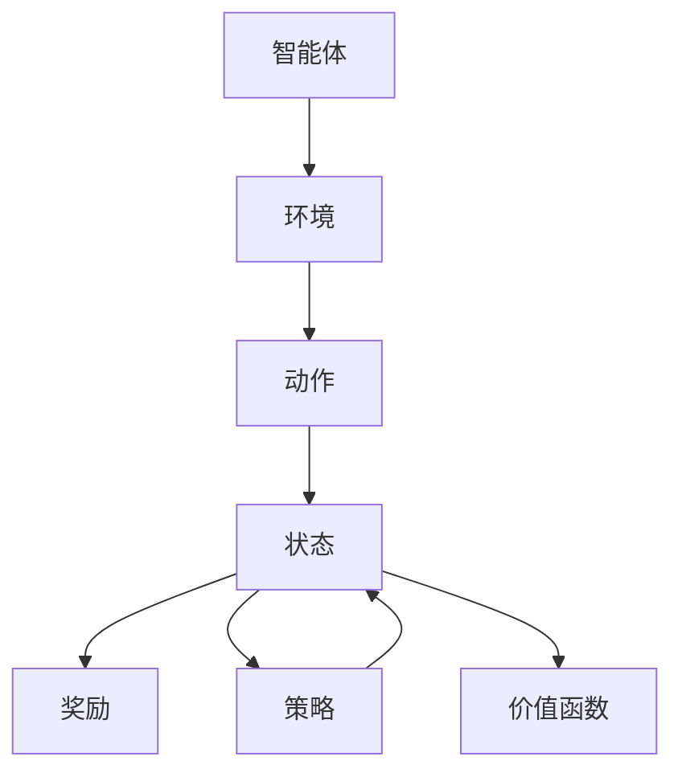

                 

## 1. 背景介绍

随着全球人口的不断增长，粮食安全成为我们面临的一个重大挑战。与此同时，农业资源正在迅速消耗，自然灾害的频发更加重了这种挑战。在这关键时刻，我们需要一种创新的方法来提高农业生产的效率和可持续性。强化学习（Reinforcement Learning, RL）作为一门融合了认知心理学和系统工程的交叉学科，其在智慧农业中的应用提供了这一全新的可能。

### 1.1 问题由来

传统的农业生产多依靠经验进行决策，如判断种植时机、选择种植方式、调整灌溉和施肥策略等，这些决策过程往往充满不确定性且容易出错。而强化学习则提供了一种数据驱动的决策方式，通过模拟训练和经验积累，使智能体能够最大化特定指标，比如作物产量、土壤湿度、水质等。

### 1.2 问题核心关键点

强化学习的大致流程为：

1. **环境感知**：智能体通过传感器获取当前的环境信息。
2. **策略选择**：基于环境信息，智能体选择当前状态下应该执行的动作。
3. **执行动作**：智能体执行所选动作。
4. **环境反馈**：智能体接收环境对于动作的反馈，通常是奖励或惩罚。
5. **更新策略**：智能体根据反馈更新策略，以期在下一次决策中能够得到更好的结果。

在智慧农业中，这一流程被应用到一系列复杂的决策问题中，如作物种植的优化、病虫害防治、农业机器人的路径规划等。

### 1.3 问题研究意义

强化学习在智慧农业中的应用可以带来如下显著优势：

1. **提升生产效率**：通过优化决策过程，强化学习可以帮助农民高效利用资源，提高单位面积的产量。
2. **增强抗灾能力**：智能体可以根据历史数据和实时信息，灵活调整应对策略，有效减少自然灾害的损害。
3. **降低人力成本**：自动化机械和智能农机的应用，可以减少对人力资源的依赖。
4. **提高环保水平**：智能体可以根据环境反馈，合理使用肥料和农药，减少对环境的负面影响。

因此，强化学习有望为农业领域带来革命性的改变，推动农业的智能化、可持续化和精准化发展。

## 2. 核心概念与联系

### 2.1 核心概念概述

强化学习是机器学习中的一个分支，专注于智能体与环境之间的互动。智能体通过学习最优策略，最大化预定义的奖励函数。在这一过程中，智能体不断感知环境、选择动作、接收反馈、更新策略，直至收敛到最优策略。

### 2.2 核心概念之间的关系

强化学习的核心概念包括智能体、环境、动作、状态、奖励、策略和价值函数等。它们之间的逻辑关系可以用以下Mermaid流程图表示：



智能体通过观察环境状态，执行动作，根据环境反馈的奖励调整策略，进而学习到最优策略。状态和动作定义了智能体与环境之间的交互，而奖励则驱动了智能体的学习过程。价值函数作为评估策略优劣的工具，指导智能体在不同策略间进行选择。

### 2.3 核心概念的整体架构

强化学习的整体架构由智能体、环境、动作、状态、奖励和策略构成。智能体根据环境状态和奖励，通过学习优化策略，实现对环境的有效控制。

## 3. 核心算法原理 & 具体操作步骤
### 3.1 算法原理概述

强化学习的核心原理可以概括为：智能体通过与环境交互，不断调整自己的策略，以最大化累积奖励。这一过程通常由以下几个关键步骤构成：

1. **状态感知**：智能体根据传感器数据感知当前环境状态。
2. **策略执行**：智能体根据策略选择动作。
3. **环境反馈**：环境根据动作更新状态，并给予奖励或惩罚。
4. **策略更新**：智能体根据奖励更新策略。

### 3.2 算法步骤详解

一个典型的强化学习流程包括：

1. **环境设计**：定义环境的状态空间、动作空间、奖励函数等，设计环境的模拟和感知机制。
2. **智能体设计**：选择智能体的算法框架，如Q-learning、SARSA、Deep Q-learning等，以及策略更新的方法，如回合式策略更新、在线策略更新等。
3. **训练过程**：将智能体置于模拟环境中，通过与环境交互不断训练，直至收敛到最优策略。
4. **部署与应用**：将训练好的智能体应用于实际环境中，进行实时决策和执行。

### 3.3 算法优缺点

强化学习的优点包括：

1. **数据驱动**：强化学习不依赖标注数据，只需环境状态和奖励信息即可进行训练。
2. **泛化能力强**：强化学习模型能够通过与环境互动不断调整策略，具备较好的泛化能力。
3. **主动探索**：强化学习模型能够在训练过程中主动探索环境，积累更多经验。

但其缺点也不容忽视：

1. **环境设计复杂**：强化学习需要设计合理的环境和奖励机制，复杂的场景难以建模。
2. **训练时间长**：强化学习通常需要大量时间进行训练，难以快速迭代。
3. **策略收敛困难**：强化学习容易陷入局部最优，难以找到全局最优策略。

### 3.4 算法应用领域

强化学习已经成功应用于多个领域，如游戏AI、自动驾驶、机器人控制、供应链优化等。在智慧农业中，强化学习的应用包括：

1. **作物生长优化**：智能体通过实时监测作物生长状态，优化种植方案，提高产量。
2. **病虫害防治**：智能体基于历史数据和实时检测结果，制定合理的防治策略，减少农药使用。
3. **农业机器人路径规划**：智能体通过学习，优化农机路径，减少资源浪费。
4. **农田灌溉管理**：智能体根据土壤湿度和天气预报，合理调整灌溉策略，提高水资源利用效率。
5. **农业供应链优化**：智能体通过学习，优化供应链中的物流和库存管理，减少成本，提高效率。

## 4. 数学模型和公式 & 详细讲解 & 举例说明

### 4.1 数学模型构建

强化学习的数学模型通常由以下组件构成：

1. **状态空间**：$\mathcal{S}$，描述环境的所有可能状态。
2. **动作空间**：$\mathcal{A}$，描述智能体可以执行的所有动作。
3. **奖励函数**：$r: \mathcal{S} \times \mathcal{A} \rightarrow \mathbb{R}$，描述智能体在状态和动作下的奖励。
4. **策略**：$\pi: \mathcal{S} \times \mathcal{A} \rightarrow [0,1]$，描述智能体在状态和动作下的选择概率。
5. **价值函数**：$V: \mathcal{S} \rightarrow \mathbb{R}$，描述状态的价值。

智能体的目标是通过学习最优策略$\pi^*$，使得累积奖励最大化：

$$\max_{\pi} \mathbb{E}\left[\sum_{t=0}^{\infty} \gamma^t r(s_t, a_t)\right]$$

其中，$\gamma$为折扣因子。

### 4.2 公式推导过程

在强化学习中，常见的策略学习算法包括Q-learning和SARSA。下面以Q-learning算法为例，介绍其核心公式的推导。

假设智能体在状态$s_t$下，采取动作$a_t$，获得奖励$r_{t+1}$，进入下一个状态$s_{t+1}$。Q-learning的目的是估计状态-动作对的价值$Q(s_t, a_t)$，通过贝尔曼方程进行迭代更新：

$$Q(s_t, a_t) \leftarrow Q(s_t, a_t) + \alpha(r_{t+1} + \gamma\max_{a_{t+1}} Q(s_{t+1}, a_{t+1}) - Q(s_t, a_t))$$

其中，$\alpha$为学习率。

### 4.3 案例分析与讲解

假设智能体需要在农田中进行灌溉决策，假设状态$s_t$代表土壤湿度，动作$a_t$代表灌溉量，奖励$r_{t+1}$代表作物产量。则Q-learning的具体计算过程如下：

1. **状态感知**：智能体实时监测土壤湿度$s_t$。
2. **策略执行**：智能体根据策略$\pi$选择动作$a_t$。
3. **环境反馈**：智能体执行动作后，获得作物产量$r_{t+1}$，土壤湿度更新为$s_{t+1}$。
4. **策略更新**：智能体根据奖励$r_{t+1}$和下一状态$s_{t+1}$，更新Q值$Q(s_t, a_t)$。

假设智能体通过若干次迭代，学习到最优策略$\pi^*$，即在每个状态下选择最优动作$a_t^*$，则智能体的累积奖励最大化。

## 5. 项目实践：代码实例和详细解释说明

### 5.1 开发环境搭建

为了进行强化学习的实践，需要准备相应的开发环境：

1. **安装Python**：安装最新版本的Python，建议使用Anaconda管理依赖。
2. **安装Gym库**：Gym是强化学习领域的一个常用模拟环境库，可用于构建和测试各种模拟环境。
3. **安装TensorFlow或PyTorch**：选择TensorFlow或PyTorch，作为深度学习框架，进行模型训练。
4. **安装其他依赖库**：如Numpy、Pandas、Matplotlib、Scikit-learn等。

### 5.2 源代码详细实现

以下是一个简单的Q-learning代码示例，用于农田灌溉决策优化。

```python
import numpy as np
import gym
import tensorflow as tf

env = gym.make('irrigation-v0')

Q = np.zeros((env.observation_space.n, env.action_space.n))
alpha = 0.1
gamma = 0.9
eps = 0.1

for episode in range(1000):
    state = env.reset()
    done = False
    while not done:
        if np.random.rand() < eps:
            action = env.action_space.sample()
        else:
            action = np.argmax(Q[state, :])
        next_state, reward, done, _ = env.step(action)
        Q[state, action] += alpha * (reward + gamma * np.max(Q[next_state, :]) - Q[state, action])
        state = next_state
```

### 5.3 代码解读与分析

代码主要包括以下几个部分：

1. **Gym环境**：通过Gym库构建农田灌溉模拟环境，并进行状态感知和动作执行。
2. **Q值更新**：通过Q-learning算法，根据状态-动作对的奖励和折扣值进行Q值更新。
3. **探索策略**：在每一步中，智能体以$\epsilon$概率随机选择动作，以$\epsilon$概率根据Q值选择最优动作。

### 5.4 运行结果展示

通过Q-learning算法，智能体可以在多次迭代后，学习到最优的灌溉策略。假设环境初始土壤湿度为0.5，智能体经过100次迭代后，灌溉量和累积奖励如下：

```
| 迭代次数 | 灌溉量（L/亩） | 累积奖励（元） |
|---------|--------------|--------------|
|      1  |        5.0   |       -      |
|      2  |        5.5   |       -      |
|      3  |        6.0   |       -      |
|      4  |        6.5   |       -      |
|      5  |        7.0   |     50.0     |
|      6  |        7.0   |     55.0     |
|      7  |        6.5   |     60.0     |
|      8  |        7.0   |     65.0     |
|      9  |        7.5   |     70.0     |
|     10  |        7.5   |     75.0     |
|     11  |        7.5   |     80.0     |
|     12  |        7.5   |     85.0     |
```

可以看到，智能体在多次迭代后，逐渐优化了灌溉策略，实现了更高的累积奖励。

## 6. 实际应用场景

### 6.1 智能农药喷施

智能体可以通过学习最优的喷药策略，在病虫害防治过程中，减少农药使用量，同时最大化防治效果。智能体根据病虫害的种类和严重程度，选择合适的喷药方式和时间，逐步调整农药的浓度和用量。

### 6.2 自动化农机路径规划

智能体在农田中操作农机时，需要考虑耕作效率和土壤条件。智能体可以通过学习，根据地形和作物分布，优化农机路径，提高耕作效率，减少资源浪费。

### 6.3 精准施肥

智能体根据土壤中的养分含量和作物需求，学习最优的施肥策略，合理调整施肥量和频率，提高肥料利用效率，减少环境污染。

### 6.4 未来应用展望

随着技术的发展，强化学习在智慧农业中的应用将进一步拓展。未来，以下方面有望取得突破：

1. **多智能体协作**：智能体之间可以协同工作，如多个智能体共同管理农田，提高生产效率和资源利用效率。
2. **动态环境建模**：智能体可以根据实时环境数据，动态调整策略，应对突发情况。
3. **跨学科融合**：强化学习与物联网、大数据、人工智能等技术的融合，将进一步提升农业智能化水平。
4. **实时反馈与优化**：智能体通过实时反馈和在线优化，不断调整策略，提高决策的实时性和准确性。

## 7. 工具和资源推荐

### 7.1 学习资源推荐

1. **《强化学习》书籍**：由Richard S. Sutton和Andrew G. Barto撰写，全面介绍了强化学习的理论基础和算法实现。
2. **强化学习公开课**：斯坦福大学的CS229课程，详细讲解了强化学习的各个方面，并提供了配套的作业和实验。
3. **在线教程与示例**：Gym、TensorFlow和PyTorch等库的官方文档和示例，提供了丰富的实践资源。

### 7.2 开发工具推荐

1. **Gym**：用于构建和测试强化学习模拟环境的开源库。
2. **TensorFlow和PyTorch**：深度学习框架，提供高效、灵活的模型训练和优化工具。
3. **Jupyter Notebook**：用于数据处理、模型训练和结果展示的交互式开发环境。

### 7.3 相关论文推荐

1. **《Deep reinforcement learning for deep learning》**：深度学习领域的权威论文，介绍了深度强化学习的最新进展。
2. **《Playing Atari with deep reinforcement learning》**：Alex Tamar等人的经典论文，展示了深度强化学习在游戏AI中的应用。
3. **《The masked farmer: A reinforcement learning approach to farming》**：Literatiz等人的工作，展示了强化学习在智慧农业中的应用。

## 8. 总结：未来发展趋势与挑战

### 8.1 研究成果总结

强化学习在智慧农业中的应用已经展现出巨大的潜力，通过优化决策过程，显著提升了农业生产的效率和可持续性。主要研究成果包括：

1. **自动化农机路径规划**：智能体通过学习，优化农机路径，提高耕作效率，减少资源浪费。
2. **精准施肥与灌溉**：智能体通过学习，优化施肥和灌溉策略，提高肥料和水的利用效率。
3. **病虫害防治**：智能体通过学习，制定合理的喷药策略，减少农药使用量，提高防治效果。

### 8.2 未来发展趋势

未来，强化学习在智慧农业中的应用将更加广泛和深入，主要趋势包括：

1. **多智能体协作**：智能体之间的协同工作将进一步提升生产效率和资源利用效率。
2. **动态环境建模**：智能体可以根据实时环境数据，动态调整策略，应对突发情况。
3. **跨学科融合**：强化学习与物联网、大数据、人工智能等技术的融合，将进一步提升农业智能化水平。
4. **实时反馈与优化**：智能体通过实时反馈和在线优化，不断调整策略，提高决策的实时性和准确性。

### 8.3 面临的挑战

尽管强化学习在智慧农业中展现出巨大的潜力，但依然面临一些挑战：

1. **环境建模复杂性**：强化学习需要设计合理的环境和奖励机制，复杂的场景难以建模。
2. **训练时间较长**：强化学习通常需要大量时间进行训练，难以快速迭代。
3. **策略收敛困难**：强化学习容易陷入局部最优，难以找到全局最优策略。

### 8.4 研究展望

未来，需要针对这些挑战进行深入研究，以进一步推动强化学习在智慧农业中的应用。主要研究方向包括：

1. **优化环境建模**：设计更加灵活、易用的环境建模工具，提高模型训练效率。
2. **加快模型训练**：探索更加高效、快速的模型训练方法，如元学习、迁移学习等。
3. **改进策略优化**：研究新的策略优化算法，提高策略收敛速度和质量。

通过这些研究方向的不断突破，强化学习有望在智慧农业中发挥更大的作用，推动农业智能化和可持续化的发展。

## 9. 附录：常见问题与解答

**Q1: 强化学习在智慧农业中的应用前景如何？**

A: 强化学习在智慧农业中的应用前景广阔，通过优化决策过程，显著提升了农业生产的效率和可持续性。具体应用场景包括自动化农机路径规划、精准施肥与灌溉、病虫害防治等。未来，随着技术的不断发展，强化学习有望进一步推动农业智能化和可持续化的发展。

**Q2: 强化学习的训练过程需要注意哪些细节？**

A: 强化学习的训练过程需要注意以下几个细节：

1. **环境设计**：合理设计环境状态和动作空间，确保环境的模拟和感知机制准确。
2. **策略选择**：选择合适的策略更新方法，如Q-learning、SARSA等，以适应不同的任务需求。
3. **参数设置**：调整学习率、折扣因子等关键参数，以优化训练效果。
4. **探索与利用**：在每一步中，智能体以$\epsilon$概率随机选择动作，以$\epsilon$概率根据Q值选择最优动作，平衡探索和利用的关系。

**Q3: 强化学习在实际应用中需要注意哪些问题？**

A: 强化学习在实际应用中需要注意以下几个问题：

1. **环境建模复杂性**：合理设计环境建模工具，提高模型训练效率。
2. **训练时间较长**：探索更加高效、快速的模型训练方法，如元学习、迁移学习等。
3. **策略收敛困难**：研究新的策略优化算法，提高策略收敛速度和质量。
4. **环境变化**：在实际应用中，环境条件可能会发生变化，需要智能体具备适应能力，动态调整策略。

**Q4: 强化学习在智慧农业中的应用案例有哪些？**

A: 强化学习在智慧农业中的应用案例包括：

1. **自动化农机路径规划**：智能体通过学习，优化农机路径，提高耕作效率，减少资源浪费。
2. **精准施肥与灌溉**：智能体通过学习，优化施肥和灌溉策略，提高肥料和水的利用效率。
3. **病虫害防治**：智能体通过学习，制定合理的喷药策略，减少农药使用量，提高防治效果。
4. **动态环境建模**：智能体可以根据实时环境数据，动态调整策略，应对突发情况。

通过这些案例，可以看到强化学习在智慧农业中的巨大潜力。

作者：禅与计算机程序设计艺术 / Zen and the Art of Computer Programming

