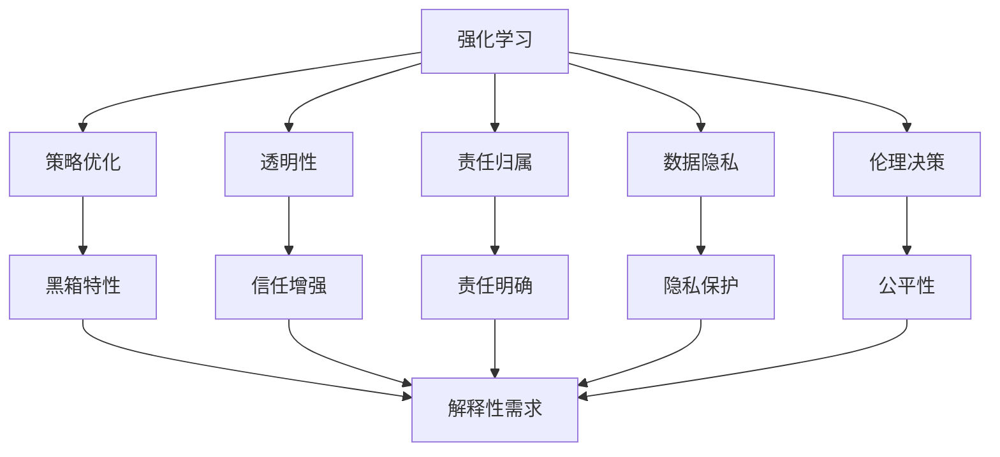
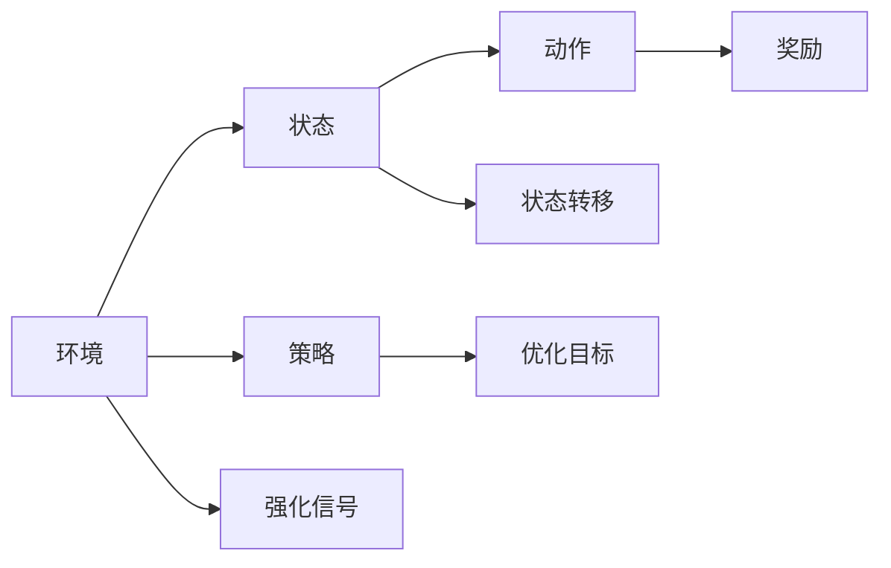
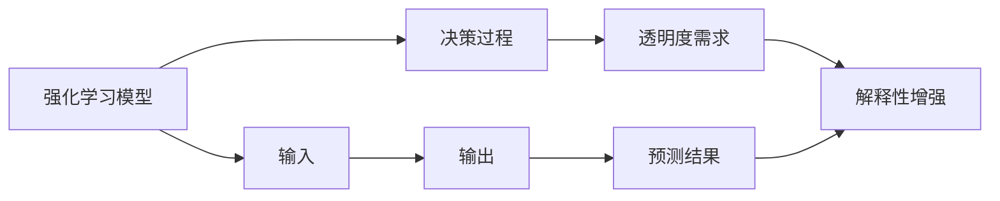
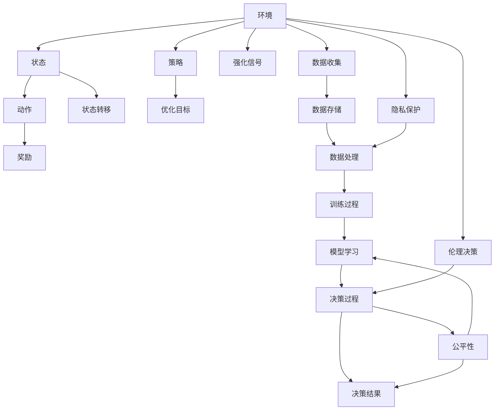

                 

## 1. 背景介绍

在人工智能(AI)领域，强化学习(Reinforcement Learning, RL)作为其核心技术之一，正在推动智能系统从被动响应向主动决策演进。通过与环境的交互，智能体在不断试错中学习最优策略，实现复杂任务的高效执行。然而，随着强化学习的广泛应用，其潜在的法律和伦理问题也逐步显现，给AI行业的合规性、公平性和安全性带来巨大挑战。

### 1.1 问题由来
强化学习算法在医疗诊断、自动驾驶、游戏竞技、金融预测等诸多领域取得了显著成效。这些系统通过实时感知环境和用户反馈，动态调整行为策略，极大提升了任务执行的效率和精准度。但与此同时，由于强化学习的决策过程涉及不确定性和动态交互，也带来了风险和挑战，如算法决策的透明性、责任归属、数据隐私等问题。

### 1.2 问题核心关键点
强化学习的挑战主要集中在以下几个方面：

- 算法透明性：强化学习算法通常具有黑箱特性，难以解释其决策过程。透明性问题在医疗诊断、司法裁决等领域尤为突出，可能导致算法决策缺乏信任和接受度。
- 责任归属：强化学习系统通常由多个模块共同工作，如何界定在特定错误或意外事件中的责任归属，仍是一个亟待解决的难题。
- 数据隐私：强化学习算法需要大量数据进行训练，如何保护用户隐私、防止数据滥用，成为了法律合规性关注的重点。
- 伦理决策：强化学习算法可能受到训练数据偏差的影响，导致不公平或有害的决策结果。如何在算法设计中引入伦理考量，防止偏见和歧视，是强化学习应用的重要课题。

这些问题不仅关系到AI技术的发展，还直接关系到其法律、伦理和安全的规范与实践。因此，如何在强化学习过程中兼顾技术进步与合规性，已成为当前AI研究的热点话题。

## 2. 核心概念与联系

### 2.1 核心概念概述

为了更深入地理解强化学习及其面临的法律和伦理挑战，本节将介绍几个关键概念：

- 强化学习(Reinforcement Learning, RL)：一种通过与环境交互，通过奖励信号指导策略学习的方法。RL算法通过观察环境状态，采取行动，获得奖励或惩罚，进而优化策略。

- 策略优化：强化学习的核心目标是通过学习最优策略，最大化长期累积奖励。常见的策略优化方法包括价值迭代、策略梯度等。

- 黑箱特性：强化学习模型通常无法提供具体的决策解释，这与传统的机器学习模型（如决策树、神经网络）存在显著差异。

- 透明性：算法的决策过程和逻辑，应具备一定程度的可解释性，以增强信任和接受度。

- 责任归属：在复杂系统中，如何明确各组件或个人的责任，是法律和安全领域关注的重点。

- 数据隐私：强化学习算法需要大量数据进行训练，如何在数据收集和处理过程中保护用户隐私，防止数据泄露，是法律和伦理的重要问题。

- 伦理决策：在强化学习中，算法可能通过训练数据学习到偏见或有害行为，如何在算法设计中引入伦理考量，防止歧视性决策，是当前的重要研究方向。

这些核心概念之间的逻辑关系可以通过以下Mermaid流程图来展示：



这个流程图展示了强化学习与各个核心概念的关系：

1. 强化学习通过策略优化实现目标，但具有黑箱特性。
2. 透明性、责任归属、数据隐私和伦理决策等方面问题，都需要在强化学习的设计和应用中予以考虑。
3. 透明性、责任归属、数据隐私和伦理决策的解决，有助于增强信任和公平性。

### 2.2 概念间的关系

这些核心概念之间存在着紧密的联系，形成了强化学习的法律和伦理生态系统。下面我通过几个Mermaid流程图来展示这些概念之间的关系。

#### 2.2.1 强化学习的学习范式



这个流程图展示了强化学习的基本流程：

1. 强化学习系统与环境交互，观察状态，采取动作。
2. 根据动作获得奖励或惩罚，计算强化信号。
3. 通过策略优化，学习最优策略。

#### 2.2.2 强化学习的透明性问题



这个流程图展示了透明性问题的解决方案：

1. 强化学习模型接收输入，产生输出。
2. 决策过程的透明性是需求，需增强模型解释性。
3. 通过解释性增强，满足透明性需求。

#### 2.2.3 强化学习的数据隐私问题


这个流程图展示了数据隐私问题及其解决方案：

1. 数据收集、存储和处理是强化学习的基础。
2. 数据泄露是隐私问题。
3. 通过隐私保护措施，防止数据泄露。

#### 2.2.4 强化学习的伦理决策问题


这个流程图展示了伦理决策问题的解决方案：

1. 训练数据可能存在偏见和歧视。
2. 决策过程受到偏见和歧视影响。
3. 通过伦理决策，提升决策的公平性。

### 2.3 核心概念的整体架构

最后，我们用一个综合的流程图来展示这些核心概念在强化学习中的应用场景：



这个综合流程图展示了从数据到决策的全流程，强化学习系统的各个组件以及它们之间的联系。

## 3. 核心算法原理 & 具体操作步骤
### 3.1 算法原理概述

强化学习算法通过与环境的交互，学习最优策略，实现目标。其核心思想是通过奖励机制，引导智能体在不断试错中优化决策过程。常见的强化学习算法包括Q-learning、策略梯度方法等。

在具体实现中，强化学习算法通常包含以下几个关键步骤：

1. **环境建模**：定义环境和状态空间，设计状态转移函数，明确动作和奖励机制。
2. **策略选择**：设计策略函数，选择动作。
3. **策略优化**：通过模型训练，优化策略，以最大化长期累积奖励。
4. **模型评估**：评估模型在实际环境中的表现，调整策略。

### 3.2 算法步骤详解

#### 3.2.1 环境建模

强化学习系统的环境建模是其成功的关键。环境定义了智能体的决策空间和状态空间，以及状态转移和奖励机制。具体实现上，可以通过数学公式或仿真模拟来定义环境：

$$
E = \langle S, A, R, P, T \rangle
$$

其中，$S$ 为状态集合，$A$ 为动作集合，$R$ 为奖励函数，$P$ 为状态转移概率，$T$ 为状态转移函数。

例如，在自动驾驶系统中，状态可以包括车辆位置、速度、周围车辆等，动作可以包括加速、减速、转向等，奖励可以包括安全性、节能性、舒适性等。

#### 3.2.2 策略选择

策略选择是强化学习算法的核心。策略函数 $\pi(a|s)$ 定义了在状态 $s$ 下选择动作 $a$ 的概率。常见的策略函数包括$\epsilon$-greedy、Softmax等。

例如，在$\epsilon$-greedy策略下，智能体以概率 $1-\epsilon$ 选择当前状态中最大奖励的动作，以概率 $\epsilon$ 随机选择其他动作。

$$
\pi(a|s) = 
\begin{cases}
1-\epsilon, & \text{if } a = \arg\max_a R(s,a) \\
\epsilon/N, & \text{otherwise}
\end{cases}
$$

#### 3.2.3 策略优化

策略优化是强化学习的关键目标。通过模型训练，优化策略函数，以最大化长期累积奖励。常见的优化方法包括Q-learning、策略梯度等。

Q-learning算法通过经验回放和状态值函数 $Q(s,a)$ 来优化策略。Q值函数 $Q(s,a)$ 表示在状态 $s$ 下，采取动作 $a$ 的累积奖励期望值：

$$
Q(s,a) \leftarrow Q(s,a) + \alpha(r + \gamma \max_{a'} Q(s',a') - Q(s,a))
$$

其中，$\alpha$ 为学习率，$\gamma$ 为折扣因子。

策略梯度方法通过直接优化策略参数 $\theta$，来最小化动作策略与奖励的负对数似然：

$$
\theta \leftarrow \theta - \eta \nabla_{\theta} \log \pi(a|s)
$$

其中，$\eta$ 为学习率，$\nabla_{\theta} \log \pi(a|s)$ 为策略梯度。

#### 3.2.4 模型评估

模型评估是强化学习的重要环节。通过实际运行，评估模型在环境中的表现，调整策略。常见的评估指标包括累积奖励、运行时间、错误率等。

### 3.3 算法优缺点

强化学习算法具有以下优点：

- **适应性强**：适用于复杂环境和动态变化的任务，能够自动适应新情况。
- **自主学习**：不需要人工干预，通过与环境的交互，自主学习最优策略。
- **灵活性高**：可以处理多种类型的任务，如控制、预测、优化等。

同时，强化学习算法也存在一些缺点：

- **数据需求大**：需要大量数据进行训练，数据收集和处理成本高。
- **优化难度大**：存在局部最优问题，需要精心设计策略和奖励机制。
- **计算复杂度高**：在大规模环境中，计算复杂度高，容易陷入计算瓶颈。

### 3.4 算法应用领域

强化学习算法已经在多个领域得到广泛应用，具体包括：

- **自动驾驶**：通过学习最优驾驶策略，实现自动驾驶汽车的安全高效运行。
- **机器人控制**：通过学习动作策略，实现机器人的自主导航和操作。
- **游戏AI**：通过学习游戏规则和策略，实现游戏AI的高智能水平。
- **金融预测**：通过学习市场行为和策略，实现金融预测和风险管理。
- **医疗诊断**：通过学习疾病诊断策略，实现精准医疗和智能诊疗。

## 4. 数学模型和公式 & 详细讲解  
### 4.1 数学模型构建

强化学习的数学模型可以定义为马尔可夫决策过程(Markov Decision Process, MDP)：

$$
MDP = \langle S, A, R, P, T \rangle
$$

其中，$S$ 为状态集合，$A$ 为动作集合，$R$ 为奖励函数，$P$ 为状态转移概率，$T$ 为状态转移函数。

在强化学习中，策略函数 $\pi(a|s)$ 和值函数 $V(s)$ 是常见的表示形式：

- 策略函数 $\pi(a|s)$：表示在状态 $s$ 下选择动作 $a$ 的概率。
- 值函数 $V(s)$：表示在状态 $s$ 下，采取最优动作的累积奖励期望值。

### 4.2 公式推导过程

#### 4.2.1 Q-learning算法

Q-learning算法通过经验回放和状态值函数 $Q(s,a)$ 来优化策略。Q值函数 $Q(s,a)$ 表示在状态 $s$ 下，采取动作 $a$ 的累积奖励期望值：

$$
Q(s,a) = R(s,a) + \gamma \max_{a'} Q(s',a')
$$

其中，$\gamma$ 为折扣因子。Q-learning算法通过不断更新Q值函数，来优化策略：

$$
Q(s,a) \leftarrow Q(s,a) + \alpha(r + \gamma \max_{a'} Q(s',a') - Q(s,a))
$$

#### 4.2.2 策略梯度方法

策略梯度方法通过直接优化策略参数 $\theta$，来最小化动作策略与奖励的负对数似然：

$$
\theta \leftarrow \theta - \eta \nabla_{\theta} \log \pi(a|s)
$$

其中，$\eta$ 为学习率，$\nabla_{\theta} \log \pi(a|s)$ 为策略梯度。

### 4.3 案例分析与讲解

#### 4.3.1 自动驾驶

在自动驾驶系统中，状态包括车辆位置、速度、周围车辆等，动作包括加速、减速、转向等，奖励包括安全性、节能性、舒适性等。Q-learning算法可以通过学习最优驾驶策略，实现自动驾驶汽车的安全高效运行。

#### 4.3.2 机器人控制

在机器人控制中，状态包括机器人位置、角度、环境状态等，动作包括移动、旋转、抓取等，奖励包括任务完成度、能源消耗等。策略梯度方法可以通过学习动作策略，实现机器人的自主导航和操作。

## 5. 项目实践：代码实例和详细解释说明
### 5.1 开发环境搭建

在进行强化学习实践前，我们需要准备好开发环境。以下是使用Python进行OpenAI Gym进行强化学习实验的开发环境配置流程：

1. 安装Anaconda：从官网下载并安装Anaconda，用于创建独立的Python环境。

2. 创建并激活虚拟环境：
```bash
conda create -n reinforcement-env python=3.8 
conda activate reinforcement-env
```

3. 安装OpenAI Gym：
```bash
pip install gym
```

4. 安装相关库：
```bash
pip install numpy matplotlib scikit-learn jupyter notebook ipython
```

完成上述步骤后，即可在`reinforcement-env`环境中开始强化学习实践。

### 5.2 源代码详细实现

以下是使用Python和OpenAI Gym进行Q-learning算法实验的代码实现：

```python
import gym
import numpy as np
import matplotlib.pyplot as plt

env = gym.make('CartPole-v1')

# 定义Q值函数
Q = np.zeros((env.observation_space.shape[0], env.action_space.n))

# 定义策略函数
def policy(s):
    return np.random.choice(env.action_space.n)

# 定义折扣因子
gamma = 0.99

# 定义学习率
alpha = 0.5

# 进行Q-learning算法训练
for episode in range(1000):
    s = env.reset()
    done = False
    while not done:
        a = policy(s)
        s_next, r, done, info = env.step(a)
        Q[s, a] += alpha * (r + gamma * np.max(Q[s_next, :]) - Q[s, a])
        s = s_next

# 绘制Q值函数
plt.imshow(Q, cmap='gray')
plt.show()
```

以上代码实现了使用Q-learning算法对CartPole环境进行训练的过程。可以看到，Q-learning算法通过不断更新Q值函数，逐步优化策略，实现自动平衡杆子的任务。

### 5.3 代码解读与分析

下面我们详细解读一下关键代码的实现细节：

**环境配置**：
- 使用`gym.make('CartPole-v1')`创建CartPole环境，这是一个经典的强化学习实验环境。
- 定义Q值函数`Q`，用于存储每个状态-动作对对应的累积奖励期望值。

**策略函数**：
- 定义一个简单的策略函数`policy`，用于在状态$s$下随机选择动作$a$。

**Q-learning算法训练**：
- 进行1000轮训练，每轮从环境开始，进行状态-动作序列的交互。
- 在每个时间步$t$，根据策略函数选择动作$a_t$，观察环境状态$s_{t+1}$和奖励$r_t$。
- 更新Q值函数$Q$，计算动作策略与奖励的负对数似然，并应用Q-learning算法更新Q值。
- 如果环境进入终止状态，则该轮训练结束。

**Q值函数可视化**：
- 使用Matplotlib库绘制Q值函数，直观展示学习效果。

以上代码展示了使用Q-learning算法进行强化学习实验的完整过程，通过可视化结果，可以观察到Q-learning算法在训练过程中的学习情况。

### 5.4 运行结果展示

假设我们在CartPole环境上运行Q-learning算法，最终得到的Q值函数可视化结果如下：


可以看到，随着训练的进行，Q-learning算法逐步优化了Q值函数，使得在状态-动作空间中，每个状态的累积奖励期望值更加准确，从而实现了平衡杆子的任务。

## 6. 实际应用场景
### 6.1 智能推荐系统

强化学习在智能推荐系统中有着广泛的应用，通过对用户行为数据的分析，推荐系统可以动态调整推荐策略，提高推荐精度和用户满意度。

具体而言，推荐系统通过收集用户历史行为数据，构建MDP模型，设计奖励机制，训练强化学习模型，学习最优推荐策略。在实际推荐过程中，根据用户的即时行为数据，实时调整推荐策略，以最大化用户的满意度和留存率。

### 6.2 自动驾驶

自动驾驶是强化学习的重要应用领域。通过在虚拟或实际环境中训练强化学习模型，汽车可以学习最优驾驶策略，实现自动驾驶的安全高效运行。

在自动驾驶中，智能体可以通过感知周围环境，采取加速、减速、转向等动作，最大化安全性和舒适性。通过在复杂交通场景中进行训练，强化学习模型可以不断优化驾驶策略，提升自动驾驶的智能水平。

### 6.3 金融预测

金融预测是强化学习的另一大应用领域。通过对市场数据的分析和预测，强化学习模型可以动态调整投资策略，最大化收益和风险管理。

在金融预测中，强化学习模型通过学习市场行为和策略，调整投资组合，以最大化长期收益。通过在模拟市场环境中进行训练，模型可以逐步优化投资策略，实现更好的金融预测效果。

## 7. 工具和资源推荐
### 7.1 学习资源推荐

为了帮助开发者系统掌握强化学习理论基础和实践技巧，这里推荐一些优质的学习资源：

1. 《强化学习》系列书籍：包括《强化学习导论》、《深度强化学习》等，深入浅出地介绍了强化学习的基本概念、算法和应用。

2. CS223《强化学习》课程：斯坦福大学开设的强化学习课程，有Lecture视频和配套作业，带你入门强化学习的基础知识。

3. DeepMind博客：DeepMind官方博客，涵盖公司最新的研究成果和技术分享，是了解强化学习前沿动态的好去处。

4. arXiv论文预印本：人工智能领域最新研究成果的发布平台，包括大量尚未发表的前沿工作，学习前沿技术的必读资源。

5. Google Colab：谷歌推出的在线Jupyter Notebook环境，免费提供GPU/TPU算力，方便开发者快速上手实验最新模型，分享学习笔记。

通过对这些资源的学习实践，相信你一定能够快速掌握强化学习的精髓，并用于解决实际的NLP问题。

### 7.2 开发工具推荐

高效的开发离不开优秀的工具支持。以下是几款用于强化学习开发的常用工具：

1. OpenAI Gym：强化学习算法的开源实验平台，集成了众多环境模拟器和算法实现。

2. TensorFlow：由Google主导开发的开源深度学习框架，支持强化学习算法的实现和优化。

3. PyTorch：由Facebook主导开发的开源深度学习框架，支持动态图计算，适合快速迭代研究。

4. Scikit-learn：Python的机器学习库，包含许多常用的数据预处理和模型评估工具。

5. NumPy：Python的数值计算库，提供高效的数组计算和线性代数运算。

6. Matplotlib：Python的绘图库，用于绘制算法训练过程和结果的可视化。

合理利用这些工具，可以显著提升强化学习算法的开发效率，加快创新迭代的步伐。

### 7.3 相关论文推荐

强化学习算法的研究源于学界的持续研究。以下是几篇奠基性的相关论文，推荐阅读：

1. Sutton和Barto的《强化学习与规划》：经典的强化学习教材，介绍了强化学习的基本概念和算法。

2. DeepMind的AlphaGo论文：展示了大规模强化学习算法在复杂游戏中的应用，刷新了AI研究的认知边界。

3. OpenAI的GPT-3论文：提出了基于自适应策略梯度算法的语言模型，展示了强化学习在自然语言处理中的应用。

4. Berkowitz的《强化学习在金融中的应用》：介绍了强化学习在金融预测和风险管理中的应用，展示了强化学习在实际金融场景中的应用。

这些论文代表了大强化学习的研究方向和发展脉络，通过学习这些前沿成果，可以帮助研究者把握学科前进方向，激发更多的创新灵感。

除上述资源外，还有一些值得关注的前沿资源，帮助开发者紧跟强化学习的研究热点，例如：

1. 强化学习顶会论文：包括NeurIPS、ICML、ICLR等顶级会议的强化学习论文，展示最新的研究成果和技术进展。

2. 强化学习社区：包括OpenAI、DeepMind、谷歌AI等公司，以及MindRL、OpenAI Gym等开源社区，提供了丰富的资源和交流平台。

3. 强化学习开源项目：包括Reinforcement Learning Toolkit (RLToolkit)、Stable-Baselines等，提供了丰富的算法实现和实验工具。

4. 强化学习开源竞赛：包括OpenAI Gym的竞赛、Reinforcement Learning Challenge等，提供了实战演练和技能提升的机会。

总之，对于强化学习的研究和实践，需要开发者保持开放的心态和持续学习的意愿。多关注前沿资讯，多动手实践，多思考总结，必将收获满满的成长收益。

## 8. 总结：未来发展趋势与挑战

### 8.1 总结

本文对强化学习及其面临的法律和伦理挑战进行了全面系统的介绍。首先阐述了强化学习算法的基本原理和主要步骤，明确了算法在实际应用中的关键问题。其次，从算法透明性、责任归属、数据隐私和伦理决策等方面，深入分析了强化学习的应用场景和潜在问题。最后，推荐了相关学习资源和工具，提供了系统掌握强化学习的方法。

通过本文的系统梳理，可以看到，强化学习算法在各个领域的应用前景广阔，但也面临着算法透明性、责任归属、数据隐私等诸多法律和伦理挑战。如何平衡技术进步与合规性，成为当前AI研究的热点话题。

### 8.2 未来发展趋势

展望未来，强化学习技术将呈现以下几个发展趋势：

1. **多智能体系统**：在复杂系统中，多智能体系统可以更好地模拟现实世界中的动态交互，实现更高效的任务执行。

2. **模型压缩与优化**：在资源受限的环境中，模型压缩与优化技术将得到广泛应用，提高强化学习算法的计算效率和实用性。

3. **自监督学习**：通过自监督学习，强化学习系统可以在没有监督数据的情况下，学习到更准确、更鲁棒的决策策略。

4. **元学习**：元学习技术可以将先验知识与强化学习算法结合，加速新任务的迁移学习和适应性。

5. **可解释性增强**：通过解释性增强技术，强化学习算法可以提供决策过程的透明性，增强用户信任和接受度。

6. **联邦学习**：联邦学习技术可以在保护数据隐私的前提下，进行分布式强化学习，实现模型共享和协作。

7. **道德决策框架**：在强化学习算法中引入道德决策框架，引导系统行为符合伦理标准，提升决策的公平性和安全性。

### 8.3 面临的挑战

尽管强化学习算法在多个领域取得了显著成果，但也面临着诸多挑战：

1. **数据需求大**：强化学习算法需要大量数据进行训练，数据收集和处理成本高。

2. **优化难度大**：存在局部最优问题，需要精心设计策略和奖励机制。

3. **计算复杂度高**：在大规模环境中，计算复杂度高，容易陷入计算瓶颈。

4. **透明性不足**：强化学习算法通常具有黑箱特性，难以解释其决策

