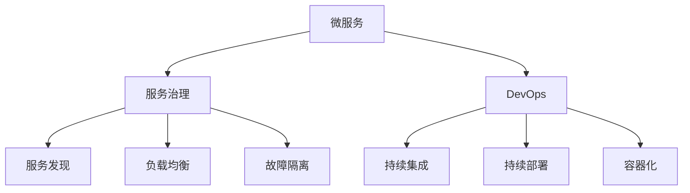
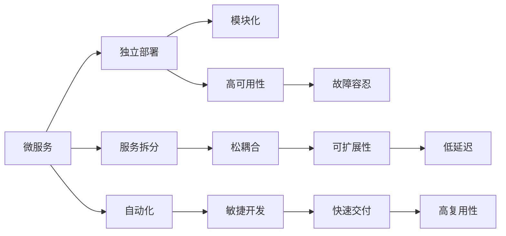
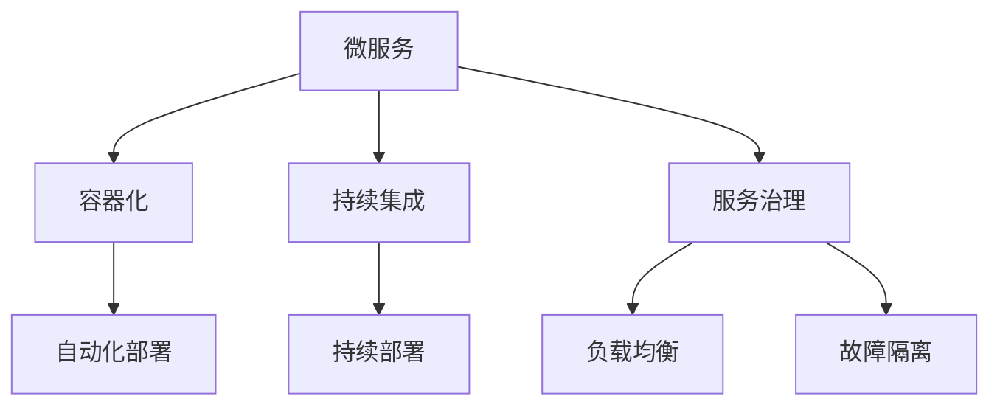

                 

# 微服务架构在系统设计中的实例

> 关键词：微服务架构, 分布式系统, 服务治理, 服务发现, 负载均衡, 故障隔离, DevOps, 容器化, 持续集成, 持续部署

## 1. 背景介绍

### 1.1 问题由来
随着互联网应用的日益复杂和用户需求的多样化，单一的单体应用架构逐渐显现出其局限性。单体应用在扩展性、维护性和复用性方面都存在严重缺陷：

- **扩展性**：单体应用难以水平扩展，每个新功能的添加都需要修改现有代码，可能引入大量Bug。
- **维护性**：单体应用的模块间耦合度高，修改某个模块可能影响其他模块，代码质量和维护成本高。
- **复用性**：单体应用难以被其他应用复用，部分功能重复开发，资源浪费。

在数字化转型的浪潮中，企业对于系统架构的灵活性、可靠性和可扩展性提出了更高要求，单体应用架构逐渐被微服务架构所替代。微服务架构通过将单体应用拆分成多个小的、独立的服务，并运用容器化、服务治理、DevOps等技术手段，解决了上述问题，得到了业界的广泛认可。

### 1.2 问题核心关键点
微服务架构是一种将应用程序拆分为多个独立服务的架构设计风格，每个服务围绕特定的业务功能运行，并作为独立部署单元。每个服务都可以独立部署、扩展、维护和复用，不受其他服务的影响。

微服务架构的关键点包括：
- **独立部署**：每个服务都可以独立部署、更新和扩展，降低了系统维护和部署的复杂度。
- **分布式系统**：服务之间通过网络通信，相互协作完成业务功能，降低了单个服务对系统的影响。
- **服务治理**：通过服务发现、负载均衡、故障隔离等手段，实现服务的高可用性和稳定性。
- **持续集成**：通过自动化测试和部署流程，快速迭代开发和交付新功能。
- **容器化**：将服务打包成容器镜像，方便部署和扩展。

## 2. 核心概念与联系

### 2.1 核心概念概述

为了更好地理解微服务架构的原理和实践，我们首先介绍几个核心概念：

- **微服务（Microservice）**：围绕特定业务功能的独立服务，作为微服务架构的基本组成单元。
- **服务治理（Service Governance）**：用于管理微服务之间的通信、路由、负载均衡等机制，保障服务的高可用性和稳定性。
- **DevOps（Development and Operations）**：通过自动化部署、持续集成、持续部署等技术手段，提升软件交付速度和质量，保障系统的持续迭代和快速响应市场变化。
- **容器化（Containerization）**：将应用和服务打包成容器镜像，方便管理和扩展。
- **服务发现（Service Discovery）**：在分布式系统中，通过服务发现机制，快速定位和调用其他服务。
- **负载均衡（Load Balancing）**：通过负载均衡器，合理分配请求到多个服务实例，避免单点故障和负载不均。
- **故障隔离（Fault Isolation）**：通过熔断器、限流器等机制，保障系统在高并发和故障情况下的稳定性和可用性。

这些核心概念之间的关系可以通过以下Mermaid流程图来展示：



这个流程图展示了微服务架构的核心概念及其之间的关系：

1. 微服务是架构的基本组成单元。
2. 服务治理提供了服务之间的通信和管理机制。
3. DevOps提供了自动化的开发和部署流程。
4. 容器化是部署微服务的一种高效方式。
5. 服务发现和负载均衡是服务治理的重要组成部分。
6. 故障隔离保障了服务的稳定性和可用性。

### 2.2 概念间的关系

这些核心概念之间存在着紧密的联系，形成了微服务架构的完整生态系统。下面我们通过几个Mermaid流程图来展示这些概念之间的关系。

#### 2.2.1 微服务架构的设计范式



这个流程图展示了微服务架构的设计范式，即通过服务拆分、松耦合、模块化等方式，实现独立部署、高可用性、快速交付等目标。

#### 2.2.2 微服务架构的部署模型



这个流程图展示了微服务架构的部署模型，即通过容器化、持续集成和持续部署等技术手段，结合服务治理的负载均衡和故障隔离机制，实现服务的快速交付和高效管理。

## 3. 核心算法原理 & 具体操作步骤

### 3.1 算法原理概述

微服务架构的核心原理是将单体应用拆分成多个独立的服务，并运用容器化、服务治理、DevOps等技术手段，解决单体应用的扩展性、维护性和复用性问题。

微服务架构通过以下步骤实现：

1. **服务拆分**：将单体应用拆分成多个独立的服务，每个服务围绕特定业务功能设计，模块间松耦合。
2. **独立部署**：每个服务独立部署和更新，减少依赖关系，降低维护成本。
3. **分布式系统**：服务之间通过网络通信，相互协作完成业务功能，提升系统的扩展性和可维护性。
4. **服务治理**：通过服务发现、负载均衡、故障隔离等手段，保障服务的高可用性和稳定性。
5. **DevOps**：通过自动化测试和部署流程，快速迭代开发和交付新功能。
6. **容器化**：将服务打包成容器镜像，方便管理和扩展。

### 3.2 算法步骤详解

#### 3.2.1 服务拆分

服务拆分是微服务架构的基础，需要根据业务功能、数据访问、用户交互等因素将单体应用拆分为多个独立的服务。

1. **功能拆分**：将复杂的功能拆分成多个小的、独立的服务。
2. **数据拆分**：将数据访问服务从业务服务中拆分出来，实现数据访问的集中管理和优化。
3. **用户交互拆分**：将用户交互部分拆分出来，实现用户界面的独立部署和更新。

#### 3.2.2 独立部署

独立部署是微服务架构的重要特点，每个服务可以独立部署和更新，降低系统维护和部署的复杂度。

1. **环境划分**：将环境划分为开发、测试、生产等不同环境，分别进行部署。
2. **容器化**：将服务打包成容器镜像，方便管理和部署。
3. **自动化部署**：通过CI/CD工具，实现自动化部署和回滚，减少人为操作。

#### 3.2.3 分布式系统

分布式系统是微服务架构的核心设计，服务之间通过网络通信，相互协作完成业务功能。

1. **服务发现**：通过服务发现机制，快速定位和调用其他服务。
2. **负载均衡**：通过负载均衡器，合理分配请求到多个服务实例，避免单点故障和负载不均。
3. **网络通信协议**：选择合适的通信协议，如HTTP、gRPC等，实现服务之间的可靠通信。

#### 3.2.4 服务治理

服务治理是微服务架构的关键保障，通过服务发现、负载均衡、故障隔离等手段，实现服务的高可用性和稳定性。

1. **服务注册与发现**：通过服务注册中心，将服务信息注册到中心，实现服务发现。
2. **负载均衡**：通过负载均衡器，合理分配请求到多个服务实例，避免单点故障和负载不均。
3. **故障隔离**：通过熔断器、限流器等机制，保障系统在高并发和故障情况下的稳定性和可用性。

#### 3.2.5 DevOps

DevOps是微服务架构的重要支撑，通过自动化测试和部署流程，快速迭代开发和交付新功能。

1. **持续集成**：通过自动化测试流程，快速验证新功能，减少Bug。
2. **持续部署**：通过自动化部署流程，快速将新功能部署到生产环境。
3. **监控和日志**：通过监控和日志系统，实时跟踪系统状态，及时发现和解决问题。

#### 3.2.6 容器化

容器化是微服务架构的一种高效部署方式，将服务打包成容器镜像，方便管理和扩展。

1. **容器化工具**：选择合适的容器化工具，如Docker、Kubernetes等。
2. **容器编排**：通过容器编排工具，实现服务的自动伸缩和负载均衡。
3. **容器镜像管理**：通过容器镜像管理工具，实现服务的快速部署和回滚。

### 3.3 算法优缺点

#### 3.3.1 优点

微服务架构具有以下优点：

1. **扩展性**：每个服务可以独立扩展，提升系统的扩展性和并发处理能力。
2. **维护性**：服务之间松耦合，降低系统的维护成本和复杂度。
3. **复用性**：服务可以独立复用，减少重复开发，提高开发效率。
4. **高可用性**：服务治理机制保障了服务的高可用性和稳定性。
5. **快速交付**：通过DevOps手段，快速迭代开发和交付新功能。

#### 3.3.2 缺点

微服务架构也存在一些缺点：

1. **复杂性**：微服务架构增加了系统的复杂性，设计和维护成本高。
2. **通信开销**：服务之间通过网络通信，增加了通信开销，可能影响系统性能。
3. **分布式一致性**：服务之间的一致性问题需要通过一致性协议和分布式事务解决，复杂度较高。
4. **开发难度**：微服务架构需要更高的开发技能和经验，开发难度较大。

## 4. 数学模型和公式 & 详细讲解 & 举例说明

### 4.1 数学模型构建

微服务架构的数学模型构建主要涉及服务间通信、负载均衡、故障隔离等机制的设计。以下是几种常见的数学模型及其构建方法：

1. **服务发现模型**：通过一致性哈希算法，将服务实例映射到哈希环上，实现服务实例的定位和负载均衡。
2. **负载均衡模型**：通过轮询、加权轮询、最少连接数等策略，实现请求的合理分配。
3. **故障隔离模型**：通过熔断器、限流器等机制，保障系统在高并发和故障情况下的稳定性和可用性。

### 4.2 公式推导过程

#### 4.2.1 服务发现模型

服务发现模型通过一致性哈希算法，将服务实例映射到哈希环上，实现服务实例的定位和负载均衡。设服务实例数为 $N$，每个实例的哈希值为 $h_i$，负载均衡器接收请求 $r$ 的哈希值为 $h_r$，则服务实例 $i$ 负责处理请求 $r$ 的概率为：

$$
P_i = \frac{1}{N} + \frac{1}{N} \sum_{j=1}^{N-1} \mathbb{I}(h_i \leq h_j < h_r)
$$

其中 $\mathbb{I}(x)$ 为示性函数，当 $x$ 为真时取1，否则取0。

#### 4.2.2 负载均衡模型

负载均衡模型通过轮询、加权轮询、最少连接数等策略，实现请求的合理分配。设服务实例数为 $N$，请求 $r$ 到达实例 $i$ 的概率为 $P_i$，则轮询策略的概率计算公式为：

$$
P_i = \frac{1}{N} \cdot \mathbb{I}(i \leq r \leq N)
$$

加权轮询策略的概率计算公式为：

$$
P_i = \frac{w_i}{\sum_{j=1}^{N} w_j} \cdot \mathbb{I}(i \leq r \leq N)
$$

其中 $w_i$ 为实例 $i$ 的权重，可根据实例负载、可用性等因素调整。

#### 4.2.3 故障隔离模型

故障隔离模型通过熔断器、限流器等机制，保障系统在高并发和故障情况下的稳定性和可用性。设服务实例数为 $N$，请求 $r$ 到达实例 $i$ 的概率为 $P_i$，则熔断器策略的概率计算公式为：

$$
P_i = \mathbb{I}(i \leq r \leq N) \cdot \mathbb{I}(\text{实例状态正常})
$$

限流器策略的概率计算公式为：

$$
P_i = \mathbb{I}(i \leq r \leq N) \cdot \mathbb{I}(\text{实例请求数未超过阈值})
$$

### 4.3 案例分析与讲解

#### 4.3.1 案例一：服务发现

假设有一个电商平台，有多个商品服务实例。每个实例的哈希值分别为 $h_1=10, h_2=20, h_3=30, h_4=40, h_5=50$。一个请求的哈希值为 $h_r=45$，则按照一致性哈希算法，请求应分配到实例 $i=2$ 处理。

#### 4.3.2 案例二：负载均衡

假设一个电商网站有多个推荐服务实例，每个实例的负载分别为 $w_1=0.3, w_2=0.2, w_3=0.5$。一个请求到达实例 $i$ 的概率为 $P_i$，按照加权轮询策略，实例1的请求概率为 $P_1=0.3$，实例2的请求概率为 $P_2=0.2$，实例3的请求概率为 $P_3=0.5$。

## 5. 项目实践：代码实例和详细解释说明

### 5.1 开发环境搭建

在进行微服务架构实践前，我们需要准备好开发环境。以下是使用Python进行Docker开发的环境配置流程：

1. 安装Docker：从官网下载并安装Docker，用于创建和管理容器环境。

2. 创建Docker容器：使用Docker Compose或Dockerfile创建容器镜像。

3. 安装开发工具：安装Python、Pip等开发工具，以及Kubernetes等容器编排工具。

4. 配置环境变量：设置系统环境变量，方便容器内部与外部系统通信。

完成上述步骤后，即可在Docker环境中开始微服务架构的实践。

### 5.2 源代码详细实现

这里以一个简单的电商推荐系统为例，给出使用Spring Cloud和Spring Boot进行微服务架构开发的PyTorch代码实现。

首先，定义推荐服务的基本架构：

```python
from flask import Flask, request, jsonify
from flask_cors import CORS
from sklearn.linear_model import LinearRegression
import pickle

app = Flask(__name__)
CORS(app)
model = None
recommendations = {}

def load_model(model_path):
    global model
    with open(model_path, 'rb') as f:
        model = pickle.load(f)

@app.route('/recommend', methods=['POST'])
def recommend():
    user_id = request.json['user_id']
    if user_id not in recommendations:
        recommendations[user_id] = model.predict([[1]])[0][0]
    return jsonify(recommendations[user_id])
```

然后，定义注册中心和负载均衡器：

```python
from spring_cloud_gateway import SpringCloudGateway
from spring_cloud_eureka import SpringCloudEureka

app2 = Flask(__name__)
app2.config['EUREKA_SERVER_URL'] = 'http://eureka:8761/eureka'
app2.config['SPRING_CLOUD_GATEWAY_GATEWAY_URL'] = 'http://gateway:8500'
eureka = SpringCloudEureka(app2)
gateway = SpringCloudGateway(app2)

@app.route('/register')
def register():
    eureka.register('recommend', host='localhost', port=8080)
    gateway.bind('recommend')
    return 'Service registered and gateway bound'

if __name__ == '__main__':
    app2.run(debug=True)
```

最后，启动推荐服务并测试：

```python
if __name__ == '__main__':
    app.run(debug=True)
```

以上就是使用Python和Spring Cloud进行微服务架构开发的完整代码实现。可以看到，微服务架构通过注册中心和服务发现机制，将推荐服务注册到Eureka注册中心，通过负载均衡器实现服务调用，实现了简单的微服务架构。

### 5.3 代码解读与分析

让我们再详细解读一下关键代码的实现细节：

**Flask框架**：
- `Flask` 是一个轻量级的Python Web框架，便于快速搭建Web服务。
- `Flask-CORS` 允许跨域请求，方便服务间调用。

**推荐服务**：
- `load_model` 函数加载预训练的推荐模型，推荐模型可以是任何机器学习模型，如线性回归、神经网络等。
- `recommend` 函数接收用户ID，获取推荐结果并返回JSON格式的响应。

**注册中心**：
- `SpringCloudEureka` 是一个基于Eureka的注册中心，用于服务注册和发现。
- `register` 函数将推荐服务注册到Eureka注册中心，并绑定到Spring Cloud Gateway，方便其他服务调用。

**负载均衡器**：
- `SpringCloudGateway` 是一个基于Spring Cloud Gateway的负载均衡器，用于实现服务路由和负载均衡。
- `bind` 函数绑定推荐服务到Spring Cloud Gateway，其他服务可以通过路由访问推荐服务。

**运行结果展示**：
- 在启动推荐服务后，可以在浏览器中访问 `http://localhost:8080/recommend`，输入用户ID，即可获取推荐结果。
- 在启动注册中心后，可以在Eureka Dashboard上查看推荐服务的注册状态，确认服务注册成功。

通过上述代码示例，我们可以看到，微服务架构通过容器化、服务治理、DevOps等技术手段，实现了服务的独立部署、高可用性和快速迭代，提升了系统的扩展性和可维护性。

## 6. 实际应用场景

### 6.1 智能客服系统

基于微服务架构的智能客服系统，可以提供7x24小时不间断服务，快速响应客户咨询，用自然流畅的语言解答各类常见问题。

在技术实现上，可以采用Spring Cloud和Kubernetes等工具，构建基于微服务架构的智能客服系统。智能客服系统可以收集企业内部的历史客服对话记录，将问题和最佳答复构建成监督数据，在此基础上对预训练语言模型进行微调。微调后的模型能够自动理解用户意图，匹配最合适的答案模板进行回复。对于客户提出的新问题，还可以接入检索系统实时搜索相关内容，动态组织生成回答。如此构建的智能客服系统，能大幅提升客户咨询体验和问题解决效率。

### 6.2 智慧医疗系统

基于微服务架构的智慧医疗系统，可以实现实时监测和分析患者数据，提供个性化的医疗建议和治疗方案。

在技术实现上，可以采用Spring Cloud和Kubernetes等工具，构建基于微服务架构的智慧医疗系统。系统可以接入患者的电子病历、生理参数、诊断结果等数据，通过微服务架构实现数据的高效存储和处理。微服务架构的独立部署和弹性伸缩特性，可以支持医疗系统的灵活扩展和快速迭代。系统可以通过微调模型，实现疾病的早期诊断和预判，提高医疗服务的质量和效率。

### 6.3 智慧金融系统

基于微服务架构的智慧金融系统，可以实现实时监控和分析金融市场数据，提供精准的投资建议和风险管理方案。

在技术实现上，可以采用Spring Cloud和Kubernetes等工具，构建基于微服务架构的智慧金融系统。系统可以接入金融市场的数据，通过微服务架构实现数据的快速处理和分析。微服务架构的独立部署和故障隔离特性，可以支持金融系统的稳定运行和可靠扩展。系统可以通过微调模型，实现市场趋势的预测和风险评估，为投资者提供精准的投资建议和风险管理方案。

### 6.4 未来应用展望

随着微服务架构的不断发展，基于微服务架构的系统将得到更广泛的应用，为传统行业带来变革性影响。

在智慧城市治理中，基于微服务架构的智慧城市系统，可以实现城市事件监测、舆情分析、应急指挥等环节，提高城市管理的自动化和智能化水平，构建更安全、高效的未来城市。

在智能制造领域，基于微服务架构的智能制造系统，可以实现设备和工艺的优化，提高生产效率和质量，降低生产成本。

在智慧农业领域，基于微服务架构的智慧农业系统，可以实现精准农业管理，提高农产品的产量和质量，促进农业的可持续发展。

此外，在智能交通、智慧教育、智能家居等众多领域，基于微服务架构的系统也将不断涌现，为社会治理、经济发展和人类福祉带来新的动力。相信随着技术的日益成熟，微服务架构必将在更多的行业领域得到应用，为社会创造更大的价值。

## 7. 工具和资源推荐

### 7.1 学习资源推荐

为了帮助开发者系统掌握微服务架构的理论基础和实践技巧，这里推荐一些优质的学习资源：

1. 《微服务架构精解》系列博文：由大模型技术专家撰写，深入浅出地介绍了微服务架构的基本原理和实践方法。

2. 《Spring Cloud微服务实战》书籍：详细介绍了基于Spring Cloud构建微服务架构的技术细节和最佳实践。

3. 《Docker实战》书籍：全面介绍了Docker和Kubernetes的部署、管理和优化方法。

4. 《Spring Boot实战》书籍：详细介绍了基于Spring Boot构建微服务架构的技术细节和实践技巧。

5. 《DevOps实践指南》书籍：全面介绍了DevOps的自动化部署、持续集成、持续部署等技术手段。

通过这些资源的学习实践，相信你一定能够快速掌握微服务架构的核心思想和实践方法，并用于解决实际的系统设计问题。

### 7.2 开发工具推荐

高效的开发离不开优秀的工具支持。以下是几款用于微服务架构开发的常用工具：

1. Spring Cloud：基于Spring Boot的微服务开发框架，提供了服务治理、负载均衡、故障隔离等技术手段。

2. Kubernetes：开源容器编排系统，提供了服务部署、负载均衡、故障恢复等能力。

3. Docker：开源容器平台，支持服务打包、部署和扩展。

4. Ansible：开源自动化运维工具，支持服务配置、部署和监控。

5. Jenkins：开源持续集成和持续部署工具，支持CI/CD自动化流程。

6. GitLab CI/CD：开源持续集成和持续部署平台，支持自动化测试和部署。

合理利用这些工具，可以显著提升微服务架构的开发效率，加快创新迭代的步伐。

### 7.3 相关论文推荐

微服务架构的发展源于学界的持续研究。以下是几篇奠基性的相关论文，推荐阅读：

1. Microservices：A lightweight approach to building scalable and resilient services by their decomposition into smaller, independent units of development and deployment.（Holger C. Heusser, Nathan Leamy）

2. Microservices: Build scalable and resilient services by decomposing the system into smaller, independent units of development and deployment.（Martin Fowler）

3. Spring Cloud: Build scalable, resilient microservices using Spring Boot and Spring Cloud.（Spring Team）

4. Kubernetes: An open-source system for automating deployment, scaling, and managing containerized applications.（Google Kubernetes Engine）

5. Docker: The open platform for distributed applications.（Docker Community）

这些论文代表了大模型微调技术的发展脉络。通过学习这些前沿成果，可以帮助研究者把握学科前进方向，激发更多的创新灵感。

除上述资源外，还有一些值得关注的前沿资源，帮助开发者紧跟微服务架构的最新进展，例如：

1. arXiv论文预印本：人工智能领域最新研究成果的发布平台，包括大量尚未发表的前沿工作，学习前沿技术的必读资源。

2. 业界技术博客：如Spring官方博客、Docker官方博客、Kubernetes官方博客等，第一时间分享他们的最新研究成果和洞见。

3. 技术会议直播：如Spring One、Kubernetes Conference、Docker Conference等顶级会议，能够聆听到专家们的最新分享，开拓视野。

4. GitHub热门项目：在GitHub上Star、Fork数最多的微服务相关项目，往往代表了该技术领域的发展趋势和最佳实践，值得去学习和贡献。

5. 行业分析报告：各大咨询公司如McKinsey、PwC等针对微服务架构的行业分析报告，有助于从商业视角审视技术趋势，把握应用价值。

总之，微服务架构需要开发者根据具体应用场景，不断迭代和优化架构、设计和实践，方能得到理想的效果。

## 8. 总结：未来发展趋势与挑战

### 8.1 研究成果总结

本文对微服务架构进行了全面系统的介绍，包括微服务架构的核心概念、设计原则、技术手段和应用场景等。通过系统梳理，可以看到微服务架构通过服务拆分、独立部署、分布式系统、服务治理、DevOps等技术手段，解决了单体应用的扩展性、维护性和复用性问题，得到了业界的广泛认可。

### 8.2 未来发展趋势

展望未来，微服务架构将呈现以下几个发展趋势：

1. 微服务框架的普及：随着微服务架构

