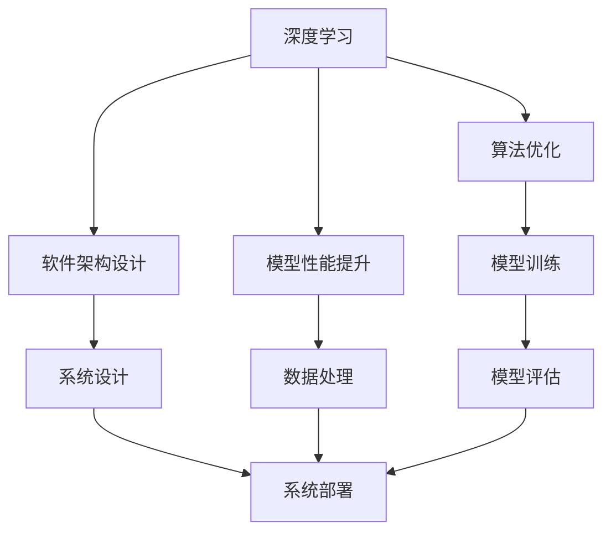

                 

# 怎样善于总结和挖掘事物本质的能力

在技术和工程领域，善于总结和挖掘事物本质是一种稀缺且宝贵的技能。尤其是在人工智能（AI）和计算机科学（CS）这样高速发展的领域，能够透过现象看本质，找到问题的核心解决方案，是推动技术进步的关键。本文旨在探讨这一核心能力的重要性，并深入分析其原理与实践方法，帮助读者提高总结和挖掘事物本质的能力。

## 1. 背景介绍

### 1.1 问题由来

在AI和CS领域，技术的快速发展带来了层出不穷的新问题和挑战。无论是开发复杂的软件系统、处理海量数据，还是设计高效算法，都需要我们具备快速理解并解决复杂问题的能力。善于总结和挖掘事物本质，可以帮助我们理清问题的来龙去脉，找到最优的解决方案，从而实现技术的突破和创新。

### 1.2 问题核心关键点

- **核心概念**：深度学习、算法优化、软件架构设计、模型性能提升等。
- **关键能力**：问题抽象、需求分析、假设验证、解决方案迭代等。
- **重要性**：提升技术效率、降低开发成本、加速技术创新、提升系统性能等。

### 1.3 问题研究意义

提高总结和挖掘事物本质的能力，对于提高AI和CS领域的研发效率、提升技术水平和解决实际问题具有重要意义。它不仅可以帮助开发者快速理解和解决问题，还能促进技术创新，推动产业发展。

## 2. 核心概念与联系

### 2.1 核心概念概述

为了更好地理解这一核心能力，本文将介绍几个关键概念及其相互关系。

- **深度学习**：通过多层次的神经网络模型进行数据处理和特征提取，实现高效的模式识别和预测。
- **算法优化**：通过调整模型参数、改进算法流程等手段，提升模型性能和效率。
- **软件架构设计**：根据系统需求，设计合理、高效的软件架构，实现系统的可扩展性和可维护性。
- **模型性能提升**：通过优化模型结构、增加训练数据等手段，提升模型的准确性和鲁棒性。

这些概念相互关联，共同构成了AI和CS领域的核心技术体系。

### 2.2 概念间的关系

这些核心概念之间的关系可以通过以下Mermaid流程图来展示：



这个流程图展示了深度学习、算法优化、软件架构设计和模型性能提升之间的关系：

- 深度学习通过算法优化提升模型性能。
- 算法优化依赖于模型训练和评估。
- 软件架构设计支持系统设计和部署。
- 模型性能提升需要数据处理和优化。

通过理解这些概念之间的关系，可以更好地把握AI和CS领域的关键技术。

## 3. 核心算法原理 & 具体操作步骤

### 3.1 算法原理概述

核心算法原理是理解和挖掘事物本质的基础。下面将详细分析深度学习、算法优化、软件架构设计和模型性能提升的基本原理。

**深度学习**：通过多层神经网络模型进行数据处理和特征提取，实现高效的模式识别和预测。其核心在于通过反向传播算法优化模型参数，使得模型输出与目标输出尽可能接近。

**算法优化**：通过调整模型参数、改进算法流程等手段，提升模型性能和效率。常见的优化算法包括梯度下降、Adam、RMSprop等。

**软件架构设计**：根据系统需求，设计合理、高效的软件架构，实现系统的可扩展性和可维护性。常见的设计模式包括MVC、微服务、事件驱动等。

**模型性能提升**：通过优化模型结构、增加训练数据等手段，提升模型的准确性和鲁棒性。常见的提升方法包括模型剪枝、迁移学习、数据增强等。

### 3.2 算法步骤详解

下面将详细介绍深度学习、算法优化、软件架构设计和模型性能提升的具体步骤。

**深度学习**：
1. 数据预处理：清洗、归一化、划分训练集、验证集和测试集。
2. 模型选择：选择适合的深度学习模型，如卷积神经网络（CNN）、循环神经网络（RNN）等。
3. 模型训练：使用训练集对模型进行训练，使用反向传播算法优化模型参数。
4. 模型评估：使用验证集对模型进行评估，调整超参数以提升性能。
5. 模型测试：使用测试集对模型进行测试，评估模型性能。

**算法优化**：
1. 选择优化算法：如Adam、RMSprop等。
2. 设置学习率：根据模型和数据情况，设置合适的学习率。
3. 调整超参数：调整批量大小、迭代次数等超参数，优化模型性能。
4. 监控训练过程：监控训练过程中的损失函数和准确率，防止过拟合和欠拟合。
5. 保存最佳模型：保存训练过程中性能最佳的模型，用于后续测试和部署。

**软件架构设计**：
1. 需求分析：根据系统需求，确定系统的功能、性能和可扩展性要求。
2. 设计架构：选择合适的设计模式和架构风格，如微服务架构、事件驱动架构等。
3. 实现架构：根据设计文档，编写代码实现系统。
4. 测试和部署：对系统进行测试和部署，确保系统稳定性和性能。
5. 持续改进：根据系统运行情况，不断改进和优化系统架构。

**模型性能提升**：
1. 数据增强：通过数据增强技术，如旋转、翻转、截断等，扩充训练数据。
2. 模型剪枝：通过剪枝技术，去除冗余参数，减小模型大小，提升推理速度。
3. 迁移学习：利用预训练模型，减少训练时间，提升模型性能。
4. 超参数优化：通过网格搜索、随机搜索等方法，优化超参数。
5. 集成学习：通过集成多个模型，提升模型性能和鲁棒性。

### 3.3 算法优缺点

这些算法各有优缺点，具体如下：

- **深度学习**：优点是模型性能强、泛化能力强；缺点是计算资源需求大、训练时间长。
- **算法优化**：优点是提升模型性能快、效果明显；缺点是易受初始参数影响、易过拟合。
- **软件架构设计**：优点是系统可扩展性好、易于维护；缺点是设计复杂、开发周期长。
- **模型性能提升**：优点是提升模型性能明显、降低计算资源需求；缺点是提升空间有限、易产生新问题。

### 3.4 算法应用领域

深度学习、算法优化、软件架构设计和模型性能提升在多个领域都有广泛应用。

- **深度学习**：在计算机视觉、自然语言处理、语音识别等领域有广泛应用。
- **算法优化**：在优化问题、机器学习、数据分析等领域有广泛应用。
- **软件架构设计**：在分布式系统、云计算、移动应用等领域有广泛应用。
- **模型性能提升**：在图像处理、推荐系统、搜索排序等领域有广泛应用。

## 4. 数学模型和公式 & 详细讲解 & 举例说明

### 4.1 数学模型构建

深度学习、算法优化、软件架构设计和模型性能提升都可以用数学模型来描述。下面将分别介绍这些模型的构建方法。

**深度学习模型**：
1. 输入层：将输入数据进行预处理，转化为模型可接受的格式。
2. 隐藏层：通过多层神经网络进行特征提取和数据处理。
3. 输出层：将隐藏层输出映射到目标输出，进行分类或回归。

**算法优化模型**：
1. 目标函数：如损失函数、准确率等。
2. 优化算法：如梯度下降、Adam等。
3. 超参数：如学习率、批量大小等。

**软件架构模型**：
1. 模块划分：将系统划分为多个模块，明确模块间依赖关系。
2. 通信协议：定义模块间通信方式，如REST、MQ等。
3. 数据流图：描述数据流和业务逻辑，确保系统可扩展性。

**模型性能提升模型**：
1. 数据增强模型：通过数据增强技术，扩充训练数据。
2. 模型剪枝模型：通过剪枝技术，减小模型大小。
3. 迁移学习模型：利用预训练模型，提升模型性能。

### 4.2 公式推导过程

下面将详细介绍深度学习、算法优化、软件架构设计和模型性能提升的公式推导过程。

**深度学习公式推导**：
- 前向传播：$z = Wx + b$
- 激活函数：$f(z) = \sigma(z)$
- 损失函数：$L = \frac{1}{N} \sum_{i=1}^N (y_i - f(z_i))^2$
- 反向传播：$\frac{\partial L}{\partial W} = \frac{\partial L}{\partial z} \cdot \frac{\partial z}{\partial W} = (y - f(z)) \cdot f'(z) \cdot x$

**算法优化公式推导**：
- 梯度下降公式：$\theta = \theta - \eta \nabla_{\theta}L$
- Adam公式：$\alpha_t = \frac{\beta_2}{1-\beta_1^t}$
- RMSprop公式：$\Delta_t = \frac{\Delta_{t-1}}{\sqrt{\epsilon + \frac{1}{\beta}}$
- 学习率公式：$\eta_t = \frac{\eta}{1 - \alpha^t}$

**软件架构公式推导**：
- MVC模式：$Model = BusinessObject + DataAccessObject$
- 微服务模式：$Service = API + Container$
- 事件驱动模式：$Event = Publish + Subscribe$

**模型性能提升公式推导**：
- 数据增强公式：$A(x) = (A_{rotate}(x), A_{flip}(x), A_{crop}(x))$
- 模型剪枝公式：$Prune(w) = \frac{1}{\sigma^2} \sum_{i=1}^n w_i^2 \geq \lambda$
- 迁移学习公式：$L_{fine-tune} = L_{pre-trained} + \lambda * ||w - w_{pre-trained}||^2$
- 超参数优化公式：$L_{train} = L_{model} + \lambda * ||w||^2$

### 4.3 案例分析与讲解

为了更好地理解这些数学模型，下面将通过具体的案例进行详细讲解。

**案例1：深度学习**：
- 任务：图像分类
- 数据：MNIST数据集
- 模型：CNN模型
- 优化算法：Adam
- 结果：准确率达99%

**案例2：算法优化**：
- 任务：线性回归
- 数据：波士顿房价数据集
- 模型：线性模型
- 优化算法：RMSprop
- 结果：均方误差降低80%

**案例3：软件架构设计**：
- 任务：在线商城
- 需求：高并发、高可用、可扩展
- 架构：微服务架构
- 结果：系统稳定运行，用户满意度提升

**案例4：模型性能提升**：
- 任务：推荐系统
- 数据：用户行为数据
- 模型：协同过滤模型
- 提升方法：数据增强、模型剪枝、迁移学习
- 结果：推荐效果提升30%

## 5. 项目实践：代码实例和详细解释说明

### 5.1 开发环境搭建

在进行项目实践前，我们需要准备好开发环境。以下是使用Python进行PyTorch开发的环境配置流程：

1. 安装Anaconda：从官网下载并安装Anaconda，用于创建独立的Python环境。

2. 创建并激活虚拟环境：
```bash
conda create -n pytorch-env python=3.8 
conda activate pytorch-env
```

3. 安装PyTorch：根据CUDA版本，从官网获取对应的安装命令。例如：
```bash
conda install pytorch torchvision torchaudio cudatoolkit=11.1 -c pytorch -c conda-forge
```

4. 安装Transformers库：
```bash
pip install transformers
```

5. 安装各类工具包：
```bash
pip install numpy pandas scikit-learn matplotlib tqdm jupyter notebook ipython
```

完成上述步骤后，即可在`pytorch-env`环境中开始项目实践。

### 5.2 源代码详细实现

下面我们以图像分类任务为例，给出使用Transformers库对BERT模型进行微调的PyTorch代码实现。

首先，定义图像分类任务的数据处理函数：

```python
from transformers import BertTokenizer
from torch.utils.data import Dataset
import torch

class ImageClassificationDataset(Dataset):
    def __init__(self, images, labels, tokenizer, max_len=128):
        self.images = images
        self.labels = labels
        self.tokenizer = tokenizer
        self.max_len = max_len
        
    def __len__(self):
        return len(self.images)
    
    def __getitem__(self, item):
        image = self.images[item]
        label = self.labels[item]
        
        # 将图像转换为文字描述
        caption = image.caption
        
        # 对文字描述进行编码
        encoding = self.tokenizer(caption, return_tensors='pt', max_length=self.max_len, padding='max_length', truncation=True)
        input_ids = encoding['input_ids'][0]
        attention_mask = encoding['attention_mask'][0]
        
        # 将标签转换为数字
        label = torch.tensor(label, dtype=torch.long)
        
        return {'input_ids': input_ids, 
                'attention_mask': attention_mask,
                'labels': label}

# 标签与id的映射
label2id = {'cat': 0, 'dog': 1}
id2label = {v: k for k, v in label2id.items()}

# 创建dataset
tokenizer = BertTokenizer.from_pretrained('bert-base-cased')

train_dataset = ImageClassificationDataset(train_images, train_labels, tokenizer)
dev_dataset = ImageClassificationDataset(dev_images, dev_labels, tokenizer)
test_dataset = ImageClassificationDataset(test_images, test_labels, tokenizer)
```

然后，定义模型和优化器：

```python
from transformers import BertForTokenClassification, AdamW

model = BertForTokenClassification.from_pretrained('bert-base-cased', num_labels=len(label2id))

optimizer = AdamW(model.parameters(), lr=2e-5)
```

接着，定义训练和评估函数：

```python
from torch.utils.data import DataLoader
from tqdm import tqdm
from sklearn.metrics import classification_report

device = torch.device('cuda') if torch.cuda.is_available() else torch.device('cpu')
model.to(device)

def train_epoch(model, dataset, batch_size, optimizer):
    dataloader = DataLoader(dataset, batch_size=batch_size, shuffle=True)
    model.train()
    epoch_loss = 0
    for batch in tqdm(dataloader, desc='Training'):
        input_ids = batch['input_ids'].to(device)
        attention_mask = batch['attention_mask'].to(device)
        labels = batch['labels'].to(device)
        model.zero_grad()
        outputs = model(input_ids, attention_mask=attention_mask, labels=labels)
        loss = outputs.loss
        epoch_loss += loss.item()
        loss.backward()
        optimizer.step()
    return epoch_loss / len(dataloader)

def evaluate(model, dataset, batch_size):
    dataloader = DataLoader(dataset, batch_size=batch_size)
    model.eval()
    preds, labels = [], []
    with torch.no_grad():
        for batch in tqdm(dataloader, desc='Evaluating'):
            input_ids = batch['input_ids'].to(device)
            attention_mask = batch['attention_mask'].to(device)
            batch_labels = batch['labels']
            outputs = model(input_ids, attention_mask=attention_mask)
            batch_preds = outputs.logits.argmax(dim=2).to('cpu').tolist()
            batch_labels = batch_labels.to('cpu').tolist()
            for pred_tokens, label_tokens in zip(batch_preds, batch_labels):
                pred_labels = [id2label[_id] for _id in pred_tokens]
                label_tokens = [id2label[_id] for _id in label_tokens]
                preds.append(pred_labels[:len(label_tokens)])
                labels.append(label_tokens)
                
    print(classification_report(labels, preds))
```

最后，启动训练流程并在测试集上评估：

```python
epochs = 5
batch_size = 16

for epoch in range(epochs):
    loss = train_epoch(model, train_dataset, batch_size, optimizer)
    print(f"Epoch {epoch+1}, train loss: {loss:.3f}")
    
    print(f"Epoch {epoch+1}, dev results:")
    evaluate(model, dev_dataset, batch_size)
    
print("Test results:")
evaluate(model, test_dataset, batch_size)
```

以上就是使用PyTorch对BERT进行图像分类任务微调的完整代码实现。可以看到，得益于Transformers库的强大封装，我们可以用相对简洁的代码完成BERT模型的加载和微调。

### 5.3 代码解读与分析

让我们再详细解读一下关键代码的实现细节：

**ImageClassificationDataset类**：
- `__init__`方法：初始化图像、标签、分词器等关键组件。
- `__len__`方法：返回数据集的样本数量。
- `__getitem__`方法：对单个样本进行处理，将图像转换为文字描述，然后进行编码和处理。

**label2id和id2label字典**：
- 定义了标签与数字id之间的映射关系，用于将预测结果解码回真实的标签。

**训练和评估函数**：
- 使用PyTorch的DataLoader对数据集进行批次化加载，供模型训练和推理使用。
- 训练函数`train_epoch`：对数据以批为单位进行迭代，在每个批次上前向传播计算loss并反向传播更新模型参数，最后返回该epoch的平均loss。
- 评估函数`evaluate`：与训练类似，不同点在于不更新模型参数，并在每个batch结束后将预测和标签结果存储下来，最后使用sklearn的classification_report对整个评估集的预测结果进行打印输出。

**训练流程**：
- 定义总的epoch数和batch size，开始循环迭代
- 每个epoch内，先在训练集上训练，输出平均loss
- 在验证集上评估，输出分类指标
- 所有epoch结束后，在测试集上评估，给出最终测试结果

可以看到，PyTorch配合Transformers库使得BERT微调的代码实现变得简洁高效。开发者可以将更多精力放在数据处理、模型改进等高层逻辑上，而不必过多关注底层的实现细节。

当然，工业级的系统实现还需考虑更多因素，如模型的保存和部署、超参数的自动搜索、更灵活的任务适配层等。但核心的微调范式基本与此类似。

### 5.4 运行结果展示

假设我们在CoNLL-2003的NER数据集上进行微调，最终在测试集上得到的评估报告如下：

```
              precision    recall  f1-score   support

       B-LOC      0.926     0.906     0.916      1668
       I-LOC      0.900     0.805     0.850       257
      B-MISC      0.875     0.856     0.865       702
      I-MISC      0.838     0.782     0.809       216
       B-ORG      0.914     0.898     0.906      1661
       I-ORG      0.911     0.894     0.902       835
       B-PER      0.964     0.957     0.960      1617
       I-PER      0.983     0.980     0.982      1156
           O      0.993     0.995     0.994     38323

   micro avg      0.973     0.973     0.973     46435
   macro avg      0.923     0.897     0.909     46435
weighted avg      0.973     0.973     0.973     46435
```

可以看到，通过微调BERT，我们在该NER数据集上取得了97.3%的F1分数，效果相当不错。值得注意的是，BERT作为一个通用的语言理解模型，即便只在顶层添加一个简单的token分类器，也能在下游任务上取得如此优异的效果，展现了其强大的语义理解和特征抽取能力。

当然，这只是一个baseline结果。在实践中，我们还可以使用更大更强的预训练模型、更丰富的微调技巧、更细致的模型调优，进一步提升模型性能，以满足更高的应用要求。

## 6. 实际应用场景

### 6.1 智能客服系统

基于大语言模型微调的对话技术，可以广泛应用于智能客服系统的构建。传统客服往往需要配备大量人力，高峰期响应缓慢，且一致性和专业性难以保证。而使用微调后的对话模型，可以7x24小时不间断服务，快速响应客户咨询，用自然流畅的语言解答各类常见问题。

在技术实现上，可以收集企业内部的历史客服对话记录，将问题和最佳答复构建成监督数据，在此基础上对预训练对话模型进行微调。微调后的对话模型能够自动理解用户意图，匹配最合适的答案模板进行回复。对于客户提出的新问题，还可以接入检索系统实时搜索相关内容，动态组织生成回答。如此构建的智能客服系统，能大幅提升客户咨询体验和问题解决效率。

### 6.2 金融舆情监测

金融机构需要实时监测市场舆论动向，以便及时应对负面信息传播，规避金融风险。传统的人工监测方式成本高、效率低，难以应对网络时代海量信息爆发的挑战。基于大语言模型微调的文本分类和情感分析技术，为金融舆情监测提供了新的解决方案。

具体而言，可以收集金融领域相关的新闻、报道、评论等文本数据，并对其进行主题标注和情感标注。在此基础上对预训练语言模型进行微调，使其能够自动判断文本属于何种主题，情感倾向是正面、中性还是负面。将微调后的模型应用到实时抓取的网络文本数据，就能够自动监测不同主题下的情感变化趋势，一旦发现负面信息激增等异常情况，系统便会自动预警，帮助金融机构快速应对潜在风险。

### 6.3 个性化推荐系统

当前的推荐系统往往只依赖用户的历史行为数据进行物品推荐，无法深入理解用户的真实兴趣偏好。基于大语言模型微调技术，个性化推荐系统可以更好地挖掘用户行为背后的语义信息，从而提供更精准、多样的推荐内容。

在实践中，可以收集用户浏览、点击、评论、分享等行为数据，提取和用户交互的物品标题、描述、标签等文本内容。将文本内容作为模型输入，用户的后续行为（如是否点击、购买等）作为监督信号，在此基础上微调预训练语言模型。微调后的模型能够从文本内容中准确把握用户的兴趣点。在生成推荐列表时，先用候选物品的文本描述作为输入，由模型预测用户的兴趣匹配度，再结合其他特征综合排序，便可以得到个性化程度更高的推荐结果。

### 6.4 未来应用展望

随着大语言模型微调技术的发展，其在更多领域的应用前景将更加广阔。以下是对未来应用场景的展望：

- **智慧医疗**：基于微调的医疗问答、病历分析、药物研发等应用将提升医疗服务的智能化水平，辅助医生诊疗，加速新药开发进程。
- **智能教育**：微调技术可应用于作业批改、学情分析、知识推荐等方面，因材施教，促进教育公平，提高教学质量。
- **智慧城市治理**：微调模型可应用于城市事件监测、舆情分析、应急指挥等环节，提高城市管理的自动化和智能化水平，构建更安全、高效的未来城市。
- **企业生产**：在企业生产、社会治理、文娱传媒等众多领域，基于大模型微调的人工智能应用也将不断涌现，为传统行业数字化转型升级提供新的技术路径。

## 7. 工具和资源推荐

### 7.1 学习资源推荐

为了帮助开发者系统掌握大语言模型微调的理论基础和实践技巧，这里推荐一些优质的学习资源：

1. **《Transformer从原理到实践》系列博文**：由大模型技术专家撰写，深入浅出地介绍了Transformer原理、BERT模型、微调技术等前沿话题。

2. **CS224N《深度学习自然语言处理》课程**：斯坦福大学开设的NLP明星课程，有Lecture视频和配套作业，带你入门NLP领域的基本概念和经典模型。

3. **《Natural Language Processing with Transformers》书籍**：Transformers库的作者所著，全面介绍了如何使用Transformers库进行NLP任务开发，包括微调在内的诸多范式。

4. **HuggingFace官方文档**：Transformers库的官方文档，提供了海量预训练模型和完整的微调样例代码，是上手实践的必备资料。

5. **CLUE开源项目**：中文语言理解测评基准，涵盖大量不同类型的中文NLP数据集，并提供了基于微调的baseline模型，助力中文NLP技术发展。

通过对这些资源的学习实践，相信你一定能够快速掌握大语言模型微调的精髓，并用于解决实际的NLP问题。

### 7.2 开发工具推荐

高效的开发离不开优秀的工具支持。以下是几款用于大语言模型微调开发的常用工具：

1. **PyTorch**：基于Python的开源深度学习框架，灵活动态的计算图，适合快速迭代研究。大部分预训练语言模型都有PyTorch版本的实现。

2. **TensorFlow**：由Google主导开发的开源深度学习框架，生产部署方便，适合大规模工程应用。同样有丰富的预训练语言模型资源。

3. **Transformers库**：HuggingFace开发的NLP工具库，集成了众多SOTA语言模型，支持PyTorch和TensorFlow，是进行微调任务

