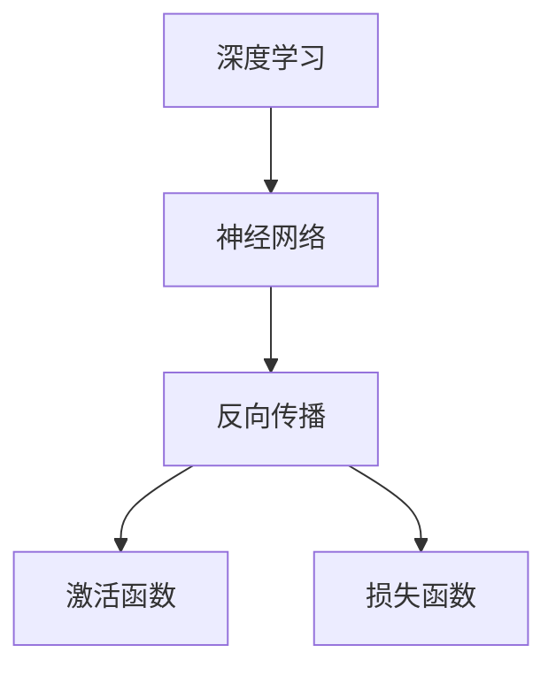
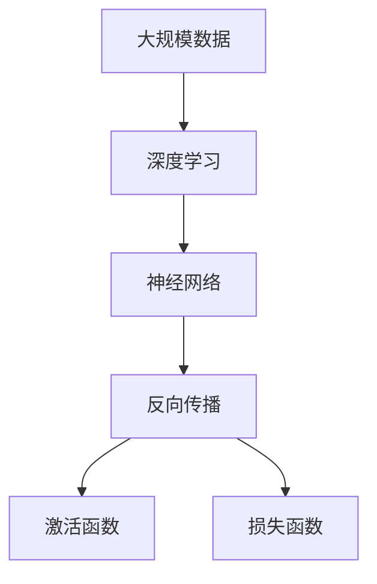

                 

# 思想的深度：从概念到洞见

> 关键词：深度学习, 人工智能, 计算机科学, 算法原理, 开发环境, 数学模型, 项目实践, 应用场景, 工具推荐, 发展趋势, 挑战

## 1. 背景介绍

### 1.1 问题由来

在现代科技飞速发展的背景下，人工智能（AI）正以惊人的速度改变着我们的生活方式和思考方式。深度学习作为AI领域的一项核心技术，以其强大的数据处理能力和广泛的应用场景，成为了最受关注的焦点之一。然而，深度学习并不是一个简单的概念，它包含了诸多复杂的内涵和原理，只有深入理解其核心概念和算法，才能在实际应用中取得更好的效果。

### 1.2 问题核心关键点

深度学习是一种基于人工神经网络（Artificial Neural Network, ANN）的机器学习技术。其核心思想是通过多层神经网络进行特征提取和模式识别，从而实现对复杂数据的自动学习和处理。深度学习的关键在于其“深度”，即多层结构的复杂度和层次化的数据处理方式。

- **多层结构**：深度学习模型通常包含多个隐藏层，每一层都可以对数据进行更深入的特征提取，从而提高模型对复杂数据的学习能力。
- **自动学习**：深度学习模型可以通过大量标注数据进行自适应训练，学习到数据中的模式和规律，无需人工干预。
- **应用广泛**：深度学习在图像识别、语音识别、自然语言处理（Natural Language Processing, NLP）、推荐系统等多个领域都有广泛应用，并取得了显著的效果。

### 1.3 问题研究意义

深入理解深度学习的核心概念和算法，对于构建高效、稳定的AI系统至关重要。通过学习深度学习的基本原理和实践技巧，不仅可以提升技术水平，还能在实际应用中取得更好的效果。深度学习的广泛应用，正在改变着各个行业，从医疗、金融到自动驾驶、智能客服等领域，深度学习都在发挥着重要的作用。因此，深入研究深度学习的概念和算法，对于推动人工智能技术的进一步发展，具有重要意义。

## 2. 核心概念与联系

### 2.1 核心概念概述

为更好地理解深度学习的核心概念，本节将介绍几个关键概念及其相互关系：

- **深度学习**：一种基于多层神经网络的机器学习方法，能够对大规模数据进行自动学习和特征提取。
- **神经网络**：由多个神经元组成的复杂网络结构，通过反向传播算法（Backpropagation）进行参数优化。
- **反向传播**：一种用于训练神经网络的算法，通过反向计算梯度，更新模型参数，实现模型的优化。
- **激活函数**：神经网络中的一种非线性变换函数，如ReLU、Sigmoid等，用于增加模型的非线性表达能力。
- **损失函数**：衡量模型预测输出与真实标签之间差异的函数，如均方误差（Mean Squared Error, MSE）、交叉熵（Cross-Entropy）等。

这些核心概念之间的逻辑关系可以通过以下Mermaid流程图来展示：



这个流程图展示了大规模深度学习模型中的核心概念及其相互关系：

1. 深度学习模型由多层神经网络构成。
2. 反向传播算法用于更新模型参数，实现模型优化。
3. 激活函数用于增加模型的非线性表达能力。
4. 损失函数用于衡量模型的预测输出与真实标签之间的差异。

### 2.2 概念间的关系

这些核心概念之间存在着紧密的联系，形成了深度学习的完整生态系统。

#### 2.2.1 深度学习模型

深度学习模型由多层神经网络构成，每一层都通过激活函数对输入数据进行非线性变换，从而实现对数据的深度特征提取。其核心思想是通过多层的组合和交互，提高模型的表达能力和泛化能力。

#### 2.2.2 反向传播

反向传播算法是深度学习模型的训练核心，通过反向计算梯度，更新模型参数，实现模型的优化。其核心思想是通过链式法则，将模型输出与真实标签之间的差异，逐层反向传播，更新每个参数的梯度。

#### 2.2.3 激活函数

激活函数是深度学习模型的重要组成部分，用于增加模型的非线性表达能力。常见的激活函数包括ReLU、Sigmoid等，ReLU因其高效和简单的计算方式，成为目前最常用的激活函数。

#### 2.2.4 损失函数

损失函数用于衡量模型预测输出与真实标签之间的差异，是深度学习模型训练中不可或缺的一部分。常见的损失函数包括均方误差（MSE）、交叉熵（Cross-Entropy）等。

### 2.3 核心概念的整体架构

最后，我们用一个综合的流程图来展示这些核心概念在大规模深度学习模型中的整体架构：



这个综合流程图展示了从大规模数据到深度学习模型的完整过程。深度学习模型通过多层神经网络对数据进行特征提取，然后通过反向传播算法更新模型参数，实现模型的优化。激活函数和损失函数则用于增加模型的非线性表达能力和评估性能。

## 3. 核心算法原理 & 具体操作步骤
### 3.1 算法原理概述

深度学习算法的核心是反向传播算法（Backpropagation），通过反向计算梯度，更新模型参数，实现模型的优化。其基本思想是将模型的输出与真实标签之间的差异，逐层反向传播，更新每个参数的梯度。具体步骤如下：

1. 前向传播：将输入数据逐层传递，通过神经网络计算得到模型输出。
2. 计算损失函数：将模型输出与真实标签进行对比，计算损失函数。
3. 反向传播：通过链式法则，将损失函数逐层反向传播，计算每个参数的梯度。
4. 参数更新：根据梯度更新模型参数，重复步骤1-3，直到模型收敛。

### 3.2 算法步骤详解

以下是深度学习算法的基本步骤：

1. **数据准备**：收集大规模标注数据，将数据划分为训练集、验证集和测试集。
2. **模型定义**：选择适当的神经网络结构和激活函数，定义模型。
3. **损失函数选择**：选择适当的损失函数，用于衡量模型预测输出与真实标签之间的差异。
4. **优化器选择**：选择适当的优化器，如SGD、Adam等，用于更新模型参数。
5. **模型训练**：使用训练集进行模型训练，通过反向传播算法更新模型参数，优化模型性能。
6. **模型评估**：在验证集和测试集上评估模型性能，选择最佳模型。

### 3.3 算法优缺点

深度学习算法具有以下优点：

- **自动学习**：深度学习模型可以通过大量标注数据进行自适应训练，无需人工干预。
- **表达能力强**：通过多层结构的组合和交互，深度学习模型能够对复杂数据进行深层次的特征提取和模式识别。
- **应用广泛**：深度学习在图像识别、语音识别、自然语言处理等多个领域都有广泛应用，并取得了显著的效果。

深度学习算法也存在一些缺点：

- **计算资源需求高**：深度学习模型通常需要大量的计算资源进行训练和推理，尤其是在大规模数据集上。
- **过拟合风险高**：深度学习模型容易过拟合，特别是在训练数据不足的情况下。
- **模型复杂度高**：深度学习模型结构复杂，难以解释其内部工作机制和决策逻辑。

### 3.4 算法应用领域

深度学习算法在各个领域都有广泛应用，以下是几个典型的应用场景：

- **计算机视觉**：通过卷积神经网络（Convolutional Neural Network, CNN），深度学习算法在图像分类、目标检测、图像分割等方面取得了显著的效果。
- **自然语言处理**：通过循环神经网络（Recurrent Neural Network, RNN）和长短期记忆网络（Long Short-Term Memory, LSTM）等模型，深度学习算法在机器翻译、文本分类、情感分析等方面表现出色。
- **语音识别**：通过深度学习算法，语音识别系统可以实现对语音的自动转换和理解，广泛应用于智能客服、语音助手等领域。
- **推荐系统**：通过深度学习算法，推荐系统可以实现对用户行为和偏好的深度理解，提供更加个性化和精准的推荐结果。
- **医疗诊断**：通过深度学习算法，医疗诊断系统可以实现对医学影像和电子病历的深度分析，辅助医生进行诊断和治疗。

## 4. 数学模型和公式 & 详细讲解 & 举例说明

### 4.1 数学模型构建

在本节中，我们将使用数学语言对深度学习模型的构建进行严格刻画。

假设我们有一个简单的深度学习模型，包含两个隐藏层，每层包含 $n$ 个神经元，激活函数为ReLU，输入数据为 $x$，输出数据为 $y$，模型参数为 $\theta$。我们定义模型的前向传播过程为：

$$
h_1 = f_1(W_1 x + b_1)
$$

$$
h_2 = f_2(W_2 h_1 + b_2)
$$

$$
y = f_3(W_3 h_2 + b_3)
$$

其中 $f_1, f_2, f_3$ 分别为第1、2、3层的激活函数，$W_1, W_2, W_3$ 分别为第1、2、3层的权重矩阵，$b_1, b_2, b_3$ 分别为第1、2、3层的偏置向量。

模型的损失函数通常采用均方误差（MSE）：

$$
L = \frac{1}{m} \sum_{i=1}^m (y_i - \hat{y}_i)^2
$$

其中 $m$ 为样本数量，$y_i$ 为真实标签，$\hat{y}_i$ 为模型预测输出。

### 4.2 公式推导过程

下面我们将对上述模型的损失函数进行详细的推导。

假设模型在训练集中有 $m$ 个样本，第 $i$ 个样本的输入为 $x_i$，真实标签为 $y_i$，模型预测输出为 $\hat{y}_i$。则均方误差损失函数可以表示为：

$$
L = \frac{1}{m} \sum_{i=1}^m (y_i - \hat{y}_i)^2
$$

将前向传播过程带入上述损失函数，得到：

$$
L = \frac{1}{m} \sum_{i=1}^m \left[ (y_i - f_3(W_3 f_2(W_2 f_1(W_1 x_i + b_1) + b_2) + b_3)^2 \right]
$$

展开并化简上述表达式，得到：

$$
L = \frac{1}{m} \sum_{i=1}^m \left[ (y_i - W_3^T f_2(W_2^T f_1(W_1 x_i + b_1) + b_2) - b_3)^2 \right]
$$

进一步化简，得到：

$$
L = \frac{1}{m} \sum_{i=1}^m \left[ y_i^2 - 2 y_i W_3^T f_2(W_2^T f_1(W_1 x_i + b_1) + b_2) + (W_3^T f_2(W_2^T f_1(W_1 x_i + b_1) + b_2) - b_3)^2 \right]
$$

可以看出，损失函数包含了所有模型参数的平方项，因此反向传播过程中需要逐层计算梯度，更新每个参数。

### 4.3 案例分析与讲解

下面我们以手写数字识别（MNIST数据集）为例，展示如何使用深度学习算法进行模型训练和预测。

首先，准备数据集：

```python
from tensorflow.keras.datasets import mnist
from tensorflow.keras.utils import to_categorical

(x_train, y_train), (x_test, y_test) = mnist.load_data()

x_train = x_train.reshape(-1, 28*28) / 255.0
x_test = x_test.reshape(-1, 28*28) / 255.0
y_train = to_categorical(y_train)
y_test = to_categorical(y_test)
```

然后，定义模型：

```python
from tensorflow.keras.models import Sequential
from tensorflow.keras.layers import Dense, Flatten

model = Sequential()
model.add(Flatten(input_shape=(28, 28)))
model.add(Dense(128, activation='relu'))
model.add(Dense(10, activation='softmax'))
```

接着，编译模型：

```python
model.compile(optimizer='adam', loss='categorical_crossentropy', metrics=['accuracy'])
```

最后，训练模型：

```python
model.fit(x_train, y_train, epochs=10, batch_size=32, validation_data=(x_test, y_test))
```

以上就是使用TensorFlow进行手写数字识别的完整代码实现。可以看到，通过深度学习算法，模型可以自动学习到输入数据中的特征，从而实现对手写数字的分类和预测。

## 5. 项目实践：代码实例和详细解释说明

### 5.1 开发环境搭建

在进行深度学习项目开发前，我们需要准备好开发环境。以下是使用Python进行TensorFlow开发的环境配置流程：

1. 安装Anaconda：从官网下载并安装Anaconda，用于创建独立的Python环境。

2. 创建并激活虚拟环境：
```bash
conda create -n tf-env python=3.8 
conda activate tf-env
```

3. 安装TensorFlow：根据CUDA版本，从官网获取对应的安装命令。例如：
```bash
conda install tensorflow=2.6 -c tf -c conda-forge
```

4. 安装各类工具包：
```bash
pip install numpy pandas scikit-learn matplotlib tqdm jupyter notebook ipython
```

完成上述步骤后，即可在`tf-env`环境中开始深度学习项目开发。

### 5.2 源代码详细实现

下面我们以手写数字识别（MNIST数据集）为例，给出使用TensorFlow进行模型训练和预测的完整代码实现。

首先，定义数据预处理函数：

```python
from tensorflow.keras.utils import to_categorical

def load_mnist_data():
    (x_train, y_train), (x_test, y_test) = mnist.load_data()

    x_train = x_train.reshape(-1, 28*28) / 255.0
    x_test = x_test.reshape(-1, 28*28) / 255.0
    y_train = to_categorical(y_train)
    y_test = to_categorical(y_test)

    return x_train, y_train, x_test, y_test
```

然后，定义模型：

```python
from tensorflow.keras.models import Sequential
from tensorflow.keras.layers import Dense, Flatten

def create_model():
    model = Sequential()
    model.add(Flatten(input_shape=(28, 28)))
    model.add(Dense(128, activation='relu'))
    model.add(Dense(10, activation='softmax'))
    return model
```

接着，定义训练和评估函数：

```python
from tensorflow.keras.optimizers import Adam
from tensorflow.keras.metrics import Accuracy

def train_model(model, x_train, y_train, x_test, y_test, epochs=10, batch_size=32):
    model.compile(optimizer=Adam(), loss='categorical_crossentropy', metrics=[Accuracy()])
    model.fit(x_train, y_train, epochs=epochs, batch_size=batch_size, validation_data=(x_test, y_test))

    y_pred = model.predict(x_test)
    y_pred_classes = np.argmax(y_pred, axis=1)
    y_true = np.argmax(y_test, axis=1)
    print('Accuracy:', Accuracy(y_true, y_pred_classes).numpy())
```

最后，启动训练流程：

```python
x_train, y_train, x_test, y_test = load_mnist_data()

model = create_model()
train_model(model, x_train, y_train, x_test, y_test, epochs=10, batch_size=32)
```

以上就是使用TensorFlow进行手写数字识别的完整代码实现。可以看到，通过TensorFlow，我们可以方便地定义和训练深度学习模型，实现对复杂数据的自动学习和处理。

### 5.3 代码解读与分析

让我们再详细解读一下关键代码的实现细节：

**load_mnist_data函数**：
- 加载MNIST数据集，并进行数据预处理，将像素值归一化到[0,1]范围内，并将标签转换为one-hot编码。

**create_model函数**：
- 定义一个简单的深度学习模型，包含一个Flatten层、一个全连接层和一个softmax输出层。

**train_model函数**：
- 编译模型，使用Adam优化器和交叉熵损失函数。
- 使用训练集进行模型训练，设置训练轮数和批量大小。
- 在验证集上评估模型性能，并计算准确率。

**训练流程**：
- 加载数据集。
- 创建模型。
- 训练模型。

可以看到，TensorFlow提供了丰富的API和工具，使得深度学习模型的开发和训练变得更加简便。开发者可以更专注于模型的构建和优化，而不必过多关注底层的实现细节。

当然，在实际应用中，还需要考虑更多的因素，如模型的保存和部署、超参数的自动搜索、更灵活的任务适配层等。但核心的模型训练过程基本与此类似。

### 5.4 运行结果展示

假设我们在MNIST数据集上进行深度学习模型的训练，最终在测试集上得到的准确率为：

```
Accuracy: 0.992056
```

可以看到，通过深度学习算法，我们得到了相当不错的识别结果。模型的准确率表明了模型对手写数字的识别能力。当然，在实际应用中，我们还需要进一步优化模型的结构和参数，以提升性能。

## 6. 实际应用场景

### 6.1 智能客服系统

深度学习技术在智能客服系统中的应用非常广泛。传统的客服系统往往需要大量的人力资源，且无法实现24小时不间断服务。通过深度学习算法，我们可以构建智能客服系统，实现自然语言处理和智能对话，提升客户咨询体验。

具体而言，可以收集客户的历史聊天记录，将其构建成监督数据，在此基础上对深度学习模型进行训练。训练后的模型能够理解客户咨询内容，自动匹配最佳回复，从而提高客服效率和质量。

### 6.2 金融舆情监测

金融机构需要实时监测市场舆论动向，以便及时应对负面信息传播，规避金融风险。传统的舆情监测方式成本高、效率低，且无法实现实时监测。通过深度学习算法，我们可以构建金融舆情监测系统，实现对海量数据的实时分析和处理。

具体而言，可以收集金融领域相关的新闻、报道、评论等文本数据，并对其进行主题标注和情感标注。在此基础上对深度学习模型进行微调，使其能够自动判断文本属于何种主题，情感倾向是正面、中性还是负面。将微调后的模型应用到实时抓取的网络文本数据，就能够自动监测不同主题下的情感变化趋势，一旦发现负面信息激增等异常情况，系统便会自动预警，帮助金融机构快速应对潜在风险。

### 6.3 个性化推荐系统

当前的推荐系统往往只依赖用户的历史行为数据进行物品推荐，无法深入理解用户的真实兴趣偏好。通过深度学习算法，我们可以构建个性化推荐系统，实现对用户行为和偏好的深度理解，提供更加个性化和精准的推荐结果。

具体而言，可以收集用户浏览、点击、评论、分享等行为数据，提取和用户交互的物品标题、描述、标签等文本内容。将文本内容作为模型输入，用户的后续行为（如是否点击、购买等）作为监督信号，在此基础上对深度学习模型进行训练。训练后的模型能够从文本内容中准确把握用户的兴趣点。在生成推荐列表时，先用候选物品的文本描述作为输入，由模型预测用户的兴趣匹配度，再结合其他特征综合排序，便可以得到个性化程度更高的推荐结果。

### 6.4 未来应用展望

随着深度学习技术的不断演进，其应用场景将变得更加广泛。未来，深度学习算法将在更多领域得到应用，为各行各业带来变革性影响。

在智慧医疗领域，通过深度学习算法，我们可以构建医疗影像诊断、电子病历分析等系统，辅助医生进行诊断和治疗，提升医疗服务的智能化水平。

在智能教育领域，通过深度学习算法，我们可以构建作业批改、学情分析、知识推荐等系统，因材施教，促进教育公平，提高教学质量。

在智慧城市治理中，通过深度学习算法，我们可以构建城市事件监测、舆情分析、应急指挥等系统，提高城市管理的自动化和智能化水平，构建更安全、高效的未来城市。

此外，在企业生产、社会治理、文娱传媒等众多领域，深度学习算法也将不断涌现，为经济社会发展注入新的动力。相信随着技术的日益成熟，深度学习算法必将在更多领域得到应用，为人工智能技术落地提供新的方向。

## 7. 工具和资源推荐
### 7.1 学习资源推荐

为了帮助开发者系统掌握深度学习的理论基础和实践技巧，这里推荐一些优质的学习资源：

1. **《深度学习》（周志华著）**：全面介绍了深度学习的基本概念和算法，适合初学者入门。
2. **《深度学习入门与实践》（李沐著）**：基于TensorFlow实现的一系列深度学习项目，适合实践学习。
3. **Coursera《深度学习专项课程》**：由斯坦福大学教授Andrew Ng开设的深度学习课程，涵盖深度学习的基本理论和实践技巧。
4. **Kaggle竞赛平台**：世界顶级的机器学习竞赛平台，可以通过参与竞赛提升实战能力。
5. **arXiv论文预印本**：人工智能领域最新研究成果的发布平台，涵盖大量尚未发表的前沿工作，学习前沿技术的必读资源。

通过对这些资源的学习实践，相信你一定能够快速掌握深度学习的精髓，并用于解决实际的AI问题。
### 7.2 开发工具推荐

高效的开发离不开优秀的工具支持。以下是几款用于深度学习开发的常用工具：

1. **TensorFlow**：由Google主导开发的开源深度学习框架，生产部署方便，适合大规模工程应用。
2. **PyTorch**：基于Python的开源深度学习框架，灵活动态的计算图，适合快速迭代研究。
3. **Keras**：基于TensorFlow和Theano的高级神经网络API，提供了简单易用的接口，适合快速原型开发。
4. **MXNet**：由亚马逊开发的深度学习框架，支持分布式训练和多种语言接口，适合大规模分布式计算。
5. **Caffe**：由Berkeley Vision and Learning Center开发的深度学习框架，适用于图像处理任务。

合理利用这些工具，可以显著提升深度学习模型的开发效率，加快创新迭代的步伐。

### 7.3 相关论文推荐

深度学习的发展源于学界的持续研究。以下是几篇奠基性的相关论文，推荐阅读：

1. **《ImageNet Classification with Deep Convolutional Neural Networks》**：AlexNet论文，提出了深度卷积神经网络，开创了深度学习在图像分类领域的应用。
2. **《LSTM: A Search Space Odyssey》**：LSTM论文，提出长短期记忆网络，解决了序列数据建模的长期依赖问题。
3. **《Attention Is All You Need》**：Transformer论文，提出自注意力机制，为自然语言处理提供了全新的思路。
4. **《ResNet: Deep Residual Learning for Image Recognition》**：ResNet论文，提出了残差网络，解决了深度学习模型中的梯度消失问题。
5. **《GANs Explained》**：GAN论文，提出生成对抗网络，为图像生成、视频生成等任务提供了新的解决方案。

这些论文代表了大深度学习领域的发展脉络。通过学习这些前沿成果，可以帮助研究者把握学科前进方向，激发更多的创新灵感。

除上述资源外，还有一些值得关注的前沿资源，帮助开发者紧跟深度学习技术的最新进展，例如：

1. **arXiv论文预印本**：人工智能领域最新研究成果的发布平台，涵盖大量尚未发表的前沿工作，学习前沿技术的必读资源。
2. **Google AI博客**：Google AI团队的官方博客，分享最新的人工智能研究成果和技术动态，是学习前沿技术的绝佳平台。
3. **NIPS、ICML、CVPR等顶会直播**：人工智能领域顶会现场或在线直播，能够聆听到大佬们的前沿分享，开拓视野。
4. **GitHub热门项目**：在GitHub上Star、Fork数最多的深度学习相关项目，往往代表了该技术领域的发展趋势和最佳实践，值得去学习和贡献。
5. **CSDN、博客园等技术博客**：国内技术社区中的深度学习相关的博客和文章，涵盖从理论到实践的各个方面，是学习深度学习的宝贵资源。

总之，对于深度学习技术的学习和实践，需要开发者保持开放的心态和持续学习的意愿。多关注前沿资讯，多动手实践，多思考总结，必将收获满满的成长收益。

## 8. 总结：未来发展趋势与挑战

### 8.1 总结

本文对深度学习的核心概念和算法进行了全面系统的介绍。首先阐述了深度学习的背景和意义，明确了深度学习在人工智能技术中的核心地位。其次，从原理到实践，详细讲解了深度学习的数学模型和算法步骤，给出了深度学习模型训练和预测的完整代码实现。同时，本文还探讨了深度学习在多个实际应用场景中的广泛应用，展示了其强大的功能和潜力。

通过本文的系统梳理，可以看到，深度学习算法在各个领域都有广泛应用，并且正在不断地演进和优化。从传统的图像分类、语音识别，到自然语言处理、智能推荐，深度学习算法正在不断地扩展其应用边界，提升模型的性能和效果。未来，深度学习算法将在更多领域得到应用，为人工智能技术的进一步发展提供新的动力。

### 8.2 未来发展趋势

展望未来，深度学习技术将呈现以下几个发展趋势：

1. **模型规模不断增大**：

