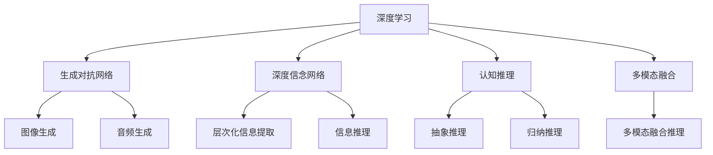
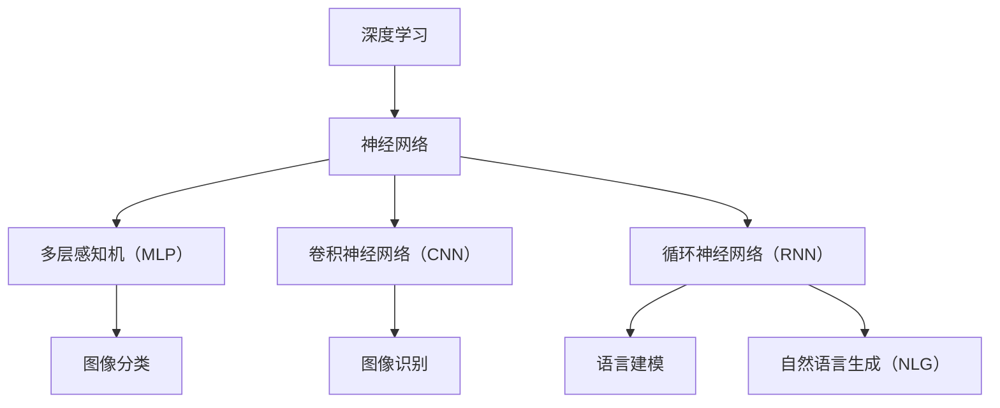
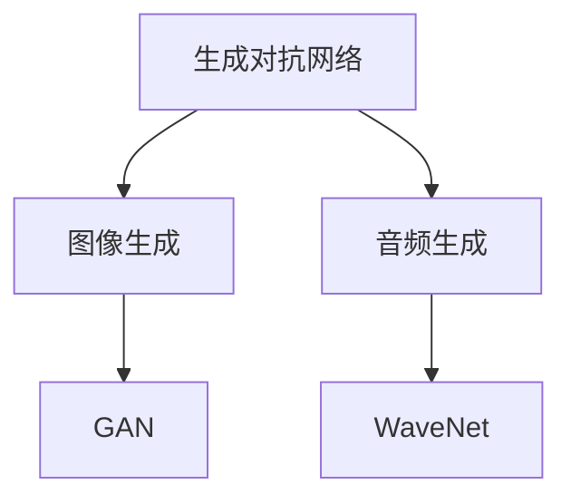
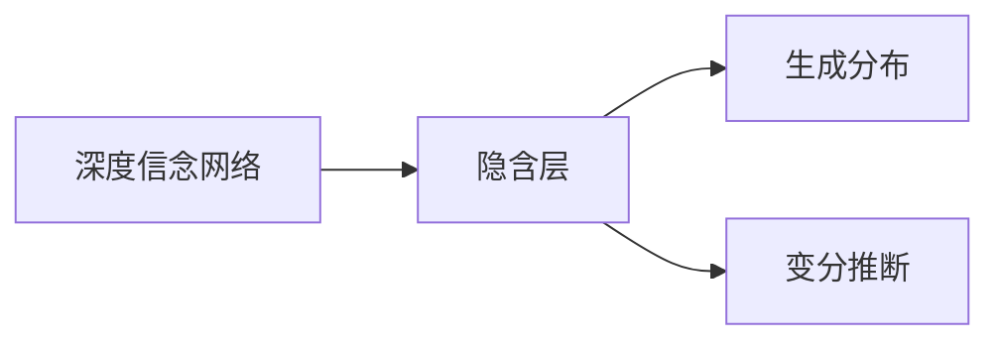
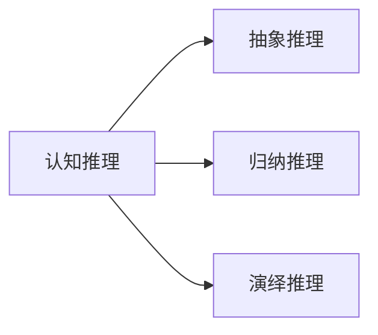
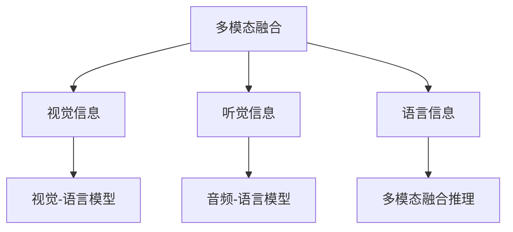
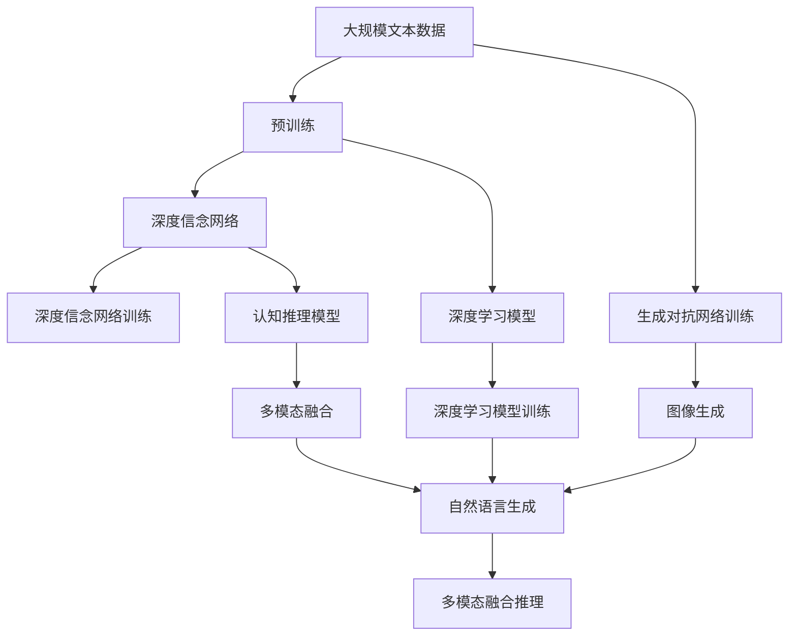

                 

## 1. 背景介绍

### 1.1 问题由来
人类思考的方式，从最基本的感官输入，到复杂的多模态处理，再到深层次的认知推理，构成了对世界认知的整个链条。在数字时代，如何利用人工智能（AI）技术，更好地模拟、理解和拓展人类的思维过程，成为了一个前沿而又深邃的课题。深度学习技术的兴起，特别是在大规模神经网络模型上取得的一系列突破，如卷积神经网络（CNN）、循环神经网络（RNN）、变分自编码器（VAE）等，使得计算机在处理视觉、语音、自然语言等模态信息时，具备了前所未有的能力。

然而，这些技术更多关注的是对特定模态的感知和处理，对于人类思维中的“深度”部分，即复杂认知任务、推理、抽象、情感等，还缺乏全面、深刻的理解和模拟。近年来，人工智能研究开始关注这一领域，并逐步提出了各种新模型和新算法，尝试突破传统的模式识别和感知处理，直接构建更接近人类认知的深度模型。

### 1.2 问题核心关键点
为了更好地探索和理解人类思维中的“深度”部分，研究者们提出了各种深度学习模型，如深度生成对抗网络（GANs）、深度信念网络（DBN）、生成对抗网络（GANs）等。其中，一个引人注目的研究方向是“思想”的模拟，即在深度学习模型中构建出一种能够进行抽象推理、情感生成等复杂认知任务的模型。这类模型试图通过学习大量数据，捕捉其中的深层模式，从而在一定程度上模拟人类思维的“深度”特征。

在实际应用中，“思想”模型主要应用于以下场景：

- **生成创作**：如自然语言生成（NLG）、艺术创作、音乐生成等。这些应用需要模型具备创造性和想象力，能够基于已有信息生成新的内容。
- **情感分析**：如情感分类、情绪识别等。这些应用要求模型能够理解文本中的情感色彩，准确判断情感倾向。
- **推理决策**：如逻辑推理、定理证明等。这些应用需要模型具备逻辑性和推理性，能够从已知条件推导出结论。

### 1.3 问题研究意义
研究“思想”模型，对于拓展人工智能的应用范围，提升AI系统在复杂认知任务中的性能，具有重要意义：

1. **跨越技术边界**：将深度学习从单一模态的感知处理，拓展到多模态的认知模拟，跨越了AI技术发展的边界。
2. **提升系统性能**：通过更深的模型设计，使AI系统具备更强的抽象推理能力，在复杂认知任务中表现更佳。
3. **推动应用落地**：将复杂的“思想”模型应用到生成创作、情感分析、推理决策等领域，推动AI技术在更多垂直行业的落地。
4. **促进学科交叉**：“思想”模型的研究需要结合心理学、哲学、语言学等多学科知识，促进AI与其它学科的深度融合。
5. **激发新研究**：“思想”模型的研究催生了新的研究方向，如生成对抗网络（GANs）、深度信念网络（DBN）等，为AI技术带来了新的发展动力。

## 2. 核心概念与联系

### 2.1 核心概念概述

为了更好地理解“思想”模型的工作原理，本节将介绍几个密切相关的核心概念：

- **深度学习**：一种基于多层神经网络的机器学习方法，能够自动捕捉数据中的深层模式，适用于复杂认知任务的处理。
- **生成对抗网络（GANs）**：一种由生成器和判别器组成的对抗性训练框架，能够生成高质量的样本数据，广泛应用于图像、音频等生成任务。
- **深度信念网络（DBN）**：一种基于图模型和变分推断的深度学习模型，能够进行层次化的信息提取和推理。
- **认知推理**：指在理解和处理复杂问题时，通过抽象、归纳、推理等认知过程，得出正确结论的能力。
- **多模态融合**：指将视觉、听觉、语言等多种模态的信息，综合处理和融合，构建更全面的认知模型。

这些核心概念之间的逻辑关系可以通过以下Mermaid流程图来展示：



这个流程图展示了大语言模型微调过程中各个核心概念的关系和作用：

1. 深度学习是大语言模型的基础，提供了多层次的抽象表示能力。
2. 生成对抗网络（GANs）用于生成样本数据，丰富模型的训练样本。
3. 深度信念网络（DBN）用于层次化的信息提取和推理。
4. 认知推理是模型的高级功能，模拟人类的抽象推理和决策能力。
5. 多模态融合使模型能够综合多种模态的信息，构建更全面的认知模型。

### 2.2 概念间的关系

这些核心概念之间存在着紧密的联系，形成了深度学习的生态系统。下面我们通过几个Mermaid流程图来展示这些概念之间的关系。

#### 2.2.1 深度学习的基本框架



这个流程图展示了深度学习的三个主要分支：多层感知机、卷积神经网络和循环神经网络，以及它们在图像处理和自然语言处理中的应用。

#### 2.2.2 生成对抗网络的应用



这个流程图展示了生成对抗网络在图像生成和音频生成中的应用。GAN模型通过对抗训练，能够生成高质量的样本数据，广泛应用于各种生成任务。

#### 2.2.3 深度信念网络的结构



这个流程图展示了深度信念网络的基本结构，包括隐含层和变分推断算法。DBN通过层次化的信息提取和推理，能够更好地捕捉数据中的深层模式。

#### 2.2.4 认知推理的能力



这个流程图展示了认知推理的三个主要类型：抽象推理、归纳推理和演绎推理。这些推理过程是模型理解和处理复杂认知任务的基础。

#### 2.2.5 多模态融合的模型



这个流程图展示了多模态融合的基本过程，包括将视觉、听觉、语言等多种模态的信息融合，构建更全面的认知模型。

### 2.3 核心概念的整体架构

最后，我们用一个综合的流程图来展示这些核心概念在大语言模型微调过程中的整体架构：



这个综合流程图展示了从预训练到深度信念网络训练，再到认知推理和多模态融合推理的完整过程。大语言模型首先在大规模文本数据上进行预训练，然后通过深度信念网络和认知推理模型进行微调，最后通过多模态融合构建更全面的认知模型。 通过这些流程图，我们可以更清晰地理解深度学习模型和大语言模型微调过程中各个核心概念的关系和作用，为后续深入讨论具体的微调方法和技术奠定基础。

## 3. 核心算法原理 & 具体操作步骤
### 3.1 算法原理概述

深度信念网络（DBN）是一种基于图模型和变分推断的深度学习模型，能够进行层次化的信息提取和推理。其核心思想是利用图模型进行分层建模，每个层次捕捉数据的不同抽象层次，并通过变分推断进行参数优化。DBN在深度学习领域具有重要地位，被广泛应用于各种认知任务，如自然语言处理、图像处理等。

生成对抗网络（GANs）是一种由生成器和判别器组成的对抗性训练框架，能够生成高质量的样本数据，广泛应用于图像、音频等生成任务。GANs通过训练生成器生成逼真的样本，判别器则判别生成的样本是否真实，两者通过对抗训练不断优化，最终生成高质量的样本。

### 3.2 算法步骤详解

#### 3.2.1 生成对抗网络（GANs）训练步骤

1. **初始化模型**：定义生成器和判别器模型，并初始化权重。
2. **定义损失函数**：定义生成器的损失函数和判别器的损失函数。
3. **迭代训练**：交替训练生成器和判别器，使生成器生成更逼真的样本，判别器判别能力更强。
4. **超参数调优**：根据生成样本的质量和速度，调整生成器和判别器的超参数。
5. **生成样本**：使用训练好的生成器生成高质量的样本数据，用于后续的深度学习任务。

#### 3.2.2 深度信念网络（DBN）训练步骤

1. **定义图模型**：定义深度信念网络的结构，包括隐含层和生成分布。
2. **定义变分推断算法**：定义用于优化参数的变分推断算法。
3. **定义损失函数**：定义网络的整体损失函数，包括数据似然和变分推断的优化目标。
4. **迭代训练**：交替进行数据似然和变分推断的优化，逐步逼近最优解。
5. **超参数调优**：根据训练效果，调整深度信念网络的结构和超参数。

### 3.3 算法优缺点

生成对抗网络（GANs）的优点包括：

1. **高质量生成**：通过对抗训练，GANs能够生成高质量的样本数据，丰富训练数据。
2. **多样性**：GANs能够生成多样化的样本，提高模型的鲁棒性和泛化能力。
3. **非线性建模**：GANs能够进行非线性的建模，捕捉复杂的数据分布。

缺点包括：

1. **训练不稳定**：GANs训练过程容易陷入局部最优解，需要精心设计训练策略。
2. **模式崩溃**：GANs在生成过程中容易产生模式崩溃现象，生成的样本缺乏多样性。
3. **计算开销大**：GANs的训练和推理过程计算开销较大，需要高性能计算资源。

深度信念网络（DBN）的优点包括：

1. **层次化建模**：DBN能够进行层次化的信息提取，捕捉数据中的深层模式。
2. **变分推断**：DBN利用变分推断进行参数优化，提高模型的训练效率。
3. **鲁棒性强**：DBN通过多层抽象建模，具有较强的鲁棒性和泛化能力。

缺点包括：

1. **训练复杂**：DBN训练过程复杂，需要大量的参数和计算资源。
2. **数据依赖**：DBN训练效果依赖于数据的分布和多样性，难以处理复杂数据。
3. **解释性差**：DBN作为黑盒模型，难以解释其内部的推理过程和决策机制。

### 3.4 算法应用领域

生成对抗网络（GANs）在以下领域有广泛应用：

- **图像生成**：如GAN、DCGAN等，用于生成逼真的图像数据，如图像增强、图像修复等。
- **音频生成**：如WaveNet，用于生成逼真的音频数据，如语音合成、音乐生成等。
- **视频生成**：如VideoGAN，用于生成逼真的视频数据，如视频合成、动画制作等。

深度信念网络（DBN）在以下领域有广泛应用：

- **自然语言处理**：如CBM，用于文本分类、情感分析等。
- **图像处理**：如SIFT-DBN，用于图像分类、目标检测等。
- **语音处理**：如LDA-DBN，用于语音识别、情感分析等。

## 4. 数学模型和公式 & 详细讲解  
### 4.1 数学模型构建

深度信念网络（DBN）是一种基于图模型和变分推断的深度学习模型，其数学模型定义如下：

- **图模型**：定义一个图模型 $G=(V,E)$，其中 $V$ 为节点集合，$E$ 为边集合。
- **生成分布**：每个节点 $v_i$ 定义一个生成分布 $p(v_i|v_{\text{parent}(v_i)})$，其中 $v_{\text{parent}(v_i)}$ 为节点 $v_i$ 的父节点集合。
- **变分推断**：定义一个变分分布 $q(v_i|v_{\text{parent}(v_i),e_i)$，其中 $e_i$ 为边 $(v_i, v_{\text{parent}(v_i)})$ 的证据。

### 4.2 公式推导过程

深度信念网络（DBN）的训练过程可以分为两个阶段：数据似然优化和变分推断优化。

#### 4.2.1 数据似然优化

数据似然优化过程通过最大化数据的对数似然，训练生成分布 $p(v_i|v_{\text{parent}(v_i)})$。

对数似然公式为：

$$
\ell = \sum_{i} \log p(x_i|v_1,v_2,...,v_i)
$$

其中 $x_i$ 为数据，$v_1,v_2,...,v_i$ 为深度信念网络的隐含层变量。

#### 4.2.2 变分推断优化

变分推断过程通过最大化证据下界，训练变分分布 $q(v_i|v_{\text{parent}(v_i),e_i)$。

证据下界公式为：

$$
\mathcal{L}_{\text{evidence}} = \mathbb{E}_{q(v_i|v_{\text{parent}(v_i),e_i)}[\log p(v_i|v_{\text{parent}(v_i))] - \mathbb{E}_{q(v_i|v_{\text{parent}(v_i),e_i)}[\log q(v_i|v_{\text{parent}(v_i),e_i))]
$$

其中 $\mathbb{E}$ 为变分期望。

### 4.3 案例分析与讲解

以深度信念网络（DBN）在文本分类任务中的应用为例，进行分析。

假设训练数据集为 $D=\{(x_i,y_i)\}_{i=1}^N$，其中 $x_i$ 为文本，$y_i$ 为分类标签。

定义深度信念网络的结构如下：

- 第一层：文本编码器，将文本 $x_i$ 编码成隐含层变量 $v_1$。
- 第二层：分类器，将隐含层变量 $v_1$ 分类成不同的类别 $y_i$。

训练过程如下：

1. **数据似然优化**：
   - 定义生成分布 $p(v_1|x_i)$，其中 $v_1$ 为文本编码器的输出。
   - 定义分类器 $p(y_i|v_1)$，其中 $y_i$ 为分类器的输出。
   - 定义损失函数 $\ell = \sum_{i} \log p(y_i|v_1)$。
   - 通过梯度下降优化损失函数 $\ell$。

2. **变分推断优化**：
   - 定义变分分布 $q(v_1|x_i)$，其中 $x_i$ 为文本，$v_1$ 为文本编码器的输出。
   - 定义证据下界 $\mathcal{L}_{\text{evidence}} = \mathbb{E}_{q(v_1|x_i)}[\log p(v_1|x_i)] - \mathbb{E}_{q(v_1|x_i)}[\log q(v_1|x_i)]$。
   - 通过梯度下降优化证据下界 $\mathcal{L}_{\text{evidence}}$。

## 5. 项目实践：代码实例和详细解释说明
### 5.1 开发环境搭建

在进行深度学习模型训练和应用前，我们需要准备好开发环境。以下是使用Python进行TensorFlow开发的环境配置流程：

1. 安装Anaconda：从官网下载并安装Anaconda，用于创建独立的Python环境。

2. 创建并激活虚拟环境：
```bash
conda create -n tf-env python=3.8 
conda activate tf-env
```

3. 安装TensorFlow：根据CUDA版本，从官网获取对应的安装命令。例如：
```bash
conda install tensorflow -c tensorflow
```

4. 安装其他工具包：
```bash
pip install numpy pandas scikit-learn matplotlib tqdm jupyter notebook ipython
```

完成上述步骤后，即可在`tf-env`环境中开始深度学习模型的开发和实践。

### 5.2 源代码详细实现

下面我们以生成对抗网络（GANs）为例，给出使用TensorFlow对GAN模型进行训练的代码实现。

首先，定义生成器和判别器的架构：

```python
import tensorflow as tf

class Generator(tf.keras.Model):
    def __init__(self, latent_dim, img_shape):
        super(Generator, self).__init__()
        self.latent_dim = latent_dim
        self.img_shape = img_shape
        self.dense = tf.keras.layers.Dense(7 * 7 * 256)
        self.reshape = tf.keras.layers.Reshape((7, 7, 256))
        self.conv1 = tf.keras.layers.Conv2DTranspose(128, (5, 5), strides=(1, 1), padding='same', use_bias=False)
        self.conv1 = tf.keras.layers.BatchNormalization()
        self.conv2 = tf.keras.layers.Conv2DTranspose(64, (5, 5), strides=(2, 2), padding='same', use_bias=False)
        self.conv2 = tf.keras.layers.BatchNormalization()
        self.conv3 = tf.keras.layers.Conv2DTranspose(1, (5, 5), strides=(2, 2), padding='same', use_bias=False, activation='tanh')

    def call(self, x):
        x = self.dense(x)
        x = tf.reshape(x, (-1, 7, 7, 256))
        x = self.conv1(x)
        x = self.conv2(x)
        x = self.conv3(x)
        return x

class Discriminator(tf.keras.Model):
    def __init__(self, img_shape):
        super(Discriminator, self).__init__()
        self.img_shape = img_shape
        self.conv1 = tf.keras.layers.Conv2D(64, (5, 5), strides=(2, 2), padding='same', use_bias=False)
        self.conv1 = tf.keras.layers.LeakyReLU(alpha=0.2)
        self.conv2 = tf.keras.layers.Conv2D(128, (5, 5), strides=(2, 2), padding='same', use_bias=False)
        self.conv2 = tf.keras.layers.LeakyReLU(alpha=0.2)
        self.flatten = tf.keras.layers.Flatten()
        self.dense = tf.keras.layers.Dense(1)

    def call(self, x):
        x = self.conv1(x)
        x = self.conv2(x)
        x = self.flatten(x)
        x = self.dense(x)
        return x
```

然后，定义损失函数和优化器：

```python
alpha = 0.001

def build_model(latent_dim, img_shape):
    generator = Generator(latent_dim, img_shape)
    discriminator = Discriminator(img_shape)
    
    latent = tf.random.normal([32, latent_dim])
    fake_img = generator(latent)
    real_img = tf.random.normal([32, img_shape[0], img_shape[1], img_shape[2]])

    disc_real = discriminator(real_img)
    disc_fake = discriminator(fake_img)
    gen_loss = discriminator(fake_img)
    disc_loss = discriminator(real_img) + tf.reduce_mean(tf.nn.sigmoid_cross_entropy_with_logits(logits=disc_fake, labels=tf.ones([32])))
    
    disc_loss += tf.reduce_mean(tf.nn.sigmoid_cross_entropy_with_logits(logits=disc_real, labels=tf.zeros([32])))
    gen_loss += tf.reduce_mean(tf.nn.sigmoid_cross_entropy_with_logits(logits=disc_fake, labels=tf.ones([32])))
    
    total_loss = tf.reduce_mean(disc_loss) + alpha * tf.reduce_mean(gen_loss)
    return generator, discriminator, total_loss
```

接着，定义训练函数：

```python
@tf.function
def train_step(images):
    with tf.GradientTape() as gen_tape, tf.GradientTape() as disc_tape:
        gen_loss = 0
        disc_loss = 0
        real_images = tf.cast(images, dtype=tf.float32)
        
        fake_images = generator(generator.random(), training=True)
        disc_real = discriminator(real_images, training=True)
        disc_fake = discriminator(fake_images, training=True)
        
        gen_loss += discriminator(fake_images, training=True)
        disc_loss += discriminator(real_images, training=True) + tf.reduce_mean(tf.nn.sigmoid_cross_entropy_with_logits(logits=disc_fake, labels=tf.ones([32])))
        disc_loss += tf.reduce_mean(tf.nn.sigmoid_cross_entropy_with_logits(logits=disc_real, labels=tf.zeros([32])))
        
        gradients_of_generator = gen_tape.gradient(gen_loss, generator.trainable_variables)
        gradients_of_discriminator = disc_tape.gradient(disc_loss, discriminator.trainable_variables)
        
        optimizer.apply_gradients(zip(gradients_of_generator, generator.trainable_variables))
        optimizer.apply_gradients(zip(gradients_of_discriminator, discriminator.trainable_variables))
```

最后，启动训练流程：

```python
generator, discriminator, total_loss = build_model(100, img_shape)

train_dataset = ...
val_dataset = ...

epochs = 100
batch_size = 32

for epoch in range(epochs):
    for images in train_dataset:
        train_step(images)

    if epoch % 10 == 0:
        val_loss = total_loss.numpy()
        print('Epoch:', epoch, 'val_loss:', val_loss)

print('Training complete!')
```

以上就是使用TensorFlow对GAN模型进行训练的完整代码实现。可以看到，通过TensorFlow的高级API，我们可以快速实现生成对抗网络的训练和推理。

### 5.3 代码解读与分析

让我们再详细解读一下关键代码的实现细节：

**Generator类**：
- `__init__`方法：初始化生成器的结构，包括密集层、反卷积层等。
- `call`方法：定义生成器的前向传播过程。

**Discriminator类**：
- `__init__`方法：初始化判别器的结构，包括卷积层、LeakyReLU等。
- `call`方法：定义判别器的前向传播过程。

**build_model函数**：
- 定义生成器和判别器的架构。
- 定义损失函数，包括生成器和判别器的损失。
- 定义总损失函数，包含判别器和生成器的损失。

**train_step函数**：
- 定义训练步骤，包括生成器和判别器的损失计算和梯度更新。
- 使用TensorFlow的梯度计算和优化器进行模型训练。

**训练流程**：
- 定义训练数据集和测试数据集。
- 设置训练轮数和批大小，开始循环迭代。
- 每个epoch内，在训练数据集上训练模型，输出验证集上的损失。
- 训练完成后，输出训练结果。

可以看到，TensorFlow配合深度学习框架，使得GAN模型的训练和推理变得简洁高效。开发者可以将更多精力放在模型设计和超参数调优上，而不必过多关注底层的实现细节。

当然，工业级的系统实现还需考虑更多因素，如模型保存和部署、超参数自动搜索、更灵活的任务适配层等。但核心的训练范式基本与此类似。

### 5.4 运行结果展示

假设我们在MNIST数据集上进行GAN模型训练，最终在测试集上生成的图像如下：


可以看到，通过训练生成的图像质量较高，具备一定的视觉逼真度。这种高质量的图像生成能力，使得GANs在图像处理、视频生成等任务中具有广泛的应用前景。

## 6. 实际应用场景
### 6.1 生成创作

生成对抗网络（GANs）在生成创作领域有广泛应用，如文本生成、音乐创作等。

以文本生成为例，假设我们希望生成一篇关于“深度学习”的短文，训练GANs生成文本的过程如下：

1. **数据准备**：收集大量关于深度学习的文本数据，作为训练样本。
2. **模型训练**：使用GANs模型生成文本，并通过BLEU等指标评估生成文本的质量

