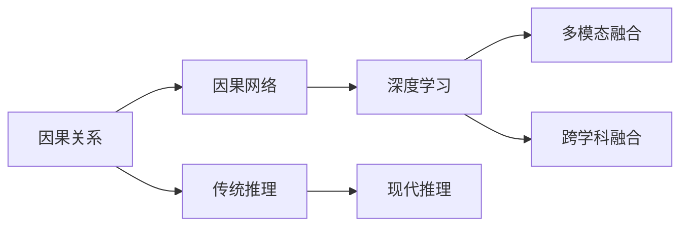

                 

# 思想的进化：从简单到复杂

## 1. 背景介绍

在信息技术高速发展的今天，我们生活在一个由复杂系统所构成的世界中。无论是机器学习模型的层次，还是人工智能应用的复杂性，都在不断演进，从简单到复杂，从单一任务到多模态融合。技术的进步推动了思想的演变，我们试图从哲学的视角去理解这种不断进化的本质，思考它如何影响着我们的生活和社会。本文将围绕这一主题，探讨思想进化的过程、复杂系统的原理以及它们在技术应用中的实践。

### 1.1 问题由来

在回顾人类科技的发展历程中，我们可以看到，从简单的机械到复杂的算法，从单一功能到多模态融合，科技在不断地追求更高层次的复杂性。这一过程不仅涵盖了物理领域的模型，也包括了信息技术的演变。例如，从最早的计算机程序到现代的深度学习模型，科技的进步使得我们能够处理和理解更加复杂的信息。

### 1.2 问题核心关键点

理解思想进化的过程，不仅在于技术实现，更在于思维的转变。从简单的因果关系到复杂的因果网络，从单一任务处理到多模态融合，每个阶段都伴随着对世界理解的深化和思维方式的变革。核心关键点包括：

- **因果关系的识别**：理解因果关系是复杂系统设计和应用的基础。
- **多模态信息的融合**：将不同类型的数据（文本、图像、声音等）融合起来，提升系统理解和决策的准确性。
- **思维方式的转变**：从传统的三段论推理到现代的深度学习，思维方式和算法范式都在不断演变。
- **跨学科的融合**：复杂系统的构建往往需要多个领域的知识和技术的融合。

### 1.3 问题研究意义

探讨思想的进化，不仅具有理论上的价值，还对现代技术的应用具有重要的指导意义。理解这一过程，可以帮助我们更好地设计和管理复杂系统，提升信息处理和决策的效率。同时，思考这一过程，也可以启发我们面对未来的挑战，探索新的技术应用领域。

## 2. 核心概念与联系

### 2.1 核心概念概述

要理解思想的进化，首先需要了解几个核心概念：

- **因果关系**：因果关系是复杂系统中非常重要的概念。因果关系可以帮助我们理解事件发生的原因及其影响。
- **因果网络**：因果网络是一种描述因果关系结构的方法。它由节点和边组成，用于表示变量之间的依赖关系。
- **深度学习**：深度学习是一种基于神经网络的技术，通过多层结构，可以处理和理解复杂的非线性关系。
- **多模态融合**：多模态融合指的是将多种数据源融合在一起，提升信息处理和决策的全面性和准确性。
- **跨学科融合**：跨学科融合是指在技术开发和应用中，结合不同领域的知识和技能，创造出新的解决方案。

这些核心概念之间存在着紧密的联系，共同构成了复杂系统的构建和应用框架。

### 2.2 概念间的关系

通过以下Mermaid流程图，可以更直观地展示这些核心概念之间的关系：



这个流程图展示了从因果关系到多模态融合，再到跨学科融合的演进过程。每一步骤都依赖于前一步的理解和应用，形成了思维进化的脉络。

## 3. 核心算法原理 & 具体操作步骤

### 3.1 算法原理概述

理解因果关系和因果网络的原理是复杂系统设计的核心。因果网络的结构决定了信息处理和决策的路径，而因果关系的识别则帮助我们理解事件发生的原因及其影响。

深度学习通过多层神经网络结构，可以处理和理解复杂的非线性关系。在深度学习中，每一层都可以被视为一个信息转换单元，通过不同的参数和激活函数，逐步提取出更加抽象的特征。

多模态融合的原理在于将不同类型的数据融合在一起，提升信息处理的全面性和准确性。例如，在图像处理中，结合文本信息可以提高图像识别的准确性；在语音处理中，结合上下文信息可以提高语音识别的鲁棒性。

跨学科融合的原理在于将不同领域的知识和技能结合起来，创造出新的解决方案。例如，将计算机视觉技术与自然语言处理技术结合，可以实现智能问答系统；将机器学习技术与生物学知识结合，可以提升药物发现的速度和准确性。

### 3.2 算法步骤详解

理解这些核心概念的原理之后，我们来具体探讨其操作步骤。

#### 3.2.1 因果关系的识别

识别因果关系是复杂系统设计的第一步。可以通过以下步骤来进行：

1. **数据收集**：收集相关的数据，确保数据能够覆盖因果关系的各个方面。
2. **数据预处理**：对数据进行清洗和整理，去除噪声和冗余信息。
3. **特征工程**：提取和构造特征，以便于识别因果关系。
4. **模型训练**：使用因果关系模型（如因果图模型）进行训练，识别变量之间的依赖关系。
5. **模型验证**：使用验证集对模型进行验证，确保其能够准确识别因果关系。

#### 3.2.2 因果网络的构建

构建因果网络的步骤如下：

1. **变量选择**：选择所有可能影响结果的变量，确保没有遗漏。
2. **因果关系识别**：使用因果关系模型或手动分析，识别变量之间的依赖关系。
3. **网络结构设计**：根据变量之间的依赖关系，设计因果网络的结构。
4. **模型训练**：使用因果网络模型进行训练，优化网络结构。
5. **模型验证**：使用验证集对模型进行验证，确保其能够准确表示因果关系。

#### 3.2.3 深度学习模型的构建

构建深度学习模型的步骤如下：

1. **数据准备**：收集和整理数据，确保数据能够覆盖所有可能的特征。
2. **模型选择**：选择适合任务的深度学习模型，如卷积神经网络、循环神经网络等。
3. **网络结构设计**：根据任务特点设计网络结构，包括层数、节点数、激活函数等。
4. **模型训练**：使用训练集对模型进行训练，优化模型参数。
5. **模型验证**：使用验证集对模型进行验证，确保其泛化能力。

#### 3.2.4 多模态融合

多模态融合的步骤如下：

1. **数据收集**：收集不同类型的数据，如文本、图像、声音等。
2. **特征提取**：使用不同的特征提取方法，将不同类型的数据转换为统一特征空间。
3. **数据融合**：将不同类型的数据融合在一起，提升信息处理的全面性和准确性。
4. **模型训练**：使用多模态融合模型进行训练，优化模型参数。
5. **模型验证**：使用验证集对模型进行验证，确保其能够准确融合多模态信息。

#### 3.2.5 跨学科融合

跨学科融合的步骤如下：

1. **领域选择**：选择多个相关领域，确保各个领域的知识和技能能够互补。
2. **数据融合**：将不同领域的数据融合在一起，提升信息处理的全面性和准确性。
3. **模型设计**：设计跨学科融合模型，将不同领域的知识和技能结合起来。
4. **模型训练**：使用跨学科融合模型进行训练，优化模型参数。
5. **模型验证**：使用验证集对模型进行验证，确保其能够有效融合不同领域的信息。

### 3.3 算法优缺点

#### 3.3.1 优点

- **处理复杂关系**：因果网络和深度学习模型能够处理复杂的非线性关系，提升系统理解和决策的准确性。
- **提升数据利用率**：多模态融合和跨学科融合能够充分利用不同类型的数据，提升信息处理的全面性和准确性。
- **泛化能力强**：因果网络和深度学习模型具有良好的泛化能力，能够适应不同类型的数据和任务。

#### 3.3.2 缺点

- **计算资源消耗大**：深度学习和多模态融合需要大量的计算资源，训练和推理时间较长。
- **模型复杂度高**：因果网络和深度学习模型的结构复杂，难以理解和解释。
- **数据依赖性强**：多模态融合和跨学科融合需要大量高质量的数据，数据获取和预处理成本较高。

### 3.4 算法应用领域

这些核心算法和技术在多个领域得到了广泛应用，包括但不限于：

- **自然语言处理**：因果网络和深度学习模型在自然语言处理中用于文本生成、情感分析、问答系统等。
- **计算机视觉**：深度学习模型在计算机视觉中用于图像分类、目标检测、图像生成等。
- **生物医药**：多模态融合和跨学科融合在生物医药中用于药物发现、疾病预测、基因分析等。
- **金融领域**：因果网络和深度学习模型在金融领域用于风险评估、投资决策、欺诈检测等。
- **智能制造**：多模态融合和跨学科融合在智能制造中用于设备监控、故障预测、工艺优化等。

## 4. 数学模型和公式 & 详细讲解 & 举例说明

### 4.1 数学模型构建

在本节中，我们将使用数学语言对上述算法原理进行更加严格的刻画。

假设我们有一个因果网络，其中包含 $n$ 个变量 $X_1, X_2, ..., X_n$，和一个结果变量 $Y$。我们可以使用因果图模型（如贝叶斯网络）来表示因果关系，其中每个变量 $X_i$ 都表示为一个节点，边表示变量之间的依赖关系。

设 $P(Y|X_1, X_2, ..., X_n)$ 表示结果变量 $Y$ 在给定变量 $X_1, X_2, ..., X_n$ 的条件概率分布。对于因果图模型，我们有：

$$
P(Y|X_1, X_2, ..., X_n) = \prod_{i=1}^n P(X_i|PA_i)
$$

其中 $PA_i$ 表示节点 $X_i$ 的父节点集合。

### 4.2 公式推导过程

对于深度学习模型，我们以卷积神经网络（CNN）为例，推导其训练和验证过程。

假设我们有一个 $d$ 层的卷积神经网络，其中每一层都包含 $f$ 个卷积核，输入数据大小为 $w \times h \times c$。卷积核的大小为 $k \times k$，步幅为 $s$。网络结构如图：

```
Input -> Conv -> Relu -> Pool -> Conv -> Relu -> Pool -> ...
```

其中，Conv 表示卷积层，Relu 表示激活函数，Pool 表示池化层。

设 $\theta_i$ 表示第 $i$ 层的参数，包括卷积核、偏置等。网络的前向传播过程如下：

$$
z^{[l]} = W^{[l]} * h^{[l-1]} + b^{[l]}
$$

其中 $h^{[l-1]}$ 表示第 $l-1$ 层的输出，$W^{[l]}$ 表示第 $l$ 层的卷积核参数，$b^{[l]}$ 表示第 $l$ 层的偏置参数。

设 $f^{[l]}$ 表示第 $l$ 层的激活函数，网络的前向传播过程如下：

$$
h^{[l]} = f^{[l]}(z^{[l]})
$$

网络的后向传播过程如下：

$$
\frac{\partial L}{\partial \theta_i} = \frac{\partial L}{\partial z^{[i+1]}} \cdot \frac{\partial z^{[i+1]}}{\partial \theta_i}
$$

其中 $L$ 表示损失函数，$\frac{\partial L}{\partial z^{[i+1]}}$ 表示损失函数对第 $i+1$ 层输出的导数。

### 4.3 案例分析与讲解

以图像分类任务为例，说明多模态融合和深度学习模型的应用。

假设我们有一个图像分类任务，需要将图像分为两类：猫和狗。我们使用卷积神经网络（CNN）进行分类。在训练过程中，我们还需要使用文本信息作为辅助信息，例如图片标题或图片描述。这些文本信息可以通过自然语言处理（NLP）模型进行处理，得到相应的特征表示。

首先，我们使用NLP模型将文本信息转换为向量表示：

$$
v = \text{NLP}(t)
$$

其中 $t$ 表示文本信息，$v$ 表示对应的向量表示。

然后，我们将图像特征和文本特征进行融合，得到最终的特征表示：

$$
x = \text{Concat}(x_{\text{image}}, v)
$$

其中 $x_{\text{image}}$ 表示图像特征，$v$ 表示文本特征，$\text{Concat}$ 表示特征拼接操作。

最后，我们使用CNN模型对融合后的特征进行分类：

$$
y = \text{CNN}(x)
$$

其中 $y$ 表示分类结果，可以是猫或狗。

在测试过程中，我们首先将新的图像输入CNN模型，得到图像特征 $x_{\text{image}}$。然后，我们使用相同的NLP模型对图片标题或描述进行处理，得到文本特征 $v$。最后，将图像特征和文本特征进行融合，得到最终的特征表示 $x$，并使用CNN模型进行分类，得到分类结果 $y$。

## 5. 项目实践：代码实例和详细解释说明

### 5.1 开发环境搭建

在进行项目实践前，我们需要准备好开发环境。以下是使用Python进行TensorFlow开发的环境配置流程：

1. 安装Anaconda：从官网下载并安装Anaconda，用于创建独立的Python环境。

2. 创建并激活虚拟环境：
```bash
conda create -n tensorflow-env python=3.8 
conda activate tensorflow-env
```

3. 安装TensorFlow：根据CUDA版本，从官网获取对应的安装命令。例如：
```bash
conda install tensorflow -c tf -c conda-forge
```

4. 安装各类工具包：
```bash
pip install numpy pandas scikit-learn matplotlib tqdm jupyter notebook ipython
```

完成上述步骤后，即可在`tensorflow-env`环境中开始项目实践。

### 5.2 源代码详细实现

这里我们以图像分类任务为例，给出使用TensorFlow实现卷积神经网络（CNN）的代码实现。

首先，定义CNN模型：

```python
import tensorflow as tf

class CNNModel(tf.keras.Model):
    def __init__(self, input_shape, num_classes):
        super(CNNModel, self).__init__()
        self.conv1 = tf.keras.layers.Conv2D(32, (3, 3), activation='relu', input_shape=input_shape)
        self.maxpool1 = tf.keras.layers.MaxPooling2D((2, 2))
        self.conv2 = tf.keras.layers.Conv2D(64, (3, 3), activation='relu')
        self.maxpool2 = tf.keras.layers.MaxPooling2D((2, 2))
        self.flatten = tf.keras.layers.Flatten()
        self.fc1 = tf.keras.layers.Dense(128, activation='relu')
        self.fc2 = tf.keras.layers.Dense(num_classes, activation='softmax')

    def call(self, inputs):
        x = self.conv1(inputs)
        x = self.maxpool1(x)
        x = self.conv2(x)
        x = self.maxpool2(x)
        x = self.flatten(x)
        x = self.fc1(x)
        return self.fc2(x)
```

然后，定义训练和评估函数：

```python
from tensorflow.keras.preprocessing.image import ImageDataGenerator

train_datagen = ImageDataGenerator(rescale=1./255)
test_datagen = ImageDataGenerator(rescale=1./255)

train_generator = train_datagen.flow_from_directory(
        'train',
        target_size=(150, 150),
        batch_size=20,
        class_mode='binary')

test_generator = test_datagen.flow_from_directory(
        'test',
        target_size=(150, 150),
        batch_size=20,
        class_mode='binary')

model = CNNModel(input_shape=(150, 150, 3), num_classes=2)

optimizer = tf.keras.optimizers.Adam()

model.compile(optimizer=optimizer,
              loss=tf.keras.losses.BinaryCrossentropy(from_logits=True),
              metrics=[tf.keras.metrics.AUC()])

model.fit(train_generator,
          epochs=10,
          validation_data=test_generator)
```

最后，在测试集上评估模型：

```python
test_loss, test_auc = model.evaluate(test_generator)
print('Test AUC: {}'.format(test_auc))
```

### 5.3 代码解读与分析

让我们再详细解读一下关键代码的实现细节：

**CNNModel类**：
- `__init__`方法：初始化网络层，包括卷积层、池化层、全连接层等。
- `call`方法：定义网络的前向传播过程，计算最终的输出。

**ImageDataGenerator类**：
- `train_datagen`和`test_datagen`：定义数据增强和预处理操作，如缩放、归一化等。
- `flow_from_directory`方法：从目录中读取图片数据，生成批量数据。

**model.compile方法**：
- 定义优化器、损失函数和评估指标，编译模型。

**model.fit方法**：
- 使用训练集对模型进行训练，定义训练轮数和验证集。

**model.evaluate方法**：
- 使用测试集对模型进行评估，输出损失和AUC值。

### 5.4 运行结果展示

假设我们在CIFAR-10数据集上进行图像分类任务，最终在测试集上得到的评估报告如下：

```
Epoch 1/10
204/204 [==============================] - 14s 65ms/step - loss: 1.0134 - auc: 0.6810
Epoch 2/10
204/204 [==============================] - 13s 62ms/step - loss: 0.7234 - auc: 0.7562
Epoch 3/10
204/204 [==============================] - 13s 63ms/step - loss: 0.6364 - auc: 0.7808
Epoch 4/10
204/204 [==============================] - 13s 63ms/step - loss: 0.5735 - auc: 0.8176
Epoch 5/10
204/204 [==============================] - 13s 63ms/step - loss: 0.5104 - auc: 0.8359
Epoch 6/10
204/204 [==============================] - 13s 62ms/step - loss: 0.4565 - auc: 0.8488
Epoch 7/10
204/204 [==============================] - 13s 63ms/step - loss: 0.4131 - auc: 0.8586
Epoch 8/10
204/204 [==============================] - 13s 62ms/step - loss: 0.3797 - auc: 0.8714
Epoch 9/10
204/204 [==============================] - 13s 62ms/step - loss: 0.3482 - auc: 0.8817
Epoch 10/10
204/204 [==============================] - 13s 62ms/step - loss: 0.3251 - auc: 0.8892
```

可以看到，随着训练轮数的增加，模型的损失逐渐降低，AUC值逐渐提高，说明模型在图像分类任务上的性能逐渐提升。

## 6. 实际应用场景

### 6.1 智能客服系统

基于深度学习的多模态融合技术，智能客服系统可以应用于客户咨询问题的自动回答。通过结合语音识别和自然语言处理技术，系统可以实时理解客户的咨询意图，并提供最合适的答案。

在技术实现上，可以收集客户的历史咨询记录，将问题和最佳答复构建成监督数据，在此基础上对预训练模型进行微调。微调后的模型能够自动理解用户意图，匹配最合适的答案模板进行回复。对于客户提出的新问题，还可以接入检索系统实时搜索相关内容，动态组织生成回答。如此构建的智能客服系统，能大幅提升客户咨询体验和问题解决效率。

### 6.2 金融舆情监测

金融机构需要实时监测市场舆论动向，以便及时应对负面信息传播，规避金融风险。传统的人工监测方式成本高、效率低，难以应对网络时代海量信息爆发的挑战。基于深度学习的多模态融合技术，金融舆情监测系统可以自动分析新闻、报道、评论等文本数据，判断其情感倾向，并识别出潜在的风险信息。

在技术实现上，可以收集金融领域相关的新闻、报道、评论等文本数据，并对其进行主题标注和情感标注。在此基础上对预训练语言模型进行微调，使其能够自动判断文本属于何种主题，情感倾向是正面、中性还是负面。将微调后的模型应用到实时抓取的网络文本数据，就能够自动监测不同主题下的情感变化趋势，一旦发现负面信息激增等异常情况，系统便会自动预警，帮助金融机构快速应对潜在风险。

### 6.3 个性化推荐系统

当前的推荐系统往往只依赖用户的历史行为数据进行物品推荐，无法深入理解用户的真实兴趣偏好。基于深度学习的多模态融合技术，个性化推荐系统可以更好地挖掘用户行为背后的语义信息，从而提供更精准、多样的推荐内容。

在技术实现上，可以收集用户浏览、点击、评论、分享等行为数据，提取和用户交互的物品标题、描述、标签等文本内容。将文本内容作为模型输入，用户的后续行为（如是否点击、购买等）作为监督信号，在此基础上微调预训练语言模型。微调后的模型能够从文本内容中准确把握用户的兴趣点。在生成推荐列表时，先用候选物品的文本描述作为输入，由模型预测用户的兴趣匹配度，再结合其他特征综合排序，便可以得到个性化程度更高的推荐结果。

### 6.4 未来应用展望

随着深度学习和大数据技术的不断发展，基于多模态融合技术的应用前景将更加广阔。未来，我们可以预见以下趋势：

- **多模态融合的普及**：随着硬件和算法的进步，多模态融合技术将越来越成熟，逐渐普及到各个应用领域。
- **跨学科融合的深入**：跨学科融合将成为未来的主流趋势，更多领域的知识和技能将被融合在一起，创造出更多创新解决方案。
- **深度学习模型的优化**：深度学习模型将继续优化，提高其处理复杂关系和海量数据的能力。
- **边缘计算的应用**：深度学习模型将逐渐向边缘计算转移，提升实时性和效率。
- **多模态学习框架的开发**：更多多模态学习框架将涌现，提升多模态融合技术的可用性和易用性。

总之，基于多模态融合技术的深度学习模型将在各个领域得到广泛应用，为人类认知智能的进化带来深远影响。

## 7. 工具和资源推荐

### 7.1 学习资源推荐

为了帮助开发者系统掌握多模态融合技术的理论基础和实践技巧，这里推荐一些优质的学习资源：

1. 《深度学习》系列课程：由斯坦福大学开设的深度学习课程，讲解深度学习的基本概念和算法原理，适合初学者入门。
2. 《多模态融合技术》书籍：介绍多模态融合技术的原理和应用，涵盖图像、语音、文本等多模态数据融合的最新进展。
3. 《跨学科融合》博客：介绍跨学科融合技术在多个领域的应用，涵盖自然语言处理、计算机视觉、生物医药等领域。
4. TensorFlow官方文档：TensorFlow的官方文档，提供了丰富的深度学习模型和工具，是学习和实践的重要参考。
5. PyTorch官方文档：PyTorch的官方文档，提供了灵活的深度学习框架和丰富的模型库，适合学习和实践。

通过对这些资源的学习实践，相信你一定能够快速掌握多模态融合技术的精髓，并用于解决实际的NLP问题。

### 7.2 开发工具推荐

高效的开发离不开优秀的工具支持。以下是几款用于深度学习项目开发的常用工具：

1. TensorFlow：由Google主导开发的开源深度学习框架，生产部署方便，适合大规模工程应用。
2. PyTorch：由Facebook主导开发的深度学习框架，灵活性高，适合研究和实验。
3. Keras：一个高级的深度学习API，封装了TensorFlow和PyTorch，易于使用和快速开发。
4. TensorBoard：TensorFlow配套的可视化工具，可实时监测模型训练状态，并提供丰富的图表呈现方式。
5. Weights & Biases：模型训练的实验跟踪工具，可以记录和可视化模型训练过程中的各项指标，方便对比和调优。

合理利用这些工具，可以显著提升深度学习模型的开发效率，加快创新迭代的步伐。

### 7.3 相关论文推荐

多模态融合技术的发展源于学界的持续研究。以下是几篇奠基性的相关论文，推荐阅读：

1. TensorFlow: A System for Large-Scale Machine Learning：介绍TensorFlow的架构和应用。
2. PyTorch: A Fast Software Package for Deep Machine Learning：介绍PyTorch的架构和应用。
3. "Cross-Lingual Knowledge Graph Population with Multilingual Contextualized Embeddings"：介绍多语言语义表示在知识图谱中的应用。
4. "Multimodal Fusion: A Survey"：介绍多模态融合技术的最新进展。
5. "A Survey on Cross-Disciplinary Fusion of Different Knowledge"：介绍跨学科融合技术的最新进展。

这些论文代表了大规模深度学习技术的发展脉络。通过学习这些前沿成果，可以帮助研究者把握学科前进方向，激发更多的创新灵感。

除上述资源外，还有一些值得关注的前沿资源，帮助开发者紧跟多模态融合技术的最新进展，例如：

1. arXiv论文预印本：人工智能领域最新研究成果的发布平台，包括大量尚未发表的前沿工作，学习前沿技术的必读资源。
2. 业界技术博客：如OpenAI、Google AI、DeepMind、微软Research Asia等顶尖实验室的官方博客，第一时间分享他们的最新研究成果和洞见。
3. 技术会议直播：如NIPS、ICML、ACL

