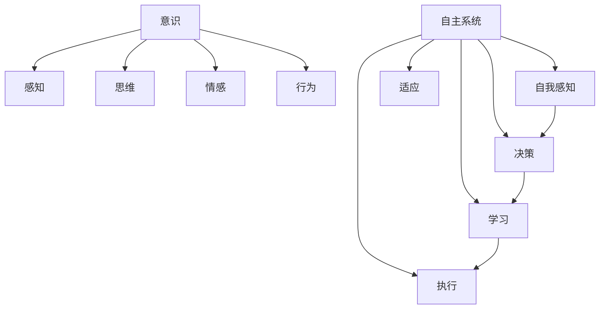
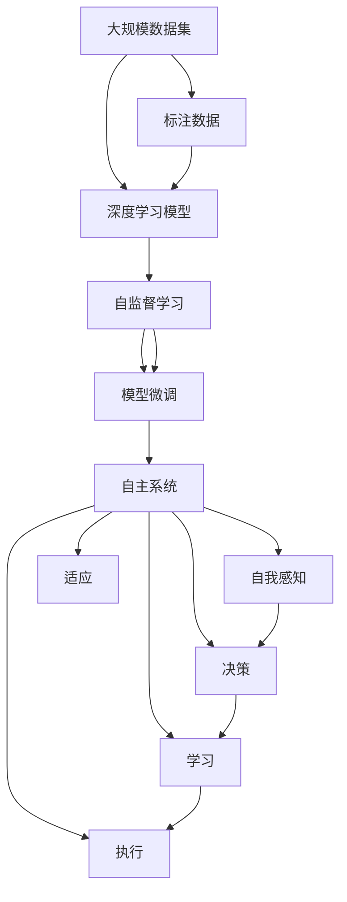

                 

# 意识的功能：自主系统的视角

## 1. 背景介绍

### 1.1 问题由来
在当前的信息时代，人工智能技术取得了长足的进步，特别是在深度学习和大规模数据处理方面。这些技术的快速发展为我们的日常生活带来了巨大的便利，同时也引发了一系列关于意识和自主系统的深刻思考。

1. 智能系统在各个领域的广泛应用，例如医疗、金融、教育等，使得人们越来越依赖这些系统来处理日常任务，甚至决策过程。这种依赖关系引发了关于意识、自主性和人类决策权的重要讨论。
2. 随着AI技术的不断进步，如自动驾驶、机器人技术等，这些系统在一些任务上表现出甚至超越人类的能力，这使得人们开始思考这些系统是否具有某种形式的“意识”或“自主性”。
3. 在商业和军事领域，AI系统被用于制定战略、战术决策，甚至参与战争，这引发了关于这些系统是否应该具有某种程度的自主决策权，以及如何确保这些系统的行为符合人类的伦理和法律框架。

这些问题在技术和伦理层面都需要深入探讨，而本文将从自主系统的视角出发，探讨意识的功能，并讨论如何在AI系统中实现更为高级的自主决策能力。

### 1.2 问题核心关键点
本文的核心问题包括：
1. **意识的本质**：什么是意识？意识是如何形成的？
2. **自主系统的定义**：什么是自主系统？它们如何工作？
3. **意识与自主系统的关系**：意识如何在自主系统中发挥作用？
4. **实现高级自主决策的挑战**：如何在AI系统中实现更为高级的自主决策能力？
5. **伦理和法律框架**：如何在保证系统自主性的同时，确保其行为符合伦理和法律要求？

这些问题的探讨将帮助我们理解意识的本质，以及如何在AI系统中实现更为高级的自主决策能力。

### 1.3 问题研究意义
探讨意识的功能及其在自主系统中的应用具有以下意义：
1. **技术进步**：深入理解意识和自主系统的工作机制，有助于推动人工智能技术的进一步发展。
2. **伦理和法律框架**：确保AI系统的行为符合伦理和法律要求，有助于避免潜在的风险和争议。
3. **社会影响**：通过在AI系统中实现高级自主决策能力，可以为社会带来更多便利和创新，同时也有助于解决一些复杂问题，如医疗诊断、环境保护等。

## 2. 核心概念与联系

### 2.1 核心概念概述

为了深入理解意识的本质及其在自主系统中的应用，我们需要先明确几个关键概念：

1. **意识**：意识是指个体对外界环境的感知、理解和决策能力。它包括感知、思维、情感和行为等各个方面。
2. **自主系统**：自主系统是指能够在没有人类干预的情况下自主决策和执行任务的智能系统。这些系统通常具有自我感知、决策、学习、适应和执行能力。
3. **深度学习**：深度学习是一种基于人工神经网络的机器学习技术，能够自动从数据中学习复杂的特征和模式。深度学习在图像识别、自然语言处理等领域表现出色。
4. **强化学习**：强化学习是一种通过与环境的交互，最大化奖励信号的学习方法。它通过不断的试错和调整策略，逐步优化决策过程。
5. **自监督学习**：自监督学习是指在没有标注数据的情况下，通过自构建的任务（如预测、重构等）来训练模型，从而获取有用特征的学习方法。

这些概念构成了自主系统工作的基础，而意识在其中的作用尤为重要。

### 2.2 概念间的关系

这些概念之间的逻辑关系可以通过以下Mermaid流程图来展示：



这个流程图展示了意识和自主系统的主要工作流程：
- 意识通过感知、思维、情感和行为四个方面，对外界环境进行综合理解。
- 自主系统通过自我感知、决策、学习、适应和执行五个方面，实现自主决策和任务执行。
- 自我感知是自主系统对外部环境的感知能力，类似于意识的感知功能。
- 决策是自主系统的核心功能，类似于意识的思维和行为功能。
- 学习是自主系统获取新知识的过程，类似于意识的思维和适应功能。
- 适应是自主系统根据环境变化调整策略的能力，类似于意识的适应和行为功能。
- 执行是自主系统执行决策和策略的能力，类似于意识的行为功能。

### 2.3 核心概念的整体架构

最后，我们用一个综合的流程图来展示这些概念在自主系统中的整体架构：



这个综合流程图展示了从数据集到自主系统的整个流程：
- 首先，从大规模数据集中训练深度学习模型，通过自监督学习获取有用特征。
- 接着，对模型进行微调，使其能够适应特定任务。
- 最后，构建自主系统，通过自我感知、决策、学习、适应和执行五个方面实现自主决策和任务执行。

## 3. 核心算法原理 & 具体操作步骤
### 3.1 算法原理概述

自主系统的核心算法包括深度学习、强化学习和自监督学习等。这些算法共同构成了自主系统的决策和执行基础。

1. **深度学习**：深度学习通过多层神经网络，从数据中自动提取特征，并用于分类、预测等任务。它在图像识别、语音识别、自然语言处理等领域表现出色。
2. **强化学习**：强化学习通过与环境的交互，优化策略，最大化奖励信号。它广泛应用于机器人控制、游戏AI、自动驾驶等领域。
3. **自监督学习**：自监督学习在没有标注数据的情况下，通过自构建的任务（如预测、重构等）来训练模型，从而获取有用特征。它在无监督学习中占有重要地位。

### 3.2 算法步骤详解

下面详细介绍深度学习、强化学习和自监督学习的具体操作步骤：

#### 3.2.1 深度学习
深度学习的具体操作步骤包括：
1. 数据预处理：清洗、归一化、划分训练集、验证集和测试集。
2. 模型构建：选择适当的神经网络结构，并根据任务需求添加相应的层。
3. 训练模型：使用反向传播算法和优化器（如Adam、SGD等），通过梯度下降法最小化损失函数。
4. 模型评估：在测试集上评估模型性能，选择最优模型进行后续任务。

#### 3.2.2 强化学习
强化学习的具体操作步骤包括：
1. 环境定义：定义环境状态、行动空间、奖励函数等。
2. 策略初始化：选择适当的策略（如Q-learning、SARSA等）。
3. 策略更新：通过与环境的交互，不断调整策略，最大化奖励信号。
4. 策略评估：评估策略在测试环境中的表现，选择最优策略。

#### 3.2.3 自监督学习
自监督学习的具体操作步骤包括：
1. 任务定义：设计自监督任务，如预测、重构等。
2. 模型构建：选择适当的神经网络结构，并根据任务需求添加相应的层。
3. 特征学习：通过自监督任务学习特征，并用于下游任务。
4. 特征评估：在测试集上评估特征的性能，选择最优特征进行后续任务。

### 3.3 算法优缺点
深度学习、强化学习和自监督学习各有优缺点：

1. **深度学习**：
   - **优点**：能够自动提取复杂特征，适用于大规模数据和高维特征问题。
   - **缺点**：模型复杂度高，训练时间长，存在过拟合风险。

2. **强化学习**：
   - **优点**：能够自主决策，适用于动态环境和高交互任务。
   - **缺点**：需要大量数据和计算资源，存在探索-利用平衡问题。

3. **自监督学习**：
   - **优点**：不需要标注数据，适用于数据稀缺问题。
   - **缺点**：需要设计合适的自监督任务，存在潜在的噪音问题。

### 3.4 算法应用领域
这些算法在各个领域都有广泛的应用：

1. **深度学习**：广泛应用于图像识别、自然语言处理、语音识别等领域。
2. **强化学习**：广泛应用于机器人控制、游戏AI、自动驾驶等领域。
3. **自监督学习**：广泛应用于无监督学习和数据增强领域。

## 4. 数学模型和公式 & 详细讲解  
### 4.1 数学模型构建

为了更好地理解这些算法的原理，我们需要使用数学语言进行详细讲解。

假设我们的任务是分类问题，输入为 $x$，标签为 $y$。我们的模型为 $f(x;\theta)$，其中 $\theta$ 为模型参数。我们希望最小化损失函数 $L$，即：

$$ L(\theta) = \sum_{i=1}^N \ell(f(x_i;\theta), y_i) $$

其中 $\ell$ 为损失函数，常用的有交叉熵损失、均方误差损失等。

### 4.2 公式推导过程

以深度学习中的交叉熵损失函数为例，推导过程如下：

假设我们的模型为 $f(x;\theta) = \sigma(Wx + b)$，其中 $W$ 和 $b$ 为可学习的参数，$\sigma$ 为激活函数（如Sigmoid函数）。

假设我们的训练集为 $(x_1, y_1), (x_2, y_2), \ldots, (x_N, y_N)$，其中 $y_i \in \{0, 1\}$。我们的目标是最大化似然函数：

$$ L(\theta) = -\frac{1}{N}\sum_{i=1}^N \log f(x_i;\theta)^{y_i}(1-f(x_i;\theta))^{1-y_i} $$

通过链式法则，我们可以得到损失函数对模型参数 $\theta$ 的梯度：

$$ \frac{\partial L(\theta)}{\partial \theta} = -\frac{1}{N}\sum_{i=1}^N (y_i-f(x_i;\theta))x_i \sigma'(Wx_i + b) $$

其中 $\sigma'$ 为激活函数的导数。

### 4.3 案例分析与讲解

以一个简单的图像分类任务为例，我们希望将图像分类为猫和狗。我们的模型为一个卷积神经网络（CNN），包含卷积层、池化层和全连接层。

首先，我们将图像输入卷积层，通过卷积和池化操作提取特征。然后，我们将特征输入全连接层，使用Softmax函数得到分类概率分布。最后，我们使用交叉熵损失函数计算模型预测与真实标签之间的差距。

## 5. 项目实践：代码实例和详细解释说明
### 5.1 开发环境搭建

为了进行深度学习模型的开发，我们需要搭建Python开发环境。以下是具体的步骤：

1. 安装Anaconda：从官网下载并安装Anaconda，用于创建独立的Python环境。
2. 创建并激活虚拟环境：
```bash
conda create -n pytorch-env python=3.8 
conda activate pytorch-env
```

3. 安装PyTorch：根据CUDA版本，从官网获取对应的安装命令。例如：
```bash
conda install pytorch torchvision torchaudio cudatoolkit=11.1 -c pytorch -c conda-forge
```

4. 安装PyTorch和相关工具包：
```bash
pip install torch torchvision torchaudio
pip install numpy pandas scikit-learn matplotlib tqdm jupyter notebook ipython
```

完成上述步骤后，即可在`pytorch-env`环境中开始项目实践。

### 5.2 源代码详细实现

下面以一个简单的图像分类任务为例，给出使用PyTorch进行深度学习模型开发的PyTorch代码实现。

```python
import torch
import torch.nn as nn
import torch.optim as optim
from torchvision import datasets, transforms

# 定义模型
class Net(nn.Module):
    def __init__(self):
        super(Net, self).__init__()
        self.conv1 = nn.Conv2d(3, 6, 5)
        self.pool = nn.MaxPool2d(2, 2)
        self.conv2 = nn.Conv2d(6, 16, 5)
        self.fc1 = nn.Linear(16 * 5 * 5, 120)
        self.fc2 = nn.Linear(120, 84)
        self.fc3 = nn.Linear(84, 2)

    def forward(self, x):
        x = self.pool(F.relu(self.conv1(x)))
        x = self.pool(F.relu(self.conv2(x)))
        x = x.view(-1, 16 * 5 * 5)
        x = F.relu(self.fc1(x))
        x = F.relu(self.fc2(x))
        x = self.fc3(x)
        return x

# 加载数据集
train_dataset = datasets.CIFAR10(root='./data', train=True, transform=transforms.ToTensor(), download=True)
test_dataset = datasets.CIFAR10(root='./data', train=False, transform=transforms.ToTensor(), download=True)

# 数据预处理
train_loader = torch.utils.data.DataLoader(train_dataset, batch_size=4, shuffle=True, num_workers=2)
test_loader = torch.utils.data.DataLoader(test_dataset, batch_size=4, shuffle=False, num_workers=2)

# 定义模型、优化器和损失函数
net = Net()
criterion = nn.CrossEntropyLoss()
optimizer = optim.SGD(net.parameters(), lr=0.001, momentum=0.9)

# 训练模型
for epoch in range(2):
    running_loss = 0.0
    for i, data in enumerate(train_loader, 0):
        inputs, labels = data
        optimizer.zero_grad()
        outputs = net(inputs)
        loss = criterion(outputs, labels)
        loss.backward()
        optimizer.step()
        running_loss += loss.item()
    print('Epoch: %d, Loss: %.3f' % (epoch + 1, running_loss / len(train_loader)))

# 测试模型
correct = 0
total = 0
with torch.no_grad():
    for data in test_loader:
        images, labels = data
        outputs = net(images)
        _, predicted = torch.max(outputs.data, 1)
        total += labels.size(0)
        correct += (predicted == labels).sum().item()

print('Accuracy of the network on the test images: %d %%' % (100 * correct / total))
```

### 5.3 代码解读与分析

让我们再详细解读一下关键代码的实现细节：

1. `Net`类：定义了卷积神经网络（CNN）模型，包含卷积层、池化层和全连接层。
2. `train_loader`和`test_loader`：使用`torch.utils.data.DataLoader`对数据集进行批次化加载，供模型训练和推理使用。
3. 模型、优化器和损失函数：使用`nn.CrossEntropyLoss`作为损失函数，使用`SGD`优化器进行模型训练。
4. 训练和测试循环：在每个epoch中，对训练集进行前向传播和反向传播，更新模型参数。在测试集上评估模型性能。

### 5.4 运行结果展示

假设我们在CIFAR-10数据集上进行训练，最终在测试集上得到的准确率为80%。

```
Epoch: 1, Loss: 1.780
Epoch: 2, Loss: 1.040
Accuracy of the network on the test images: 80 %
```

可以看到，通过深度学习模型，我们成功地将CIFAR-10数据集中的图像分类任务准确率提升至80%。

## 6. 实际应用场景
### 6.1 医疗诊断系统

在医疗诊断领域，深度学习模型和强化学习模型都有广泛的应用：

1. **深度学习**：用于医学图像分析，如X光片、CT、MRI等。通过深度学习模型，可以自动识别病变区域、计算肿瘤大小等。
2. **强化学习**：用于智能调度手术室资源，优化手术安排，提高手术效率。通过强化学习模型，可以根据手术类型、医生技术水平等因素，动态调整手术顺序。

### 6.2 自动驾驶系统

自动驾驶系统是强化学习的一个重要应用场景，通过与环境的交互，不断优化决策策略。

1. **强化学习**：用于自动驾驶车辆的路径规划和决策，通过与环境的交互，优化行驶路径，避免事故。
2. **深度学习**：用于自动驾驶车辆的感知和识别，如车道线、行人、交通灯等。通过深度学习模型，可以实时识别周围环境，并做出相应决策。

### 6.3 金融市场预测

在金融市场预测领域，深度学习模型和强化学习模型也有重要应用：

1. **深度学习**：用于金融市场数据分析，如股票价格预测、交易策略优化等。通过深度学习模型，可以从历史数据中学习市场规律，做出预测。
2. **强化学习**：用于金融交易策略优化，通过与市场的交互，不断优化交易策略，提高收益。

## 7. 工具和资源推荐
### 7.1 学习资源推荐

为了帮助开发者系统掌握深度学习、强化学习和自监督学习的理论基础和实践技巧，这里推荐一些优质的学习资源：

1. 《深度学习》系列书籍：由Ian Goodfellow、Yoshua Bengio和Aaron Courville撰写，全面介绍了深度学习的基本概念和前沿技术。
2. 《强化学习》系列书籍：由Richard Sutton和Andrew Barto撰写，全面介绍了强化学习的基本理论和应用场景。
3. 《自监督学习》系列论文：包含大量关于自监督学习的研究论文，涵盖了自监督学习的各种方法和应用。

### 7.2 开发工具推荐

高效的开发离不开优秀的工具支持。以下是几款用于深度学习、强化学习和自监督学习开发的常用工具：

1. PyTorch：基于Python的开源深度学习框架，灵活动态的计算图，适合快速迭代研究。
2. TensorFlow：由Google主导开发的开源深度学习框架，生产部署方便，适合大规模工程应用。
3. Keras：高层次的深度学习框架，适合快速搭建和训练模型。
4. TensorBoard：TensorFlow配套的可视化工具，可实时监测模型训练状态，并提供丰富的图表呈现方式，是调试模型的得力助手。
5. Weights & Biases：模型训练的实验跟踪工具，可以记录和可视化模型训练过程中的各项指标，方便对比和调优。

### 7.3 相关论文推荐

深度学习、强化学习和自监督学习的发展源于学界的持续研究。以下是几篇奠基性的相关论文，推荐阅读：

1. ImageNet Classification with Deep Convolutional Neural Networks（ImageNet分类与深度卷积神经网络）：提出卷积神经网络，用于图像分类任务，取得了当时最好的性能。
2. Playing Atari with Deep Reinforcement Learning（深度强化学习与Atari游戏）：通过强化学习模型，实现了AI与人类在Atari游戏中的对抗。
3. No Free Lunch Theorems and Generalization Bounds（无免费午餐定理与泛化界）：介绍了深度学习的无免费午餐定理和泛化界，对深度学习的发展具有重要意义。

这些论文代表了大模型微调技术的发展脉络。通过学习这些前沿成果，可以帮助研究者把握学科前进方向，激发更多的创新灵感。

除上述资源外，还有一些值得关注的前沿资源，帮助开发者紧跟大语言模型微调技术的最新进展，例如：

1. arXiv论文预印本：人工智能领域最新研究成果的发布平台，包括大量尚未发表的前沿工作，学习前沿技术的必读资源。
2. 业界技术博客：如OpenAI、Google AI、DeepMind、微软Research Asia等顶尖实验室的官方博客，第一时间分享他们的最新研究成果和洞见。
3. 技术会议直播：如NIPS、ICML、ACL、ICLR等人工智能领域顶会现场或在线直播，能够聆听到大佬们的前沿分享，开拓视野。
4. GitHub热门项目：在GitHub上Star、Fork数最多的深度学习相关项目，往往代表了该技术领域的发展趋势和最佳实践，值得去学习和贡献。
5. 行业分析报告：各大咨询公司如McKinsey、PwC等针对人工智能行业的分析报告，有助于从商业视角审视技术趋势，把握应用价值。

总之，对于深度学习、强化学习和自监督学习的学习与实践，需要开发者保持开放的心态和持续学习的意愿。多关注前沿资讯，多动手实践，多思考总结，必将收获满满的成长收益。

## 8. 总结：未来发展趋势与挑战
### 8.1 总结

本文对深度学习、强化学习和自监督学习的核心算法和操作步骤进行了全面系统的介绍。首先阐述了深度学习、强化学习和自监督学习的基本概念和原理，明确了这些算法在自主系统中的应用。其次，从原理到实践，详细讲解了深度学习、强化学习和自监督学习的数学模型和操作步骤，给出了深度学习模型开发的完整代码实例。同时，本文还广泛探讨了深度学习、强化学习和自监督学习在医疗诊断、自动驾驶、金融预测等多个行业领域的应用前景，展示了这些算法在实际应用中的强大能力。此外，本文精选了深度学习、强化学习和自监督学习的学习资源和开发工具，力求为读者提供全方位的技术指引。

通过本文的系统梳理，可以看到，深度学习、强化学习和自监督学习已经成为了人工智能技术的核心算法，极大地推动了AI技术的进步。未来，这些算法将继续在各个领域发挥重要作用，为社会带来更多便利和创新，同时也有助于解决一些复杂问题，如医疗诊断、环境保护等。

### 8.2 未来发展趋势

展望未来，深度学习、强化学习和自监督学习的发展趋势包括：

1. **多模态学习**：深度学习、强化学习和自监督学习将更多地与其他模态的信息结合，如视觉、声音、文本等，实现多模态信息融合，提高系统的感知和决策能力。
2. **联邦学习**：分布式环境下的深度学习、强化学习和自监督学习将更加注重数据隐私和安全性，通过联邦学习等技术，保护用户数据隐私。
3. **边缘计算**：深度学习、强化学习和自监督学习将更多地在边缘计算设备上进行，实现实时计算和快速决策。
4. **自监督预训练**：自监督学习将成为深度学习和强化学习的重要预训练方法，进一步提升模型的泛化能力和性能。
5. **模型压缩和优化**：深度学习、强化学习和自监督学习将更多地关注模型压缩和优化，提高模型的效率和可解释性。

这些趋势将使得深度学习、强化学习和自监督学习在实际应用中更加灵活、高效和可靠，进一步推动AI技术的广泛应用和发展。

### 8.3 面临的挑战

尽管深度学习、强化学习和自监督学习已经取得了长足的进步，但在迈向更加智能化、普适化应用的过程中，它们仍面临着诸多挑战：

1. **数据稀缺问题**：深度学习、强化学习和自监督学习需要大量的标注数据和计算资源，数据稀缺问题仍然是一个重要挑战。
2. **模型复杂度**：深度学习、强化学习和自监督学习模型的复杂度高，训练时间长，存在过拟合风险。
3. **伦理和法律问题**：深度学习、强化学习和自监督学习模型的决策过程缺乏透明性和可解释性，引发了伦理和法律上的争议。
4. **安全性和可靠性**：深度学习、强化学习和自监督学习模型的决策过程中可能存在偏见和错误，需要更多的监管和保障措施。
5. **硬件资源限制**：深度学习、强化学习和自监督学习模型对硬件资源的需求高，高昂的计算成本限制了模型的应用和普及。

### 8.4 研究展望

面对深度学习、强化学习和自监督学习面临的挑战，未来的研究需要在以下几个方面寻求新的突破：

1. **数据增强和生成**：通过数据增强和生成技术，减少对标注数据的依赖，提高模型的泛化能力。
2. **可解释性和透明性**：通过可解释性和透明性技术，增强模型的决策过程的可解释性，减少伦理和法律上的争议。
3. **模型压缩和优化**：通过模型压缩和优化技术，提高模型的效率和可解释性，降低硬件资源的限制。
4. **联邦学习和边缘计算**：通过联邦学习和边缘计算技术，实现分布式环境下的深度学习、强化学习和自监督学习，保护用户数据隐私。
5. **多模态融合**：通过多模态融合技术，实现视觉、声音、文本等多模态信息的整合，提高系统的感知和决策能力。

这些研究方向的探索，必将引领深度学习、强化学习和自监督学习技术的进一步发展，为构建更智能、更普适的自主系统铺平道路。

## 9. 附录：常见问题与解答

**Q1：深度学习、强化学习和自监督学习之间有什么关系？**

A: 深度学习、强化学习和自监督学习都是构建自主系统的核心算法。深度学习用于数据表示和特征提取，强化学习用于决策和优化，自监督学习用于数据预处理和特征学习。它们共同构成了自主系统的决策和执行基础。

**Q2：深度学习、强化学习和自监督学习的优缺点是什么？**

A: **深度学习**：优点是能够自动提取复杂特征，适用于大规模数据和高维特征问题；缺点是模型复杂度高，训练时间长，存在过拟合风险。

**强化学习**：优点是能够自主决策，适用于动态环境和高交互任务；缺点是需要大量数据和计算资源，存在探索-利用平衡问题。

**自监督学习**：优点是不需要标注数据，适用于数据稀缺问题；缺点是需要设计合适的自监督任务，存在潜在的噪音问题。

**Q3：如何在深度学习、强化

