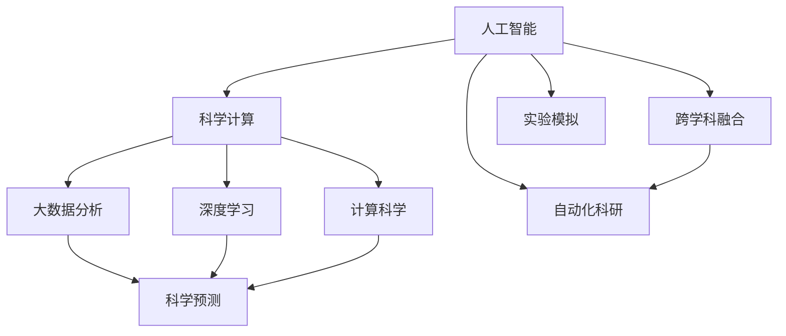
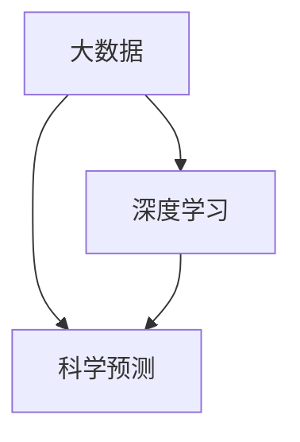
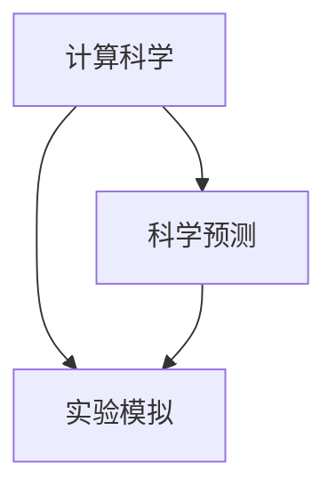
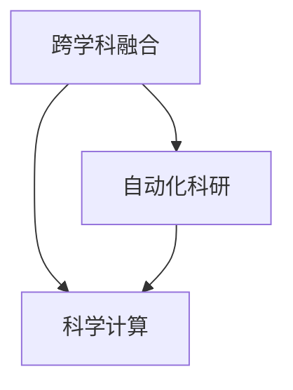
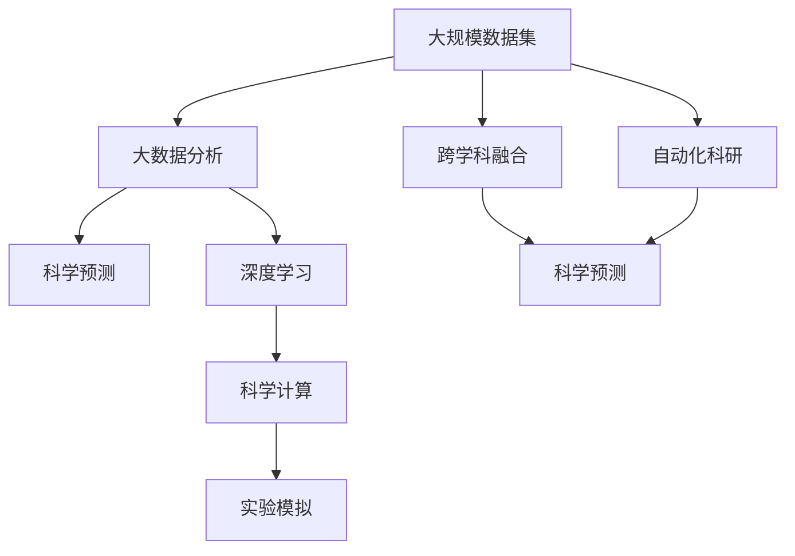

                 

# 打破学科与产业界限的AI for Science

> 关键词：人工智能(AI),科学计算(Computational Science),跨学科融合,大数据分析,深度学习,机器学习(ML),计算科学(Computational Science),高性能计算(HPC),科学预测,实验模拟,自动化科研(Research Automation),开源科学平台

## 1. 背景介绍

### 1.1 问题由来
在当今科技飞速发展的时代，人工智能(AI)技术已经成为推动科学与工程进步的重要引擎。AI在数据驱动的决策支持、自动化科研、科学模拟与预测等方面展现了巨大的潜力和前景。然而，AI在科学计算领域的应用还存在诸多瓶颈，如数据获取难、处理复杂、模型选择困难等。同时，科学计算领域的复杂性、专业性也给AI技术的开发和部署带来了挑战。

### 1.2 问题核心关键点
AI for Science旨在打破学科与产业的界限，将AI技术应用于科学计算领域，推动科研范式的变革。AI for Science的关键点包括：

- **跨学科融合**：将AI技术与科学研究相结合，利用机器学习和深度学习技术处理海量数据，提取科学知识。
- **大数据分析**：通过数据挖掘和机器学习算法，从大量实验数据中提取规律和洞察。
- **计算科学**：结合高性能计算、分布式计算等技术，提升科学计算的效率和精度。
- **科学预测**：利用AI模型对科学现象进行模拟与预测，辅助科学决策。
- **实验模拟**：构建虚拟实验平台，提升实验效率，减少实验成本。
- **自动化科研**：通过AI算法自动设计实验方案、数据分析和结果报告，加速科研进程。

### 1.3 问题研究意义
AI for Science的研究和应用具有重要意义：

- **提高科研效率**：自动化、智能化科研工具可以显著提高科研工作的效率和准确性。
- **促进科学发现**：AI技术能够处理大量实验数据，从中发现新规律和科学现象。
- **推动学科交叉**：AI for Science为不同学科的融合提供了新思路，推动了跨学科研究的发展。
- **促进科学普及**：通过可视化和交互式科研工具，提高了科学研究的可接近性和可理解性。
- **提升创新能力**：AI技术为科研工作者提供了新的工具和方法，激发了科研创新思维。
- **助力产业升级**：AI for Science技术在科研中的应用，能够推动相关产业的发展，提升产业竞争力。

## 2. 核心概念与联系

### 2.1 核心概念概述

为了更好地理解AI for Science的核心概念，本节将介绍几个关键概念：

- **人工智能(AI)**：通过模拟人类智能过程，实现信息处理和智能决策的计算技术。
- **科学计算(Computational Science)**：使用计算机技术解决科学问题的过程，包括建模、仿真、数据分析等。
- **跨学科融合**：将不同学科的知识、技术和方法融合，形成新的科研范式。
- **大数据分析**：通过数据处理和机器学习算法，从大规模数据中提取有用的信息和知识。
- **深度学习(Deep Learning)**：一种模拟人类神经网络的机器学习算法，能够处理复杂模式识别和决策任务。
- **计算科学(Computational Science)**：利用计算机技术解决科学问题的学科，涉及高性能计算、分布式计算、科学可视化等。
- **科学预测**：使用模型对未来科学现象进行预测和模拟，辅助科学决策。
- **实验模拟**：利用计算机模型进行虚拟实验，提升实验效率，减少实验成本。
- **自动化科研**：利用AI技术自动设计实验方案、分析数据和生成报告，加速科研进程。

这些概念之间的逻辑关系可以通过以下Mermaid流程图来展示：



这个流程图展示了大语言模型微调过程中各个核心概念的关系和作用：

1. AI作为数据处理和智能决策的核心工具，支持大数据分析和深度学习。
2. 科学计算和大数据结合，进行科学预测和实验模拟。
3. 跨学科融合和自动化科研技术，提升科研效率和科学发现能力。

### 2.2 概念间的关系

这些核心概念之间存在着紧密的联系，形成了AI for Science的整体生态系统。下面我们通过几个Mermaid流程图来展示这些概念之间的关系。

#### 2.2.1 大数据与深度学习



这个流程图展示了大数据分析与深度学习的基本关系。大数据分析提供了大量的数据支持，而深度学习则通过机器学习算法从中提取模式和规律。

#### 2.2.2 计算科学与科学预测



这个流程图展示了计算科学与科学预测之间的关系。计算科学提供了高效计算和分布式处理能力，而科学预测则利用计算科学的结果进行模型训练和预测。

#### 2.2.3 跨学科融合与自动化科研



这个流程图展示了跨学科融合与自动化科研的关系。跨学科融合提供了新的研究视角和方法，而自动化科研则利用跨学科融合的技术，加速科研过程。

### 2.3 核心概念的整体架构

最后，我们用一个综合的流程图来展示这些核心概念在大语言模型微调过程中的整体架构：



这个综合流程图展示了从大数据分析到科学预测的整体流程。大语言模型微调技术将AI技术应用于科学计算，推动了科研范式的变革，加速了科学发现和实验模拟的进程。

## 3. 核心算法原理 & 具体操作步骤
### 3.1 算法原理概述

AI for Science的核心算法原理包括：

- **数据预处理**：对原始数据进行清洗、归一化和特征提取，为模型训练提供高质量的输入。
- **模型训练**：通过机器学习和深度学习算法，对数据集进行训练，提取科学知识。
- **模型评估**：利用测试集对模型进行评估，确保模型具有泛化能力。
- **模型部署**：将训练好的模型部署到生产环境中，进行实时预测和模拟。
- **数据融合**：将多个数据源和模型结果进行融合，提供更全面和准确的科学洞察。

### 3.2 算法步骤详解

AI for Science的算法步骤大致如下：

1. **数据准备**：收集、清洗和预处理数据，准备输入模型。
2. **模型选择**：选择适当的机器学习或深度学习模型，根据数据特点和科研需求进行微调。
3. **模型训练**：利用训练集对模型进行训练，调整模型参数。
4. **模型评估**：在测试集上评估模型性能，进行参数调优。
5. **模型部署**：将训练好的模型部署到实际科研应用中，进行实时预测和模拟。
6. **数据融合**：将不同数据源和模型结果进行融合，提供综合的科学洞察。

### 3.3 算法优缺点

AI for Science的算法优缺点如下：

#### 优点：

- **高效处理海量数据**：通过机器学习和大数据技术，能够高效处理和分析大规模数据。
- **提升科研效率**：自动化科研工具能够加速实验设计和数据处理过程，提升科研效率。
- **促进跨学科融合**：跨学科融合提供了新的研究视角和方法，推动了科学进步。
- **科学预测准确性高**：利用AI模型进行科学预测，可以提供高准确性的预测结果。

#### 缺点：

- **数据获取难度大**：高质量的科学数据获取难度较大，需要进行大量实验和调查。
- **模型选择复杂**：选择合适的机器学习或深度学习模型，需要大量经验和专业知识。
- **模型解释性不足**：复杂的模型难以解释其内部工作机制，缺乏可解释性。
- **计算资源需求高**：大规模数据和复杂模型的训练和部署需要大量的计算资源。
- **模型稳定性差**：AI模型在面对新数据和新情况时，容易发生过拟合和泛化能力不足的问题。

### 3.4 算法应用领域

AI for Science的算法在以下领域具有广泛应用：

1. **生物医学**：利用AI技术分析基因数据、蛋白质结构、药物筛选等，提升医学研究的效率和精度。
2. **环境科学**：通过AI技术分析气候数据、污染监测、生态系统模拟等，推动环境保护和可持续发展。
3. **物理科学**：利用AI技术进行材料模拟、粒子物理实验、宇宙探索等，加速科学研究进程。
4. **社会经济**：利用AI技术分析经济数据、社会行为、城市规划等，推动社会科学研究。
5. **能源工程**：通过AI技术分析能源数据、优化能源系统、探索新能源等，推动能源转型。
6. **农业科学**：利用AI技术分析作物数据、气候预测、农业机器人等，提升农业生产效率。

## 4. 数学模型和公式 & 详细讲解 & 举例说明

### 4.1 数学模型构建

在AI for Science中，常用的数学模型包括：

- **回归模型**：用于预测连续型数据，如股票价格、气温等。
- **分类模型**：用于分类问题，如疾病诊断、物种识别等。
- **聚类模型**：用于将数据分组，如基因表达数据的聚类分析。
- **神经网络模型**：用于复杂模式识别和决策任务，如自然语言处理、图像识别等。

### 4.2 公式推导过程

以线性回归模型为例，其数学模型为：

$$
y = \theta_0 + \theta_1 x_1 + \theta_2 x_2 + \cdots + \theta_n x_n
$$

其中，$y$为预测值，$x_i$为输入特征，$\theta_i$为模型参数。线性回归模型的目标是最小化预测值与真实值之间的平方误差，即：

$$
\min_{\theta} \sum_{i=1}^n (y_i - \theta_0 - \theta_1 x_{i1} - \theta_2 x_{i2} - \cdots - \theta_n x_{in})^2
$$

利用梯度下降等优化算法，可以求解上述最优化问题，找到最优参数$\theta$。

### 4.3 案例分析与讲解

假设我们有一个房屋销售价格预测模型，已知历史数据包含房屋面积、位置、房龄等特征，以及房屋销售价格。利用线性回归模型，我们可以对新房屋的销售价格进行预测。

```python
from sklearn.linear_model import LinearRegression
from sklearn.datasets import load_boston

# 加载数据
boston = load_boston()
X = boston.data
y = boston.target

# 构建线性回归模型
model = LinearRegression()

# 训练模型
model.fit(X, y)

# 预测新数据
new_data = [[20, 10, 1990]]
predicted_price = model.predict(new_data)
print(predicted_price)
```

通过上述代码，我们利用线性回归模型对房屋销售价格进行了预测，展示了AI for Science在实际应用中的基本流程和技巧。

## 5. 项目实践：代码实例和详细解释说明
### 5.1 开发环境搭建

在进行AI for Science项目开发前，我们需要准备好开发环境。以下是使用Python进行Scikit-learn开发的环境配置流程：

1. 安装Anaconda：从官网下载并安装Anaconda，用于创建独立的Python环境。

2. 创建并激活虚拟环境：
```bash
conda create -n sklearn-env python=3.8 
conda activate sklearn-env
```

3. 安装Scikit-learn：
```bash
pip install scikit-learn
```

4. 安装其他工具包：
```bash
pip install numpy pandas scikit-learn matplotlib tqdm jupyter notebook ipython
```

完成上述步骤后，即可在`sklearn-env`环境中开始项目开发。

### 5.2 源代码详细实现

下面我们以房价预测项目为例，给出使用Scikit-learn进行回归分析的Python代码实现。

首先，定义数据处理函数：

```python
import pandas as pd
from sklearn.model_selection import train_test_split

# 加载数据
data = pd.read_csv('house_prices.csv')

# 数据预处理
X = data.drop(['price'], axis=1)
y = data['price']

# 划分训练集和测试集
X_train, X_test, y_train, y_test = train_test_split(X, y, test_size=0.2, random_state=42)

# 训练集和测试集的数据标准化
from sklearn.preprocessing import StandardScaler
scaler = StandardScaler()
X_train = scaler.fit_transform(X_train)
X_test = scaler.transform(X_test)
```

然后，定义模型和优化器：

```python
from sklearn.linear_model import LinearRegression
from sklearn.metrics import mean_squared_error

# 构建线性回归模型
model = LinearRegression()

# 训练模型
model.fit(X_train, y_train)

# 在测试集上评估模型性能
y_pred = model.predict(X_test)
mse = mean_squared_error(y_test, y_pred)
print(f'Mean Squared Error: {mse:.2f}')
```

最后，启动训练流程并在测试集上评估：

```python
# 训练模型
model.fit(X_train, y_train)

# 在测试集上评估模型性能
y_pred = model.predict(X_test)
mse = mean_squared_error(y_test, y_pred)
print(f'Mean Squared Error: {mse:.2f}')
```

以上就是使用Scikit-learn进行房价预测项目的完整代码实现。可以看到，Scikit-learn提供了强大的机器学习工具库，使得回归模型的实现变得简单高效。

### 5.3 代码解读与分析

让我们再详细解读一下关键代码的实现细节：

**数据处理函数**：
- 加载CSV数据集
- 去除不必要的价格列
- 将数值型特征和标签分开
- 将数据集划分为训练集和测试集，并进行标准化处理。

**模型选择与训练**：
- 选择线性回归模型，作为房价预测的基本模型。
- 在训练集上训练模型，找到最优的回归参数。

**模型评估**：
- 在测试集上使用均方误差评估模型的预测性能。

**训练流程**：
- 在训练集上训练模型，并在测试集上评估性能。

可以看到，Scikit-learn使得机器学习模型的开发和评估变得非常简单，大大降低了开发难度。在实际应用中，我们还可以利用Scikit-learn的其他功能，如交叉验证、模型调参等，进一步提升模型的性能。

## 6. 实际应用场景

### 6.1 生物医学

在生物医学领域，AI for Science技术具有广泛的应用。例如，利用深度学习模型分析基因组数据，可以从海量生物数据中发现新的基因突变和疾病特征，辅助疾病诊断和治疗。AI还可以用于药物研发，通过预测化合物活性，加速新药筛选和设计。

### 6.2 环境科学

环境科学领域涉及大量的数据处理和模型预测。AI for Science技术可以帮助分析气候数据、污染监测等，提供环境变化的预测模型，推动环境保护和可持续发展。例如，利用AI技术分析空气质量数据，可以预测污染物的扩散趋势，制定有效的污染控制措施。

### 6.3 物理科学

物理科学领域需要大量的计算模拟和数据分析。AI for Science技术可以通过机器学习和大数据技术，进行复杂物理系统的模拟和预测，推动科学研究的进展。例如，利用AI技术模拟材料微观结构，预测材料的性能，优化新材料的设计。

### 6.4 未来应用展望

随着AI for Science技术的不断发展，其在更多领域的应用前景将更加广阔。

- **天文学**：利用AI技术分析天文数据，预测天体运动和爆炸事件，推动天文学研究。
- **地质学**：利用AI技术分析地质数据，预测地震、火山爆发等自然灾害，提高灾害预警和应急响应能力。
- **化学工程**：利用AI技术优化化学反应过程，提高生产效率和产品质量，推动化学工程的发展。
- **社会科学**：利用AI技术分析社会行为数据，预测社会趋势，辅助政策制定和公共管理。
- **交通运输**：利用AI技术优化交通系统，预测交通流量和事故风险，提高交通管理效率。

总之，AI for Science技术将在更多领域带来革命性变革，推动科学进步和社会发展。

## 7. 工具和资源推荐
### 7.1 学习资源推荐

为了帮助开发者系统掌握AI for Science的理论基础和实践技巧，这里推荐一些优质的学习资源：

1. **《Python数据科学手册》**：详细介绍了Python在数据科学中的应用，包括数据处理、机器学习、深度学习等。

2. **Coursera《机器学习》课程**：由斯坦福大学Andrew Ng教授主讲，介绍了机器学习的原理和应用。

3. **Kaggle机器学习竞赛**：通过参与实际项目，积累实战经验，提升数据处理和模型训练能力。

4. **DeepLearning.ai课程**：由Google DeepMind团队开发，介绍了深度学习的原理和应用。

5. **Towards Data Science博客**：提供了大量数据科学和机器学习的实战案例和技术分享，是学习资源的重要补充。

6. **ArXiv论文预印本**：人工智能领域最新研究成果的发布平台，学习前沿技术的必备资源。

通过对这些资源的学习实践，相信你一定能够快速掌握AI for Science的精髓，并用于解决实际的科学计算问题。

### 7.2 开发工具推荐

高效的开发离不开优秀的工具支持。以下是几款用于AI for Science开发的常用工具：

1. **Jupyter Notebook**：交互式编程环境，支持Python、R等多种语言，适合数据处理和模型训练。

2. **TensorFlow**：由Google开发的深度学习框架，支持分布式计算和模型部署。

3. **Scikit-learn**：Python的机器学习库，提供了丰富的模型和工具，适合快速原型开发和模型评估。

4. **Keras**：基于TensorFlow的高级神经网络库，简单易用，适合快速开发和实验。

5. **PyTorch**：Facebook开发的深度学习框架，支持动态计算图和模型优化。

6. **Anaconda**：开源的数据科学和深度学习环境管理工具，提供易用的虚拟环境和包管理。

7. **JupyterLab**：Jupyter Notebook的下一代版本，支持交互式界面和模块化开发。

合理利用这些工具，可以显著提升AI for Science的开发效率，加快创新迭代的步伐。

### 7.3 相关论文推荐

AI for Science的研究和应用源于学界的持续研究。以下是几篇奠基性的相关论文，推荐阅读：

1. **Deep Learning for Drug Discovery**：介绍深度学习在药物筛选和设计中的应用。

2. **Machine Learning for Environmental Monitoring**：讨论机器学习在环境监测和预测中的应用。

3. **Computational Science and Engineering**：综述计算科学和工程领域的最新研究进展。

4. **Scalable Deep Learning for Physics**：介绍深度学习在物理科学中的应用。

5. **Automatic Feature Engineering for Drug Discovery**：探讨自动特征工程在药物研发中的应用。

6. **Computational Methods in Environmental Science**：综述计算方法在环境科学中的应用。

这些论文代表了大语言模型微调技术的发展脉络。通过学习这些前沿成果，可以帮助研究者把握学科前进方向，激发更多的创新灵感。

## 8. 总结：未来发展趋势与挑战
### 8.1 总结

本文对AI for Science进行了全面系统的介绍。首先阐述了AI for Science的研究背景和意义，明确了AI技术在科学计算领域的应用价值。其次，从原理到实践，详细讲解了AI for Science的数学模型和关键步骤，给出了AI for Science任务开发的完整代码实例。同时，本文还广泛探讨了AI for Science技术在生物医学、环境科学、物理科学等多个领域的应用前景，展示了AI for Science技术的巨大潜力。此外，本文精选了AI for Science技术的学习资源，力求为读者提供全方位的技术指引。

通过本文的系统梳理，可以看到，AI for Science技术正在成为科学计算领域的重要范式，极大地拓展了科学计算的应用边界，加速了科研范式的变革。未来，伴随AI技术的不断进步，AI for Science必将在更多领域带来变革性影响，为人类认知智能的进化带来深远影响。

### 8.2 未来发展趋势

展望未来，AI for Science技术将呈现以下几个发展趋势：

1. **数据驱动的科学研究**：利用大数据和机器学习技术，从海量数据中提取科学知识，推动科学发现。
2. **跨学科融合加速**：跨学科融合将提供新的研究视角和方法，促进不同学科的交叉和融合。
3. **自动化科研工具普及**：自动化科研工具将提高科研效率，加速科研进程。
4. **科学预测和模拟精度提升**：通过更先进的算法和模型，提升科学预测和模拟的准确性和可靠性。
5. **科学计算资源优化**：利用高性能计算和分布式计算技术，优化科学计算资源，提升计算效率。
6. **科学发现和应用协同**：推动科学研究与应用的协同创新，实现更高效的科研转化。

以上趋势凸显了AI for Science技术的广阔前景。这些方向的探索发展，必将进一步提升AI for Science系统的性能和应用范围，为人类认知智能的进化带来深远影响。

### 8.3 面临的挑战

尽管AI for Science技术已经取得了瞩目成就，但在迈向更加智能化、普适化应用的过程中，它仍面临着诸多挑战：

1. **数据获取难度大**：高质量的科学数据获取难度较大，需要进行大量实验和调查。
2. **模型选择复杂**：选择合适的机器学习或深度学习模型，需要大量经验和专业知识。
3. **模型解释性不足**：复杂的模型难以解释其内部工作机制，缺乏可解释性。
4. **计算资源需求高**：大规模数据和复杂模型的训练和部署需要大量的计算资源。
5. **模型稳定性差**：AI模型在面对新数据和新情况时，容易发生过拟合和泛化能力不足的问题。
6. **伦理和安全性问题**：AI模型的应用需要考虑伦理和安全性问题，确保输出的安全性和公正性。

正视AI for Science面临的这些挑战，积极应对并寻求突破，将是大语言模型微调技术迈向成熟的必由之路。相信随着学界和产业界的共同努力，这些挑战终将一一被克服，AI for Science技术必将在构建人机协同的智能时代中扮演越来越重要的角色。

### 8.4 研究展望

面向未来，AI for Science技术需要在以下几个方面寻求新的突破：

1. **多模态数据融合**：将文本、图像、视频等多模态数据融合，提升AI模型的全面性和精确性。
2. **跨学科数据共享**：建立跨学科的数据共享平台，促进数据和知识的交流和共享。
3. **自适应算法**：开发自适应学习算法，根据数据特点和任务需求，自动调整模型参数和结构。
4. **模型可解释性**：引入可解释性算法，提高AI模型的透明度和可信度。
5. **伦理和安全性保障**：建立AI模型的伦理和安全性评估机制，确保模型应用的公正性和安全性。
6. **自动化科研平台**：开发自动化科研平台，提供一站式的科研工具和环境支持。

这些研究方向的探索，必将引领AI for Science技术迈向更高的台阶，为构建安全、可靠、可解释、可控的智能系统铺平道路。面向未来，AI for Science技术还需要与其他人工智能技术进行更深入的融合，如知识表示、因果推理、强化学习等，多路径协同发力，共同推动人工智能技术的发展。只有勇于创新、敢于突破，才能不断拓展AI for Science技术的边界，让智能技术更好地造福人类社会。

## 9. 附录：常见问题与解答

**Q1：AI for Science是否只适用于数据驱动的科学？**

A: AI for Science不仅适用于数据驱动的科学，还可以应用于理论驱动的科学。AI技术可以帮助科学家在实验数据和理论模型之间架起桥梁，推动科学发现和应用。

**Q2：AI for Science的计算资源需求是否过高？**

A: 是的，AI for Science技术需要大量的计算资源。然而，随着高性能计算和分布式计算技术的发展，AI for Science的计算资源需求可以得到有效控制。

**Q3：AI for Science在科研中的作用是否只限于预测和模拟？**

A: AI for Science在科研中的作用不仅限于预测和模拟，还包括数据处理、实验设计、模型优化等多个方面。AI for Science技术可以大大提高科研效率和科研水平。

**Q4：AI for Science是否存在伦理和安全性问题？**

A: 是的，AI for Science技术在应用过程中需要注意伦理和安全性问题。科学家需要关注模型的公正性、安全性、隐私保护等问题，确保AI技术的应用不会带来新的风险。

**Q5：AI for Science在科研中的应用前景如何？**

A: AI for Science技术在科研中的应用前景非常广阔。AI for Science技术可以推动各个学科的研究，促进科学发现和技术进步。

总之，AI for Science技术将在更多领域带来革命性变革，推动科学进步和社会发展。

