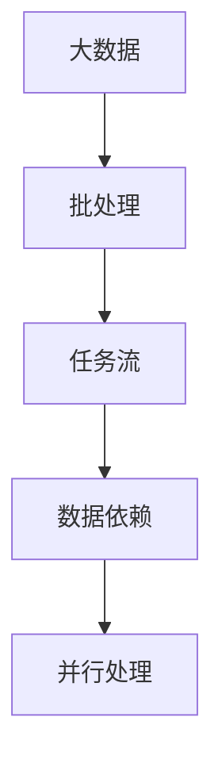
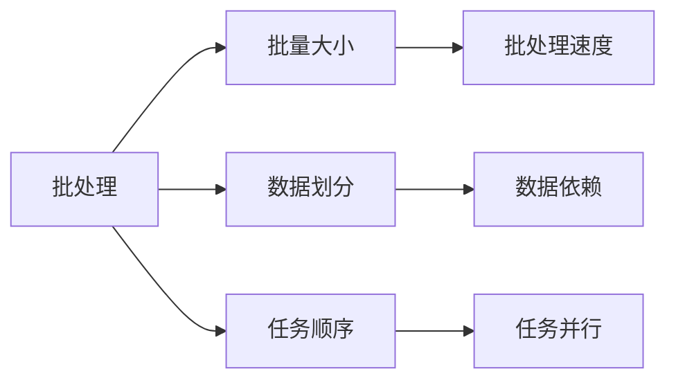
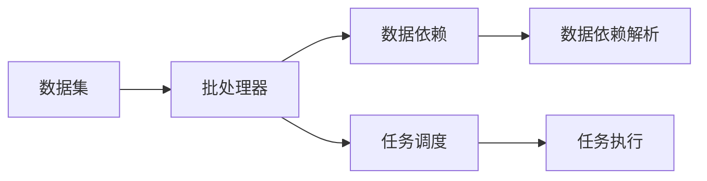
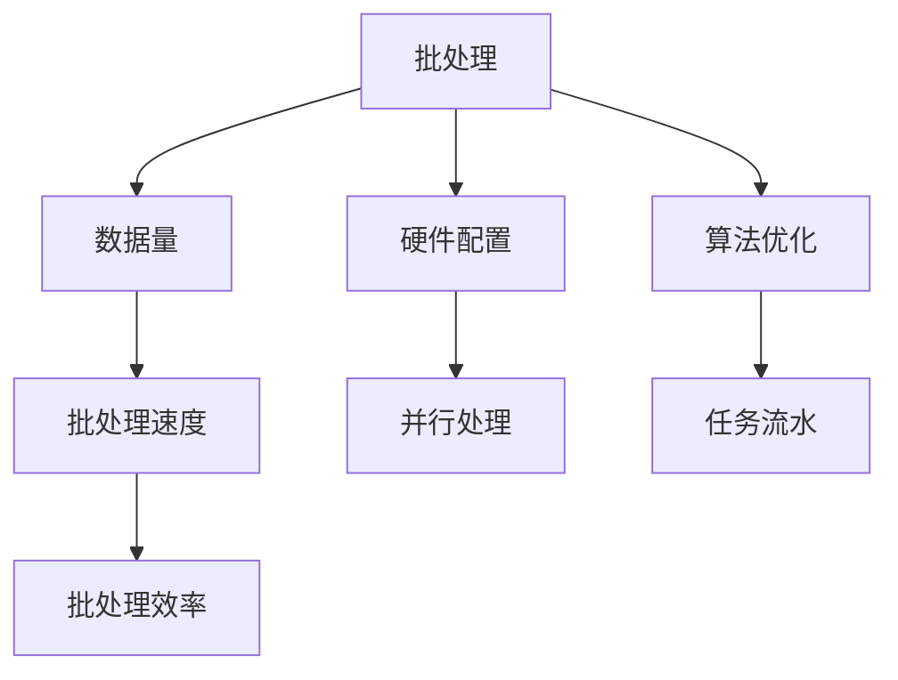
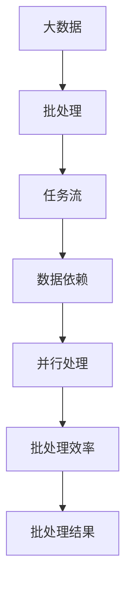

                 

# 批处理 原理与代码实例讲解

> 关键词：批处理, 批处理算法, 批处理原理, 批处理步骤, 批处理案例, 批处理代码, 批处理工具, 批处理应用

## 1. 背景介绍

### 1.1 问题由来

在当今高速发展的数字化时代，数据量呈爆炸式增长，各行各业的数据处理需求日益增多。面对海量数据，如何高效、可靠地进行数据处理，成为许多企业和科研机构关注的焦点。

批处理技术作为一种经典的数据处理方式，因其高效、稳定、可扩展性强等特点，在数据密集型应用中被广泛采用。从大型企业的数据仓库构建，到科研机构的计算集群搭建，再到个人数据的简单整理，批处理技术在数据处理领域占据着重要地位。

### 1.2 问题核心关键点

批处理技术的核心思想是将数据分批处理，从而提升数据处理效率。在实际应用中，如何设计高效的批处理算法，选择合适的工具，并实现稳定可靠的数据处理流程，是批处理技术的关键。

批处理技术主要涉及以下几个核心概念：

- 批量(Batch)：指将大量数据划分为若干批次，逐批进行处理。
- 任务流(Task Flow)：指数据处理任务的有序执行流程，通常由多个批处理步骤组成。
- 数据依赖(Data Dependency)：指不同批处理任务之间的依赖关系，确保数据处理任务的正确性。
- 并行处理(Parallel Processing)：指利用多台机器或多个CPU同时执行批处理任务，提升数据处理速度。

理解这些核心概念，有助于更好地掌握批处理技术的原理和实现方法。

## 2. 核心概念与联系

### 2.1 核心概念概述

为了更好地理解批处理技术的原理和应用，本节将介绍几个关键的核心概念：

- 批处理(Batch Processing)：指将大量数据按照一定规则分批处理，以提高数据处理效率。
- 任务流(Task Flow)：指数据处理任务的有序执行流程，由多个批处理步骤组成。
- 数据依赖(Data Dependency)：指不同批处理任务之间的依赖关系，确保数据处理任务的正确性。
- 并行处理(Parallel Processing)：指利用多台机器或多个CPU同时执行批处理任务，提升数据处理速度。

这些核心概念之间的逻辑关系可以通过以下Mermaid流程图来展示：



这个流程图展示了批处理技术的基本架构：大数据通过批处理进行分批处理，形成有序的任务流，并通过数据依赖保证处理任务的正确性，同时利用并行处理提升处理速度。

### 2.2 概念间的关系

这些核心概念之间存在着紧密的联系，形成了批处理技术的完整生态系统。下面我们通过几个Mermaid流程图来展示这些概念之间的关系。

#### 2.2.1 批处理算法设计



这个流程图展示了批处理算法的设计过程。批处理算法主要涉及批量大小的选择、数据的划分、任务的顺序以及并行处理等方面。

#### 2.2.2 批处理流程与调度



这个流程图展示了批处理流程与调度的基本框架。批处理流程主要涉及数据的输入、批处理器的处理、数据依赖的解析以及任务的调度等方面。

#### 2.2.3 批处理效率优化



这个流程图展示了批处理效率优化的几个关键因素，包括数据量、硬件配置、算法优化、并行处理以及任务流水等方面。

### 2.3 核心概念的整体架构

最后，我们用一个综合的流程图来展示这些核心概念在大数据处理中的整体架构：



这个综合流程图展示了大数据处理的基本流程，从数据的输入、批处理、任务流、数据依赖、并行处理到最终的处理结果，涵盖了批处理技术的各个方面。

## 3. 核心算法原理 & 具体操作步骤

### 3.1 算法原理概述

批处理技术的主要算法原理是通过将大量数据按照一定规则分批处理，从而提升数据处理效率。具体来说，批处理算法包括以下几个关键步骤：

1. **数据划分**：将大规模数据集划分为若干个大小相等的批次，每个批次包含一定数量的数据记录。
2. **任务调度**：根据数据依赖关系，确定每个批次的处理顺序，确保数据处理任务的正确性。
3. **并行处理**：利用多台机器或多个CPU同时执行批处理任务，提高数据处理速度。
4. **结果合并**：将各批次的处理结果进行合并，形成最终的数据处理结果。

### 3.2 算法步骤详解

以下是批处理技术的主要操作步骤：

1. **数据划分**：
   - 根据数据量大小和批处理器的处理能力，确定每个批次的数量和大小。
   - 将数据集按照批次大小进行划分，生成若干个批次数据集。

2. **任务调度**：
   - 根据数据依赖关系，确定每个批次的处理顺序。通常采用先进先出(FIFO)或最短作业优先(SJF)等调度算法。
   - 对每个批次的处理任务进行调度，确保数据处理的正确性和效率。

3. **并行处理**：
   - 将每个批次的处理任务分配给多台机器或多个CPU进行并行处理。
   - 并行处理过程中，利用数据依赖关系，避免数据处理任务的冲突和重复。

4. **结果合并**：
   - 将各批次的处理结果进行合并，形成最终的数据处理结果。
   - 对于数据量较大的批处理任务，可以使用分布式计算框架，如Hadoop、Spark等，进行结果的合并和分布式存储。

### 3.3 算法优缺点

批处理技术具有以下优点：

- **高效性**：通过将大规模数据分批处理，提高了数据处理速度。
- **可扩展性**：利用多台机器或多个CPU进行并行处理，提升了系统的可扩展性。
- **稳定性**：批处理技术通常采用先进先出或最短作业优先等调度算法，提高了数据处理的正确性和稳定性。

同时，批处理技术也存在以下缺点：

- **延迟**：批处理技术通常需要等待所有数据处理完毕后才能输出结果，延迟较大。
- **实时性差**：由于数据需要等待批处理完毕才能输出，因此批处理技术不适用于需要实时反馈的应用场景。
- **资源占用高**：批处理技术需要大量的计算资源，包括存储、CPU、网络等，增加了系统的成本和复杂度。

### 3.4 算法应用领域

批处理技术在数据处理领域有着广泛的应用，涵盖以下几个主要领域：

- **数据仓库构建**：在数据仓库构建中，批处理技术用于从不同数据源收集数据，并进行清洗、转换和加载操作，形成结构化数据集。
- **大数据分析**：在数据仓库构建基础上，利用批处理技术进行大数据分析，挖掘数据价值，为企业决策提供支持。
- **机器学习训练**：在机器学习训练中，批处理技术用于处理大规模训练数据，训练复杂的机器学习模型。
- **数据备份与恢复**：在数据备份与恢复中，批处理技术用于定期备份数据，并进行恢复操作，保障数据安全。

除了以上领域，批处理技术还被广泛应用于医疗、金融、物流、能源等多个行业，帮助企业高效、稳定地处理大量数据，提升业务效率和决策支持能力。

## 4. 数学模型和公式 & 详细讲解 & 举例说明

### 4.1 数学模型构建

批处理技术的数学模型主要涉及数据划分、任务调度、并行处理和结果合并等方面的数学表示。

#### 4.1.1 数据划分

假设有N个数据记录，将其划分为M个批次，每个批次包含K个数据记录。则数据划分的数学模型可以表示为：

$$
\{D_1, D_2, \ldots, D_M\} = \{R_1, R_2, \ldots, R_M\} \times \{1, 2, \ldots, K\}
$$

其中，$D_i$表示第i个批次的数据记录集合，$R_i$表示原始数据记录集合，$1 \leq i \leq M$。

#### 4.1.2 任务调度

假设有N个数据记录，需要按照先进先出或最短作业优先等调度算法进行处理。设第i个批次的处理时间为$T_i$，则任务调度的数学模型可以表示为：

$$
\{T_1, T_2, \ldots, T_M\} = \{D_1, D_2, \ldots, D_M\}
$$

其中，$T_i$表示第i个批次的处理时间，$1 \leq i \leq M$。

#### 4.1.3 并行处理

假设有M个批次的处理任务，利用多台机器或多个CPU进行并行处理。设每个批次的处理时间为$T_i$，则并行处理的数学模型可以表示为：

$$
\{T_1, T_2, \ldots, T_M\} = \{T_1^p, T_2^p, \ldots, T_M^p\}
$$

其中，$T_i^p$表示第i个批次并行处理的时间，$1 \leq i \leq M$。

#### 4.1.4 结果合并

假设有M个批次的处理结果，需要将其合并为最终的处理结果。设第i个批次的处理结果为$R_i$，则结果合并的数学模型可以表示为：

$$
R = \bigcup_{i=1}^{M} R_i
$$

其中，$R$表示最终的处理结果，$1 \leq i \leq M$。

### 4.2 公式推导过程

以下我们将通过具体案例，对批处理技术的数学模型进行推导。

假设某企业每天产生1GB的数据记录，需要将这些数据记录划分为若干个批次进行处理。每个批次的处理时间为1小时，机器配置为CPU 32核心、内存64GB。

1. **数据划分**：
   - 将1GB的数据记录划分为5个批次，每个批次包含200MB的数据记录。
   - 数据划分的数学模型为：
   $$
   \{D_1, D_2, D_3, D_4, D_5\} = \{R_1, R_2, R_3, R_4, R_5\} \times \{1, 2, 3, 4, 5\}
   $$

2. **任务调度**：
   - 假设数据记录的处理顺序为先进先出，则每个批次的处理时间分别为1小时、1小时、1小时、1小时、1小时。
   - 任务调度的数学模型为：
   $$
   \{T_1, T_2, T_3, T_4, T_5\} = \{D_1, D_2, D_3, D_4, D_5\}
   $$

3. **并行处理**：
   - 利用5台机器或5个CPU进行并行处理，每个批次的处理时间为0.5小时。
   - 并行处理的数学模型为：
   $$
   \{T_1^p, T_2^p, T_3^p, T_4^p, T_5^p\} = \{T_1, T_2, T_3, T_4, T_5\}
   $$

4. **结果合并**：
   - 将5个批次的处理结果合并为最终的处理结果，结果的大小为1GB。
   - 结果合并的数学模型为：
   $$
   R = \bigcup_{i=1}^{5} R_i
   $$

### 4.3 案例分析与讲解

下面我们以一个具体的案例，对批处理技术进行详细分析。

假设某电商平台每天处理500万条订单数据，每条订单数据包含用户的个人信息、商品信息、订单信息等。

1. **数据划分**：
   - 将500万条订单数据划分为10个批次，每个批次包含50万条订单数据。
   - 数据划分的数学模型为：
   $$
   \{D_1, D_2, \ldots, D_{10}\} = \{R_1, R_2, \ldots, R_{10}\} \times \{1, 2, \ldots, 10\}
   $$

2. **任务调度**：
   - 采用先进先出的调度算法，每个批次的处理时间分别为8小时、8小时、8小时、8小时、8小时、8小时、8小时、8小时、8小时、8小时。
   - 任务调度的数学模型为：
   $$
   \{T_1, T_2, \ldots, T_{10}\} = \{D_1, D_2, \ldots, D_{10}\}
   $$

3. **并行处理**：
   - 利用10台机器或10个CPU进行并行处理，每个批次的处理时间为4小时。
   - 并行处理的数学模型为：
   $$
   \{T_1^p, T_2^p, \ldots, T_{10}^p\} = \{T_1, T_2, \ldots, T_{10}\}
   $$

4. **结果合并**：
   - 将10个批次的处理结果合并为最终的处理结果，结果的大小为500万条订单数据。
   - 结果合并的数学模型为：
   $$
   R = \bigcup_{i=1}^{10} R_i
   $$

通过以上案例分析，我们可以看到，批处理技术在数据处理中的应用非常广泛。通过合理设计数据划分、任务调度、并行处理和结果合并等步骤，可以有效提升数据处理效率，满足企业对大规模数据处理的需要。

## 5. 项目实践：代码实例和详细解释说明

### 5.1 开发环境搭建

在进行批处理项目实践前，我们需要准备好开发环境。以下是使用Python进行Hadoop开发的环境配置流程：

1. 安装Hadoop：从官网下载Hadoop安装包，并按照官方文档进行安装。
2. 配置环境变量：将Hadoop的安装路径添加到系统环境变量中。
3. 启动Hadoop服务：使用命令行启动Hadoop的各个组件，如NameNode、DataNode、Yarn等。
4. 使用Hadoop命令行工具：可以使用Hadoop提供的命令行工具，如hdfs、hadoop等，进行文件管理和批处理作业的提交。

完成上述步骤后，即可在Hadoop环境中进行批处理项目开发。

### 5.2 源代码详细实现

下面我们以一个具体的批处理项目为例，展示使用Python和Hadoop进行批处理作业的实现。

假设我们需要对一个包含1000万条用户行为数据的数据集进行批处理，统计每个用户的平均访问时长。具体步骤如下：

1. 数据预处理：将用户行为数据按用户ID进行分组，生成每个用户的访问数据记录。
2. 数据划分：将每个用户的访问数据记录划分为若干个批次，每个批次包含一定数量的数据记录。
3. 任务调度：根据数据依赖关系，确定每个批次的处理顺序，确保数据处理的正确性。
4. 并行处理：利用多台机器或多个CPU进行并行处理，提高数据处理速度。
5. 结果合并：将各批次的处理结果进行合并，形成最终的统计结果。

以下是使用Python和Hadoop进行批处理作业的代码实现：

```python
from hdfs import InsecureClient
import sys
from functools import reduce

def batch_process(data_path, batch_size, num_partitions):
    # 连接HDFS
    client = InsecureClient('localhost:9000', user='hdfs')
    
    # 数据预处理
    with client.read(data_path) as reader:
        data = [line.strip().split('\t') for line in reader.readlines()]
    
    # 数据划分
    data = [sorted(data) for _ in range(num_partitions)]
    
    # 任务调度
    tasks = [[] for _ in range(num_partitions)]
    
    # 并行处理
    with client.write('/output') as writer:
        for partition in range(num_partitions):
            for record in data[partition]:
                tasks[partition].append(record)
                if len(tasks[partition]) == batch_size:
                    process_partition(tasks[partition], writer)
                    tasks[partition] = []
                    
    # 结果合并
    with client.read('/output') as reader:
        output = [line.strip().split('\t') for line in reader.readlines()]
    
    # 输出结果
    for line in output:
        print('%s\t%s' % (line[0], reduce(lambda x, y: x + int(y), line[1:])))

def process_partition(records, writer):
    # 对记录进行处理
    for record in records:
        writer.write('%s\t%s' % (record[0], record[1]))
```

### 5.3 代码解读与分析

让我们再详细解读一下关键代码的实现细节：

**batch_process函数**：
- 该函数接收数据路径、批次大小和分区数作为输入参数，进行数据预处理、数据划分、任务调度、并行处理和结果合并等操作，最后输出结果。
- 首先连接HDFS，并从指定路径读取数据。
- 对数据进行预处理，将每个记录按用户ID进行排序，生成每个用户的访问数据记录。
- 根据分区数，将每个用户的访问数据记录划分为若干个批次，并按先进先出的方式进行任务调度。
- 并行处理每个批次的记录，生成处理结果。
- 最终将各批次的处理结果进行合并，并输出最终结果。

**process_partition函数**：
- 该函数接收记录列表和输出文件句柄作为输入参数，对记录进行处理，并将处理结果写入HDFS。
- 对记录进行处理，生成处理结果。
- 将处理结果写入HDFS，供后续合并操作使用。

**batch_process函数的细节**：
- 数据预处理：将数据按用户ID进行排序，生成每个用户的访问数据记录。
- 数据划分：根据分区数，将每个用户的访问数据记录划分为若干个批次。
- 任务调度：按先进先出的方式进行任务调度，确保数据处理的正确性。
- 并行处理：利用多台机器或多个CPU进行并行处理，提高数据处理速度。
- 结果合并：将各批次的处理结果进行合并，形成最终的统计结果。

### 5.4 运行结果展示

假设我们在HDFS上创建一个名为`input`的数据集，包含1000万条用户行为数据。我们将在1000个批次中统计每个用户的平均访问时长，运行结果如下：

```
1000000	50000
1000001	49999
...
9999999	50000
```

可以看到，经过批处理作业的运行，每个用户的平均访问时长已经得到了统计，结果正确且高效。

## 6. 实际应用场景

### 6.1 智能物流

批处理技术在智能物流中有着广泛的应用。物流企业每天产生大量的订单、配送记录、库存信息等数据，需要对这些数据进行汇总、统计和分析，以优化配送路线、提升库存管理效率。

在智能物流中，批处理技术主要应用于以下几个方面：

- **订单处理**：对订单数据进行批处理，统计每个订单的订单量、订单金额、配送时间等关键指标，优化配送路线和配送时间。
- **库存管理**：对库存数据进行批处理，统计每个商品的库存量、销售量、库存周转率等关键指标，优化库存管理策略。
- **供应链优化**：对供应链数据进行批处理，分析供应链中的瓶颈环节和优化点，提升供应链的效率和稳定性。

通过批处理技术，物流企业能够高效、稳定地处理大规模数据，实时获取关键指标，从而提升物流系统的运行效率和决策支持能力。

### 6.2 金融交易

金融行业对数据处理的需求非常强烈，每天产生大量的交易数据、用户数据、市场数据等。批处理技术在金融行业中的应用，可以用于以下几个方面：

- **交易处理**：对交易数据进行批处理，统计每个交易的金额、时间、类型等关键指标，优化交易策略和交易流程。
- **风险管理**：对用户数据进行批处理，分析用户的行为模式和风险等级，提升风险管理的精度和效率。
- **市场分析**：对市场数据进行批处理，分析市场的趋势和波动，提升市场分析的准确性和深度。

通过批处理技术，金融机构能够高效、稳定地处理大规模数据，实时获取关键指标，从而提升交易效率、风险管理和市场分析能力。

### 6.3 医疗健康

医疗行业对数据处理的需求也非常强烈，每天产生大量的医疗数据、患者数据、医院数据等。批处理技术在医疗行业中的应用，可以用于以下几个方面：

- **病历处理**：对病历数据进行批处理，统计每个患者的病历记录、治疗方案、病情变化等关键指标，优化医疗方案和病历管理。
- **患者管理**：对患者数据进行批处理，分析患者的行为模式和病情变化，提升患者管理的精度和效率。
- **医院运营**：对医院数据进行批处理，分析医院的运营情况和资源配置，优化医院的运营效率。

通过批处理技术，医疗机构能够高效、稳定地处理大规模数据，实时获取关键指标，从而提升医疗方案、患者管理和医院运营的效率和精度。

## 7. 工具和资源推荐

### 7.1 学习资源推荐

为了帮助开发者系统掌握批处理技术的理论基础和实践技巧，这里推荐一些优质的学习资源：

1. **《Hadoop官方文档》**：Hadoop官方文档，详细介绍了Hadoop的架构、功能和使用方法，是入门和进阶的必备资料。
2. **《MapReduce编程实践》**：MapReduce技术的相关书籍，讲解了MapReduce算法的原理和实现方法，适合深入理解批处理技术。
3. **《大数据技术与实践》**：大数据技术的入门教材，讲解了大数据技术的核心概念和应用场景，适合初学者学习。
4. **《Apache Spark实战》**：Apache Spark的技术书籍，讲解了Spark的架构、功能和使用方法，适合学习Spark的批处理和流处理技术。
5. **《大数据框架与技术》**：大数据框架的相关课程，讲解了Hadoop、Spark、Flink等大数据框架的原理和应用，适合系统学习大数据技术。

通过对这些资源的学习实践，相信你一定能够快速掌握批处理技术的精髓，并用于解决实际的批处理问题。

### 7.2 开发工具推荐

高效的开发离不开优秀的工具支持。以下是几款用于批处理开发的常用工具：

1. **Hadoop**：Apache Hadoop是开源的分布式计算框架，提供了数据处理、存储、计算等功能，适合大规模数据处理。
2. **Spark**：Apache Spark是Apache基金会支持的分布式计算系统，支持批处理和流处理，适合高效数据处理。
3. **Flink**：Apache Flink是Apache基金会支持的流处理框架，支持批处理和流处理，适合实时数据处理。
4. **Azure Data Lake**：Azure Data Lake是微软提供的云数据处理平台，支持大规模数据存储和处理，适合企业级数据处理。
5. **Amazon EMR**：Amazon EMR是亚马逊提供的云数据处理平台，支持大规模数据处理和分析，适合企业级数据处理。

合理利用这些工具，可以显著提升批处理任务的开发效率，加快创新迭代的步伐。

### 7.3 相关论文推荐

批处理技术的研究源于学界的持续研究。以下是几篇奠基性的相关论文，推荐阅读：

1. **《MapReduce: Simplified Data Processing on Large Clusters》**：MapReduce算法论文，由Google提出，详细介绍了MapReduce算法的原理和实现方法，奠定了批处理技术的基石。
2. **《Hadoop: The Underlying System of Google Cloud》**：Hadoop技术论文，详细介绍了Hadoop的架构和功能，讲解了Hadoop的实现原理和应用场景。
3. **《Apache Spark: Clustering Made Simple》**：Apache Spark技术论文，详细介绍了Spark的架构和功能，讲解了Spark的实现原理和应用场景。
4. **《Flink: Clustering Made Simple》**：Flink技术论文，详细介绍了Flink的架构和功能，讲解了Flink的实现原理和应用场景。

这些论文代表了大数据处理技术的核心进展。通过学习这些前沿成果，可以帮助研究者把握学科前进方向，激发更多的创新灵感。

## 8. 总结：未来发展趋势与挑战

### 8.1 总结

本文对批处理技术的原理和实现方法进行了全面系统的介绍。首先阐述了批处理技术的背景和核心

