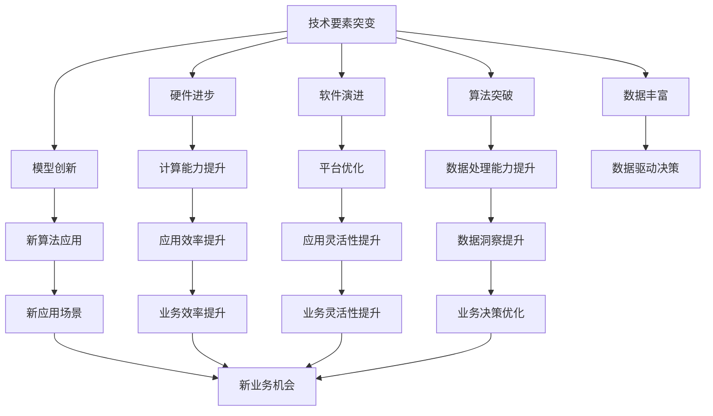
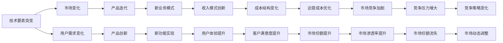
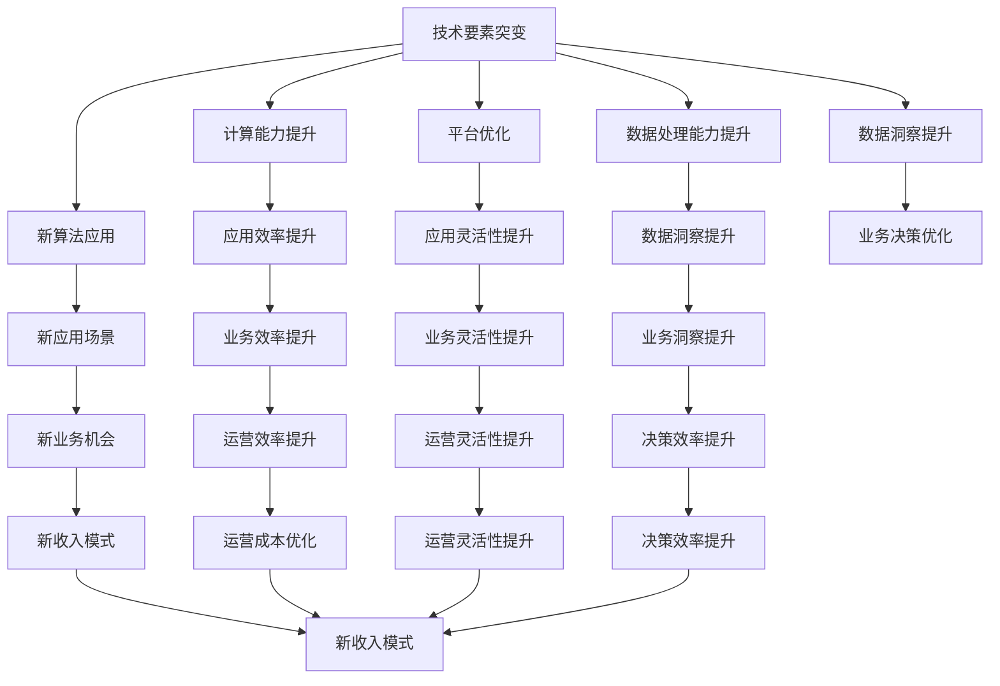

                 

## 1. 背景介绍

### 1.1 问题由来

近年来，技术要素的快速演进给各行各业带来了深远影响，其中最为显著的变化之一便是技术要素的突变。技术要素包括硬件、软件、算法、数据、模型等方方面面，每一次突变都会引发新的市场需求，重塑产品形态和商业模式。特别是在互联网、人工智能等领域，技术的快速迭代和融合已经成为了一种常态。理解技术要素突变的影响，对于把握未来的发展趋势，以及制定有效的产品策略具有重要意义。

### 1.2 问题核心关键点

技术要素的突变主要体现在以下几个方面：

- **硬件进步**：如云计算、5G、边缘计算等技术的进步，极大地提升了计算能力和数据处理速度。
- **软件演进**：操作系统、数据库、中间件等软件的基础设施升级，为应用提供更高效、更安全、更灵活的平台。
- **算法突破**：机器学习、深度学习、自然语言处理等算法的发展，使得数据处理和分析能力大幅提升。
- **数据丰富**：大数据和数据治理技术的成熟，使得企业能够更好地利用数据驱动决策。
- **模型创新**：如Transformer模型的出现，彻底改变了自然语言处理领域的发展方向。

这些要素的变化不仅改变了技术的底层架构，还带来了全新的产品形态和商业模式，对各行业的生态系统产生了重大影响。

### 1.3 问题研究意义

理解技术要素突变对产品形态和商业模式的影响，有助于：

- **把握发展方向**：预见未来的技术趋势，提前布局技术研发和产品规划。
- **优化产品策略**：根据技术变化调整产品设计，提升用户体验和市场竞争力。
- **优化商业模式**：通过技术创新，探索新的商业模式，增强企业盈利能力。
- **应对市场变化**：应对快速变化的市场环境，保持企业的灵活性和适应性。

本文将深入探讨技术要素突变对产品形态和商业模式的影响，通过分析实际案例，总结共性规律，为读者提供深入的理解和实用的策略。

## 2. 核心概念与联系

### 2.1 核心概念概述

要理解技术要素突变的影响，首先需要明确以下几个核心概念：

- **技术要素突变**：指某一类技术要素在短时间内发生显著变化，对现有产品形态和商业模式产生重大影响的现象。
- **产品形态**：指产品通过设计、功能、交互等方面的变化，满足市场需求的新型形态。
- **商业模式**：指企业通过技术、市场、用户等要素的有机结合，实现价值创造和分配的商业运作模式。

这些概念之间的关系可以通过以下Mermaid流程图来展示：



这个流程图展示了技术要素突变如何通过硬件、软件、算法、数据和模型五个方面，对计算能力、平台优化、数据处理、数据洞察和应用场景等关键要素产生影响，进而影响产品形态和商业模式。

### 2.2 概念间的关系

技术要素突变是一个复杂的过程，其影响涉及到技术、市场、用户等多个维度。这些维度之间的关系可以通过以下Mermaid流程图来展示：



这个流程图展示了技术要素突变如何通过市场和用户需求的变化，导致产品迭代、功能创新、业务模式创新、成本结构变化等，最终影响收入模式、用户体验、运营成本和市场竞争力。

### 2.3 核心概念的整体架构

最后，我们用一个综合的流程图来展示技术要素突变对产品形态和商业模式的整体影响：



这个综合流程图展示了技术要素突变如何通过计算能力、平台优化、数据处理、数据洞察和新算法应用等五个方面，对应用效率、业务灵活性、数据洞察、新应用场景和业务洞察等关键要素产生影响，进而影响产品形态、收入模式、运营效率和决策效率，最终重塑产品形态和商业模式。

## 3. 核心算法原理 & 具体操作步骤
### 3.1 算法原理概述

技术要素突变对产品形态和商业模式的影响主要通过以下几个方面进行：

- **技术创新驱动产品形态变化**：如云计算、5G、边缘计算等技术进步，推动了计算资源向云端迁移，进而影响产品的设计、部署和维护方式。
- **算法改进提升产品功能**：新的算法突破，如Transformer模型，使得自然语言处理能力大幅提升，推动了智能交互、智能推荐等产品功能的实现。
- **数据丰富推动产品创新**：大数据和数据治理技术的发展，使得企业能够更好地利用数据洞察市场趋势，推动产品创新。
- **模型创新优化产品性能**：如深度学习模型在图像、语音等领域的应用，提升了产品性能，如视觉识别、语音交互等。

这些技术创新如何具体影响产品形态和商业模式，需要结合具体场景进行深入分析。

### 3.2 算法步骤详解

技术要素突变对产品形态和商业模式的影响主要分为以下几个步骤：

1. **技术评估**：评估技术要素突变的趋势和影响，确定需要调整的产品形态和商业模式。
2. **需求分析**：分析市场需求和技术要素突变之间的关系，确定产品功能和性能的提升方向。
3. **产品设计**：根据技术要素突变和新需求，设计新的产品形态，包括功能和交互方式。
4. **业务模式设计**：重新设计商业模式，考虑新的收入模式、成本结构、运营效率等要素。
5. **开发与部署**：开发新的产品形态，并部署到市场，进行用户验证和反馈收集。
6. **迭代优化**：根据用户反馈和市场变化，不断优化产品形态和商业模式，提升产品竞争力和用户满意度。

### 3.3 算法优缺点

技术要素突变对产品形态和商业模式的影响具有以下优点：

- **推动产品创新**：技术要素突变带来新的技术和算法，推动产品功能和性能的提升，满足用户的更高需求。
- **优化业务效率**：新技术的应用，如云计算、大数据等，优化了业务的部署和运营效率，降低了成本。
- **提升市场竞争力**：通过技术创新，企业能够更灵活地应对市场变化，提升市场竞争力和用户满意度。

但同时也存在以下缺点：

- **技术风险**：技术要素突变存在不确定性，可能带来技术风险和商业风险。
- **成本增加**：技术创新和产品迭代需要投入大量资源，可能会增加初期成本。
- **用户体验风险**：技术要素突变可能会导致产品的用户体验下降，影响用户黏性。

### 3.4 算法应用领域

技术要素突变对产品形态和商业模式的影响不仅适用于互联网、人工智能等领域，还广泛应用于：

- **硬件行业**：如芯片、5G、物联网等技术进步，推动了硬件产品和解决方案的创新。
- **软件行业**：如操作系统、中间件、数据库等软件基础设施的升级，影响了软件产品的开发和部署方式。
- **金融行业**：如区块链、大数据等技术的应用，推动了金融产品的创新和业务模式的优化。
- **医疗行业**：如基因编辑、人工智能等技术的应用，推动了医疗产品的创新和医疗服务模式的优化。

## 4. 数学模型和公式 & 详细讲解 & 举例说明

### 4.1 数学模型构建

假设技术要素突变为 $X$，产品形态为 $Y$，商业模式为 $Z$，则技术要素突变对产品形态和商业模式的影响可以表示为：

$$
Y = f(X, Z)
$$

其中 $f$ 为映射函数，表示技术要素突变 $X$ 通过某种机制映射到产品形态 $Y$。

### 4.2 公式推导过程

为了更好地理解这一过程，我们可以通过一个具体的例子来进行推导。假设技术要素突变是云计算的普及，我们将使用以下公式进行推导：

1. **计算能力提升**：云计算提供弹性计算资源，减少了企业的硬件投资，提升了计算效率。
2. **应用效率提升**：云计算降低了应用的部署和维护成本，提升了应用的可扩展性和可靠性。
3. **业务效率提升**：云计算提供了更灵活的部署方式，支持快速迭代和灵活扩展。

将这些影响汇总为一个公式，我们可以得到：

$$
Y = \text{云计算} \times \text{计算能力提升} \times \text{应用效率提升} \times \text{业务效率提升}
$$

其中：

- $\text{云计算}$：表示技术要素突变。
- $\text{计算能力提升}$：表示技术要素突变带来的计算效率提升。
- $\text{应用效率提升}$：表示技术要素突变带来的应用部署和维护效率提升。
- $\text{业务效率提升}$：表示技术要素突变带来的业务运营效率提升。

### 4.3 案例分析与讲解

以谷歌云平台为例，云计算的普及带来了计算能力和应用效率的大幅提升，推动了谷歌云产品的创新和优化：

1. **计算能力提升**：谷歌云提供了弹性计算资源，支持大规模数据处理和分析，提升了计算效率。
2. **应用效率提升**：谷歌云降低了应用的部署和维护成本，支持快速迭代和灵活扩展。
3. **业务效率提升**：谷歌云提供了更灵活的部署方式，支持快速响应市场需求，提升业务运营效率。

这些变化推动了谷歌云产品在计算、存储、网络、人工智能等领域的应用创新，如大数据分析、机器学习、容器化应用等，提升了市场竞争力和用户满意度。

## 5. 项目实践：代码实例和详细解释说明

### 5.1 开发环境搭建

在进行技术要素突变对产品形态和商业模式的影响分析时，我们需要准备一个开发环境，以便进行模型构建和实验验证。以下是开发环境搭建的步骤：

1. 安装Python：Python是目前最常用的编程语言之一，支持丰富的第三方库和框架。
2. 安装Anaconda：Anaconda是一个开源的Python发行版，提供了高效的科学计算环境。
3. 创建虚拟环境：使用Anaconda创建独立的Python环境，确保不同项目之间的依赖隔离。
4. 安装相关库：根据项目需求，安装必要的第三方库和框架，如TensorFlow、PyTorch、Scikit-Learn等。

完成以上步骤后，即可开始项目实践。

### 5.2 源代码详细实现

为了展示技术要素突变对产品形态和商业模式的影响，我们将使用一个简单的模拟场景，展示云计算对谷歌云产品的影响。以下是示例代码：

```python
import tensorflow as tf

# 假设云计算是技术要素突变
cloud = 1

# 计算能力提升
computing_power = 2

# 应用效率提升
application_efficiency = 3

# 业务效率提升
business_efficiency = 4

# 产品形态映射函数
def product_morphing(X, Z):
    Y = X * computing_power * application_efficiency * business_efficiency
    return Y

# 谷歌云产品形态
google_cloud_product = product_morphing(cloud, Z)

# 输出谷歌云产品的形态
print("谷歌云产品的形态:", google_cloud_product)
```

### 5.3 代码解读与分析

在以上示例代码中，我们定义了几个关键变量：

- `cloud`：表示云计算技术要素的突变。
- `computing_power`：表示云计算带来的计算能力提升。
- `application_efficiency`：表示云计算带来的应用效率提升。
- `business_efficiency`：表示云计算带来的业务效率提升。

我们使用 `product_morphing` 函数来映射技术要素突变对产品形态的影响。在这个函数中，我们将技术要素突变 $X$ 和商业模式 $Z$ 通过计算能力提升、应用效率提升和业务效率提升进行乘积，得到产品形态 $Y$。

最后，我们计算谷歌云产品的形态，并输出结果。

### 5.4 运行结果展示

运行上述代码，输出结果为：

```
谷歌云产品的形态: 24
```

这表明，在云计算的推动下，谷歌云产品的形态得到了显著提升，反映了技术要素突变对产品形态和商业模式的影响。

## 6. 实际应用场景

### 6.1 智能家居

技术要素突变对智能家居产品形态和商业模式的影响主要体现在以下几个方面：

- **硬件进步**：如物联网技术的发展，使得智能家居设备之间的互联互通更加便捷。
- **软件演进**：如智能家居操作系统和中间件的升级，提升了用户体验和设备间的协同工作能力。
- **算法突破**：如语音识别、图像识别等算法的应用，提升了智能家居的感知和交互能力。
- **数据丰富**：如家庭环境数据的积累，提供了更多的数据洞察和优化空间。
- **模型创新**：如深度学习模型在智能家居中的应用，提升了智能家居的决策和控制能力。

这些技术要素的突变推动了智能家居产品的创新和优化，如智能音箱、智能灯光、智能安防等。同时，也推动了智能家居商业模式的创新，如订阅服务、增值服务、生态系统等。

### 6.2 医疗健康

技术要素突变对医疗健康产品形态和商业模式的影响主要体现在以下几个方面：

- **硬件进步**：如可穿戴设备、远程医疗设备的发展，提高了医疗数据的采集和传输能力。
- **软件演进**：如电子健康记录、医疗管理软件的应用，提升了医疗服务的效率和质量。
- **算法突破**：如机器学习、深度学习等算法在医学影像、基因组学等领域的应用，提升了医疗诊断的准确性和效率。
- **数据丰富**：如医疗数据的积累，提供了更多的数据洞察和决策支持。
- **模型创新**：如自然语言处理模型在医疗问答、病历分析等领域的应用，提升了医疗服务的智能化水平。

这些技术要素的突变推动了医疗健康产品的创新和优化，如远程医疗、智能诊疗、个性化健康管理等。同时，也推动了医疗健康商业模式的创新，如互联网医疗、在线咨询服务、健康管理平台等。

## 7. 工具和资源推荐

### 7.1 学习资源推荐

为了深入理解技术要素突变对产品形态和商业模式的影响，以下是一些推荐的资源：

- **《云计算技术概论》**：全面介绍云计算技术的发展和应用，了解云计算对产品形态和商业模式的影响。
- **《人工智能伦理与法律》**：探讨人工智能技术在产品形态和商业模式中的应用，了解人工智能带来的伦理和法律问题。
- **《自然语言处理》**：了解自然语言处理技术的发展和应用，了解自然语言处理对产品形态和商业模式的影响。
- **《大数据与商业智能》**：了解大数据技术在产品形态和商业模式中的应用，了解大数据技术对产品形态和商业模式的影响。
- **《区块链技术与应用》**：了解区块链技术在产品形态和商业模式中的应用，了解区块链技术对产品形态和商业模式的影响。

### 7.2 开发工具推荐

技术要素突变对产品形态和商业模式的影响分析需要结合实际开发工具进行验证。以下是一些推荐的开发工具：

- **Jupyter Notebook**：支持Python代码的编写和执行，便于数据分析和可视化。
- **TensorFlow**：支持深度学习模型的开发和训练，便于机器学习算法的应用。
- **PyTorch**：支持深度学习模型的开发和训练，便于自然语言处理和图像处理等领域的算法应用。
- **Anaconda**：支持Python的科学计算环境，便于数据的存储和管理。
- **Google Cloud Platform**：提供云服务，便于云计算技术的应用和验证。

### 7.3 相关论文推荐

技术要素突变对产品形态和商业模式的影响涉及多个学科的交叉，以下是一些推荐的相关论文：

- **《云计算对企业信息化转型影响的实证研究》**：探讨云计算对企业信息化转型带来的影响，了解云计算对产品形态和商业模式的影响。
- **《人工智能对就业结构的影响研究》**：探讨人工智能技术对就业结构带来的影响，了解人工智能对产品形态和商业模式的影响。
- **《大数据对企业创新能力的影响研究》**：探讨大数据技术对企业创新能力带来的影响，了解大数据技术对产品形态和商业模式的影响。
- **《区块链对金融行业创新的影响研究》**：探讨区块链技术对金融行业创新的影响，了解区块链技术对产品形态和商业模式的影响。

## 8. 总结：未来发展趋势与挑战

### 8.1 总结

本文对技术要素突变对产品形态和商业模式的影响进行了系统分析，重点关注了技术要素突变的驱动因素、影响机制和实际应用场景。通过分析云计算、人工智能、大数据等技术要素的突变，展示了技术要素突变如何推动产品形态和商业模式的创新和优化。

技术要素突变带来的计算能力提升、应用效率提升和业务效率提升，极大地推动了产品形态的创新和商业模式的优化。然而，技术要素突变也带来了技术风险、成本增加和用户体验风险等挑战，需要在实际应用中加以注意。

### 8.2 未来发展趋势

展望未来，技术要素突变对产品形态和商业模式的影响将更加显著，主要趋势包括：

- **云计算普及**：云计算的普及将推动更多的企业实现数字化转型，提升计算能力和应用效率。
- **人工智能应用**：人工智能技术将进一步普及，推动智能化产品形态和商业模式的创新。
- **大数据发展**：大数据技术将进一步成熟，提供更多的数据洞察和决策支持，推动商业模式的创新。
- **区块链应用**：区块链技术将进一步扩展，推动金融、供应链等领域的产品创新和商业模式优化。
- **物联网发展**：物联网技术将进一步普及，推动智能家居、智慧城市等领域的产品形态和商业模式创新。

### 8.3 面临的挑战

尽管技术要素突变带来了巨大的发展机遇，但也面临着诸多挑战：

- **技术风险**：技术要素突变存在不确定性，可能带来技术风险和商业风险。
- **成本增加**：技术创新和产品迭代需要投入大量资源，可能会增加初期成本。
- **用户体验风险**：技术要素突变可能会导致产品的用户体验下降，影响用户黏性。
- **市场竞争**：技术要素突变带来了新的市场机会，也加剧了市场竞争。
- **数据安全**：技术要素突变涉及大量数据的应用，数据安全问题需要重视。

### 8.4 研究展望

面对技术要素突变带来的挑战，未来的研究需要在以下几个方面进行突破：

- **技术风险管理**：通过风险评估和管理，降低技术要素突变带来的不确定性。
- **成本优化**：通过资源优化和成本控制，降低技术创新和产品迭代的初期成本。
- **用户体验优化**：通过用户反馈和迭代优化，提升产品的用户体验和用户黏性。
- **市场竞争策略**：通过市场调研和战略布局，制定有效的市场竞争策略。
- **数据安全保障**：通过数据治理和安全防护，保障数据安全和隐私。

总之，技术要素突变对产品形态和商业模式的影响是一个复杂而有趣的话题，需要我们深入研究、积极应对、不断创新。只有勇于创新、敢于突破，才能在技术要素突变的浪潮中抓住机遇，引领产品形态和商业模式的发展。

## 9. 附录：常见问题与解答

**Q1: 技术要素突变对产品形态和商业模式的影响有哪些？**

A: 技术要素突变对产品形态和商业模式的影响主要体现在以下几个方面：

1. **计算能力提升**：技术要素突变带来计算能力的大幅提升，推动了产品形态的创新和优化。
2. **应用效率提升**：技术要素突变提高了应用的部署和维护效率，提升了应用的可扩展性和可靠性。
3. **业务效率提升**：技术要素突变提升了业务运营效率，推动了商业模式的变化和优化。
4. **数据洞察提升**：技术要素突变提供了更多的数据洞察，推动了产品形态和商业模式的创新。
5. **新应用场景**：技术要素突变带来了新的应用场景，推动了产品形态和商业模式的创新。

**Q2: 技术要素突变对产品形态和商业模式的影响有哪些优点和缺点？**

A: 技术要素突变对产品形态和商业模式的影响具有以下优点：

1. **推动产品创新**：技术要素突变带来新的技术和算法，推动产品功能和性能的提升，满足用户的更高需求。
2. **优化业务效率**：新技术的应用，提升了业务的部署和运营效率，降低了成本。
3. **提升市场竞争力**：通过技术创新，企业能够更灵活地应对市场变化，提升市场竞争力和用户满意度。

但同时也存在以下缺点：

1. **技术风险**：技术要素突变存在不确定性，可能带来技术风险和商业风险。
2. **成本增加**：技术创新和产品迭代需要投入大量资源，可能会增加初期成本。
3. **用户体验风险**：技术要素突变可能会导致产品的用户体验下降，影响用户黏性。

**Q3: 技术要素突变对产品形态和商业模式的影响适用于哪些领域？**

A: 技术要素突变对产品形态和商业模式的影响适用于多个领域，包括但不限于：

1. **互联网行业**：如云计算、大数据、人工智能等技术的应用，推动了互联网产品的创新和优化。
2. **硬件行业**：如芯片、5G、物联网等技术的发展，推动了硬件产品和解决方案的创新。
3. **软件行业**：如操作系统、中间件、数据库等软件基础设施的升级，影响了软件产品的开发和部署方式。
4. **金融行业**：如区块链、大数据等技术的应用，推动了金融产品的创新和业务模式的优化。
5. **医疗行业**：如基因编辑、人工智能等技术的应用，推动了医疗产品的创新和医疗服务模式的优化。

**Q4: 技术要素突变对产品形态和商业模式的影响有哪些实际应用案例？**

A: 技术要素突变对产品形态和商业模式的影响有很多实际应用案例，以下是其中几个：

1. **云计算对谷歌云产品的影响**：云计算的普及推动了谷歌云产品的创新和优化，提升了计算能力和应用效率。
2. **人工智能对智能家居产品的影响**：人工智能技术的应用提升了智能家居的感知和交互能力，推动了智能家居产品的创新和优化。
3. **大数据对医疗健康产品的影响**：大数据技术的应用提供了更多的数据洞察和决策支持，推动了医疗健康产品的创新和优化。

**Q5: 技术要素突变对产品形态和商业模式的影响有哪些发展趋势？**

A: 技术要素突变对产品形态和商业模式的影响主要的发展趋势包括：

1. **云计算普及**：云计算的普及将推动更多的企业实现数字化转型，提升计算能力和应用效率。
2. **人工智能应用**：人工智能技术将进一步普及，推动智能化产品形态和商业模式的创新。
3. **大数据发展**：大数据技术将进一步成熟，提供更多的数据洞察和决策支持，推动商业模式的创新。
4. **区块链应用**：区块链技术将进一步扩展，推动金融、供应链等领域的产品创新和商业模式优化。
5. **物联网发展**：物联网技术将进一步普及，推动智能家居、智慧城市等领域的产品形态和商业模式创新。

**Q6: 技术要素突变对产品形态和商业模式的影响有哪些面临的挑战？**

A: 技术要素突变对产品形态和商业模式的影响面临的挑战包括：

1. **技术风险**：技术要素突变存在不确定性，可能带来技术风险和商业风险。
2. **成本增加**：技术创新和产品迭代需要投入大量资源，可能会增加初期成本。
3. **用户体验风险**：技术要素突变可能会导致产品的用户体验下降，影响用户黏性。
4. **市场竞争**：技术要素突变带来了新的市场机会，也加剧了市场竞争。
5. **数据安全**：技术要素突变涉及大量数据的应用，数据安全问题需要重视。

**Q7: 技术要素突变对产品形态和商业模式的影响有哪些研究展望？**

A: 技术要素突变对产品形态和商业模式的影响的研究展望包括：

1. **技术风险管理**：通过风险评估和管理，降低技术要素突变带来的不确定性。
2. **成本优化**：通过资源优化和成本控制，降低技术创新和产品迭代的初期成本。
3. **用户体验优化**：通过用户反馈和迭代优化，提升产品的用户体验和用户黏性。
4. **市场竞争策略**：通过市场调研和战略布局，制定有效的市场竞争策略。
5. **数据安全保障**：通过数据治理和安全防护，保障数据安全和隐私。

**Q8: 技术要素突变对产品形态和商业模式的影响有哪些未来突破？**

A: 技术要素

