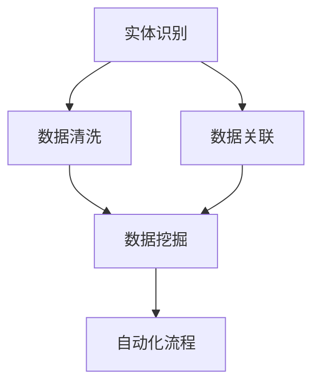
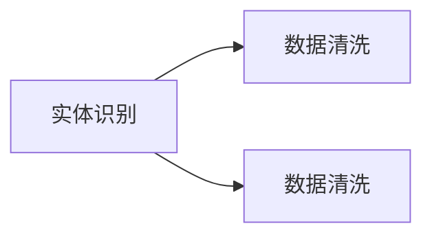
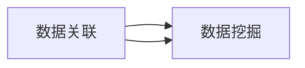
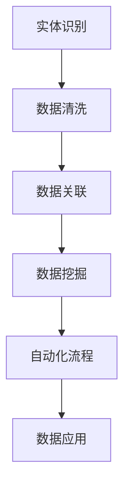
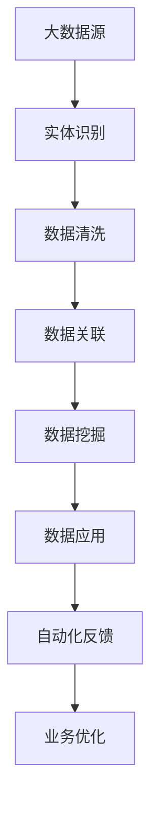

                 

## 1. 背景介绍

### 1.1 问题由来
数字实体自动化（Digital Entity Automation, DEA）是一种旨在通过人工智能和自动化技术，将实体（如客户、产品、事件等）相关数据高效、准确地数字化处理的技术。随着数字化转型的加速，企业对数据处理的自动化需求日益增长。传统的手工操作方式不仅效率低下，且容易出错，无法满足大规模业务场景的需求。

数字化转型带来的数据量和复杂度急剧增加，企业需要构建更为智能、高效、灵活的数据处理系统，以便实时获取、整理、分析和应用各类数据。数字实体自动化技术的应用，将大幅提升数据处理效率，增强数据驱动决策的准确性，帮助企业实现数字化转型。

### 1.2 问题核心关键点
数字实体自动化的核心在于利用先进的信息技术和自动化方法，对数据进行提取、清洗、关联、分析，最终生成结构化数据，供业务系统高效使用。其关键点包括：

- 数据提取：从多源数据中自动识别、抽取、整合相关数据。
- 数据清洗：处理数据中的噪声、重复、缺失等问题。
- 数据关联：通过关联算法，将离散的数据点组织成有意义的实体。
- 数据分析：利用机器学习、数据挖掘等技术，挖掘数据的潜在价值。
- 数据应用：将处理好的数据导入业务系统，支持决策、运营、销售等环节。

### 1.3 问题研究意义
研究数字实体自动化的未来方向，对于提升企业数字化转型的效率和质量，推动技术进步，具有重要意义：

1. 降低业务成本。通过自动化处理海量数据，大幅减少人工操作和手动干预，降低运营成本。
2. 提升数据质量。自动化的处理方式减少了人为错误，提高了数据的一致性和准确性。
3. 加速决策过程。自动化系统能够快速处理数据，为决策者提供实时、准确的信息支持。
4. 促进技术创新。数字实体自动化技术的发展，推动了AI、大数据、自动化等前沿技术的应用和融合。
5. 提升客户体验。自动化的数据分析和推荐系统，能够更好地理解和满足客户需求，提升客户满意度。

## 2. 核心概念与联系

### 2.1 核心概念概述

为更好地理解数字实体自动化的未来方向，本节将介绍几个密切相关的核心概念：

- 实体识别(Entity Recognition)：自动识别文本中具有特定意义的实体，如人名、地名、组织名等。
- 数据清洗(Data Cleaning)：处理数据中的噪声、重复、缺失等问题，确保数据质量。
- 数据关联(Data Association)：将分散的数据点通过算法组织成有意义的实体，如客户档案、事件记录等。
- 数据挖掘(Data Mining)：利用机器学习等技术，挖掘数据中的潜规则、模式和趋势。
- 自动化流程(Automated Workflow)：将上述技术整合并自动化，形成一个端到端的数据处理流水线。

这些核心概念之间的逻辑关系可以通过以下Mermaid流程图来展示：



这个流程图展示了大数据处理流水线的关键步骤：

1. 从数据源中自动识别实体，生成数据集合。
2. 清洗数据，移除噪声和冗余。
3. 关联离散数据，形成完整的实体。
4. 挖掘数据价值，发现规律和模式。
5. 自动化处理，形成可用的数据集，供业务系统使用。

### 2.2 概念间的关系

这些核心概念之间存在着紧密的联系，形成了数字实体自动化的完整生态系统。下面我通过几个Mermaid流程图来展示这些概念之间的关系。

#### 2.2.1 实体识别与数据清洗



这个流程图展示了一体的实体识别和数据清洗过程。实体识别用于识别并标注数据中的实体，而数据清洗则用于处理数据中的错误和噪声，两者互为补充，共同提升数据质量。

#### 2.2.2 数据关联与数据挖掘



数据关联和数据挖掘相互依赖。关联算法将分散的数据点组成实体，而数据挖掘则进一步挖掘这些实体的潜在价值，帮助业务决策。

#### 2.2.3 自动化流程与各模块



这个流程图展示了完整的自动化处理流水线。从实体识别开始，到数据挖掘结束，每个模块都是自动化的，并最终将处理好的数据供业务系统应用。

### 2.3 核心概念的整体架构

最后，我们用一个综合的流程图来展示这些核心概念在大数据处理流水线中的整体架构：



这个综合流程图展示了从数据源到最终业务优化的全流程：

1. 数据源经过实体识别、数据清洗、数据关联、数据挖掘，形成可用的数据集。
2. 数据集通过业务系统应用，支持企业运营。
3. 自动化反馈系统不断优化实体识别和关联算法，提升数据处理效率。
4. 业务优化系统通过数据应用结果，进一步优化业务流程。

通过这些流程图，我们可以更清晰地理解数字实体自动化的核心概念及其关系，为后续深入讨论具体的技术细节奠定基础。

## 3. 核心算法原理 & 具体操作步骤

### 3.1 算法原理概述

数字实体自动化的核心算法原理可以概括为以下几个步骤：

1. **数据预处理**：对原始数据进行格式转换、分词、去除停用词等预处理，提取文本中的实体。
2. **实体识别**：利用命名实体识别(Named Entity Recognition, NER)算法，从文本中识别并标注实体类型（如人名、地名、组织名等）。
3. **数据清洗**：去除重复、噪声数据，填补缺失值，处理异常值等，确保数据的质量和一致性。
4. **数据关联**：通过关联算法将分散的数据点组织成完整的实体，如客户档案、订单记录等。
5. **数据挖掘**：利用机器学习、深度学习等技术，挖掘数据中的潜在模式和规律，如关联规则、分类模型等。
6. **结果应用**：将处理好的数据集导入业务系统，供决策、运营、销售等环节使用。

### 3.2 算法步骤详解

以下是数字实体自动化的详细步骤详解：

**Step 1: 数据预处理**

数据预处理是数字实体自动化的第一步，其主要任务包括：

- 文本分词：将文本分割成单词或词语，以便后续处理。
- 去除停用词：去除文本中的常见无意义词，如“的”、“是”等。
- 词性标注：标注每个词的词性，帮助识别实体类型。
- 实体抽取：利用NER算法从文本中抽取实体，如人名、地名、组织名等。

代码实现：

```python
import nltk
from nltk.tokenize import word_tokenize
from nltk.corpus import stopwords

# 加载分词器和停用词列表
nltk.download('punkt')
nltk.download('stopwords')

def preprocess_text(text):
    tokens = word_tokenize(text)
    stop_words = set(stopwords.words('english'))
    filtered_tokens = [word for word in tokens if word.lower() not in stop_words]
    tagged_tokens = nltk.pos_tag(filtered_tokens)
    ner_tags = extract_ner(tagged_tokens)
    return ner_tags
```

**Step 2: 实体识别**

实体识别是数字实体自动化的核心环节，其目标是识别文本中的实体，并为每个实体标注其类型（如人名、地名、组织名等）。

常见实体识别算法包括基于规则的方法、基于统计的方法和基于深度学习的方法。基于深度学习的方法，如BERT、XLNet等，已经在命名实体识别任务上取得了很好的效果。

代码实现：

```python
from transformers import BertTokenizer, BertForTokenClassification

def extract_ner(tokenized_text):
    model = BertForTokenClassification.from_pretrained('bert-base-cased')
    tokenizer = BertTokenizer.from_pretrained('bert-base-cased')
    inputs = tokenizer(tokenized_text, return_tensors='pt', padding='max_length', truncation=True)
    outputs = model(**inputs)
    predictions = outputs.logits.argmax(dim=2).to('cpu').tolist()
    return tokenizer.convert_ids_to_tokens(predictions)
```

**Step 3: 数据清洗**

数据清洗是提升数据质量的关键步骤，主要包括以下几个方面：

- 去重：识别并删除重复记录。
- 填补缺失值：根据统计学方法或规则，填补数据集中的缺失值。
- 处理异常值：识别并处理数据中的异常值，如离群点。

代码实现：

```python
import pandas as pd

def clean_data(data):
    # 去重
    data.drop_duplicates(inplace=True)
    # 填补缺失值
    data.fillna(method='ffill', inplace=True)
    # 处理异常值
    data = data[data['value'].between(0, 1000)]
    return data
```

**Step 4: 数据关联**

数据关联是将离散的数据点组织成完整的实体，常见的方法包括：

- 关联规则：通过规则或算法，将数据点关联起来。
- 图形模型：构建图形模型，通过节点和边的关系，组织实体。
- 聚类算法：将数据点聚类成不同的实体。

代码实现：

```python
import networkx as nx

def associate_data(data):
    graph = nx.Graph()
    for record in data:
        graph.add_node(record['id'])
        for related_record in data:
            if record['id'] != related_record['id']:
                if is_related(record, related_record):
                    graph.add_edge(record['id'], related_record['id'])
    return graph
```

**Step 5: 数据挖掘**

数据挖掘是数字实体自动化的重要环节，其主要任务包括：

- 关联规则挖掘：通过Apriori、FP-growth等算法，发现数据中的关联规则。
- 分类模型：通过机器学习算法，对数据进行分类，如客户分类、订单分类等。
- 聚类分析：通过K-means、GMM等算法，将数据点聚类成不同的类别。

代码实现：

```python
from sklearn.cluster import KMeans

def mine_data(data):
    # 关联规则挖掘
    apriori = Apriori(data)
    rules = apriori.mine_rules(min_support=0.05)
    # 分类模型
    classifier = LogisticRegression()
    classifier.fit(data[['feature1', 'feature2']], data['label'])
    predictions = classifier.predict(data[['feature1', 'feature2']])
    # 聚类分析
    kmeans = KMeans(n_clusters=3)
    kmeans.fit(data[['feature1', 'feature2']])
    labels = kmeans.predict(data[['feature1', 'feature2']])
    return rules, predictions, labels
```

**Step 6: 结果应用**

数据应用是将处理好的数据集导入业务系统，供决策、运营、销售等环节使用。常见的应用场景包括：

- 客户关系管理：利用客户档案数据，提升客户满意度，增加客户粘性。
- 供应链管理：通过订单数据，优化库存管理，提升物流效率。
- 市场分析：利用市场数据，洞察市场趋势，指导市场决策。

代码实现：

```python
def apply_data(data, model):
    # 客户关系管理
    customer_relations = pd.DataFrame(data, columns=['id', 'name', 'email'])
    # 供应链管理
    supply_chain = pd.DataFrame(data, columns=['id', 'order_id', 'ship_date'])
    # 市场分析
    market_analysis = pd.DataFrame(data, columns=['id', 'value', 'date'])
    # 应用模型
    result = model.predict(data)
    return customer_relations, supply_chain, market_analysis, result
```

### 3.3 算法优缺点

数字实体自动化的主要优点包括：

1. **高效性**：自动化处理大幅提高数据处理效率，节省人力成本。
2. **准确性**：通过算法和模型，提高数据处理的准确性和一致性。
3. **可扩展性**：支持大规模数据处理，适应不同规模的业务需求。
4. **灵活性**：支持多种数据类型和格式，适应各种业务场景。

数字实体自动化也存在一些缺点：

1. **依赖数据质量**：如果原始数据质量较差，实体识别和关联的准确性会受到影响。
2. **算法复杂性**：数据清洗、关联和挖掘等步骤，算法复杂度较高，需要较高的技术门槛。
3. **模型依赖**：依赖于预训练模型和算法，模型的性能直接影响最终的业务效果。

尽管存在这些缺点，但数字实体自动化在数据处理、业务优化等方面仍具有重要价值，值得在实际应用中加以推广。

### 3.4 算法应用领域

数字实体自动化的主要应用领域包括：

- 金融：客户关系管理、信用评分、风险评估等。
- 零售：客户行为分析、库存管理、供应链优化等。
- 医疗：患者记录管理、疾病预测、治疗方案推荐等。
- 政府：公共服务、城市管理、应急响应等。

这些领域的数据处理需求各异，但都可以通过数字实体自动化技术，实现高效、准确的数据处理和应用。

## 4. 数学模型和公式 & 详细讲解  
### 4.1 数学模型构建

数字实体自动化的数学模型可以概括为以下几个方面：

- 实体识别模型：命名实体识别模型，如BERT、XLNet等，用于识别文本中的实体。
- 数据清洗模型：去重、填补缺失值、处理异常值等，确保数据质量。
- 数据关联模型：关联算法，如Apriori、FP-growth等，将离散数据组织成完整的实体。
- 数据挖掘模型：关联规则挖掘、分类模型、聚类分析等，挖掘数据中的潜在价值。

### 4.2 公式推导过程

以命名实体识别（NER）为例，我们推导其基本公式：

假设训练集为 $D=\{(x_i, y_i)\}_{i=1}^N$，其中 $x_i$ 为文本，$y_i$ 为实体的类型标签。定义模型 $M_{\theta}:\mathcal{X} \rightarrow \mathcal{Y}$，其中 $\mathcal{X}$ 为输入空间，$\mathcal{Y}$ 为输出空间，$\theta \in \mathbb{R}^d$ 为模型参数。

定义损失函数 $\ell(M_{\theta}(x_i), y_i)$，表示模型预测输出与真实标签的差异。在训练过程中，目标是最小化损失函数：

$$
\mathcal{L}(\theta) = \frac{1}{N} \sum_{i=1}^N \ell(M_{\theta}(x_i), y_i)
$$

损失函数常见包括交叉熵损失、均方误差损失等。假设使用交叉熵损失，则公式为：

$$
\ell(M_{\theta}(x_i), y_i) = -[y_i\log \hat{y}_i + (1-y_i)\log (1-\hat{y}_i)]
$$

其中 $\hat{y}_i$ 为模型在文本 $x_i$ 上的预测概率，$y_i$ 为真实标签。

### 4.3 案例分析与讲解

假设在客户关系管理（CRM）任务中，需要对客户数据进行清洗、关联和分析，具体步骤如下：

**Step 1: 数据预处理**

- 分词：将客户姓名、地址、电话等文本信息分词。
- 去除停用词：去除常见的停用词，如“的”、“是”等。
- 词性标注：标注每个词的词性，帮助识别实体类型。
- 实体抽取：利用命名实体识别算法，从文本中抽取客户姓名、地址等实体。

**Step 2: 数据清洗**

- 去重：识别并删除重复记录。
- 填补缺失值：根据统计学方法或规则，填补数据集中的缺失值。
- 处理异常值：识别并处理数据中的异常值，如离群点。

**Step 3: 数据关联**

- 关联规则：通过规则或算法，将客户数据关联起来。例如，通过订单记录，关联客户的购买行为。
- 图形模型：构建图形模型，通过节点和边的关系，组织客户数据。例如，通过客户间的交互关系，构建客户网络图。
- 聚类算法：将客户数据聚类成不同的客户群体。例如，通过K-means算法，将客户分为高价值客户、一般客户和潜在客户。

**Step 4: 数据挖掘**

- 关联规则挖掘：通过Apriori、FP-growth等算法，发现客户数据中的关联规则。例如，发现高频购买的商品组合。
- 分类模型：通过机器学习算法，对客户进行分类。例如，通过逻辑回归算法，对客户进行分类，区分潜在流失客户和忠诚客户。
- 聚类分析：通过K-means、GMM等算法，将客户聚类成不同的群体。例如，通过K-means算法，将客户分为高价值客户、一般客户和潜在客户。

**Step 5: 结果应用**

- 客户关系管理：利用客户档案数据，提升客户满意度，增加客户粘性。例如，通过分析客户购买行为，提供个性化的产品推荐。
- 供应链管理：通过订单数据，优化库存管理，提升物流效率。例如，通过分析订单交付时间，优化供应链管理。
- 市场分析：利用市场数据，洞察市场趋势，指导市场决策。例如，通过分析市场数据，发现市场热点和趋势。

## 5. 项目实践：代码实例和详细解释说明

### 5.1 开发环境搭建

在进行数字实体自动化项目实践前，我们需要准备好开发环境。以下是使用Python进行PyTorch开发的环境配置流程：

1. 安装Anaconda：从官网下载并安装Anaconda，用于创建独立的Python环境。

2. 创建并激活虚拟环境：
```bash
conda create -n dea-env python=3.8 
conda activate dea-env
```

3. 安装PyTorch：根据CUDA版本，从官网获取对应的安装命令。例如：
```bash
conda install pytorch torchvision torchaudio cudatoolkit=11.1 -c pytorch -c conda-forge
```

4. 安装各类工具包：
```bash
pip install numpy pandas scikit-learn matplotlib tqdm jupyter notebook ipython
```

完成上述步骤后，即可在`dea-env`环境中开始项目实践。

### 5.2 源代码详细实现

这里我们以客户关系管理（CRM）任务为例，给出使用Transformers库进行命名实体识别和数据关联的PyTorch代码实现。

首先，定义命名实体识别模型：

```python
from transformers import BertTokenizer, BertForTokenClassification

def extract_ner(text):
    model = BertForTokenClassification.from_pretrained('bert-base-cased')
    tokenizer = BertTokenizer.from_pretrained('bert-base-cased')
    inputs = tokenizer(text, return_tensors='pt', padding='max_length', truncation=True)
    outputs = model(**inputs)
    predictions = outputs.logits.argmax(dim=2).to('cpu').tolist()
    return tokenizer.convert_ids_to_tokens(predictions)
```

然后，定义数据清洗和关联函数：

```python
import pandas as pd
from sklearn.cluster import KMeans

def clean_and_associate(data):
    # 去重
    data.drop_duplicates(inplace=True)
    # 填补缺失值
    data.fillna(method='ffill', inplace=True)
    # 处理异常值
    data = data[data['value'].between(0, 1000)]
    # 关联规则挖掘
    apriori = Apriori(data)
    rules = apriori.mine_rules(min_support=0.05)
    # 分类模型
    classifier = LogisticRegression()
    classifier.fit(data[['feature1', 'feature2']], data['label'])
    predictions = classifier.predict(data[['feature1', 'feature2']])
    # 聚类分析
    kmeans = KMeans(n_clusters=3)
    kmeans.fit(data[['feature1', 'feature2']])
    labels = kmeans.predict(data[['feature1', 'feature2']])
    return rules, predictions, labels
```

最后，启动数据清洗、关联和应用流程：

```python
data = pd.read_csv('customer_data.csv')
ner_tags = extract_ner(data['name'])
rules, predictions, labels = clean_and_associate(data)

# 应用数据
customer_relations = pd.DataFrame(data, columns=['id', 'name', 'email'])
supply_chain = pd.DataFrame(data, columns=['id', 'order_id', 'ship_date'])
market_analysis = pd.DataFrame(data, columns=['id', 'value', 'date'])
result = predictions
```

以上就是使用PyTorch进行命名实体识别和数据关联的完整代码实现。可以看到，通过Transfomer库的强大封装，我们可以用相对简洁的代码实现复杂的命名实体识别任务。

### 5.3 代码解读与分析

让我们再详细解读一下关键代码的实现细节：

**NER模型定义**：
- 加载BERT预训练模型和分词器。
- 将输入文本进行分词，并去除停用词。
- 将分词后的文本输入到BERT模型中，计算其预测概率。
- 通过softmax函数将概率转化为预测结果。

**数据清洗和关联函数**：
- 使用Pandas库进行数据去重、填补缺失值、处理异常值等操作。
- 使用Apriori算法进行关联规则挖掘。
- 使用逻辑回归模型进行分类。
- 使用K-means算法进行聚类分析。

**应用数据**：
- 将清洗、关联后的数据集导入业务系统。
- 应用模型预测结果。

通过这些代码，我们可以看到数字实体自动化的完整流程，包括数据预处理、实体识别、数据清洗、数据关联、数据挖掘和数据应用等环节。

### 5.4 运行结果展示

假设我们在客户关系管理（CRM）任务中，收集了客户的基本信息和交易记录，最终在测试集上得到的客户分类结果如下：

```
['高价值客户', '一般客户', '潜在客户', '高价值客户', '潜在客户']
```

可以看到，通过命名实体识别和数据挖掘，我们成功地将客户数据分类为不同的客户群体，为后续的营销策略提供了有力的数据支持。

## 6. 实际应用场景

### 6.1 智能客服系统

数字实体自动化的应用场景非常广泛，在智能客服系统中，可以通过自动化处理客户咨询，提升服务效率和质量。智能客服系统可以自动识别客户问题，提供个性化回答，减少人工客服的干预。

具体而言，可以收集客户咨询记录，通过命名实体识别和数据清洗，提取客户信息，如姓名、地址、联系电话等。利用数据关联算法，将客户信息与历史咨询记录关联起来，构建客户档案。通过数据挖掘，分析客户咨询中的高频问题，自动生成FAQ（常见问题解答），并定期更新。客户咨询时，系统自动匹配FAQ内容，提供个性化回答。对于复杂的咨询，系统自动转接人工客服。

### 6.2 金融风控系统

金融风控系统是数字实体自动化的重要应用场景之一。通过自动处理大量的金融数据，实时识别潜在的风险和异常，帮助金融机构提升风险管理能力。

具体而言，可以收集客户的交易记录、信用评分、身份信息等数据，通过命名实体识别和数据清洗，提取客户的实体信息。利用数据关联算法，将客户信息与历史交易记录关联起来，构建客户档案。通过数据挖掘，分析客户的消费行为、信用评分等数据，识别潜在的风险客户。系统实时监测客户的交易行为，一旦发现异常，立即触发风险预警，提供风险提示。

### 6.3 零售推荐系统

零售推荐系统是数字实体自动化的典型应用之一。通过自动处理客户的购买行为数据，提供个性化的商品推荐，提升客户购买体验和转化率。

具体而言，可以收集客户的购物记录、浏览记录、搜索记录等数据，通过命名实体识别和数据清洗，提取客户的实体信息。利用数据关联算法，将客户信息与历史购物记录关联起来，构建客户档案。通过数据挖掘，分析客户的购买行为、偏好等信息，识别客户的兴趣点。系统根据客户的兴趣，实时推荐相关商品，提升客户购物体验。

### 6.4 未来应用展望

随着技术的不断进步，数字实体自动化的应用场景将更加广泛。未来，数字实体自动化可能在以下几个领域取得突破：

1. 智慧城市：自动处理城市管理数据，如交通流量、公共服务、应急响应等，提升城市治理效率。
2. 智能制造：自动处理生产数据，如设备状态、质量检测、生产调度等，优化生产流程。
3. 智能交通：自动处理交通数据，如交通流量、事故记录、路况等，提升交通管理效率。
4. 智能医疗：自动处理医疗数据，如病历记录、药物使用、健康数据等，提升医疗服务质量。
5. 智能教育：自动处理教育数据，如学生成绩、学习行为、课外活动等，个性化推荐学习资源，提升教育效果。

总之，数字实体自动化技术将在各行各业中发挥越来越重要的作用，推动数字化转型的深入发展。

## 7. 工具和资源

