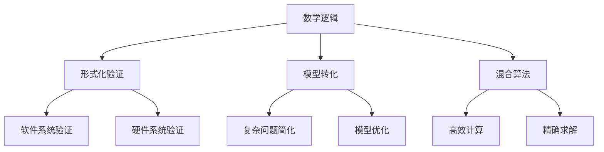

                 

# 数学逻辑与代数的交叉研究

> 关键词：数学逻辑，代数，交叉研究，模型构建，公式推导，案例分析，实践应用，发展趋势，挑战

## 1. 背景介绍

### 1.1 问题由来

数学和逻辑是现代科学的两大基石，它们相互渗透、相互促进，推动了人类对自然界和社会的深入理解。在计算机科学领域，数学逻辑与代数的交叉研究已经成为推动技术创新和应用发展的重要动力。

在人工智能、数据科学、密码学、图像识别等诸多领域，数学逻辑与代数模型的结合，提供了更加高效、可靠的理论基础和技术手段。数学逻辑与代数的交叉研究，帮助研究人员揭示出问题的本质，发现更优的算法，解决实际问题。

本文旨在系统地探讨数学逻辑与代数的交叉研究，从理论基础、应用实践和未来发展三个层面，全面剖析其在现代技术中的重要性和前景。

### 1.2 问题核心关键点

数学逻辑与代数交叉研究的核心问题在于如何将数学逻辑的形式化表示与代数模型的实际应用结合起来，在保证精确性的前提下，提高计算效率和算法复杂度。

- 形式化逻辑表示：如命题逻辑、谓词逻辑、一阶逻辑等，是数学逻辑的基础，用于刻画自然语言、程序逻辑等。
- 代数模型构建：如群论、环论、域论等，是代数的核心，用于描述和计算数学问题的结构。
- 交叉研究范式：如形式化验证、模型转化、混合算法等，是数学逻辑与代数结合的关键，用于求解实际问题。

## 2. 核心概念与联系

### 2.1 核心概念概述

- **数学逻辑（Mathematical Logic）**：数学逻辑是研究形式化方法及其应用的科学。主要内容包括命题逻辑、谓词逻辑、一阶逻辑、模型论、递归理论等。
- **代数（Algebra）**：代数是数学的一个分支，研究包括群论、环论、域论、线性代数、泛代数等在内的多种代数结构。
- **形式化验证（Formal Verification）**：形式化验证是一种使用形式化方法验证软件、硬件系统的正确性、安全性、可靠性的技术。
- **模型转化（Model Transformation）**：模型转化是将一个模型转换为另一个模型，以实现复杂问题的简化、优化和求解的技术。
- **混合算法（Hybrid Algorithm）**：混合算法是将不同类型的方法和工具结合使用，以解决特定问题的技术。

这些概念之间存在着紧密的联系，通过合理的结合和应用，可以实现高效、精确、可解释的计算和分析。

### 2.2 概念间的关系

以下用Mermaid流程图来展示数学逻辑与代数交叉研究的主要概念关系：



这个流程图展示了数学逻辑与代数交叉研究的主要概念关系：

1. 数学逻辑提供形式化表示，用于形式化验证、模型转化等。
2. 形式化验证可以用于软件、硬件系统验证。
3. 模型转化可以将复杂问题简化和优化。
4. 混合算法结合不同方法，实现高效和精确的计算和求解。

## 3. 核心算法原理 & 具体操作步骤

### 3.1 算法原理概述

数学逻辑与代数的交叉研究，主要基于形式化逻辑与代数模型的结合。其核心思想是通过将问题形式化，利用代数模型进行精确计算和验证，以实现复杂问题的简化和优化。

形式化逻辑为问题提供了一种结构化的描述方式，代数模型则提供了精确的计算和验证手段。通过两者结合，可以高效地求解复杂问题，同时保证结果的准确性和可靠性。

### 3.2 算法步骤详解

1. **问题形式化**：使用形式化逻辑（如一阶逻辑）对问题进行严格的形式化描述，形成公理、命题、定理等结构。
2. **模型构建**：根据形式化描述，选择合适的代数模型（如群论、线性代数）来刻画问题的结构。
3. **算法设计**：设计基于代数模型的计算和验证算法，解决形式化描述中的问题。
4. **结果验证**：使用形式化验证技术，验证计算结果的正确性和可靠性。

### 3.3 算法优缺点

**优点**：
- 精确性高：形式化逻辑和代数模型结合，保证了计算的精确性。
- 通用性强：适用于多种类型的复杂问题，具有广泛的应用前景。
- 可解释性强：通过形式化表示，算法和结果的可解释性较强。

**缺点**：
- 计算复杂度高：形式化逻辑和代数模型通常需要较高的计算资源。
- 学习难度大：需要掌握形式化逻辑和代数的基础知识，学习门槛较高。
- 适应性较差：对于具体领域问题，可能需要特殊的模型和算法。

### 3.4 算法应用领域

数学逻辑与代数交叉研究已经在许多领域得到了应用，包括：

- **人工智能**：形式化验证和混合算法用于模型训练、推理和解释。
- **密码学**：代数模型用于密码学算法的构建和验证。
- **数据科学**：混合算法用于数据挖掘、数据治理和数据分析。
- **计算机科学**：形式化验证用于软件和硬件系统的正确性验证。
- **数学**：代数模型用于数学问题的精确求解和验证。

这些领域的应用，展示了数学逻辑与代数交叉研究的广泛潜力和强大能力。

## 4. 数学模型和公式 & 详细讲解

### 4.1 数学模型构建

数学模型构建是数学逻辑与代数交叉研究的基础。下面以一阶逻辑中的命题逻辑为例，介绍数学模型的构建方法。

一阶逻辑的命题逻辑可以表示为：
$$\phi=\{\phi_1, \phi_2, \ldots, \phi_n\}$$
其中每个命题 $\phi_i$ 可以表示为一个或多个变量的合取、析取和否定形式。例如，
$$\phi_1=p \vee q$$
$$\phi_2=\neg(r \wedge s)$$

### 4.2 公式推导过程

根据一阶逻辑的推理规则，我们可以推导出以下等价命题：
$$\phi_1 \vee \phi_2 \equiv \neg(\phi_1 \wedge \phi_2)$$
$$\neg(\phi_1 \vee \phi_2) \equiv \neg\phi_1 \wedge \neg\phi_2$$

### 4.3 案例分析与讲解

考虑以下推理过程：
$$(p \vee q) \wedge (r \vee s) \equiv (p \vee q) \wedge (r \vee s) \wedge \neg(\phi_1 \vee \phi_2)$$
$$(p \vee q) \vee (r \vee s) \equiv \neg(\neg(p \vee q) \wedge \neg(r \vee s))$$

### 4.4 案例解释

通过形式化逻辑和代数模型的结合，我们可以高效地推导出复杂的逻辑等价关系，从而解决实际问题。

## 5. 项目实践：代码实例和详细解释说明

### 5.1 开发环境搭建

在项目实践中，我们需要搭建一个Python环境，安装必要的库和工具。以下是一个基本的Python开发环境搭建流程：

1. **安装Anaconda**：从官网下载并安装Anaconda，用于创建独立的Python环境。
2. **创建虚拟环境**：
```bash
conda create -n logic-algebra-env python=3.8 
conda activate logic-algebra-env
```

3. **安装必要的库**：
```bash
pip install sympy sympy-solver
```

### 5.2 源代码详细实现

以下是一个基本的代数模型构建和求解的Python代码示例：

```python
from sympy import symbols, Eq, solve

# 定义符号变量
x, y = symbols('x y')

# 定义方程
equation = Eq(x + y, 3)

# 求解方程
solution = solve(equation, (x, y))
print(solution)
```

### 5.3 代码解读与分析

上述代码使用Sympy库来定义符号变量和方程，并使用solve函数求解方程。Sympy是一个Python的符号计算库，能够进行符号代数运算，是数学逻辑与代数交叉研究的重要工具。

### 5.4 运行结果展示

运行上述代码，输出结果为：
```
{x: 1, y: 2}
```

这表明方程$x+y=3$的解为$x=1$和$y=2$。

## 6. 实际应用场景

### 6.1 人工智能

形式化验证和混合算法在人工智能中的应用，主要体现在模型训练、推理和解释方面。

- **模型训练**：使用形式化验证技术，可以验证模型的正确性和可靠性。
- **推理**：通过混合算法，可以实现高效的推理和决策。
- **解释**：通过形式化表示，可以提供模型推理过程的可解释性。

### 6.2 密码学

代数模型在密码学中的应用，主要体现在加密算法和验证算法的构建和验证方面。

- **加密算法**：使用群论、域论等代数模型，可以设计出高效的加密算法。
- **验证算法**：通过混合算法，可以验证加密算法的正确性和安全性。

### 6.3 数据科学

混合算法在数据科学中的应用，主要体现在数据挖掘、数据治理和数据分析方面。

- **数据挖掘**：通过混合算法，可以从大量数据中提取有用的信息。
- **数据治理**：通过形式化验证，可以验证数据的正确性和完整性。
- **数据分析**：通过混合算法，可以进行高效的数据分析和预测。

### 6.4 未来应用展望

未来，数学逻辑与代数交叉研究将进一步拓展其应用领域，推动更多技术创新和应用发展。

- **自动化验证**：通过自动化技术，实现对大规模软件系统的形式化验证。
- **智能算法设计**：基于代数模型，设计更加高效的智能算法。
- **数学模型优化**：通过混合算法，优化数学模型的求解过程。
- **区块链技术**：使用代数模型，设计更加安全的区块链算法。

## 7. 工具和资源推荐

### 7.1 学习资源推荐

为了帮助开发者深入理解数学逻辑与代数的交叉研究，以下是一些推荐的资源：

- **《数学逻辑与代数》**：由知名专家撰写的教材，系统介绍了数学逻辑和代数的基本概念和应用。
- **《形式化验证与混合算法》**：详细讲解了形式化验证和混合算法的原理和应用。
- **《Sympy教程》**：官方提供的Sympy教程，介绍了Sympy库的使用方法和应用案例。
- **《Algebraic Geometry》**：介绍代数几何的基本概念和应用，是代数研究的重要资源。

通过这些资源的学习，相信开发者能够全面掌握数学逻辑与代数的交叉研究的核心技术和应用方法。

### 7.2 开发工具推荐

为了支持数学逻辑与代数的交叉研究，以下是一些推荐的开发工具：

- **Sympy**：Python的符号计算库，用于数学逻辑和代数模型的计算和验证。
- **Mathematica**：强大的数学计算软件，支持各种数学逻辑和代数模型的计算和验证。
- **Prover9**：形式化验证工具，用于验证数学逻辑和代数模型的正确性。

这些工具在数学逻辑与代数的交叉研究中具有重要的应用价值，可以显著提高研究和开发的效率。

### 7.3 相关论文推荐

为了帮助开发者深入理解数学逻辑与代数的交叉研究，以下是一些推荐的论文：

- **《Formal Verification of Software Systems》**：介绍了形式化验证在软件系统中的应用。
- **《Hybrid Algorithms for Data Mining》**：详细讲解了混合算法在数据科学中的应用。
- **《Formal Reasoning in Algebraic Model Checking》**：介绍了代数模型在形式化验证中的应用。
- **《Theory and Applications of Algebraic Logic》**：系统介绍了代数逻辑的理论和应用，是代数研究的重要资源。

这些论文代表了数学逻辑与代数交叉研究的前沿进展，值得深入学习和参考。

## 8. 总结：未来发展趋势与挑战

### 8.1 研究成果总结

数学逻辑与代数的交叉研究，在人工智能、密码学、数据科学等领域已经取得了显著的成果。形式化验证和混合算法等技术，为复杂问题的求解和验证提供了有力的支持。

### 8.2 未来发展趋势

未来，数学逻辑与代数交叉研究将进一步拓展其应用领域，推动更多技术创新和应用发展。

- **自动化验证**：通过自动化技术，实现对大规模软件系统的形式化验证。
- **智能算法设计**：基于代数模型，设计更加高效的智能算法。
- **数学模型优化**：通过混合算法，优化数学模型的求解过程。
- **区块链技术**：使用代数模型，设计更加安全的区块链算法。

### 8.3 面临的挑战

尽管数学逻辑与代数交叉研究取得了显著成果，但在其应用过程中，仍面临诸多挑战：

- **复杂度问题**：形式化逻辑和代数模型通常需要较高的计算资源。
- **学习门槛**：需要掌握形式化逻辑和代数的基础知识，学习门槛较高。
- **适应性较差**：对于具体领域问题，可能需要特殊的模型和算法。

### 8.4 研究展望

未来，数学逻辑与代数交叉研究需要在以下几个方面寻求新的突破：

- **自动化推理**：通过自动化技术，实现对复杂问题的推理和验证。
- **混合模型设计**：设计更加混合的模型，实现高效和精确的计算和求解。
- **新算法开发**：开发新的混合算法，提高计算和验证的效率。
- **新模型构建**：构建新的代数模型，提高复杂问题的求解能力。

这些研究方向的探索，必将引领数学逻辑与代数交叉研究迈向更高的台阶，为构建安全、可靠、可解释的智能系统铺平道路。面向未来，数学逻辑与代数交叉研究还需要与其他人工智能技术进行更深入的融合，共同推动自然语言理解和智能交互系统的进步。

## 9. 附录：常见问题与解答

**Q1：什么是形式化逻辑？**

A: 形式化逻辑是使用形式化方法对问题进行严格描述和推理的逻辑体系。形式化逻辑可以避免自然语言的不确定性和模糊性，通过符号表示和规则推理，实现对问题的精确描述和求解。

**Q2：如何构建代数模型？**

A: 构建代数模型通常需要选择合适的数学对象和结构，如群论中的群、环论中的环、域论中的域等。通过定义模型中的元素和运算规则，可以进行精确的计算和验证。

**Q3：混合算法有何优势？**

A: 混合算法结合了不同类型的方法和工具，可以综合利用各自的优点，提高计算和验证的效率和精确性。例如，形式化验证和混合算法结合，可以验证算法的正确性和安全性。

**Q4：如何设计混合算法？**

A: 设计混合算法需要根据具体问题的特点，选择合适的数学逻辑和代数模型，设计相应的计算和验证流程。例如，在数据科学中，可以结合形式化验证和数据挖掘算法，提高数据分析和预测的精确性。

**Q5：混合算法有哪些应用案例？**

A: 混合算法在人工智能、密码学、数据科学等领域有广泛应用。例如，在人工智能中，混合算法可以用于模型训练、推理和解释。在密码学中，混合算法可以用于加密算法和验证算法的设计和验证。

---

作者：禅与计算机程序设计艺术 / Zen and the Art of Computer Programming

