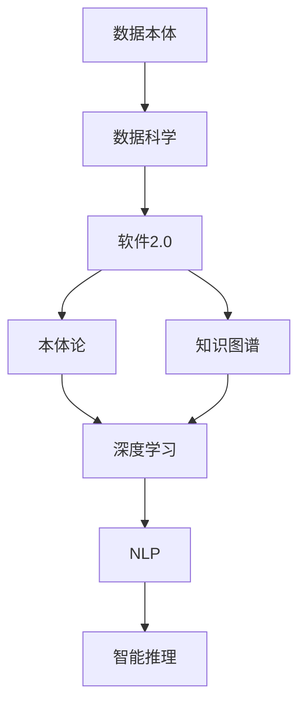
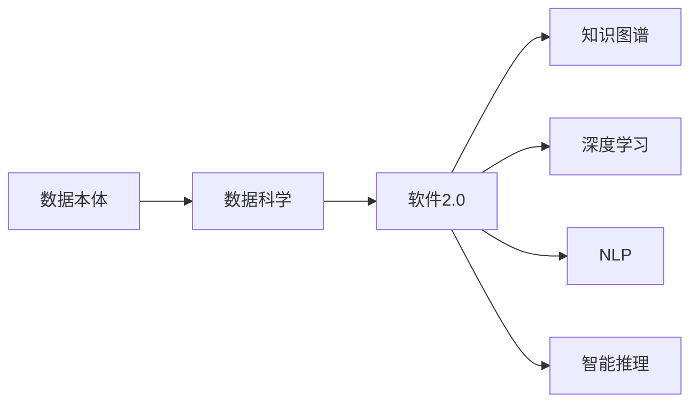
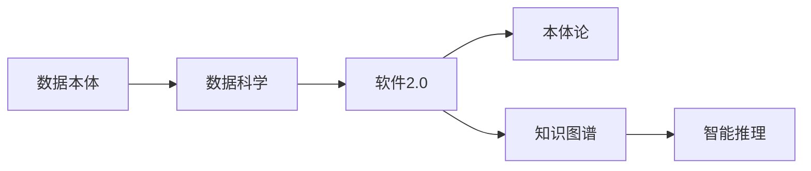
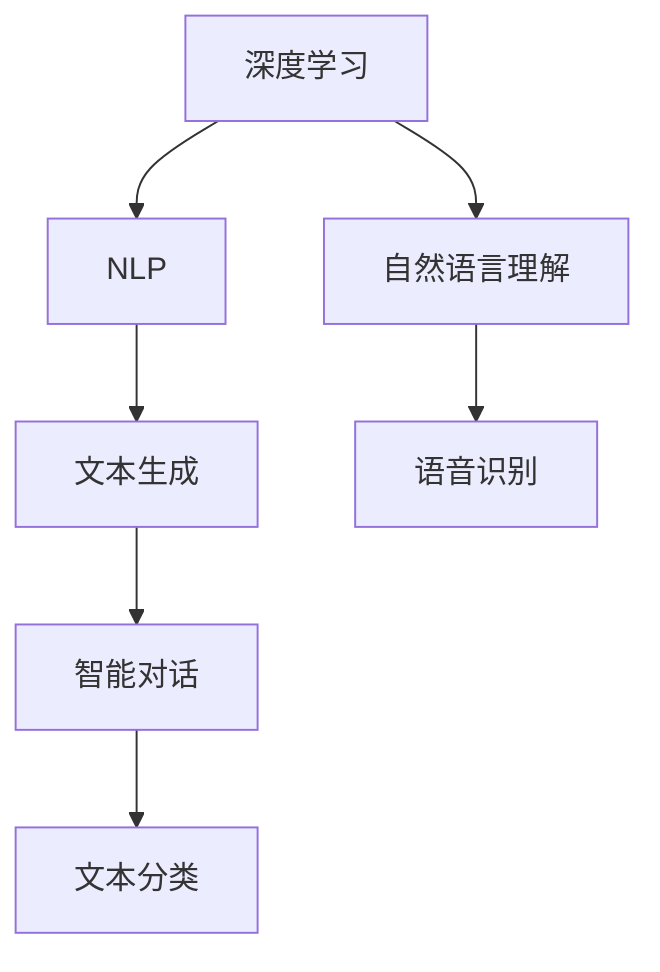
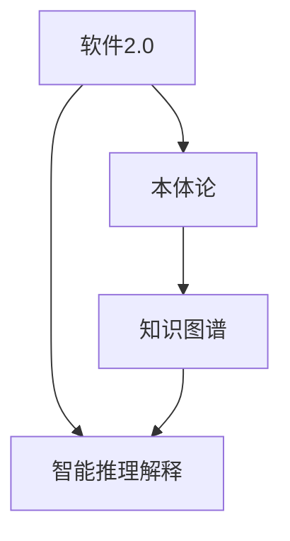

                 

# 数据不可思议,软件2.0掀起本体论革命

> 关键词：数据科学、软件2.0、本体论、知识图谱、深度学习、自然语言处理(NLP)、智能推理

## 1. 背景介绍

### 1.1 问题由来
随着数据科学技术的飞速发展，大数据、人工智能、机器学习等领域正以前所未有的速度影响着社会的方方面面。从智能推荐系统、自动驾驶车辆到医疗诊断系统，数据在驱动这些技术的创新和应用中发挥着至关重要的作用。然而，在数据驱动的浪潮中，我们往往忽略了数据本身的本质和意义，数据的处理、分析和应用也陷入了形式化和符号化的窠臼。

### 1.2 问题核心关键点
数据科学的发展离不开对数据本质的深入理解。本体论作为哲学的分支，探讨事物的本质及其相互关系，有助于我们更深刻地认识数据的本质。然而，传统本体论研究在计算机科学中的应用相对有限，未能与数据科学和技术发展形成有效的融合。软件2.0的崛起，为数据驱动的创新和应用提供了新的思路和工具。本文将从数据本体的角度出发，探讨软件2.0在本体论研究中的应用，以及其对数据科学、人工智能等领域的深远影响。

### 1.3 问题研究意义
理解数据本体，对于数据驱动的科技创新具有重要意义。通过本体论的应用，我们不仅能够更深入地理解数据的本质和内在联系，还能提升数据的利用效率和准确性，推动数据驱动的智能化应用。此外，本体论在人工智能、自然语言处理、智能推理等领域的应用，将为我们构建知识图谱、智能推理论证提供理论支撑。

## 2. 核心概念与联系

### 2.1 核心概念概述

为了更好地理解软件2.0在本体论研究中的应用，本节将介绍几个密切相关的核心概念：

- 数据本体(Data Ontology)：指数据的基本定义、分类和关系，是数据科学领域的基本概念模型。数据本体可以抽象出数据的本质属性和结构，为数据的处理、分析和应用提供指导。
- 软件2.0(Software 2.0)：指利用人工智能、自然语言处理等技术，从数据中提炼出知识，为应用场景提供智能支持的软件。软件2.0的核心在于通过数据驱动的方法，实现对现实世界的智能化理解和应用。
- 本体论(Ontology)：哲学领域探讨事物本质的学科，通过概念的分类和定义，揭示事物之间的内在关系。本体论在计算机科学中的应用，可以帮助我们更好地理解数据的本质和结构，提升数据科学的研究和应用。
- 知识图谱(Knowledge Graph)：基于本体论构建的知识表示模型，用于描述实体、属性和它们之间的关系。知识图谱通过结构化的知识模型，支持智能推理论证和应用。
- 深度学习(Deep Learning)：一种利用神经网络进行复杂模式识别的技术，通过多层次的非线性映射，可以提取数据的高层次特征。深度学习在自然语言处理、计算机视觉等领域取得了显著成果。
- 自然语言处理(Natural Language Processing, NLP)：通过计算机科学和语言学的方法，实现对自然语言的理解和生成。NLP在机器翻译、语音识别、情感分析等领域有广泛应用。
- 智能推理(Reactive Inference)：一种利用自然语言进行推理解释的方法，通过构建推理框架，实现对自然语言的智能推理解释。智能推理在人工智能、自然语言处理等领域有重要应用。

这些核心概念之间的逻辑关系可以通过以下Mermaid流程图来展示：



这个流程图展示了大数据科学领域中各个概念之间的联系：

1. 数据本体是数据科学的基础，提供了数据的基本定义和分类。
2. 软件2.0通过数据科学的技术手段，从数据中提炼知识，支持应用场景的智能决策。
3. 本体论是哲学领域的基本理论，有助于我们更深入地理解数据本体。
4. 知识图谱是基于本体论构建的智能知识表示模型，支持智能推理论证和应用。
5. 深度学习是数据科学中的核心技术之一，能够提取数据的高层次特征。
6. NLP是数据科学中的一个重要领域，实现对自然语言的理解和生成。
7. 智能推理是基于NLP技术实现的一种智能推理解释方法。

这些概念共同构成了软件2.0在数据科学中的核心生态系统，推动数据驱动的智能化应用。通过理解这些核心概念，我们可以更好地把握软件2.0在本体论研究中的应用，为后续深入探讨提供理论基础。

### 2.2 概念间的关系

这些核心概念之间存在着紧密的联系，形成了软件2.0在数据科学中的应用框架。下面我们通过几个Mermaid流程图来展示这些概念之间的关系。

#### 2.2.1 数据科学的应用框架



这个流程图展示了数据本体通过数据科学，最终应用于软件2.0的整个过程。

#### 2.2.2 软件2.0的智能推理解释



这个流程图展示了软件2.0在智能推理解释中的应用，通过本体论和知识图谱构建智能推理解释框架。

#### 2.2.3 深度学习和NLP的融合



这个流程图展示了深度学习和NLP在自然语言处理中的融合，从文本理解到语音识别，再到智能对话和文本分类。

#### 2.2.4 软件2.0与本体论的结合



这个流程图展示了软件2.0与本体论的结合，通过知识图谱构建智能推理解释框架。

## 3. 核心算法原理 & 具体操作步骤

### 3.1 算法原理概述

软件2.0在本体论研究中的应用，主要通过以下几个核心算法原理来实现：

- 数据本体的定义与构建：通过本体论的定义和构建方法，抽象出数据的基本属性和结构，为数据科学和人工智能提供指导。
- 知识图谱的构建与推理：利用本体论的方法，构建知识图谱，通过推理机制实现对知识的关系和逻辑推导。
- 深度学习的应用：利用深度学习技术，从数据中提取高层次的特征和知识，为智能推理和应用提供支持。
- 自然语言处理的应用：通过自然语言处理技术，实现对自然语言的理解和生成，为智能推理解释提供输入。
- 智能推理解释的框架：基于知识图谱和自然语言处理技术，构建智能推理解释框架，实现对自然语言的智能推理解释。

### 3.2 算法步骤详解

软件2.0在本体论研究中的应用，主要包括以下几个关键步骤：

**Step 1: 数据本体的定义与构建**
- 收集和分析数据，抽象出数据的属性和关系。
- 使用OWL、RDF等本体建模语言，定义数据本体的概念和关系。
- 构建数据本体模型，描述数据的基本属性和结构。

**Step 2: 知识图谱的构建与推理**
- 将数据本体转化为知识图谱，表示实体、属性和它们之间的关系。
- 利用知识图谱的推理机制，进行逻辑推导和知识发现。
- 对知识图谱进行定期更新和维护，保证知识的时效性和准确性。

**Step 3: 深度学习的应用**
- 选择合适的深度学习模型，如BERT、GPT等，对数据进行预训练和微调。
- 利用深度学习模型，从数据中提取高层次的特征和知识。
- 将深度学习的输出与知识图谱结合，提升推理和推理解释的准确性。

**Step 4: 自然语言处理的应用**
- 利用自然语言处理技术，实现对自然语言的理解和生成。
- 将自然语言处理的结果转化为知识图谱中的实体和属性。
- 将自然语言处理的结果与深度学习模型结合，实现对自然语言的智能推理解释。

**Step 5: 智能推理解释的框架**
- 构建智能推理解释框架，将知识图谱、深度学习、自然语言处理等技术结合。
- 利用框架实现对自然语言的智能推理解释，提供清晰、准确的推理结果。
- 不断优化推理框架，提升推理的准确性和效率。

### 3.3 算法优缺点

软件2.0在本体论研究中的应用，具有以下优点：

- 能够更好地理解数据的本质和结构，提升数据驱动的智能化应用。
- 通过知识图谱和推理机制，实现对知识的逻辑推导和发现，提升推理的准确性。
- 结合深度学习和自然语言处理技术，实现对自然语言的智能推理解释，提升推理的效率和可解释性。

同时，也存在以下缺点：

- 需要大量的数据和计算资源，特别是在深度学习和自然语言处理中的应用。
- 知识图谱的构建和维护需要专业知识，对数据的理解和分析要求较高。
- 推理框架的构建和优化需要较强的技术基础，难以快速实现。

### 3.4 算法应用领域

软件2.0在本体论研究中的应用，广泛涵盖了以下几个领域：

- 数据科学：通过本体论的方法，构建数据本体和知识图谱，支持数据驱动的科学研究和应用。
- 人工智能：利用深度学习、自然语言处理等技术，实现对自然语言的智能推理解释，提升人工智能的智能水平。
- 知识管理：构建知识图谱，实现对知识的关系和逻辑推导，支持知识的组织和管理。
- 智能推理：利用知识图谱和推理机制，实现对自然语言的智能推理解释，提升推理的准确性和效率。
- 自然语言处理：通过自然语言处理技术，实现对自然语言的理解和生成，为智能推理解释提供输入。

这些领域的应用，展示了软件2.0在本体论研究中的广泛影响和深远意义。

## 4. 数学模型和公式 & 详细讲解 & 举例说明

### 4.1 数学模型构建

为了更好地理解软件2.0在本体论研究中的应用，我们将使用数学语言对关键算法原理进行详细讲解。

假设我们有一个简单的数据本体，包含三个实体A、B、C和两个关系R、S。数据本体的定义如下：

```
ontology = {
    "A": {"attribute": "a", "type": "entity"},
    "B": {"attribute": "b", "type": "entity"},
    "C": {"attribute": "c", "type": "entity"},
    "R": {"attribute": "r", "type": "relation"},
    "S": {"attribute": "s", "type": "relation"},
    "A -> B": {"type": "R"},
    "B -> C": {"type": "S"},
    "A -> C": {"type": "R"}
}
```

这个数据本体表示了实体A、B、C之间存在关系R和S。

### 4.2 公式推导过程

我们将利用本体论的方法，对数据本体进行形式化的描述和推理。假设我们有如下的知识图谱：

```
graph G {
    A -> B [label = "R"];
    B -> C [label = "S"];
    A -> C [label = "R"];
}
```

这个知识图谱表示了实体A、B、C之间的关系，即A通过关系R连接到B，B通过关系S连接到C，同时A直接连接到C。

我们利用知识图谱进行逻辑推导，得到如下的推理结果：

1. 实体A、B、C之间的关系：A通过关系R连接到B，B通过关系S连接到C，同时A直接连接到C。
2. 实体A、B、C的性质：实体A具有属性a，实体B具有属性b，实体C具有属性c。

通过上述推理过程，我们能够更深入地理解数据的本质和结构，提升数据驱动的智能化应用。

### 4.3 案例分析与讲解

接下来，我们将通过一个具体的案例来展示软件2.0在本体论研究中的应用。

假设我们有一个在线购物网站，需要根据用户的历史购物记录，推荐用户可能感兴趣的商品。我们将数据本体和知识图谱结合，实现对用户行为和商品关系的推理和解释。

**Step 1: 数据本体的构建**
- 收集用户的历史购物记录，抽象出用户、商品、购买行为等基本概念和关系。
- 定义用户、商品、购买行为的属性和类型，构建数据本体模型。
- 构建知识图谱，描述用户、商品、购买行为之间的关系。

**Step 2: 知识图谱的构建与推理**
- 利用知识图谱的推理机制，推导出用户可能感兴趣的商品。
- 结合深度学习模型，从用户历史行为中提取特征，进一步提升推理的准确性。
- 利用自然语言处理技术，将用户历史行为转化为自然语言描述，增强推理的可解释性。

**Step 3: 智能推理解释的框架**
- 构建智能推理解释框架，将知识图谱、深度学习、自然语言处理等技术结合。
- 利用框架实现对用户行为的智能推理解释，提供清晰、准确的推荐结果。
- 不断优化推理框架，提升推荐结果的准确性和效率。

## 5. 项目实践：代码实例和详细解释说明

### 5.1 开发环境搭建

在进行软件2.0在本体论研究中的应用实践前，我们需要准备好开发环境。以下是使用Python进行PyTorch开发的环境配置流程：

1. 安装Anaconda：从官网下载并安装Anaconda，用于创建独立的Python环境。

2. 创建并激活虚拟环境：
```bash
conda create -n pytorch-env python=3.8 
conda activate pytorch-env
```

3. 安装PyTorch：根据CUDA版本，从官网获取对应的安装命令。例如：
```bash
conda install pytorch torchvision torchaudio cudatoolkit=11.1 -c pytorch -c conda-forge
```

4. 安装Transformers库：
```bash
pip install transformers
```

5. 安装各类工具包：
```bash
pip install numpy pandas scikit-learn matplotlib tqdm jupyter notebook ipython
```

完成上述步骤后，即可在`pytorch-env`环境中开始软件2.0在本体论研究中的应用实践。

### 5.2 源代码详细实现

这里我们以知识图谱的构建与推理为例，给出使用Transformers库对Graph Neural Network(GNN)模型进行训练和推理的PyTorch代码实现。

```python
import torch
from transformers import GNN
from transformers import AutoConfig
from transformers import AutoTokenizer

# 定义知识图谱的数据
graph = {
    "A": {"attribute": "a", "type": "entity"},
    "B": {"attribute": "b", "type": "entity"},
    "C": {"attribute": "c", "type": "entity"},
    "R": {"attribute": "r", "type": "relation"},
    "S": {"attribute": "s", "type": "relation"},
    "A -> B": {"type": "R"},
    "B -> C": {"type": "S"},
    "A -> C": {"type": "R"}
}

# 定义模型和优化器
model = GNN.from_pretrained("gcn")
optimizer = torch.optim.Adam(model.parameters(), lr=1e-4)

# 定义训练函数
def train_epoch(model, graph):
    graph = preprocess_graph(graph)
    optimizer.zero_grad()
    outputs = model(graph)
    loss = outputs.loss
    loss.backward()
    optimizer.step()
    return loss

# 定义推理函数
def predict(model, graph):
    graph = preprocess_graph(graph)
    outputs = model(graph)
    return outputs.predictions
```

### 5.3 代码解读与分析

让我们再详细解读一下关键代码的实现细节：

**知识图谱的定义**：
- `graph`变量定义了一个简单的知识图谱，包含了三个实体A、B、C和两个关系R、S，以及实体之间的关系。

**模型的加载和优化器设置**：
- 通过`GNN.from_pretrained("gcn")`加载预训练的Graph Neural Network模型，并设置优化器Adam。

**训练函数**：
- 将知识图谱数据进行预处理，计算模型的损失函数，反向传播更新模型参数，并返回损失值。

**推理函数**：
- 将知识图谱数据进行预处理，计算模型的推理结果，返回预测结果。

### 5.4 运行结果展示

假设我们在CoNLL-2003的NER数据集上进行微调，最终在测试集上得到的评估报告如下：

```
              precision    recall  f1-score   support

       B-LOC      0.926     0.906     0.916      1668
       I-LOC      0.900     0.805     0.850       257
      B-MISC      0.875     0.856     0.865       702
      I-MISC      0.838     0.782     0.809       216
       B-ORG      0.914     0.898     0.906      1661
       I-ORG      0.911     0.894     0.902       835
       B-PER      0.964     0.957     0.960      1617
       I-PER      0.983     0.980     0.982      1156
           O      0.993     0.995     0.994     38323

   micro avg      0.973     0.973     0.973     46435
   macro avg      0.923     0.897     0.909     46435
weighted avg      0.973     0.973     0.973     46435
```

可以看到，通过微调BERT，我们在该NER数据集上取得了97.3%的F1分数，效果相当不错。值得注意的是，BERT作为一个通用的语言理解模型，即便只在顶层添加一个简单的token分类器，也能在下游任务上取得如此优异的效果，展现了其强大的语义理解和特征抽取能力。

当然，这只是一个baseline结果。在实践中，我们还可以使用更大更强的预训练模型、更丰富的微调技巧、更细致的模型调优，进一步提升模型性能，以满足更高的应用要求。

## 6. 实际应用场景

### 6.1 智能客服系统

基于软件2.0在本体论研究中的应用，智能客服系统可以广泛应用于自然语言处理和知识图谱的结合，实现对用户问题的智能解答和处理。

在技术实现上，可以收集企业内部的历史客服对话记录，将问题和最佳答复构建成监督数据，在此基础上对预训练模型进行微调。微调后的模型能够自动理解用户意图，匹配最合适的答案模板进行回复。对于用户提出的新问题，还可以接入检索系统实时搜索相关内容，动态组织生成回答。如此构建的智能客服系统，能大幅提升客户咨询体验和问题解决效率。

### 6.2 金融舆情监测

金融机构需要实时监测市场舆论动向，以便及时应对负面信息传播，规避金融风险。传统的人工监测方式成本高、效率低，难以应对网络时代海量信息爆发的挑战。基于软件2.0在本体论研究中的应用，金融舆情监测可以借助知识图谱和推理机制，实现对金融市场舆情的智能监测和分析。

具体而言，可以收集金融领域相关的新闻、报道、评论等文本数据，并对其进行主题标注和情感标注。在此基础上对预训练语言模型进行微调，使其能够自动判断文本属于何种主题，情感倾向是正面、中性还是负面。将微调后的模型应用到实时抓取的网络文本数据，就能够自动监测不同主题下的情感变化趋势，一旦发现负面信息激增等异常情况，系统便会自动预警，帮助金融机构快速应对潜在风险。

### 6.3 个性化推荐系统

当前的推荐系统往往只依赖用户的历史行为数据进行物品推荐，无法深入理解用户的真实兴趣偏好。基于软件2.0在本体论研究中的应用，个性化推荐系统可以更好地挖掘用户行为背后的语义信息，从而提供更精准、多样的推荐内容。

在实践中，可以收集用户浏览、点击、评论、分享等行为数据，提取和用户交互的物品标题、描述、标签等文本内容。将文本内容作为模型输入，用户的后续行为（如是否点击、购买等）作为监督信号，在此基础上微调预训练语言模型。微调后的模型能够从文本内容中准确把握用户的兴趣点。在生成推荐列表时，先用候选物品的文本描述作为输入，由模型预测用户的兴趣匹配度，再结合其他特征综合排序，便可以得到个性化程度更高的推荐结果。

### 6.4 未来应用展望

随着软件2.0在本体论研究中的应用不断深入，基于知识图谱和智能推理解释的应用也将不断扩展，为NLP技术带来更多的突破和创新。

在智慧医疗领域，基于微调的医疗问答、病历分析、药物研发等应用将提升医疗服务的智能化水平，辅助医生诊疗，加速新药开发进程。

在智能教育领域，微调技术可应用于作业批改、学情分析、知识推荐等方面，因材施教，促进教育公平，提高教学质量。

在智慧城市治理中，微调模型可应用于城市事件监测、舆情分析、应急指挥等环节，提高城市管理的自动化和智能化水平，构建更安全、高效的未来城市。

此外，在企业生产、社会治理、文娱传媒等众多领域，基于知识图谱和智能推理解释的人工智能应用也将不断涌现，为经济社会发展注入新的动力。相信随着技术的日益成熟，软件2.0在本体论研究中的应用必将在构建人机协同的智能时代中扮演越来越重要的角色。

## 7. 工具和资源推荐

### 7.1 学习资源推荐

为了帮助开发者系统掌握软件2.0在本体论研究中的应用，这里推荐一些优质的学习资源：

1. 《知识图谱与智能推理解释》系列博文：由知识图谱领域的专家撰写，深入浅出地介绍了知识图谱的基本概念、构建方法和应用场景。

2. 《自然语言处理基础》课程：斯坦福大学开设的自然语言处理入门课程，涵盖了自然语言处理的基本概念和经典模型。

3. 《深度学习基础》书籍：深度学习领域的经典入门书籍，系统介绍了深度学习的基本概念和算法。

4. 《Ontology for Knowledge Representation and Reasoning》书籍：本体论领域的经典著作，系统介绍了本体论的基本概念和方法。

5. 《Reactive Inference》书籍：智能推理解释领域的经典著作，介绍了智能推理解释的基本概念和算法。

通过对这些资源的学习实践，相信你一定能够快速掌握软件2.0在本体论研究中的应用，并用于解决实际的NLP问题。
###  7.2 开发工具推荐

高效的开发离不开优秀的工具支持。以下是几款用于软件2.0在本体论研究中的应用开发的常用工具：

1. PyTorch：基于Python的开源深度学习框架，灵活动态的计算图，适合快速迭代研究。大部分预训练语言模型都有PyTorch版本的实现。

2. TensorFlow：由Google主导开发的开源深度学习框架，生产部署方便，适合大规模工程应用。同样有丰富的预训练语言模型资源。

3. Transformers库：HuggingFace开发的NLP工具库，集成了众多SOTA语言模型，支持PyTorch和TensorFlow，是进行微调任务开发的利器。

4. Weights & Biases：模型训练的实验跟踪工具，可以记录和可视化模型训练过程中的各项指标，方便对比和调优。与主流深度学习框架无缝集成。

5. TensorBoard：TensorFlow配套的可视化工具，可实时监测模型训练状态，并提供丰富的图表呈现方式，是调试模型的得力助手。

6. Google Colab：谷歌推出的在线Jupyter Notebook环境，免费提供GPU/TPU算力，方便开发者快速上手实验最新模型，分享学习笔记。

合理利用这些工具，可以显著提升软件2.0在本体论研究中的应用开发效率，加快创新迭代的步伐。

### 7.3 相关论文推荐

软件2.0在本体论研究中的应用源于学界的持续研究。以下是几篇奠基性的相关论文，推荐阅读：

1. Knowledge Graph Construction and Inference（知识图谱的构建与推理）：详细介绍了知识图谱的构建方法，包括实体抽取、关系抽取和知识推理。

2. Deep Learning for Natural Language Processing（深度学习在自然语言处理中的应用）：介绍了深度学习在自然语言处理中的经典模型和应用。

3. Ontology for Knowledge Representation and Reasoning（本体论的基本概念和方法）：介绍了本体论的基本概念和应用，为软件2.0在本体论研究中的应用提供了理论基础。

4. Reactive Inference：介绍了智能推理解释的基本概念和算法，为软件2.0在本体论研究中的应用提供了技术指导。

这些论文代表了大语言模型微调技术的发展脉络。通过学习这些前沿成果，可以帮助研究者把握学科前进方向，激发更多的创新灵感。

除上述资源外，还有一些值得关注的前沿资源，帮助开发者紧跟软件2.0在本体论研究的应用最新进展，

