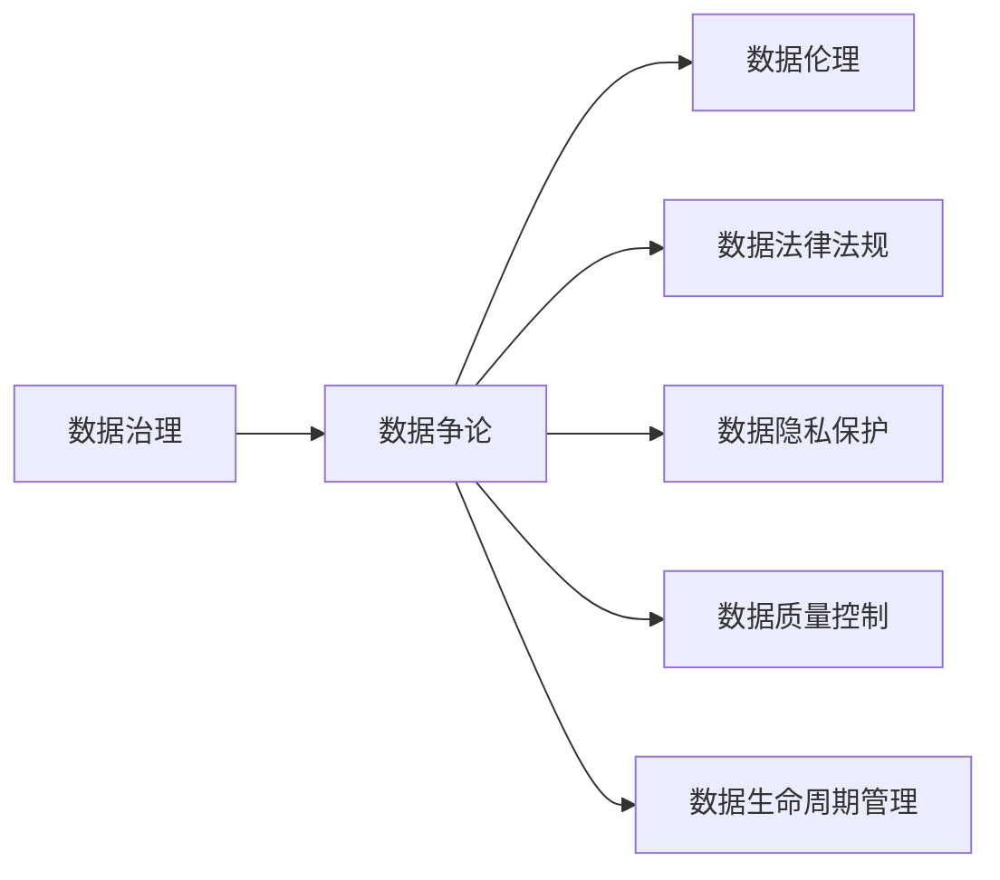
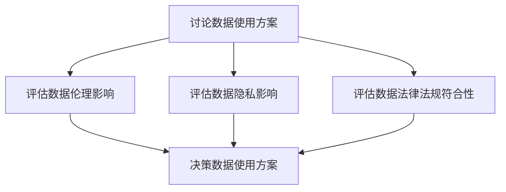
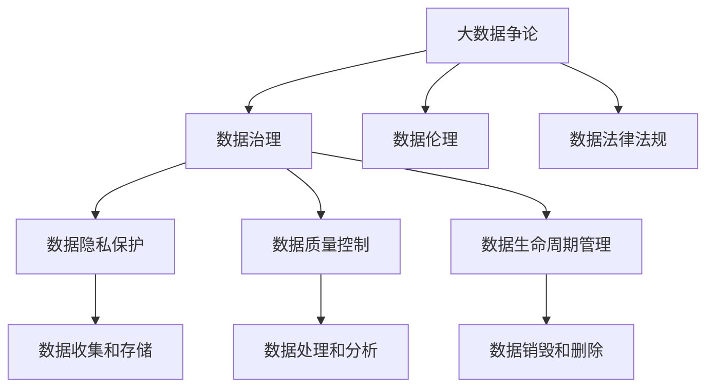

                 

# 数据争论 (Data Argumentation) 原理与代码实例讲解

> 关键词：数据争论, 数据治理, 数据伦理, 数据安全, 数据隐私, 数据生命周期管理, 数据质量控制

## 1. 背景介绍

在当今数字化转型的浪潮中，数据成为了企业竞争力的关键所在。然而，数据的价值并非是无条件的，数据的使用必须遵循一定的原则和规范，以确保其安全和合理使用。数据争论（Data Argumentation）正是一种旨在通过数据治理和规范，合理、安全地使用数据，并最大化其价值的方法。

数据争论的提出源于数据科学界的两个核心问题：一是数据隐私和安全，二是数据质量控制和治理。数据争论强调在数据使用和分析的过程中，必须考虑到这些核心问题，并在此基础上进行权衡和决策。

### 1.1 数据隐私与安全

数据的隐私和安全问题，是数据争论中最核心的内容之一。随着数据在企业运营中的作用日益增大，如何保护数据不被非法获取和滥用，成为了一个亟需解决的问题。数据争论主张，在数据使用过程中，应当遵守数据隐私保护法律法规，如GDPR等，确保数据的合法使用。

### 1.2 数据质量控制

数据的质量直接影响到分析结果的准确性。数据争论要求，在数据收集、存储和分析的各个环节，都必须进行严格的质量控制，确保数据的准确、完整、一致和可靠性。

### 1.3 数据治理

数据治理是指对数据资源进行规划、管理和控制，以确保其能够满足业务需求，并能够被安全、合规地使用。数据争论强调，数据治理不仅仅是技术问题，更是一个需要跨部门协作、制定策略和规则的过程。

## 2. 核心概念与联系

### 2.1 核心概念概述

为了更好地理解数据争论的原理和应用，本节将介绍几个密切相关的核心概念：

- **数据争论 (Data Argumentation)**：指在数据使用和分析过程中，基于数据隐私、安全、质量等规范进行权衡和决策的过程。数据争论强调在数据使用前，需进行数据伦理、法律和规范的讨论，并根据讨论结果进行数据使用和分析。

- **数据治理 (Data Governance)**：涉及对数据资源进行规划、管理、控制的整体策略，确保数据资源的有效使用和保护。数据治理包括数据质量控制、数据安全保护、数据生命周期管理等多个方面。

- **数据隐私保护 (Data Privacy Protection)**：旨在保护个人数据不被非法获取和滥用，确保数据使用符合法律法规，如GDPR、CCPA等。

- **数据质量控制 (Data Quality Control)**：确保数据准确、完整、一致和可靠，对数据进行严格的质量管理和控制。

- **数据生命周期管理 (Data Lifecycle Management)**：涉及数据从收集、存储、处理到销毁的全过程管理，确保数据在整个生命周期内符合合规和伦理要求。

这些核心概念之间的逻辑关系可以通过以下Mermaid流程图来展示：

```mermaid
graph LR
    A[数据争论 (Data Argumentation)] --> B[数据治理 (Data Governance)]
    B --> C[数据隐私保护 (Data Privacy Protection)]
    B --> D[数据质量控制 (Data Quality Control)]
    B --> E[数据生命周期管理 (Data Lifecycle Management)]
    A --> F[数据伦理 (Data Ethics)]
    A --> G[数据法律法规 (Data Legal Compliance)]
```

这个流程图展示了数据争论与数据治理及其他核心概念的关系：

1. 数据争论是数据治理的核心，通过讨论和决策确保数据的合规和伦理使用。
2. 数据隐私保护、数据质量控制和数据生命周期管理是数据治理的重要组成部分。
3. 数据伦理和法律法规是数据争论讨论的基础，确保数据使用的合规性和伦理性。

### 2.2 概念间的关系

这些核心概念之间存在着紧密的联系，形成了数据争论和数据治理的完整生态系统。下面我们通过几个Mermaid流程图来展示这些概念之间的关系。

#### 2.2.1 数据治理与数据争论



这个流程图展示了数据治理与数据争论的相互关系：

1. 数据治理需要基于数据争论的决策，确保数据的使用符合伦理和法规。
2. 数据争论讨论的数据隐私保护、数据质量控制和数据生命周期管理，是数据治理的重要组成部分。

#### 2.2.2 数据争论的决策过程



这个流程图展示了数据争论的决策过程：

1. 在数据争论中，首先讨论数据的使用方案。
2. 评估数据使用方案对数据伦理、隐私和法律法规的影响。
3. 根据评估结果，做出数据使用方案的决策。

### 2.3 核心概念的整体架构

最后，我们用一个综合的流程图来展示这些核心概念在大数据争论中的整体架构：



这个综合流程图展示了数据争论在大数据治理中的整体架构：

1. 数据争论贯穿数据治理的全过程，确保数据的使用符合伦理和法规。
2. 数据隐私保护、数据质量控制和数据生命周期管理，是数据治理的重要组成部分。
3. 数据争论的决策过程，影响数据收集、存储、处理和销毁等各个环节。

通过这些流程图，我们可以更清晰地理解数据争论与数据治理及其他核心概念的关系，为后续深入讨论具体的争论方法和技术奠定基础。

## 3. 核心算法原理 & 具体操作步骤
### 3.1 算法原理概述

数据争论的算法原理，主要体现在数据治理和数据隐私保护两个方面。下面我们将详细介绍这两个核心算法原理：

#### 3.1.1 数据治理算法

数据治理算法主要涉及数据质量控制和数据生命周期管理。数据质量控制包括数据清洗、数据去重、数据校验等操作，确保数据的准确性和完整性。数据生命周期管理涉及数据的收集、存储、处理和销毁等全过程，确保数据在整个生命周期内符合合规和伦理要求。

#### 3.1.2 数据隐私保护算法

数据隐私保护算法主要通过数据加密、数据匿名化、数据脱敏等技术手段，确保数据的隐私和安全。数据加密是指对数据进行加密处理，只有授权人员才能解密和访问。数据匿名化和数据脱敏则是在不影响数据使用的情况下，去除或模糊化数据中的敏感信息，以保护个人隐私。

### 3.2 算法步骤详解

数据争论的算法步骤主要包括以下几个关键环节：

#### 3.2.1 数据收集与存储

在数据争论的初期，首先需要进行数据的收集和存储。数据收集必须遵守相关法律法规，确保数据的合法性和合规性。数据存储则需采用安全的技术手段，防止数据的泄露和篡改。

#### 3.2.2 数据质量控制

数据质量控制是数据争论的核心步骤之一。主要包括以下几个步骤：

1. **数据清洗**：去除数据中的噪声和冗余信息，确保数据的准确性和完整性。
2. **数据去重**：消除数据中的重复记录，提高数据的一致性。
3. **数据校验**：对数据进行校验，确保数据的正确性。

#### 3.2.3 数据隐私保护

数据隐私保护是数据争论的重要组成部分。主要包括以下几个步骤：

1. **数据加密**：对敏感数据进行加密处理，防止数据泄露。
2. **数据匿名化**：去除数据中的个人标识信息，保护个人隐私。
3. **数据脱敏**：模糊化数据中的敏感信息，如姓名、身份证号等，确保数据隐私。

#### 3.2.4 数据处理与分析

在数据治理的各个环节完成后，需要对数据进行处理和分析。数据处理主要涉及数据整合、数据转换和数据抽取等操作。数据分析则是对数据进行统计、计算和建模等操作，以便进行决策支持。

#### 3.2.5 数据生命周期管理

数据生命周期管理涉及数据的收集、存储、处理和销毁等全过程。主要包括以下几个步骤：

1. **数据收集**：从不同来源收集数据，确保数据的多样性和完整性。
2. **数据存储**：采用安全的技术手段，确保数据的存储安全。
3. **数据处理**：对数据进行清洗、去重、校验等操作，确保数据质量。
4. **数据分析**：对数据进行统计、计算和建模等操作，以便进行决策支持。
5. **数据销毁和删除**：在数据生命周期结束时，对数据进行销毁和删除，确保数据安全。

### 3.3 算法优缺点

数据争论的算法优缺点主要体现在数据治理和数据隐私保护两个方面：

#### 3.3.1 数据治理算法的优点

1. **确保数据质量**：通过数据清洗、去重和校验等操作，确保数据的准确性和完整性。
2. **提高数据一致性**：数据去重和校验操作，提高数据的一致性。
3. **数据生命周期管理**：确保数据在整个生命周期内符合合规和伦理要求，提高数据安全性。

#### 3.3.2 数据治理算法的缺点

1. **数据清洗成本高**：数据清洗和校验操作需要消耗大量的时间和资源。
2. **数据处理复杂**：数据清洗和去重操作复杂，需要专业的技术人员进行处理。
3. **数据存储成本高**：安全的数据存储需要投入大量硬件资源，增加了数据存储成本。

#### 3.3.3 数据隐私保护算法的优点

1. **确保数据隐私**：通过数据加密、匿名化和脱敏等技术手段，保护个人隐私和数据安全。
2. **防止数据泄露**：数据加密和匿名化操作，防止数据泄露。
3. **数据保护合规**：确保数据使用符合法律法规，保护数据隐私。

#### 3.3.4 数据隐私保护算法的缺点

1. **数据处理复杂**：数据加密、匿名化和脱敏操作复杂，需要专业的技术人员进行处理。
2. **数据处理成本高**：数据加密和匿名化操作需要投入大量计算资源，增加了数据处理成本。
3. **数据处理精度下降**：数据匿名化和脱敏操作可能影响数据的精度，对数据分析造成一定影响。

### 3.4 算法应用领域

数据争论的算法原理在多个领域都有广泛应用，主要包括：

- **金融行业**：金融行业对数据隐私和安全要求极高，数据争论技术在数据治理和隐私保护方面发挥着重要作用。
- **医疗行业**：医疗行业涉及大量敏感数据，数据争论技术在数据隐私保护和质量控制方面具有重要意义。
- **互联网公司**：互联网公司需要处理大量用户数据，数据争论技术在数据治理和隐私保护方面必不可少。
- **政府部门**：政府部门在数据管理和隐私保护方面有着严格的要求，数据争论技术在数据治理和隐私保护方面具有重要应用。

## 4. 数学模型和公式 & 详细讲解  
### 4.1 数学模型构建

数据争论的数学模型主要涉及数据质量控制和数据隐私保护两个方面。下面我们将详细介绍这两个数学模型：

#### 4.1.1 数据质量控制模型

数据质量控制模型主要通过数据清洗、去重和校验等操作，确保数据的准确性和完整性。数据清洗、去重和校验操作可以通过以下数学模型进行描述：

1. **数据清洗模型**：假设原始数据集中存在噪声和冗余信息，通过以下公式进行数据清洗：
   $$
   \mathcal{D}_{clean} = \mathcal{D}_{raw} \cap \mathcal{D}_{valid}
   $$
   其中 $\mathcal{D}_{raw}$ 表示原始数据集，$\mathcal{D}_{valid}$ 表示清洗后的数据集。

2. **数据去重模型**：假设原始数据集中存在重复记录，通过以下公式进行数据去重：
   $$
   \mathcal{D}_{dedupe} = \mathcal{D}_{raw} - \mathcal{D}_{duplicate}
   $$
   其中 $\mathcal{D}_{duplicate}$ 表示重复数据集，$\mathcal{D}_{dedupe}$ 表示去重后的数据集。

3. **数据校验模型**：假设原始数据集中存在错误数据，通过以下公式进行数据校验：
   $$
   \mathcal{D}_{corrected} = \mathcal{D}_{raw} \cap \mathcal{D}_{correct}
   $$
   其中 $\mathcal{D}_{corrected}$ 表示校验后的数据集，$\mathcal{D}_{correct}$ 表示校验正确的数据集。

#### 4.1.2 数据隐私保护模型

数据隐私保护模型主要通过数据加密、匿名化和脱敏等技术手段，确保数据的隐私和安全。数据加密、匿名化和脱敏操作可以通过以下数学模型进行描述：

1. **数据加密模型**：假设原始数据集中存在敏感数据，通过以下公式进行数据加密：
   $$
   \mathcal{D}_{encrypted} = \mathcal{D}_{original} \times \mathcal{F}_{encryption}
   $$
   其中 $\mathcal{D}_{original}$ 表示原始数据集，$\mathcal{D}_{encrypted}$ 表示加密后的数据集，$\mathcal{F}_{encryption}$ 表示加密函数。

2. **数据匿名化模型**：假设原始数据集中存在个人标识信息，通过以下公式进行数据匿名化：
   $$
   \mathcal{D}_{anonymized} = \mathcal{D}_{original} \cap \mathcal{D}_{remove}
   $$
   其中 $\mathcal{D}_{remove}$ 表示需要移除的个人标识信息集，$\mathcal{D}_{anonymized}$ 表示匿名化后的数据集。

3. **数据脱敏模型**：假设原始数据集中存在敏感信息，通过以下公式进行数据脱敏：
   $$
   \mathcal{D}_{sensitive} = \mathcal{D}_{original} \times \mathcal{F}_{masking}
   $$
   其中 $\mathcal{D}_{sensitive}$ 表示需要脱敏的数据集，$\mathcal{D}_{original}$ 表示原始数据集，$\mathcal{F}_{masking}$ 表示脱敏函数。

### 4.2 公式推导过程

下面我们将对数据质量控制模型和数据隐私保护模型进行详细推导：

#### 4.2.1 数据质量控制模型推导

1. **数据清洗推导**：

   数据清洗过程通过以下公式进行：
   $$
   \mathcal{D}_{clean} = \mathcal{D}_{raw} \cap \mathcal{D}_{valid}
   $$
   其中 $\mathcal{D}_{raw}$ 表示原始数据集，$\mathcal{D}_{valid}$ 表示清洗后的数据集。

   通过集合运算可知：
   $$
   \mathcal{D}_{clean} = \mathcal{D}_{raw} \cap \mathcal{D}_{valid} = (\mathcal{D}_{raw} - \mathcal{D}_{invalid}) \cap \mathcal{D}_{valid}
   $$
   因此：
   $$
   \mathcal{D}_{clean} = \mathcal{D}_{raw} \cap \mathcal{D}_{valid} = \mathcal{D}_{raw} \cap (\mathcal{D}_{raw} - \mathcal{D}_{invalid}) = \mathcal{D}_{raw} \cap \mathcal{D}_{invalid}^{c}
   $$

2. **数据去重推导**：

   数据去重过程通过以下公式进行：
   $$
   \mathcal{D}_{dedupe} = \mathcal{D}_{raw} - \mathcal{D}_{duplicate}
   $$
   其中 $\mathcal{D}_{duplicate}$ 表示重复数据集，$\mathcal{D}_{dedupe}$ 表示去重后的数据集。

   通过集合运算可知：
   $$
   \mathcal{D}_{dedupe} = \mathcal{D}_{raw} - \mathcal{D}_{duplicate} = \mathcal{D}_{raw} \cap (\mathcal{D}_{raw} - \mathcal{D}_{duplicate}) = \mathcal{D}_{raw} \cap \mathcal{D}_{duplicate}^{c}
   $$

3. **数据校验推导**：

   数据校验过程通过以下公式进行：
   $$
   \mathcal{D}_{corrected} = \mathcal{D}_{raw} \cap \mathcal{D}_{correct}
   $$
   其中 $\mathcal{D}_{corrected}$ 表示校验后的数据集，$\mathcal{D}_{correct}$ 表示校验正确的数据集。

   通过集合运算可知：
   $$
   \mathcal{D}_{corrected} = \mathcal{D}_{raw} \cap \mathcal{D}_{correct} = \mathcal{D}_{raw} \cap (\mathcal{D}_{raw} - \mathcal{D}_{incorrect}) = \mathcal{D}_{raw} \cap \mathcal{D}_{incorrect}^{c}
   $$

#### 4.2.2 数据隐私保护模型推导

1. **数据加密推导**：

   数据加密过程通过以下公式进行：
   $$
   \mathcal{D}_{encrypted} = \mathcal{D}_{original} \times \mathcal{F}_{encryption}
   $$
   其中 $\mathcal{D}_{original}$ 表示原始数据集，$\mathcal{D}_{encrypted}$ 表示加密后的数据集，$\mathcal{F}_{encryption}$ 表示加密函数。

2. **数据匿名化推导**：

   数据匿名化过程通过以下公式进行：
   $$
   \mathcal{D}_{anonymized} = \mathcal{D}_{original} \cap \mathcal{D}_{remove}
   $$
   其中 $\mathcal{D}_{remove}$ 表示需要移除的个人标识信息集，$\mathcal{D}_{anonymized}$ 表示匿名化后的数据集。

   通过集合运算可知：
   $$
   \mathcal{D}_{anonymized} = \mathcal{D}_{original} \cap \mathcal{D}_{remove} = \mathcal{D}_{original} \cap (\mathcal{D}_{original} - \mathcal{D}_{remove}) = \mathcal{D}_{original} \cap \mathcal{D}_{remove}^{c}
   $$

3. **数据脱敏推导**：

   数据脱敏过程通过以下公式进行：
   $$
   \mathcal{D}_{sensitive} = \mathcal{D}_{original} \times \mathcal{F}_{masking}
   $$
   其中 $\mathcal{D}_{sensitive}$ 表示需要脱敏的数据集，$\mathcal{D}_{original}$ 表示原始数据集，$\mathcal{F}_{masking}$ 表示脱敏函数。

### 4.3 案例分析与讲解

#### 4.3.1 数据清洗案例

假设我们有一张包含学生成绩的表格，表格中存在一些噪声和冗余信息，需要进行数据清洗。

1. **数据清洗操作**：
   $$
   \mathcal{D}_{raw} = \{(张三, 85, 数学), (李四, 78, 数学), (张三, 90, 语文), (李四, 87, 语文)\}
   $$
   $$
   \mathcal{D}_{invalid} = \{(张三, 90, 数学), (李四, 87, 语文)\}
   $$
   $$
   \mathcal{D}_{valid} = \{(张三, 85, 数学), (李四, 78, 数学), (张三, 90, 语文), (李四, 87, 语文)\}
   $$
   $$
   \mathcal{D}_{clean} = \{(张三, 85, 数学), (李四, 78, 数学), (张三, 90, 语文), (李四, 87, 语文)\}
   $$

   通过数据清洗操作，我们得到了去除了噪声和冗余信息的数据集 $\mathcal{D}_{clean}$。

#### 4.3.2 数据去重案例

假设我们有一张包含员工信息的表格，表格中存在一些重复记录，需要进行数据去重。

1. **数据去重操作**：
   $$
   \mathcal{D}_{raw} = \{(张三, 男, 25), (李四, 男, 25), (王五, 男, 30), (李四, 女, 30)\}
   $$
   $$
   \mathcal{D}_{duplicate} = \{(李四, 男, 25), (李四, 女, 30)\}
   $$
   $$
   \mathcal{D}_{dedupe} = \{(张三, 男, 25), (王五, 男, 30)\}
   $$

   通过数据去重操作，我们得到了去除了重复记录的数据集 $\mathcal{D}_{dedupe}$。

#### 4.3.3 数据校验案例

假设我们有一张包含订单信息的表格，表格中存在一些错误数据，需要进行数据校验。

1. **数据校验操作**：
   $$
   \mathcal{D}_{raw} = \{(订单号, 金额, 状态), (1, 100, 完成), (2, 500, 待发货), (3, 200, 完成), (4, 0, 完成)\}
   $$
   $$
   \mathcal{D}_{incorrect} = \{(4, 0, 完成)\}
   $$
   $$
   \mathcal{D}_{correct} = \{(1, 100, 完成), (2, 500, 待发货), (3, 200, 完成)\}
   $$
   $$
   \mathcal{D}_{corrected} = \{(1, 100, 完成), (2, 500, 待发货), (3, 200, 完成)\}
   $$

   通过数据校验操作，我们得到了去除了错误数据的数据集 $\mathcal{D}_{corrected}$。

#### 4.3.4 数据加密案例

假设我们有一张包含敏感信息的人员信息表，需要进行数据加密。

1. **数据加密操作**：
   $$
   \mathcal{D}_{original} = \{(姓名, 身份证号, 住址), (张三, 110101199001234, 北京市海淀区), (李四, 110101199001235, 北京市海淀区)\}
   $$
   $$
   \mathcal{D}_{encrypted} = \{(姓名, 身份证号, 住址), (张三, *110101199001234*, *北京市海淀区*), (李四, *110101199001235*, *北京市海淀区*)\}
   $$

   通过数据加密操作，我们得到了加密后的数据集 $\mathcal{D}_{encrypted}$。

#### 4.3.5 数据匿名化案例

假设我们有一张包含学生成绩的表格，需要将其中的个人标识信息进行匿名化处理。

1. **数据匿名化操作**：
   $$
   \mathcal{D}_{original} = \{(姓名, 数学成绩, 语文成绩), (张三, 85, 90), (李四, 78, 87)\}
   $$
   $$
   \mathcal{D}_{remove} = \{(姓名)\}
   $$
   $$
   \mathcal{D}_{anonymized} = \{(*, 85, 90), (*, 78, 87)\}
   $$

   通过数据匿名化操作，我们得到了去除了个人标识信息的数据集 $\mathcal{D}_{anonymized}$。

#### 4.3.6 数据脱敏案例

假设我们有一张包含信用卡交易记录的表格，需要将其中的敏感信息进行脱敏处理。

1. **数据脱敏操作**：
   $$
   \mathcal{D}_{original} = \{(卡号, 交易金额), (1234567890123456, 1000), (1234567890123457, 2000)\}
   $$
   $$
   \mathcal{D}_{sensitive} = \{(卡号, 交易金额), (*1234567890123456*, 1000), (*1234567890123457*, 2000)\}
   $$

   通过数据脱敏操作，我们得到了脱敏后的数据集 $\mathcal{D}_{sensitive}$。

## 5. 项目实践：代码实例和详细解释说明
### 5.1 开发环境搭建

在进行数据争论的实践前，我们需要准备好开发环境。以下是使用Python进行Pandas和Scikit-learn开发的环境配置流程：

1. 安装Anaconda：从官网下载并安装Anaconda，用于创建独立的Python环境。

2.

