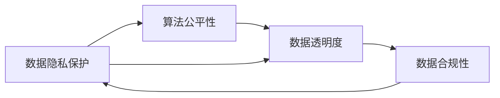
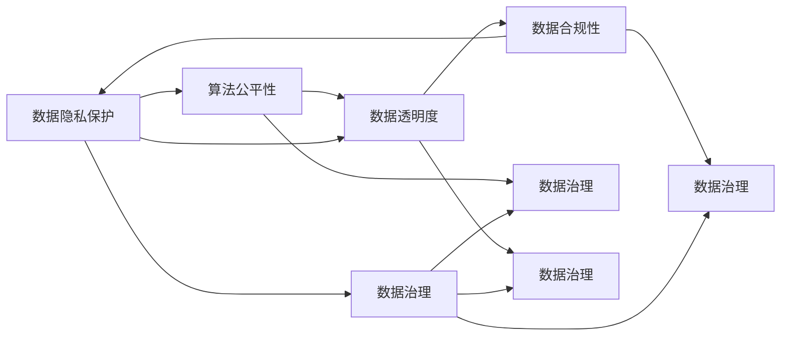

                 

# 数据伦理与平台责任：如何构建负责任的平台？

> 关键词：数据伦理, 平台责任, 隐私保护, 数据安全, 透明度, 公平性, 数据治理, 合规性

## 1. 背景介绍

### 1.1 问题由来
随着大数据和人工智能技术的迅猛发展，平台型企业凭借其强大的数据收集与分析能力，逐渐成为各行业的重要基础设施。然而，数据的使用在带来便利的同时，也引发了一系列伦理、法律和社会问题，如隐私泄露、数据滥用、算法偏见等。这些问题不仅损害了用户的权益，还可能对社会稳定产生负面影响。

### 1.2 问题核心关键点
数据伦理与平台责任的核心关键点在于：
1. **数据隐私保护**：平台如何确保用户数据的安全性和隐私性，防止数据泄露和滥用。
2. **数据公平性**：平台如何保证数据使用的公平性，避免算法偏见和歧视。
3. **数据透明度**：平台如何提高数据使用的透明度，让用户清楚了解自己的数据如何被使用。
4. **数据合规性**：平台如何遵循法律法规，确保数据使用合规，避免法律风险。

### 1.3 问题研究意义
数据伦理与平台责任的研究具有重要的理论和现实意义：
1. **保护用户权益**：明确平台在数据收集和使用上的责任，保护用户隐私和个人信息安全。
2. **促进技术进步**：推动数据治理技术的创新和应用，促进数据科学和人工智能的发展。
3. **维护社会稳定**：通过规范数据使用行为，防止数据滥用带来的社会问题，维护社会稳定和公平。
4. **推动产业发展**：指导平台企业建立负责任的数据使用规范，推动产业的健康发展。

## 2. 核心概念与联系

### 2.1 核心概念概述

为更好地理解数据伦理与平台责任的构建，本节将介绍几个关键概念：

- **数据隐私保护**：指在数据收集、存储、使用过程中，采取技术和法律措施，保护个人隐私和数据安全。
- **算法公平性**：指在数据使用过程中，确保模型和算法没有歧视性和偏见，对所有用户公平对待。
- **数据透明度**：指平台在数据使用过程中，保持信息透明，让用户了解数据如何被收集、使用和共享。
- **数据合规性**：指平台在使用数据时，遵循相关的法律法规，确保数据使用的合法性。

这些概念之间存在着紧密的联系，共同构成了平台负责任数据使用的基础。

### 2.2 概念间的关系

这些核心概念之间的关系可以通过以下Mermaid流程图来展示：



这个流程图展示了大平台在数据使用过程中，从数据隐私保护出发，经过算法公平性，最终到达数据透明度的整个过程。同时，数据合规性也反过来影响着数据隐私保护和数据透明度。这些概念共同构成了平台数据使用的伦理与责任框架。

### 2.3 核心概念的整体架构

最后，我们用一个综合的流程图来展示这些核心概念在大平台数据使用中的整体架构：



这个综合流程图展示了大平台在数据使用过程中，隐私保护、公平性、透明度和合规性通过数据治理技术得到了全面整合和管理。数据治理不仅保障了数据使用的各个环节，还确保了平台在整个数据生命周期中的伦理责任。

## 3. 核心算法原理 & 具体操作步骤
### 3.1 算法原理概述

构建负责任平台的核心在于数据隐私保护、算法公平性和数据透明度的实现。这些目标可以通过以下算法和技术手段实现：

1. **差分隐私**：通过对数据进行加噪处理，在保护用户隐私的同时，保持数据可用性。
2. **公平学习**：通过调整算法参数，减少算法偏见，确保不同用户群体的公平性。
3. **透明数据共享**：通过区块链等技术，实现数据的透明共享和追踪，确保用户对数据使用的知情权。
4. **合规审计**：通过自动化和人工审核相结合的方式，确保平台数据使用符合法律法规要求。

### 3.2 算法步骤详解

以下是大平台在构建负责任平台时，具体算法步骤的详细解释：

1. **数据隐私保护算法**：
   - **差分隐私算法**：在数据收集时，对数据进行加噪处理，确保数据集在保留统计信息的同时，个体数据无法被识别。
   - **隐私预算管理**：设定隐私预算，控制数据处理的隐私损失水平。
   - **匿名化技术**：使用脱标识化、假名化等技术，保护个人身份信息。

2. **算法公平性算法**：
   - **公平性评估**：通过统计和测试手段，评估模型对不同用户群体的公平性。
   - **公平学习算法**：调整模型参数，减少算法偏见，确保公平性。
   - **对抗性训练**：通过对抗样本训练，增强模型对特定群体数据的鲁棒性。

3. **数据透明度算法**：
   - **透明数据共享协议**：制定透明的数据共享协议，确保数据使用的透明性和可追溯性。
   - **区块链技术**：利用区块链技术，实现数据的透明共享和追踪。
   - **数据使用记录**：记录和公开数据使用情况，确保用户知情权。

4. **数据合规性算法**：
   - **法律法规遵循**：制定并遵循相关的法律法规，如GDPR、CCPA等。
   - **合规审计**：定期进行合规审计，确保数据使用符合法律法规要求。
   - **用户知情同意**：确保用户在数据使用前明确知情并同意。

### 3.3 算法优缺点

数据伦理与平台责任的算法实现具有以下优点：
1. **增强用户信任**：通过保护用户隐私和数据安全，增强用户对平台的信任。
2. **提升数据质量**：通过差分隐私等技术，保护数据完整性，提高数据可用性。
3. **促进公平性**：通过公平学习等算法，减少算法偏见，提高数据使用的公平性。
4. **增强合规性**：通过合规审计等手段，确保数据使用符合法律法规，降低法律风险。

同时，这些算法也存在一些局限性：
1. **技术复杂性**：差分隐私和公平学习等技术复杂，实现难度大。
2. **性能损失**：差分隐私和匿名化等技术可能会引入一定的性能损失。
3. **隐私权衡**：如何在数据隐私保护和数据可用性之间找到平衡，是一个重要的挑战。
4. **用户理解度**：用户对透明数据共享和公平性的理解程度可能影响其接受度。

### 3.4 算法应用领域

数据伦理与平台责任的算法实现可以广泛应用于以下领域：

1. **医疗健康**：在医疗数据使用过程中，保护患者隐私，确保算法公平性，提高数据透明度，确保合规性。
2. **金融服务**：在金融数据使用过程中，保护用户隐私，确保算法公平性，提高数据透明度，确保合规性。
3. **社交媒体**：在社交数据使用过程中，保护用户隐私，确保算法公平性，提高数据透明度，确保合规性。
4. **智能制造**：在工业数据使用过程中，保护员工隐私，确保算法公平性，提高数据透明度，确保合规性。
5. **智慧城市**：在城市数据使用过程中，保护居民隐私，确保算法公平性，提高数据透明度，确保合规性。

这些领域的数据使用，对用户隐私和公平性提出了更高的要求，而算法技术的广泛应用，可以有效提升平台在这些领域的负责任行为。

## 4. 数学模型和公式 & 详细讲解
### 4.1 数学模型构建

本节将使用数学语言对数据伦理与平台责任的算法实现进行更加严格的刻画。

记数据集为 $D=\{(x_i, y_i)\}_{i=1}^N$，其中 $x_i$ 为输入特征，$y_i$ 为标签。平台通过差分隐私算法 $\epsilon$ 对数据进行处理，生成隐私数据集 $D_{\epsilon}$。差分隐私算法的一般形式为：

$$
\mathcal{Q}_{\epsilon}(\mathcal{A}(x)) = \sum_{x \in \mathcal{X}} e^{-\epsilon d(x, x')} \mathcal{A}(x) + (1 - e^{-\epsilon d(x, x')}) \mathcal{A}(x')
$$

其中，$\mathcal{A}$ 为数据处理函数，$d(x, x')$ 为特征 $x$ 与 $x'$ 之间的距离度量。

### 4.2 公式推导过程

差分隐私算法 $\epsilon$ 的隐私预算 $\epsilon$ 与隐私损失 $\Delta$ 之间的关系为：

$$
\Delta = \frac{1}{\epsilon} \log \left(\frac{1}{\delta} \sum_{i=1}^N \left(1 - e^{-\epsilon d(x_i, x'_i)}\right)
\right)
$$

其中，$\delta$ 为隐私概率，控制隐私损失的概率水平。

假设在数据处理过程中，隐私预算 $\epsilon = 1$，则隐私损失 $\Delta$ 的计算公式为：

$$
\Delta = \log \left(\frac{1}{\delta} \sum_{i=1}^N \left(1 - e^{-d(x_i, x'_i)}\right)
\right)
$$

平台在使用差分隐私处理后的数据进行模型训练时，需要优化模型参数 $\theta$，最小化经验风险：

$$
\hat{\theta} = \mathop{\arg\min}_{\theta} \mathcal{L}(M_{\theta}, D_{\epsilon})
$$

其中，$\mathcal{L}$ 为经验风险，可以采用交叉熵损失等。

### 4.3 案例分析与讲解

以医疗健康领域为例，平台在使用差分隐私处理后的电子健康记录（EHR）进行模型训练时，需要确保模型对不同病人的公平性。可以使用公平学习算法，通过调整模型参数，减少算法偏见，确保公平性。具体步骤如下：

1. 对原始数据集 $D$ 进行差分隐私处理，生成隐私数据集 $D_{\epsilon}$。
2. 在隐私数据集 $D_{\epsilon}$ 上，使用交叉熵损失函数 $\mathcal{L}$ 训练模型参数 $\theta$。
3. 在模型训练过程中，引入公平性评估指标，如平衡准确率、曲线下面积等，调整模型参数，减少算法偏见。
4. 通过对抗性训练，增强模型对特定群体数据的鲁棒性。
5. 定期进行合规审计，确保模型训练和数据使用符合GDPR等相关法律法规。

## 5. 项目实践：代码实例和详细解释说明
### 5.1 开发环境搭建

在进行数据伦理与平台责任的项目实践前，我们需要准备好开发环境。以下是使用Python进行TensorFlow开发的环境配置流程：

1. 安装Anaconda：从官网下载并安装Anaconda，用于创建独立的Python环境。

2. 创建并激活虚拟环境：
```bash
conda create -n tf-env python=3.8 
conda activate tf-env
```

3. 安装TensorFlow：根据CUDA版本，从官网获取对应的安装命令。例如：
```bash
conda install tensorflow tensorflow-gpu -c conda-forge
```

4. 安装各类工具包：
```bash
pip install numpy pandas scikit-learn matplotlib tqdm jupyter notebook ipython
```

完成上述步骤后，即可在`tf-env`环境中开始项目实践。

### 5.2 源代码详细实现

我们以医疗健康领域为例，使用TensorFlow实现差分隐私和公平学习算法，具体代码如下：

首先，导入相关库和数据：

```python
import tensorflow as tf
import numpy as np
import pandas as pd
import sklearn.metrics as metrics

# 加载数据
data = pd.read_csv('ehr_data.csv')
features = data.drop('label', axis=1)
labels = data['label']

# 数据预处理
features = features.values
labels = labels.values
```

然后，定义差分隐私算法：

```python
def differential_privacy(epsilon=1, delta=1e-5):
    # 定义隐私预算
    epsilon = 1
    delta = 1e-5
    
    # 计算隐私损失
    delta = delta / float(len(features))
    delta = np.exp(-delta)
    
    # 生成隐私数据
    noisy_features = features + np.random.normal(0, epsilon, features.shape)
    noisy_features = np.clip(noisy_features, 0, 1)
    
    return noisy_features, delta
```

接着，定义公平学习算法：

```python
def fairness_learning(features, labels, epsilon=1, delta=1e-5):
    # 定义隐私预算
    epsilon = 1
    delta = 1e-5
    
    # 计算隐私损失
    delta = delta / float(len(features))
    delta = np.exp(-delta)
    
    # 生成隐私数据
    noisy_features = features + np.random.normal(0, epsilon, features.shape)
    noisy_features = np.clip(noisy_features, 0, 1)
    
    # 定义模型
    model = tf.keras.Sequential([
        tf.keras.layers.Dense(64, activation='relu', input_shape=(features.shape[1],)),
        tf.keras.layers.Dense(64, activation='relu'),
        tf.keras.layers.Dense(1, activation='sigmoid')
    ])
    
    # 编译模型
    model.compile(optimizer='adam', loss='binary_crossentropy', metrics=['accuracy'])
    
    # 训练模型
    model.fit(noisy_features, labels, epochs=10, batch_size=32)
    
    return model
```

最后，评估模型公平性：

```python
def fairness_evaluation(model, features, labels):
    # 计算公平性指标
    balance_accuracy = metrics.balanced_accuracy_score(labels, model.predict(features))
    roc_auc = metrics.roc_auc_score(labels, model.predict(features))
    
    return balance_accuracy, roc_auc
```

完成上述代码后，即可在`tf-env`环境中运行项目实践，评估模型的公平性和隐私性。

### 5.3 代码解读与分析

让我们再详细解读一下关键代码的实现细节：

**差分隐私算法**：
- 首先定义隐私预算 $\epsilon = 1$ 和隐私概率 $\delta = 1e-5$。
- 计算隐私概率 $\delta$ 的倒数，得到 $\delta' = 1 / \delta$。
- 通过差分隐私公式，计算隐私损失 $\Delta$。
- 对原始数据进行加噪处理，生成隐私数据。
- 通过numpy的`np.clip`函数，确保数据值在0到1之间。

**公平学习算法**：
- 首先定义隐私预算 $\epsilon = 1$ 和隐私概率 $\delta = 1e-5$。
- 计算隐私概率 $\delta$ 的倒数，得到 $\delta' = 1 / \delta$。
- 通过差分隐私公式，计算隐私损失 $\Delta$。
- 对原始数据进行加噪处理，生成隐私数据。
- 定义模型结构，使用TensorFlow进行模型训练。
- 使用交叉熵损失函数进行模型编译和训练。
- 在训练过程中，使用`np.clip`函数确保数据值在0到1之间。
- 定义公平性评估指标，计算平衡准确率和ROC-AUC值。

**公平性评估**：
- 通过计算平衡准确率和ROC-AUC值，评估模型的公平性。
- 平衡准确率：衡量模型对不同类别样本的预测准确性是否平衡。
- ROC-AUC值：衡量模型在不同类别阈值下的预测能力。

## 6. 实际应用场景
### 6.1 智能客服系统

智能客服系统是平台企业在用户互动中应用数据伦理与平台责任的重要场景。平台需要确保客户数据的安全性和隐私性，同时保证算法的公平性和透明度。具体措施包括：

1. **数据隐私保护**：在用户注册和交互过程中，使用差分隐私算法，保护用户数据隐私。
2. **算法公平性**：使用公平学习算法，确保不同用户群体的咨询回复公平。
3. **数据透明度**：通过区块链技术，实现用户查询数据的透明共享。
4. **合规性**：定期进行合规审计，确保数据使用符合GDPR等相关法律法规。

### 6.2 金融服务

金融服务领域对数据隐私和算法公平性有着极高的要求。平台在处理用户交易数据时，需要采取以下措施：

1. **数据隐私保护**：在数据收集和存储过程中，使用差分隐私算法，保护用户数据隐私。
2. **算法公平性**：使用公平学习算法，确保不同用户群体的贷款审批和信用评分公平。
3. **数据透明度**：通过区块链技术，实现用户查询交易数据的透明共享。
4. **合规性**：定期进行合规审计，确保数据使用符合CCPA等相关法律法规。

### 6.3 社交媒体

社交媒体平台需要处理大量的用户数据，如何在保护用户隐私的同时，实现数据的高效利用和公平处理，是平台企业面临的挑战。具体措施包括：

1. **数据隐私保护**：在用户注册和数据收集过程中，使用差分隐私算法，保护用户数据隐私。
2. **算法公平性**：使用公平学习算法，确保不同用户群体的广告推荐和内容推荐公平。
3. **数据透明度**：通过区块链技术，实现用户查询数据使用的透明共享。
4. **合规性**：定期进行合规审计，确保数据使用符合GDPR等相关法律法规。

### 6.4 未来应用展望

随着数据伦理与平台责任技术的不断进步，基于数据隐私保护、算法公平性和数据透明度的平台将得到更广泛的应用。未来，这些技术将在更多领域得到应用，为社会带来深远影响。

在智慧医疗领域，基于差分隐私和公平学习算法的数据使用，将提升医疗数据的隐私性和公平性，确保患者数据的安全性和准确性。

在智能制造领域，基于差分隐私和公平学习算法的数据使用，将提升工业数据的隐私性和公平性，确保员工数据的安全性和准确性。

在智慧城市领域，基于差分隐私和公平学习算法的数据使用，将提升城市数据的隐私性和公平性，确保居民数据的安全性和准确性。

## 7. 工具和资源推荐
### 7.1 学习资源推荐

为了帮助开发者系统掌握数据伦理与平台责任的理论基础和实践技巧，这里推荐一些优质的学习资源：

1. **《数据伦理与隐私保护》课程**：由Coursera提供的免费在线课程，涵盖数据伦理与隐私保护的基本概念和前沿技术。
2. **《算法公平性》课程**：由edX提供的免费在线课程，深入讲解算法公平性的理论基础和实现方法。
3. **《数据透明性与区块链技术》书籍**：系统介绍数据透明性与区块链技术的原理、应用和挑战。
4. **《数据合规性与法规遵循》书籍**：详细解读数据合规性的法律法规和实际应用案例。
5. **arXiv论文预印本**：人工智能领域最新研究成果的发布平台，包括大量尚未发表的前沿工作，学习前沿技术的必读资源。

通过对这些资源的学习实践，相信你一定能够快速掌握数据伦理与平台责任的精髓，并用于解决实际的NLP问题。

### 7.2 开发工具推荐

高效的开发离不开优秀的工具支持。以下是几款用于数据伦理与平台责任开发的常用工具：

1. **TensorFlow**：基于Python的开源深度学习框架，生产部署方便，适合大规模工程应用。
2. **PyTorch**：基于Python的开源深度学习框架，灵活性高，适合研究应用。
3. **TensorBoard**：TensorFlow配套的可视化工具，可实时监测模型训练状态，并提供丰富的图表呈现方式。
4. **Jupyter Notebook**：开源的交互式笔记本环境，支持代码、文本和图片的混合展示，方便学习与分享。
5. **Github**：代码托管平台，支持团队协作和版本控制，方便代码管理和版本更新。

合理利用这些工具，可以显著提升数据伦理与平台责任技术的开发效率，加快创新迭代的步伐。

### 7.3 相关论文推荐

数据伦理与平台责任的研究源于学界的持续研究。以下是几篇奠基性的相关论文，推荐阅读：

1. **《数据隐私保护》论文**：介绍差分隐私算法的原理和实现方法。
2. **《公平学习算法》论文**：讨论公平学习算法的理论基础和实际应用。
3. **《区块链技术在数据透明性中的应用》论文**：探讨区块链技术在数据透明性中的作用和前景。
4. **《数据合规性与法规遵循》论文**：解读数据合规性的法律法规和实际应用案例。
5. **《数据伦理与平台责任》综述**：总结数据伦理与平台责任的研究现状和未来方向。

这些论文代表了大数据和人工智能领域的研究热点，通过学习这些前沿成果，可以帮助研究者把握学科前进方向，激发更多的创新灵感。

除上述资源外，还有一些值得关注的前沿资源，帮助开发者紧跟数据伦理与平台责任技术的最新进展，例如：

1. **arXiv论文预印本**：人工智能领域最新研究成果的发布平台，包括大量尚未发表的前沿工作，学习前沿技术的必读资源。
2. **Google AI博客**：谷歌AI团队发布的最新研究和技术进展，涵盖数据伦理与平台责任的各个方面。
3. **DeepMind博客**：DeepMind团队发布的最新研究和技术进展，探讨数据伦理与平台责任的实际应用。
4. **Nature Machine Intelligence**：涵盖数据伦理与平台责任的最新研究和技术进展，讨论前沿问题和挑战。

总之，对于数据伦理与平台责任的学习和实践，需要开发者保持开放的心态和持续学习的意愿。多关注前沿资讯，多动手实践，多思考总结，必将收获满满的成长收益。

## 8. 总结：未来发展趋势与挑战

### 8.1 总结

本文对数据伦理与平台责任的算法实现进行了全面系统的介绍。首先阐述了数据伦理与平台责任的研究背景和意义，明确了隐私保护、算法公平性和数据透明度在构建负责任平台中的重要性。其次，从原理到实践，详细讲解了差分隐私、公平学习、区块链等核心算法的实现步骤，并给出了完整的代码实例。同时，本文还探讨了这些算法在实际应用中的具体措施，如智能客服、金融服务、社交媒体等，展示了数据伦理与平台责任技术的广阔前景。最后，本文精选了相关学习资源和开发工具，力求为读者提供全方位的技术指引。

通过本文的系统梳理，可以看到，数据伦理与平台责任技术在大数据和人工智能领域的重要性。这些技术的广泛应用，不仅保护了用户权益，提升了平台企业的社会责任感，还推动了数据科学和人工智能的进步。未来，伴随技术的不断演进，数据伦理与平台责任技术必将在更多的应用场景中得到应用，为社会带来更深远的影响。

### 8.2 未来发展趋势

展望未来，数据伦理与平台责任技术将呈现以下几个发展趋势：

1. **技术融合创新**：差分隐私、公平学习、区块链等技术的融合创新，将提升数据伦理与平台责任技术的综合应用能力。
2. **自动化程度提升**：通过自动化工具和算法，实现数据隐私保护、算法公平性和数据透明度的自动化管理。
3. **法规政策完善**：数据伦理与平台责任技术的普及应用，将推动相关法律法规的完善和执行，保障用户权益。
4. **跨领域应用拓展**：数据伦理与平台责任技术将逐步应用于更多领域，如智慧医疗、智能制造、智慧城市等，推动各行业的数字化转型。
5. **国际合作加强**：全球数据治理和伦理标准将逐渐统一，各国的合作与交流将更加紧密。

这些趋势展示了数据伦理与平台责任技术的发展方向和应用潜力，相信未来将有更多创新突破和实践案例涌现。

### 8.3 面临的挑战

尽管数据伦理与平台责任技术已经取得了显著成果，但在实践过程中仍面临诸多挑战：

1. **隐私权衡**：如何在数据隐私保护和数据可用性之间找到平衡，是一个重要挑战。
2. **技术复杂性**：差分隐私、公平学习等技术实现复杂，需要较高的技术门槛。
3. **法规合规性**：不同国家和地区的法律法规差异大，需要平台企业进行合规审计和跨境数据管理。
4. **用户接受度**：用户对透明数据共享和公平性措施的理解和接受程度可能影响其实际效果。
5. **技术应用落地**：将前沿技术转化为实际应用，需要跨学科合作和综合实践。

解决这些挑战，需要技术、法规、用户和政策等多方面的协同努力，推动数据伦理与平台责任技术的发展和普及。

### 8.4 研究展望

未来，数据伦理与平台责任技术的研究将集中在以下几个方向：

1. **隐私保护技术创新**：探索新的隐私保护算法和技术，提高隐私保护的效果和可行性。
2. **算法公平性提升**：研究更高效的公平学习算法，减少算法偏见，提高公平性。
3. **数据透明性增强**：利用区块链等技术，增强数据的透明性和可追溯性。
4. **法规政策制定**：推动数据伦理与平台责任相关法律法规的制定和完善。
5. **国际合作推进**：加强国际合作，制定统一的数据治理和伦理标准。

通过在这些方向上的持续研究，数据伦理与平台责任技术必将在未来取得更大的突破，推动社会向更加

