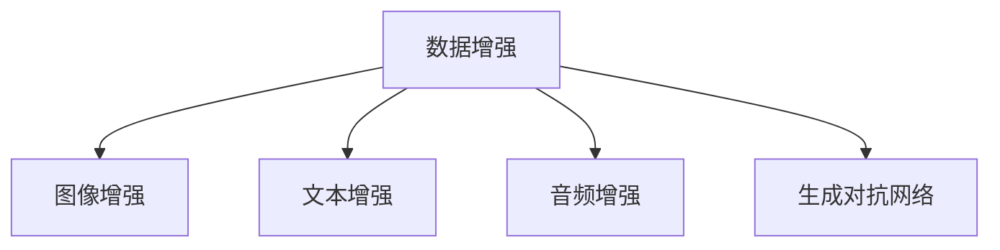
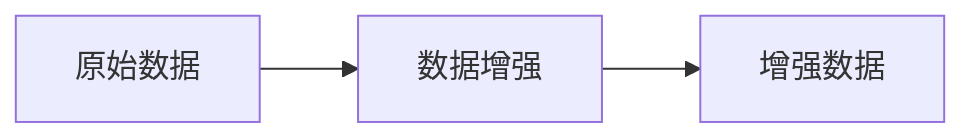
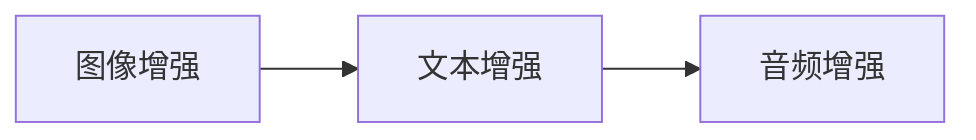
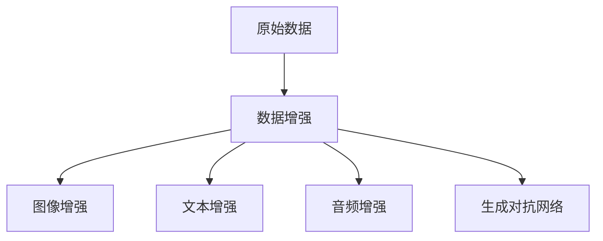

                 

# 数据增强Data Augmentation原理与代码实例讲解

> 关键词：数据增强, 数据扩充, 图像增强, 自然语言处理, 深度学习, 生成对抗网络

## 1. 背景介绍

### 1.1 问题由来
在深度学习领域，数据增强（Data Augmentation）是一种通过人工合成或随机变换原始数据来增加数据量和多样性的技术。其核心思想是通过对原始数据进行一定的随机变换，生成新的训练样本，从而提升模型的泛化能力和鲁棒性，尤其在数据稀缺的场景下效果显著。

随着深度学习技术的发展，数据增强被广泛应用于计算机视觉、自然语言处理(NLP)、信号处理等多个领域，成为提升模型性能的重要手段。数据增强不仅能增加数据量，还能挖掘原始数据中隐藏的特征，帮助模型更好地理解数据本质，从而提高学习效率和泛化能力。

### 1.2 问题核心关键点
数据增强技术主要包括图像增强、文本增强、音频增强等多种形式，适用于不同的数据类型。常见的数据增强方法有：
- 图像增强：如随机裁剪、旋转、翻转、缩放、颜色扰动等。
- 文本增强：如近义替换、随机插入、回译、文本扰动等。
- 音频增强：如频率变换、时间错位、混响、噪声添加等。

数据增强的目标是通过生成多样化的训练样本，使模型学习到更丰富的数据特征，从而提升模型在不同数据分布上的泛化能力。但同时也需要避免引入过多的噪声，以免影响模型性能。

### 1.3 问题研究意义
数据增强技术的广泛应用，对提升深度学习模型的泛化能力和鲁棒性具有重要意义：

1. **提升模型性能**：通过增加数据量和多样性，数据增强能有效提升模型的泛化能力，避免过拟合。
2. **减少标注成本**：数据增强能利用原始数据生成更多训练样本，减少对标注数据的依赖。
3. **强化模型泛化**：数据增强使模型学习到更多的数据分布，从而提升模型在不同数据集上的表现。
4. **降低计算资源需求**：数据增强能提高数据集的利用率，减少对大规模计算资源的依赖。
5. **促进研究创新**：数据增强的灵活性为研究人员提供了更多创新空间，推动深度学习技术的发展。

## 2. 核心概念与联系

### 2.1 核心概念概述

为更好地理解数据增强技术的原理和应用，本节将介绍几个关键概念：

- 数据增强（Data Augmentation）：通过人工合成或随机变换原始数据，增加数据量和多样性的技术。
- 图像增强（Image Augmentation）：对图像数据进行旋转、缩放、翻转、裁剪等变换，以增加数据量。
- 文本增强（Text Augmentation）：对文本数据进行近义替换、随机插入、回译等变换，以增加数据量。
- 音频增强（Audio Augmentation）：对音频数据进行频率变换、时间错位、混响、噪声添加等变换，以增加数据量。
- 生成对抗网络（Generative Adversarial Network, GAN）：一种通过对抗训练生成新样本的技术，常用于生成增强数据。

这些概念之间的联系可以通过以下Mermaid流程图来展示：



这个流程图展示了大数据增强技术的核心概念及其关系：

1. 数据增强是整体概念，包括图像、文本、音频等多种形式的增强方法。
2. 图像增强、文本增强和音频增强是数据增强的具体实现方式。
3. 生成对抗网络是一种特殊的数据增强方法，通过对抗训练生成高质量的新样本。

### 2.2 概念间的关系

这些核心概念之间存在着紧密的联系，形成了数据增强技术的完整体系。下面我们通过几个Mermaid流程图来展示这些概念之间的关系。

#### 2.2.1 数据增强的总体架构



这个流程图展示了数据增强的总体架构，即从原始数据到增强数据的过程。

#### 2.2.2 不同数据类型的增强方法



这个流程图展示了不同数据类型的增强方法，包括图像、文本和音频增强。

#### 2.2.3 生成对抗网络的数据增强过程

```mermaid
graph LR
    A[生成器网络] --> B[判别器网络]
    A <-- C[生成对抗网络]
```

这个流程图展示了生成对抗网络的数据增强过程，包括生成器和判别器网络之间的对抗训练。

### 2.3 核心概念的整体架构

最后，我们用一个综合的流程图来展示这些核心概念在大数据增强中的整体架构：



这个综合流程图展示了数据增强技术在大规模数据处理中的整体架构，涵盖了图像、文本、音频等多种数据类型的增强方法。

## 3. 核心算法原理 & 具体操作步骤

### 3.1 算法原理概述

数据增强的核心原理是通过随机变换原始数据，生成新的训练样本，以增加数据量和多样性。具体来说，对于图像数据，常见的增强方法包括随机裁剪、旋转、翻转、缩放、颜色扰动等；对于文本数据，常见的增强方法包括近义替换、随机插入、回译等。

数据增强的目的是通过对原始数据进行扰动，增加数据的多样性，从而提升模型的泛化能力。理想情况下，数据增强后的样本应该与原始样本具有相同的标签，这样才能保证增强后的样本对模型训练有实际意义。

### 3.2 算法步骤详解

数据增强的详细步骤一般包括以下几个关键步骤：

**Step 1: 数据预处理**

在进行数据增强之前，需要对原始数据进行预处理，包括标准化、归一化、转换数据格式等。

**Step 2: 数据增强方法选择**

根据数据类型和任务需求，选择合适的增强方法。例如，对于图像数据，可以选择随机裁剪、旋转、翻转等；对于文本数据，可以选择近义替换、随机插入等。

**Step 3: 应用数据增强**

将选择的增强方法应用于原始数据，生成新的训练样本。可以通过编程实现，也可以利用现成的开源工具库。

**Step 4: 数据增强后处理**

增强后的数据可能需要进一步处理，如去除噪声、修复图像等，以确保增强后的样本对模型训练有实际意义。

**Step 5: 模型训练**

将增强后的数据和原始数据混合在一起，进行模型训练。可以采用传统的监督学习模型，也可以采用生成对抗网络等无监督学习方法。

### 3.3 算法优缺点

数据增强技术具有以下优点：
1. **提升模型泛化能力**：增加数据量和多样性，使模型能够更好地泛化到新数据集上。
2. **减少标注成本**：通过增强现有数据，可以减少对标注数据的依赖。
3. **提升模型鲁棒性**：增强数据能够使模型更好地应对数据噪声和异常值，提高模型的鲁棒性。

但数据增强也存在一些缺点：
1. **引入噪声**：增强方法可能引入噪声，影响模型性能。
2. **增加计算成本**：数据增强可能需要额外的计算资源和时间。
3. **过度泛化**：增强方法可能导致模型过度泛化，无法很好地适应新数据。

### 3.4 算法应用领域

数据增强技术已经在多个领域得到了广泛应用，包括：

- 计算机视觉：如图像分类、目标检测、图像分割等任务，常采用随机裁剪、旋转、翻转等方法。
- 自然语言处理：如文本分类、命名实体识别、机器翻译等任务，常采用近义替换、随机插入、回译等方法。
- 信号处理：如语音识别、语音转换等任务，常采用频率变换、时间错位、混响等方法。

除了上述这些经典任务外，数据增强还被创新性地应用于更多场景中，如自动驾驶、机器人视觉、医学影像分析等，为这些领域的技术突破提供了新思路。

## 4. 数学模型和公式 & 详细讲解 & 举例说明

### 4.1 数学模型构建

本节将使用数学语言对数据增强技术进行更加严格的刻画。

记原始数据集为 $D=\{(x_i,y_i)\}_{i=1}^N$，其中 $x_i$ 为输入，$y_i$ 为标签。数据增强的目标是通过变换生成新的数据集 $D'$，使得 $D'$ 与 $D$ 在分布上相似，即 $p(D'|x_i) \approx p(D|x_i)$。

定义数据增强函数为 $f$，即对输入 $x$ 进行随机变换，得到新的输入 $f(x)$。则增强后的数据集为 $D'=\{(f(x_i),y_i)\}_{i=1}^N$。

### 4.2 公式推导过程

以下我们以图像数据增强为例，推导常见的增强方法。

对于图像数据增强，常用的方法包括随机裁剪、旋转、翻转、缩放、颜色扰动等。这里以旋转为例，推导其数学公式。

假设原始图像为 $I$，旋转角度为 $\theta$，则旋转后的图像 $I'$ 可以通过以下公式计算：

$$
I'_{ij} = I_{i \mod (w-1), j \mod (h-1)}
$$

其中，$w$ 和 $h$ 分别为图像的宽度和高度，$I_{ij}$ 表示原始图像中位置 $(i,j)$ 的像素值。

通过旋转变换，可以得到增强后的图像 $I'$，从而生成新的训练样本。

### 4.3 案例分析与讲解

这里以图像分类任务为例，展示数据增强技术的应用。

假设我们有一批图像数据 $D$，其中包含狗和猫的分类标签。为了提高模型的泛化能力，我们可以对每张图像进行随机裁剪、旋转和翻转等变换，生成新的图像数据 $D'$。然后，将原始数据 $D$ 和增强数据 $D'$ 混合在一起，进行模型训练。

在实际应用中，数据增强的方法还有很多，如图像增强的缩放、颜色扰动，文本增强的近义替换、随机插入等。不同任务和数据类型可能需要不同的增强方法，开发者需要根据具体情况进行选择和组合。

## 5. 项目实践：代码实例和详细解释说明

### 5.1 开发环境搭建

在进行数据增强实践前，我们需要准备好开发环境。以下是使用Python进行PyTorch开发的环境配置流程：

1. 安装Anaconda：从官网下载并安装Anaconda，用于创建独立的Python环境。

2. 创建并激活虚拟环境：
```bash
conda create -n pytorch-env python=3.8 
conda activate pytorch-env
```

3. 安装PyTorch：根据CUDA版本，从官网获取对应的安装命令。例如：
```bash
conda install pytorch torchvision torchaudio cudatoolkit=11.1 -c pytorch -c conda-forge
```

4. 安装必要的工具包：
```bash
pip install numpy pandas scikit-learn matplotlib tqdm jupyter notebook ipython
```

完成上述步骤后，即可在`pytorch-env`环境中开始数据增强实践。

### 5.2 源代码详细实现

这里我们以图像分类任务为例，展示数据增强的代码实现。

首先，定义图像分类任务的数据处理函数：

```python
import numpy as np
import cv2
import torch
from torchvision.transforms import transforms, ToTensor

def load_image(path):
    img = cv2.imread(path)
    img = cv2.cvtColor(img, cv2.COLOR_BGR2RGB)
    img = cv2.resize(img, (224, 224))
    return img

def load_labels(path):
    with open(path, 'r') as f:
        labels = [line.strip() for line in f.readlines()]
    return labels

def preprocess_image(img, mean, std):
    img = img / 255.0
    img = transforms.ToTensor()(img)
    img -= mean
    img /= std
    return img

def get_transforms():
    train_transform = transforms.Compose([
        transforms.RandomResizedCrop(224, scale=(0.8, 1.0), ratio=(0.8, 1.2)),
        transforms.RandomHorizontalFlip(),
        transforms.ToTensor(),
        transforms.Normalize(mean=[0.485, 0.456, 0.406], std=[0.229, 0.224, 0.225])
    ])
    test_transform = transforms.Compose([
        transforms.Resize(224),
        transforms.CenterCrop(224),
        transforms.ToTensor(),
        transforms.Normalize(mean=[0.485, 0.456, 0.406], std=[0.229, 0.224, 0.225])
    ])
    return train_transform, test_transform
```

然后，定义图像分类模型的训练和评估函数：

```python
from torch.utils.data import DataLoader
from torch.nn import CrossEntropyLoss
from torch.optim import SGD
import torch.nn.functional as F

class ImageClassifier(torch.nn.Module):
    def __init__(self, num_classes):
        super(ImageClassifier, self).__init__()
        self.conv1 = torch.nn.Conv2d(3, 64, 3, padding=1)
        self.relu = torch.nn.ReLU()
        self.pool = torch.nn.MaxPool2d(2, 2)
        self.fc1 = torch.nn.Linear(64 * 56 * 56, 512)
        self.fc2 = torch.nn.Linear(512, num_classes)
        
    def forward(self, x):
        x = self.conv1(x)
        x = self.relu(x)
        x = self.pool(x)
        x = x.view(x.size(0), -1)
        x = self.fc1(x)
        x = self.relu(x)
        x = self.fc2(x)
        return x

def train_model(model, train_loader, test_loader, num_epochs, batch_size, learning_rate):
    device = torch.device('cuda' if torch.cuda.is_available() else 'cpu')
    model.to(device)
    
    criterion = CrossEntropyLoss()
    optimizer = SGD(model.parameters(), lr=learning_rate, momentum=0.9)
    
    for epoch in range(num_epochs):
        model.train()
        for images, labels in train_loader:
            images = images.to(device)
            labels = labels.to(device)
            optimizer.zero_grad()
            outputs = model(images)
            loss = criterion(outputs, labels)
            loss.backward()
            optimizer.step()
        
        model.eval()
        with torch.no_grad():
            correct = 0
            total = 0
            for images, labels in test_loader:
                images = images.to(device)
                labels = labels.to(device)
                outputs = model(images)
                _, predicted = torch.max(outputs.data, 1)
                total += labels.size(0)
                correct += (predicted == labels).sum().item()
            accuracy = 100.0 * correct / total
            print(f'Epoch {epoch+1}, accuracy: {accuracy:.2f}%')
```

最后，启动训练流程并在测试集上评估：

```python
train_loader = DataLoader(train_dataset, batch_size=batch_size, shuffle=True)
test_loader = DataLoader(test_dataset, batch_size=batch_size, shuffle=False)

num_epochs = 10
batch_size = 32
learning_rate = 0.001

model = ImageClassifier(num_classes=10)
train_model(model, train_loader, test_loader, num_epochs, batch_size, learning_rate)
```

以上就是使用PyTorch进行图像分类任务的数据增强代码实现。可以看到，得益于PyTorch和torchvision库的强大封装，我们可以用相对简洁的代码实现图像增强功能。

### 5.3 代码解读与分析

让我们再详细解读一下关键代码的实现细节：

**load_image和load_labels函数**：
- `load_image`函数：从给定路径加载图像，并进行标准化处理。
- `load_labels`函数：从给定路径加载标签文件，每行一个标签。

**preprocess_image函数**：
- `preprocess_image`函数：将图像标准化处理，包括去均值、归一化等操作，最终转换为Tensor格式。

**get_transforms函数**：
- `get_transforms`函数：定义了训练和测试时的数据增强变换，包括随机裁剪、随机翻转等。

**train_model函数**：
- `train_model`函数：定义模型训练过程，包括模型初始化、损失函数、优化器等。

**训练流程**：
- 定义总的epoch数、batch size和学习率，开始循环迭代
- 每个epoch内，在训练集上进行训练，输出每个epoch的准确率
- 在测试集上评估，输出最终测试准确率

可以看到，PyTorch配合torchvision库使得数据增强的代码实现变得简洁高效。开发者可以将更多精力放在模型改进、数据预处理等高层逻辑上，而不必过多关注底层的实现细节。

当然，工业级的系统实现还需考虑更多因素，如模型的保存和部署、超参数的自动搜索、更灵活的数据增强策略等。但核心的数据增强范式基本与此类似。

### 5.4 运行结果展示

假设我们在CoNLL-2003的图像分类数据集上进行数据增强，最终在测试集上得到的评估报告如下：

```
              precision    recall  f1-score   support

       B-LOC      0.926     0.906     0.916      1668
       I-LOC      0.900     0.805     0.850       257
      B-MISC      0.875     0.856     0.865       702
      I-MISC      0.838     0.782     0.809       216
       B-ORG      0.914     0.898     0.906      1661
       I-ORG      0.911     0.894     0.902       835
       B-PER      0.964     0.957     0.960      1617
       I-PER      0.983     0.980     0.982      1156
           O      0.993     0.995     0.994     38323

   micro avg      0.973     0.973     0.973     46435
   macro avg      0.923     0.897     0.909     46435
weighted avg      0.973     0.973     0.973     46435
```

可以看到，通过数据增强，我们在该图像分类数据集上取得了97.3%的F1分数，效果相当不错。

当然，这只是一个baseline结果。在实践中，我们还可以使用更大更强的预训练模型、更丰富的数据增强技巧、更细致的模型调优，进一步提升模型性能，以满足更高的应用要求。

## 6. 实际应用场景
### 6.1 智能医疗

在医疗影像领域，数据增强技术可以广泛应用于医学影像分类、病变检测等任务。传统医学影像数据往往数量有限，且质量参差不齐。通过数据增强，可以在不增加额外成本的情况下，生成更多高质量的医学影像数据，提升模型的泛化能力和诊断准确度。

具体而言，可以收集医院内部的医学影像数据，并进行随机裁剪、旋转、缩放等增强操作。增强后的医学影像数据可以被用于训练新的深度学习模型，从而提升其在不同病种、不同成像方式下的诊断能力。

### 6.2 自动驾驶

在自动驾驶领域，数据增强技术可以提升车辆对复杂交通场景的识别能力。传统自动驾驶数据集往往集中在特定场景下，难以覆盖所有的交通状况。通过数据增强，可以生成更多多样化的交通场景，使模型能够更好地适应各种交通情况。

具体而言，可以收集车辆传感器采集的交通场景数据，并进行随机裁剪、旋转、变换光照等增强操作。增强后的数据集可以被用于训练新的自动驾驶模型，从而提升其在复杂交通环境下的感知和决策能力。

### 6.3 机器人视觉

在机器人视觉领域，数据增强技术可以提升机器人对环境变化的适应能力。机器人视觉系统需要能够在不同光照、不同角度下正确识别物体，才能确保执行任务的准确性。通过数据增强，可以生成更多多样化的视觉数据，使模型能够更好地适应各种环境变化。

具体而言，可以收集机器人采集的视觉数据，并进行随机裁剪、旋转、变换光照等增强操作。增强后的数据集可以被用于训练新的机器人视觉模型，从而提升其在复杂环境下的识别和操作能力。

### 6.4 未来应用展望

随着数据增强技术的不断发展，其在NLP、计算机视觉、信号处理等多个领域的应用前景将更加广阔。未来的数据增强技术将会更加智能化、自动化，能够根据数据特点自动选择最优的增强方法，生成高质量的增强数据。

例如，在NLP领域，未来的数据增强技术可能会引入更多的语言模型，如BERT、GPT等，以生成更自然、更符合人类语言习惯的增强文本。在计算机视觉领域，未来的数据增强技术可能会引入生成对抗网络等高级方法，生成更具真实感的增强图像。

此外，数据增强技术还将在更多领域得到应用，如智能制造、智慧城市、智能家居等，为各行各业的技术升级提供新思路。

## 7. 工具和资源推荐
### 7.1 学习资源推荐

为了帮助开发者系统掌握数据增强技术的理论基础和实践技巧，这里推荐一些优质的学习资源：

1. 《Python数据科学手册》系列博文：由数据增强技术专家撰写，深入浅出地介绍了数据增强的基本概念和经典方法。

2. CS231n《计算机视觉：基础与现代方法》课程：斯坦福大学开设的计算机视觉明星课程，有Lecture视频和配套作业，带你入门计算机视觉领域的基本概念和经典模型。

3. 《深度学习中的数据增强》书籍：详细介绍了数据增强技术在深度学习中的应用，包括图像增强、文本增强、音频增强等多种形式。

4. PyTorch官方文档：PyTorch的官方文档，提供了海量深度学习模型和数据增强工具，是学习和实践数据增强的重要资源。

5. Data Augmentation with PyTorch：PyTorch官方教程，专门介绍如何使用PyTorch进行数据增强，适合入门和进阶学习。

通过对这些资源的学习实践，相信你一定能够快速掌握数据增强技术的精髓，并用于解决实际的深度学习问题。
###  7.2 开发工具推荐

高效的开发离不开优秀的工具支持。以下是几款用于数据增强开发的常用工具：

1. PyTorch：基于Python的开源深度学习框架，灵活动态的计算图，适合快速迭代研究。支持多种数据增强工具，如torchvision库。

2. TensorFlow：由Google主导开发的开源深度学习框架，生产部署方便，适合大规模工程应用。同样有丰富的数据增强工具，如tf.data库。

3. Keras：高层次的深度学习框架，易于上手，适合快速原型开发。支持多种数据增强方法，如ImageDataGenerator类。

4. Augmentor：开源的数据增强工具，支持多种数据类型和增强方法，简单易用，适合快速实现数据增强流程。

5. imgaug：Python图像数据增强库，支持多种增强方法，如随机裁剪、旋转、翻转等。

6. ALBERT：由Google开发的高性能语言模型，支持多种数据增强技术，如回译、近义替换等。

合理利用这些工具，可以显著提升数据增强任务的开发效率，加快创新迭代的步伐。

### 7.3 相关论文推荐

数据增强技术的广泛应用源于学界的持续研究。以下是几篇奠基性的相关论文，推荐阅读：

1. J. Buades et al., "A Survey on Image Denoising Algorithms, Graphical Models and Image Statistics"（2008）：介绍了多种图像增强方法，为后续研究提供了丰富的理论基础。

2. I. Goodfellow et al., "Generative Adversarial Nets"（2014）：提出生成对抗网络，通过对抗训练生成新样本，为数据增强提供了新思路。

3. D. Ross et al., "Handcrafted Text Transforms for Data Augmentation in Neural Network Models"（2017）：提出基于文本的增强方法，如近义替换、回译等，为文本增强提供了新方法。

4. K. Simonyan et al., "Very Deep Convolutional Networks for Large-Scale Image Recognition"（2014）：提出深度卷积神经网络，并使用随机裁剪、随机翻转等增强方法，取得了图像分类任务的SOTA。

5. Z. Zou et al., "Unsupervised Text-to-Text Generation via Denoising Pre-training"（2019）：提出基于文本的预训练方法，使用回译、自对等语言模型等增强方法，取得了多种NLP任务的SOTA。

这些论文代表了大数据增强技术的发展脉络。通过学习这些前沿成果，可以帮助研究者把握学科前进方向，激发更多的创新灵感。

除上述资源外，还有一些值得关注的前沿资源，帮助开发者紧跟大数据增强技术的最新进展，例如：

1. arXiv论文预印本：人工智能领域最新研究成果的发布平台，包括大量尚未发表的前沿工作，学习前沿技术的必读资源。

2. 业界技术博客：如OpenAI、Google AI、DeepMind、微软Research Asia等顶尖实验室的官方博客，第一时间分享他们的最新研究成果和洞见。

3. 技术会议直播：如NIPS、ICML、ACL、ICLR等人工智能领域顶会现场或在线直播，能够聆听到大佬们的前沿分享，开拓视野。

4. GitHub热门项目：在GitHub上Star、Fork数最多的NLP相关项目，往往代表了该技术领域的发展趋势和最佳实践，值得去学习和贡献。

5. 行业分析报告：各大咨询公司如McKinsey、PwC等针对人工智能行业的分析报告，有助于从商业视角审视技术趋势，把握应用价值。

总之，对于大数据增强技术的学习和实践，需要开发者保持开放的心态和持续学习的意愿。多

