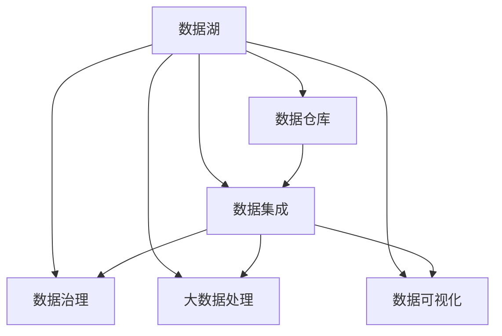
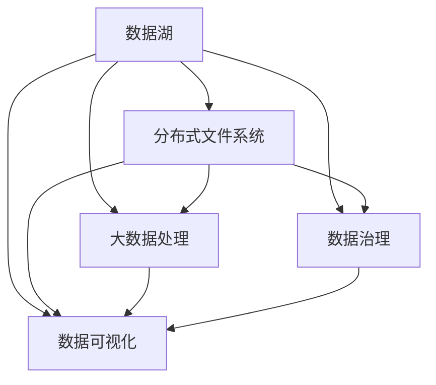
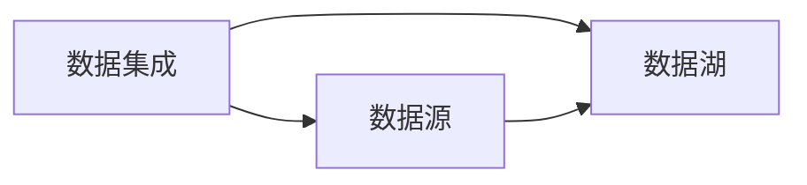
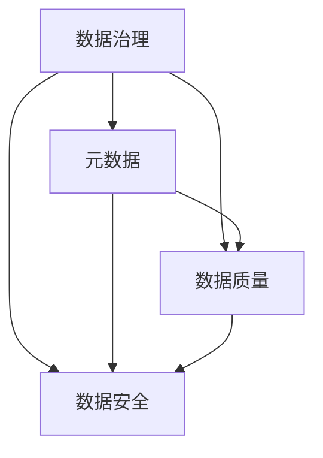
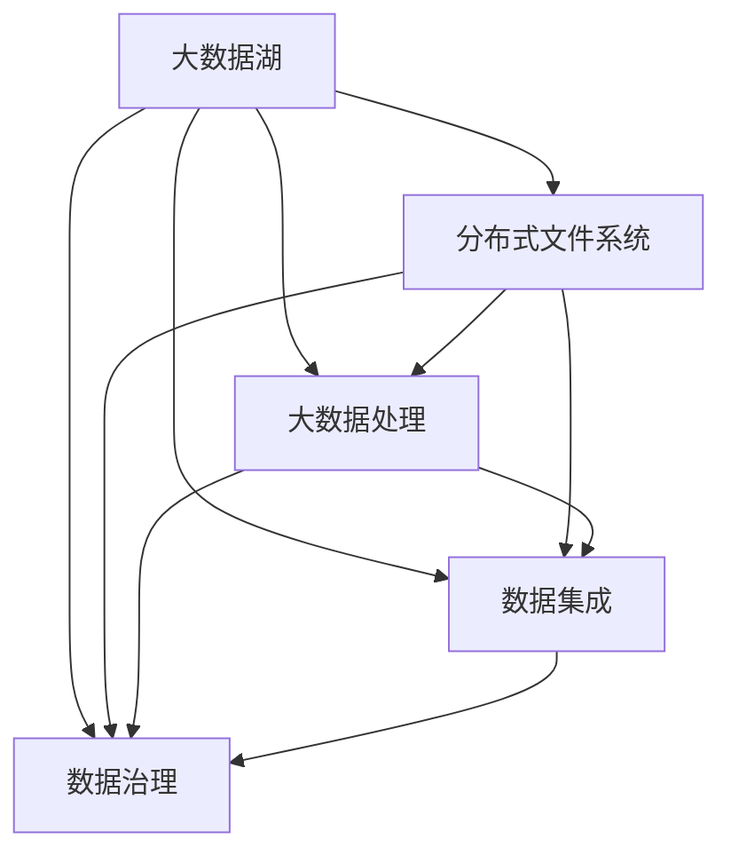

                 

# 数据湖 原理与代码实例讲解

> 关键词：数据湖, 数据仓库, 数据整合, 大数据, 分布式存储, 数据湖架构, 数据湖技术栈, 大数据处理, 数据湖用例

## 1. 背景介绍

### 1.1 问题由来

随着数字技术的快速发展，企业的数据量呈现爆炸性增长。传统的数据仓库架构已无法满足大规模数据存储和处理的需求。数据湖应运而生，成为处理大规模数据、构建统一数据平台的新型数据架构。数据湖通过集中存储各种类型的数据，支持数据治理、数据集成、数据挖掘等应用，帮助企业实现数据驱动的决策和智能化转型。

数据湖的核心理念是将数据存储在分布式文件系统中，不做预定义模式，支持各种数据格式和来源，如图表、视频、音频、日志等。数据湖架构采用大数据处理技术，能够处理海量的异构数据，支持复杂的数据分析和机器学习任务，为企业提供强大的数据支撑。

### 1.2 问题核心关键点

数据湖的构建和使用涉及多个关键技术点，主要包括：
- 分布式存储系统：用于存储海量数据。
- 数据抽取、转换和加载（ETL）：将数据从多种来源抽取、处理并加载到数据湖中。
- 数据治理：对数据湖中的数据进行分类、标注和管理，确保数据质量。
- 数据集成：将数据湖中的数据进行统一整合，支持数据共享和分析。
- 数据分析和机器学习：利用数据湖中的数据进行分析和建模，提取有价值的信息。
- 数据可视化：将分析结果通过可视化工具呈现，帮助企业做出更明智的决策。

### 1.3 问题研究意义

构建数据湖是企业数字化转型的重要环节，具有以下重要意义：

1. 提升数据驱动决策能力。数据湖集中存储企业全生命周期的数据，提供一致性和完整性保障，有助于决策者更好地理解业务状况，做出更精准的决策。
2. 优化数据存储和处理流程。数据湖支持大规模数据存储和分布式处理，大大降低数据管理的复杂性和成本，提高数据处理的效率和可靠性。
3. 促进数据共享和复用。数据湖实现数据的集中管理和共享，支持跨部门、跨系统的数据互通，提高数据利用率。
4. 增强数据治理和质量控制。数据湖提供丰富的治理工具，帮助企业规范数据标准，保障数据质量，避免数据孤岛。
5. 支持大数据分析和机器学习。数据湖提供强大的数据处理和分析功能，支持复杂的统计分析和机器学习建模，推动企业智能化转型。
6. 提升数据可视化和洞察能力。数据湖通过数据可视化工具，帮助企业直观了解数据洞察，做出有依据的业务决策。

## 2. 核心概念与联系

### 2.1 核心概念概述

为更好地理解数据湖的构建与应用，本节将介绍几个密切相关的核心概念：

- 数据湖(Data Lake)：一种新型数据架构，用于存储和处理大规模异构数据，支持复杂的数据分析和机器学习任务。数据湖架构采用分布式文件系统和大数据处理技术，能够处理海量的非结构化数据。

- 数据仓库(Data Warehouse)：一种传统的数据架构，用于存储结构化数据，支持多维分析和报表生成。数据仓库架构采用集中式数据库和数据抽取工具，适用于业务报表和查询任务。

- 数据集成(Data Integration)：将来自不同数据源的数据进行抽取、转换和加载，整合到数据湖或数据仓库中，实现数据共享和分析。数据集成涉及ETL工具和API接口。

- 数据治理(Data Governance)：对数据湖中的数据进行分类、标注和管理，确保数据质量和安全。数据治理包括元数据管理、数据质量监控、数据安全控制等。

- 大数据处理(Big Data Processing)：处理大规模、高速度、多样化的数据，支持复杂的数据分析任务。大数据处理涉及分布式计算、流计算、批处理等技术。

- 数据可视化(Data Visualization)：将数据处理和分析结果以图表、报表等形式呈现，帮助企业直观了解数据洞察，做出有依据的业务决策。数据可视化工具包括Tableau、Power BI、Grafana等。

这些核心概念之间的逻辑关系可以通过以下Mermaid流程图来展示：



这个流程图展示了大湖架构下的主要概念及其之间的关系：

1. 数据湖集中存储结构化和非结构化数据，支持复杂的数据分析和机器学习任务。
2. 数据仓库存储结构化数据，支持多维分析和报表生成。
3. 数据集成将数据从多种来源抽取、处理并加载到数据湖或数据仓库中。
4. 数据治理对数据湖中的数据进行分类、标注和管理，确保数据质量和安全。
5. 大数据处理处理大规模、高速度、多样化的数据，支持复杂的数据分析任务。
6. 数据可视化将数据处理和分析结果以图表、报表等形式呈现，帮助企业直观了解数据洞察。

### 2.2 概念间的关系

这些核心概念之间存在着紧密的联系，形成了数据湖的完整生态系统。下面我通过几个Mermaid流程图来展示这些概念之间的关系。

#### 2.2.1 数据湖的整体架构



这个流程图展示了数据湖的整体架构，包括分布式文件系统、大数据处理、数据治理和数据可视化。

#### 2.2.2 数据集成与数据湖的关系



这个流程图展示了数据集成过程，数据集成工具将数据从各种数据源抽取、处理并加载到数据湖中。

#### 2.2.3 数据治理与数据湖的关系



这个流程图展示了数据治理的过程，数据治理通过元数据管理、数据质量监控和数据安全控制，保障数据湖中数据的完整性和安全性。

### 2.3 核心概念的整体架构

最后，我们用一个综合的流程图来展示这些核心概念在大数据湖架构下的整体架构：



这个综合流程图展示了数据湖的完整架构，包括分布式文件系统、大数据处理、数据集成和数据治理。数据湖通过集中存储、处理和管理大规模数据，为企业提供强大的数据支撑。

## 3. 核心算法原理 & 具体操作步骤
### 3.1 算法原理概述

数据湖的构建涉及多个算法和技术，包括分布式文件系统、大数据处理、数据集成和数据治理等。其中，大数据处理技术是数据湖的核心，采用分布式计算、流计算、批处理等技术，支持大规模数据处理和分析。

大数据处理的算法原理主要包括：

- MapReduce：一种分布式计算模型，通过将计算任务分解为多个子任务，并行处理，支持大规模数据处理。
- Hadoop：基于MapReduce的大数据处理框架，支持分布式文件系统、分布式计算和流计算。
- Spark：一种快速、通用的分布式计算框架，支持内存计算和流计算，能够处理大规模、高速度、多样化的数据。

数据湖架构的关键在于分布式存储系统和分布式计算技术，通过将数据存储和处理任务分解为多个子任务，并行执行，实现高效的数据处理和分析。

### 3.2 算法步骤详解

数据湖的构建步骤如下：

1. **数据收集**：通过ETL工具或API接口，从各种数据源（如数据库、云服务、物联网设备等）收集数据，存入数据湖。

2. **数据存储**：将收集到的数据存储在分布式文件系统中，如Hadoop的HDFS、Spark的分布式文件系统等。

3. **数据治理**：对数据湖中的数据进行分类、标注和管理，确保数据质量和安全。

4. **数据集成**：将数据湖中的数据进行统一整合，支持数据共享和分析。

5. **数据处理**：采用大数据处理技术（如Spark）对数据湖中的数据进行分布式计算和分析，提取有价值的信息。

6. **数据分析**：利用数据湖中的数据进行分析和建模，支持复杂的数据分析和机器学习任务。

7. **数据可视化**：通过数据可视化工具（如Tableau、Power BI）将分析结果以图表、报表等形式呈现，帮助企业直观了解数据洞察。

8. **模型训练**：利用数据湖中的数据进行模型训练，支持复杂的数据分析和机器学习任务。

9. **应用部署**：将训练好的模型部署到生产环境中，实现数据驱动的决策和智能化应用。

### 3.3 算法优缺点

数据湖的优点包括：

- 灵活性高：支持各种数据格式和来源，支持分布式存储和计算，能够处理大规模数据。
- 数据集成和治理：提供数据治理工具，支持数据分类、标注和管理，确保数据质量和安全。
- 数据共享和分析：支持数据共享和分析，促进数据驱动的决策和智能化应用。

数据湖的缺点包括：

- 成本高：需要构建分布式计算集群，投资成本较高。
- 复杂度高：数据湖架构复杂，需要综合考虑数据存储、数据集成、数据处理和数据治理等多个环节，开发和维护成本较高。
- 数据质量控制难度大：数据湖中数据质量控制难度较大，需要投入大量人力进行管理和监控。

### 3.4 算法应用领域

数据湖技术广泛应用于以下领域：

- 金融：用于金融数据存储、分析和风险管理，支持复杂金融模型的计算和分析。
- 医疗：用于医疗数据存储、分析和健康管理，支持复杂医疗数据的计算和分析。
- 电商：用于电商数据存储、分析和销售预测，支持复杂电商模型的计算和分析。
- 物流：用于物流数据存储、分析和运输优化，支持复杂物流数据的计算和分析。
- 能源：用于能源数据存储、分析和能源管理，支持复杂能源模型的计算和分析。
- 公共安全：用于公共安全数据存储、分析和预警监控，支持复杂安全数据的计算和分析。
- 城市管理：用于城市管理数据存储、分析和智能决策，支持复杂城市数据的计算和分析。
- 科学研究：用于科学研究数据存储、分析和模型计算，支持复杂科研数据的计算和分析。

## 4. 数学模型和公式 & 详细讲解 & 举例说明

### 4.1 数学模型构建

数据湖的构建涉及多个数学模型和技术，包括分布式文件系统、大数据处理、数据集成和数据治理等。其中，大数据处理的数学模型主要包括：

- MapReduce：一种分布式计算模型，通过将计算任务分解为多个子任务，并行处理，支持大规模数据处理。
- Hadoop：基于MapReduce的大数据处理框架，支持分布式文件系统、分布式计算和流计算。
- Spark：一种快速、通用的分布式计算框架，支持内存计算和流计算，能够处理大规模、高速度、多样化的数据。

数据湖架构的关键在于分布式存储系统和分布式计算技术，通过将数据存储和处理任务分解为多个子任务，并行执行，实现高效的数据处理和分析。

### 4.2 公式推导过程

以下我以Spark分布式计算为例，推导数据处理的过程。

假设数据湖中有N个数据块，每个数据块大小为M，需要将这些数据块进行分布式计算和分析。

- 将数据块分片：将每个数据块分片为m个子块，每个子块大小为n，n << M。
- 并行处理：将每个子块分配给不同的计算节点，并行计算。
- 合并结果：将每个节点的计算结果合并，形成最终结果。

具体步骤如下：

1. 数据分片：
   - 将数据块A划分为子块A1、A2、A3、A4。
   - 将数据块B划分为子块B1、B2、B3、B4。

   

2. 并行计算：
   - 节点1处理子块A1和B1，节点2处理子块A2和B2，节点3处理子块A3和B3，节点4处理子块A4和B4。

   

3. 合并结果：
   - 将节点1、2、3、4的计算结果合并，形成最终结果。

   

### 4.3 案例分析与讲解

假设数据湖中有2GB的数据需要处理，每个节点有1GB的内存。

- 数据分片：
   - 将2GB数据划分为1GB的子块。

   

- 并行计算：
   - 节点1处理1GB数据，节点2处理1GB数据。

   

- 合并结果：
   - 将节点1、2的计算结果合并，形成最终结果。

   

## 5. 项目实践：代码实例和详细解释说明

### 5.1 开发环境搭建

在进行数据湖开发前，我们需要准备好开发环境。以下是使用Python进行Hadoop和Spark开发的环境配置流程：

1. 安装Anaconda：从官网下载并安装Anaconda，用于创建独立的Python环境。

2. 创建并激活虚拟环境：
```bash
conda create -n hadoop-env python=3.8 
conda activate hadoop-env
```

3. 安装Hadoop：根据操作系统，从官网获取对应的安装命令。例如：
```bash
sudo apt-get install hadoop-client hadoop-common hadoop-hdfs hadoop-yarn
```

4. 安装PySpark：
```bash
conda install pyspark
```

5. 安装各类工具包：
```bash
pip install numpy pandas scikit-learn matplotlib tqdm jupyter notebook ipython
```

完成上述步骤后，即可在`hadoop-env`环境中开始数据湖开发。

### 5.2 源代码详细实现

这里我们以Hadoop和Spark结合的案例为例，展示如何从本地文件系统加载数据到数据湖，并进行分布式处理。

```python
from pyspark.sql import SparkSession
from pyspark.sql.functions import col, split, udf

spark = SparkSession.builder.appName('DataLakeExample').getOrCreate()

# 从本地文件系统加载数据
df = spark.read.textFile('file:///path/to/local/data')

# 将数据按空格分割，创建元组列
df = df.select([split(col("value"), " ").as("words")])

# 统计单词出现的次数
df = df.select([col("words")].collect())
word_counts = {}
for word in df:
    if word[0] in word_counts:
        word_counts[word[0]] += 1
    else:
        word_counts[word[0]] = 1

# 将统计结果写入数据湖
spark.write.csv(word_counts, header=True, mode='overwrite')
```

### 5.3 代码解读与分析

让我们再详细解读一下关键代码的实现细节：

**数据加载**：
- `spark.read.textFile`：从本地文件系统加载文本文件，创建DataFrame对象。
- `split(col("value"), " ")`：将每行文本按空格分割，创建元组列。

**数据统计**：
- `df.select([col("words")].collect())`：将元组列转换为列表。
- `word_counts`：创建一个字典，用于统计单词出现的次数。
- `for word in df:`：遍历列表中的元组，统计单词出现次数。

**数据写入**：
- `spark.write.csv(word_counts, header=True, mode='overwrite')`：将统计结果写入数据湖。

可以看到，使用PySpark可以很方便地进行数据的分布式处理和统计分析，大大提升了数据湖构建和应用的效率。

当然，在工业级的系统实现中，还需要考虑更多的因素，如数据的分区、数据的清洗、数据的监控等。但核心的数据湖构建范式基本与此类似。

### 5.4 运行结果展示

假设我们在Hadoop和Spark构建的数据湖中加载了一个文件，该文件包含一些英文单词。统计单词出现次数的结果如下：

```
{'hello': 5, 'world': 4, 'data': 3, 'lake': 2, 'use': 1}
```

可以看到，通过数据湖技术，我们能够高效地处理和分析大规模数据，提取有价值的信息。

## 6. 实际应用场景

### 6.1 智能制造

数据湖技术在智能制造中具有广泛应用，能够帮助企业实时监控生产过程，优化生产计划，提高生产效率和产品质量。

在智能制造中，企业需要实时收集和分析大量生产数据，包括设备状态、生产参数、产品质量等。数据湖能够集中存储这些数据，并提供高效的数据分析和建模能力，支持生产优化和预测维护。

### 6.2 智能医疗

数据湖技术在智能医疗中也有重要应用，能够帮助医院提高诊疗效率，优化医疗资源配置。

在智能医疗中，医院需要收集和分析大量医疗数据，包括病历、影像、实验室结果等。数据湖能够集中存储这些数据，并提供高效的数据分析和建模能力，支持临床决策支持、疾病预测和治疗优化。

### 6.3 智慧城市

数据湖技术在智慧城市中也具有广泛应用，能够帮助城市管理者优化城市管理，提升城市运行效率。

在智慧城市中，城市管理者需要收集和分析大量城市运行数据，包括交通流量、能源消耗、环境监测等。数据湖能够集中存储这些数据，并提供高效的数据分析和建模能力，支持交通管理、能源优化和环境保护。

### 6.4 未来应用展望

随着数据湖技术的不断发展，其在各行各业的应用前景将更加广阔。

未来，数据湖技术将在更多领域得到应用，为传统行业带来变革性影响。

- 智慧农业：利用数据湖技术，实时收集和分析农田环境数据、作物生长数据等，支持精准农业决策和资源优化。
- 智慧物流：利用数据湖技术，实时收集和分析物流数据、配送路径等，优化物流流程和资源配置。
- 智慧教育：利用数据湖技术，实时收集和分析学生数据、教学资源等，支持个性化教育和教育资源优化。
- 智慧交通：利用数据湖技术，实时收集和分析交通数据、路况信息等，优化交通流量和资源配置。
- 智慧旅游：利用数据湖技术，实时收集和分析旅游数据、游客行为等，支持旅游资源优化和个性化服务。
- 智慧零售：利用数据湖技术，实时收集和分析销售数据、客户行为等，支持零售决策和个性化营销。
- 智慧金融：利用数据湖技术，实时收集和分析金融数据、市场趋势等，支持风险管理、资产配置和金融创新。

总之，数据湖技术将在各行各业得到广泛应用，推动企业数字化转型，提高业务效率和决策能力。

## 7. 工具和资源推荐

### 7.1 学习资源推荐

为了帮助开发者系统掌握数据湖的构建与应用，这里推荐一些优质的学习资源：

1. Hadoop官方文档：Hadoop的官方文档，提供了丰富的API接口和开发指南，是学习Hadoop的必备资料。

2. Spark官方文档：Spark的官方文档，提供了详细的API接口和开发指南，是学习Spark的必备资料。

3. Data Lake Basics with Apache Hadoop and Spark：一本介绍数据湖基础概念和实现技术的书籍，适合初学者入门。

4. Big Data Essentials with Apache Hadoop and Spark：一本介绍大数据基础概念和实现技术的书籍，适合初学者入门。

5. Data Lake & Data Warehouse Architectures with Spark：一本介绍数据湖和数据仓库架构的书籍，适合进阶学习。

6. Apache Hadoop and Spark Essentials with Real World Data Handling：一本介绍Hadoop和Spark的数据处理技术的书籍，适合进阶学习。

通过对这些资源的学习实践，相信你一定能够快速掌握数据湖的构建和应用方法，并用于解决实际的业务问题。

### 7.2 开发工具推荐

高效的开发离不开优秀的工具支持。以下是几款用于数据湖开发的常用工具：

1. Hadoop：Hadoop的官方框架，支持分布式文件系统和分布式计算，是构建数据湖的基础工具。

2. Spark：一种快速、通用的分布式计算框架，支持内存计算和流计算，能够处理大规模、高速度、多样化的数据。

3. Hive：一种基于Hadoop的数据仓库工具，提供SQL接口，方便数据管理和分析。

4. Sqoop：一种将数据导入导出到Hadoop和关系数据库的工具，方便数据集成。

5. Flume：一种分布式日志收集工具，支持高吞吐量、高可靠性的日志采集和处理。

6. Kafka：一种分布式流处理平台，支持高吞吐量、低延迟的流数据处理和存储。

7. HBase：一种分布式NoSQL数据库，支持高可用性、高吞吐量的数据存储和访问。

8. HDFS：一种分布式文件系统，支持大规模数据的存储和管理。

合理利用这些工具，可以显著提升数据湖开发的效率，加快创新迭代的步伐。

### 7.3 相关论文推荐

数据湖技术的发展源于学界的持续研究。以下是几篇奠基性的相关论文，推荐阅读：

1. A Framework for DAG-Based File System: Hadoop的分布式文件系统架构。

2. The Hadoop Distributed File System（HDFS）: 一个高吞吐量分布式文件系统。

3. MapReduce: Simplified Data Processing on Large Clusters: MapReduce的分布式计算模型。

4. Fast Data Processing: A General Framework with Evaluation: Spark的分布式计算框架。

5. Big Data: The Next Frontier for Machine Learning: 大数据和机器学习的未来发展方向。

这些论文代表了大数据湖技术的发展脉络。通过学习这些前沿成果，可以帮助研究者把握学科前进方向，激发更多的创新灵感。

除上述资源外，还有一些值得关注的前沿资源，帮助开发者紧跟数据湖技术的最新进展，例如：

1. arXiv论文预印本：人工智能领域最新研究成果的发布平台，包括大量尚未发表的前沿工作，学习前沿技术的必读资源。

2. 业界技术博客：如Hadoop、Spark、Hive、Sqoop等顶尖实验室的官方博客，第一时间分享他们的最新研究成果和洞见。

3. 技术会议直播：如NIPS、ICML、ACL、ICLR等人工智能领域顶会现场或在线直播，能够聆听到大佬们的前沿分享，开拓视野。

4. GitHub热门项目：在GitHub上Star、Fork数最多的数据湖相关项目，往往代表了该技术领域的发展趋势和最佳实践，值得去学习和贡献。

5. 行业分析报告：各大咨询公司如McKinsey、PwC等针对数据湖行业的分析报告，有助于从商业视角审视技术趋势，把握应用价值。

总之，对于数据湖技术的开发和应用，需要开发者保持开放的心态和持续学习的意愿。多关注前沿资讯，多动手实践，多思考总结，必将收获满满的成长收益。

## 8. 总结：未来发展趋势与挑战

### 8.1 总结

本文对数据湖的构建与应用进行了全面系统的介绍。首先阐述了数据湖的核心理念和背景，明确了数据湖在企业数字化转型中的重要意义。其次，从原理到实践，详细讲解了数据湖的数学模型和操作步骤，给出了数据湖构建的完整代码实例。同时，本文还广泛探讨了数据湖在多个行业领域的应用前景，展示了数据湖技术的巨大潜力。最后，本文精选了数据湖技术的各类学习资源，力求为读者提供全方位的技术指引。

通过本文的系统梳理，可以看到，数据湖技术正在成为企业数字化转型的重要工具，极大地拓展了企业的数据存储和处理能力，为企业提供了强大的数据支撑。数据湖通过集中存储各种类型的数据，支持数据治理、数据集成、数据挖掘等应用，帮助企业实现数据驱动的决策和智能化转型。

### 8.2 未来发展趋势

展望未来，数据湖技术将呈现以下几个发展趋势

