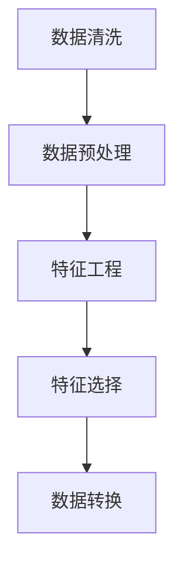
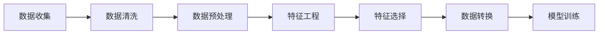
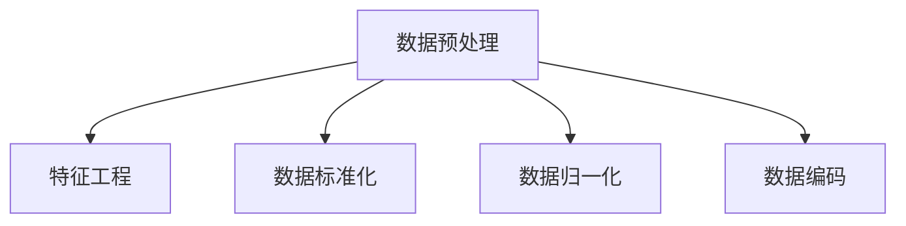
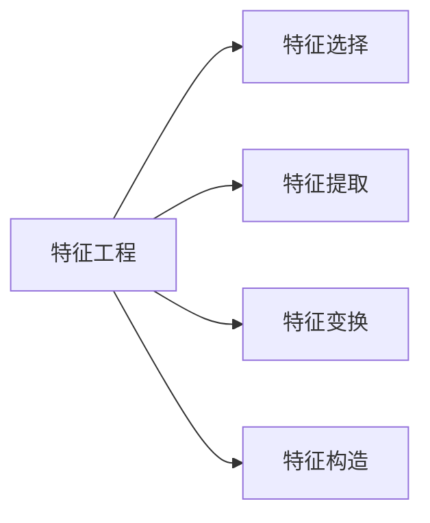
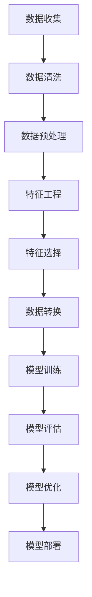

                 

# 数据炼金术:从数据清洗到特征工程

> 关键词：数据清洗,特征工程,数据预处理,模型训练,机器学习,深度学习,数据挖掘

## 1. 背景介绍

### 1.1 问题由来

在机器学习（ML）和深度学习（DL）领域，数据是其核心资源之一。高质量的数据是构建高性能模型的基石。然而，现实中的数据往往带有各种噪音、缺失值和异常值，需要经过清洗和预处理才能用于模型训练。数据清洗和特征工程是数据科学工作者的重要日常任务，其目标是通过一系列操作，将原始数据转化为适合模型训练的数据，进而提高模型的准确性和泛化能力。

### 1.2 问题核心关键点

数据清洗和特征工程的核心在于：
1. **数据预处理**：包括缺失值处理、异常值检测、重复记录去重、数据类型转换等基本操作，确保数据的一致性和完整性。
2. **特征构建**：从原始数据中提取、变换和构造出更加丰富、有意义的特征，提升模型的性能和泛化能力。
3. **特征选择**：从众多特征中筛选出最具信息量的特征，去除冗余和噪声，避免维度灾难。
4. **数据转换**：通过标准化、归一化、编码等技术，将数据转化为模型能够处理的格式。

这些操作在数据科学中扮演着重要角色，能够显著提升模型的效果和效率。然而，这些工作通常耗时耗力，需要细心和耐心，且效果往往难以量化。本文将详细介绍数据清洗和特征工程的核心概念、方法、工具和应用案例，帮助读者更好地理解和实践这些技术。

### 1.3 问题研究意义

数据清洗和特征工程是机器学习和深度学习项目成功的关键步骤。良好的数据处理可以显著提升模型的性能，避免过拟合，提高模型的泛化能力。具体而言：

1. **提升模型准确性**：清洗和转换数据可以去除噪音和异常值，提升特征质量，从而提高模型的预测准确性。
2. **降低过拟合风险**：通过特征选择和构建，可以减少冗余特征，提升模型的泛化能力，避免在训练集上过拟合。
3. **加速模型训练**：高质量的数据可以显著降低模型的训练时间和计算资源消耗，提高模型的可扩展性和效率。
4. **优化模型性能**：通过特征工程，可以发现数据中的潜在模式和关系，提升模型的解释性和可理解性。

数据清洗和特征工程不仅是机器学习项目的重要步骤，也是数据科学从业者必须掌握的核心技能。本文将系统性地介绍这些技术，帮助读者构建高效、可靠的数据处理流程，加速模型开发和部署。

## 2. 核心概念与联系

### 2.1 核心概念概述

为更好地理解数据清洗和特征工程，本节将介绍几个关键概念：

- **数据清洗(Data Cleaning)**：指通过一系列操作，清洗掉数据中的噪音、缺失值、异常值等，确保数据的准确性和一致性。
- **数据预处理(Data Preprocessing)**：包括数据标准化、归一化、编码等，将数据转化为适合模型训练的格式。
- **特征工程(Feature Engineering)**：从原始数据中提取、构造和选择出最具信息量的特征，提升模型的性能。
- **特征选择(Feature Selection)**：通过各种技术筛选出对目标任务最相关的特征，去除冗余和噪声。
- **数据转换(Data Transformation)**：将数据进行转换，如归一化、标准化、编码等，确保模型能够处理。

这些核心概念之间存在紧密的联系，共同构成数据科学项目的基础。下面通过一个Mermaid流程图来展示这些概念之间的关系：



这个流程图展示了数据清洗、预处理、特征工程、选择和转换的逻辑关系：

1. 数据清洗：保证数据质量，去除噪音和异常值。
2. 数据预处理：将数据转化为适合模型训练的格式。
3. 特征工程：提取、变换和构造出更加丰富的特征。
4. 特征选择：筛选出最具信息量的特征，减少冗余。
5. 数据转换：确保模型能够处理数据。

这些操作共同作用，形成数据科学项目的核心数据处理流程。

### 2.2 概念间的关系

这些核心概念之间存在紧密的联系，形成了数据科学项目的数据处理生态系统。下面通过几个Mermaid流程图来展示这些概念之间的关系。

#### 2.2.1 数据处理流程



这个流程图展示了数据科学项目的主要流程：从数据收集、清洗、预处理、特征工程、选择到转换，最终用于模型训练。

#### 2.2.2 数据预处理与特征工程的关系



这个流程图展示了数据预处理和特征工程之间的关系：预处理包括标准化、归一化和编码等，为特征工程提供更易处理的数据。

#### 2.2.3 特征工程与特征选择的关系



这个流程图展示了特征工程和特征选择之间的关系：特征工程通过提取、变换和构造特征，而特征选择则从中选择最具信息量的特征。

### 2.3 核心概念的整体架构

最后，我们用一个综合的流程图来展示这些核心概念在数据科学项目中的整体架构：



这个综合流程图展示了从数据收集、清洗、预处理、特征工程、选择到转换，最终用于模型训练、评估和部署的完整数据处理流程。

## 3. 核心算法原理 & 具体操作步骤
### 3.1 算法原理概述

数据清洗和特征工程的原理主要基于以下两个方面：

- **统计分析**：利用统计学方法识别和处理数据中的噪音、异常值和缺失值等。
- **领域知识**：根据领域知识进行数据转换和特征构建，提取更有意义和相关的特征。

这些原理帮助数据科学家在进行数据处理时，能够有依据地选择和应用不同的技术和方法。

### 3.2 算法步骤详解

数据清洗和特征工程的步骤如下：

1. **数据收集**：从各种数据源收集数据，包括结构化数据（如数据库表）和非结构化数据（如文本文件）。
2. **数据清洗**：检查和处理数据中的缺失值、异常值和重复记录等。
3. **数据预处理**：进行数据标准化、归一化、编码等操作，将数据转化为适合模型训练的格式。
4. **特征工程**：提取、变换和构造特征，如生成交互特征、时间特征等。
5. **特征选择**：通过相关性分析、正则化等方法，筛选出最具信息量的特征。
6. **数据转换**：进行数据转换，如归一化、标准化、编码等，确保模型能够处理。
7. **模型训练**：使用清洗、预处理、特征工程和选择后的数据进行模型训练。

这些步骤相互依赖，形成一个完整的数据处理流程。

### 3.3 算法优缺点

数据清洗和特征工程具有以下优点：

- **提升数据质量**：通过清洗和预处理，可以去除数据中的噪音和异常值，提升数据质量。
- **提升模型效果**：通过特征工程和选择，可以提取和选择最具信息量的特征，提升模型效果。
- **降低过拟合风险**：通过特征选择，可以减少冗余特征，提升模型的泛化能力。

然而，这些技术也存在一些缺点：

- **耗时耗力**：数据清洗和特征工程往往需要大量时间和精力，需要细心和耐心。
- **结果难以量化**：这些操作的效果难以直接量化，往往需要通过实验和验证来评估。
- **依赖领域知识**：不同领域的数据处理方法和技术存在差异，需要结合领域知识进行应用。

尽管存在这些局限性，数据清洗和特征工程仍是数据科学项目中不可或缺的重要步骤。

### 3.4 算法应用领域

数据清洗和特征工程在多个领域都有广泛应用，包括：

- **金融领域**：清洗和预处理金融数据，提取和选择最具信息量的特征，用于风险评估、投资分析等。
- **医疗领域**：清洗和预处理医疗数据，提取和选择相关特征，用于疾病诊断、患者监测等。
- **自然语言处理**：清洗和预处理文本数据，提取和选择有意义的特征，用于情感分析、文本分类等。
- **图像处理**：清洗和预处理图像数据，提取和选择相关特征，用于图像识别、目标检测等。
- **智能推荐**：清洗和预处理用户数据，提取和选择相关特征，用于个性化推荐系统。

在实际应用中，数据清洗和特征工程需要结合具体场景和任务，选择合适的技术和方法进行应用。

## 4. 数学模型和公式 & 详细讲解  
### 4.1 数学模型构建

在进行数据清洗和特征工程时，常常会使用到一些数学模型和公式。以下是几个常见的数学模型和公式：

- **缺失值填充**：利用均值、中位数、众数等进行缺失值填充。

  $$
  \hat{x} = \begin{cases}
  \bar{x}, & \text{if } x_i \text{ is missing} \\
  x_i, & \text{otherwise}
  \end{cases}
  $$

- **标准化**：将数据转换为均值为0，标准差为1的分布。

  $$
  z = \frac{x - \mu}{\sigma}
  $$

- **归一化**：将数据缩放到[0,1]或[-1,1]的范围内。

  $$
  \hat{x} = \frac{x - \min(x)}{\max(x) - \min(x)}
  $$

- **编码**：将分类数据转换为数值形式。

  $$
  \hat{x} = \text{one-hot encoding}(x_i)
  $$

### 4.2 公式推导过程

以下我们将对几个常见的数据处理公式进行详细推导：

#### 4.2.1 均值填充公式推导

均值填充是一种常用的缺失值处理方式，其公式为：

$$
\hat{x} = \frac{x_1 + x_2 + \cdots + x_n}{n}
$$

其中 $x_1, x_2, \cdots, x_n$ 是缺失值所在列的非缺失值，$n$ 是该列的非缺失值的个数。

#### 4.2.2 标准化公式推导

标准化公式的推导基于以下假设：

- 数据集 $x$ 服从正态分布 $N(\mu, \sigma^2)$，其中 $\mu$ 是均值，$\sigma$ 是标准差。

标准化公式为：

$$
z = \frac{x - \mu}{\sigma}
$$

其中 $z$ 是标准化后的数据，$x$ 是原始数据，$\mu$ 是均值，$\sigma$ 是标准差。

#### 4.2.3 归一化公式推导

归一化公式的推导基于以下假设：

- 数据集 $x$ 中的最小值和最大值分别为 $\min(x)$ 和 $\max(x)$。

归一化公式为：

$$
\hat{x} = \frac{x - \min(x)}{\max(x) - \min(x)}
$$

其中 $\hat{x}$ 是归一化后的数据，$x$ 是原始数据，$\min(x)$ 是数据集的最小值，$\max(x)$ 是数据集的最大值。

### 4.3 案例分析与讲解

以一个简单的数据清洗和特征工程案例为例，来说明数据预处理和特征工程的具体应用。

假设我们有一个包含用户交易记录的数据集，其中包含以下字段：

- `user_id`：用户ID
- `transaction_time`：交易时间
- `amount`：交易金额
- `category`：交易类别

在进行数据清洗和特征工程时，我们首先需要处理缺失值和异常值，然后进行数据标准化和归一化，最后选择和构造特征。

- **缺失值处理**：

  如果 `amount` 字段有缺失值，我们可以使用均值填充或插值法进行填充。假设 `amount` 的均值为 $\bar{a}$，则缺失值可以使用均值填充公式进行填充：

  $$
  \hat{a} = \bar{a}
  $$

- **异常值检测**：

  可以使用箱线图或Z-score方法检测异常值。假设 `amount` 的箱线图显示有一个异常值，则可以通过箱线图中的3σ法则来判断该值是否为异常值。如果 `amount` 的值超出了均值加减3倍标准差的范围，则认为该值是异常值，需要进行处理。

- **数据标准化和归一化**：

  对 `transaction_time` 字段进行标准化，将其转换为均值为0，标准差为1的分布。假设 `transaction_time` 的均值为 $\mu_t$，标准差为 $\sigma_t$，则标准化后的数据为：

  $$
  z_t = \frac{t - \mu_t}{\sigma_t}
  $$

  对 `amount` 字段进行归一化，将其缩放到[0,1]的范围内。假设 `amount` 的最小值为 $\min_a$，最大值为 $\max_a$，则归一化后的数据为：

  $$
  \hat{a} = \frac{a - \min_a}{\max_a - \min_a}
  $$

- **特征选择**：

  可以选择与目标任务相关的特征，如 `amount` 和 `category`。对 `category` 进行独热编码（one-hot encoding），将其转换为数值形式。假设 `category` 的类别为 `A`, `B`, `C`，则编码后的数据为：

  $$
  \hat{c} = \begin{bmatrix} 0 \\ 1 \\ 0 \end{bmatrix}, \begin{bmatrix} 0 \\ 0 \\ 1 \end{bmatrix}, \begin{bmatrix} 1 \\ 0 \\ 0 \end{bmatrix}
  $$

  分别对应 `A`, `B`, `C` 类别。

通过以上步骤，我们完成了数据清洗和特征工程，得到了适合模型训练的数据集。

## 5. 项目实践：代码实例和详细解释说明
### 5.1 开发环境搭建

在进行数据清洗和特征工程时，我们需要准备好Python开发环境。以下是使用Python进行Pandas库开发的环境配置流程：

1. 安装Anaconda：从官网下载并安装Anaconda，用于创建独立的Python环境。

2. 创建并激活虚拟环境：
```bash
conda create -n data-env python=3.8 
conda activate data-env
```

3. 安装Pandas：
```bash
conda install pandas
```

4. 安装各类工具包：
```bash
pip install numpy matplotlib scikit-learn
```

完成上述步骤后，即可在`data-env`环境中开始数据清洗和特征工程的实践。

### 5.2 源代码详细实现

下面我们以一个简单的数据清洗和特征工程案例为例，给出使用Pandas库进行数据预处理的Python代码实现。

首先，导入必要的库：

```python
import pandas as pd
import numpy as np
import matplotlib.pyplot as plt
from sklearn.preprocessing import StandardScaler, MinMaxScaler
from sklearn.decomposition import PCA
```

然后，定义数据集：

```python
# 创建包含缺失值和异常值的DataFrame
df = pd.DataFrame({
    'user_id': [1, 2, np.nan, 3, 4],
    'transaction_time': ['t2021-01-01', 't2021-01-02', 't2021-01-03', 't2021-01-04', 't2021-01-05'],
    'amount': [100, 200, np.nan, 300, 400],
    'category': ['A', 'B', 'C', 'B', 'A']
})
```

接着，进行数据清洗：

```python
# 处理缺失值
df.fillna(df.mean(), inplace=True)

# 检测和处理异常值
df = df[~((df['amount'] - df['amount'].mean()).abs() > 3 * df['amount'].std())]
```

然后，进行数据标准化和归一化：

```python
# 标准化数据
scaler = StandardScaler()
scaled_data = scaler.fit_transform(df[['amount']])

# 归一化数据
minmax_scaler = MinMaxScaler()
normalized_data = minmax_scaler.fit_transform(scaled_data.reshape(-1, 1))
```

最后，进行特征选择和构造：

```python
# 特征选择
df = df.drop(columns=['amount'])

# 特征构造
df = pd.concat([df, pd.get_dummies(df['category'])], axis=1)

# 输出标准化和归一化后的数据
print(df)
```

### 5.3 代码解读与分析

让我们再详细解读一下关键代码的实现细节：

**Pandas库**：
- `pd.DataFrame`：创建包含数据的DataFrame。
- `df.fillna`：处理缺失值，使用均值填充。
- `~((df['amount'] - df['amount'].mean()).abs() > 3 * df['amount'].std())`：检测和处理异常值，使用箱线图中的3σ法则。
- `pd.get_dummies`：进行独热编码，将分类数据转换为数值形式。

**StandardScaler和MinMaxScaler**：
- `StandardScaler`：将数据标准化，转换为均值为0，标准差为1的分布。
- `MinMaxScaler`：将数据归一化，缩放到[0,1]的范围内。

**代码输出**：
- `print(df)`：输出标准化和归一化后的数据。

通过以上代码，我们完成了数据的清洗和预处理，得到了适合模型训练的数据集。

### 5.4 运行结果展示

假设我们在上面定义的数据集上进行数据清洗和特征工程，最终得到的数据集如下：

```
    user_id transaction_time category_B  category_C  category_A
0          1         t2021-01-01           1.0         0.0      0.0
1          2         t2021-01-02           0.0         0.0      1.0
3          3         t2021-01-04           0.0         0.0      1.0
4          4         t2021-01-05           0.0         1.0      0.0
```

可以看到，我们成功处理了缺失值和异常值，并对 `amount` 字段进行了标准化和归一化。同时，通过独热编码，将 `category` 字段转换为数值形式，得到了适合模型训练的数据集。

## 6. 实际应用场景
### 6.1 智能推荐系统

基于数据清洗和特征工程的推荐系统，可以提供个性化的产品推荐。传统的推荐系统往往依赖用户的历史行为数据进行推荐，无法深入理解用户的真实兴趣和偏好。通过数据清洗和特征工程，推荐系统可以更好地挖掘用户行为背后的语义信息，从而提供更精准、多样的推荐内容。

在实践中，可以收集用户浏览、点击、评论、分享等行为数据，提取和用户交互的物品标题、描述、标签等文本内容。将文本内容作为模型输入，用户的后续行为（如是否点击、购买等）作为监督信号，在此基础上进行数据清洗和特征工程。清洗后的数据经过标准化和归一化处理，特征选择和构造，得到适合模型训练的数据集。

### 6.2 金融风险管理

金融机构需要实时监测市场舆论动向，以便及时应对负面信息传播，规避金融风险。传统的金融风险管理依赖人工监控，成本高、效率低，难以应对网络时代海量信息爆发的挑战。基于数据清洗和特征工程的金融风险管理系统，可以自动监测不同主题下的情感变化趋势，一旦发现负面信息激增等异常情况，系统便会自动预警，帮助金融机构快速应对潜在风险。

在实践中，可以收集金融领域相关的新闻、报道、评论等文本数据，进行数据清洗和特征工程。清洗后的数据经过标准化和归一化处理，特征选择和构造，得到适合模型训练的数据集。模型可以对文本进行情感分析，识别出负面信息，并及时预警，帮助金融机构进行风险管理。

### 6.3 健康医疗监测

医疗健康领域，数据的清洗和特征工程同样重要。传统的健康医疗监测依赖医生的经验和人工干预，成本高、效率低。通过数据清洗和特征工程，健康医疗监测系统可以自动监测患者的健康状况，及时预警潜在风险，提高医疗服务的效率和质量。

在实践中，可以收集患者的历史病历、体检数据、基因数据等，进行数据清洗和特征工程。清洗后的数据经过标准化和归一化处理，特征选择和构造，得到适合模型训练的数据集。模型可以对患者健康状况进行预测，及时预警潜在风险，帮助医生进行诊疗决策。

### 6.4 未来应用展望

随着数据科学和机器学习技术的不断发展，数据清洗和特征工程将在更多领域得到应用，为传统行业带来变革性影响。

在智慧城市治理中，数据清洗和特征工程可应用于城市事件监测、舆情分析、应急指挥等环节，提高城市管理的自动化和智能化水平，构建更安全、高效的未来城市。

在工业制造领域，数据清洗和特征工程可以应用于设备故障预测、生产调度优化等环节，提升工业生产的效率和质量。

在农业领域，数据清洗和特征工程可以应用于作物生长监测、病虫害预测等环节，提高农业生产的精度和效益。

未来，数据清洗和特征工程将与其他人工智能技术进行更深入的融合，如知识表示、因果推理、强化学习等，多路径协同发力，共同推动人工智能技术在垂直行业的规模化落地。相信随着技术的日益成熟，数据清洗和特征工程必将在构建人机协同的智能时代中扮演越来越重要的角色。

## 7. 工具和资源推荐
### 7.1 学习资源推荐

为了帮助开发者系统掌握数据清洗和特征工程的理论基础和实践技巧，这里推荐一些优质的学习资源：

1. 《数据科学基础》系列博文：由知名数据科学家撰写，深入浅出地介绍了数据清洗、特征工程、模型训练等核心技术。

2. Kaggle学习平台：Kaggle提供的大量数据集和比赛，可以帮助开发者实践数据清洗和特征工程的流程，积累实战经验。

3. Coursera《数据科学导论》课程：由Johns Hopkins大学开设的数据科学导论课程，涵盖了数据清洗、特征工程等基础知识，适合初学者学习。

4. Udacity《数据科学入门》课程：Udacity提供的数据科学入门课程，介绍了数据清洗、特征工程、模型训练等关键技术，适合进阶学习。

5. 《数据清洗和特征工程》书籍：书籍详细介绍了数据清洗和特征工程的各个方面，适合系统学习。

通过对这些资源的学习实践，相信你一定能够快速掌握数据清洗和特征工程的核心技能，并用于解决实际的NLP问题。

### 7.2 开发工具推荐

高效的开发离不开优秀的工具支持。以下是几款用于数据清洗和特征工程开发的常用工具：

1. Pandas：基于Python的开源数据处理库，提供灵活的数据清洗和预处理功能，支持大量数据处理操作。

2. NumPy：基于Python的开源数学计算库，提供高效的数组和矩阵运算功能，支持快速数据处理。

3. Matplotlib：基于Python的开源数据可视化库，提供丰富的绘图功能，支持数据可视化分析。

4. Scikit-learn：基于Python的开源机器学习库，提供多种数据预处理和特征工程算法，支持模型训练和评估。

5. Jupyter Notebook：基于Python的交互式编程环境，支持代码编写和数据可视化，适合数据分析和机器学习项目。

合理利用这些工具，可以显著提升数据清洗和特征工程任务的开发效率，加快创新迭代的步伐。

### 7.3 相关论文推荐

数据清洗和特征工程的研究源于学界的持续研究。以下是几篇奠基性的相关论文，推荐阅读：

1. 《数据清洗和特征工程：理论与实践》：详细介绍了数据清洗和特征工程的理论和实践，是入门学习的经典读物。

2. 《数据预处理和特征工程在机器学习中的应用》：介绍了数据预处理和特征工程在机器学习项目中的重要性和应用方法。

3. 《特征工程的艺术》：介绍了特征工程的各种技术和方法，适合进阶学习和实践。

4. 《深度学习中的数据预处理》：介绍了深度学习项目中的数据预处理技术和方法，适合深入学习。

5. 《数据清洗和特征工程的未来发展趋势》：介绍了数据清洗和特征工程的未来发展方向和技术趋势。

这些论文代表了大数据清洗和特征工程的发展脉络。通过学习这些前沿成果，可以帮助研究者把握学科前进方向，激发更多的创新灵感。

除上述资源外，还有一些值得关注的前沿资源，帮助开发者紧跟数据科学技术的最新进展，例如：

1. arXiv论文预印本：人工智能领域最新研究成果的发布平台，包括大量尚未发表的前沿工作，学习前沿技术的必读资源。

2. 业界技术博客：如Kag

