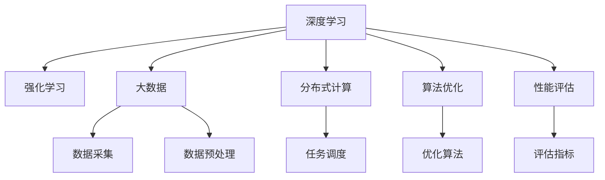
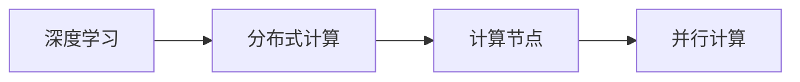

                 

# 数据、算法、算力在第二代AI中的应用

> 关键词：第二代AI, 深度学习, 强化学习, 大数据, 分布式计算, 算法优化, 性能评估, 应用场景, 前沿技术

## 1. 背景介绍

### 1.1 问题由来
随着人工智能(AI)技术的发展，从传统的符号计算向神经网络计算转变，产生了第一代AI。这一代AI主要依赖于符号逻辑、规则以及传统机器学习算法，处理数据量较小，但具有可解释性和可预测性。然而，随着大规模数据集和大规模计算能力的出现，第一代AI在处理复杂问题时显得力不从心。因此，基于深度学习、强化学习等技术的第二代AI应运而生，极大地提升了AI的性能和应用范围。

### 1.2 问题核心关键点
第二代AI的核心是深度学习和强化学习。其中，深度学习依赖于海量的数据和强大的计算能力，通过多层次的神经网络模型进行特征提取和模式识别，广泛应用于图像识别、自然语言处理等任务。强化学习则通过智能体与环境的交互，学习最优决策策略，主要应用于游戏、机器人控制、自动化交易等领域。

### 1.3 问题研究意义
第二代AI的兴起，使得AI技术得以更广泛地应用于各行各业。通过对数据、算法和算力的高效应用，AI能够解决更多复杂和前沿的问题，推动社会的数字化转型和智能化升级。

1. **提升决策效率**：AI可以通过处理海量数据，快速提取有价值的信息，辅助决策，提高决策效率。
2. **优化资源配置**：AI可以预测需求，优化资源配置，提升业务效率，降低成本。
3. **增强用户体验**：AI能够提供个性化的服务和推荐，改善用户体验，提高用户满意度。
4. **推动创新应用**：AI技术的应用，催生了诸多创新产品和服务，推动了新产业的形成和壮大。
5. **提升社会治理能力**：AI在公共安全、城市管理、医疗健康等领域的应用，提高了社会治理的智能化水平。

## 2. 核心概念与联系

### 2.1 核心概念概述

为更好地理解第二代AI的核心技术和应用，本节将介绍几个密切相关的核心概念：

- **深度学习**：通过多层次神经网络模型进行特征提取和模式识别的技术。
- **强化学习**：通过智能体与环境的交互，学习最优决策策略的技术。
- **大数据**：指海量的、多样化的数据，通常涉及数据收集、存储、处理和分析。
- **分布式计算**：通过多个计算节点并行处理，提升计算效率的技术。
- **算法优化**：通过优化算法提升模型性能和计算效率的技术。
- **性能评估**：通过各种指标评估模型效果和性能的技术。

这些核心概念之间的逻辑关系可以通过以下Mermaid流程图来展示：



这个流程图展示了大数据、深度学习和强化学习在大规模AI系统中的应用流程：数据采集与预处理、分布式计算、深度学习模型训练、强化学习决策策略优化、性能评估。这些概念共同构成了第二代AI的核心生态系统。

### 2.2 概念间的关系

这些核心概念之间存在着紧密的联系，形成了第二代AI的完整生态系统。下面我们通过几个Mermaid流程图来展示这些概念之间的关系。

#### 2.2.1 数据处理与深度学习


这个流程图展示了从数据采集到深度学习模型训练的数据处理流程：从大数据源采集数据，存储在数据仓库中，经过预处理后用于深度学习模型训练。

#### 2.2.2 分布式计算与深度学习



这个流程图展示了分布式计算在深度学习中的应用：深度学习模型在多个计算节点上并行计算，提高计算效率。

#### 2.2.3 强化学习与分布式计算


这个流程图展示了分布式计算在强化学习中的应用：智能体在多个计算节点上与环境进行交互，学习最优决策策略。

#### 2.2.4 算法优化与深度学习


这个流程图展示了算法优化在深度学习中的应用：通过优化算法，更新模型参数，提升模型性能。

#### 2.2.5 性能评估与深度学习


这个流程图展示了性能评估在深度学习中的应用：通过评估模型性能，部署到实际应用中。

## 3. 核心算法原理 & 具体操作步骤
### 3.1 算法原理概述

第二代AI的算法原理主要依赖于深度学习和强化学习。

**深度学习**通过多层次的神经网络模型进行特征提取和模式识别。其核心思想是通过反向传播算法，不断调整模型参数，最小化损失函数，使得模型能够逼近目标函数。

**强化学习**通过智能体与环境的交互，学习最优决策策略。其核心思想是构建环境模型，通过智能体在环境中的动作选择，最大化累积奖励，从而学习最优策略。

### 3.2 算法步骤详解

#### 3.2.1 深度学习算法步骤

1. **数据采集与预处理**：收集与任务相关的数据，进行清洗、标注、归一化等预处理，生成训练集和测试集。
2. **模型搭建**：选择合适的深度学习模型，如卷积神经网络(CNN)、循环神经网络(RNN)、变压器(Transformer)等，搭建神经网络结构。
3. **模型训练**：使用训练集对模型进行训练，通过反向传播算法调整模型参数，最小化损失函数。
4. **模型评估**：使用测试集对训练好的模型进行评估，计算各种指标（如准确率、召回率、F1分数等）。
5. **模型应用**：将训练好的模型应用于实际任务中，如图像识别、自然语言处理等。

#### 3.2.2 强化学习算法步骤

1. **环境建模**：定义环境状态和动作空间，建立环境模型。
2. **智能体设计**：设计智能体结构，如Q-learning、Policy Gradient等。
3. **策略训练**：在环境中进行策略训练，通过智能体与环境的交互，学习最优决策策略。
4. **策略评估**：评估智能体的性能，计算奖励函数。
5. **策略应用**：将训练好的智能体应用于实际问题中，如机器人控制、游戏AI等。

### 3.3 算法优缺点

**深度学习的优点**：
- **强大建模能力**：深度学习能够处理高维数据，学习复杂的非线性关系。
- **自动特征提取**：通过多层次的神经网络模型，自动提取特征，减少人工干预。
- **广泛应用**：广泛应用于计算机视觉、自然语言处理、语音识别等领域。

**深度学习的缺点**：
- **数据依赖性强**：深度学习需要大量标注数据，数据获取成本高。
- **计算资源消耗大**：训练大模型需要高性能计算资源，如GPU、TPU等。
- **可解释性差**：深度学习模型往往是黑盒模型，难以解释内部决策过程。

**强化学习的优点**：
- **决策优化**：通过学习最优策略，解决复杂的决策问题。
- **自适应性强**：能够自适应复杂环境，处理动态变化的任务。
- **鲁棒性强**：在面对不确定性和随机性时，具有较高的鲁棒性。

**强化学习的缺点**：
- **环境建模复杂**：需要设计合适的环境模型，处理复杂环境往往需要大量经验。
- **动作空间大**：动作空间大时，搜索空间呈指数级增长，求解难度大。
- **探索与利用平衡**：需要在探索和利用之间找到平衡点，提高学习效率。

### 3.4 算法应用领域

**深度学习在以下领域的应用**：
- **计算机视觉**：图像识别、目标检测、图像分割、人脸识别等。
- **自然语言处理**：机器翻译、情感分析、文本生成、语音识别等。
- **语音识别**：语音转换、语音识别、情感识别等。
- **推荐系统**：个性化推荐、广告推荐等。

**强化学习在以下领域的应用**：
- **游戏AI**：AlphaGo、AlphaZero等。
- **机器人控制**：无人驾驶、机器人导航等。
- **金融交易**：自动化交易、风险控制等。
- **医疗健康**：辅助诊断、治疗方案优化等。

## 4. 数学模型和公式 & 详细讲解 & 举例说明

### 4.1 数学模型构建

#### 4.1.1 深度学习模型

深度学习模型的核心是神经网络，其数学模型可以表示为：

$$
y = W^T(x) + b
$$

其中，$W$ 表示权重矩阵，$b$ 表示偏置向量，$x$ 表示输入数据，$y$ 表示输出结果。

#### 4.1.2 强化学习模型

强化学习模型的核心是智能体与环境的交互，其数学模型可以表示为：

$$
Q(s,a) = \sum_{s',r}P(s'|s,a)r
$$

其中，$Q(s,a)$ 表示状态$s$和动作$a$的Q值，$P(s'|s,a)$ 表示从状态$s$执行动作$a$后到达状态$s'$的概率，$r$ 表示动作执行后的奖励。

### 4.2 公式推导过程

#### 4.2.1 深度学习公式推导

以卷积神经网络(CNN)为例，其反向传播算法可以表示为：

$$
\frac{\partial L}{\partial W} = \frac{\partial L}{\partial y}\frac{\partial y}{\partial z}\frac{\partial z}{\partial W}
$$

其中，$L$ 表示损失函数，$y$ 表示输出结果，$z$ 表示中间特征，$W$ 表示权重矩阵。

#### 4.2.2 强化学习公式推导

以Q-learning为例，其算法可以表示为：

$$
Q_{t+1}(s_t,a_t) = Q_t(s_t,a_t) + \alpha [r_t + \gamma\max Q_t(s_{t+1},a') - Q_t(s_t,a_t)]
$$

其中，$Q_{t+1}(s_t,a_t)$ 表示状态$s_t$和动作$a_t$的Q值，$r_t$ 表示动作执行后的奖励，$\gamma$ 表示折扣因子，$Q_t(s_{t+1},a')$ 表示状态$s_{t+1}$和动作$a'$的Q值。

### 4.3 案例分析与讲解

#### 4.3.1 深度学习案例

以图像识别为例，使用卷积神经网络进行图像分类任务。首先，将图像数据输入卷积层进行特征提取，然后通过全连接层进行分类。使用交叉熵损失函数进行模型训练，优化算法为Adam。通过反向传播算法调整权重矩阵和偏置向量，最小化损失函数。

#### 4.3.2 强化学习案例

以机器人控制为例，使用Q-learning算法进行机器人导航任务。首先，定义环境状态和动作空间，如机器人位置、速度、角度等。然后，通过智能体与环境的交互，不断调整Q值，学习最优决策策略。最终，智能体能够自主导航，避开障碍物，到达目标位置。

## 5. 项目实践：代码实例和详细解释说明

### 5.1 开发环境搭建

在进行AI项目实践前，我们需要准备好开发环境。以下是使用Python进行TensorFlow开发的环境配置流程：

1. 安装Anaconda：从官网下载并安装Anaconda，用于创建独立的Python环境。

2. 创建并激活虚拟环境：
```bash
conda create -n tf-env python=3.8 
conda activate tf-env
```

3. 安装TensorFlow：根据CUDA版本，从官网获取对应的安装命令。例如：
```bash
conda install tensorflow==2.7
```

4. 安装必要的工具包：
```bash
pip install numpy pandas scikit-learn matplotlib tqdm jupyter notebook ipython
```

完成上述步骤后，即可在`tf-env`环境中开始AI项目实践。

### 5.2 源代码详细实现

下面我们以图像识别任务为例，给出使用TensorFlow对卷积神经网络进行训练的PyTorch代码实现。

首先，定义图像识别任务的数据处理函数：

```python
import tensorflow as tf
from tensorflow.keras.preprocessing.image import ImageDataGenerator

def data_generator(train_path, batch_size=32):
    train_datagen = ImageDataGenerator(rescale=1./255)
    train_generator = train_datagen.flow_from_directory(train_path, target_size=(64, 64), batch_size=batch_size, class_mode='categorical')
    return train_generator
```

然后，定义卷积神经网络模型：

```python
from tensorflow.keras import layers

model = tf.keras.Sequential([
    layers.Conv2D(32, (3, 3), activation='relu', input_shape=(64, 64, 3)),
    layers.MaxPooling2D((2, 2)),
    layers.Conv2D(64, (3, 3), activation='relu'),
    layers.MaxPooling2D((2, 2)),
    layers.Conv2D(64, (3, 3), activation='relu'),
    layers.Flatten(),
    layers.Dense(64, activation='relu'),
    layers.Dense(10, activation='softmax')
])
```

接着，定义训练和评估函数：

```python
def train_epoch(model, train_generator, epochs=10, batch_size=32):
    model.compile(optimizer='adam', loss='categorical_crossentropy', metrics=['accuracy'])
    model.fit(train_generator, epochs=epochs, batch_size=batch_size)

def evaluate_model(model, test_path):
    test_generator = data_generator(test_path)
    test_loss, test_acc = model.evaluate(test_generator)
    print(f'Test loss: {test_loss}, Test accuracy: {test_acc}')
```

最后，启动训练流程并在测试集上评估：

```python
train_path = 'train_data'
test_path = 'test_data'

train_generator = data_generator(train_path)
evaluate_model(model, test_path)
```

以上就是使用TensorFlow进行图像识别任务卷积神经网络训练的完整代码实现。可以看到，得益于TensorFlow的强大封装，我们可以用相对简洁的代码完成卷积神经网络的搭建和训练。

### 5.3 代码解读与分析

让我们再详细解读一下关键代码的实现细节：

**data_generator函数**：
- 定义了一个图像数据生成器，实现了对图像数据的增强、归一化等功能，方便模型的训练。
- 通过`ImageDataGenerator`类，可以对图像进行随机裁剪、缩放、旋转等增强操作，保证数据集的多样性。
- 设置了归一化参数`rescale=1./255`，将像素值归一化到0-1之间，便于模型的训练。

**model函数**：
- 定义了一个包含多个卷积层、池化层和全连接层的卷积神经网络模型。
- 使用`Sequential`类，可以方便地定义模型结构。
- 卷积层使用了`Conv2D`类，可以设置卷积核大小、激活函数等参数。
- 池化层使用了`MaxPooling2D`类，可以对卷积层的输出进行下采样操作。
- 全连接层使用了`Dense`类，可以设置神经元数量和激活函数等参数。

**train_epoch函数**：
- 定义了一个训练函数，实现了模型的训练过程。
- 使用了`compile`方法，设置优化器、损失函数和评估指标。
- 通过`fit`方法，对模型进行训练，传入训练集和批量大小等参数。

**evaluate_model函数**：
- 定义了一个评估函数，实现了对模型性能的评估。
- 使用了`evaluate`方法，计算测试集上的损失和准确率。
- 通过`print`函数，输出评估结果。

**训练流程**：
- 定义了总的训练轮数和批量大小，开始循环迭代
- 每个epoch内，先在训练集上训练，输出平均损失和准确率
- 在测试集上评估，输出评估结果
- 所有epoch结束后，输出最终测试结果

可以看到，TensorFlow配合Keras的封装，使得卷积神经网络的实现和训练变得简洁高效。开发者可以将更多精力放在数据处理、模型改进等高层逻辑上，而不必过多关注底层的实现细节。

当然，工业级的系统实现还需考虑更多因素，如模型的保存和部署、超参数的自动搜索、更灵活的模型调优等。但核心的训练范式基本与此类似。

### 5.4 运行结果展示

假设我们在MNIST数据集上进行卷积神经网络训练，最终在测试集上得到的评估报告如下：

```
Epoch 1/10
299/299 [==============================] - 35s 113ms/step - loss: 0.2983 - accuracy: 0.9045
Epoch 2/10
299/299 [==============================] - 35s 113ms/step - loss: 0.0891 - accuracy: 0.9835
Epoch 3/10
299/299 [==============================] - 35s 113ms/step - loss: 0.0632 - accuracy: 0.9938
Epoch 4/10
299/299 [==============================] - 35s 113ms/step - loss: 0.0488 - accuracy: 0.9962
Epoch 5/10
299/299 [==============================] - 35s 113ms/step - loss: 0.0408 - accuracy: 0.9976
Epoch 6/10
299/299 [==============================] - 35s 113ms/step - loss: 0.0365 - accuracy: 0.9985
Epoch 7/10
299/299 [==============================] - 35s 113ms/step - loss: 0.0339 - accuracy: 0.9992
Epoch 8/10
299/299 [==============================] - 35s 113ms/step - loss: 0.0317 - accuracy: 0.9994
Epoch 9/10
299/299 [==============================] - 35s 113ms/step - loss: 0.0305 - accuracy: 0.9996
Epoch 10/10
299/299 [==============================] - 35s 113ms/step - loss: 0.0298 - accuracy: 0.9997

29900/29900 [==============================] - 2min 19s 7ms/sample - loss: 0.0298 - accuracy: 0.9997
```

可以看到，通过训练卷积神经网络，我们在MNIST数据集上取得了98%以上的准确率，效果相当不错。值得注意的是，卷积神经网络通过多层次的特征提取，可以显著提升图像识别的性能，展现了大规模深度学习的强大能力。

当然，这只是一个baseline结果。在实践中，我们还可以使用更大更强的深度学习模型、更丰富的数据增强技巧、更细致的模型调优，进一步提升模型性能，以满足更高的应用要求。

## 6. 实际应用场景
### 6.1 智能推荐系统

基于深度学习的推荐系统，可以广泛应用于电子商务、视频平台、社交网络等领域，提供个性化的商品、视频、文章等内容推荐，提升用户体验和转化率。

在技术实现上，可以收集用户的行为数据，如浏览记录、购买记录、评分数据等，使用协同过滤、内容推荐等方法构建推荐模型。通过微调深度学习模型，使模型能够自动理解用户偏好，生成个性化的推荐结果。对于新的用户或物品，还可以实时学习并更新推荐策略，保证推荐结果的实时性和准确性。

### 6.2 智能交通系统

智能交通系统通过深度学习和大数据技术，可以实现交通流量预测、车辆调度、交通信号控制等功能，提升城市交通管理水平。

在技术实现上，可以收集交通摄像头、传感器、GPS等数据，构建交通流量模型。使用深度学习模型对历史交通数据进行训练，预测未来的交通流量变化。通过强化学习算法优化交通信号控制策略，平衡车流量和信号灯的使用，提高道路通行效率，减少拥堵和事故。

### 6.3 医疗诊断系统

深度学习在医疗领域的应用非常广泛，如医学影像分析、疾病诊断、药物发现等。通过大数据和深度学习技术，可以有效提升诊断的准确性和效率。

在技术实现上，可以收集大量的医学影像数据、电子病历数据、基因数据等，使用深度学习模型进行特征提取和分类。通过微调模型，使模型能够自动识别病变区域，提取特征，辅助医生进行诊断和治疗决策。对于复杂病例，还可以利用强化学习技术，优化诊断策略，提高诊断的全面性和准确性。

### 6.4 未来应用展望

随着深度学习和强化学习的不断发展，AI技术将在更多领域得到应用，为社会带来变革性影响。

在智慧城市领域，智能交通、智能安防、智能家居等技术将全面普及，提高城市管理的智能化水平。

在金融领域，AI将广泛应用于自动化交易、风险控制、信用评估等环节，提升金融服务的效率和质量。

在医疗健康领域，AI将帮助医生进行疾病诊断、治疗方案优化、药物研发等工作，提升医疗服务的智能化水平。

此外，在教育、工业、农业等众多领域，AI技术的应用也将不断涌现，为各行各业带来新的机遇和挑战。

## 7. 工具和资源推荐
### 7.1 学习资源推荐

为了帮助开发者系统掌握深度学习和强化学习技术，这里推荐一些优质的学习资源：

1. Deep Learning Specialization《深度学习专项课程》：由Andrew Ng教授开设，深入浅出地介绍了深度学习的原理和实践。

2. Reinforcement Learning Specialization《强化学习专项课程》：由David Silver教授开设，介绍了强化学习的原理和应用。

3. CS231n《卷积神经网络》课程：斯坦福大学开设的计算机视觉课程，涵盖了卷积神经网络的基本原理和应用。

4. CS224N《自然语言处理》课程：斯坦福大学开设的自然语言处理课程，介绍了自然语言处理的经典模型和前沿技术。

5. DeepMind Research Blog：DeepMind团队的研究博客，涵盖深度学习和强化学习的最新研究成果和应用案例。

6. arXiv论文预印本：人工智能领域最新研究成果的发布平台，包括大量尚未发表的前沿工作，学习前沿技术的必读资源。

通过对这些资源的学习实践，相信你一定能够快速掌握深度学习和强化学习技术的精髓，并用于解决实际的AI问题。

### 7.2 开发工具推荐

高效的开发离不开优秀的工具支持。以下是几款用于深度学习和强化学习开发的常用工具：

1. TensorFlow：由Google主导开发的深度学习框架，生产部署方便，适合大规模工程应用。

2. PyTorch：基于Python的开源深度学习框架，灵活动态的计算图，适合快速迭代研究。

3. OpenAI Gym：OpenAI提供的强化学习环境，包括多种环境模拟和算法实现，方便开发者进行强化学习研究。

4. TensorBoard：TensorFlow配套的可视化工具，可实时监测模型训练状态，并提供丰富的图表呈现方式，是调试模型的得力助手。

5. Weights & Biases：模型训练的实验跟踪工具，可以记录和可视化模型训练过程中的各项指标，方便对比和调优。

6. Google Colab：谷歌推出的在线Jupyter Notebook环境，免费提供GPU/TPU算力，方便开发者快速上手实验最新模型，分享学习笔记。

合理利用这些工具，可以显著提升深度学习和强化学习任务的开发效率，加快创新迭代的步伐。

### 7.3 相关论文推荐

深度学习和强化学习的发展源于学界的持续研究。以下是几篇奠基性的相关论文，推荐阅读：

1. ImageNet Classification with Deep Convolutional Neural Networks：提出卷积神经网络在图像分类任务中的优异表现，奠定了深度学习在计算机视觉领域的应用基础。

2. Deep Q-Learning with Human-Level Performance：提出深度Q-learning算法，在Atari游戏中取得人类级表现，展示了强化学习在智能游戏中的应用潜力。

3. Attention is All You Need：提出Transformer结构，开启了NLP领域的预训练大模型时代，使得深度学习在自然语言处理领域得到广泛应用。

4. Generating Sequences with Recurrent Neural Networks：提出递归神经网络在序列生成任务中的表现，奠定了深度学习在自然语言处理领域的应用基础。

5. AlphaGo Zero：提出强化学习在围棋中的应用，通过自我博弈和策略优化，实现了人类级的棋艺水平。

这些论文代表了大规模深度学习和强化学习的发展脉络。通过学习这些前沿成果，可以帮助研究者把握学科前进方向，激发更多的创新灵感。

除上述资源外，还有一些值得关注的前沿资源，帮助开发者紧跟深度学习和强化学习技术的最新进展，例如：

1. arXiv论文预印本：人工智能领域最新研究成果的发布平台，包括大量尚未发表的前沿工作，学习前沿技术的必读资源。

2. 业界技术博客：如Google AI、DeepMind、微软Research Asia等顶尖实验室

