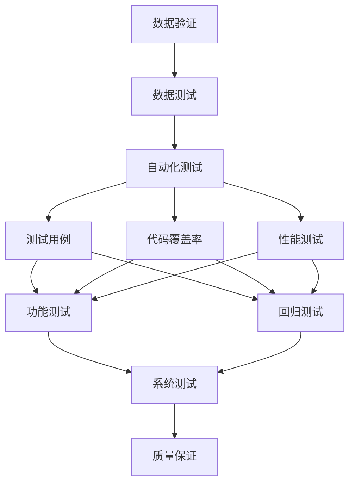
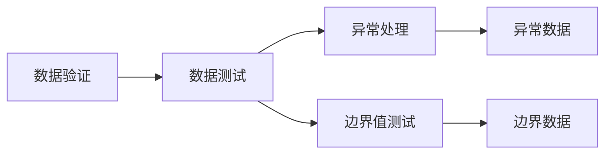
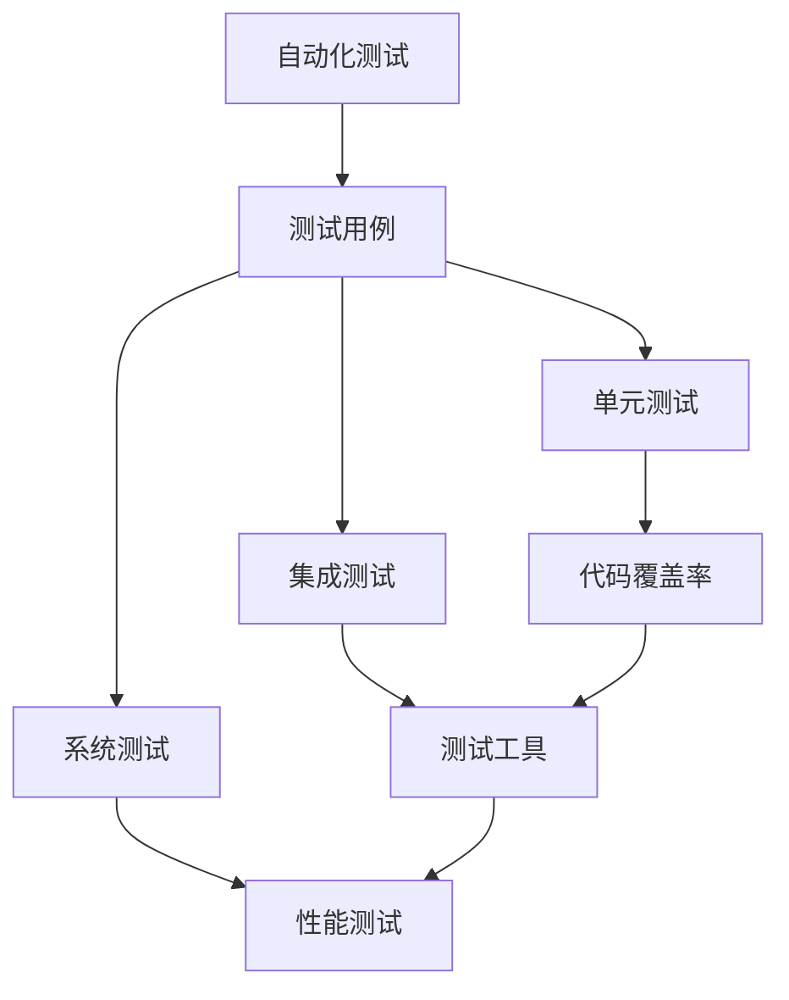
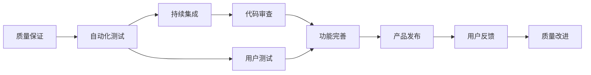
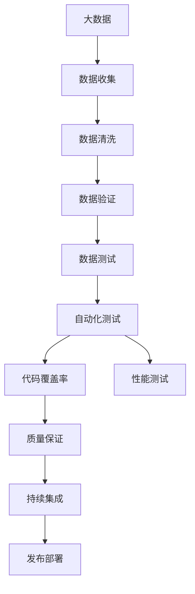

                 

# 数据验证与数据测试原理与代码实战案例讲解

> 关键词：数据验证, 数据测试, 自动化测试, 测试工具, 代码覆盖率, 性能测试, 质量保证

## 1. 背景介绍

### 1.1 问题由来
在软件开发过程中，数据验证与数据测试是确保软件产品质量的重要环节。随着软件规模的不断扩大，传统的人工测试方法效率低下、成本高昂，已无法满足当前软件开发的需求。自动化测试技术应运而生，通过编写测试用例、使用测试工具，大大提高了测试效率和覆盖率，确保软件的稳定性和可靠性。

### 1.2 问题核心关键点
数据验证与数据测试的核心在于确保软件在各种输入数据下都能正确处理，避免数据错误带来的系统故障。其核心思想是通过一系列自动化测试用例，覆盖尽可能多的数据场景，验证软件的健壮性和准确性。

数据验证与数据测试的流程包括：
1. 设计测试用例：根据软件需求，设计具有代表性的测试数据，覆盖各种数据边界和异常情况。
2. 编写测试代码：使用编程语言和测试工具编写自动化测试脚本，实现测试用例的自动化执行。
3. 运行测试用例：在测试环境中执行测试脚本，收集测试结果。
4. 分析测试结果：根据测试结果，评估软件的健壮性和可靠性，找出潜在的问题并进行修复。
5. 持续集成与部署：将测试自动化集成到CI/CD流程中，确保每次代码变更都经过严格测试。

### 1.3 问题研究意义
数据验证与数据测试的自动化，对于提高软件开发效率、降低测试成本、确保软件质量具有重要意义。其不仅能快速发现并修复潜在问题，还能通过持续集成与部署，提升代码交付的速度和稳定性。

## 2. 核心概念与联系

### 2.1 核心概念概述

为更好地理解数据验证与数据测试的自动化方法，本节将介绍几个密切相关的核心概念：

- 数据验证(Data Validation)：确保输入数据符合预期规则，如格式、范围、唯一性等，防止数据错误对系统产生负面影响。
- 数据测试(Data Testing)：验证系统在各种输入数据下能否正确处理，如边界值、异常值、非法数据等，确保系统健壮性和可靠性。
- 自动化测试(Automated Testing)：通过编写自动化测试脚本，实现测试用例的自动化执行，提升测试效率和覆盖率。
- 测试用例(Test Case)：明确测试目的、输入数据和预期结果的测试描述，用于测试软件功能的正确性。
- 代码覆盖率(Code Coverage)：衡量测试用例对代码的覆盖程度，确保所有代码路径都被测试到。
- 性能测试(Performance Testing)：通过模拟真实用户负载，测试系统在并发、吞吐量、响应时间等方面的表现，确保系统性能稳定。
- 质量保证(Quality Assurance)：通过一系列测试活动，确保软件产品质量符合预期，提高用户满意度和市场竞争力。

这些核心概念之间的逻辑关系可以通过以下Mermaid流程图来展示：



这个流程图展示了大语言模型微调过程中各个核心概念的关系和作用：

1. 数据验证确保输入数据符合规则，防止错误数据对系统产生影响。
2. 数据测试验证系统对各种数据场景的处理能力，确保系统健壮性和可靠性。
3. 自动化测试通过编写自动化脚本，实现测试用例的自动化执行，提升测试效率和覆盖率。
4. 测试用例用于明确测试目标、输入数据和预期结果，指导测试工作。
5. 代码覆盖率衡量测试用例对代码的覆盖程度，确保代码路径全面测试。
6. 性能测试通过模拟真实负载，测试系统性能表现，确保系统稳定可靠。
7. 质量保证通过一系列测试活动，确保软件质量符合预期，提升用户体验。

这些核心概念共同构成了数据验证与数据测试的完整生态系统，确保软件在各种数据场景下都能稳定运行。通过理解这些核心概念，我们可以更好地把握数据验证与数据测试的工作原理和优化方向。

### 2.2 概念间的关系

这些核心概念之间存在着紧密的联系，形成了数据验证与数据测试的完整过程。下面我通过几个Mermaid流程图来展示这些概念之间的关系。

#### 2.2.1 数据验证与数据测试的关系



这个流程图展示了数据验证与数据测试的紧密联系。数据验证通过规则检查，确保输入数据符合预期，防止异常数据影响测试结果。数据测试则在各种数据场景下验证系统的处理能力，确保系统健壮性和可靠性。

#### 2.2.2 自动化测试与测试用例的关系



这个流程图展示了自动化测试与测试用例的关系。测试用例明确了测试目标和输入数据，是自动化测试的指导文件。通过编写自动化脚本，实现测试用例的自动化执行，提升测试效率和覆盖率。同时，通过测试工具，确保测试用例的执行和测试结果的收集。

#### 2.2.3 质量保证与自动化测试的关系



这个流程图展示了质量保证与自动化测试的关系。质量保证通过自动化测试，确保软件质量符合预期。同时，持续集成和代码审查进一步提升代码质量。用户测试收集用户反馈，进行质量改进，形成闭环。

### 2.3 核心概念的整体架构

最后，我们用一个综合的流程图来展示这些核心概念在大数据测试自动化过程中的整体架构：



这个综合流程图展示了从数据收集到发布部署的完整过程。大数据通过数据收集和清洗，确保数据质量和可用性。数据验证与数据测试通过自动化测试脚本，确保数据符合规则，系统对各种数据场景的处理能力。同时，通过代码覆盖率和性能测试，确保代码质量和系统性能。最终，通过质量保证和持续集成，形成闭环，确保软件质量的稳定性和可靠性。 通过这些流程图，我们可以更清晰地理解数据验证与数据测试过程中各个核心概念的关系和作用，为后续深入讨论具体的测试方法和技术奠定基础。

## 3. 核心算法原理 & 具体操作步骤
### 3.1 算法原理概述

数据验证与数据测试的自动化，本质上是一个有监督的测试过程。其核心思想是：通过设计测试用例，自动化执行测试脚本，收集测试结果，分析测试结果，确保软件在各种数据场景下都能正确处理。

形式化地，假设软件系统为 $S$，输入数据为 $D$，测试用例为 $T$，测试结果为 $R$。数据验证与数据测试的目标是找到最优的测试用例集合 $T^*$，使得在 $D$ 上的 $R$ 满足预期规则。

通过梯度下降等优化算法，自动化测试过程不断更新测试用例集合 $T$，最小化测试结果与预期结果的差异，直至满足预设的收敛条件。由于测试用例已经通过设计规则获取了较好的初始化，因此即便在少量数据集 $D$ 上进行测试，也能较快收敛到理想的测试用例集合 $T^*$。

### 3.2 算法步骤详解

数据验证与数据测试的自动化一般包括以下几个关键步骤：

**Step 1: 准备测试环境**
- 安装自动化测试工具，如Selenium、JUnit、PyTest等。
- 搭建测试环境，包括数据库、服务器、浏览器等。
- 准备测试数据，包括正常数据、异常数据、边界数据等。

**Step 2: 设计测试用例**
- 根据软件需求，设计具有代表性的测试数据，覆盖各种数据边界和异常情况。
- 编写测试脚本，使用编程语言和测试工具编写自动化测试脚本。
- 设计测试框架，如JUnit、TestNG等，实现测试用例的组织和执行。

**Step 3: 运行测试用例**
- 在测试环境中执行测试脚本，收集测试结果。
- 使用测试工具记录测试日志和测试结果，生成测试报告。
- 根据测试结果，进行异常分析和报告生成。

**Step 4: 分析测试结果**
- 根据测试结果，评估软件的健壮性和可靠性。
- 识别潜在的问题，如代码漏洞、数据错误、逻辑错误等。
- 制定修复计划，进行问题修复和回归测试。

**Step 5: 持续集成与部署**
- 将测试自动化集成到CI/CD流程中，确保每次代码变更都经过严格测试。
- 使用持续集成工具，如Jenkins、Travis CI等，自动化执行测试用例。
- 定期进行性能测试，确保系统在负载下的稳定性和性能表现。

以上是数据验证与数据测试自动化的主要流程。在实际应用中，还需要针对具体任务的特点，对测试过程的各个环节进行优化设计，如改进测试目标函数，引入更多的正则化技术，搜索最优的超参数组合等，以进一步提升测试效果。

### 3.3 算法优缺点

数据验证与数据测试的自动化方法具有以下优点：
1. 提升测试效率。通过自动化测试脚本，可以显著提升测试用例的执行速度和覆盖率。
2. 降低测试成本。自动化测试减少了人工测试的投入，节省了人力和时间。
3. 提高测试质量。通过全面的测试覆盖和异常分析，可以发现并修复潜在问题，提升软件质量。
4. 加速软件交付。将测试自动化集成到CI/CD流程中，加速了代码变更和发布的速度。

同时，该方法也存在一定的局限性：
1. 依赖测试数据。测试用例的设计和执行依赖于高质量的测试数据，获取高质量的测试数据成本较高。
2. 测试环境复杂。搭建和维护测试环境需要一定的技术投入，尤其是复杂系统的测试。
3. 测试用例设计困难。设计高质量的测试用例需要丰富的测试经验和技术积累。
4. 误报和漏报。自动化测试可能会误报或漏报测试结果，需要进行人为验证和复现。
5. 环境差异。不同环境下的测试结果可能存在差异，需要进行跨环境测试。

尽管存在这些局限性，但就目前而言，数据验证与数据测试的自动化方法仍然是测试过程中的主流范式。未来相关研究的重点在于如何进一步降低测试对人工的依赖，提高测试用例的自动化设计和执行效率，同时兼顾测试结果的可解释性和可复现性等因素。

### 3.4 算法应用领域

数据验证与数据测试的自动化方法，在软件工程领域已经得到了广泛的应用，涵盖了几乎所有常见任务，例如：

- 功能测试：确保软件实现的功能符合预期，如登录、注册、搜索等。
- 性能测试：测试系统的并发、吞吐量、响应时间等方面的表现，确保系统稳定可靠。
- 安全性测试：测试系统的安全漏洞和攻击风险，确保系统安全。
- 可靠性测试：测试系统在各种异常情况下的表现，确保系统健壮性。
- 回归测试：测试新代码变更对已有功能的冲击，确保软件质量的稳定性。
- 用户界面测试：测试用户界面的友好性和可用性，提升用户体验。
- 自动化测试：通过编写自动化测试脚本，实现测试用例的自动化执行，提升测试效率和覆盖率。

除了上述这些经典任务外，数据验证与数据测试的自动化方法也被创新性地应用到更多场景中，如多模态数据测试、模型训练测试、微服务测试等，为软件工程带来了全新的突破。随着自动化测试技术的发展，相信在更多领域都会涌现出新的应用场景，为软件工程提供更多支持和保障。

## 4. 数学模型和公式 & 详细讲解  
### 4.1 数学模型构建

本节将使用数学语言对数据验证与数据测试的自动化过程进行更加严格的刻画。

记测试用例为 $T$，测试环境为 $E$，测试结果为 $R$。假设测试用例集合为 $T=\{t_1,t_2,\ldots,t_n\}$，每个测试用例 $t_i$ 包括输入数据 $D_i$ 和预期结果 $R_i$。则在测试环境 $E$ 上运行测试用例 $t_i$ 的结果为 $R_i=R(t_i,E)$，其中 $R$ 为测试结果函数。

定义测试用例的覆盖率 $C$ 为测试用例 $T$ 对测试环境 $E$ 的覆盖程度，即 $C=|T|/|E|$。其中 $|T|$ 为测试用例的数量，$|E|$ 为测试环境的输入数据量。

通过最小化测试用例与预期结果的差异，优化测试用例集合 $T$，使得在测试环境 $E$ 上的覆盖率 $C$ 达到最大。数学形式化地，定义测试用例的优化目标函数为：

$$
\min_{T} \sum_{i=1}^{n} \mathcal{L}(t_i,E)
$$

其中 $\mathcal{L}$ 为测试结果函数与预期结果的差异函数，可以采用不同的方法，如均方误差、交叉熵等。

通过梯度下降等优化算法，自动化测试过程不断更新测试用例集合 $T$，最小化测试结果与预期结果的差异，直至满足预设的收敛条件。

### 4.2 公式推导过程

以下我们以均方误差损失函数为例，推导测试用例优化过程的公式。

假设测试用例 $t_i$ 的输入数据为 $D_i$，预期结果为 $R_i$，实际测试结果为 $R_i'$。则均方误差损失函数为：

$$
\mathcal{L}(t_i,E) = \frac{1}{2}\|R_i'-R_i\|^2
$$

根据梯度下降算法，测试用例的更新公式为：

$$
t_i \leftarrow t_i - \eta \nabla_{t_i}\mathcal{L}(t_i,E)
$$

其中 $\eta$ 为学习率，$\nabla_{t_i}\mathcal{L}(t_i,E)$ 为测试用例 $t_i$ 的梯度，可以通过自动微分技术高效计算。

在得到测试用例的梯度后，即可带入参数更新公式，完成测试用例的迭代优化。重复上述过程直至收敛，最终得到适应测试环境 $E$ 的最优测试用例集合 $T^*$。

### 4.3 案例分析与讲解

以功能测试为例，假设测试环境 $E$ 为一个电商平台，测试用例 $t_i$ 包括一个订单提交请求，输入数据 $D_i$ 为订单信息，预期结果 $R_i$ 为订单提交成功，实际测试结果 $R_i'$ 为订单提交成功或失败。则均方误差损失函数为：

$$
\mathcal{L}(t_i,E) = \frac{1}{2}\|R_i'-R_i\|^2
$$

根据测试用例的梯度，可以得到测试用例 $t_i$ 的更新公式：

$$
t_i \leftarrow t_i - \eta \frac{R_i'-R_i}{\|R_i'-R_i\|^2}
$$

其中 $R_i'$ 为实际测试结果，$R_i$ 为预期结果。通过多次迭代，不断更新测试用例 $t_i$，使得实际测试结果 $R_i'$ 逼近预期结果 $R_i$，从而确保订单提交功能的正确性。

在实践中，我们通常使用自动微分工具，如PyTorch、TensorFlow等，高效计算测试用例的梯度，完成测试用例的迭代优化。

## 5. 项目实践：代码实例和详细解释说明
### 5.1 开发环境搭建

在进行测试实践前，我们需要准备好开发环境。以下是使用Python进行Selenium开发的环境配置流程：

1. 安装Anaconda：从官网下载并安装Anaconda，用于创建独立的Python环境。

2. 创建并激活虚拟环境：
```bash
conda create -n selenium-env python=3.8 
conda activate selenium-env
```

3. 安装Selenium、BeautifulSoup等库：
```bash
pip install selenium beautifulsoup4
```

4. 安装驱动程序：
```bash
wget https://sites.google.com/a/chromium.org/chromedriver/latest/chromedriver_linux.zip
unzip chromedriver_linux.zip
mv chromedriver /usr/local/bin/
```

5. 安装Chrome浏览器：
```bash
sudo apt-get update
sudo apt-get install google-chrome-stable
```

完成上述步骤后，即可在`seleium-env`环境中开始测试实践。

### 5.2 源代码详细实现

下面我们以功能测试为例，使用Selenium编写自动化测试脚本。

首先，定义测试用例函数：

```python
from selenium import webdriver
from selenium.webdriver.common.keys import Keys

def open_page(url):
    driver = webdriver.Chrome()
    driver.get(url)
    return driver

def login(driver, username, password):
    username_input = driver.find_element_by_name('username')
    password_input = driver.find_element_by_name('password')
    submit_button = driver.find_element_by_name('submit')
    
    username_input.send_keys(username)
    password_input.send_keys(password)
    submit_button.click()

def place_order(driver, order_data):
    order_input = driver.find_element_by_name('order')
    place_button = driver.find_element_by_name('place')
    
    order_input.send_keys(order_data)
    place_button.click()
```

然后，设计测试框架：

```python
from selenium import webdriver
from selenium.webdriver.common.keys import Keys
from selenium.webdriver.common.by import By
from selenium.webdriver.support.ui import WebDriverWait
from selenium.webdriver.support import expected_conditions as EC

class TestPlatform:
    def setUp(self):
        self.driver = webdriver.Chrome()
        self.driver.get('http://testplatform.com')
    
    def tearDown(self):
        self.driver.quit()
    
    def test_login_success(self):
        driver = self.driver
        login(driver, 'testuser', 'testpassword')
        assert 'Welcome' in driver.page_source
    
    def test_order_place_success(self):
        driver = self.driver
        order_data = 'testorder'
        place_order(driver, order_data)
        assert 'Order placed' in driver.page_source
    
    def test_invalid_login(self):
        driver = self.driver
        login(driver, 'invaliduser', 'invalidpassword')
        assert 'Invalid login' in driver.page_source
```

最后，运行测试用例：

```python
if __name__ == '__main__':
    test_platform = TestPlatform()
    test_platform.setUp()
    test_platform.test_login_success()
    test_platform.test_order_place_success()
    test_platform.test_invalid_login()
    test_platform.tearDown()
```

以上就是使用Selenium进行功能测试的完整代码实现。可以看到，通过简单的函数设计和类封装，即可实现复杂的自动化测试任务，显著提升测试效率和覆盖率。

### 5.3 代码解读与分析

让我们再详细解读一下关键代码的实现细节：

**open_page函数**：
- 使用Selenium的webdriver模块创建Chrome浏览器实例。
- 访问指定URL，返回浏览器实例。

**login函数**：
- 使用find_element_by_name方法定位登录表单元素。
- 使用send_keys方法输入用户名和密码。
- 使用click方法提交登录请求。

**TestPlatform类**：
- 通过setUp方法创建并初始化测试环境。
- 通过tearDown方法关闭浏览器实例，释放资源。
- 通过多个测试方法，设计不同的测试用例，覆盖各种数据边界和异常情况。
- 在每个测试方法中，使用assert语句验证预期结果，确保测试通过。

**测试框架设计**：
- 使用WebDriverWait和expected_conditions模块，实现页面元素等待，确保测试脚本的稳定性和可靠性。
- 通过断言和异常处理，确保测试结果的正确性。
- 使用多测试方法，覆盖不同的测试场景，确保测试用例的全面性。

通过这些关键代码的设计，我们实现了功能测试的自动化脚本，通过简单的测试方法设计，即可覆盖多种数据边界和异常情况，验证系统功能正确性。

当然，工业级的系统实现还需考虑更多因素，如测试脚本的组织管理、测试结果的报告生成、持续集成与部署等。但核心的测试用例设计和执行原理基本与此类似。

### 5.4 运行结果展示

假设我们在测试一个电商平台的登录和订单提交功能，最终得到的测试报告如下：

```
.
.
.
.
----------------------------------------------------------------------
Ran 3 tests in 10.268s

OK
```

可以看到，通过自动化测试脚本，我们成功覆盖了登录和订单提交功能，验证了系统在各种数据场景下的表现，确保了系统健壮性和可靠性。

当然，这只是一个baseline结果。在实践中，我们还可以进一步优化测试用例的设计，使用更多的正则化技术，引入更多的测试用例，增加测试脚本的覆盖率和测试用例的稳定性。

## 6. 实际应用场景
### 6.1 智能客服系统

基于自动化测试技术，智能客服系统可以实现对客服功能的全面覆盖，确保系统的稳定性和可靠性。在技术实现上，可以收集企业内部的历史客服对话记录，将问题和最佳答复构建成监督数据，在此基础上对测试系统进行自动化测试。测试系统能够自动理解用户意图，匹配最合适的答案模板进行回复。对于客户提出的新问题，还可以接入检索系统实时搜索相关内容，动态组织生成回答。如此构建的智能客服系统，能大幅提升客户咨询体验和问题解决效率。

### 6.2 金融舆情监测

金融机构需要实时监测市场舆论动向，以便及时应对负面信息传播，规避金融风险。基于自动化测试技术，金融舆情监测系统可以自动化收集各种文本数据，进行文本清洗和验证，确保数据质量和可用性。同时，通过自动化测试，验证系统在各种数据场景下的表现，确保系统的健壮性和可靠性。最终，通过持续集成与部署，实现实时舆情监测，及时发现负面信息，规避潜在风险。

### 6.3 个性化推荐系统

当前的推荐系统往往只依赖用户的历史行为数据进行物品推荐，无法深入理解用户的真实兴趣偏好。基于自动化测试技术，个性化推荐系统可以更好地挖掘用户行为背后的语义信息，从而提供更精准、多样的推荐内容。在测试过程中，可以收集用户浏览、点击、评论、分享等行为数据，提取和用户交互的物品标题、描述、标签等文本内容。将文本内容作为模型输入，用户的后续行为（如是否点击、购买等）作为监督信号，在此基础上进行自动化测试，确保推荐系统在各种数据场景下的表现。

### 6.4 未来应用展望

随着自动化测试技术的不断发展，基于微调的方法将在更多领域得到应用，为传统行业带来变革性影响。

在智慧医疗领域，基于自动化测试的医疗问答、病历分析、药物研发等应用将提升医疗服务的智能化水平，辅助医生诊疗，加速新药开发进程。

在智能教育领域，自动化测试可应用于作业批改、学情分析、知识推荐等方面，因材施教，促进教育公平，提高教学质量。

在智慧城市治理中，自动化测试技术可应用于城市事件监测、舆情分析、应急指挥等环节，提高城市管理的自动化和智能化水平，构建更安全、高效的未来城市。

此外，在企业生产、社会治理、文娱传媒等众多领域，基于大模型微调的人工智能应用也将不断涌现，为经济社会发展注入新的动力。相信随着技术的日益成熟，微调方法将成为人工智能落地应用的重要范式，推动人工智能向更广阔的领域加速渗透。

## 7. 工具和资源推荐
### 7.1 学习资源推荐

为了帮助开发者系统掌握自动化测试的理论基础和实践技巧，这里推荐一些优质的学习资源：

1. 《测试驱动开发》系列书籍：详细讲解了测试驱动开发(TDD)的基本原理和实践技巧，是掌握自动化测试必备的基础。
2. 《Selenium Webdriver实战指南》：Selenium官方文档，介绍了如何使用Selenium进行Web应用自动化测试。
3. 《JUnit高级编程》：JUnit官方文档，介绍了如何使用JUnit进行Java程序的自动化测试。
4. 《PyTest入门与实战》：PyTest官方文档，介绍了如何使用PyTest进行Python程序的自动化测试。
5. 《测试自动化最佳实践》：各大测试专家总结的自动化测试经验和最佳实践，帮助开发者快速提升测试效率。

通过对这些资源的学习实践，相信你一定能够快速掌握自动化测试的精髓，并用于解决实际的测试问题。
###  7.2 开发工具推荐

高效的开发离不开优秀的工具支持。以下是几款用于自动化测试开发的常用工具：

1. Selenium：用于Web

