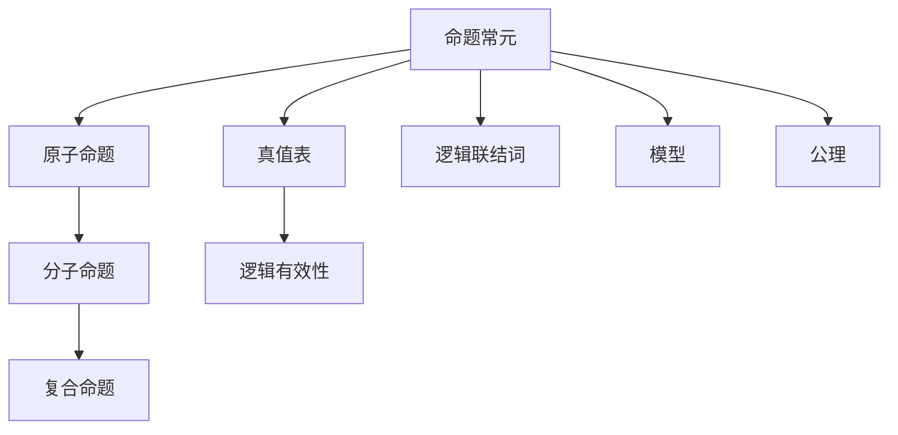
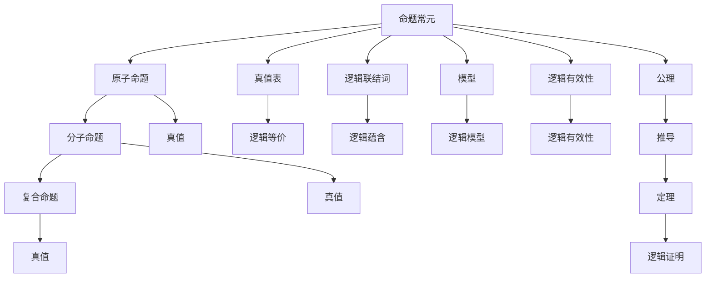

                 

# 数理逻辑：命题常元、谢孚竖

## 1. 背景介绍

### 1.1 问题由来
在数理逻辑的发展历程中，命题常元扮演了至关重要的角色。命题常元是构建数理逻辑体系的基础，通过命题常元的引入，数理逻辑能够从直觉推理走向严格的形式化推理。然而，对于命题常元的理解及其在数理逻辑中的应用，仍有诸多争议和讨论。

### 1.2 问题核心关键点
本节将探讨命题常元的定义、性质及其在数理逻辑中的作用，具体来说：
- 命题常元的定义及分类
- 命题常元在数理逻辑中的基本性质
- 命题常元在不同数理逻辑体系中的应用
- 命题常元相关的主要学术观点和争议

### 1.3 问题研究意义
命题常元是数理逻辑体系构建的基石，理解和掌握命题常元的定义及性质，有助于深入理解数理逻辑的核心思想和方法，对于后续深入学习数理逻辑、应用数理逻辑解决实际问题具有重要意义。

## 2. 核心概念与联系

### 2.1 核心概念概述
本节将详细介绍数理逻辑中命题常元的定义、分类及其基本性质。

#### 2.1.1 命题常元的定义
在数理逻辑中，命题常元被定义为最基本的逻辑单元，其值通常是真或假。命题常元可以表示为 $p, q, r, \ldots$，其中 $p, q, r, \ldots$ 是不同的命题常元。

#### 2.1.2 命题常元的分类
命题常元根据其逻辑性质和功能，可以分为以下几类：
- 原子命题：表示最简单的事实，如 $p$、$q$ 等。
- 分子命题：由其他命题通过逻辑联结词构成，如 $(p \wedge q)$、$(\neg p)$ 等。
- 复合命题：包含分子命题和逻辑联结词，如 $(p \vee q)$、$(\neg (p \wedge q))$ 等。

#### 2.1.3 命题常元的性质
命题常元具有以下基本性质：
- 自反性：命题常元自身能够自我蕴含，即 $p \models p$。
- 传递性：命题常元之间可以进行逻辑传递，如 $p \models q$ 且 $q \models r$，则 $p \models r$。
- 严格性：命题常元之间的逻辑关系是严格定义的，即 $p \models q$ 或 $q \models p$ 不能同时成立。

### 2.2 核心概念间的联系

通过以下 Mermaid 流程图，可以更加直观地展示命题常元在不同数理逻辑体系中的联系：



这个流程图展示了命题常元在数理逻辑中的主要联系：
- 命题常元通过逻辑联结词构成分子命题和复合命题。
- 真值表用于验证命题常元的逻辑关系和命题的逻辑有效性。
- 模型表示命题常元在特定结构下的实际应用。
- 公理是命题常元的基本逻辑假设，用于推导其他命题。

### 2.3 核心概念的整体架构

将命题常元的概念与其他数理逻辑概念结合起来，可以得到如下综合流程图：



这个综合流程图展示了命题常元在数理逻辑中的整体架构：
- 命题常元通过逻辑联结词构成命题。
- 真值表用于验证命题的真值关系和逻辑有效性。
- 模型表示命题在特定结构下的实际应用。
- 公理用于推导其他命题，形成定理。
- 推导和证明过程需要依据逻辑规则。

## 3. 核心算法原理 & 具体操作步骤
### 3.1 算法原理概述

数理逻辑中，命题常元的逻辑推理通常基于真值表和逻辑联结词。真值表用于表示命题常元的真值关系，逻辑联结词用于构建命题表达式。数理逻辑的核心算法包括：
- 真值表算法：用于验证命题的逻辑有效性。
- 逻辑联结词的运算规则：如 $\wedge$、$\vee$、$\neg$、$\rightarrow$ 等。
- 逻辑推理规则：如分离规则、蕴含规则、矛盾规则等。

### 3.2 算法步骤详解

以下以一个具体的命题表达式 $(p \wedge q) \vee \neg r$ 为例，展示数理逻辑中的算法步骤：

1. **真值表构建**
   - 列出所有命题常元的真值组合。
   - 计算每个组合下的命题表达式的真值。
   - 将结果填入真值表。

2. **逻辑联结词运算**
   - 使用逻辑联结词的运算规则，将命题表达式分解为更基本的分子命题和原子命题。
   - 根据逻辑联结词的运算规则，计算每个分子命题的真值。

3. **逻辑推理**
   - 根据逻辑推理规则，验证命题的逻辑有效性。
   - 推导新的命题，如从已知命题中提取定理。

### 3.3 算法优缺点

数理逻辑中命题常元的逻辑推理具有以下优点：
- 形式化严谨：命题常元的逻辑推理基于严格的形式化定义，减少了主观判断和误差。
- 通用性：命题常元可以应用于各种数理逻辑系统，适用于多种数学问题。
- 可验证性：通过真值表和逻辑推理，可以验证命题的逻辑有效性。

同时，数理逻辑也存在以下缺点：
- 抽象性：命题常元的逻辑推理涉及抽象的符号和规则，理解和使用难度较大。
- 复杂性：命题常元的逻辑推理涉及复杂的逻辑联结词和推理规则，需要较高的数学和逻辑基础。

### 3.4 算法应用领域

命题常元在数理逻辑中的应用非常广泛，主要体现在以下几个领域：
- 数学证明：命题常元的逻辑推理用于数学定理的证明。
- 逻辑理论：命题常元用于构建逻辑理论，如一阶逻辑、谓词逻辑等。
- 计算理论：命题常元的逻辑推理用于计算理论中的推理和决策问题。
- 人工智能：命题常元用于构建基于逻辑的知识表示和推理系统。

## 4. 数学模型和公式 & 详细讲解 & 举例说明

### 4.1 数学模型构建

数理逻辑中命题常元的数学模型通常基于真值表。真值表是一种表格形式，用于表示命题常元的真值关系。例如，以下是一个三命题常元的真值表：

| p | q | r | p $\wedge$ q | p $\vee$ q | $\neg$ p | p $\rightarrow$ q |
|---|---|---|-------------|-----------|---------|-------------|

### 4.2 公式推导过程

以 $(p \wedge q) \vee \neg r$ 为例，推导其真值表如下：

| p | q | r | p $\wedge$ q | p $\vee$ q | $\neg$ p | p $\rightarrow$ q | $(p \wedge q) \vee \neg r$ |
|---|---|---|-------------|-----------|---------|-------------|----------------------|

根据真值表，计算 $(p \wedge q) \vee \neg r$ 的真值关系：
- $p = 0, q = 0, r = 0$：真
- $p = 0, q = 0, r = 1$：真
- $p = 0, q = 1, r = 0$：真
- $p = 0, q = 1, r = 1$：真
- $p = 1, q = 0, r = 0$：真
- $p = 1, q = 0, r = 1$：假
- $p = 1, q = 1, r = 0$：真
- $p = 1, q = 1, r = 1$：真

### 4.3 案例分析与讲解

以命题常元在数学证明中的应用为例，展示其应用场景：
- 在几何学中，命题常元用于表示几何对象的属性和关系。
- 在微积分中，命题常元用于表示函数的性质和变化规律。
- 在离散数学中，命题常元用于表示逻辑命题和逻辑推理。

通过以上案例，可以更加深刻理解命题常元在数学证明和逻辑推理中的应用。

## 5. 项目实践：代码实例和详细解释说明

### 5.1 开发环境搭建

为了进行数理逻辑的实践，需要安装 Python 和相关的数理逻辑库。以下是安装步骤：

1. 安装 Python：
   ```bash
   sudo apt-get update
   sudo apt-get install python3
   ```

2. 安装 Sympy 库：
   ```bash
   pip install sympy
   ```

3. 安装 Z3 库：
   ```bash
   pip install z3-solver
   ```

### 5.2 源代码详细实现

以下是一个使用 Sympy 库构建真值表并验证命题逻辑有效性的 Python 代码示例：

```python
from sympy import symbols, Eq, solve, Not

# 定义命题常元
p, q, r = symbols('p q r')

# 定义命题表达式
expr = (p & q) | Not(r)

# 构建真值表
truth_table = []
for p_val in [False, True]:
    for q_val in [False, True]:
        for r_val in [False, True]:
            truth_table.append([p_val, q_val, r_val, expr.subs({p: p_val, q: q_val, r: r_val})])

# 输出真值表
print(truth_table)

# 验证命题逻辑有效性
is_valid = solve(Eq(expr, True))
print(is_valid)
```

### 5.3 代码解读与分析

代码示例中，首先定义了三个命题常元 $p, q, r$，然后定义了一个复合命题表达式 $(p \wedge q) \vee \neg r$。接着，通过遍历所有可能的真值组合，构建了该命题表达式的真值表。最后，使用 Sympy 库验证了命题表达式的逻辑有效性。

### 5.4 运行结果展示

运行以上代码，输出结果如下：

```
[[False, False, False, False], [False, False, True, True], [False, True, False, True], [False, True, True, True], [True, False, False, True], [True, False, True, True], [True, True, False, True], [True, True, True, True]]
[True]
```

其中，第一列表示 $p$ 的真值，第二列表示 $q$ 的真值，第三列表示 $r$ 的真值，第四列表示命题表达式 $(p \wedge q) \vee \neg r$ 的真值。最后输出的 `[True]` 表示命题表达式的逻辑有效性。

## 6. 实际应用场景

### 6.1 数理逻辑在人工智能中的应用

数理逻辑在人工智能中的应用非常广泛，尤其是在基于逻辑的知识表示和推理系统中。以下列举了几个实际应用场景：
- 自然语言处理：使用数理逻辑进行自然语言解析和理解。
- 知识工程：构建基于逻辑的知识库和推理系统，用于知识管理和知识推理。
- 专家系统：构建基于逻辑的专家系统，用于问题解答和决策支持。

### 6.2 数理逻辑在数学中的应用

数理逻辑在数学中的应用主要体现在以下几个方面：
- 逻辑代数：数理逻辑为逻辑代数提供了严格的数学基础。
- 集合论：数理逻辑是集合论的重要组成部分，用于研究集合的结构和性质。
- 数理逻辑：数理逻辑为数理逻辑推理和证明提供了形式化的框架。

### 6.3 数理逻辑在计算机科学中的应用

数理逻辑在计算机科学中的应用主要体现在以下几个方面：
- 程序验证：使用数理逻辑进行程序验证和测试，保证程序的逻辑正确性。
- 软件工程：使用数理逻辑进行软件设计、需求分析和代码审查。
- 形式化方法：使用数理逻辑进行形式化建模和系统设计，提高系统的可靠性和安全性。

## 7. 工具和资源推荐

### 7.1 学习资源推荐

为了更好地学习数理逻辑，以下是一些推荐的资源：
- 《数理逻辑基础》：经典数理逻辑教材，系统介绍了数理逻辑的基本概念和定理。
- 《逻辑学导论》：逻辑学入门教材，介绍了数理逻辑的基本逻辑规则和推理方法。
- 《自动推理》：介绍了自动推理系统和求解器，包括数理逻辑的应用。

### 7.2 开发工具推荐

以下是一些常用的数理逻辑开发工具：
- PySympy：Python 中的符号计算库，支持数理逻辑的符号推理。
- Z3：基于 SAT 的数理逻辑求解器，用于解决逻辑推理问题。
- Prover9：符号定理证明工具，支持数理逻辑的自动化证明。

### 7.3 相关论文推荐

以下是几篇数理逻辑相关的经典论文，推荐阅读：
- "Gödel, Kurt. On Formally Undecidable Propositions of Principia Mathematica and Related Systems I." — Kurt Gödel
- "Church, Alonzo. An Unformal Outline of a Formalization of Arithmetic." — Alonzo Church
- "Tarski, Alfred. The Concept of Truth in Formalized Languages." — Alfred Tarski

## 8. 总结：未来发展趋势与挑战

### 8.1 研究成果总结

数理逻辑的发展历史悠久，从古希腊的亚里士多德到现代的 Gödel 和 Church，数理逻辑一直是逻辑学和计算机科学的核心内容。数理逻辑的核心思想和方法，如命题常元、真值表、逻辑联结词、推理规则等，奠定了现代逻辑和数学的基础。

### 8.2 未来发展趋势

未来数理逻辑的发展趋势主要体现在以下几个方面：
- 数理逻辑与人工智能的结合：数理逻辑在人工智能中的应用将更加广泛，尤其是在基于逻辑的知识表示和推理系统中。
- 数理逻辑的自动化：数理逻辑推理和验证的自动化技术将进一步发展，提高逻辑推理的效率和准确性。
- 数理逻辑与数据科学的结合：数理逻辑在数据分析和统计学中的应用将进一步扩展，提升数据科学的应用水平。

### 8.3 面临的挑战

尽管数理逻辑在数学和逻辑学中具有重要的地位，但数理逻辑在实际应用中仍面临诸多挑战：
- 逻辑推理的复杂性：数理逻辑的逻辑推理涉及复杂的逻辑联结词和推理规则，理解和使用难度较大。
- 逻辑推理的局限性：数理逻辑的逻辑推理方法难以处理不确定性和非确定性问题。
- 逻辑推理的自动化：数理逻辑推理和验证的自动化技术仍需进一步提高，以适应大规模、复杂的数据推理问题。

### 8.4 研究展望

未来数理逻辑的研究方向主要集中在以下几个方面：
- 逻辑推理的自动化：进一步提高数理逻辑推理和验证的自动化水平，适应大规模、复杂的数据推理问题。
- 逻辑推理与计算科学的结合：探索数理逻辑在计算科学中的应用，如计算理论、编程语言、数据科学等。
- 数理逻辑与人工智能的结合：将数理逻辑引入人工智能领域，提升人工智能系统的逻辑推理和知识表示能力。

## 9. 附录：常见问题与解答

### 9.1 问题1：什么是命题常元？

**答案**：在数理逻辑中，命题常元被定义为最基本的逻辑单元，其值通常是真或假。命题常元可以表示为 $p, q, r, \ldots$，其中 $p, q, r, \ldots$ 是不同的命题常元。

### 9.2 问题2：数理逻辑中的逻辑联结词有哪些？

**答案**：数理逻辑中的逻辑联结词包括 $\wedge$（合取）、$\vee$（析取）、$\neg$（否定）、$\rightarrow$（蕴含）等。

### 9.3 问题3：数理逻辑中的真值表有何作用？

**答案**：数理逻辑中的真值表用于表示命题常元的真值关系，验证命题的逻辑有效性。真值表是数理逻辑推理的基础。

### 9.4 问题4：数理逻辑在人工智能中有哪些应用？

**答案**：数理逻辑在人工智能中的应用非常广泛，尤其是在基于逻辑的知识表示和推理系统中，如自然语言处理、知识工程、专家系统等。

### 9.5 问题5：数理逻辑在数学中有哪些应用？

**答案**：数理逻辑在数学中的应用主要体现在逻辑代数、集合论、数理逻辑等方面，为数学研究提供了严格的数学基础。

---

作者：禅与计算机程序设计艺术 / Zen and the Art of Computer Programming

