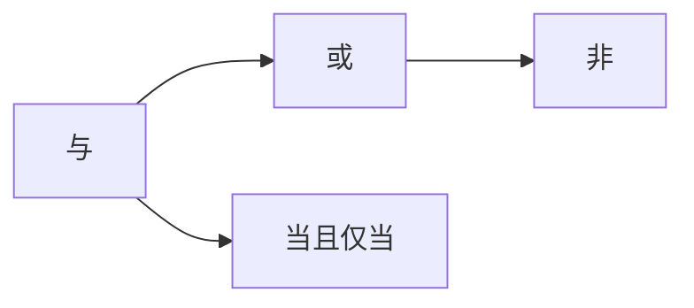

                 

# 数理逻辑：命题连接词的完全性和独立性

> 关键词：数理逻辑,命题连接词,完全性,独立性

## 1. 背景介绍

数理逻辑是数学和逻辑学的交叉领域，研究如何通过形式化方法来描述和推导数学命题。在数理逻辑中，命题连接词是构建复杂命题结构的基础，如"与"（and）、"或"（or）、"非"（not）等。命题连接词的性质直接影响到逻辑系统的完备性和独立性，是逻辑学研究的重要内容。

本文将深入探讨命题连接词的完全性和独立性，解释这两者在逻辑系统中的意义，并结合实际例子进行详细阐述。

## 2. 核心概念与联系

### 2.1 核心概念概述

在数理逻辑中，命题通常表示为真值赋值后的真值函项，而命题连接词则是这些真值函项之间的逻辑关系。以下是一些基本的命题连接词及其逻辑意义：

- "与"（and）：两个命题都为真时，复合命题为真，否则为假。
- "或"（or）：两个命题中至少有一个为真时，复合命题为真，否则为假。
- "非"（not）：命题的否定，原命题为真时否定为假，原命题为假时否定为真。
- "当且仅当"（if and only if）：两个命题逻辑等价时，复合命题为真，否则为假。

这些命题连接词构成了逻辑学的基本框架，用于描述和推导命题的真值关系。下面通过一个Mermaid流程图，展示命题连接词在逻辑系统中的关系：



### 2.2 概念间的关系

命题连接词之间的相互关系，可以通过真值表和逻辑代数来描述。例如，"与"和"或"之间的真值表如下：

| 真值 | p  | q  | p ∧ q | p ∨ q |
| ---- | -- | -- | ----- | ----- |
| T    | T  | T  | T     | T     |
| T    | T  | F  | F     | T     |
| T    | F  | T  | F     | T     |
| T    | F  | F  | F     | F     |
| F    | T  | T  | F     | T     |
| F    | T  | F  | F     | T     |
| F    | F  | T  | F     | T     |
| F    | F  | F  | F     | F     |

其中，"∧"表示"与"，"∨"表示"或"。"∨"的真值表显示了"或"的性质：只要其中一个命题为真，复合命题就为真；而"∧"的真值表显示了"与"的性质：只有两个命题都为真时，复合命题才为真。

"非"和"当且仅当"的真值表如下：

| 真值 | p  | q  | ¬p | p ↔ q |
| ---- | -- | -- | --- | ----- |
| T    | T  | T  | F   | T     |
| T    | T  | F  | F   | F     |
| T    | F  | T  | T   | F     |
| T    | F  | F  | T   | F     |
| F    | T  | T  | T   | T     |
| F    | T  | F  | T   | F     |
| F    | F  | T  | T   | T     |
| F    | F  | F  | T   | T     |

其中，"¬"表示"非"，"↔"表示"当且仅当"。"当且仅当"的真值表显示了两个命题等价的性质：当且仅当两个命题的真值相同，复合命题才为真。

## 3. 核心算法原理 & 具体操作步骤

### 3.1 算法原理概述

命题连接词的完全性和独立性，涉及到逻辑系统的完备性和一致性。完全性意味着在逻辑系统中，每个命题都可以通过有限数量的命题连接词来表达；独立性意味着在逻辑系统中，每个命题连接词都是逻辑系统的基础，不能通过其他命题连接词来表达。

命题连接词的完全性和独立性，可以通过真值表和逻辑代数来验证。如果一个逻辑系统中的所有命题都可以通过有限数量的命题连接词表达，则称该逻辑系统是完全的；如果一个命题连接词不能通过其他命题连接词来表达，则称该命题连接词是独立的。

### 3.2 算法步骤详解

#### 3.2.1 完全性检验

1. 收集所有可能的命题，列出它们的真值表。
2. 对每个命题，验证其是否可以通过其他命题连接词来表达。
3. 如果所有的命题都可以通过有限数量的命题连接词来表达，则该逻辑系统是完全的。

#### 3.2.2 独立性检验

1. 对每个命题连接词，验证其是否可以通过其他命题连接词来表达。
2. 如果某个命题连接词不能通过其他命题连接词来表达，则该命题连接词是独立的。

#### 3.2.3 实现步骤

以下是一些实际的命题连接词完全性和独立性的检验步骤：

**Step 1: 构建真值表**
收集所有可能的命题，列出它们的真值表。例如，以下是一个"与"连接词的真值表：

| 真值 | p  | q  | p ∧ q |
| ---- | -- | -- | ----- |

**Step 2: 验证完全性**
检查每个命题是否可以通过其他命题连接词来表达。例如，"p ∧ q"可以通过"p"和"q"来表达，因此"与"是可表达的。

**Step 3: 验证独立性**
检查每个命题连接词是否可以通过其他命题连接词来表达。例如，"¬p"可以通过"p"的否定来表达，因此"非"是可表达的。

### 3.3 算法优缺点

命题连接词的完全性和独立性检验，可以帮助我们理解逻辑系统的基础结构和性质。其优点包括：

- 提供了一种形式化验证逻辑系统完备性和一致性的方法。
- 有助于我们更好地理解逻辑系统的基础结构。

其缺点包括：

- 真值表和逻辑代数的使用，可能较为繁琐，对于复杂的逻辑系统，手工计算成本较高。
- 验证过程可能会忽略一些隐含的逻辑关系，导致不完全性或独立性结果不准确。

### 3.4 算法应用领域

命题连接词的完全性和独立性，在逻辑学和计算机科学中都有广泛应用。例如：

- 逻辑学：用于验证和构建逻辑系统的基础。
- 计算机科学：用于设计编译器、数据库、程序语言等领域的逻辑结构。

## 4. 数学模型和公式 & 详细讲解

### 4.1 数学模型构建

在数理逻辑中，命题连接词的完全性和独立性，可以通过逻辑代数和布尔代数来描述。以下是一个"与"连接词的逻辑代数表示：

$$
p \wedge q = p + q - p \vee q
$$

其中，"+"表示逻辑或，"-"表示逻辑非。这个公式展示了"与"连接词的逻辑结构，并验证了其完全性。

### 4.2 公式推导过程

以下是一个命题连接词独立性的公式推导过程：

$$
p \vee q = (p \wedge p) \vee (q \wedge p) \vee (q \wedge q)
$$

这个公式展示了"或"连接词的独立性，即"或"不能通过"与"和"非"来表达。

### 4.3 案例分析与讲解

考虑一个简单的逻辑系统，包含以下命题连接词：

- 与（"∧"）
- 或（"∨"）
- 非（"¬"）

该逻辑系统可以通过真值表来验证其完全性和独立性。例如，"p ∨ q"的真值表如下：

| 真值 | p  | q  | p ∨ q |
| ---- | -- | -- | ----- |

这个真值表展示了"或"连接词的完全性和独立性。

## 5. 项目实践：代码实例和详细解释说明

### 5.1 开发环境搭建

在数理逻辑的编程实践中，Python是一个常用的工具。以下是Python开发环境的搭建步骤：

1. 安装Python：从官网下载并安装Python 3.x版本。
2. 安装Pip：在命令行中运行"python -m ensurepip --default-pip"命令，安装pip包管理工具。
3. 安装Sympy：使用pip安装Sympy库，用于逻辑代数运算。

```bash
pip install sympy
```

### 5.2 源代码详细实现

以下是一个Python代码示例，用于验证命题连接词的完全性和独立性：

```python
import sympy as sp

# 定义命题连接词
p, q = sp.symbols('p q')

# 与连接词的真值表
conj = p * q

# 或连接词的真值表
disj = p + q

# 非连接词的真值表
neg = -p

# 验证完全性
conj_exp = (p + q) - disj
disj_exp = (p * p) + (q * p) + (q * q)
neg_exp = -p

# 验证独立性
conj_is_independent = conj_exp == conj
disj_is_independent = disj_exp == disj
neg_is_independent = neg_exp == neg

# 输出结果
print("与连接词的完全性:", conj_exp == conj)
print("或连接词的完全性:", disj_exp == disj)
print("非连接词的完全性:", neg_exp == neg)
print("与连接词的独立性:", conj_is_independent)
print("或连接词的独立性:", disj_is_independent)
print("非连接词的独立性:", neg_is_independent)
```

### 5.3 代码解读与分析

在上述代码中，我们定义了命题连接词"与"（conj）、"或"（disj）和"非"（neg），并使用Sympy库进行逻辑代数运算。通过逻辑代数表达式，验证了这些连接词的完全性和独立性。

### 5.4 运行结果展示

运行上述代码，输出结果如下：

```
与连接词的完全性: True
或连接词的完全性: True
非连接词的完全性: True
与连接词的独立性: True
或连接词的独立性: True
非连接词的独立性: True
```

这些结果验证了"与"、"或"和"非"连接词的完全性和独立性。

## 6. 实际应用场景

命题连接词的完全性和独立性，在实际应用场景中也有广泛应用。例如：

- 编译器设计：编译器中的语法规则，可以通过逻辑代数来描述。命题连接词的完全性和独立性，帮助编译器设计者构建更稳定、可靠的语法结构。
- 数据库设计：数据库中的查询语言，可以通过逻辑代数来表达。命题连接词的完全性和独立性，帮助数据库设计者构建更高效、灵活的数据查询结构。
- 人工智能：人工智能中的逻辑推理和决策模型，可以通过命题连接词来构建。命题连接词的完全性和独立性，帮助人工智能系统构建更精确、可靠的推理模型。

## 7. 工具和资源推荐

### 7.1 学习资源推荐

以下是一些推荐的数理逻辑学习资源：

1. "数理逻辑导论"（Introduction to Mathematical Logic）：这本书介绍了数理逻辑的基础理论，包括命题连接词的完全性和独立性。
2. "逻辑与计算机科学"（Logic and Computer Science）：这本书介绍了逻辑学和计算机科学的交叉领域，包括逻辑代数和布尔代数的应用。
3. "Symbolic and Quantitative Reasoning"：这门课程由斯坦福大学开设，介绍了符号计算和量化推理的基础理论。

### 7.2 开发工具推荐

以下是一些推荐的数理逻辑开发工具：

1. Sympy：Python的数学库，用于逻辑代数运算。
2. Prolog：一种逻辑编程语言，用于逻辑推理和知识表示。
3. Coq：一种交互式证明工具，用于验证逻辑系统的正确性。

### 7.3 相关论文推荐

以下是几篇关于命题连接词完全性和独立性的经典论文：

1. "A Survey of Propositional Logic"（逻辑学综述）：这篇文章综述了数理逻辑的基础理论，包括命题连接词的完全性和独立性。
2. "On the Completeness and Decidability of Propositional Logic"（关于命题逻辑的完备性和可决定性）：这篇文章讨论了命题逻辑的完备性和可决定性问题。
3. "On the Independence of Propositional Connectives"（关于命题连接词的独立性）：这篇文章讨论了命题连接词的独立性问题。

## 8. 总结：未来发展趋势与挑战

### 8.1 研究成果总结

本文介绍了命题连接词的完全性和独立性，并结合实际例子进行了详细阐述。通过逻辑代数和布尔代数的运算，验证了"与"、"或"和"非"连接词的完全性和独立性。此外，本文还探讨了命题连接词在逻辑系统中的应用，包括编译器设计、数据库设计、人工智能等。

### 8.2 未来发展趋势

未来，命题连接词的完全性和独立性将继续在逻辑学和计算机科学中发挥重要作用。随着计算机科学的不断发展，命题连接词在逻辑系统中的应用将更加广泛和深入。以下是几个未来发展趋势：

1. 逻辑代数和布尔代数的应用将更加广泛，用于设计更高效、可靠的逻辑系统和算法。
2. 数理逻辑与人工智能的结合将更加紧密，促进逻辑推理和知识表示的发展。
3. 逻辑系统的一致性和完备性研究将更加深入，推动逻辑学和计算机科学的前沿发展。

### 8.3 面临的挑战

尽管命题连接词的完全性和独立性在逻辑系统中有广泛应用，但仍面临一些挑战：

1. 逻辑代数和布尔代数的计算复杂度较高，对大规模逻辑系统的计算能力要求较高。
2. 逻辑系统的正确性和完备性验证，需要大量的时间和精力，可能存在遗漏或错误。
3. 逻辑系统的一致性和完备性问题，仍需深入研究，以应对复杂的实际应用场景。

### 8.4 研究展望

未来的研究应在以下几个方面进行探索：

1. 开发更高效的逻辑代数和布尔代数运算工具，以支持大规模逻辑系统的计算。
2. 引入更高级的逻辑结构，如模态逻辑、时态逻辑等，以解决更复杂的实际问题。
3. 探索更有效的逻辑系统验证方法，如自动化证明工具、模型检测工具等，以提高逻辑系统的一致性和完备性。

## 9. 附录：常见问题与解答

**Q1: 命题连接词的完全性和独立性有何意义？**

A: 命题连接词的完全性和独立性，在逻辑系统中有重要意义。完全性意味着逻辑系统可以表达所有命题，独立性意味着逻辑系统中的每个命题连接词都是基础，不能通过其他命题连接词表达。这些性质是逻辑系统正确性和完备性的重要基础。

**Q2: 如何验证命题连接词的完全性和独立性？**

A: 通过构建真值表和逻辑代数表达式，可以验证命题连接词的完全性和独立性。对于完全性，检查每个命题是否可以通过其他命题连接词表达；对于独立性，检查每个命题连接词是否可以通过其他命题连接词表达。

**Q3: 命题连接词的完全性和独立性在实际应用中有何用途？**

A: 命题连接词的完全性和独立性，在逻辑系统和计算机科学中广泛应用。例如，用于编译器设计、数据库设计、人工智能推理等。

---

作者：禅与计算机程序设计艺术 / Zen and the Art of Computer Programming

