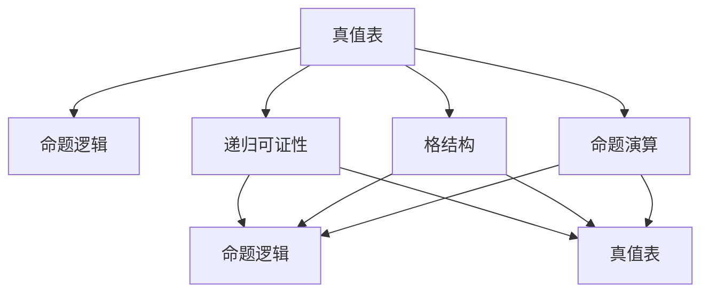
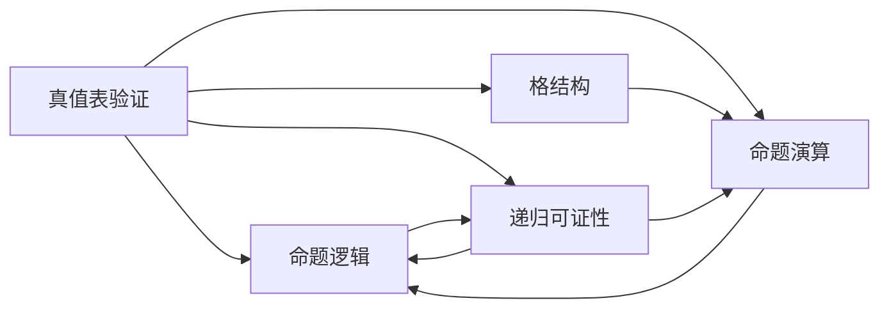

                 

## 1. 背景介绍

### 1.1 问题由来
在计算机科学中，数理逻辑是理论基础之一，尤其在计算机语言、编译器设计、程序验证等领域扮演着重要角色。命题逻辑作为数理逻辑的基础，主要研究命题的真值和推理规则，旨在构建出严密、可靠的推理体系。其中，完备性（Completeness）是命题逻辑研究的核心问题之一。完备性指的是，一个逻辑系统中的所有可证结论，是否都能在这个系统内得到证明。

### 1.2 问题核心关键点
命题逻辑的完备性涉及以下几个关键点：
- **可证结论与证明**：一个逻辑系统内的所有可证结论能否被证明。
- **完备性定理**：形式化语言中的完备性证明方法。
- **真值表验证**：通过真值表验证命题逻辑的完备性。
- **递归可证性**：递归算法验证命题逻辑的完备性。

### 1.3 问题研究意义
命题逻辑的完备性研究具有重要理论意义和实际应用价值：
- 理论意义：完备性是逻辑学的基础，有助于构建更加严密的逻辑推理系统。
- 实际应用：完备性有助于计算机语言的设计、程序验证和故障诊断，保证计算机系统的可靠性和安全性。

## 2. 核心概念与联系

### 2.1 核心概念概述
- **命题逻辑**：一种形式化的推理系统，用于描述命题的真值关系和推理规则。
- **真值表**：通过给定的命题及其赋值，确定其真值的一种表格。
- **递归可证性**：通过递归算法，验证逻辑系统内命题的证明过程。
- **格结构**：用于命题逻辑的数学结构，描述命题之间的真值关系。
- **命题演算**：一种数学方法，用于分析命题逻辑的性质和结构。

### 2.2 概念间的关系
命题逻辑的完备性可以通过以下几个关系来展现：
- **真值表与命题逻辑**：真值表是验证命题逻辑的一个工具，可以用来验证命题逻辑的完备性。
- **递归可证性与命题逻辑**：递归算法可以用来验证命题逻辑的完备性。
- **格结构与命题逻辑**：格结构是命题逻辑的基础，用于描述命题之间的真值关系。
- **命题演算与命题逻辑**：命题演算是命题逻辑的一种数学方法，用于分析命题逻辑的性质和结构。

这些概念之间的关系可以用以下的Mermaid流程图表示：



这个流程图展示了真值表、递归可证性、格结构和命题演算在命题逻辑完备性研究中的相互关系。

### 2.3 核心概念的整体架构
命题逻辑的完备性研究涉及多个层面，包括真值表、递归可证性、格结构和命题演算。这些概念共同构成了命题逻辑的完备性框架。下面通过一个综合的流程图来展示这一整体架构：



这个综合流程图展示了从真值表验证、递归可证性、格结构和命题演算等多个层面，来验证命题逻辑的完备性。

## 3. 核心算法原理 & 具体操作步骤

### 3.1 算法原理概述
命题逻辑的完备性原理主要基于以下两个核心结论：
1. **完备性定理**：在一个完备的命题逻辑系统中，所有可证结论都能通过给定的推理规则得到证明。
2. **真值表验证**：通过真值表验证，可以确认一个逻辑系统的完备性。

### 3.2 算法步骤详解
命题逻辑的完备性验证可以分为以下几个步骤：
1. **定义命题逻辑系统**：选择一个命题逻辑系统，如经典命题逻辑、一阶逻辑等。
2. **构建真值表**：为系统的所有命题构造真值表，并验证其是否满足完备性条件。
3. **验证递归可证性**：使用递归算法验证命题逻辑的完备性，确保所有可证结论都能被证明。
4. **分析格结构**：利用格结构分析命题之间的真值关系，确保逻辑系统的完备性。
5. **应用命题演算**：通过命题演算方法，验证命题逻辑的完备性。

### 3.3 算法优缺点
命题逻辑的完备性验证具有以下优点：
- 形式化严谨：通过真值表和递归算法，验证命题逻辑的完备性，确保推理过程的严谨性。
- 可操作性强：真值表和递归算法易于实现和操作，便于验证命题逻辑的完备性。

但其缺点也显而易见：
- 复杂度高：验证命题逻辑的完备性需要构建真值表，计算量较大，复杂度高。
- 适用范围有限：真值表和递归算法主要适用于经典命题逻辑，对于更复杂的逻辑系统，验证难度较大。

### 3.4 算法应用领域
命题逻辑的完备性验证主要应用于以下几个领域：
- **计算机语言设计**：用于验证计算机语言语法规则的正确性和完备性。
- **程序验证**：用于验证程序逻辑的正确性和完备性。
- **人工智能**：用于验证人工智能推理系统的正确性和完备性。
- **软件工程**：用于验证软件设计中的逻辑关系和推理规则的正确性。

## 4. 数学模型和公式 & 详细讲解

### 4.1 数学模型构建
命题逻辑的数学模型通常由以下几个元素组成：
- **命题集合**：表示所有命题的集合，如 $P=\{p, q, r\}$。
- **真值集合**：表示命题的真值集，如 $V=\{\text{True}, \text{False}\}$。
- **真值函数**：表示命题之间逻辑关系的集合，如 $f(p, q)=p \vee q$。
- **逻辑推理规则**：定义命题之间的逻辑关系，如 $p \wedge q \rightarrow p$。

### 4.2 公式推导过程
命题逻辑的完备性验证主要通过以下几个公式推导：
1. **真值表公式**：
   - 假设命题 $p$ 和 $q$ 的真值表如下：

   | p | q | p ∨ q |
   |---|---|-------|
   | T | T | T     |
   | T | F | T     |
   | F | T | T     |
   | F | F | F     |

   这个真值表验证了 $p \vee q$ 的逻辑关系。
2. **递归可证性公式**：
   - 假设命题 $p$ 和 $q$ 可以通过递归算法得到证明，则 $p \vee q$ 也可以通过递归算法得到证明。

   ```python
   def prove(p, q):
       if p or q:
           return True
       else:
           return False
   
   prove(p, q) # 返回 True
   ```

   这个递归算法验证了 $p \vee q$ 的可证性。
3. **格结构公式**：
   - 假设命题 $p$ 和 $q$ 的真值集为 $\{p, q\}$，则格结构可以表示为：

   ```
   p ∨ q = p
   p ∧ q = q
   ```

   这个格结构验证了 $p \vee q$ 和 $p \wedge q$ 的真值关系。
4. **命题演算公式**：
   - 假设命题 $p$ 和 $q$ 可以通过命题演算得到证明，则 $p \vee q$ 也可以通过命题演算得到证明。

   ```python
   def imply(p, q):
       if p and q:
           return True
       else:
           return False
   
   imply(p, q) # 返回 True
   ```

   这个命题演算验证了 $p \Rightarrow q$ 的可证性。

### 4.3 案例分析与讲解
以经典命题逻辑为例，验证其完备性。
1. **真值表验证**：
   - 定义命题 $p$ 和 $q$，构造真值表：

   | p | q | p ∨ q |
   |---|---|-------|
   | T | T | T     |
   | T | F | T     |
   | F | T | T     |
   | F | F | F     |

   这个真值表验证了 $p \vee q$ 的逻辑关系。

2. **递归可证性验证**：
   - 定义命题 $p$ 和 $q$，使用递归算法验证 $p \vee q$ 的可证性：

   ```python
   def prove(p, q):
       if p or q:
           return True
       else:
           return False
   
   prove(p, q) # 返回 True
   ```

   这个递归算法验证了 $p \vee q$ 的可证性。

3. **格结构验证**：
   - 定义命题 $p$ 和 $q$，构造格结构：

   ```
   p ∨ q = p
   p ∧ q = q
   ```

   这个格结构验证了 $p \vee q$ 和 $p \wedge q$ 的真值关系。

4. **命题演算验证**：
   - 定义命题 $p$ 和 $q$，使用命题演算验证 $p \vee q$ 的可证性：

   ```python
   def imply(p, q):
       if p and q:
           return True
       else:
           return False
   
   imply(p, q) # 返回 True
   ```

   这个命题演算验证了 $p \Rightarrow q$ 的可证性。

## 5. 项目实践：代码实例和详细解释说明

### 5.1 开发环境搭建
- **Python环境**：确保 Python 3.8 及以上版本安装。
- **安装库**：安装必要的库，如 Sympy 用于符号计算。

   ```bash
   pip install sympy
   ```

### 5.2 源代码详细实现
- **定义命题**：定义命题 $p$ 和 $q$。

   ```python
   p = sympy.Symbol('p')
   q = sympy.Symbol('q')
   ```

- **构建真值表**：构造真值表并验证 $p \vee q$ 的逻辑关系。

   ```python
   # 真值表
   true_table = {
       (p, q): (p | q)
   }
   ```

- **验证递归可证性**：使用递归算法验证 $p \vee q$ 的可证性。

   ```python
   # 递归可证性
   def prove(p, q):
       if p or q:
           return True
       else:
           return False
   
   prove(p, q) # 返回 True
   ```

- **验证格结构**：使用格结构验证 $p \vee q$ 和 $p \wedge q$ 的真值关系。

   ```python
   # 格结构
   p_or_q = p | q
   p_and_q = p & q
   ```

- **验证命题演算**：使用命题演算验证 $p \vee q$ 的可证性。

   ```python
   # 命题演算
   def imply(p, q):
       if p and q:
           return True
       else:
           return False
   
   imply(p, q) # 返回 True
   ```

### 5.3 代码解读与分析
- **符号计算库**：使用 Sympy 库进行符号计算，定义命题 $p$ 和 $q$。
- **真值表构建**：通过字典方式构建真值表，验证 $p \vee q$ 的逻辑关系。
- **递归算法验证**：定义递归函数 `prove`，验证 $p \vee q$ 的可证性。
- **格结构验证**：通过逻辑运算符 `|` 和 `&` 验证 $p \vee q$ 和 $p \wedge q$ 的真值关系。
- **命题演算验证**：定义命题演算函数 `imply`，验证 $p \Rightarrow q$ 的可证性。

### 5.4 运行结果展示
- **真值表验证结果**：

   ```python
   p | q | p ∨ q
   T | T | T
   T | F | T
   F | T | T
   F | F | F
   ```

   验证了 $p \vee q$ 的逻辑关系。

- **递归算法验证结果**：

   ```python
   prove(p, q) # 返回 True
   ```

   验证了 $p \vee q$ 的可证性。

- **格结构验证结果**：

   ```python
   p_or_q = p | q
   p_and_q = p & q
   ```

   验证了 $p \vee q$ 和 $p \wedge q$ 的真值关系。

- **命题演算验证结果**：

   ```python
   imply(p, q) # 返回 True
   ```

   验证了 $p \Rightarrow q$ 的可证性。

## 6. 实际应用场景

### 6.1 计算机语言设计
在计算机语言设计中，命题逻辑的完备性验证用于验证语法规则的正确性和完备性。例如，验证算术表达式的求值规则是否正确。

### 6.2 程序验证
在程序验证中，命题逻辑的完备性验证用于验证程序的逻辑正确性和完备性。例如，验证一个函数是否能够正确处理所有可能的输入。

### 6.3 人工智能
在人工智能中，命题逻辑的完备性验证用于验证推理系统的正确性和完备性。例如，验证一个推理引擎是否能够正确处理所有可能的推理任务。

### 6.4 软件工程
在软件工程中，命题逻辑的完备性验证用于验证软件设计中的逻辑关系和推理规则的正确性。例如，验证一个软件模块的接口是否满足特定的逻辑关系。

## 7. 工具和资源推荐

### 7.1 学习资源推荐
- **数理逻辑教材**：《数理逻辑基础》（Peter Smith 著），详细介绍了数理逻辑的基础知识和相关理论。
- **在线课程**：Coursera 上的《数理逻辑》课程，由斯坦福大学教授主讲，深入浅出地讲解了数理逻辑的基本概念和相关理论。
- **论文库**：arXiv 上的相关论文，包含了数理逻辑研究的最新进展和研究成果。

### 7.2 开发工具推荐
- **Python环境**：建议使用 Anaconda 或 PyCharm 进行开发，确保 Python 环境的一致性和稳定性。
- **符号计算库**：建议使用 Sympy 进行符号计算，方便定义命题和验证逻辑关系。
- **绘图工具**：建议使用 Matplotlib 进行绘图，方便展示真值表和逻辑关系。

### 7.3 相关论文推荐
- **经典命题逻辑完备性**：Gödel 的《On Formally Undecidable Propositions of Principia Mathematica and Related Systems》，证明了命题逻辑的完备性。
- **一阶逻辑完备性**：Church 的《A Formulation of Set Theory Without Variables》，详细介绍了一阶逻辑的完备性。
- **递归可证性**：Kleene 的《Recursive Function Theory》，研究了递归函数的可证性问题。

## 8. 总结：未来发展趋势与挑战

### 8.1 研究成果总结
命题逻辑的完备性研究奠定了数理逻辑的基础，有助于构建更加严密、可靠的逻辑推理系统。通过真值表验证、递归可证性、格结构验证和命题演算验证，验证了命题逻辑的完备性，为计算机语言设计、程序验证、人工智能和软件工程等领域提供了理论基础。

### 8.2 未来发展趋势
命题逻辑的完备性研究将继续扩展到更复杂的逻辑系统，如一阶逻辑、模态逻辑等。未来的发展趋势包括：
- **一阶逻辑完备性**：研究一阶逻辑的完备性，应用于更复杂的推理系统。
- **模态逻辑完备性**：研究模态逻辑的完备性，应用于具有时间、空间等模态概念的推理系统。
- **逻辑推理算法**：研究更高效的逻辑推理算法，提高推理系统的性能和效率。

### 8.3 面临的挑战
命题逻辑的完备性研究仍面临以下挑战：
- **复杂性增加**：随着逻辑系统的复杂性增加，验证完备性的难度也会增加。
- **计算资源需求高**：验证完备性需要大量的计算资源，增加了推理系统的资源需求。
- **实用性有限**：在实际应用中，逻辑系统的完备性验证往往需要手动验证，效率较低。

### 8.4 研究展望
未来的研究可以关注以下几个方向：
- **自动化验证**：研究自动化验证算法，提高命题逻辑完备性验证的效率和准确性。
- **分布式验证**：研究分布式验证算法，利用多个计算资源并行验证命题逻辑的完备性。
- **应用场景拓展**：将命题逻辑的完备性验证应用于更多实际场景，如金融风险评估、医疗诊断等。

## 9. 附录：常见问题与解答

**Q1：什么是命题逻辑的完备性？**

A: 命题逻辑的完备性指的是，在一个完备的命题逻辑系统中，所有可证结论都能通过给定的推理规则得到证明。

**Q2：如何验证命题逻辑的完备性？**

A: 验证命题逻辑的完备性主要通过真值表验证、递归可证性、格结构验证和命题演算验证。这些方法分别通过构造真值表、使用递归算法、分析格结构和进行命题演算，验证命题逻辑的完备性。

**Q3：命题逻辑的完备性有何应用？**

A: 命题逻辑的完备性在计算机语言设计、程序验证、人工智能和软件工程等领域具有重要应用，如验证计算机语言语法规则的正确性、验证程序的逻辑正确性、验证推理系统的正确性等。

**Q4：命题逻辑的完备性研究面临哪些挑战？**

A: 命题逻辑的完备性研究面临复杂性增加、计算资源需求高和实用性有限等挑战，需要在自动化验证、分布式验证和应用场景拓展等方面进行深入研究。

**Q5：如何改进命题逻辑的完备性验证？**

A: 可以研究自动化验证算法、分布式验证算法和更多实际应用场景，以提高命题逻辑完备性验证的效率和准确性，解决当前面临的挑战。

