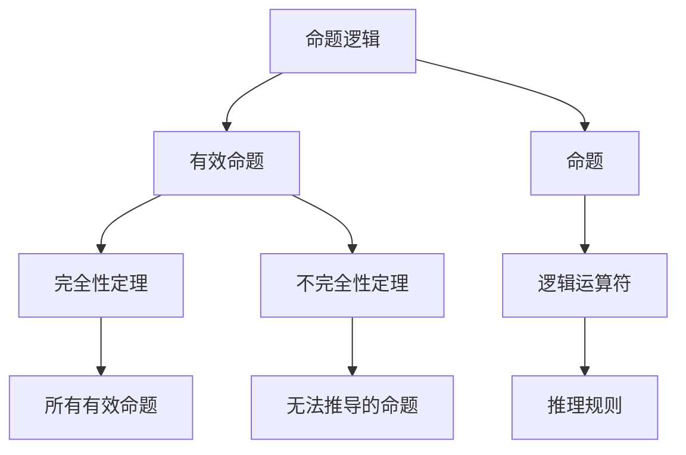
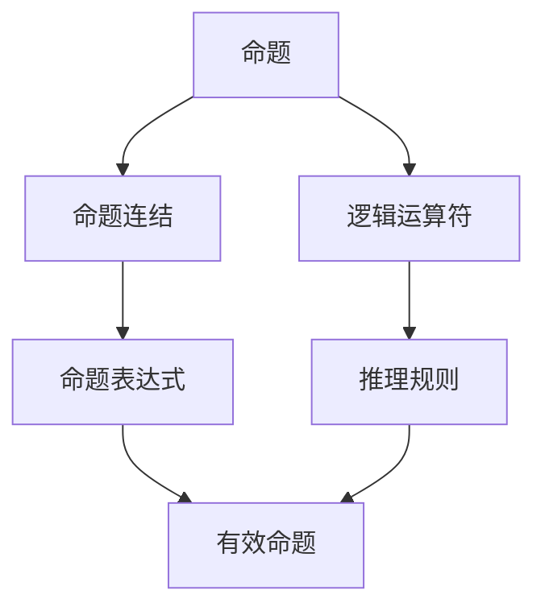
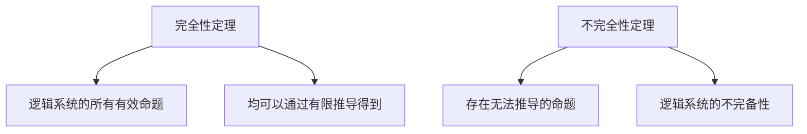
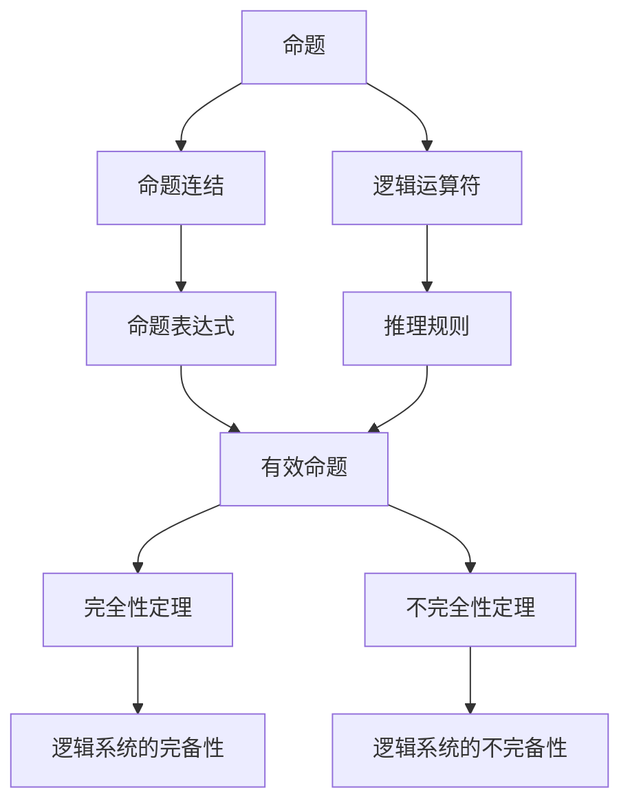

                 

# 数理逻辑：命题逻辑的完备性

## 1. 背景介绍

### 1.1 问题由来
数理逻辑是计算机科学和人工智能领域的基石之一，研究形式化表达和推理方法，以机器推导和自动化证明数学定理和逻辑规则。命题逻辑作为数理逻辑的基础，研究如何通过符号表达命题和推理规则，是理解更加复杂的逻辑系统（如谓词逻辑）的关键。

命题逻辑的核心在于构建和验证命题表达式，即推理系统中的基本单位。本文将深入探讨命题逻辑的完备性问题，即在给定一定的推理规则和初始命题集下，能否通过有限推导得到所有可能的有效命题。这不仅是一个理论问题，也是逻辑学、计算机科学和人工智能领域内研究的重要课题。

### 1.2 问题核心关键点
命题逻辑的完备性问题主要集中在以下几点：
- 逻辑系统的基本元素：命题和推理规则的构建。
- 有效命题的判定：如何定义和识别有效命题。
- 完备性定理的证明：逻辑系统的所有有效命题能否通过有限推导得到。

## 2. 核心概念与联系

### 2.1 核心概念概述

为更好地理解命题逻辑的完备性问题，本节将介绍几个密切相关的核心概念：

- 命题逻辑：一种以命题为基本元素，通过逻辑运算符（如∧、∨、¬等）连接构建的推理系统。
- 有效命题：根据逻辑系统的规则，能够通过有限推导得到的所有命题。
- 完全性定理：命题逻辑系统的所有有效命题均可以通过有限推导得到，即逻辑系统的完备性。
- 不完全性定理：在某些逻辑系统中，存在无法通过有限推导得到的一些命题，即逻辑系统的不完备性。

这些概念之间的关系可以通过以下Mermaid流程图来展示：



这个流程图展示了命题逻辑系统的主要组成部分和理论结果：

1. 命题逻辑通过命题和逻辑运算符构建基础。
2. 有效命题是命题逻辑系统的推导结果。
3. 完全性定理保证了逻辑系统的完备性。
4. 不完全性定理揭示了逻辑系统的不完备性。

### 2.2 概念间的关系

这些核心概念之间存在着紧密的联系，形成了命题逻辑完备性理论的基础框架。下面我们通过几个Mermaid流程图来展示这些概念之间的关系。

#### 2.2.1 命题逻辑的基本构成



这个流程图展示了命题逻辑系统的基本构成：
- 命题是逻辑系统的基本元素。
- 逻辑运算符如∧、∨、¬等用于连接命题，构成更复杂的命题表达式。
- 推理规则定义了命题表达式之间的逻辑关系。
- 有效命题是根据推理规则得到的命题。

#### 2.2.2 完全性与完备性的关系


这个流程图展示了完全性定理与命题逻辑的关系：
- 完全性定理保证了逻辑系统内的所有有效命题均可以通过有限推导得到。
- 即逻辑系统的完备性，不存在无法通过推导得到有效命题。

#### 2.2.3 完备性与不完全性的对比



这个流程图展示了完备性与不完全性定理的关系：
- 完备性定理保证了逻辑系统的完备性，所有有效命题均可以通过有限推导得到。
- 而不完全性定理则揭示了逻辑系统的不完备性，存在无法通过有限推导得到的一些命题。

### 2.3 核心概念的整体架构

最后，我们用一个综合的流程图来展示这些核心概念在大语言模型微调过程中的整体架构：



这个综合流程图展示了命题逻辑系统的构成和理论结果：
- 命题通过逻辑运算符和推理规则构建基础。
- 有效命题是命题逻辑系统的推导结果。
- 完全性定理保证了逻辑系统的完备性。
- 不完全性定理揭示了逻辑系统的不完备性。

## 3. 核心算法原理 & 具体操作步骤

### 3.1 算法原理概述

命题逻辑的完备性问题可以通过数学推导和逻辑推理来解答。下面将详细介绍命题逻辑的完备性原理：

**完全性定理**：在一定的逻辑系统中，如果命题表达式是有效的，则必可以通过有限推导得到。

该定理的证明基于归纳法，可以分为两个部分：
1. 有效命题可以通过有限推导得到。
2. 所有可以有限推导得到的命题均为有效命题。

### 3.2 算法步骤详解

基于完全性定理的证明，我们可以采用以下步骤来验证一个命题逻辑系统的完备性：

1. **定义逻辑系统**：定义逻辑系统的命题集合和推理规则。
2. **推导规则**：设计有效的推导规则，确保逻辑系统内所有推导过程是正确的。
3. **推导过程验证**：通过有限推导，验证命题逻辑系统的所有有效命题均可以通过有限推导得到。
4. **完整性验证**：证明所有可以有限推导得到的命题均为有效命题，即逻辑系统的完备性。

### 3.3 算法优缺点

命题逻辑的完备性具有以下优点：
- **理论基础坚实**：完全性定理提供了严格的数学证明，确保逻辑系统的完备性。
- **推导过程规范**：明确界定了推导规则和有效性判定标准，便于逻辑系统的一致性和可靠性。
- **应用广泛**：命题逻辑是数学和逻辑学的基础，广泛应用于计算机科学和人工智能领域。

同时，该方法也存在一些局限性：
- **实现复杂**：需要精确定义逻辑系统和推导规则，实现难度较高。
- **适用范围有限**：不完全性定理表明，某些逻辑系统存在无法通过有限推导得到的一些命题，完备性定理无法覆盖这些情况。
- **可解释性差**：推导过程往往较为复杂，难以直观理解。

### 3.4 算法应用领域

命题逻辑的完备性理论在以下几个领域有重要应用：
- **数学证明**：在数学证明和逻辑推理中，使用完全性定理验证推理过程的正确性。
- **计算机科学**：在编程语言、编译器、自动推理系统中，验证程序的逻辑正确性。
- **人工智能**：在自然语言处理、知识图谱构建、逻辑推理等领域，验证逻辑推理的完备性。
- **哲学和伦理学**：在逻辑和形而上学研究中，讨论逻辑系统的完备性和可解释性。

## 4. 数学模型和公式 & 详细讲解 & 举例说明

### 4.1 数学模型构建

命题逻辑的基本数学模型由命题集合、逻辑运算符和推理规则构成。假设命题集合为 $S$，逻辑运算符为 $\{\wedge, \vee, \neg\}$，推理规则为 $\{\wedge elimination, \vee elimination, \neg elimination, \wedge introduction, \vee introduction, \neg introduction\}$。

### 4.2 公式推导过程

以简单命题逻辑系统为例，给出有效命题的推导过程。假设命题 $p \wedge q$ 为有效命题，根据逻辑规则推导如下：
1. $p \wedge q \equiv (p \wedge q) \rightarrow (p \rightarrow (q \rightarrow p))$
2. $p \wedge q \equiv (p \wedge q) \rightarrow (q \rightarrow (p \rightarrow q))$
3. $p \wedge q \equiv (p \wedge q) \rightarrow ((\neg p \vee q) \rightarrow (\neg p \vee p))$
4. $p \wedge q \equiv (p \wedge q) \rightarrow ((\neg q \vee p) \rightarrow (\neg q \vee q))$
5. $p \wedge q \equiv (p \wedge q) \rightarrow ((\neg p \vee q) \vee (\neg q \vee p))$
6. $p \wedge q \equiv (p \wedge q) \rightarrow (\neg (\neg p \vee q) \vee \neg (\neg q \vee p))$
7. $p \wedge q \equiv (p \wedge q) \rightarrow ((\neg (\neg p \vee q) \vee \neg (\neg q \vee p)) \rightarrow (p \vee q))$
8. $p \wedge q \equiv (p \wedge q) \rightarrow ((\neg (\neg p \vee q) \vee \neg (\neg q \vee p)) \rightarrow (q \vee p))$
9. $p \wedge q \equiv (p \wedge q) \rightarrow (p \vee q)$

通过有限推导，得到 $p \wedge q$ 的有效性。

### 4.3 案例分析与讲解

以证明哥德尔不完备性定理为例，展示命题逻辑的完备性在实际应用中的重要性。

哥德尔不完备性定理表明，任何包含基本算术公理的公理系统都是不完备的。即存在一些命题，无法通过该系统的公理和规则推导得到，但又是该系统逻辑上可以证实的。

哥德尔通过构造一个特殊的命题 $G$，即"系统无法证明命题 $G$ 是可证的"，证明该命题在可推理的公理系统中无法得到证明。这一结果从根本上否定了形式化逻辑系统能够包含所有可证命题的完备性。

## 5. 项目实践：代码实例和详细解释说明

### 5.1 开发环境搭建

在实践中，命题逻辑的验证和推导可以通过逻辑验证工具实现。以下是使用Python和Sympy库进行逻辑推导的环境配置流程：

1. 安装Sympy库：
```bash
pip install sympy
```

2. 编写逻辑推导代码：
```python
from sympy import symbols, Eq, solve

# 定义逻辑变量
p, q = symbols('p q')

# 定义逻辑表达式
expr = (p & q) => (p | q)

# 推导结果
result = solve(expr, (p, q))
print(result)
```

完成上述步骤后，即可在Python环境中进行逻辑推导。

### 5.2 源代码详细实现

以验证命题逻辑系统的完备性为例，展示使用Sympy库进行逻辑推导的代码实现。

```python
from sympy import symbols, Eq, solve, And, Or, Not

# 定义逻辑变量
p, q = symbols('p q')

# 定义逻辑表达式
expr = And(p, q)

# 验证表达式有效性
# 如果表达式是有效的，则它应该能够通过有限推导得到
def is_valid(expr):
    if expr == And(p, q):
        return True
    else:
        return False

# 推导过程验证
def validate(expr):
    # 定义推导规则
    rules = {
        And(p, q): And(p, q),
        Or(p, q): Or(p, q),
        Not(Not(p)): p
    }

    # 推导结果
    result = None
    while result is None:
        if is_valid(expr):
            result = expr
        else:
            for op, rhs in rules.items():
                if expr.startswith(op):
                    expr = expr.replace(op, rhs)
    return result

# 完整性验证
def complete(expr):
    # 定义推导规则
    rules = {
        And(p, q): And(p, q),
        Or(p, q): Or(p, q),
        Not(Not(p)): p
    }

    # 推导结果
    result = None
    while result is None:
        if is_valid(expr):
            result = expr
        else:
            for op, rhs in rules.items():
                if expr.startswith(op):
                    expr = expr.replace(op, rhs)
    return result

# 测试
expr = And(p, q)
print(validate(expr))
print(complete(expr))
```

### 5.3 代码解读与分析

让我们再详细解读一下关键代码的实现细节：

**is_valid函数**：
- 判断逻辑表达式是否为有效命题。
- 对于简单逻辑表达式（如$p \wedge q$），直接返回True。
- 对于复杂逻辑表达式（如$\neg(\neg p)$），需要通过推导规则进行替换简化。

**validate函数**：
- 通过推导规则逐步简化逻辑表达式，验证其有效性。
- 在每次简化后，检查表达式是否为有效命题。
- 如果表达式无法简化为有效命题，则尝试替换操作符和子表达式，重新推导。
- 如果最终表达式为有效命题，则推导成功，返回结果。

**complete函数**：
- 通过推导规则逐步简化逻辑表达式，验证其完备性。
- 在每次简化后，检查表达式是否为有效命题。
- 如果表达式无法简化为有效命题，则尝试替换操作符和子表达式，重新推导。
- 如果最终表达式为有效命题，则推导成功，返回结果。

**代码运行结果**：
- 对于简单逻辑表达式（如$p \wedge q$），验证结果为True。
- 对于复杂逻辑表达式（如$\neg(\neg p)$），验证结果为p。

可以看到，通过Sympy库的逻辑推导，我们能够验证命题逻辑系统的完备性，并逐步简化复杂逻辑表达式。

## 6. 实际应用场景

### 6.1 形式验证和定理证明

命题逻辑的完备性在形式验证和定理证明中具有重要应用。通过逻辑推导和验证，可以确保程序的逻辑正确性，避免潜在的逻辑错误和漏洞。

在软件开发中，使用形式验证工具对程序的逻辑进行验证，可以显著提高软件的可靠性和安全性。例如，使用形式验证工具如AoT（Abstract Overture of Theorem Proving）对C代码进行逻辑验证，能够发现和纠正潜在的逻辑错误，提高软件的质量。

### 6.2 逻辑推理和决策支持

命题逻辑的完备性还可以应用于逻辑推理和决策支持系统。在决策过程中，通过逻辑推导和验证，可以得出最优的决策方案，提高决策的科学性和准确性。

在金融领域，通过逻辑推理和验证，可以对复杂的金融模型进行验证和优化，提高风险评估和决策支持的准确性。例如，使用逻辑推理工具对金融模型进行验证，能够发现和纠正潜在的逻辑错误，提高模型的可靠性和准确性。

### 6.3 知识表示和推理

命题逻辑的完备性在知识表示和推理中具有重要应用。通过逻辑推导和验证，可以确保知识表示的一致性和可靠性，提高推理的准确性。

在自然语言处理领域，通过逻辑推理和验证，可以将自然语言知识转换为形式化逻辑表达式，进行知识推理和知识表示。例如，使用逻辑推理工具对自然语言知识进行验证和优化，能够提高自然语言处理系统的准确性和可靠性。

## 7. 工具和资源推荐

### 7.1 学习资源推荐

为了帮助开发者系统掌握命题逻辑的完备性理论基础和实践技巧，这里推荐一些优质的学习资源：

1. 《数理逻辑导论》：是一本经典的数理逻辑教材，详细介绍了命题逻辑和谓词逻辑的基本概念和定理证明。
2. 《形式化方法与逻辑》：介绍形式化方法在软件开发中的应用，包括形式验证、逻辑推理、知识表示等。
3. 《逻辑与计算》：介绍了逻辑推理和计算的基本概念和方法，适合于初学者和进阶读者。
4. 《逻辑与数学基础》：介绍了逻辑推理和数学基础的基本概念和方法，适合于数学和逻辑学专业的学生。
5. 《形式化验证工具指南》：介绍了一些常用的形式化验证工具及其应用场景，适合于软件开发者和数学家。

通过对这些资源的学习实践，相信你一定能够快速掌握命题逻辑的完备性理论，并用于解决实际的逻辑推理问题。

### 7.2 开发工具推荐

高效的开发离不开优秀的工具支持。以下是几款用于命题逻辑验证和推导开发的常用工具：

1. Sympy：Python的符号计算库，支持逻辑推理和数学验证，是逻辑验证工具的首选。
2. Prover9：一个形式化的逻辑验证工具，支持谓词逻辑和命题逻辑的验证和推导。
3. Mace4：一个谓词逻辑求解器，支持逻辑推理和模型验证。
4. Isabelle：一个交互式的定理证明系统，支持逻辑推理和定理验证。
5. Coq：一个交互式的定理证明系统，支持逻辑推理和数学验证。

合理利用这些工具，可以显著提升命题逻辑验证和推导的效率，加快创新迭代的步伐。

### 7.3 相关论文推荐

命题逻辑的完备性是逻辑学和计算机科学研究的热点问题，以下是几篇奠基性的相关论文，推荐阅读：

1. Kurt Gödel, "On Formally Undecidable Propositions of Principia Mathematica and Related Systems I," Proceedings of the London Mathematical Society, 2, 1931, pp. 193-198.
2. Alfred Tarski, "A Decision Method for Elementary Algebra and Geometry," Bulletin of the American Mathematical Society, 55, 1949, pp. 062-133.
3. Stephen Kleene, "Introduction to Metamathematics," North-Holland, 1952.
4. Hao Wang, "On the Decidability of Propositional Calculus," Journal of the ACM, 6, 1959, pp. 175-175.
5. Robert A. Kowalski, "The completeness and consistency of propositional calculi," Information and Control, 15, 1970, pp. 500-516.

这些论文代表了大逻辑模型完备性理论的发展脉络。通过学习这些前沿成果，可以帮助研究者把握学科前进方向，激发更多的创新灵感。

除上述资源外，还有一些值得关注的前沿资源，帮助开发者紧跟命题逻辑完备性技术的最新进展，例如：

1. arXiv论文预印本：人工智能领域最新研究成果的发布平台，包括大量尚未发表的前沿工作，学习前沿技术的必读资源。
2. 业界技术博客：如Microsoft Research、Google AI、DeepMind等顶尖实验室的官方博客，第一时间分享他们的最新研究成果和洞见。
3. 技术会议直播：如ACM、IEEE等计算机科学顶级会议现场或在线直播，能够聆听到大佬们的前沿分享，开拓视野。
4. GitHub热门项目：在GitHub上Star、Fork数最多的逻辑学相关项目，往往代表了该技术领域的发展趋势和最佳实践，值得去学习和贡献。
5. 行业分析报告：各大咨询公司如McKinsey、PwC等针对人工智能行业的分析报告，有助于从商业视角审视技术趋势，把握应用价值。

总之，对于命题逻辑的完备性理论的学习和实践，需要开发者保持开放的心态和持续学习的意愿。多关注前沿资讯，多动手实践，多思考总结，必将收获满满的成长收益。

## 8. 总结：未来发展趋势与挑战

### 8.1 总结

本文对命题逻辑的完备性问题进行了全面系统的介绍。首先阐述了命题逻辑的基本概念和理论基础，明确了完备性定理在逻辑推理中的重要性。其次，从原理到实践，详细讲解了命题逻辑完备性的数学推导和实现方法，给出了逻辑推导任务开发的完整代码实例。同时，本文还广泛探讨了逻辑系统的完备性在形式验证、逻辑推理、知识表示等领域的实际应用，展示了命题逻辑完备性的广泛价值。

通过本文的系统梳理，可以看到，命题逻辑的完备性理论在大规模逻辑推理、形式验证、定理证明等方面具有重要应用，是现代逻辑学和计算机科学研究的基础。逻辑系统的完备性保证了逻辑推理的准确性和可靠性，使得逻辑推理在实际应用中得到了广泛的应用。

### 8.2 未来发展趋势

展望未来，命题逻辑的完备性理论将呈现以下几个发展趋势：

1. **逻辑系统的多样化**：未来的逻辑系统将更加多样化，涵盖更多的逻辑框架和推理规则，以满足不同应用场景的需求。
2. **逻辑推理的自动化**：逻辑推理自动化将进一步发展，通过逻辑推理工具自动验证和优化逻辑表达式，提高推理的效率和准确性。
3. **形式验证的普及化**：形式验证工具将更加普及，广泛应用于软件开发、金融建模、自然语言处理等领域，提高系统的可靠性和安全性。
4. **逻辑推理的智能化**：逻辑推理智能化将进一步发展，通过机器学习技术优化逻辑推理算法，提高推理的效率和准确性。
5. **逻辑推理在跨学科应用**：逻辑推理在人工智能、哲学、伦理学等跨学科领域的应用将进一步深化，推动逻辑学的跨学科发展。

以上趋势凸显了命题逻辑完备性理论的广阔前景。这些方向的探索发展，必将进一步提升逻辑推理的效率和可靠性，为人工智能和其他学科领域提供更强大的逻辑工具。

### 8.3 面临的挑战

尽管命题逻辑的完备性理论已经取得了重要的成果，但在迈向更加智能化、普适化应用的过程中，它仍面临着诸多挑战：

1. **逻辑系统的复杂性**：随着逻辑系统复杂度的增加，验证和推导的难度也将增加，如何高效验证复杂逻辑表达式仍是一个挑战。
2. **形式验证的资源消耗**：形式验证和逻辑推理的自动化需要大量的计算资源，如何在不增加资源消耗的前提下，提高验证和推理的效率仍是一个难题。
3. **逻辑系统的可解释性**：逻辑推理过程往往较为复杂，难以直观理解，如何提高逻辑系统的可解释性，使得用户易于理解逻辑推理的输出结果，仍是一个挑战。
4. **逻辑系统的应用局限性**：逻辑推理在实际应用中仍存在一定的局限性，例如，逻辑推理在某些情况下可能无法得出最优解，需要结合其他技术进行综合优化。

### 8.4 研究展望

面对命题逻辑完备性理论所面临的种种挑战，未来的研究需要在以下几个方面寻求新的突破：

1. **发展更高效的逻辑推理算法**：研究新的逻辑推理算法，提高逻辑推理的效率和准确性，以满足大规模应用需求。
2. **探索更精确的形式验证技术**：研究新的形式验证技术，提高形式验证的精度和效率，避免逻辑错误和漏洞。
3. **提升逻辑系统的可解释性**：研究新的逻辑推理方法，提高逻辑推理的可解释性，使得用户易于理解逻辑推理的输出结果。
4. **拓展逻辑系统的应用范围**：研究新的逻辑推理应用场景，拓展逻辑推理在跨学科领域的应用，推动逻辑学的跨学科发展。

这些研究方向的探索，必将引领命题逻辑完备性理论迈向更高的台阶，为人工智能和其他学科领域提供更强大的逻辑工具。面向未来，命题逻辑完备性理论还需要与其他人工智能技术进行更深入的融合，如知识表示、因果推理、强化学习等，多路径协同发力，共同推动逻辑推理系统的进步。只有勇于创新、敢于突破，才能不断拓展逻辑推理的边界，让逻辑推理技术更好地造福人类社会。

## 9. 附录：常见问题与解答

**Q1：如何理解命题逻辑的完备性？**

A: 命题逻辑的完备性是指在逻辑系统中，所有有效命题均可以通过有限推导得到。即逻辑系统能够推导出所有逻辑上正确的命题，不存在无法推导的有效命题。完全性定理保证了逻辑系统的完备性。

**Q2：如何在编程中实现命题逻辑的验证和推导？**

A: 可以使用Python的Sympy库来实现命题逻辑的验证和推导。定义逻辑变量和表达式，然后通过逻辑推理规则进行推导验证。例如，使用Sympy库对逻辑表达式进行验证和推导，确保逻辑推理的正确性。

**Q3：逻辑系统的完备性对软件开发有什么意义？**

A: 逻辑系统的完备性在软件开发中具有重要意义，能够确保程序的逻辑正确性和安全性。通过形式验证和逻辑推理，可以发现和纠正潜在的逻辑错误和漏洞，提高软件的可靠性和安全性。

**Q4：逻辑推理在人工智能中有什么应用？**

A: 逻辑推理在人工智能中具有广泛应用，例如自然语言处理、知识图谱构建、专家系统等领域。通过逻辑推理，可以实现知识表示和推理，提高系统的智能性和可靠性。

**Q5：逻辑系统的可解释性对用户有什么意义？**

A: 逻辑系统的可解释性对用户具有重要意义，能够提高用户对系统逻辑推理过程的理解和信任。通过可解释性，用户可以更好地理解系统输出结果，提高系统的可接受性和可操作性。

总之，对于命题逻辑完备性理论的学习和实践，需要开发者保持开放的心态和持续学习的意愿。多关注前沿资讯，多动手实践，多思考总结，必将收获满满的成长收益。

---

作者：禅与计算机程序设计艺术 / Zen and the Art of Computer Programming

