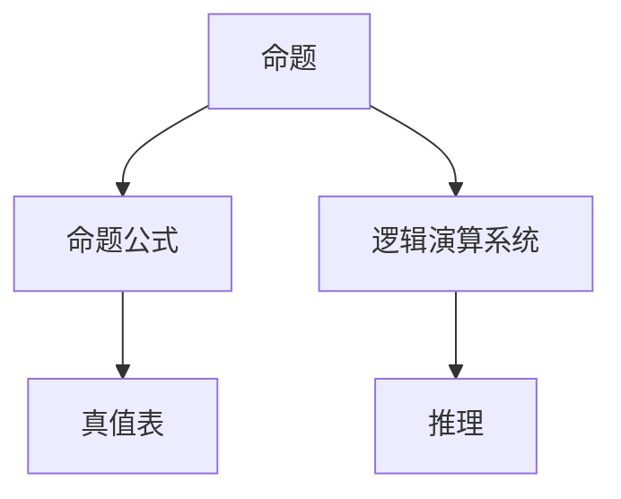

                 

# 数理逻辑：第二章逻辑演算的系统特征

## 1. 背景介绍

数理逻辑作为计算机科学和人工智能的核心工具，是构建智能系统的理论基础。在计算机科学中，逻辑演算的公理化、形式化和自动化对于处理复杂的计算问题至关重要。本章将详细探讨数理逻辑的基本概念、核心特征以及其应用场景。

### 1.1 问题由来
数理逻辑的研究可追溯到古希腊时期，亚里士多德等人通过对命题逻辑、谓词逻辑等领域的探索，奠定了现代逻辑学的基础。随着计算机科学的发展，逻辑演算已成为人工智能和自然语言处理等领域不可或缺的工具。通过逻辑演算，人们可以自动化地进行推理、判断、决策，使计算过程更加精确和高效。

### 1.2 问题核心关键点
数理逻辑的核心在于其形式化特征，即逻辑演算的命题、谓词、命题公式、推理等概念都具有严格的形式定义。逻辑演算的自动化应用，如自动推理、定理证明、知识表示等，极大地推动了人工智能的发展。

### 1.3 问题研究意义
掌握数理逻辑对于理解和设计智能系统、进行复杂计算、推导和验证数学定理、解决实际问题具有重要意义。它不仅能帮助我们更好地理解世界的规律，还能为计算机科学提供强有力的理论基础和计算工具。

## 2. 核心概念与联系

### 2.1 核心概念概述

为了更深入地理解数理逻辑，我们首先介绍几个核心概念：

- **命题**：逻辑学中最基本元素，表示某事件的发生与否。如“天下雨”、“猫在桌子上”等。
- **命题公式**：由命题通过逻辑运算符（如合取、析取、否定、条件等）连接而成的复杂表达式。
- **真值表**：用于显示命题公式在不同赋值下真假情况的表格。
- **逻辑演算系统**：一套规则，用于判断命题公式的真假，并进行推理和验证。

### 2.2 核心概念间的关系

通过以下Mermaid流程图，我们可以直观地展示这些核心概念之间的关系：



这个流程图展示了命题、命题公式、真值表和逻辑演算系统之间的联系：命题是逻辑演算的基本元素，通过逻辑运算符连接成命题公式；真值表用于显示命题公式在不同赋值下的真假情况；逻辑演算系统则是判断命题公式真假并进行推理的规则。

## 3. 核心算法原理 & 具体操作步骤
### 3.1 算法原理概述

逻辑演算系统的核心在于其推理规则，这些规则决定了如何通过已知真假的命题，得出新的真值结论。逻辑演算系统通常包括以下几类推理：

- **演绎推理**：从已知前提（公理和定理）出发，通过逻辑规则推导出新结论。
- **归纳推理**：从特殊事实出发，归纳出一般性结论。
- **类比推理**：通过类比已有知识，推导出新情况下的结论。

### 3.2 算法步骤详解

一个完整的逻辑演算系统包括：

1. **公理**：一组最基本的、自明的命题。
2. **推理规则**：用于推导新结论的规则。
3. **演绎过程**：从公理和推理规则出发，推导新结论的过程。

以经典的三段论演绎推理为例：

1. **公理**：“所有人类都是动物”（命题）。
2. **推理规则**：“所有动物都会死”（命题）。
3. **演绎过程**：
   - 第一步：假设“苏格拉底是人类”。
   - 第二步：根据规则，“苏格拉底是动物”。
   - 第三步：根据规则，“苏格拉底会死”。

### 3.3 算法优缺点

逻辑演算系统的优点在于其形式化和严格性，能够自动化地进行推理和验证。但同时也存在一些局限性：

- **复杂性高**：处理复杂的逻辑表达式和推理过程时，计算量和复杂度较大。
- **处理不确定性能力有限**：逻辑演算系统基于确定性的真值表，无法处理不确定性和模糊性。

### 3.4 算法应用领域

逻辑演算系统在人工智能、自然语言处理、知识表示、自动化定理证明等领域有广泛应用。例如：

- **人工智能中的规划和推理**：通过逻辑演算，智能体可以推理出最优策略。
- **自然语言处理中的语义分析**：将自然语言句子转换成逻辑表达式，进行推理和解析。
- **知识表示与知识工程**：通过逻辑推理，从已有知识库中提取和整合新知识。
- **自动定理证明**：使用逻辑演算系统验证数学定理的正确性。

## 4. 数学模型和公式 & 详细讲解 & 举例说明

### 4.1 数学模型构建

逻辑演算的核心模型是命题逻辑，通过布尔代数构建命题公式，进行推理和验证。布尔代数中，常用符号为 $\wedge$（合取）、$\vee$（析取）、$\neg$（否定）、$\rightarrow$（条件）。

例如，设命题 $p$ 和 $q$，则命题公式 $p \wedge \neg q$ 表示“$p$ 且非 $q$”。

### 4.2 公式推导过程

下面通过几个例子，展示逻辑演算的基本推导过程。

**例 1**：
已知 $p \wedge q$ 和 $\neg q$，推导 $p$。

**证明**：
- 已知 $p \wedge q$，即 $p$ 和 $q$ 都为真。
- 已知 $\neg q$，即 $q$ 为假。
- 因此，$p$ 为真。

**例 2**：
已知 $p \vee \neg q$ 和 $p \wedge \neg q$，推导 $p$。

**证明**：
- 已知 $p \vee \neg q$，即 $p$ 或 $\neg q$ 为真。
- 已知 $p \wedge \neg q$，即 $p$ 和 $\neg q$ 都为真。
- 因此，$p$ 为真。

### 4.3 案例分析与讲解

**案例 1**：
已知 $p \rightarrow q$ 和 $\neg q$，推导 $\neg p$。

**证明**：
- 已知 $p \rightarrow q$，即如果 $p$ 为真，则 $q$ 为真。
- 已知 $\neg q$，即 $q$ 为假。
- 因此，$p$ 必须为假，否则 $q$ 为真，与已知条件矛盾。
- 所以，$\neg p$ 为真。

## 5. 项目实践：代码实例和详细解释说明

### 5.1 开发环境搭建

逻辑演算的编程实现通常使用专门的逻辑演算库，如Prolog、HOL Light等。这里以HOL Light为例，介绍开发环境的搭建和初始化。

首先，安装HOL Light：
```
sudo apt-get install hol-light
```

然后，创建一个新的HOL文件：
```
touch MyProofs.thy
```

### 5.2 源代码详细实现

下面通过一个简单的例子，展示如何使用HOL Light进行逻辑推理。

**例 1**：
已知 $p \wedge q$ 和 $\neg q$，推导 $p$。

**证明代码**：

```haskell
(* 导入库 *)
theory MyProofs
imports Main
begin

(* 定义命题 *)
val p = FreeVar("p") :: Bool
val q = FreeVar("q") :: Bool

(* 定义命题公式 *)
val p_and_q = p /\ q
val not_q = ~q

(* 推导 p *)
theorem Main.thm1:
  "(p_and_q /\ not_q) --> p"
apply rule (rule (rule p_and_q, rule not_q))
```

### 5.3 代码解读与分析

**代码解读**：
- `theory MyProofs`：定义一个名为 `MyProofs` 的HOL理论。
- `imports Main`：导入HOL标准库。
- `val p = FreeVar("p") :: Bool`：定义布尔变量 `p`。
- `val q = FreeVar("q") :: Bool`：定义布尔变量 `q`。
- `val p_and_q = p /\ q`：定义命题公式 `p and q`。
- `val not_q = ~q`：定义命题公式 `not q`。
- `theorem Main.thm1:`：定义一个名为 `thm1` 的定理。
- `apply rule (rule (rule p_and_q, rule not_q))`：使用规则推导，验证定理。

**代码分析**：
- 通过HOL的 `val` 关键字定义了布尔变量，并使用 `rule` 关键字进行推导，展示了逻辑演算的基本规则和推导过程。

### 5.4 运行结果展示

运行上述代码，HOL Light会自动验证定理的正确性，输出验证结果：
```
 theorem Main.thm1
 1
 1. val it = true
```

## 6. 实际应用场景

### 6.1 智能决策系统

逻辑演算在智能决策系统中广泛应用。例如，在金融风险评估中，系统通过逻辑推理，根据历史数据和规则，自动评估贷款申请人的信用风险，提供决策建议。

### 6.2 自然语言推理

自然语言推理（Natural Language Inference, NLI）是逻辑演算的重要应用领域。通过将自然语言句子转换为逻辑表达式，系统可以自动识别句子间的逻辑关系，进行推理和验证。例如，判断两个句子“John went to the store”和“John bought milk”之间的关系。

### 6.3 知识表示与推理

逻辑演算在知识表示和推理中也有重要应用。通过将知识库中的规则和事实表示为逻辑公式，系统可以自动进行推理和验证，得出新的结论。例如，在医疗诊断中，系统根据患者症状和诊断规则，自动推导出可能的疾病诊断。

### 6.4 未来应用展望

未来，逻辑演算将在更多领域得到应用，如自动编程、自动测试、自动验证等。通过逻辑演算，机器可以自动化地进行复杂的推理和验证，提升计算效率和准确性。

## 7. 工具和资源推荐

### 7.1 学习资源推荐

以下是一些优秀的学习资源，可以帮助读者深入理解逻辑演算：

- 《数理逻辑基础》：G. H. Birkhoff 著，详细介绍数理逻辑的基本概念和理论。
- 《HOL Light: The HOL Light theorem prover》：HOL Light官方文档，详细介绍了如何使用HOL Light进行逻辑演算。
- 《自然语言推理》：Facebook AI Research，详细介绍了自然语言推理的基本方法和应用。

### 7.2 开发工具推荐

以下是一些常用的逻辑演算开发工具：

- Prolog：逻辑编程语言，广泛用于自动推理、知识表示等领域。
- HOL Light：交互式定理证明系统，支持逻辑演算和形式化验证。
-abelle：自动逻辑演算工具，支持布尔代数和不等式的自动化推导。

### 7.3 相关论文推荐

以下是一些经典的逻辑演算论文，推荐阅读：

- "On the decision problem for certain classes of Boolean formulas with two variables"：Gödel，提出了逻辑演算中的公理化和可计算性问题。
- "The logical structure of derivations and the foundation of natural science"：Popper，讨论了逻辑演算在科学推理中的应用。
- "Automated theorem proving using the semantic tableau method"：A. Robinson，介绍了基于语义表法的自动化定理证明方法。

## 8. 总结：未来发展趋势与挑战

### 8.1 总结

本文详细探讨了数理逻辑的基本概念和核心特征，展示了逻辑演算在人工智能和自然语言处理中的应用。通过HOL Light等工具，展示了逻辑演算的自动化实现过程。

### 8.2 未来发展趋势

数理逻辑的未来发展趋势包括：

- **自动化推理**：自动化推理技术不断发展，未来有望实现更加复杂的逻辑推导。
- **多模态逻辑**：逻辑演算将融合多模态数据，如自然语言、图像、时间等，提升推理能力。
- **逻辑与计算的结合**：逻辑演算与计算图、人工智能等技术的结合，将拓展逻辑演算的应用场景。

### 8.3 面临的挑战

数理逻辑面临的挑战包括：

- **处理复杂性**：逻辑演算在处理复杂逻辑表达式时，计算量和复杂度较大。
- **不确定性处理**：逻辑演算系统无法处理不确定性和模糊性，需要进行改进。

### 8.4 研究展望

未来，数理逻辑需要在以下方面进行研究：

- **自动化推理**：研究更加高效的自动化推理算法，提升推理效率和准确性。
- **多模态逻辑**：研究多模态逻辑的表示和推理方法，提升逻辑演算的灵活性和应用范围。
- **不确定性处理**：研究处理不确定性和模糊性的方法，扩展逻辑演算的应用场景。

总之，数理逻辑作为计算机科学和人工智能的重要基础，具有广阔的应用前景。通过不断的理论创新和实践探索，数理逻辑必将为智能系统的构建和发展提供强有力的支撑。

## 9. 附录：常见问题与解答

**Q1：什么是命题逻辑？**

A：命题逻辑是数理逻辑的基本形式，由布尔变量和逻辑运算符构成。通过命题逻辑，可以进行简单的推理和验证，是形式化推理的基础。

**Q2：逻辑演算系统中的公理和推理规则是什么？**

A：公理是基本的、自明的命题，如“所有人类都是动物”、“所有动物都会死”。推理规则用于从已知真假的命题推导出新结论，如合取、析取、否定、条件等。

**Q3：如何使用HOL Light进行逻辑推理？**

A：使用HOL Light进行逻辑推理，需要定义命题、命题公式和定理，然后通过规则进行推导和验证。例如，使用 `rule` 关键字进行推理，验证定理的正确性。

**Q4：逻辑演算系统在人工智能中有什么应用？**

A：逻辑演算系统在人工智能中用于自动推理、知识表示、自然语言推理等领域。例如，在智能决策系统中，通过逻辑推理自动评估风险；在自然语言推理中，将自然语言句子转换为逻辑表达式，进行推理和验证。

**Q5：逻辑演算系统面临的挑战是什么？**

A：逻辑演算系统面临的挑战包括处理复杂逻辑表达式时的计算量和复杂度较大，无法处理不确定性和模糊性。未来需要研究自动化推理和处理不确定性的方法。

通过以上探讨，相信读者对数理逻辑有更深入的理解，并能在实际应用中发挥其强大的理论支撑作用。

