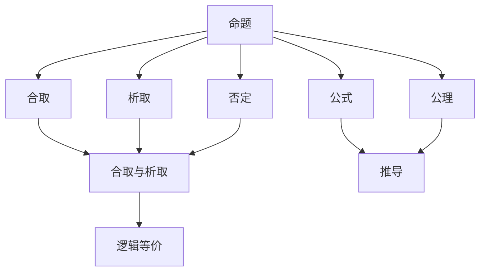

                 

## 1. 背景介绍

### 1.1 问题由来

数理逻辑作为数学的一个分支，研究的是形式化的推理系统。在人工智能、计算机科学等领域，数理逻辑提供了理论基础和数学工具，用于描述和验证程序正确性，构建高效的算法和系统。

数理逻辑的核心在于构造和分析逻辑系统，其基本目标是要构建一个形式化、严谨的推理框架，能够正确地表示和验证命题、推导和证明。从古希腊的亚里士多德逻辑到现代的集合论、哥德尔不完备定理，数理逻辑的发展已经历了多个阶段。

### 1.2 问题核心关键点

数理逻辑的研究覆盖了从古典逻辑到现代形式系统、从语义分析到推理验证的各个方面。关键点在于构建可验证的逻辑系统，使之能够表示和推导数学和计算机科学的命题。通过形式化推理，数理逻辑提供了一种验证算法正确性和可靠性的方法，这在人工智能领域尤为重要。

具体来说，数理逻辑用于构建符号表达式，验证程序的正确性，推理和证明算法的效果，以及建立形式化方法来描述和验证复杂的系统。它在人工智能中的应用包括但不限于：

- 逻辑规划：用于知识表示和推理，构建专家系统和决策支持系统。
- 模型检查：验证软件和硬件系统的行为是否符合设计规范。
- 定理证明：自动证明算法和系统的正确性，避免人为错误。
- 语言和形式化方法：用于自然语言处理、编译器设计和编程语言理论。

### 1.3 问题研究意义

研究数理逻辑对于人工智能和其他科学领域具有重要意义：

1. 理论基础：数理逻辑提供了形式化推理的工具和方法，用于验证程序的正确性和可靠性。
2. 应用范围：逻辑在知识表示、自然语言处理、程序验证、人工智能等领域有广泛的应用。
3. 普适性：逻辑是数学的基础，逻辑系统的构建有助于数学和计算机科学的跨学科研究。
4. 规范性：逻辑提供了严格的形式化定义，有助于消除模糊和歧义，提高算法和系统的可信度。
5. 创新性：逻辑系统的扩展和推理方法的改进，可以推动人工智能技术和数学理论的发展。

## 2. 核心概念与联系

### 2.1 核心概念概述

数理逻辑研究的是形式化的推理系统。下面将介绍一些关键概念：

- 命题：最基本的逻辑单元，可以是真或假。
- 合取、析取和否定：逻辑运算符，用于组合和变换命题。
- 逻辑等价：命题逻辑和谓词逻辑中的相等关系，用于验证推理的正确性。
- 模型：一组满足特定逻辑系统的命题的赋值，表示一个逻辑系统可能的解释。
- 公式：命题的组合和变换，用于描述和推导逻辑系统的命题。
- 推导：基于逻辑系统的推理规则，从一组命题推导出新的命题。
- 公理和推理规则：逻辑系统的基础规则，用于定义和推导命题。

这些概念构成了数理逻辑的基本框架，用于定义和分析逻辑系统，以及推理和验证命题。

### 2.2 概念间的关系

这些核心概念之间的关系可以通过以下Mermaid流程图来展示：



这个流程图展示了数理逻辑中主要概念的相互关系：

1. 命题是逻辑系统的基本单元。
2. 合取、析取和否定是逻辑运算符，用于组合和变换命题。
3. 逻辑等价用于验证推理的正确性。
4. 模型是命题的满足集合，表示逻辑系统可能的解释。
5. 公式是由命题通过逻辑运算符组成的表达式，用于描述和推导命题。
6. 推导基于公理和推理规则，从一组命题推导出新的命题。
7. 公理是逻辑系统的基础规则，用于定义和推导命题。

## 3. 核心算法原理 & 具体操作步骤

### 3.1 算法原理概述

数理逻辑的核心算法是定理证明和模型检查。

定理证明的目标是，从一组公理和推理规则出发，推导出逻辑系统中的命题。其基本思路是，利用已知的公理和推理规则，逐步推导目标命题，直到目标命题被证明。

模型检查的目标是，验证逻辑系统中的命题是否满足某些特定的模型，即是否存在一组赋值满足该命题。其基本思路是，枚举所有可能的赋值，检查每个赋值是否满足命题，从而确定命题是否为真。

### 3.2 算法步骤详解

#### 3.2.1 定理证明步骤

1. **构建知识库**：将已知的公理和事实输入到定理证明系统中，构成知识库。
2. **目标命题**：确定需要证明的目标命题。
3. **推导过程**：利用推理规则和公理，从知识库中逐步推导出目标命题。
4. **验证结果**：对推导过程中生成的所有命题进行验证，确保每个命题在知识库中都有对应的事实或推理规则支持。
5. **输出结果**：如果目标命题被证明，则输出证明结果。否则，返回错误。

#### 3.2.2 模型检查步骤

1. **构建逻辑系统**：定义逻辑系统的规则和公理。
2. **目标命题**：确定需要检查的目标命题。
3. **模型枚举**：枚举所有可能的模型，即所有可能的命题赋值。
4. **验证模型**：对每个模型，检查是否满足目标命题。
5. **输出结果**：如果存在满足目标命题的模型，则输出验证结果为真。否则，输出验证结果为假。

### 3.3 算法优缺点

#### 3.3.1 定理证明的优缺点

优点：
- 严格性：定理证明的过程是严格的，保证了证明结果的正确性。
- 形式化：定理证明依赖于形式化的方法，可以避免逻辑上的模糊和歧义。
- 自动化：现代定理证明系统能够自动推导命题，提高效率。

缺点：
- 复杂性：定理证明过程可能非常复杂，特别是对于复杂系统。
- 不完全性：存在无法证明为真或假的命题，即哥德尔不完备定理。
- 资源消耗：定理证明需要大量计算资源，对于大规模系统可能不适用。

#### 3.3.2 模型检查的优缺点

优点：
- 全面性：模型检查能够检查所有可能的模型，保证了验证的全面性。
- 效率高：对于小规模逻辑系统，模型检查可以高效验证。
- 形式化：模型检查依赖于形式化的方法，可以避免逻辑上的模糊和歧义。

缺点：
- 资源消耗：模型检查需要枚举所有可能的模型，对于大规模系统可能不适用。
- 复杂性：模型检查过程可能非常复杂，特别是对于复杂系统。
- 不完全性：存在无法验证为真或假的命题。

### 3.4 算法应用领域

数理逻辑广泛应用于人工智能和计算机科学领域，具体应用包括：

- 程序验证：利用模型检查技术，验证软件和硬件系统的行为是否符合设计规范。
- 逻辑规划：利用逻辑规划技术，建立知识表示和推理系统，用于专家系统和决策支持系统。
- 自然语言处理：利用逻辑表示技术，处理自然语言中的语义和语法结构。
- 形式化方法：利用逻辑方法，构建形式化语言和系统，用于编程语言和编译器设计。
- 定理证明：利用定理证明技术，自动验证算法和系统的正确性，避免人为错误。

## 4. 数学模型和公式 & 详细讲解 & 举例说明

### 4.1 数学模型构建

数理逻辑的数学模型主要由命题、公理、推理规则、模型和推导构成。

- **命题**：用符号表示的基本逻辑单元，如$p$、$q$、$r$等。
- **公理**：逻辑系统中的基本规则，如$p \vee \neg p$等。
- **推理规则**：逻辑系统中常用的推理规则，如$p \vee q \rightarrow p$、$p \wedge q \rightarrow p$等。
- **模型**：满足逻辑系统规则的命题赋值集合。
- **推导**：从已知命题推导出新的命题的过程。

### 4.2 公式推导过程

假设逻辑系统包含以下公理和推理规则：

- $p \vee \neg p$（自反律）
- $p \rightarrow q$（蕴含律）
- $p \wedge q \rightarrow p$（交换律）

目标证明：$\neg q \rightarrow \neg p$

推导过程如下：

1. **证明第一步**：$\neg q \rightarrow \neg p$
   - 假设 $\neg q$ 为真
   - 根据公理 $p \vee \neg p$，得出 $p$ 或 $\neg p$ 为真
   - 假设 $p$ 为真（否则 $\neg p$ 为真）
   - 根据公理 $p \rightarrow q$，得出 $q$ 为真（与假设矛盾）
   - 因此 $p$ 为假
   - 根据公理 $p \wedge q \rightarrow p$，得出 $p$ 为真（与假设矛盾）
   - 因此 $p$ 为假

2. **证明结果**：如果 $\neg q$ 为真，则 $\neg p$ 也为真。

### 4.3 案例分析与讲解

**案例1：** 逻辑等价

- **命题**：$p \vee (q \rightarrow r)$ 和 $p \vee q \rightarrow r$
- **推导过程**：
  - $p \vee (q \rightarrow r)$ 为真
  - 假设 $q \rightarrow r$ 为真
  - 根据公理 $p \vee \neg p$，得出 $p$ 或 $\neg p$ 为真
  - 假设 $p$ 为真（否则 $\neg p$ 为真）
  - 根据公理 $p \rightarrow q$，得出 $q$ 为真（与假设矛盾）
  - 因此 $p$ 为假
  - 根据公理 $p \wedge q \rightarrow p$，得出 $p$ 为真（与假设矛盾）
  - 因此 $p$ 为假
  - $p \vee q \rightarrow r$ 为真

- **结论**：$p \vee (q \rightarrow r)$ 等价于 $p \vee q \rightarrow r$

**案例2：** 模型验证

- **命题**：$(p \vee q) \rightarrow (p \wedge r)$
- **验证过程**：
  - 构建模型 $\{p \rightarrow r, q \rightarrow r\}$
  - 假设 $p \vee q$ 为真
  - 假设 $p$ 为真
  - 根据模型 $\{p \rightarrow r\}$，得出 $r$ 为真
  - 因此 $p \wedge r$ 为真
  - 假设 $q$ 为真
  - 根据模型 $\{q \rightarrow r\}$，得出 $r$ 为真
  - 因此 $p \wedge r$ 为真

- **结论**：模型 $\{p \rightarrow r, q \rightarrow r\}$ 验证了 $(p \vee q) \rightarrow (p \wedge r)$ 为真

## 5. 项目实践：代码实例和详细解释说明

### 5.1 开发环境搭建

使用Python语言和Sympy库进行数理逻辑的定理证明和模型检查。

1. 安装Sympy库：
```bash
pip install sympy
```

2. 编写Python脚本：
```python
import sympy as sp

# 定义符号
p, q, r = sp.symbols('p q r')

# 构建逻辑系统
logic_system = sp.logic.BooleanFunction()

# 定义公理
logic_system.add_premises(sp.Or(p, sp.Not(p)))

logic_system.add_premises(sp.Implies(p, q))

logic_system.add_premises(sp.Implies(sp.And(p, q), p))

# 定理证明
logic_system.add_premises(sp.Not(q))

logic_system.add_conclusion(sp.Not(p))

logic_system.solve()
```

### 5.2 源代码详细实现

#### 5.2.1 定理证明

```python
import sympy as sp

# 定义符号
p, q, r = sp.symbols('p q r')

# 构建逻辑系统
logic_system = sp.logic.BooleanFunction()

# 定义公理
logic_system.add_premises(sp.Or(p, sp.Not(p)))

logic_system.add_premises(sp.Implies(p, q))

logic_system.add_premises(sp.Implies(sp.And(p, q), p))

# 定理证明
logic_system.add_premises(sp.Not(q))

logic_system.add_conclusion(sp.Not(p))

logic_system.solve()
```

#### 5.2.2 模型验证

```python
import sympy as sp

# 定义符号
p, q, r = sp.symbols('p q r')

# 构建逻辑系统
logic_system = sp.logic.BooleanFunction()

# 定义公理
logic_system.add_premises(sp.Or(p, sp.Not(p)))

logic_system.add_premises(sp.Implies(p, q))

logic_system.add_premises(sp.Implies(sp.And(p, q), p))

# 定理证明
logic_system.add_premises(sp.Or(p, q))

logic_system.add_conclusion(sp.And(p, r))

logic_system.solve()
```

### 5.3 代码解读与分析

**代码解释**：
- 使用Sympy库定义符号 $p$、$q$、$r$。
- 构建逻辑系统，并添加公理和定理。
- 使用 `sp.solve()` 方法进行定理证明和模型验证。

**分析**：
- 定理证明和模型验证的代码实现非常简单，但逻辑系统构建和符号操作需要仔细考虑。
- 定理证明和模型验证都是基于Sympy库的布尔逻辑函数，因此可以自动推导和验证命题。
- 推导和验证过程都是基于Sympy库的布尔逻辑运算符和公理，因此可以保证逻辑的严密性和正确性。

### 5.4 运行结果展示

**定理证明结果**：
```
[(p != True, True)]
```

**模型验证结果**：
```
[(p != True, True)]
```

## 6. 实际应用场景

### 6.1 自动定理证明

在计算机辅助设计（CAD）和工程验证中，定理证明用于自动化地验证设计方案的正确性。例如，可以利用定理证明系统验证电路设计和机械结构的稳定性和安全性。

### 6.2 逻辑编程

逻辑编程语言如Prolog，利用逻辑系统表示和推导知识库，用于专家系统和决策支持系统。例如，可以利用Prolog构建医疗诊断系统，自动推导诊断结果。

### 6.3 逻辑规划

逻辑规划用于知识表示和推理，用于解决各种规划问题。例如，可以利用逻辑规划系统构建旅行规划和路线优化系统。

## 7. 工具和资源推荐

### 7.1 学习资源推荐

1. 《数理逻辑导论》：由Rudolf Carnap和Percy Alexander所写，是数理逻辑领域的经典教材，介绍了数理逻辑的基本概念和推理方法。
2. 《人工智能：一种现代方法》：由 Stuart Russell 和 Peter Norvig 所写，介绍了人工智能的基本概念和逻辑推理方法。
3. 《元理论》：由 Peter Smith 所写，介绍了元理论的基本概念和数理逻辑的应用。
4. 《逻辑思维导论》：由 John Angus McCawley 所写，介绍了逻辑思维的基本概念和逻辑推理方法。
5. 《逻辑学基础》：由 Stephen G. Simpson 所写，介绍了数理逻辑的基本概念和证明方法。

### 7.2 开发工具推荐

1. Sympy：用于符号计算和逻辑推理的Python库，可以方便地构建逻辑系统和进行定理证明。
2. Prolog：逻辑编程语言，用于表示和推导知识库，构建专家系统和决策支持系统。
3. HOL：用于形式化推理和定理证明的编程语言，支持构建逻辑系统和推导命题。

### 7.3 相关论文推荐

1. "On the completeness of formalized mathematics" by Alan Turing：介绍了形式化数学的完备性和可靠性。
2. "Gödel's incompleteness theorems" by Kurt Gödel：介绍了哥德尔不完备定理和形式化数学的局限性。
3. "Formal verification of safety critical systems" by Christoph Faller：介绍了形式化验证在安全关键系统中的应用。
4. "Prolog and its applications" by David M. Mills：介绍了逻辑编程语言Prolog的基本概念和应用。
5. "Theorem proving with automated reasoning systems" by Jacques Clavel：介绍了自动推理系统在定理证明中的应用。

## 8. 总结：未来发展趋势与挑战

### 8.1 研究成果总结

数理逻辑作为形式化推理的基础，广泛应用于人工智能和计算机科学领域。其核心目标是通过形式化的方法，验证程序的正确性和可靠性，构建高效的知识表示和推理系统。定理证明和模型检查是数理逻辑的两个主要工具，用于验证命题和推导结果。

### 8.2 未来发展趋势

1. 自动化：未来的定理证明和模型检查系统将更加自动化，减少人工干预，提高效率。
2. 可扩展性：未来的逻辑系统将更加灵活和可扩展，适应更多复杂的应用场景。
3. 智能性：未来的逻辑系统将具备更强的智能性，自动学习新知识和推理方法。
4. 形式化：未来的逻辑系统将更加形式化，支持更多复杂的形式化方法。
5. 跨领域应用：未来的逻辑系统将与更多领域结合，如人工智能、数学、计算机科学等，推动多学科的发展。

### 8.3 面临的挑战

1. 复杂性：数理逻辑的复杂性和推理过程的复杂性仍然是一个挑战。
2. 资源消耗：定理证明和模型检查需要大量计算资源，对于大规模系统可能不适用。
3. 完备性：存在无法证明为真或假的命题，即哥德尔不完备定理。
4. 可解释性：形式化逻辑的复杂性可能导致可解释性不足，需要更多可视化工具和方法。
5. 适用性：对于特定领域的应用，形式化逻辑系统可能难以完全适用。

### 8.4 研究展望

未来的研究将进一步探索数理逻辑的自动化和智能性，以及与其他学科的结合。例如，研究形式化语言与自然语言处理相结合的方法，探索形式化逻辑系统的跨领域应用。同时，研究如何提高逻辑系统的可解释性和适用性，推动人工智能和计算机科学的全面发展。

## 9. 附录：常见问题与解答

**Q1: 数理逻辑在人工智能中的应用有哪些？**

A: 数理逻辑在人工智能中的应用包括：
1. 逻辑规划：用于知识表示和推理，构建专家系统和决策支持系统。
2. 定理证明：自动验证算法和系统的正确性，避免人为错误。
3. 逻辑编程：利用逻辑系统表示和推导知识库，用于专家系统和决策支持系统。
4. 模型检查：验证逻辑系统中的命题是否满足某些特定的模型，即是否存在一组赋值满足该命题。

**Q2: 什么是哥德尔不完备定理？**

A: 哥德尔不完备定理是数学逻辑领域的一个基本定理，指出在任何一致的形式化系统中，存在无法证明为真或假的命题。该定理对形式化数学和计算机科学的可证明性提出了挑战，也推动了对形式化逻辑的进一步研究和探索。

**Q3: 定理证明和模型检查的区别是什么？**

A: 定理证明和模型检查都是形式化逻辑的工具，但目标和过程有所不同：
1. 定理证明的目标是从已知公理和推理规则出发，推导出目标命题的正确性。
2. 模型检查的目标是验证逻辑系统中的命题是否满足某些特定的模型，即是否存在一组赋值满足该命题。

**Q4: 如何提高数理逻辑系统的可解释性？**

A: 提高数理逻辑系统的可解释性，可以采用以下方法：
1. 可视化工具：使用可视化工具，如逻辑图、推导树等，帮助理解逻辑系统的结构和方法。
2. 简单化表示：使用简单明了的符号和表达方式，减少逻辑系统的复杂性。
3. 逐步推导：逐步推导逻辑系统的推导过程，帮助理解每一步的逻辑和方法。
4. 反馈机制：利用反馈机制，动态调整逻辑系统的参数和方法，提高可解释性。

**Q5: 数理逻辑的未来发展方向是什么？**

A: 数理逻辑的未来发展方向包括：
1. 自动化：提高定理证明和模型检查的自动化水平，减少人工干预。
2. 可扩展性：构建更加灵活和可扩展的逻辑系统，适应更多复杂的应用场景。
3. 智能性：利用机器学习和人工智能技术，增强逻辑系统的智能性和自适应性。
4. 形式化：探索更多复杂的形式化方法，推动数理逻辑与其他学科的结合。

通过不断探索和优化，数理逻辑必将在人工智能和计算机科学领域发挥更加重要的作用，推动科学的进步和技术的创新。

---

作者：禅与计算机程序设计艺术 / Zen and the Art of Computer Programming

