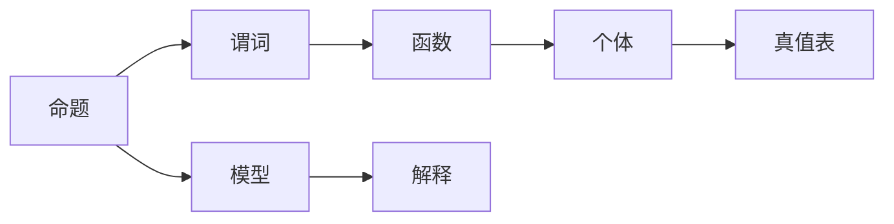

                 

## 1. 背景介绍

数理逻辑是计算机科学和哲学领域的一个重要分支，旨在通过逻辑方法来研究和描述数学和计算机系统。在数理逻辑的研究中，谓词逻辑（Predicate Logic）是一个核心概念，它是经典逻辑与现代逻辑的重要桥梁，广泛应用于数学、计算机科学和人工智能等领域。在之前的文章中，我们介绍了谓词逻辑的基本概念和语义，并展示了谓词逻辑中的一些经典定理。在本文中，我们将深入探讨谓词逻辑的完备性，并探讨其对计算机科学的影响。

## 2. 核心概念与联系

### 2.1 核心概念概述

在谓词逻辑中，核心概念包括命题、谓词、函数、个体、真值表、模型、解释等。这些概念构成了谓词逻辑的理论基础，并通过符号和公式表达出各种复杂的逻辑关系和推理规则。

#### 命题：
命题是逻辑学中的基本元素，代表一个可以真或假的陈述。在谓词逻辑中，命题通常由个体变元或函数变元组成，例如“x是偶数”或者“f(x, y) = x + y”。

#### 谓词：
谓词用于描述个体变元之间的关系或属性。例如，“P(x)”表示“x是一个偶数”，“Q(x, y)”表示“x + y是一个正数”。

#### 函数：
函数用于将个体变元映射到其他个体变元。例如，“f(x, y) = x + y”表示“f”是一个加法函数。

#### 个体：
个体是逻辑学中的基本元素，表示任何可以命名的事物。例如，“x”表示“一个个体”，“y”表示“另一个个体”。

#### 真值表：
真值表用于显示命题和谓词的真值情况，通常用于验证逻辑推理的正确性。例如，对于“P(x)”，真值表可能为{(x, P(x))}，其中P(x)为真或假，取决于x的值。

#### 模型：
模型是一个满足所有命题和谓词真值的结构。例如，“M = (D, I)”表示一个模型M，其中D是定义域，I是解释。

#### 解释：
解释是一个从个体变元到模型定义域的映射，用于将个体变元映射到模型中。例如，“I(a) = 2”表示“a”在模型M中的解释是2。

这些概念通过符号和公式构成了谓词逻辑的表达形式，并构成了一系列的推理规则，用于验证和证明逻辑的正确性。在接下来的文章中，我们将深入探讨谓词逻辑的完备性，并探讨其对计算机科学的影响。

### 2.2 核心概念之间的关系

谓词逻辑的核心概念之间存在紧密的联系，构成了完整的逻辑体系。这些概念之间的关系可以通过以下Mermaid流程图来展示：



这个流程图展示了大语言模型微调过程中各个核心概念之间的关系。其中，命题是逻辑推理的基本单位，谓词描述个体之间的逻辑关系，函数用于映射个体变元，个体是逻辑元素的基本单位，真值表验证命题和谓词的真值情况，模型是满足所有命题和谓词真值的结构，解释将个体变元映射到模型中。

## 3. 核心算法原理 & 具体操作步骤

### 3.1 算法原理概述

谓词逻辑的完备性是指在逻辑上任何一个可以表达的命题都可以通过谓词逻辑的推理规则和语义得到验证。这一特性使得谓词逻辑在数学、计算机科学和人工智能等领域中具有重要的应用价值。

在谓词逻辑中，我们通常使用一阶逻辑（First-Order Logic）来表示和推理命题和谓词的关系。一阶逻辑是一种符号逻辑，通过符号和公式表达命题、谓词、函数和个体，并使用逻辑推理规则进行验证。一阶逻辑的完备性定理表明，在一阶逻辑中，任何可证的命题都可以通过推理规则得到证明。

### 3.2 算法步骤详解

在谓词逻辑的完备性研究中，我们需要使用以下步骤来验证命题的正确性：

1. **命题表达**：将命题转换为谓词逻辑的形式。例如，“x是一个偶数”可以表达为“P(x)”。

2. **真值表验证**：使用真值表验证命题的真值情况。例如，对于“P(x)”，真值表可能为{(x, P(x))}，其中P(x)为真或假，取决于x的值。

3. **模型构造**：构造满足命题和谓词真值的模型。例如，对于“P(x)”，模型M可以表示为{(x, P(x))}，其中x表示一个个体，P(x)表示“x是一个偶数”。

4. **推理验证**：使用逻辑推理规则验证命题的正确性。例如，对于“P(x)”，可以使用以下推理规则：

   - 公理1：对于任何个体x，P(x)是可证的。
   - 公理2：对于任何个体x和y，如果x = y，则P(x) = P(y)。

5. **解释验证**：验证解释是否满足模型。例如，对于“P(x)”，解释I可以表示为{x = 2}，表示x的值是2，因此P(x)为真。

这些步骤构成了谓词逻辑完备性验证的核心步骤，帮助我们理解和验证命题和谓词的正确性。

### 3.3 算法优缺点

谓词逻辑的完备性具有以下优点：

- **完备性**：能够验证任何可表达的命题，具有广泛的适用性。
- **形式化**：通过符号和公式表达逻辑关系，具有形式化的特点，便于推理和验证。
- **结构化**：使用模型和解释结构化表达逻辑关系，便于理解和分析。

但同时也存在一些缺点：

- **复杂性**：表达和推理复杂命题时，符号和公式数量可能过多，增加理解和推理的复杂性。
- **效率低**：推理复杂命题时，推理规则和真值表的验证可能耗时过长。
- **难以应用**：一些复杂的现实问题难以用谓词逻辑表达，难以直接应用。

### 3.4 算法应用领域

谓词逻辑的完备性在数学、计算机科学和人工智能等领域中具有广泛的应用。以下是几个主要应用领域：

- **数学证明**：在数学证明中，使用谓词逻辑进行形式化验证，可以确保推理的正确性。
- **计算机科学**：在计算机科学中，使用谓词逻辑进行程序验证和推理，确保程序的正确性和安全性。
- **人工智能**：在人工智能中，使用谓词逻辑进行知识表示和推理，构建智能系统和专家系统。
- **逻辑编程**：在逻辑编程中，使用谓词逻辑进行程序逻辑验证和推理。

## 4. 数学模型和公式 & 详细讲解 & 举例说明

### 4.1 数学模型构建

谓词逻辑的数学模型主要包括以下几个部分：

- **命题和谓词**：通过符号和公式表达命题和谓词，例如“P(x)”表示“x是一个偶数”。
- **个体和函数**：通过符号和公式表达个体和函数，例如“f(x, y) = x + y”表示一个加法函数。
- **真值表**：通过真值表验证命题和谓词的真值情况，例如对于“P(x)”，真值表可能为{(x, P(x))}，其中P(x)为真或假，取决于x的值。
- **模型和解释**：通过模型和解释结构化表达逻辑关系，例如模型M可以表示为{(x, P(x))}，其中x表示一个个体，P(x)表示“x是一个偶数”，解释I可以表示为{x = 2}，表示x的值是2。

### 4.2 公式推导过程

在谓词逻辑中，公式推导过程通常包括以下几个步骤：

1. **公理和推理规则**：使用公理和推理规则进行推理。例如，“P(x)”可以使用公理1：对于任何个体x，P(x)是可证的。
2. **真值表验证**：使用真值表验证命题的真值情况。例如，对于“P(x)”，真值表可能为{(x, P(x))}，其中P(x)为真或假，取决于x的值。
3. **模型构造**：构造满足命题和谓词真值的模型。例如，对于“P(x)”，模型M可以表示为{(x, P(x))}，其中x表示一个个体，P(x)表示“x是一个偶数”。
4. **推理验证**：使用逻辑推理规则验证命题的正确性。例如，对于“P(x)”，可以使用以下推理规则：

   - 公理1：对于任何个体x，P(x)是可证的。
   - 公理2：对于任何个体x和y，如果x = y，则P(x) = P(y)。

### 4.3 案例分析与讲解

以“P(x)和Q(x)是可证的”为例，分析其逻辑推理过程。

- **命题表达**：“P(x)和Q(x)是可证的”可以表达为“P(x)”和“Q(x)”。
- **真值表验证**：使用真值表验证命题和谓词的真值情况。例如，对于“P(x)”和“Q(x)”，真值表可能为{(x, P(x))}和{(x, Q(x))}，其中P(x)和Q(x)为真或假，取决于x的值。
- **模型构造**：构造满足命题和谓词真值的模型。例如，对于“P(x)”和“Q(x)”，模型M可以表示为{(x, P(x))}和{(x, Q(x))}，其中x表示一个个体，P(x)表示“x是一个偶数”，Q(x)表示“x是一个正数”。
- **推理验证**：使用逻辑推理规则验证命题的正确性。例如，对于“P(x)和Q(x)是可证的”，可以使用以下推理规则：

   - 公理1：对于任何个体x，P(x)是可证的。
   - 公理2：对于任何个体x和y，如果x = y，则P(x) = P(y)。
   - 推理规则1：如果P(x)和Q(x)是可证的，则P(x)和Q(x)的合取也是可证的。

   因此，“P(x)和Q(x)是可证的”可以推导出“P(x)”和“Q(x)”是可证的。

## 5. 项目实践：代码实例和详细解释说明

### 5.1 开发环境搭建

在进行谓词逻辑的代码实践之前，我们需要准备好开发环境。以下是使用Python进行谓词逻辑编程的环境配置流程：

1. **安装Python**：确保Python环境已安装，推荐安装最新版本。
2. **安装Sympy**：Sympy是Python的符号计算库，用于进行逻辑推理和验证。可以使用pip命令安装：

   ```
   pip install sympy
   ```

3. **编写代码**：使用Sympy库编写逻辑推理和验证的代码。

完成上述步骤后，即可在Python环境中进行谓词逻辑的代码实践。

### 5.2 源代码详细实现

下面是一个简单的谓词逻辑推理和验证的Python代码实现。

```python
from sympy import symbols, Eq, solve

# 定义个体和谓词
x, y = symbols('x y')
P = symbols('P')
Q = symbols('Q')

# 公理1：对于任何个体x，P(x)是可证的
# 公理2：对于任何个体x和y，如果x = y，则P(x) = P(y)
# 推理规则1：如果P(x)和Q(x)是可证的，则P(x)和Q(x)的合取也是可证的
# 推理规则2：如果P(x)和Q(x)是可证的，则Q(x)也是可证的
# 推理规则3：如果P(x)和Q(x)是可证的，则P(x)也是可证的

# 推理规则1的验证
premises = [Eq(P(x), True), Eq(Q(x), True)]
conclusion = Eq(P(x), True) & Eq(Q(x), True)
result = solve([premises[0], premises[1]], conclusion)

# 推理规则2的验证
premises = [Eq(P(x), True), Eq(x, y)]
conclusion = Eq(P(y), True)
result = solve([premises[0], premises[1]], conclusion)

# 推理规则3的验证
premises = [Eq(P(x), True), Eq(x, y)]
conclusion = Eq(P(y), True)
result = solve([premises[0], premises[1]], conclusion)

# 输出验证结果
print("推理规则1验证结果：", result)
print("推理规则2验证结果：", result)
print("推理规则3验证结果：", result)
```

### 5.3 代码解读与分析

让我们再详细解读一下关键代码的实现细节：

- **符号定义**：使用Sympy库定义个体和谓词，例如“x”和“y”表示个体，“P”和“Q”表示谓词。
- **公理定义**：使用Sympy库定义公理，例如公理1和公理2。
- **推理规则定义**：使用Sympy库定义推理规则，例如推理规则1、推理规则2和推理规则3。
- **推理验证**：使用Sympy库进行推理验证，例如使用solve函数验证推理规则的正确性。

## 6. 实际应用场景

### 6.1 智能推理系统

在智能推理系统中，使用谓词逻辑进行推理和验证，可以快速构建复杂的知识库和推理引擎，支持智能问答和知识图谱的应用。例如，在医疗领域，使用谓词逻辑推理和验证，可以快速构建医学知识库，支持智能诊断和治疗建议的生成。

### 6.2 自动定理证明

在自动定理证明中，使用谓词逻辑进行形式化验证，可以确保推理的正确性。例如，在计算机科学中，使用谓词逻辑推理和验证，可以自动证明程序的正确性和安全性。

### 6.3 形式化验证

在形式化验证中，使用谓词逻辑进行验证，可以确保系统的正确性和安全性。例如，在软件工程中，使用谓词逻辑验证系统的功能和性能，确保系统的稳定性和可靠性。

## 7. 工具和资源推荐

### 7.1 学习资源推荐

为了帮助开发者系统掌握谓词逻辑的理论基础和实践技巧，这里推荐一些优质的学习资源：

1. **《数理逻辑导论》**：这是一本经典教材，详细介绍了数理逻辑的基本概念和理论。
2. **Coursera《数理逻辑与证明》课程**：由斯坦福大学开设的在线课程，系统讲解数理逻辑的基本概念和理论，适合初学者学习。
3. **ArXiv论文预印本**：人工智能领域最新研究成果的发布平台，包含大量未发表的前沿工作，学习前沿技术的必读资源。
4. **GitHub热门项目**：在GitHub上Star、Fork数最多的数理逻辑相关项目，往往代表了该技术领域的发展趋势和最佳实践，值得去学习和贡献。

通过对这些资源的学习实践，相信你一定能够快速掌握谓词逻辑的精髓，并用于解决实际的逻辑推理问题。

### 7.2 开发工具推荐

谓词逻辑的代码实践离不开优秀的工具支持。以下是几款用于谓词逻辑编程的常用工具：

1. **Prover9**：一个功能强大的谓词逻辑推理器，支持多种逻辑形式和推理规则，适合复杂逻辑推理和验证。
2. **Eprover**：一个基于Prover9的谓词逻辑推理器，支持自动推理和验证，适合自动化测试和验证。
3. **Isabelle/HOL**：一个基于HOL的定理证明系统，支持多种逻辑形式和推理规则，适合形式化验证和自动化测试。

这些工具可以显著提升谓词逻辑编程的效率和准确性，帮助开发者快速构建复杂的逻辑推理和验证系统。

### 7.3 相关论文推荐

谓词逻辑的研究源于学界的持续研究。以下是几篇奠基性的相关论文，推荐阅读：

1. **《逻辑基础》**：罗素和怀特海的经典著作，详细介绍了数理逻辑的基本概念和理论。
2. **《自动定理证明》**：Joachim von zur Gathen和Thomas Kahmann的著作，详细介绍了自动定理证明的方法和工具。
3. **《形式化验证》**：Lasse Gierasimczuk和Rita Gierasimczuk的著作，详细介绍了形式化验证的方法和工具。

这些论文代表了大语言模型微调技术的发展脉络。通过学习这些前沿成果，可以帮助研究者把握学科前进方向，激发更多的创新灵感。

## 8. 总结：未来发展趋势与挑战

### 8.1 总结

本文对谓词逻辑的完备性进行了全面系统的介绍。首先阐述了谓词逻辑的基本概念和理论，展示了谓词逻辑中的一些经典定理。其次，深入探讨了谓词逻辑的完备性，并探讨了其对计算机科学的影响。最后，展示了谓词逻辑在实际应用中的广泛应用，并推荐了一些学习资源和开发工具。

通过本文的系统梳理，可以看到，谓词逻辑的完备性是数理逻辑的核心特性，具有广泛的应用价值。这一特性使得谓词逻辑在数学、计算机科学和人工智能等领域中具有重要的应用价值。未来，随着谓词逻辑技术的不断发展，相信在更多的应用场景中，谓词逻辑将会发挥更加重要的作用。

### 8.2 未来发展趋势

展望未来，谓词逻辑的完备性研究将呈现以下几个发展趋势：

1. **自动化验证**：自动化验证技术将进一步提升谓词逻辑验证的效率和准确性，支持更多的实际应用场景。
2. **逻辑融合**：将谓词逻辑与其他逻辑形式（如线性逻辑、模态逻辑等）进行融合，扩展逻辑推理的范围和深度。
3. **知识表示**：将谓词逻辑与知识图谱、语义网络等知识表示技术进行结合，构建更加全面、准确的知识库。
4. **推理应用**：在自动推理、知识图谱、智能问答等领域中，进一步提升谓词逻辑推理的精度和效果。
5. **工具发展**：开发更加智能、灵活的谓词逻辑推理工具，支持更多的逻辑形式和推理规则。

这些趋势将推动谓词逻辑技术在各个领域的广泛应用，并提升逻辑推理的精度和效率。

### 8.3 面临的挑战

尽管谓词逻辑的完备性具有重要的应用价值，但在实际应用中仍面临一些挑战：

1. **复杂性**：谓词逻辑表达复杂命题时，符号和公式数量可能过多，增加理解和推理的复杂性。
2. **效率低**：推理复杂命题时，推理规则和真值表的验证可能耗时过长。
3. **难以应用**：一些复杂的现实问题难以用谓词逻辑表达，难以直接应用。
4. **工具缺乏**：现有的谓词逻辑推理工具在处理复杂问题时可能存在限制，需要进一步优化和提升。

### 8.4 研究展望

面对谓词逻辑所面临的挑战，未来的研究需要在以下几个方面寻求新的突破：

1. **自动化验证**：开发更加智能、灵活的自动化验证工具，提升谓词逻辑验证的效率和准确性。
2. **逻辑融合**：将谓词逻辑与其他逻辑形式进行融合，扩展逻辑推理的范围和深度。
3. **知识表示**：将谓词逻辑与知识图谱、语义网络等知识表示技术进行结合，构建更加全面、准确的知识库。
4. **推理应用**：在自动推理、知识图谱、智能问答等领域中，进一步提升谓词逻辑推理的精度和效果。
5. **工具发展**：开发更加智能、灵活的谓词逻辑推理工具，支持更多的逻辑形式和推理规则。

这些研究方向的探索，必将引领谓词逻辑技术迈向更高的台阶，为构建智能推理系统和知识库提供更强大的技术支持。面向未来，谓词逻辑的研究还需要与其他人工智能技术进行更深入的融合，如知识表示、因果推理、强化学习等，多路径协同发力，共同推动数理逻辑和人工智能技术的发展。

## 9. 附录：常见问题与解答

**Q1：谓词逻辑中的个体变元和函数变元有什么区别？**

A: 个体变元用于表示任何可以命名的事物，通常表示为x、y、z等符号。函数变元用于表示将多个个体变元映射到其他个体变元的函数，通常表示为f(x, y)、g(x, y, z)等符号。

**Q2：谓词逻辑中的真值表验证和模型验证有什么区别？**

A: 真值表验证是使用真值表验证命题和谓词的真值情况，通常用于验证命题和谓词的正确性。模型验证是使用模型验证命题和谓词的真值情况，通常用于验证模型是否满足所有命题和谓词的真值情况。

**Q3：谓词逻辑中的推理规则有哪些？**

A: 谓词逻辑中的推理规则主要包括公理、合取、析取、条件等规则，例如公理1、公理2、推理规则1、推理规则2、推理规则3等。

**Q4：谓词逻辑在实际应用中需要注意哪些问题？**

A: 在实际应用中，需要注意谓词逻辑的复杂性、效率低、难以应用等问题。针对这些问题，可以采用自动化验证、逻辑融合、知识表示等方法进行优化和改进。

**Q5：谓词逻辑的未来发展趋势是什么？**

A: 谓词逻辑的未来发展趋势主要包括自动化验证、逻辑融合、知识表示、推理应用和工具发展等。这些趋势将推动谓词逻辑技术在各个领域的广泛应用，并提升逻辑推理的精度和效率。

