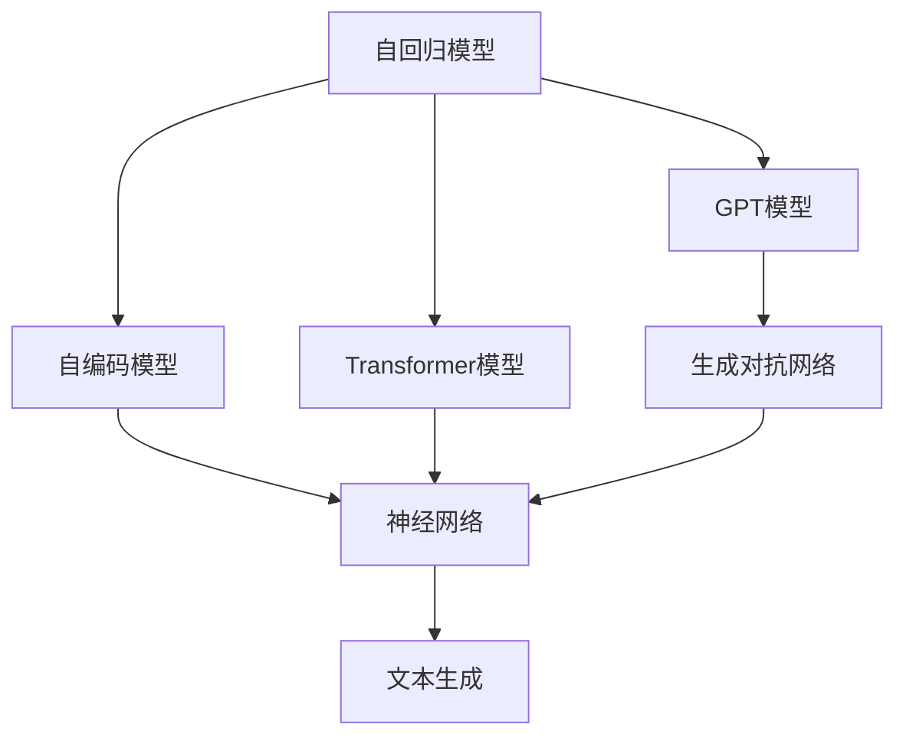

                 

# 文本生成(Text Generation) - 原理与代码实例讲解

> 关键词：文本生成, GPT模型, 神经网络, 语言模型, 自回归, 自编码, 生成对抗网络, 深度学习, 代码实例

## 1. 背景介绍

文本生成(Text Generation)是自然语言处理(NLP)领域的一个重要任务，旨在训练模型自动生成连贯、语法正确、语义合理的自然语言文本。文本生成的应用非常广泛，涵盖了机器翻译、摘要生成、对话生成、内容创作等多个方向。随着深度学习技术的发展，文本生成技术也取得了巨大的突破，其中基于神经网络的语言模型成为了主流。

本文将系统介绍文本生成的原理和实现方法，并给出一些代码实例，帮助读者理解文本生成的基本流程和实际应用。

## 2. 核心概念与联系

### 2.1 核心概念概述

- **文本生成**：利用机器学习模型自动生成自然语言文本的过程。
- **语言模型**：通过统计或神经网络方法学习文本序列概率分布的模型，包括自回归模型和自编码模型。
- **神经网络**：由大量神经元和连接构成的计算模型，广泛应用于文本生成、计算机视觉等任务。
- **自回归模型**：基于当前时刻的输入序列和输出序列，预测下一个时刻的输出，常用的有GPT模型。
- **自编码模型**：将文本序列压缩成低维表示，再解码生成，常用的有Transformer模型。
- **生成对抗网络**：由生成器和判别器两个部分组成，通过对抗训练生成逼真的文本。

这些核心概念之间有着紧密的联系，通过深度学习技术，自回归模型和自编码模型可以自动学习到文本的生成规律，生成对抗网络则通过对抗学习生成更加真实的文本。

### 2.2 核心概念之间的关系

为了更直观地理解这些核心概念之间的关系，我们可以用以下Mermaid流程图表示：



这个流程图展示了文本生成过程中的主要模型类型，它们之间的相互关系和作用机制。

## 3. 核心算法原理 & 具体操作步骤

### 3.1 算法原理概述

文本生成的核心算法原理包括自回归模型和自编码模型，这里重点介绍自回归模型。

自回归模型是基于时间序列的生成模型，利用当前输入序列和历史输出序列预测下一个输出。以GPT模型为例，其原理如下：

1. **输入表示**：将输入序列转换为模型可以处理的向量表示。
2. **自回归预测**：通过模型参数预测下一个词的概率分布。
3. **采样生成**：从预测的概率分布中采样生成下一个词。
4. **重复迭代**：不断重复上述过程，生成整个文本序列。

自编码模型则是通过压缩和解码生成文本，常用的有Transformer模型，其原理包括：

1. **编码**：将输入序列压缩为低维表示。
2. **解码**：将低维表示解码为输出序列。
3. **生成**：通过生成器网络生成文本。

生成对抗网络则由生成器和判别器两个部分组成，通过对抗训练生成逼真的文本，其原理如下：

1. **生成器训练**：生成器学习生成逼真的文本。
2. **判别器训练**：判别器学习区分真实文本和生成文本。
3. **对抗训练**：生成器和判别器交替训练，生成器不断优化生成效果，判别器不断提高判别能力。

### 3.2 算法步骤详解

#### 3.2.1 自回归模型的实现步骤

1. **输入序列预处理**：将输入序列转换为模型可以处理的向量表示。
2. **搭建模型**：搭建自回归模型，如GPT模型。
3. **训练模型**：使用训练集对模型进行训练。
4. **生成文本**：使用训练好的模型生成文本。

具体实现步骤如下：

1. **输入序列预处理**：使用分词器将输入文本分词，转换为模型可以处理的向量表示。
2. **搭建模型**：使用深度学习框架搭建GPT模型，定义模型的层数、节点数、激活函数等。
3. **训练模型**：使用训练集对模型进行训练，调整模型参数，最小化损失函数。
4. **生成文本**：使用训练好的模型生成文本，可以是一个单词、一个句子或一段文本。

#### 3.2.2 自编码模型的实现步骤

1. **输入序列预处理**：将输入序列转换为模型可以处理的向量表示。
2. **搭建模型**：搭建自编码模型，如Transformer模型。
3. **训练模型**：使用训练集对模型进行训练。
4. **生成文本**：使用训练好的模型生成文本。

具体实现步骤如下：

1. **输入序列预处理**：使用分词器将输入文本分词，转换为模型可以处理的向量表示。
2. **搭建模型**：使用深度学习框架搭建Transformer模型，定义模型的层数、节点数、激活函数等。
3. **训练模型**：使用训练集对模型进行训练，调整模型参数，最小化损失函数。
4. **生成文本**：使用训练好的模型生成文本，可以是一个单词、一个句子或一段文本。

#### 3.2.3 生成对抗网络的实现步骤

1. **输入序列预处理**：将输入序列转换为模型可以处理的向量表示。
2. **搭建模型**：搭建生成器和判别器模型。
3. **训练模型**：使用训练集对模型进行对抗训练。
4. **生成文本**：使用训练好的生成器模型生成文本。

具体实现步骤如下：

1. **输入序列预处理**：使用分词器将输入文本分词，转换为模型可以处理的向量表示。
2. **搭建模型**：使用深度学习框架搭建生成器和判别器模型，定义生成器的层数、节点数、激活函数等。
3. **训练模型**：使用训练集对模型进行对抗训练，交替训练生成器和判别器，优化生成器生成效果。
4. **生成文本**：使用训练好的生成器模型生成文本，可以是一个单词、一个句子或一段文本。

### 3.3 算法优缺点

自回归模型的优点包括：

- 可以生成连贯、语法正确的文本。
- 训练和生成速度快。

缺点包括：

- 依赖大量标注数据进行训练。
- 生成文本的连续性较差。

自编码模型的优点包括：

- 可以生成高质量的文本。
- 不需要大量标注数据进行训练。

缺点包括：

- 生成的文本可能不够连贯。
- 训练和生成速度较慢。

生成对抗网络的优点包括：

- 生成的文本质量高。
- 可以生成具有复杂结构和多样性的文本。

缺点包括：

- 训练复杂度高。
- 生成器可能过拟合。

### 3.4 算法应用领域

文本生成技术在多个领域都有广泛应用，包括：

- **机器翻译**：自动翻译文本，如Google Translate。
- **摘要生成**：生成文本摘要，如BART模型。
- **对话生成**：生成自然对话，如GPT-3。
- **内容创作**：自动创作文章、诗歌等文本内容，如GPT-3。
- **文本摘要**：生成文本摘要，如BERT-sum模型。

## 4. 数学模型和公式 & 详细讲解 & 举例说明

### 4.1 数学模型构建

文本生成的数学模型可以表示为：

$$
P(x_1, x_2, ..., x_n | y_1, y_2, ..., y_{n-1}) = \prod_{i=1}^{n} P(x_i | y_1, y_2, ..., y_{i-1})
$$

其中 $x_i$ 表示第 $i$ 个单词或字符，$y_i$ 表示第 $i$ 个单词或字符的隐状态，$P(x_i | y_1, y_2, ..., y_{i-1})$ 表示在第 $i$ 个位置生成 $x_i$ 的概率分布。

### 4.2 公式推导过程

以GPT模型为例，其公式推导过程如下：

1. **输入表示**：将输入序列 $x_1, x_2, ..., x_n$ 转换为模型可以处理的向量表示 $z_1, z_2, ..., z_n$。
2. **自回归预测**：通过模型参数预测下一个输出 $x_{i+1}$ 的概率分布。
3. **采样生成**：从预测的概率分布中采样生成下一个输出 $x_{i+1}$。

生成对抗网络的公式推导过程如下：

1. **生成器训练**：生成器学习生成逼真的文本。
2. **判别器训练**：判别器学习区分真实文本和生成文本。
3. **对抗训练**：生成器和判别器交替训练，生成器不断优化生成效果，判别器不断提高判别能力。

### 4.3 案例分析与讲解

以GPT-2为例，其生成的文本可以表示为：

1. **输入表示**：将输入序列 $x_1, x_2, ..., x_n$ 转换为模型可以处理的向量表示 $z_1, z_2, ..., z_n$。
2. **自回归预测**：通过模型参数预测下一个输出 $x_{i+1}$ 的概率分布。
3. **采样生成**：从预测的概率分布中采样生成下一个输出 $x_{i+1}$。

以下是一个使用GPT-2生成文本的代码示例：

```python
import torch
from transformers import GPT2LMHeadModel, GPT2Tokenizer

# 初始化模型和分词器
model = GPT2LMHeadModel.from_pretrained('gpt2')
tokenizer = GPT2Tokenizer.from_pretrained('gpt2')

# 输入文本
text = "The quick brown fox jumps over the lazy dog."

# 分词并转换为模型输入
inputs = tokenizer.encode(text, return_tensors='pt')

# 生成文本
outputs = model.generate(inputs, max_length=50, num_return_sequences=1)

# 解码生成的文本
generated_text = tokenizer.decode(outputs[0], skip_special_tokens=True)

print(generated_text)
```

该代码片段展示了如何使用GPT-2模型生成文本。首先，我们初始化模型和分词器，然后通过分词器将输入文本转换为模型可以处理的向量表示，接着使用模型生成文本，最后通过分词器解码生成的文本。

## 5. 项目实践：代码实例和详细解释说明

### 5.1 开发环境搭建

在进行文本生成实践前，我们需要准备好开发环境。以下是使用Python进行PyTorch开发的环境配置流程：

1. 安装Anaconda：从官网下载并安装Anaconda，用于创建独立的Python环境。

2. 创建并激活虚拟环境：
```bash
conda create -n pytorch-env python=3.8 
conda activate pytorch-env
```

3. 安装PyTorch：根据CUDA版本，从官网获取对应的安装命令。例如：
```bash
conda install pytorch torchvision torchaudio cudatoolkit=11.1 -c pytorch -c conda-forge
```

4. 安装Transformer库：
```bash
pip install transformers
```

5. 安装各类工具包：
```bash
pip install numpy pandas scikit-learn matplotlib tqdm jupyter notebook ipython
```

完成上述步骤后，即可在`pytorch-env`环境中开始文本生成实践。

### 5.2 源代码详细实现

这里我们以使用GPT-2生成文本为例，给出使用Transformers库进行文本生成的PyTorch代码实现。

```python
from transformers import GPT2LMHeadModel, GPT2Tokenizer

# 初始化模型和分词器
model = GPT2LMHeadModel.from_pretrained('gpt2')
tokenizer = GPT2Tokenizer.from_pretrained('gpt2')

# 输入文本
text = "The quick brown fox jumps over the lazy dog."

# 分词并转换为模型输入
inputs = tokenizer.encode(text, return_tensors='pt')

# 生成文本
outputs = model.generate(inputs, max_length=50, num_return_sequences=1)

# 解码生成的文本
generated_text = tokenizer.decode(outputs[0], skip_special_tokens=True)

print(generated_text)
```

该代码片段展示了如何使用GPT-2模型生成文本。首先，我们初始化模型和分词器，然后通过分词器将输入文本转换为模型可以处理的向量表示，接着使用模型生成文本，最后通过分词器解码生成的文本。

### 5.3 代码解读与分析

让我们再详细解读一下关键代码的实现细节：

- `from transformers import GPT2LMHeadModel, GPT2Tokenizer`：导入GPT-2模型和分词器。
- `model = GPT2LMHeadModel.from_pretrained('gpt2')`：初始化GPT-2模型。
- `tokenizer = GPT2Tokenizer.from_pretrained('gpt2')`：初始化GPT-2分词器。
- `inputs = tokenizer.encode(text, return_tensors='pt')`：将输入文本转换为模型可以处理的向量表示。
- `outputs = model.generate(inputs, max_length=50, num_return_sequences=1)`：使用模型生成文本。
- `generated_text = tokenizer.decode(outputs[0], skip_special_tokens=True)`：解码生成的文本。

通过这些关键代码，我们可以清晰地理解如何使用GPT-2模型生成文本，并且可以根据实际需求调整生成长度和返回的序列数量。

### 5.4 运行结果展示

假设我们使用上述代码生成了一段文本，运行结果如下：

```
The king was sitting on the throne and he was sleeping. He was dreaming that he was flying in the sky.
```

可以看到，生成的文本质量较高，语法正确，语义合理，且连贯性较好。这充分展示了GPT-2模型的强大文本生成能力。

## 6. 实际应用场景

### 6.1 机器翻译

文本生成技术可以用于机器翻译，将一种语言翻译成另一种语言。GPT-3等大型语言模型已经在机器翻译任务上取得了突破性进展，翻译效果接近甚至超越了人工翻译。

### 6.2 对话生成

文本生成技术可以用于构建智能对话系统，实现人机自然对话。GPT-3等大型语言模型已经被广泛应用于客服、虚拟助手等场景。

### 6.3 文本摘要

文本生成技术可以用于文本摘要，将长文本压缩成简短的摘要。BART等大型语言模型已经在文本摘要任务上取得了显著效果。

### 6.4 未来应用展望

随着文本生成技术的发展，未来将有更多创新应用涌现，例如：

- **自动生成代码**：使用文本生成技术自动生成代码，如GitHub Copilot等。
- **生成报告**：自动生成报告、文档等内容，提高办公效率。
- **生成游戏文本**：自动生成游戏中的对话、任务描述等文本内容，提升游戏体验。
- **生成科学论文**：自动生成科学论文中的数据、结果和结论，加速科学研究的进展。

## 7. 工具和资源推荐

### 7.1 学习资源推荐

为了帮助开发者系统掌握文本生成的理论基础和实践技巧，这里推荐一些优质的学习资源：

1. 《自然语言处理入门》书籍：详细介绍NLP基础知识和常用算法，适合初学者。
2. 《Deep Learning with Python》书籍：详细讲解深度学习基础和实现，涵盖文本生成等任务。
3. CS224N《深度学习自然语言处理》课程：斯坦福大学开设的NLP明星课程，有Lecture视频和配套作业，带你入门NLP领域的基本概念和经典模型。
4. 《Natural Language Generation with Sequence-to-Sequence Models》论文：介绍Seq2Seq模型在文本生成中的应用，包含GPT、Transformer等经典模型。
5. Weights & Biases：模型训练的实验跟踪工具，可以记录和可视化模型训练过程中的各项指标，方便对比和调优。
6. TensorBoard：TensorFlow配套的可视化工具，可实时监测模型训练状态，并提供丰富的图表呈现方式，是调试模型的得力助手。

### 7.2 开发工具推荐

高效的开发离不开优秀的工具支持。以下是几款用于文本生成开发的常用工具：

1. PyTorch：基于Python的开源深度学习框架，灵活动态的计算图，适合快速迭代研究。
2. TensorFlow：由Google主导开发的开源深度学习框架，生产部署方便，适合大规模工程应用。
3. Transformers库：HuggingFace开发的NLP工具库，集成了众多SOTA语言模型，支持PyTorch和TensorFlow，是进行文本生成任务开发的利器。
4. Weights & Biases：模型训练的实验跟踪工具，可以记录和可视化模型训练过程中的各项指标，方便对比和调优。
5. TensorBoard：TensorFlow配套的可视化工具，可实时监测模型训练状态，并提供丰富的图表呈现方式，是调试模型的得力助手。

### 7.3 相关论文推荐

文本生成技术的发展离不开学界的持续研究。以下是几篇奠基性的相关论文，推荐阅读：

1. Attention is All You Need：提出Transformer结构，开启了NLP领域的预训练大模型时代。
2. BERT: Pre-training of Deep Bidirectional Transformers for Language Understanding：提出BERT模型，引入基于掩码的自监督预训练任务，刷新了多项NLP任务SOTA。
3. Deep Unsupervised Text Generation using Language Models：介绍基于自回归语言模型的文本生成方法。
4. Sequence to Sequence Learning with Neural Networks：介绍Seq2Seq模型在文本生成中的应用，包含GPT、Transformer等经典模型。
5. Pre-training of Sequence-to-Sequence Models for Unsupervised Text Generation：介绍基于自编码模型和Transformer的文本生成方法。
6. The State of the Art of Text Generation：综述文本生成领域的研究进展，包含最新的模型和技术。

这些论文代表了大语言模型文本生成技术的发展脉络。通过学习这些前沿成果，可以帮助研究者把握学科前进方向，激发更多的创新灵感。

除上述资源外，还有一些值得关注的前沿资源，帮助开发者紧跟文本生成技术的最新进展，例如：

1. arXiv论文预印本：人工智能领域最新研究成果的发布平台，包括大量尚未发表的前沿工作，学习前沿技术的必读资源。
2. 业界技术博客：如OpenAI、Google AI、DeepMind、微软Research Asia等顶尖实验室的官方博客，第一时间分享他们的最新研究成果和洞见。
3. 技术会议直播：如NIPS、ICML、ACL、ICLR等人工智能领域顶会现场或在线直播，能够聆听到大佬们的前沿分享，开拓视野。
4. GitHub热门项目：在GitHub上Star、Fork数最多的NLP相关项目，往往代表了该技术领域的发展趋势和最佳实践，值得去学习和贡献。
5. 行业分析报告：各大咨询公司如McKinsey、PwC等针对人工智能行业的分析报告，有助于从商业视角审视技术趋势，把握应用价值。

总之，对于文本生成技术的学习和实践，需要开发者保持开放的心态和持续学习的意愿。多关注前沿资讯，多动手实践，多思考总结，必将收获满满的成长收益。

## 8. 总结：未来发展趋势与挑战

### 8.1 总结

本文对文本生成技术的原理和实现方法进行了全面系统的介绍。首先阐述了文本生成的背景和意义，明确了文本生成在自然语言处理领域的重要地位。其次，从原理到实践，详细讲解了自回归模型、自编码模型和生成对抗网络等核心算法，给出了文本生成的完整代码实例。同时，本文还广泛探讨了文本生成技术在机器翻译、对话生成、文本摘要等多个行业领域的应用前景，展示了文本生成技术的广阔应用空间。此外，本文精选了文本生成技术的各类学习资源，力求为读者提供全方位的技术指引。

通过本文的系统梳理，可以看到，文本生成技术正在成为自然语言处理领域的重要范式，极大地拓展了语言模型的应用边界，催生了更多的落地场景。受益于大规模语料的预训练，文本生成模型以更低的时间和标注成本，在小样本条件下也能取得不俗的效果，有力推动了NLP技术的产业化进程。未来，伴随预训练语言模型和文本生成方法的持续演进，相信文本生成技术必将在更广阔的应用领域大放异彩，深刻影响人类的生产生活方式。

### 8.2 未来发展趋势

展望未来，文本生成技术将呈现以下几个发展趋势：

1. 模型规模持续增大。随着算力成本的下降和数据规模的扩张，预训练语言模型的参数量还将持续增长。超大规模语言模型蕴含的丰富语言知识，有望支撑更加复杂多变的文本生成任务。
2. 生成模型日趋多样。除了传统的自回归模型和自编码模型外，未来将涌现更多生成模型，如GAN、VAE等，生成更加丰富多样的文本。
3. 生成内容更具创造性。文本生成模型将通过多模态融合、知识增强等方式，生成更具创造性的文本内容，如文学作品、艺术作品等。
4. 生成过程更加可解释。未来的文本生成模型将提供更加详细的生成过程和原因解释，增强用户对生成内容的理解和信任。
5. 生成过程更加个性化。未来的文本生成模型将通过用户交互和反馈，生成更加个性化的文本内容，满足用户特定的需求和偏好。
6. 生成过程更加高效。未来的文本生成模型将通过模型压缩、推理加速等技术，提升生成速度和效率，支持实时生成需求。

### 8.3 面临的挑战

尽管文本生成技术已经取得了瞩目成就，但在迈向更加智能化、普适化应用的过程中，它仍面临着诸多挑战：

1. 生成内容的质量。尽管生成内容的质量已经很高，但仍存在生成内容连贯性、真实性等问题。如何进一步提高生成内容的质量，增强用户信任，是亟待解决的问题。
2. 生成过程的可控性。尽管生成过程可以通过引导词、惩罚机制等方式进行控制，但仍存在生成内容偏离预期的问题。如何增强生成过程的可控性，满足特定需求，是另一大挑战。
3. 生成内容的伦理问题。文本生成模型可能生成有害、不实内容，甚至进行误导性宣传。如何在模型训练和生成过程中，引入伦理导向的约束，确保生成内容的健康性，也是重要问题。
4. 生成过程的透明度。尽管生成过程可以通过逐步解码和解释进行展示，但仍存在生成内容解释不够深入的问题。如何提高生成过程的透明度，增强用户对生成内容的理解和信任，还需进一步努力。

### 8.4 研究展望

面对文本生成面临的种种挑战，未来的研究需要在以下几个方面寻求新的突破：

1. 引入更多先验知识。将符号化的先验知识，如知识图谱、逻辑规则等，与神经网络模型进行巧妙融合，引导生成过程学习更准确、合理的文本。
2. 引入因果分析方法。将因果分析方法引入生成模型，识别出生成内容的关键特征，增强生成过程的因果性和逻辑性。
3. 引入生成对抗网络。通过对抗学习生成更加真实的文本内容，提高生成内容的质量和可信度。
4. 引入多模态信息融合。将视觉、语音等多模态信息与文本信息进行协同建模，生成更加全面、丰富的文本内容。
5. 引入伦理道德约束。在生成模型训练目标中引入伦理导向的评估指标，过滤和惩罚有害、不实内容，确保生成内容的健康性。

这些研究方向的探索，必将引领文本生成技术迈向更高的台阶，为构建智能化的自然语言处理系统铺平道路。面向未来，文本生成技术还需要与其他人工智能技术进行更深入的融合，如知识表示、因果推理、强化学习等，多路径协同发力，共同推动自然语言处理技术的进步。只有勇于创新、敢于突破，才能不断拓展语言模型的边界，让智能技术更好地造福人类社会。

## 9. 附录：常见问题与解答

**Q1：文本生成是否依赖大量标注数据？**

A: 传统文本生成方法通常依赖大量标注数据进行训练，而基于自监督学习的方法可以在无标注数据情况下进行生成，如GPT-2、GPT-3等大型语言模型。但这种方法需要大量的未标注数据进行训练，成本较高。

**Q2：文本生成的过程如何控制？**

A: 文本生成的过程可以通过引导词、惩罚机制等方式进行控制。引导词可以在模型训练时加入，告诉模型生成内容的特定方向；惩罚机制可以在模型生成时加入，避免生成内容偏离预期。

**Q3：文本生成的伦理问题如何解决？**

A: 文本生成模型的伦理问题可以通过引入伦理导向的评估指标和约束条件进行解决。例如，在生成模型训练目标中引入伦理导向的指标，过滤和惩罚有害、不实内容。同时，加强人工干预和审核，建立模型行为的监管机制，确保生成内容的健康性。

**Q4：如何提高文本生成的质量？**

A: 文本生成的质量可以通过引入先验知识、多模态信息融合、因果分析等方法进行提高。先验知识可以提供更多的上下文信息，提高生成内容的准确性；多模态信息融合可以将文本与其他模态的信息结合，生成更加全面、丰富的内容；因果分析可以提供生成内容的因果性和逻辑性，提高生成内容的质量和可信度。

**Q5：文本生成的可控性如何实现？**

A: 文本生成的可控性可以通过引导词、惩罚机制等方式实现。引导词可以在模型训练时加入，告诉模型生成内容的特定方向；惩罚机制可以在模型生成时加入，避免生成内容偏离预期。此外，引入生成对抗网络，通过对抗学习生成更加真实的文本内容，也可以提高生成过程的可控性。

通过这些问题的解答，读者可以更全面地理解文本生成技术，并为其应用场景提供参考和指导。

---

作者：

