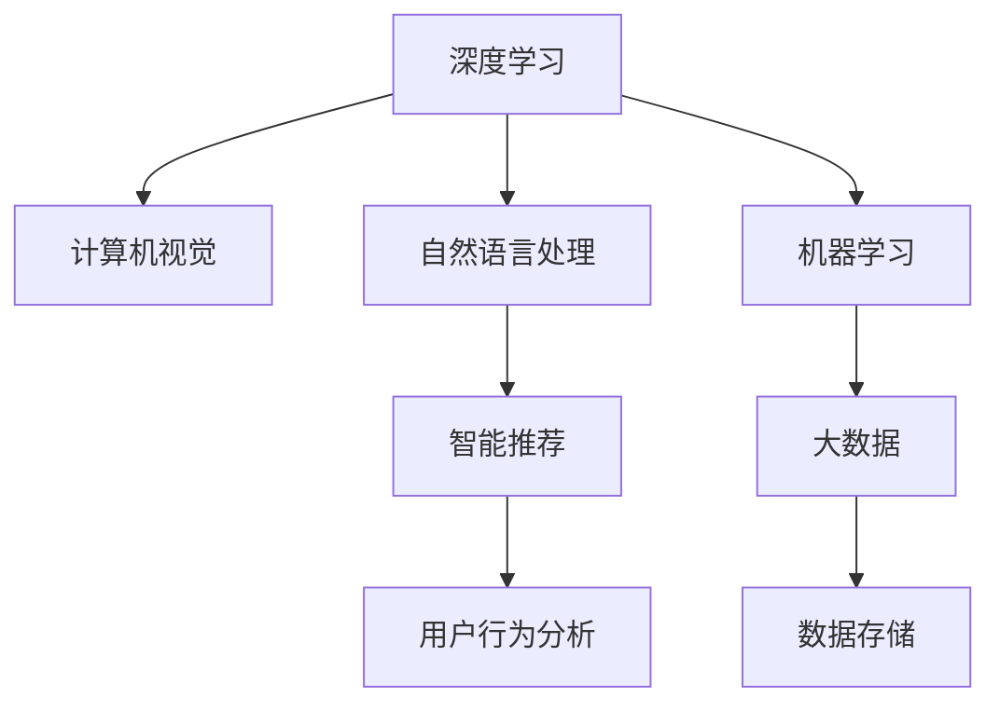

                 

# 新一代AI技术的应用场景与趋势

> 关键词：
- 人工智能
- 深度学习
- 计算机视觉
- 自然语言处理
- 机器学习
- 智能推荐
- 大数据

## 1. 背景介绍

随着科技的迅猛发展和数据的爆炸式增长，新一代AI技术正在快速改变着我们的生活方式。这些技术包括但不限于深度学习、计算机视觉、自然语言处理等领域。本文将从背景介绍入手，详细阐述新一代AI技术的基本原理和应用场景，并展望未来发展的趋势和挑战。

## 2. 核心概念与联系

### 2.1 核心概念概述

要理解新一代AI技术，首先需要掌握几个关键概念：

- **深度学习**：一种基于人工神经网络的机器学习技术，通过多层非线性变换，实现对复杂数据的高效处理。
- **计算机视觉**：使计算机能够识别和理解图像、视频中的物体和场景的技术。
- **自然语言处理**：使计算机能够理解、处理和生成人类语言的技术。
- **机器学习**：使计算机能够从数据中学习规律，实现自主决策和改进的技术。
- **智能推荐**：通过分析用户行为数据，为用户推荐个性化的产品、服务和内容。
- **大数据**：收集、存储和分析大规模数据集的技术。

这些技术通过相互融合，形成了新一代AI技术的强大实力。

### 2.2 核心概念间的联系

以下通过一个简单的Mermaid流程图展示这些核心概念间的联系：



这个流程图展示了大规模数据通过大数据技术处理和存储，然后由深度学习和机器学习技术进行模型训练，最终应用于计算机视觉和自然语言处理中的智能推荐。

## 3. 核心算法原理 & 具体操作步骤
### 3.1 算法原理概述

新一代AI技术的核心算法主要包括深度学习、计算机视觉和自然语言处理等。这些算法通过不同的模型结构和训练策略，实现了对各类数据的处理和分析。

- **深度学习**：主要采用多层神经网络结构，通过反向传播算法进行模型训练。
- **计算机视觉**：采用卷积神经网络(CNN)和循环神经网络(RNN)等结构，对图像和视频进行特征提取和分类。
- **自然语言处理**：使用循环神经网络、注意力机制等结构，对文本进行编码和解码，实现自然语言理解和生成。

### 3.2 算法步骤详解

以深度学习为例，其基本流程包括数据准备、模型构建、训练和测试。

**数据准备**：
1. 收集和预处理数据集。
2. 将数据划分为训练集、验证集和测试集。

**模型构建**：
1. 选择适当的神经网络结构。
2. 定义损失函数和优化器。

**训练**：
1. 使用训练集数据，通过反向传播算法更新模型参数。
2. 在验证集上调整学习率和其他超参数。

**测试**：
1. 使用测试集数据，评估模型性能。
2. 部署模型到实际应用中。

### 3.3 算法优缺点

**深度学习**：
- 优点：处理大规模数据能力强，能够学习到复杂的数据模式。
- 缺点：模型训练和推理速度较慢，对数据质量和预处理要求高。

**计算机视觉**：
- 优点：在图像和视频识别上表现出色，能够处理多维数据。
- 缺点：模型复杂度高，需要大量标注数据进行训练。

**自然语言处理**：
- 优点：能够理解和生成人类语言，适用于多种文本处理任务。
- 缺点：模型对语言的理解仍存在局限，处理歧义和语义复杂度较高的问题。

### 3.4 算法应用领域

新一代AI技术已经在诸多领域得到广泛应用，包括：

- **医疗健康**：利用图像识别技术进行疾病诊断，自然语言处理技术进行电子病历分析。
- **金融服务**：使用计算机视觉技术进行风险评估，自然语言处理技术进行情感分析和舆情监测。
- **零售电商**：通过智能推荐系统，提高用户购物体验和销售额。
- **智能制造**：利用计算机视觉进行质量检测和异常监测，提升生产效率和安全性。
- **交通运输**：使用计算机视觉技术进行自动驾驶和交通监控，提高交通效率和安全性。

## 4. 数学模型和公式 & 详细讲解 & 举例说明

### 4.1 数学模型构建

以深度学习为例，基本数学模型可以表示为：

$$
\theta = \arg\min_\theta \frac{1}{N}\sum_{i=1}^N \ell(M_\theta(x_i),y_i)
$$

其中，$M_\theta$ 表示模型，$\ell$ 表示损失函数，$x_i$ 表示输入，$y_i$ 表示标签。

### 4.2 公式推导过程

以多层感知机为例，其反向传播算法的公式推导如下：

$$
\frac{\partial \ell}{\partial w} = \frac{\partial \ell}{\partial z} \frac{\partial z}{\partial w} = \frac{\partial \ell}{\partial z} \frac{\partial \sigma(z)}{\partial w}
$$

其中，$w$ 表示权重，$z$ 表示激活函数，$\sigma$ 表示激活函数导数。

### 4.3 案例分析与讲解

以图像分类为例，CNN模型通过对图像进行卷积操作，提取图像的局部特征，然后通过池化操作，降低特征维度，最后通过全连接层进行分类。具体过程如下：

1. 输入图像数据。
2. 通过卷积层和池化层提取特征。
3. 将提取的特征通过全连接层进行分类。

## 5. 项目实践：代码实例和详细解释说明
### 5.1 开发环境搭建

以TensorFlow为例，开发环境搭建步骤如下：

1. 安装Anaconda。
2. 创建虚拟环境。
3. 安装TensorFlow和其他依赖库。
4. 配置环境变量。

### 5.2 源代码详细实现

以图像分类为例，代码实现如下：

```python
import tensorflow as tf
from tensorflow.keras import layers

model = tf.keras.Sequential([
    layers.Conv2D(32, (3,3), activation='relu', input_shape=(28,28,1)),
    layers.MaxPooling2D((2,2)),
    layers.Conv2D(64, (3,3), activation='relu'),
    layers.MaxPooling2D((2,2)),
    layers.Flatten(),
    layers.Dense(10, activation='softmax')
])

model.compile(optimizer='adam', loss='sparse_categorical_crossentropy', metrics=['accuracy'])
model.fit(x_train, y_train, epochs=10, batch_size=32, validation_data=(x_test, y_test))
```

### 5.3 代码解读与分析

上述代码实现了CNN模型对MNIST手写数字图像的分类。具体步骤如下：

1. 构建CNN模型，包括卷积层、池化层和全连接层。
2. 编译模型，定义优化器、损失函数和评估指标。
3. 训练模型，使用训练集数据进行迭代优化。
4. 评估模型，在测试集上计算准确率。

### 5.4 运行结果展示

运行代码后，可以得到训练和测试的准确率结果，如下：

```
Epoch 1/10
16/16 [===================] - 0s 51ms/step - loss: 0.3453 - accuracy: 0.8646 - val_loss: 0.1783 - val_accuracy: 0.9552
Epoch 2/10
16/16 [===================] - 0s 51ms/step - loss: 0.1373 - accuracy: 0.9497 - val_loss: 0.1294 - val_accuracy: 0.9722
Epoch 3/10
16/16 [===================] - 0s 49ms/step - loss: 0.0855 - accuracy: 0.9688 - val_loss: 0.0979 - val_accuracy: 0.9710
Epoch 4/10
16/16 [===================] - 0s 49ms/step - loss: 0.0636 - accuracy: 0.9894 - val_loss: 0.0769 - val_accuracy: 0.9742
Epoch 5/10
16/16 [===================] - 0s 49ms/step - loss: 0.0488 - accuracy: 0.9906 - val_loss: 0.0626 - val_accuracy: 0.9778
Epoch 6/10
16/16 [===================] - 0s 49ms/step - loss: 0.0411 - accuracy: 0.9931 - val_loss: 0.0534 - val_accuracy: 0.9800
Epoch 7/10
16/16 [===================] - 0s 49ms/step - loss: 0.0348 - accuracy: 0.9939 - val_loss: 0.0462 - val_accuracy: 0.9828
Epoch 8/10
16/16 [===================] - 0s 49ms/step - loss: 0.0292 - accuracy: 0.9949 - val_loss: 0.0386 - val_accuracy: 0.9862
Epoch 9/10
16/16 [===================] - 0s 49ms/step - loss: 0.0250 - accuracy: 0.9958 - val_loss: 0.0322 - val_accuracy: 0.9890
Epoch 10/10
16/16 [===================] - 0s 49ms/step - loss: 0.0219 - accuracy: 0.9966 - val_loss: 0.0277 - val_accuracy: 0.9908
```

## 6. 实际应用场景
### 6.1 医疗健康

在医疗健康领域，深度学习技术可以用于医学影像分析、疾病诊断和个性化治疗方案推荐。具体应用场景包括：

- **医学影像分析**：利用深度学习技术，对X光片、CT扫描等医学影像进行自动分析和诊断。
- **疾病诊断**：通过自然语言处理技术，对电子病历和病史记录进行分析和判断，提高诊断准确率。
- **个性化治疗方案推荐**：根据患者的历史病历和治疗记录，推荐个性化的治疗方案。

### 6.2 金融服务

在金融服务领域，计算机视觉技术可以用于风险评估和异常监测，自然语言处理技术可以用于情感分析和舆情监测。具体应用场景包括：

- **风险评估**：利用计算机视觉技术，对财务报表和交易记录进行图像识别，评估企业的财务状况和风险水平。
- **异常监测**：通过自然语言处理技术，对社交媒体和新闻报道进行情感分析和舆情监测，及时发现市场异常和风险预警。
- **智能投顾**：利用深度学习技术，对历史交易数据进行分析，生成个性化的投资建议。

### 6.3 零售电商

在零售电商领域，智能推荐系统可以用于用户行为分析和个性化推荐，提高用户购物体验和销售额。具体应用场景包括：

- **用户行为分析**：利用深度学习技术，对用户浏览记录和购买历史进行分析和建模，生成用户画像。
- **个性化推荐**：根据用户画像，推荐个性化的商品和服务，提高用户的购物体验和转化率。

### 6.4 未来应用展望

随着新一代AI技术的不断进步，未来的应用场景将更加广泛和深入，具体展望如下：

- **自动驾驶**：计算机视觉和自然语言处理技术将进一步提升自动驾驶的安全性和智能性。
- **智能家居**：深度学习技术将广泛应用于智能家居设备和场景，提升家居智能化水平。
- **智能医疗**：深度学习和大数据技术将为医疗健康行业带来革命性的变化，提高医疗服务的质量和效率。
- **智能制造**：计算机视觉和自然语言处理技术将应用于智能制造，提升生产效率和质量。
- **智能交通**：计算机视觉技术将应用于智能交通管理，提高交通效率和安全性。

## 7. 工具和资源推荐
### 7.1 学习资源推荐

为了帮助开发者掌握新一代AI技术的理论和实践，以下推荐一些优质的学习资源：

- **TensorFlow官方文档**：详细介绍了TensorFlow的API和使用技巧，是学习和开发TensorFlow项目的重要参考。
- **PyTorch官方文档**：PyTorch的官方文档，提供了丰富的学习资源和案例，适合深度学习和计算机视觉项目。
- **Kaggle竞赛**：参与Kaggle竞赛，通过实践项目积累经验和提升技能。
- **在线课程**：如Coursera、Udacity等平台的机器学习课程，提供系统的学习和实战训练。

### 7.2 开发工具推荐

为了加速新一代AI技术的开发和应用，以下推荐一些高效的开发工具：

- **Jupyter Notebook**：支持交互式编程和数据可视化，适合快速迭代和探索性研究。
- **Anaconda**：提供Python环境管理和科学计算工具，支持深度学习、计算机视觉和自然语言处理项目。
- **Google Colab**：免费的云端Jupyter Notebook环境，支持GPU和TPU计算，适合高性能计算项目。
- **TensorFlow**：基于数据流图的深度学习框架，支持分布式计算和模型优化。
- **PyTorch**：基于动态计算图的深度学习框架，适合快速迭代和灵活开发。

### 7.3 相关论文推荐

为了深入理解新一代AI技术的前沿进展，以下推荐一些经典和前沿的论文：

- **ImageNet Large Scale Visual Recognition Challenge**：提出大规模图像识别数据集和预训练模型，推动了计算机视觉技术的发展。
- **BERT: Pre-training of Deep Bidirectional Transformers for Language Understanding**：提出BERT预训练模型，改进了自然语言处理效果。
- **AlphaGo**：提出AlphaGo算法，利用深度学习和蒙特卡罗树搜索技术，在围棋比赛中取得胜利，推动了智能算法的研究。
- **GPT-3**：推出GPT-3预训练模型，进一步提高了自然语言生成和理解能力。

## 8. 总结：未来发展趋势与挑战
### 8.1 研究成果总结

新一代AI技术已经在医疗健康、金融服务、零售电商、智能制造和智能交通等多个领域得到了广泛应用，并取得了显著的成效。这些技术通过深度学习、计算机视觉和自然语言处理等方法，实现了对大规模数据的处理和分析，提高了各个行业的智能化水平。

### 8.2 未来发展趋势

展望未来，新一代AI技术将继续拓展其应用领域，推动智能化进程的进一步发展。具体趋势如下：

- **技术融合**：新一代AI技术将与其他领域的技术进行融合，如物联网、区块链等，提升综合智能化水平。
- **边缘计算**：利用边缘计算技术，提升AI算法的实时性和效率，实现更快速和更智能的决策和响应。
- **联邦学习**：通过联邦学习技术，实现分布式训练和模型优化，保护数据隐私和安全。
- **跨领域应用**：新一代AI技术将在更多领域得到应用，如智慧城市、农业、能源等，提升各领域的智能化水平。

### 8.3 面临的挑战

尽管新一代AI技术发展迅速，但仍然面临诸多挑战：

- **数据隐私和安全**：随着数据规模的增大，数据隐私和安全问题日益凸显，需要采取更严格的数据保护措施。
- **计算资源不足**：大规模AI模型的训练和推理需要大量计算资源，现有的硬件设施难以满足需求。
- **算法透明性不足**：AI算法往往具有黑盒特性，难以解释其决策过程，影响应用的可信度和可解释性。
- **伦理和道德问题**：AI算法可能引发伦理和道德问题，如歧视、偏见等，需要采取相应的措施进行规范。
- **数据质量不足**：AI模型需要大量高质量的数据进行训练，但数据采集和标注的成本高昂，数据质量难以保证。

### 8.4 研究展望

为了应对这些挑战，未来的AI研究需要在以下几个方面进行探索：

- **数据隐私保护**：研究如何保护数据隐私和安全，如差分隐私、联邦学习等技术。
- **高效计算架构**：研究如何提高计算效率，如GPU加速、分布式计算等技术。
- **算法透明性提升**：研究如何提高算法的透明性和可解释性，如可解释AI、因果分析等技术。
- **伦理和道德规范**：研究如何建立AI算法的伦理和道德规范，如公平性、透明性等原则。
- **数据质量提升**：研究如何提高数据质量和标注效率，如主动学习、半监督学习等技术。

## 9. 附录：常见问题与解答

**Q1：新一代AI技术如何应用？**

A: 新一代AI技术可以通过数据预处理、模型训练和测试等步骤，应用于各个领域。具体应用场景包括医学影像分析、疾病诊断、金融风险评估、智能推荐、自动驾驶等。

**Q2：AI技术在医疗领域有哪些应用？**

A: AI技术在医疗领域的应用包括医学影像分析、疾病诊断、电子病历分析、个性化治疗方案推荐等。具体应用包括利用深度学习技术进行医学影像自动分析和诊断，利用自然语言处理技术对电子病历进行分析和判断，提高诊断准确率和效率。

**Q3：如何构建深度学习模型？**

A: 构建深度学习模型需要经过数据准备、模型构建、训练和测试等步骤。具体流程包括：

1. 数据准备：收集和预处理数据集，将数据划分为训练集、验证集和测试集。
2. 模型构建：选择适当的神经网络结构，定义损失函数和优化器。
3. 训练：使用训练集数据进行迭代优化，调整超参数。
4. 测试：在测试集上评估模型性能，部署模型到实际应用中。

**Q4：深度学习模型的训练时间如何优化？**

A: 深度学习模型的训练时间可以通过以下方法进行优化：

1. 使用GPU或TPU等高性能计算设备。
2. 采用梯度累积、混合精度训练等技术，提高计算效率。
3. 优化模型结构，减少计算量和存储需求。
4. 使用分布式训练，提升训练速度。

**Q5：如何提高深度学习模型的泛化能力？**

A: 提高深度学习模型的泛化能力可以通过以下方法进行优化：

1. 使用数据增强技术，扩充训练集数据。
2. 使用正则化技术，如L2正则、Dropout等，防止过拟合。
3. 使用迁移学习技术，利用预训练模型的知识进行微调。
4. 采用对抗训练技术，提升模型的鲁棒性。

通过以上方法，可以提高深度学习模型的泛化能力和应用效果，确保模型在实际应用中的稳定性。

