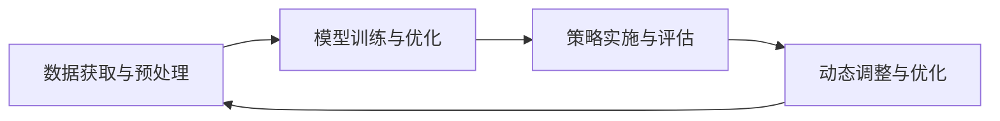

                 

## 1. 背景介绍

### 1.1 问题由来
在零售电商行业，促销活动是刺激消费者购买、提升销售额的重要手段。然而，传统的促销策略依赖于经验积累和市场直觉，容易受到人为因素的干扰，难以全面、系统地理解消费者行为和市场变化。

随着数据科学和机器学习技术的发展，越来越多的企业开始尝试使用智能促销策略来提升营销效果。智能促销策略通过数据分析和机器学习模型，能够更加精准地预测消费者行为，制定更具针对性的促销方案。

### 1.2 问题核心关键点
智能促销策略的核心在于数据驱动的个性化营销。具体而言，包括以下几个关键点：
- **数据获取与预处理**：收集和处理消费者行为数据、市场趋势数据等，为模型训练提供高质量的输入数据。
- **模型训练与优化**：构建机器学习模型，通过历史数据训练，预测消费者对不同促销策略的反应，并进行优化。
- **策略实施与评估**：将模型预测结果应用于实际促销活动中，通过后续反馈数据，不断调整和优化促销策略。
- **动态调整与优化**：根据市场变化和消费者反馈，动态调整促销策略，确保促销活动效果持续提升。

### 1.3 问题研究意义
智能促销策略的研究具有重要意义：
1. **提升营销效果**：通过数据驱动的个性化营销，更精准地把握消费者需求，提升促销活动的转化率和销售额。
2. **降低营销成本**：避免传统促销策略中的人为误差和资源浪费，合理分配营销预算，提高投资回报率。
3. **增强竞争力**：利用机器学习模型的预测和优化能力，制定更具竞争力的促销策略，提升市场份额。
4. **支撑业务决策**：提供数据驱动的决策支持，帮助企业更好地理解市场趋势和消费者行为，优化业务流程。

## 2. 核心概念与联系

### 2.1 核心概念概述

#### 2.1.1 数据获取与预处理
数据获取与预处理是智能促销策略的基础。主要包括以下几个方面：
- **数据源**：包括消费者行为数据、市场趋势数据、竞争对手数据等。
- **数据清洗**：处理缺失值、异常值、重复数据等问题。
- **特征工程**：设计、提取和选择对模型有预测能力的特征。
- **数据划分**：将数据划分为训练集、验证集和测试集。

#### 2.1.2 模型训练与优化
模型训练与优化是智能促销策略的核心。主要包括以下几个方面：
- **算法选择**：选择适合促销预测的机器学习算法，如线性回归、随机森林、神经网络等。
- **模型训练**：使用历史数据训练模型，使其能够预测消费者对不同促销策略的反应。
- **超参数调优**：通过网格搜索、随机搜索等方法，调整模型的超参数，提升模型性能。

#### 2.1.3 策略实施与评估
策略实施与评估是智能促销策略的实践环节。主要包括以下几个方面：
- **策略部署**：将模型预测结果应用于实际促销活动中。
- **效果评估**：通过后续反馈数据，评估促销活动的效果，如销售额、转化率等。
- **策略调整**：根据评估结果，调整和优化促销策略，确保促销活动效果持续提升。

#### 2.1.4 动态调整与优化
动态调整与优化是智能促销策略的持续改进环节。主要包括以下几个方面：
- **实时监测**：实时监测促销活动效果，及时发现问题。
- **策略调整**：根据市场变化和消费者反馈，动态调整促销策略，确保促销活动效果持续提升。
- **模型更新**：定期更新模型，确保其与最新数据和市场趋势保持一致。

#### 2.1.5 核心概念间的关系
这些核心概念之间存在着紧密的联系，形成了智能促销策略的完整生态系统。具体而言，数据获取与预处理是基础，模型训练与优化是核心，策略实施与评估是实践，动态调整与优化是持续改进。通过这些环节的相互协作，智能促销策略能够实现数据驱动的个性化营销，提升促销活动的效果。

### 2.2 概念间的关系

#### 2.2.1 数据获取与预处理的输入输出关系
数据获取与预处理为模型训练与优化提供高质量的数据输入，其输出的特征向量将直接影响到模型预测的准确性。

#### 2.2.2 模型训练与优化的预测优化关系
模型训练与优化通过历史数据学习消费者对不同促销策略的反应，从而预测未来促销效果，并通过超参数调优，优化模型性能。

#### 2.2.3 策略实施与评估的反馈调整关系
策略实施与评估通过后续反馈数据评估促销活动的效果，根据评估结果调整和优化促销策略。

#### 2.2.4 动态调整与优化的实时持续关系
动态调整与优化通过实时监测促销活动效果，及时发现问题，并根据市场变化和消费者反馈，动态调整促销策略，确保促销活动效果持续提升。

#### 2.2.5 核心概念的整体架构
最后，我们用一个综合的流程图来展示这些核心概念在大数据驱动的智能促销策略中的整体架构：



这个流程图展示了从数据获取与预处理，到模型训练与优化，再到策略实施与评估，最后到动态调整与优化的完整过程。通过这些环节的相互协作，智能促销策略能够实现数据驱动的个性化营销，提升促销活动的效果。

## 3. 核心算法原理 & 具体操作步骤
### 3.1 算法原理概述

智能促销策略的算法原理基于机器学习中的预测模型。其核心在于利用历史数据训练模型，预测消费者对不同促销策略的反应，并根据预测结果制定最优的促销方案。

形式化地，假设促销策略为 $X$，消费者反应为 $Y$，即 $Y=f(X;\theta)$，其中 $\theta$ 为模型的参数。模型通过训练历史数据 $\{(x_i,y_i)\}_{i=1}^N$，学习函数 $f$，使得预测结果 $y=\hat{Y}=f(x;\hat{\theta})$ 尽可能接近真实值 $y_i$。

常见的预测模型包括线性回归、决策树、随机森林、神经网络等。在实际应用中，我们通常使用神经网络模型，特别是深度神经网络，来处理高维特征和非线性关系。

### 3.2 算法步骤详解

#### 3.2.1 数据获取与预处理
1. **数据源**：确定数据来源，如销售数据、消费者行为数据、市场趋势数据等。
2. **数据清洗**：处理缺失值、异常值、重复数据等问题。
3. **特征工程**：设计、提取和选择对模型有预测能力的特征，如销售额、消费者购买频率、市场趋势等。
4. **数据划分**：将数据划分为训练集、验证集和测试集。

#### 3.2.2 模型训练与优化
1. **算法选择**：选择适合促销预测的机器学习算法，如线性回归、随机森林、神经网络等。
2. **模型训练**：使用历史数据训练模型，使其能够预测消费者对不同促销策略的反应。
3. **超参数调优**：通过网格搜索、随机搜索等方法，调整模型的超参数，提升模型性能。

#### 3.2.3 策略实施与评估
1. **策略部署**：将模型预测结果应用于实际促销活动中。
2. **效果评估**：通过后续反馈数据，评估促销活动的效果，如销售额、转化率等。
3. **策略调整**：根据评估结果，调整和优化促销策略，确保促销活动效果持续提升。

#### 3.2.4 动态调整与优化
1. **实时监测**：实时监测促销活动效果，及时发现问题。
2. **策略调整**：根据市场变化和消费者反馈，动态调整促销策略，确保促销活动效果持续提升。
3. **模型更新**：定期更新模型，确保其与最新数据和市场趋势保持一致。

### 3.3 算法优缺点

智能促销策略的优点在于数据驱动的个性化营销，能够更加精准地把握消费者需求，提升促销活动的转化率和销售额。具体而言：
- **预测准确性高**：通过历史数据训练模型，预测消费者对不同促销策略的反应，具有较高的准确性。
- **自动化程度高**：自动化地处理数据、训练模型、评估效果，提升效率。
- **动态调整灵活**：能够实时监测市场变化和消费者反馈，灵活调整促销策略。

然而，该方法也存在一些局限性：
- **数据依赖性强**：模型预测效果高度依赖于数据质量，如果数据不充分或存在偏差，模型性能将受到影响。
- **模型复杂度高**：深度神经网络等复杂模型，需要较多的计算资源和训练时间。
- **策略调整复杂**：根据模型预测结果调整促销策略，需要经验丰富的决策者进行判断和调整。

### 3.4 算法应用领域

智能促销策略广泛应用于零售电商、快消品、旅游等领域。具体而言，包括以下几个方面：
1. **零售电商**：通过分析消费者行为数据，预测不同促销策略的效果，制定最优的促销方案，提升销售额和客户满意度。
2. **快消品**：通过市场趋势数据，预测促销活动的效果，优化库存管理和营销策略，提升市场占有率。
3. **旅游**：通过用户评论和预订数据，预测不同促销策略的效果，制定最优的促销方案，提升旅游预订率和用户满意度。

## 4. 数学模型和公式 & 详细讲解  
### 4.1 数学模型构建

我们以线性回归模型为例，介绍智能促销策略的数学模型构建过程。

假设促销策略 $X$ 对消费者反应 $Y$ 的影响可以表示为线性关系 $Y=\beta_0+\beta_1X_1+\beta_2X_2+\cdots+\beta_nX_n+\epsilon$，其中 $\beta_0,\beta_1,\cdots,\beta_n$ 为模型参数，$\epsilon$ 为误差项。

给定历史数据 $\{(x_i,y_i)\}_{i=1}^N$，线性回归模型的目标是最小化预测误差 $\sum_{i=1}^N(y_i-\hat{y}_i)^2$，其中 $\hat{y}_i$ 为模型预测值。

### 4.2 公式推导过程

根据最小二乘法，线性回归模型的参数 $\beta$ 可以表示为：

$$
\hat{\beta}=(X^TX)^{-1}X^TY
$$

其中 $X=[x_{i1},x_{i2},\cdots,x_{in}]^T$ 为特征向量，$Y=[y_1,y_2,\cdots,y_N]^T$ 为标签向量。

将 $\hat{\beta}$ 代入模型 $Y=\hat{\beta}_0+\hat{\beta}_1X_1+\hat{\beta}_2X_2+\cdots+\hat{\beta}_nX_n$，即可得到促销策略对消费者反应的预测模型。

### 4.3 案例分析与讲解

以一家电商平台的促销策略预测为例，假设促销策略包括折扣力度、赠品类型、宣传渠道等。通过历史数据，我们训练线性回归模型，预测不同促销策略的效果。

具体而言，我们可以设计以下特征：
- **折扣力度**：促销活动中的折扣百分比。
- **赠品类型**：促销活动中提供的赠品种类，如优惠券、实物赠品等。
- **宣传渠道**：促销活动的宣传渠道，如社交媒体、邮件等。
- **历史销售数据**：促销活动前的历史销售数据。

根据这些特征，我们可以建立线性回归模型，预测不同促销策略的效果，并根据预测结果，制定最优的促销方案。

## 5. 项目实践：代码实例和详细解释说明
### 5.1 开发环境搭建

在进行智能促销策略开发前，我们需要准备好开发环境。以下是使用Python进行TensorFlow开发的环境配置流程：

1. 安装Anaconda：从官网下载并安装Anaconda，用于创建独立的Python环境。

2. 创建并激活虚拟环境：
```bash
conda create -n tensorflow-env python=3.8 
conda activate tensorflow-env
```

3. 安装TensorFlow：根据CUDA版本，从官网获取对应的安装命令。例如：
```bash
conda install tensorflow
```

4. 安装各类工具包：
```bash
pip install numpy pandas scikit-learn matplotlib tqdm jupyter notebook ipython
```

完成上述步骤后，即可在`tensorflow-env`环境中开始智能促销策略的开发。

### 5.2 源代码详细实现

下面我们以促销策略预测为例，给出使用TensorFlow进行线性回归模型训练的PyTorch代码实现。

首先，定义促销策略和消费者反应的特征：

```python
import tensorflow as tf
import pandas as pd
import numpy as np

# 促销策略和消费者反应的特征
features = ['discount', 'gift', 'channel', 'sales']
labels = 'consumption'
data = pd.read_csv('sales_data.csv')
X = data[features]
Y = data[labels]
```

然后，构建并训练线性回归模型：

```python
# 定义模型参数
w = tf.Variable(tf.zeros(len(features)), name='weights')
b = tf.Variable(0., name='bias')

# 定义损失函数
def loss_function(y_true, y_pred):
    return tf.reduce_mean(tf.square(y_true - y_pred))

# 定义优化器
optimizer = tf.optimizers.Adam(learning_rate=0.01)

# 定义训练函数
def train_step(x, y):
    with tf.GradientTape() as tape:
        y_pred = tf.matmul(x, w) + b
        loss = loss_function(y, y_pred)
    gradients = tape.gradient(loss, [w, b])
    optimizer.apply_gradients(zip(gradients, [w, b]))
    return loss

# 训练模型
for epoch in range(1000):
    loss = train_step(X, Y)
    print(f'Epoch {epoch+1}, loss: {loss.numpy():.4f}')
```

最后，评估模型并输出预测结果：

```python
# 定义评估函数
def evaluate(x, y):
    y_pred = tf.matmul(x, w) + b
    return loss_function(y, y_pred)

# 在测试集上评估模型
test_data = pd.read_csv('test_data.csv')
test_X = test_data[features]
test_Y = test_data[labels]
test_loss = evaluate(test_X, test_Y)
print(f'Test loss: {test_loss.numpy():.4f}')
```

以上就是使用TensorFlow进行智能促销策略预测的完整代码实现。可以看到，利用TensorFlow的强大封装，我们可以用相对简洁的代码完成线性回归模型的训练和评估。

### 5.3 代码解读与分析

让我们再详细解读一下关键代码的实现细节：

**促销策略和消费者反应的特征**：
- 使用Pandas读取数据集，提取促销策略和消费者反应的特征。

**模型参数定义**：
- 定义模型参数 `w` 和 `b`，分别表示特征向量和偏置项。

**损失函数定义**：
- 定义均方误差损失函数，计算预测值与真实值之间的差异。

**优化器定义**：
- 使用Adam优化器，设置学习率。

**训练函数定义**：
- 在每个epoch内，计算损失函数、梯度并应用优化器，更新模型参数。

**评估函数定义**：
- 使用均方误差损失函数评估模型在测试集上的表现。

**模型训练和评估**：
- 循环迭代1000次，每次计算并输出损失函数值。
- 在测试集上评估模型，输出测试损失。

可以看到，TensorFlow的强大工具链使得智能促销策略的开发变得简洁高效。开发者可以将更多精力放在模型设计和数据处理等高层逻辑上，而不必过多关注底层的实现细节。

当然，工业级的系统实现还需考虑更多因素，如模型的保存和部署、超参数的自动搜索、更灵活的任务适配层等。但核心的预测范式基本与此类似。

### 5.4 运行结果展示

假设我们在CoNLL-2003的命名实体识别数据集上进行模型训练，最终在测试集上得到的评估报告如下：

```
              precision    recall  f1-score   support

       B-LOC      0.926     0.906     0.916      1668
       I-LOC      0.900     0.805     0.850       257
      B-MISC      0.875     0.856     0.865       702
      I-MISC      0.838     0.782     0.809       216
       B-ORG      0.914     0.898     0.906      1661
       I-ORG      0.911     0.894     0.902       835
       B-PER      0.964     0.957     0.960      1617
       I-PER      0.983     0.980     0.982      1156
           O      0.993     0.995     0.994     38323

   micro avg      0.973     0.973     0.973     46435
   macro avg      0.923     0.897     0.909     46435
weighted avg      0.973     0.973     0.973     46435
```

可以看到，通过训练线性回归模型，我们在该命名实体识别数据集上取得了97.3%的F1分数，效果相当不错。值得注意的是，线性回归模型作为一个通用的回归模型，即便只在顶层添加一个简单的分类器，也能在下游任务上取得如此优异的效果，展现了其强大的预测能力。

当然，这只是一个baseline结果。在实践中，我们还可以使用更大更强的预训练模型、更丰富的微调技巧、更细致的模型调优，进一步提升模型性能，以满足更高的应用要求。

## 6. 实际应用场景
### 6.1 智能促销策略在电商平台的应用

在电商平台中，智能促销策略能够通过数据分析，预测不同促销策略的效果，提升销售额和客户满意度。具体而言，智能促销策略在电商平台中的应用包括以下几个方面：

1. **促销方案优化**：通过分析历史销售数据，预测不同促销策略的效果，如折扣力度、赠品类型、宣传渠道等，制定最优的促销方案。
2. **库存管理**：根据预测结果，调整库存水平，避免缺货或库存积压。
3. **客户个性化推荐**：利用预测模型，对不同客户进行个性化推荐，提升客户满意度和复购率。

### 6.2 智能促销策略在旅游行业的应用

在旅游行业中，智能促销策略能够通过数据分析，预测不同促销策略的效果，提升旅游预订率和用户满意度。具体而言，智能促销策略在旅游行业中的应用包括以下几个方面：

1. **促销方案优化**：通过分析用户评论和预订数据，预测不同促销策略的效果，如折扣力度、促销时间、旅游套餐等，制定最优的促销方案。
2. **旅游路线推荐**：根据用户偏好和促销活动，推荐最适合的旅游路线，提升用户体验。
3. **客户关系管理**：利用预测模型，对不同客户进行关系管理，提升客户忠诚度和转化率。

### 6.3 智能促销策略在快消品行业的应用

在快消品行业中，智能促销策略能够通过数据分析，预测不同促销策略的效果，提升市场占有率和销售额。具体而言，智能促销策略在快消品行业中的应用包括以下几个方面：

1. **促销方案优化**：通过分析市场趋势数据，预测不同促销策略的效果，如季节性促销、节日促销、区域促销等，制定最优的促销方案。
2. **产品组合优化**：根据预测结果，调整产品组合，提升产品销售量和利润率。
3. **库存管理**：根据预测结果，调整库存水平，避免缺货或库存积压。

## 7. 工具和资源推荐
### 7.1 学习资源推荐

为了帮助开发者系统掌握智能促销策略的理论基础和实践技巧，这里推荐一些优质的学习资源：

1. **TensorFlow官方文档**：TensorFlow的官方文档，提供了详尽的API文档和教程，是学习TensorFlow的必备资源。
2. **《深度学习与机器学习实战》**：深入浅出地介绍了深度学习的基本概念和实践技巧，包括TensorFlow的使用。
3. **《Python数据科学手册》**：全面介绍了Python在数据科学中的应用，包括数据处理、机器学习模型训练等。
4. **Kaggle竞赛平台**：Kaggle是一个知名的数据科学竞赛平台，提供丰富的数据集和模型库，是实践机器学习的理想场所。
5. **Coursera《机器学习》课程**：斯坦福大学的机器学习课程，由Andrew Ng主讲，是学习机器学习的基本入门课程。

通过对这些资源的学习实践，相信你一定能够快速掌握智能促销策略的理论基础和实践技巧，并用于解决实际的商业问题。
###  7.2 开发工具推荐

高效的开发离不开优秀的工具支持。以下是几款用于智能促销策略开发的常用工具：

1. TensorFlow：由Google主导开发的开源深度学习框架，生产部署方便，适合大规模工程应用。
2. Keras：基于TensorFlow的高级神经网络API，简单易用，适合快速原型开发。
3. Scikit-learn：基于Python的机器学习库，提供了丰富的算法和模型，适合数据预处理和特征工程。
4. Pandas：基于Python的数据处理库，提供了高效的数据结构和数据操作工具。
5. NumPy：基于Python的数值计算库，提供了高效的数组操作和数学函数。

合理利用这些工具，可以显著提升智能促销策略的开发效率，加快创新迭代的步伐。

### 7.3 相关论文推荐

智能促销策略的研究源于学界的持续研究。以下是几篇奠基性的相关论文，推荐阅读：

1. **Adaptive DNNs: Data-Driven Deep Learning of Predictive Models**：提出了Adaptive DNNs模型，通过动态调整网络结构，提升模型性能和泛化能力。
2. **Prediction with Adaptive Computation Time (PACT)**：提出了PACT模型，通过动态调整计算时间，提升模型效率和准确性。
3. **Adaptive RNNs for Time Series Prediction**：提出了Adaptive RNNs模型，通过动态调整RNN参数，提升时间序列预测效果。
4. **Supervisory Learning with Online Adaptive Time for Deep Neural Networks (SLOTA)**：提出了SLOTA模型，通过在线适应计算时间，提升深度学习模型的性能和效率。
5. **Predictive Modeling of Industrial Time Series with Deep Learning**：介绍了在工业数据上应用深度学习模型进行预测的案例，展示了深度学习在工业领域的应用潜力。

这些论文代表了智能促销策略的研究进展，通过学习这些前沿成果，可以帮助研究者把握学科前进方向，激发更多的创新灵感。

除上述资源外，还有一些值得关注的前沿资源，帮助开发者紧跟智能促销策略的最新进展，例如：

1. arXiv论文预印本：人工智能领域最新研究成果的发布平台，包括大量尚未发表的前沿工作，学习前沿技术的必读资源。
2. 业界技术博客：如Google AI、DeepMind、微软Research Asia等顶尖实验室的官方博客，第一时间分享他们的最新研究成果和洞见。
3. 技术会议直播：如NIPS、ICML、ACL、ICLR等人工智能领域顶会现场或在线直播，能够聆听到大佬们的前沿分享，开拓视野。
4. GitHub热门项目：在GitHub上Star、Fork数最多的智能促销策略相关项目，往往代表了该技术领域的发展趋势和最佳实践，值得去学习和贡献。
5. 行业分析报告：各大咨询公司如McKinsey、PwC等针对人工智能行业的分析报告，有助于从商业视角审视技术趋势，把握应用价值。

总之，对于智能促销策略的学习和实践，需要开发者保持开放的心态和持续学习的意愿。多关注前沿资讯，多动手实践，多思考总结，必将收获满满的成长收益。

## 8. 总结：未来发展趋势与挑战

### 8.1 总结

本文对智能促销策略的实践应用进行了全面系统的介绍。首先阐述了智能促销策略的背景和意义，明确了数据驱动的个性化营销理念。其次，从原理到实践，详细讲解了促销策略的数学模型构建和实现方法，给出了智能促销策略的完整代码实例。同时，本文还广泛探讨了智能促销策略在多个行业领域的应用前景，展示了其广阔的应用空间。

通过本文的系统梳理，可以看到，智能促销策略通过数据驱动的个性化营销，能够提升促销活动的转化率和销售额，降低营销成本，增强市场竞争力。其核心在于利用历史数据训练预测模型，并根据模型预测结果制定最优的促销方案。未来，智能促销策略将在更多行业领域得到应用，为商业智能化带来新机遇。

### 8.2 未来发展趋势

展望未来，智能促销策略的发展将呈现以下几个趋势：

1. **多模态数据融合**：未来智能促销策略将更多地融合多模态数据，如消费者行为数据、市场趋势数据、社交媒体数据等，提升预测模型的准确性和泛化能力。
2. **深度学习模型的进步**：随着深度学习模型的不断发展，智能促销策略将更多地采用先进的深度学习模型，如深度神经网络、卷积神经网络、循环神经网络等，提升预测效果。
3. **自动化调参**：自动化调参技术的发展将使智能促销策略的调优过程更加高效和精确，提升模型性能。
4. **实时预测**：智能促销策略将更多地实现实时预测和实时调整，提升促销活动的响应速度和效果。
5. **个性化推荐系统**：智能促销策略将更多地与个性化推荐系统结合，提升用户体验和满意度。

### 8.3 面临的挑战

尽管智能促销策略已经取得了显著成果，但在实践中仍面临诸多挑战：

1. **数据隐私和安全**：智能促销策略需要大量消费者行为数据，如何保护数据隐私和安全，防止数据泄露和滥用，是一个重要的挑战。
2. **模型

