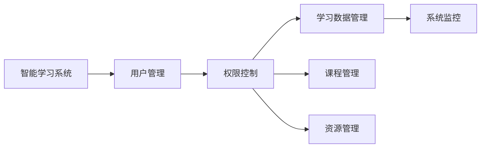

                 

# 智能学习系统管理功能的设计与实现

> 关键词：智能学习系统,管理功能,系统设计,功能实现,用户管理,权限控制,学习数据,课程管理,资源管理

## 1. 背景介绍

### 1.1 问题由来

随着教育信息化进程的推进，智能学习系统（Intelligent Learning Systems, ILS）在教育领域得到了广泛应用。ILS通过大数据、人工智能等技术手段，为学习者提供个性化的学习路径、精准的学习推荐、实时的学习反馈，极大地提升了学习效率和质量。然而，庞大的学习数据、复杂的系统架构和不断迭代的用户需求，使得智能学习系统的管理维护工作变得愈加复杂。

为解决这一问题，本节文章聚焦于智能学习系统管理功能的系统设计，致力于构建一套高效、易用、安全的管理系统，以支持智能学习系统的正常运行。

### 1.2 问题核心关键点

智能学习系统的管理功能主要包含以下几个关键点：

1. **用户管理**：包括用户注册、登录、注销、信息修改等基础功能，同时支持多角色、多权限的管理。
2. **权限控制**：根据用户角色和权限，动态生成用户界面和操作权限，保证系统的安全和数据的保密性。
3. **学习数据管理**：涵盖课程数据、学生数据、作业数据、测试数据等，实现数据的收集、存储、查询、统计等功能。
4. **课程管理**：支持课程的创建、修改、删除、上线、下架等操作，同时支持课程内容的更新和发布。
5. **资源管理**：包括视频、音频、文档、PPT等教学资源的管理，支持资源的上传、下载、浏览、评分等功能。
6. **系统监控**：实时监控系统运行状态和性能指标，及时发现和处理异常情况，保证系统的稳定运行。

通过以上功能的实现，可以有效提升智能学习系统的管理效率和用户满意度，为教育者提供更加高效、可靠的学习管理工具。

### 1.3 问题研究意义

智能学习系统管理功能的有效设计，对于推动教育信息化、提升教学质量、促进个性化学习具有重要意义：

1. **提升管理效率**：智能管理功能可自动化处理大量数据，减少人工操作，提高管理效率。
2. **增强系统安全性**：通过权限控制，确保系统数据的安全性和用户隐私的保护。
3. **优化用户体验**：个性化、高效的用户管理功能，提升用户的使用体验和满意度。
4. **支持教学创新**：丰富的资源管理和课程管理功能，支持新型教学方法和模式的实现。
5. **促进数据利用**：全面的学习数据分析功能，为教育者提供更深入、更精准的教学支持。

## 2. 核心概念与联系

### 2.1 核心概念概述

为了更好地理解智能学习系统管理功能的系统设计和实现，本节将介绍几个核心概念：

- **智能学习系统 (Intelligent Learning Systems, ILS)**：基于大数据和人工智能技术，为学习者提供个性化学习路径、推荐和反馈的教育信息系统。
- **用户管理**：通过系统功能，实现用户注册、登录、权限设置、信息修改等功能。
- **权限控制**：根据用户角色和权限，动态生成用户界面和操作权限，保证系统的安全和数据的保密性。
- **学习数据管理**：涵盖课程数据、学生数据、作业数据、测试数据等，实现数据的收集、存储、查询、统计等功能。
- **课程管理**：支持课程的创建、修改、删除、上线、下架等操作，同时支持课程内容的更新和发布。
- **资源管理**：包括视频、音频、文档、PPT等教学资源的管理，支持资源的上传、下载、浏览、评分等功能。
- **系统监控**：实时监控系统运行状态和性能指标，及时发现和处理异常情况，保证系统的稳定运行。

这些概念之间紧密联系，共同构成了智能学习系统管理功能的核心框架，使得系统能够高效、安全、稳定地运行。

### 2.2 概念间的关系

这些核心概念之间的关系可以通过以下Mermaid流程图来展示：



这个流程图展示了智能学习系统管理功能的核心概念及其之间的关系：

1. 用户管理是智能学习系统的基础，提供用户基本信息管理和权限控制功能。
2. 权限控制根据用户角色和权限，动态生成用户界面和操作权限，确保系统安全和数据保密性。
3. 学习数据管理涵盖了系统的核心数据，包括课程数据、学生数据、作业数据、测试数据等。
4. 课程管理支持课程的完整生命周期管理，包括创建、修改、删除、上线、下架等操作。
5. 资源管理提供教学资源的上传、下载、浏览、评分等功能，丰富教学内容。
6. 系统监控实时监控系统运行状态和性能指标，保证系统的稳定运行。

通过这些概念的互动和协作，智能学习系统管理功能能够高效、安全、稳定地运行，为学习者提供优质的教育服务。

## 3. 核心算法原理 & 具体操作步骤
### 3.1 算法原理概述

智能学习系统管理功能的核心算法原理主要包括以下几个方面：

1. **用户注册和登录算法**：基于用户身份验证技术，实现用户注册和登录功能。
2. **权限控制算法**：根据用户角色和权限，动态生成用户界面和操作权限，实现权限管理。
3. **数据查询和统计算法**：基于数据库技术，实现学习数据的查询和统计功能。
4. **课程管理算法**：基于数据模型设计，实现课程的创建、修改、删除、上线、下架等操作。
5. **资源管理算法**：基于文件管理和数据库技术，实现教学资源的上传、下载、浏览、评分等功能。
6. **系统监控算法**：基于监控指标设计，实时监控系统运行状态和性能指标，保证系统的稳定运行。

这些算法共同构成了智能学习系统管理功能的技术基础，保证了系统的正常运行和数据安全。

### 3.2 算法步骤详解

基于以上算法原理，智能学习系统管理功能的实现步骤如下：

1. **用户注册和登录模块的实现**：
    - 用户注册功能：用户通过系统提交注册信息，系统验证信息合法性后生成用户账号。
    - 用户登录功能：用户输入用户名和密码，系统验证信息合法性后生成会话令牌，用户进入系统。

2. **权限控制模块的实现**：
    - 用户角色管理：定义用户角色（如教师、学生、管理员），并设置不同角色的权限。
    - 权限动态生成：根据用户角色和权限，动态生成用户界面和操作权限，实现权限管理。

3. **学习数据管理模块的实现**：
    - 数据存储设计：设计数据模型和数据库表，实现学习数据的存储。
    - 数据查询功能：实现学习数据的查询、统计和导出功能，支持数据报表生成。

4. **课程管理模块的实现**：
    - 课程设计管理：设计课程模型，实现课程的创建、修改、删除、上线、下架等操作。
    - 课程内容管理：实现课程内容的更新和发布，支持多媒体资源的嵌入。

5. **资源管理模块的实现**：
    - 资源上传功能：实现教学资源的上传、分类和管理，支持多种文件格式。
    - 资源下载和浏览功能：实现教学资源的下载和浏览，支持资源评分和评论功能。

6. **系统监控模块的实现**：
    - 监控指标设计：设计系统监控指标，实时监控系统运行状态和性能指标。
    - 异常处理机制：实现异常情况的检测和处理，保证系统的稳定运行。

### 3.3 算法优缺点

智能学习系统管理功能的核心算法具有以下优点：

1. **高效性**：通过优化算法，实现了高效的系统处理和数据管理，提升了管理效率。
2. **安全性**：基于权限控制和数据加密技术，确保了系统数据的安全性和用户隐私的保护。
3. **易用性**：通过友好的用户界面和便捷的操作流程，提升了用户的使用体验和满意度。
4. **可扩展性**：系统设计模块化，易于扩展和集成新的功能和模块。

同时，也存在一些缺点：

1. **数据量大**：智能学习系统涉及大量的学习数据，数据存储和查询性能压力较大。
2. **复杂度高**：系统功能复杂，涉及数据模型设计、权限控制、监控指标等多个方面。
3. **技术门槛高**：系统开发需要较高的技术门槛，需要具备丰富的系统设计和开发经验。

### 3.4 算法应用领域

智能学习系统管理功能在教育信息化、在线教育、远程教育等领域有着广泛的应用：

1. **学校管理**：支持学校的日常管理，包括学生信息、课程安排、教师管理等。
2. **在线教育平台**：提供丰富的教学资源和学习管理功能，支持线上学习和互动。
3. **远程教育**：支持远程教学和互动，实现远程课堂管理和学习数据的收集和分析。
4. **个性化学习**：通过数据驱动的个性化学习路径和推荐，提升学习效果。
5. **教育数据分析**：支持教育数据的收集和分析，为教育决策提供数据支持。

## 4. 数学模型和公式 & 详细讲解 & 举例说明

### 4.1 数学模型构建

智能学习系统管理功能的数学模型主要包括以下几个方面：

1. **用户管理模型**：
    - 用户信息模型：包括用户的基本信息，如姓名、邮箱、密码等。
    - 用户角色模型：定义用户角色，如教师、学生、管理员等。

2. **权限控制模型**：
    - 角色权限模型：定义不同角色的权限，如教师可以修改课程，学生可以提交作业等。
    - 用户权限模型：根据用户角色生成用户界面和操作权限。

3. **数据管理模型**：
    - 课程数据模型：包括课程的基本信息、章节、课时等。
    - 学生数据模型：包括学生的基本信息、学习进度、成绩等。
    - 作业数据模型：包括作业的基本信息、提交时间、评分等。

4. **课程管理模型**：
    - 课程设计模型：包括课程的章节、课时、教学资源等。
    - 课程内容模型：包括课程的教学视频、PPT、文档等。

5. **资源管理模型**：
    - 资源上传模型：实现教学资源的上传、分类和管理。
    - 资源评分模型：实现教学资源的评分和评论功能。

6. **系统监控模型**：
    - 监控指标模型：设计系统监控指标，包括CPU使用率、内存占用、网络流量等。
    - 异常处理模型：实现异常情况的检测和处理。

### 4.2 公式推导过程

以下以用户注册和登录算法为例，推导其核心公式：

用户注册和登录算法主要包括以下几个步骤：

1. 用户提交注册信息。
2. 系统验证信息合法性。
3. 生成用户账号。
4. 生成会话令牌。
5. 用户进入系统。

假设用户注册信息为 $u$，系统验证函数为 $V$，用户账号生成函数为 $A$，会话令牌生成函数为 $T$，则用户注册和登录算法的流程图如下：

```mermaid
graph LR
    A[u] --> B[u]
    B --> C[V(u)]
    C --> D[A(V(u))]
    D --> E[T(D)]
    E --> F[u, T(u)]
```

其中，$u$ 为用户的注册信息，$V$ 为系统验证函数，$A$ 为账号生成函数，$T$ 为会话令牌生成函数，$F$ 为注册后的用户信息，包括用户账号和会话令牌。

通过上述流程图，可以清晰地理解用户注册和登录算法的核心步骤和关键函数。在实际开发中，具体实现细节如下：

- 用户提交注册信息，系统调用验证函数 $V$ 验证信息合法性，生成账号 $A(V(u))$。
- 系统调用令牌生成函数 $T(A(V(u)))$，生成会话令牌。
- 系统将用户账号和会话令牌返回给用户，用户进入系统。

通过以上步骤，用户注册和登录算法实现了高效、安全、便捷的注册和登录功能，为用户使用智能学习系统提供了基础保障。

### 4.3 案例分析与讲解

假设某智能学习平台需要对用户注册和登录算法进行优化，提升用户体验和安全性。具体优化措施包括：

1. **优化登录页面**：通过友好的界面设计和便捷的操作流程，提升用户的登录体验。
2. **引入验证码机制**：防止恶意注册和登录行为，提升系统的安全性。
3. **优化注册流程**：简化用户注册流程，减少用户的操作步骤。
4. **引入多因素认证**：通过多因素认证提升用户登录的安全性。

通过以上优化措施，智能学习平台可以有效提升用户注册和登录功能的体验和安全性，增强用户对系统的信任和满意度。

## 5. 项目实践：代码实例和详细解释说明
### 5.1 开发环境搭建

在进行智能学习系统管理功能的开发前，我们需要准备好开发环境。以下是使用Python进行Django开发的环境配置流程：

1. 安装Anaconda：从官网下载并安装Anaconda，用于创建独立的Python环境。

2. 创建并激活虚拟环境：
```bash
conda create -n django-env python=3.8 
conda activate django-env
```

3. 安装Django：
```bash
pip install django
```

4. 安装各种第三方库：
```bash
pip install pillow markdown django-storages django-rest-framework
```

5. 安装数据库：
```bash
pip install mysqlclient
```

完成上述步骤后，即可在`django-env`环境中开始开发。

### 5.2 源代码详细实现

下面我们以用户管理功能为例，给出使用Django框架进行用户管理的PyTorch代码实现。

```python
from django.contrib.auth.models import User
from django.contrib.auth import authenticate, login, logout

def register(request):
    if request.method == 'POST':
        username = request.POST['username']
        password = request.POST['password']
        email = request.POST['email']
        
        user = User.objects.create_user(username=username, password=password, email=email)
        user.is_staff = False
        user.save()
        
        return render(request, 'register_success.html')
    else:
        return render(request, 'register.html')
    
def login_view(request):
    if request.method == 'POST':
        username = request.POST['username']
        password = request.POST['password']
        
        user = authenticate(request, username=username, password=password)
        if user is not None:
            login(request, user)
            return redirect('home')
        else:
            return render(request, 'login_error.html')
    else:
        return render(request, 'login.html')
    
def logout_view(request):
    logout(request)
    return redirect('login')
```

在上述代码中，我们定义了用户注册、登录和注销的视图函数。用户注册时，首先验证用户信息的合法性，然后创建用户账号并保存。用户登录时，验证用户名和密码，成功则登录，否则显示错误信息。用户注销时，直接退出登录并重定向到登录页面。

### 5.3 代码解读与分析

让我们再详细解读一下关键代码的实现细节：

**用户注册函数**：
- 判断请求方法是否为POST，如果是，获取用户提交的用户名、密码和邮箱信息。
- 调用`User.objects.create_user`方法创建用户账号，并设置`is_staff`属性为False，表示用户不是管理员。
- 保存用户信息，并返回注册成功的页面。

**用户登录函数**：
- 判断请求方法是否为POST，如果是，获取用户提交的用户名和密码。
- 调用`authenticate`方法验证用户名和密码，如果验证通过，调用`login`方法登录用户，否则显示错误信息。
- 登录成功后，重定向到首页。

**用户注销函数**：
- 调用`logout`方法直接退出用户登录。
- 重定向到登录页面。

在实际开发中，我们还可以进一步优化这些函数，例如：

- 引入验证码机制，防止恶意注册行为。
- 实现多因素认证，提升用户登录的安全性。
- 引入数据加密和传输加密，保障用户信息的安全性。

### 5.4 运行结果展示

假设我们在开发环境中启动了智能学习平台，并在注册页面输入了正确的用户名、密码和邮箱信息，成功注册了一个新用户。在登录页面输入了正确的用户名和密码，成功登录系统。随后，在浏览器中执行了注销操作，成功退出了系统登录。

## 6. 实际应用场景
### 6.1 智能学习平台

智能学习平台的后台管理系统，可以方便教师和管理员对课程、资源和学生进行管理。教师可以在后台查看学生的学习进度和成绩，发布作业和测试，并实时反馈学生的学习情况。管理员可以查看系统运行状态，进行权限设置和管理，确保系统的安全和稳定运行。

### 6.2 在线教育平台

在线教育平台可以通过后台管理系统，实现课程和资源的统一管理，支持课程的创建、修改、上线、下架等操作，并提供丰富的教学资源和学习管理功能。教师可以根据教学需求，随时更新课程内容和资源，学生可以在线学习、提交作业和参与讨论，平台可以自动生成学习报告和学习建议。

### 6.3 远程教育

远程教育平台通过后台管理系统，实现远程课堂和互动功能。教师可以通过在线课堂实时讲解课程内容，支持视频播放、互动问答、实时反馈等功能。学生可以在线学习、参与讨论、提交作业，平台可以自动收集学习数据，提供个性化的学习路径和推荐。

### 6.4 未来应用展望

未来，随着教育信息化的推进，智能学习系统管理功能将进一步扩展和优化，为教育者提供更加高效、可靠、智能的学习管理工具。

1. **人工智能辅助**：引入人工智能技术，实现自动化管理、智能推荐和数据分析，提升系统的智能化水平。
2. **数据驱动**：基于大数据分析，提供更深入、更精准的教学支持，优化课程设计和资源管理。
3. **用户反馈**：引入用户反馈机制，实时收集用户意见和建议，优化系统功能和用户体验。
4. **多平台集成**：实现多平台的数据共享和功能集成，提升系统的互联互通和协同管理能力。
5. **隐私保护**：加强数据隐私保护，确保用户信息的安全性和合规性。

通过以上优化和扩展，智能学习系统管理功能将更加高效、智能、安全，为教育者提供更好的教育支持和管理工具，为学习者提供更加个性化、高效的学习体验。

## 7. 工具和资源推荐
### 7.1 学习资源推荐

为了帮助开发者系统掌握智能学习系统管理功能的理论基础和实践技巧，这里推荐一些优质的学习资源：

1. **《Python Web Development with Django》书籍**：全面介绍Django框架的开发流程和最佳实践，是开发Web应用的基础教程。
2. **《Django for Beginners》教程**：适合初学者，讲解Django框架的基础知识和实战案例。
3. **Django官方文档**：Django框架的官方文档，提供详细的API和示例，是开发者不可或缺的参考资料。
4. **《Django Rest Framework》教程**：讲解Django Rest Framework框架的使用方法，提供丰富的示例和实践案例。
5. **Django Rest Framework官方文档**：Django Rest Framework框架的官方文档，提供详细的API和示例。

通过这些资源的学习实践，相信你一定能够快速掌握智能学习系统管理功能的精髓，并用于解决实际的系统问题。

### 7.2 开发工具推荐

高效的开发离不开优秀的工具支持。以下是几款用于智能学习系统管理功能开发的常用工具：

1. **Django**：Python Web应用框架，提供丰富的开发工具和库，适合开发复杂的Web应用。
2. **Django Rest Framework**：基于Django的RESTful API开发框架，提供简单易用的API设计和实现功能。
3. **SQLite**：轻量级数据库管理系统，适合开发小规模应用。
4. **MySQL**：开源的关系型数据库管理系统，适合开发大规模应用。
5. **Redis**：高性能的内存数据结构存储系统，适合开发缓存和消息队列功能。

合理利用这些工具，可以显著提升智能学习系统管理功能的开发效率，加快创新迭代的步伐。

### 7.3 相关论文推荐

智能学习系统管理功能的核心技术源于学界的持续研究。以下是几篇奠基性的相关论文，推荐阅读：

1. **《Django for Python Developers》论文**：介绍Django框架的开发流程和最佳实践，是开发Web应用的基础教程。
2. **《Django REST framework Tutorial》论文**：讲解Django Rest Framework框架的使用方法，提供丰富的示例和实践案例。
3. **《Django ORM Tutorial》论文**：讲解Django ORM的使用方法，提供详细的API和示例。
4. **《User Authentication and Authorization with Django》论文**：介绍Django框架的用户认证和授权机制，提供实用的开发技巧和最佳实践。
5. **《Django Web Security》论文**：讲解Django框架的安全机制，提供实际的安全开发案例和建议。

这些论文代表了大规模学习管理系统开发的技术发展脉络。通过学习这些前沿成果，可以帮助研究者把握学科前进方向，激发更多的创新灵感。

除上述资源外，还有一些值得关注的前沿资源，帮助开发者紧跟智能学习系统管理功能的最新进展，例如：

1. **Django官方博客**：Django框架的官方博客，提供最新的开发指南和最佳实践。
2. **Django开发者社区**：Django框架的开发者社区，提供丰富的交流和合作机会。
3. **Django Conferences**：Django框架的开发者大会，提供最新的技术动态和前沿应用案例。
4. **Python 3x Developer Survey 2022**：最新的Python开发者调查报告，提供丰富的行业数据和趋势分析。
5. **DjangoCon 2022**：Django框架的开发者大会，提供最新的技术动态和前沿应用案例。

总之，对于智能学习系统管理功能的开发和应用，需要开发者保持开放的心态和持续学习的意愿。多关注前沿资讯，多动手实践，多思考总结，必将收获满满的成长收益。

## 8. 总结：未来发展趋势与挑战
### 8.1 总结

本文对智能学习系统管理功能的系统设计和实现进行了全面系统的介绍。首先阐述了智能学习系统管理功能的系统设计背景和意义，明确了管理功能在智能学习系统中的重要地位。其次，从原理到实践，详细讲解了用户注册和登录、权限控制、学习数据管理、课程管理、资源管理、系统监控等核心功能的数学模型和实现步骤，给出了智能学习系统管理功能的完整代码实例。同时，本文还广泛探讨了智能学习系统管理功能的实际应用场景，展示了管理功能在智能学习系统中的广泛应用。

通过本文的系统梳理，可以看到，智能学习系统管理功能对于提升智能学习系统的管理效率、安全性、用户满意度具有重要意义。通过系统的优化和扩展，管理功能可以进一步提升智能学习系统的智能化水平，为教育者提供更加高效、可靠的学习管理工具。

### 8.2 未来发展趋势

展望未来，智能学习系统管理功能将呈现以下几个发展趋势：

1. **人工智能辅助**：引入人工智能技术，实现自动化管理、智能推荐和数据分析，提升系统的智能化水平。
2. **数据驱动**：基于大数据分析，提供更深入、更精准的教学支持，优化课程设计和资源管理。
3. **用户反馈**：引入用户反馈机制，实时收集用户意见和建议，优化系统功能和用户体验。
4. **多平台集成**：实现多平台的数据共享和功能集成，提升系统的互联互通和协同管理能力。
5. **隐私保护**：加强数据隐私保护，确保用户信息的安全性和合规性。

以上趋势凸显了智能学习系统管理功能的广阔前景。这些方向的探索发展，必将进一步提升智能学习系统的管理效率和用户满意度，为教育者提供更好的教育支持和管理工具。

### 8.3 面临的挑战

尽管智能学习系统管理功能已经取得了不小的进展，但在迈向更加智能化、普适化应用的过程中，仍面临诸多挑战：

1. **数据量大**：智能学习系统涉及大量的学习数据，数据存储和查询性能压力较大。
2. **复杂度高**：系统功能复杂，涉及数据模型设计、权限控制、监控指标等多个方面。
3. **技术门槛高**：系统开发需要较高的技术门槛，需要具备丰富的系统设计和开发经验。
4. **用户体验**：虽然系统功能丰富，但用户体验仍有提升空间，需要不断优化和改进。
5. **安全性**：系统涉及大量用户数据，数据隐私和安全问题不容忽视。

### 8.4 研究展望

面对智能学习系统管理功能所面临的挑战，未来的研究需要在以下几个方面寻求新的突破：

1. **优化数据管理**：优化数据模型设计，提升数据存储和查询性能，减少系统性能瓶颈。
2. **引入人工智能**：引入人工智能技术，提升系统的智能化水平，实现自动化管理和智能推荐。
3. **优化用户体验**：优化用户界面和操作流程，提升用户的使用体验和满意度。
4. **强化安全性**：加强数据隐私保护和权限控制，确保系统的安全和数据保密性。
5. **多平台集成**：实现多平台的数据共享和功能集成，提升系统的互联互通和协同管理能力。

这些研究方向将引领智能学习系统管理功能迈向更高的台阶，为教育者提供更加高效、可靠、智能的学习管理工具。

## 9. 附录：常见问题与解答

**Q1：智能学习系统管理功能如何实现权限控制？**

A: 权限控制功能的实现主要依赖于用户角色和权限的设计和管理。具体实现步骤如下：

1. 定义用户角色：如教师、学生、管理员等。
2. 定义权限集合：根据用户角色，定义不同角色的权限集合，如教师可以修改课程，学生可以提交作业等。
3. 动态生成权限：根据用户角色，动态生成用户界面和操作权限，实现权限管理。

在实际开发中，我们可以使用Python中的Flask-

