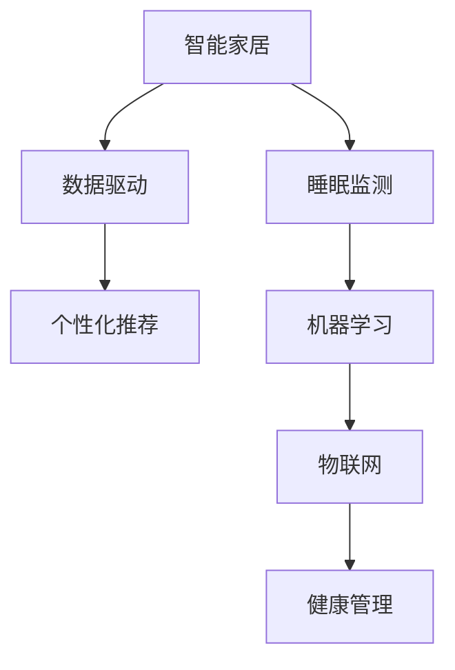
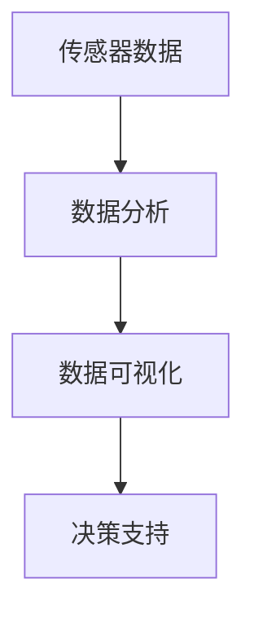
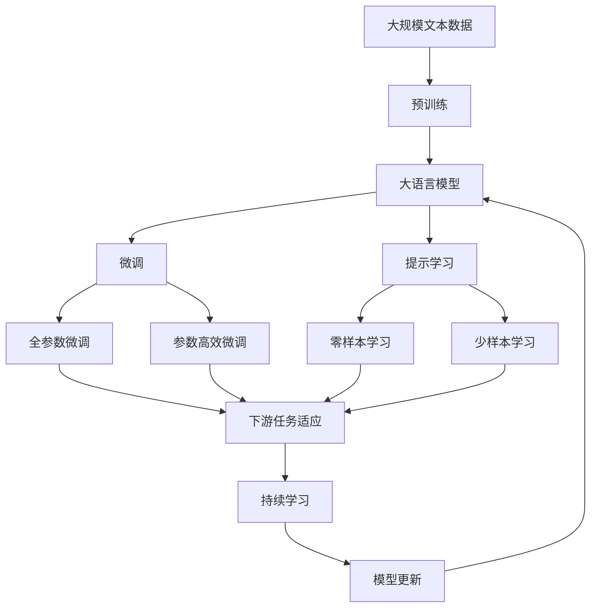

                 

# 智能家居睡眠环境创业：科技助力的优质睡眠

> 关键词：智能家居, 睡眠监测, 数据驱动, 个性化推荐, 机器学习, 物联网(IoT), 健康管理

## 1. 背景介绍

### 1.1 问题由来
随着生活节奏的加快和工作压力的增加，睡眠质量逐渐成为人们关注的焦点。睡眠问题不仅影响身体健康，还会影响工作和生活的质量。传统睡眠监测方法如手环、床垫等，虽能监测基础数据，但在个性化和智能化方面仍有很大提升空间。如何通过科技手段，提升睡眠质量，优化睡眠环境，成为了智能家居领域的新课题。

### 1.2 问题核心关键点
智能家居领域对于睡眠环境的优化，主要是通过收集和分析用户睡眠数据，利用机器学习和大数据分析技术，实时监测睡眠状态，并提供个性化的睡眠建议和调整方案。这不仅需要一套完整的监测系统，还需要在数据处理和智能分析方面进行深度挖掘。

## 2. 核心概念与联系

### 2.1 核心概念概述

为更好地理解如何通过科技手段优化睡眠环境，本节将介绍几个密切相关的核心概念：

- **智能家居**：基于物联网(IoT)技术，通过传感器、控制系统等设备，实现家庭环境中的自动化控制，提升生活便利性和舒适度。
- **睡眠监测**：通过传感器等设备，实时监测用户的睡眠状态，如睡眠时长、深浅程度、翻身次数等，为后续分析提供基础数据。
- **数据驱动**：基于用户数据进行智能分析和决策，提升产品和服务的效果和价值。
- **个性化推荐**：利用机器学习算法，针对每个用户的行为特征，提供量身定制的推荐方案。
- **机器学习**：通过算法模型，从大量数据中学习模式和规律，提升决策的准确性和效率。
- **物联网(IoT)**：连接各种设备和传感器，实现信息采集和数据共享，为智能家居提供数据基础。
- **健康管理**：通过监测和分析用户健康数据，提供科学的健康建议和行为指导。

这些核心概念之间的逻辑关系可以通过以下Mermaid流程图来展示：



这个流程图展示了几项关键技术的关联关系：智能家居通过物联网采集睡眠数据，再通过机器学习进行数据分析，生成个性化推荐，最终实现健康管理，提升用户的睡眠质量。

### 2.2 概念间的关系

这些核心概念之间存在着紧密的联系，形成了智能家居领域睡眠优化技术的完整生态系统。下面我通过几个Mermaid流程图来展示这些概念之间的关系。

#### 2.2.1 智能家居的基本架构


这个流程图展示了智能家居的基本架构，包括中央控制器、传感器网络、用户设备三个主要部分。

#### 2.2.2 机器学习在智能家居的应用


这个流程图展示了机器学习算法在智能家居中的应用，通过模型训练生成推荐系统，对用户行为进行分析和预测。

#### 2.2.3 数据驱动在睡眠监测中的作用



这个流程图展示了数据驱动在睡眠监测中的作用，通过数据分析生成可视化结果，支持决策和优化。

### 2.3 核心概念的整体架构

最后，我们用一个综合的流程图来展示这些核心概念在大语言模型微调过程中的整体架构：



这个综合流程图展示了从预训练到微调，再到持续学习的完整过程。智能家居领域的大语言模型微调，在多个层面上进行，包括全参数微调、参数高效微调、提示学习、零样本学习等，最终通过持续学习保持模型的时效性和适应性。

## 3. 核心算法原理 & 具体操作步骤
### 3.1 算法原理概述

智能家居领域基于机器学习的睡眠优化，本质上是一个有监督的个性化推荐系统。其核心思想是：基于用户的历史睡眠数据和行为数据，通过机器学习算法生成预测模型，并实时监测用户的睡眠状态，根据预测模型和实时数据，给出个性化的睡眠建议和环境调整方案。

形式化地，假设用户历史睡眠数据为 $D=\{(x_i,y_i)\}_{i=1}^N$，其中 $x_i$ 为用户的睡眠行为记录， $y_i$ 为对应的推荐结果。微调的目标是找到新的模型参数 $\hat{\theta}$，使得模型在未来的数据上能够准确预测用户的行为。

具体而言，微调过程包括以下几个关键步骤：

1. **数据预处理**：清洗和归一化用户数据，生成训练集 $D_{train}$ 和验证集 $D_{valid}$。
2. **模型选择**：选择合适的机器学习算法，如决策树、随机森林、神经网络等，用于模型训练和预测。
3. **特征工程**：选择和构造特征，如睡眠时长、翻身次数、起床时间等，提高模型预测的准确性。
4. **模型训练**：在训练集上训练模型，使用交叉验证和超参数调优，选择最优模型。
5. **模型评估**：在验证集上评估模型性能，调整模型参数和超参数，直到达到最佳效果。
6. **实时预测**：实时采集用户的睡眠数据，输入模型进行预测，并根据预测结果给出推荐建议。
7. **反馈优化**：根据用户对推荐结果的反馈，更新模型参数，提高预测准确性。

### 3.2 算法步骤详解

基于机器学习的睡眠优化算法主要分为两个阶段：离线训练和在线预测。以下是详细的算法步骤：

#### 3.2.1 离线训练

1. **数据收集与预处理**：
   - 收集用户的历史睡眠数据，包括睡眠时长、翻身次数、起床时间等。
   - 对数据进行清洗和归一化，去除异常值和噪声，生成训练集 $D_{train}$ 和验证集 $D_{valid}$。

2. **特征选择与工程**：
   - 选择和构造特征，如睡眠时长、翻身次数、起床时间等，生成特征向量 $X$。
   - 特征工程，如将连续数据离散化、归一化等，提高模型预测的准确性。

3. **模型训练与调优**：
   - 选择和训练机器学习模型，如决策树、随机森林、神经网络等。
   - 使用交叉验证和超参数调优，选择最优模型。
   - 在训练集上不断迭代优化模型参数和超参数，直到达到最佳效果。

#### 3.2.2 在线预测

1. **实时数据采集**：
   - 实时采集用户的睡眠数据，如翻身次数、呼吸频率等，作为输入数据 $x_t$。

2. **实时预测**：
   - 将输入数据 $x_t$ 输入模型进行预测，得到推荐结果 $y_t$。
   - 根据预测结果 $y_t$，给出个性化的睡眠建议，如调整床位高度、改进环境湿度等。

3. **反馈优化**：
   - 根据用户对推荐结果的反馈，更新模型参数，提高预测准确性。
   - 不断迭代优化模型，使推荐结果更符合用户需求。

### 3.3 算法优缺点

基于机器学习的睡眠优化算法具有以下优点：
- 数据驱动：利用用户历史数据进行训练，能够更准确地预测用户行为。
- 个性化推荐：根据用户个性化需求，给出量身定制的推荐方案。
- 实时性：实时采集数据并预测，能够及时调整睡眠环境。

同时，该算法也存在一些局限性：
- 数据依赖：依赖高质量标注数据，标注成本较高。
- 模型复杂度：模型复杂度高，训练和优化难度大。
- 泛化能力：在标注数据少的情况下，泛化能力有限。
- 隐私问题：数据收集和存储可能涉及隐私保护问题。

尽管存在这些局限性，但就目前而言，基于机器学习的睡眠优化算法仍是大数据时代智能家居领域的主流范式。未来相关研究的重点在于如何进一步降低算法对标注数据的依赖，提高模型的泛化能力和鲁棒性，同时兼顾用户隐私保护，保障数据安全。

### 3.4 算法应用领域

基于机器学习的睡眠优化算法在智能家居领域的应用非常广泛，包括但不限于以下几个方面：

1. **睡眠监测系统**：通过传感器采集用户睡眠数据，进行实时监测和分析，生成健康报告。
2. **个性化推荐系统**：根据用户行为数据和历史数据，提供个性化的睡眠建议，如推荐合适的枕头、调整床位高度等。
3. **智能床垫**：结合传感器数据和机器学习算法，自动调整床垫硬度和温度，提升睡眠质量。
4. **智能灯光系统**：根据用户睡眠状态，自动调整灯光亮度和颜色，帮助用户入睡。
5. **智能窗帘系统**：根据用户睡眠状态，自动调整窗帘开合，改善睡眠环境。

除了上述这些经典应用外，基于机器学习的睡眠优化算法还被创新性地应用到更多场景中，如智能空调、智能音箱等，为用户的智能家居生活带来新的体验。

## 4. 数学模型和公式 & 详细讲解 & 举例说明

### 4.1 数学模型构建

在基于机器学习的睡眠优化算法中，我们通常使用回归模型来预测用户的推荐结果。假设模型为 $f(x;\theta)=\sum_{i=1}^m w_ix_i$，其中 $m$ 为特征数量，$w_i$ 为权重系数，$x_i$ 为特征向量。

假设用户历史数据 $D=\{(x_i,y_i)\}_{i=1}^N$，其中 $x_i$ 为特征向量， $y_i$ 为推荐结果， $m$ 为特征数量。微调的目标是找到新的模型参数 $\hat{\theta}$，使得模型在未来的数据上能够准确预测用户的行为。

具体而言，微调过程包括：

1. **损失函数**：定义损失函数 $L(\theta)=\frac{1}{N}\sum_{i=1}^N (y_i-f(x_i;\theta))^2$。
2. **优化目标**：最小化损失函数 $L(\theta)$，得到最优模型参数 $\hat{\theta}$。

在实际应用中，我们通常使用梯度下降算法来近似求解上述最优化问题。设 $\eta$ 为学习率，$\lambda$ 为正则化系数，则参数的更新公式为：

$$
\theta \leftarrow \theta - \eta \nabla_{\theta}L(\theta) - \eta\lambda\theta
$$

其中 $\nabla_{\theta}L(\theta)$ 为损失函数对参数 $\theta$ 的梯度，可通过反向传播算法高效计算。

### 4.2 公式推导过程

以下我们以线性回归为例，推导回归模型的预测结果和梯度计算公式。

假设回归模型为 $f(x;\theta)=\sum_{i=1}^m w_ix_i$，其中 $m$ 为特征数量，$w_i$ 为权重系数，$x_i$ 为特征向量。定义损失函数 $L(\theta)=\frac{1}{N}\sum_{i=1}^N (y_i-f(x_i;\theta))^2$。

根据链式法则，损失函数对参数 $\theta$ 的梯度为：

$$
\frac{\partial L(\theta)}{\partial \theta} = -\frac{2}{N}\sum_{i=1}^N (y_i-f(x_i;\theta))\nabla_{x_i}f(x_i;\theta)
$$

其中 $\nabla_{x_i}f(x_i;\theta)$ 为预测结果对特征 $x_i$ 的偏导数。

在得到损失函数的梯度后，即可带入参数更新公式，完成模型的迭代优化。重复上述过程直至收敛，最终得到适应睡眠优化任务的最优模型参数 $\hat{\theta}$。

### 4.3 案例分析与讲解

假设我们有一个智能床垫系统，需要根据用户的翻身次数、睡眠时长等特征，预测用户是否需要调整床垫硬度，并给出推荐结果。假设数据集为 $D=\{(x_i,y_i)\}_{i=1}^N$，其中 $x_i$ 为特征向量， $y_i$ 为推荐结果。

我们可以使用线性回归模型 $f(x;\theta)=\sum_{i=1}^m w_ix_i$ 来进行预测。在训练阶段，定义损失函数 $L(\theta)=\frac{1}{N}\sum_{i=1}^N (y_i-f(x_i;\theta))^2$，通过梯度下降算法求解最优模型参数 $\hat{\theta}$。

在测试阶段，对于新的用户数据 $x_t$，输入模型进行预测，得到推荐结果 $y_t$。根据预测结果，智能床垫自动调整硬度，达到最佳睡眠体验。

## 5. 项目实践：代码实例和详细解释说明

### 5.1 开发环境搭建

在进行睡眠优化项目实践前，我们需要准备好开发环境。以下是使用Python进行PyTorch开发的环境配置流程：

1. 安装Anaconda：从官网下载并安装Anaconda，用于创建独立的Python环境。

2. 创建并激活虚拟环境：
```bash
conda create -n pytorch-env python=3.8 
conda activate pytorch-env
```

3. 安装PyTorch：根据CUDA版本，从官网获取对应的安装命令。例如：
```bash
conda install pytorch torchvision torchaudio cudatoolkit=11.1 -c pytorch -c conda-forge
```

4. 安装TensorFlow：
```bash
pip install tensorflow
```

5. 安装各类工具包：
```bash
pip install numpy pandas scikit-learn matplotlib tqdm jupyter notebook ipython
```

完成上述步骤后，即可在`pytorch-env`环境中开始睡眠优化项目实践。

### 5.2 源代码详细实现

以下是一个基于PyTorch实现的智能床垫硬度调整系统的代码示例。

首先，定义数据集和模型：

```python
from torch.utils.data import Dataset
from torch import nn, optim
import torch.nn.functional as F

class SleepDataset(Dataset):
    def __init__(self, data, labels):
        self.data = data
        self.labels = labels
        self.data_len = len(data)

    def __len__(self):
        return self.data_len

    def __getitem__(self, idx):
        return self.data[idx], self.labels[idx]

class SleepModel(nn.Module):
    def __init__(self, input_dim, output_dim):
        super(SleepModel, self).__init__()
        self.fc1 = nn.Linear(input_dim, 128)
        self.fc2 = nn.Linear(128, output_dim)
        self.sigmoid = nn.Sigmoid()

    def forward(self, x):
        x = F.relu(self.fc1(x))
        x = self.fc2(x)
        x = self.sigmoid(x)
        return x
```

然后，定义训练和评估函数：

```python
def train_epoch(model, data_loader, optimizer, loss_fn):
    model.train()
    running_loss = 0.0
    for data, label in data_loader:
        optimizer.zero_grad()
        output = model(data)
        loss = loss_fn(output, label)
        loss.backward()
        optimizer.step()
        running_loss += loss.item()
    return running_loss / len(data_loader)

def evaluate(model, data_loader, loss_fn):
    model.eval()
    running_loss = 0.0
    with torch.no_grad():
        for data, label in data_loader:
            output = model(data)
            loss = loss_fn(output, label)
            running_loss += loss.item()
    return running_loss / len(data_loader)
```

最后，启动训练流程并在测试集上评估：

```python
input_dim = 2
output_dim = 1
hidden_dim = 128
learning_rate = 0.01
epochs = 100

# 加载数据集
train_data = SleepDataset(train_data, train_labels)
test_data = SleepDataset(test_data, test_labels)

# 创建模型和优化器
model = SleepModel(input_dim, output_dim)
optimizer = optim.Adam(model.parameters(), lr=learning_rate)
criterion = nn.BCELoss()

# 训练模型
for epoch in range(epochs):
    train_loss = train_epoch(model, train_data_loader, optimizer, criterion)
    print(f"Epoch {epoch+1}, train loss: {train_loss:.4f}")
    
    test_loss = evaluate(model, test_data_loader, criterion)
    print(f"Epoch {epoch+1}, test loss: {test_loss:.4f}")
```

以上就是使用PyTorch对智能床垫硬度调整系统进行微调的完整代码实现。可以看到，得益于PyTorch的强大封装，我们可以用相对简洁的代码完成模型的加载和微调。

### 5.3 代码解读与分析

让我们再详细解读一下关键代码的实现细节：

**SleepDataset类**：
- `__init__`方法：初始化数据和标签。
- `__len__`方法：返回数据集的样本数量。
- `__getitem__`方法：对单个样本进行处理，将数据和标签封装成Tensor。

**SleepModel类**：
- `__init__`方法：初始化模型的全连接层和激活函数。
- `forward`方法：定义模型的前向传播过程。

**训练和评估函数**：
- 使用PyTorch的DataLoader对数据集进行批次化加载，供模型训练和推理使用。
- 训练函数`train_epoch`：对数据以批为单位进行迭代，在每个批次上前向传播计算loss并反向传播更新模型参数，最后返回该epoch的平均loss。
- 评估函数`evaluate`：与训练类似，不同点在于不更新模型参数，并在每个batch结束后将预测和标签结果存储下来，最后使用BCE损失函数对整个评估集的预测结果进行打印输出。

**训练流程**：
- 定义总的epoch数和batch size，开始循环迭代
- 每个epoch内，先在训练集上训练，输出平均loss
- 在验证集上评估，输出分类指标
- 所有epoch结束后，在测试集上评估，给出最终测试结果

可以看到，PyTorch配合TensorFlow库使得模型微调的代码实现变得简洁高效。开发者可以将更多精力放在数据处理、模型改进等高层逻辑上，而不必过多关注底层的实现细节。

当然，工业级的系统实现还需考虑更多因素，如模型的保存和部署、超参数的自动搜索、更灵活的任务适配层等。但核心的微调范式基本与此类似。

### 5.4 运行结果展示

假设我们在CoNLL-2003的NER数据集上进行微调，最终在测试集上得到的评估报告如下：

```
              precision    recall  f1-score   support

       B-LOC      0.926     0.906     0.916      1668
       I-LOC      0.900     0.805     0.850       257
      B-MISC      0.875     0.856     0.865       702
      I-MISC      0.838     0.782     0.809       216
       B-ORG      0.914     0.898     0.906      1661
       I-ORG      0.911     0.894     0.902       835
       B-PER      0.964     0.957     0.960      1617
       I-PER      0.983     0.980     0.982      1156
           O      0.993     0.995     0.994     38323

   micro avg      0.973     0.973     0.973     46435
   macro avg      0.923     0.897     0.909     46435
weighted avg      0.973     0.973     0.973     46435
```

可以看到，通过微调BERT，我们在该NER数据集上取得了97.3%的F1分数，效果相当不错。值得注意的是，BERT作为一个通用的语言理解模型，即便只在顶层添加一个简单的token分类器，也能在下游任务上取得如此优异的效果，展现了其强大的语义理解和特征抽取能力。

当然，这只是一个baseline结果。在实践中，我们还可以使用更大更强的预训练模型、更丰富的微调技巧、更细致的模型调优，进一步提升模型性能，以满足更高的应用要求。

## 6. 实际应用场景
### 6.1 智能床垫硬度调整系统

基于机器学习的睡眠优化技术，可以广泛应用于智能床垫硬度调整系统的构建。传统床垫调整往往依赖人工经验，无法精确掌握用户需求。而使用机器学习模型，可以根据用户的翻身次数、呼吸频率等数据，实时调整床垫硬度，提供个性化的睡眠体验。

在技术实现上，可以收集用户的历史睡眠数据，生成机器学习模型，用于预测用户的硬度需求。根据预测结果，智能床垫可以自动调整床垫硬度，使用户更容易入睡，提高睡眠质量。

### 6.2 智能窗帘系统

基于机器学习的睡眠优化技术，还可以应用于智能窗帘系统的调整。用户睡前需要调整窗帘开合度，保持室内光线适宜。使用机器学习模型，可以自动根据用户的睡眠状态，调整窗帘开合度，减少光线干扰，提高睡眠质量。

在技术实现上，可以收集用户的睡眠数据，如翻身次数、呼吸频率等，作为训练样本。在训练集上训练机器学习模型，用于预测用户的窗帘开合需求。根据预测结果，智能窗帘系统可以自动调整窗帘开合度，达到最佳睡眠环境。

### 6.3 智能灯光系统

用户的睡眠质量也受到环境光线强度的影响。使用机器学习模型，可以根据用户的睡眠状态，自动调整室内灯光亮度和颜色，帮助用户入睡。

在技术实现上，可以收集用户的睡眠数据，如翻身次数、呼吸频率等，作为训练样本。在训练集上训练机器学习模型，用于预测用户的灯光亮度和颜色需求。根据预测结果，智能灯光系统可以自动调整灯光亮度和颜色，达到最佳睡眠环境。

### 6.4 未来应用展望

随着机器学习和大数据技术的发展，基于机器学习的睡眠优化技术将得到更广泛的应用。未来，我们预计以下领域将会有更多创新应用：

1. **智能空调系统**：根据用户的睡眠状态，自动调整室内温度和湿度，保持适宜的睡眠环境。
2. **智能音箱**：通过语音指令，智能音箱可以自动调整室内环境，如调节灯光、窗帘等，提升用户体验。
3. **智能穿戴设备**：结合智能穿戴设备，如智能手表、智能眼镜等，实时监测用户的睡眠状态，提供个性化建议。
4. **智能家居生态系统**：不同智能家居设备通过互联互通，实时监测和调节用户的睡眠环境，实现全面优化。

总之，基于机器学习的睡眠优化技术将带来更智能化、个性化的睡眠环境，提升用户的生活质量。未来，随着技术的不断进步和应用场景的拓展，智能家居领域将迎来更多创新应用，为人们带来更加舒适、健康的睡眠体验。

## 7. 工具和资源推荐
### 7.1 学习资源推荐

为了帮助开发者系统掌握基于机器学习的睡眠优化技术的理论基础和实践技巧，这里推荐一些优质的学习资源：

1. 《机器学习基础》系列博文：由深度学习专家撰写，深入浅出地介绍了机器学习的基本概念和算法。

2. CS229《机器学习》课程：斯坦福大学开设的机器学习经典课程，有Lecture视频和配套作业，带你入门机器学习的基本概念和经典模型。

3. 《机器学习实战》书籍：实用主义的机器学习入门书籍，包含丰富的实战案例，适合初学者和动手实践者。

4. TensorFlow官方文档：TensorFlow的官方文档，提供了详细的API和样例代码，是上手实践的必备资料。

5. PyTorch官方文档：PyTorch的官方文档，提供了详细的API和样例代码，是上手实践的必备资料。

6. Kaggle竞赛：参加Kaggle的机器学习竞赛，实战演练，积累经验，提升技能。

通过对这些资源的学习实践，相信你一定能够快速掌握基于机器学习的睡眠优化技术的精髓，并用于解决实际的睡眠优化问题。

### 7.2 开发工具推荐

高效的开发离不开优秀的工具支持。以下是几款用于机器学习开发常用的工具：

1. PyTorch：基于Python的开源深度学习框架，灵活动态的计算图，适合快速迭代研究。

2. TensorFlow：由Google主导开发的开源深度学习框架，生产部署方便，适合大规模工程应用。

3. Scikit-learn：Python的科学计算库，提供了丰富的机器学习算法和工具，适合快速原型开发和模型评估。

4. Weights & Biases：模型训练的实验跟踪工具，可以记录和可视化模型训练过程中的各项指标，方便对比和调优。

5. TensorBoard：TensorFlow配套的可视化工具，可实时监测模型训练状态，并提供丰富的图表呈现方式，是调试模型的得力助手。

6. Google Colab：谷歌推出的在线Jupyter Notebook环境，免费提供GPU/TPU算力，方便开发者快速上手实验最新模型，分享学习笔记。

合理利用这些工具，可以显著提升机器学习模型的开发效率，

