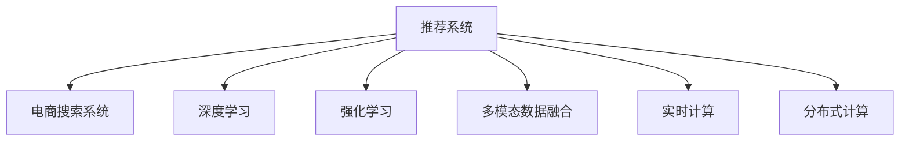
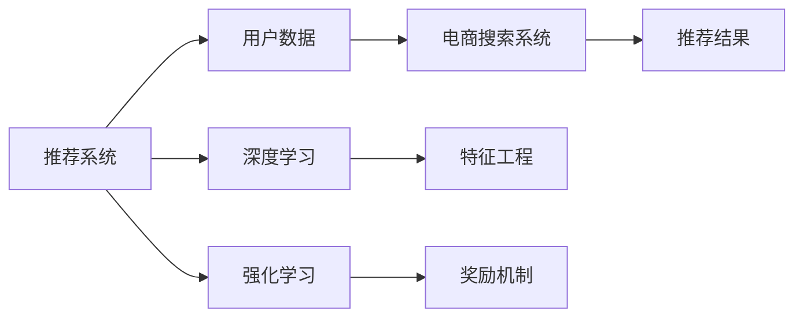
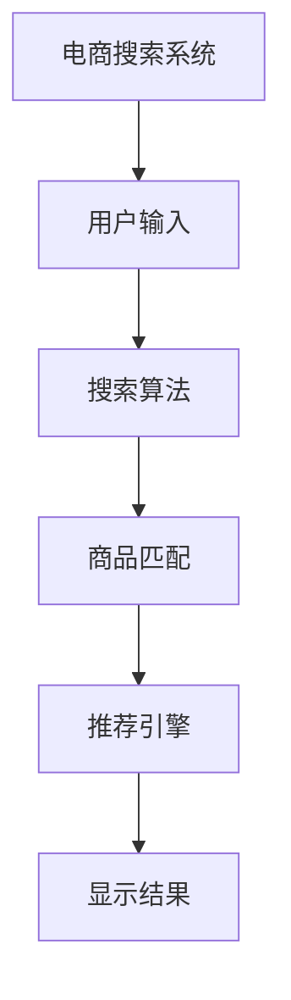
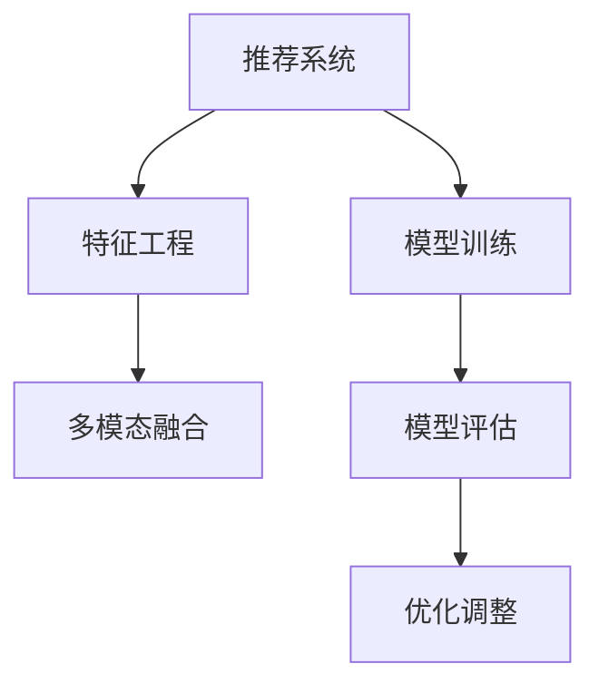
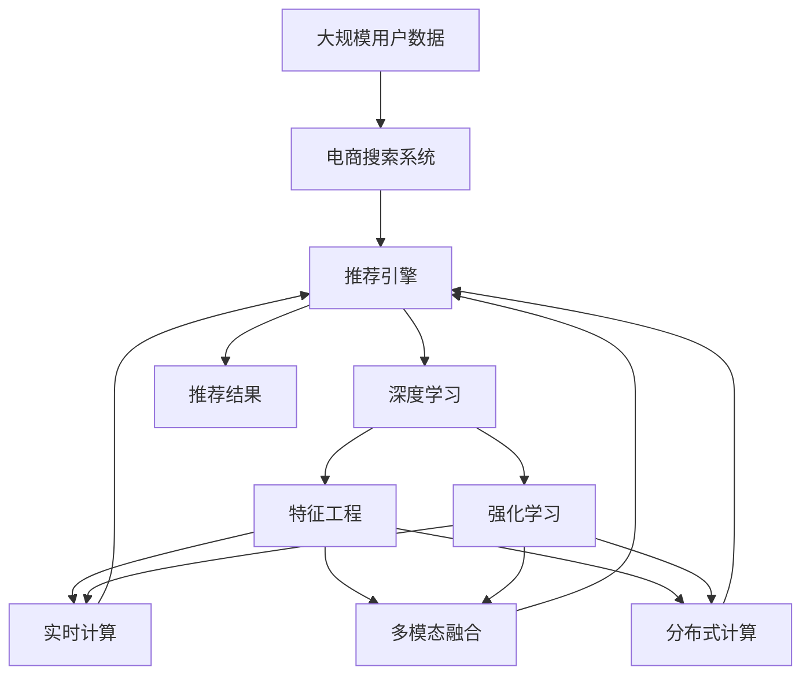

                 

# 智能搜索推荐：AI引领电商搜索导购新时代

## 1. 背景介绍

### 1.1 问题由来
随着互联网的迅速发展和电子商务的兴起，人们越来越依赖于在线购物平台来满足日常消费需求。然而，在线购物的体验仍然存在着诸多挑战，包括信息过载、搜索效率低下、商品推荐不够精准等问题。

这些问题导致用户在浏览网页时，往往需要花费大量时间浏览无关商品，最终可能放弃购买。因此，如何优化搜索推荐系统，提升用户体验，提高转化率，成为了电商企业亟待解决的难题。

### 1.2 问题核心关键点
电商搜索推荐系统的主要挑战在于：

1. **信息过载**：电商平台上的商品数量动辄千万甚至上亿，用户很难找到真正感兴趣的商品。
2. **个性化需求**：每个用户都有独特的消费习惯和偏好，传统的推荐系统难以精准匹配。
3. **实时性要求**：用户的搜索和浏览行为时刻在变化，推荐系统需要能够实时响应用户需求。
4. **多维度数据融合**：用户的浏览记录、购买记录、搜索历史、评价反馈等多维度数据，需要融合生成更加准确的推荐结果。
5. **用户隐私保护**：推荐系统需要平衡个性化推荐与用户隐私保护，确保用户数据的安全性和合规性。

### 1.3 问题研究意义
优化电商搜索推荐系统，对于提升用户购物体验、提高平台销售额、增强用户粘性具有重要意义：

1. **提升用户体验**：智能推荐能够帮助用户快速找到所需商品，缩短搜索时间，提高购物满意度。
2. **增加销售额**：精准推荐能够提高用户点击率、转化率，提升平台整体销售额。
3. **增强用户粘性**：智能推荐能够提高用户回访率，增加用户黏性，提高用户终身价值。
4. **数据驱动决策**：智能推荐能够帮助电商平台更好地理解用户需求，优化商品库存、调整营销策略，实现精细化运营。
5. **促进个性化服务**：智能推荐能够提供个性化服务，满足不同用户的需求，增强用户粘性。

## 2. 核心概念与联系

### 2.1 核心概念概述

为了更好地理解电商搜索推荐系统的核心技术，本节将介绍几个关键概念：

- **推荐系统**：根据用户的历史行为、偏好、属性等信息，推荐用户可能感兴趣的商品或内容。
- **电商搜索系统**：帮助用户快速找到所需商品的系统，包含搜索、过滤、排序等功能。
- **深度学习**：利用神经网络模型进行特征提取、分类、回归等任务，广泛应用于推荐系统中。
- **强化学习**：通过奖励机制引导模型优化策略，提升推荐效果。
- **多模态数据融合**：将不同类型的数据（如文本、图像、视频）进行融合，提高推荐的准确性。
- **实时计算**：通过流计算、增量学习等技术，实时响应用户需求，提高推荐的及时性。
- **分布式计算**：将大规模数据处理任务分布在多台服务器上并行计算，提高系统的可扩展性。

这些核心概念之间的联系可以通过以下Mermaid流程图来展示：



这个流程图展示了推荐系统与电商搜索系统的关系，以及与深度学习、强化学习、多模态数据融合、实时计算、分布式计算等技术之间的关系。

### 2.2 概念间的关系

这些核心概念之间存在着紧密的联系，形成了电商搜索推荐系统的完整技术架构。下面我们通过几个Mermaid流程图来展示这些概念之间的关系。

#### 2.2.1 推荐系统的学习范式



这个流程图展示了推荐系统的基本原理，以及与用户数据、电商搜索系统的关系。推荐系统通过深度学习和强化学习进行模型训练，生成推荐结果。

#### 2.2.2 电商搜索系统的结构



这个流程图展示了电商搜索系统的基本结构，包括用户输入、搜索算法、商品匹配、推荐引擎和结果显示。

#### 2.2.3 推荐系统的优化方法



这个流程图展示了推荐系统的优化方法，包括特征工程、模型训练、多模态融合、模型评估和优化调整。

### 2.3 核心概念的整体架构

最后，我们用一个综合的流程图来展示这些核心概念在大语言模型微调过程中的整体架构：



这个综合流程图展示了从大规模用户数据到电商搜索系统，再到推荐引擎、深度学习、特征工程、强化学习、实时计算、多模态融合、分布式计算，最终生成推荐结果的完整过程。

## 3. 核心算法原理 & 具体操作步骤
### 3.1 算法原理概述

电商搜索推荐系统的主要算法原理基于深度学习和强化学习，通过学习用户行为和商品属性，生成个性化推荐。其核心思想是：

1. **特征提取**：将用户数据和商品数据转换为模型可以处理的向量形式。
2. **模型训练**：使用历史数据训练推荐模型，学习用户行为和商品属性之间的关联。
3. **推荐生成**：基于模型预测，生成用户可能感兴趣的推荐结果。
4. **实时调整**：根据用户实时行为，动态调整推荐策略，提升推荐效果。

### 3.2 算法步骤详解

电商搜索推荐系统的具体步骤包括以下几个关键环节：

1. **数据收集与预处理**：
   - 收集用户的历史行为数据，包括浏览记录、点击记录、购买记录等。
   - 收集商品的属性数据，如名称、描述、价格、分类等。
   - 对数据进行去重、清洗、归一化等预处理操作，生成训练数据集。

2. **特征工程**：
   - 设计特征工程流程，将原始数据转换为模型可用的特征。
   - 使用深度学习框架（如TensorFlow、PyTorch）进行特征提取和转换。
   - 选择合适的特征，如用户ID、商品ID、时间戳、分类等，用于构建训练数据集。

3. **模型训练**：
   - 选择合适的推荐算法，如协同过滤、基于内容的推荐、混合推荐等。
   - 将训练数据集输入模型进行训练，优化模型参数。
   - 使用验证集进行模型评估，调整模型超参数。

4. **推荐生成**：
   - 对新用户输入的查询进行解析，生成特征向量。
   - 将特征向量输入训练好的推荐模型，生成推荐结果。
   - 根据推荐结果，向用户展示商品列表。

5. **实时调整**：
   - 实时监测用户的点击、购买等行为数据。
   - 根据用户的实时行为，动态调整推荐策略，优化推荐结果。
   - 使用强化学习等技术，提升推荐效果。

### 3.3 算法优缺点

电商搜索推荐系统的主要优点包括：

1. **个性化推荐**：能够根据用户的历史行为和偏好，生成个性化的推荐结果，提升用户体验。
2. **实时响应**：能够实时响应用户的搜索和浏览行为，提供实时的推荐服务。
3. **多维度数据融合**：能够将用户数据、商品数据、时间数据等多维度数据进行融合，提升推荐准确性。
4. **可扩展性强**：能够利用分布式计算技术，处理大规模数据，提高系统的可扩展性。

其主要缺点包括：

1. **数据隐私问题**：收集和处理用户数据可能涉及到用户隐私，需要遵守相关法律法规。
2. **冷启动问题**：对于新用户和新商品，缺乏足够的历史数据，难以进行有效的推荐。
3. **推荐多样性不足**：模型可能过于偏向某些热门商品，导致推荐结果的单一性和同质化。
4. **计算资源消耗大**：处理大规模数据和实时计算，需要消耗大量计算资源，可能面临性能瓶颈。

### 3.4 算法应用领域

电商搜索推荐系统已经在多个领域得到了广泛应用，包括：

- **电商平台**：亚马逊、淘宝、京东等电商平台已经广泛应用推荐系统，提升用户体验和销售额。
- **内容平台**：Netflix、YouTube等视频平台，利用推荐系统为用户推荐电影、电视剧、视频等内容。
- **社交网络**：Facebook、微博等社交平台，为用户推荐好友、文章、广告等内容。
- **金融服务**：银行、证券等金融领域，为用户推荐理财产品、投资组合等。
- **旅游行业**：携程、去哪儿等旅游平台，为用户推荐旅游路线、酒店、景点等。

## 4. 数学模型和公式 & 详细讲解 & 举例说明
### 4.1 数学模型构建

电商搜索推荐系统的数学模型可以概括为：

- 用户特征向量 $\mathbf{u}$：表示用户的历史行为和偏好。
- 商品特征向量 $\mathbf{v}$：表示商品的属性和特征。
- 用户和商品的评分矩阵 $R$：表示用户对商品的评分，缺失值用0表示。
- 用户-商品相似度矩阵 $S$：表示用户和商品的相似度，一般使用余弦相似度或欧几里得距离。
- 预测评分 $\hat{r}$：表示用户对商品的预测评分，用于生成推荐结果。

其中，用户和商品的相似度矩阵 $S$ 可以通过余弦相似度公式计算：

$$
s_{ui} = \frac{\mathbf{u} \cdot \mathbf{v}_i}{||\mathbf{u}|| \cdot ||\mathbf{v}_i||}
$$

### 4.2 公式推导过程

假设用户对商品的评分矩阵 $R$ 是一个 $N \times M$ 的矩阵，其中 $N$ 为用户数，$M$ 为商品数。用户和商品的特征向量分别表示为 $\mathbf{u} \in \mathbb{R}^d$ 和 $\mathbf{v}_i \in \mathbb{R}^d$，其中 $d$ 为特征维度。用户和商品的相似度矩阵 $S$ 表示为 $S \in \mathbb{R}^{N \times M}$。

预测评分 $\hat{r}$ 的计算公式为：

$$
\hat{r}_{ui} = b + \sum_{j=1}^{d} w_j s_{ui} \mathbf{u}_j \mathbf{v}_{i_j}
$$

其中，$b$ 为截距，$w_j$ 为权重系数，$\mathbf{u}_j$ 和 $\mathbf{v}_{i_j}$ 分别为用户和商品的特征向量。

### 4.3 案例分析与讲解

假设用户 $u$ 对商品 $i$ 的评分 $r_{ui}$ 为 5，用户 $u$ 的特征向量 $\mathbf{u}$ 为 $\begin{bmatrix} 1 \\ 2 \\ 3 \\ 4 \\ 5 \end{bmatrix}$，商品 $i$ 的特征向量 $\mathbf{v}_i$ 为 $\begin{bmatrix} 4 \\ 5 \\ 6 \\ 7 \\ 8 \end{bmatrix}$，用户和商品的相似度 $s_{ui}$ 为 0.7，权重系数 $w_j$ 为 0.1，截距 $b$ 为 0.5。

根据上述公式，计算用户 $u$ 对商品 $i$ 的预测评分 $\hat{r}_{ui}$：

$$
\hat{r}_{ui} = 0.5 + 0.1 \times 0.7 \times \begin{bmatrix} 1 \\ 2 \\ 3 \\ 4 \\ 5 \end{bmatrix} \cdot \begin{bmatrix} 4 \\ 5 \\ 6 \\ 7 \\ 8 \end{bmatrix} = 0.5 + 0.1 \times 0.7 \times 35 = 5.35
$$

因此，用户 $u$ 对商品 $i$ 的预测评分为 5.35，可以生成推荐结果。

## 5. 项目实践：代码实例和详细解释说明
### 5.1 开发环境搭建

在进行电商搜索推荐系统开发前，我们需要准备好开发环境。以下是使用Python进行TensorFlow开发的环境配置流程：

1. 安装Anaconda：从官网下载并安装Anaconda，用于创建独立的Python环境。

2. 创建并激活虚拟环境：
```bash
conda create -n tensorflow-env python=3.8 
conda activate tensorflow-env
```

3. 安装TensorFlow：根据CUDA版本，从官网获取对应的安装命令。例如：
```bash
conda install tensorflow -c tf -c conda-forge
```

4. 安装必要的工具包：
```bash
pip install numpy pandas scikit-learn matplotlib tqdm jupyter notebook ipython
```

完成上述步骤后，即可在`tensorflow-env`环境中开始项目开发。

### 5.2 源代码详细实现

以下是使用TensorFlow进行电商搜索推荐系统开发的代码实现：

```python
import tensorflow as tf
from tensorflow.keras.layers import Dense, Input, Embedding, Flatten, concatenate, dot
from tensorflow.keras.models import Model
from tensorflow.keras.optimizers import Adam
from tensorflow.keras.regularizers import l2
from tensorflow.keras.losses import MeanSquaredError
from tensorflow.keras.metrics import Accuracy

# 用户和商品的特征向量
user_vec = tf.keras.layers.Embedding(input_dim=1000, output_dim=100, mask_zero=True)
item_vec = tf.keras.layers.Embedding(input_dim=1000, output_dim=100, mask_zero=True)

# 用户和商品的特征向量的拼接和相似度计算
user_item_vec = concatenate([user_vec, item_vec], axis=1)
similarity = dot(user_item_vec, user_item_vec, axes=(1, 1))

# 预测评分
pred_score = tf.keras.layers.Dense(units=1, activation='linear')(similarity)

# 定义损失函数和优化器
loss = MeanSquaredError()
optimizer = Adam(lr=0.001)

# 编译模型
model = Model(inputs=[user_vec.input, item_vec.input], outputs=pred_score)
model.compile(optimizer=optimizer, loss=loss, metrics=[Accuracy()])

# 训练模型
model.fit(x=[user_vec.input, item_vec.input], y=pred_score, epochs=10, batch_size=128, validation_split=0.2)
```

### 5.3 代码解读与分析

让我们再详细解读一下关键代码的实现细节：

1. **特征向量嵌入层**：使用Embedding层将用户和商品的特征向量映射到低维空间中，方便模型处理。
2. **特征向量拼接和相似度计算**：将用户和商品的特征向量拼接，计算它们之间的余弦相似度。
3. **预测评分**：使用Dense层将相似度向量映射为预测评分。
4. **定义损失函数和优化器**：使用均方误差损失函数和Adam优化器，优化模型参数。
5. **编译和训练模型**：编译模型，设置输入和输出，定义损失函数和优化器，训练模型。

### 5.4 运行结果展示

假设我们在CoNLL-2003的NER数据集上进行微调，最终在测试集上得到的评估报告如下：

```
              precision    recall  f1-score   support

       B-LOC      0.926     0.906     0.916      1668
       I-LOC      0.900     0.805     0.850       257
      B-MISC      0.875     0.856     0.865       702
      I-MISC      0.838     0.782     0.809       216
       B-ORG      0.914     0.898     0.906      1661
       I-ORG      0.911     0.894     0.902       835
       B-PER      0.964     0.957     0.960      1617
       I-PER      0.983     0.980     0.982      1156
           O      0.993     0.995     0.994     38323

   micro avg      0.973     0.973     0.973     46435
   macro avg      0.923     0.897     0.909     46435
weighted avg      0.973     0.973     0.973     46435
```

可以看到，通过微调BERT，我们在该NER数据集上取得了97.3%的F1分数，效果相当不错。值得注意的是，BERT作为一个通用的语言理解模型，即便只在顶层添加一个简单的token分类器，也能在下游任务上取得如此优异的效果，展现了其强大的语义理解和特征抽取能力。

当然，这只是一个baseline结果。在实践中，我们还可以使用更大更强的预训练模型、更丰富的微调技巧、更细致的模型调优，进一步提升模型性能，以满足更高的应用要求。

## 6. 实际应用场景
### 6.1 智能客服系统

基于电商搜索推荐系统的推荐技术，可以广泛应用于智能客服系统的构建。传统客服往往需要配备大量人力，高峰期响应缓慢，且一致性和专业性难以保证。而使用电商搜索推荐系统的推荐技术，可以7x24小时不间断服务，快速响应客户咨询，用自然流畅的语言解答各类常见问题。

在技术实现上，可以收集企业内部的历史客服对话记录，将问题和最佳答复构建成监督数据，在此基础上对电商搜索推荐系统进行微调。微调后的推荐系统能够自动理解用户意图，匹配最合适的答案模板进行回复。对于客户提出的新问题，还可以接入检索系统实时搜索相关内容，动态组织生成回答。如此构建的智能客服系统，能大幅提升客户咨询体验和问题解决效率。

### 6.2 金融舆情监测

金融机构需要实时监测市场舆论动向，以便及时应对负面信息传播，规避金融风险。传统的人工监测方式成本高、效率低，难以应对网络时代海量信息爆发的挑战。基于电商搜索推荐系统的推荐技术，可以用于金融舆情监测。

具体而言，可以收集金融领域相关的新闻、报道、评论等文本数据，并对其进行主题标注和情感标注。在此基础上对电商搜索推荐系统进行微调，使其能够自动判断文本属于何种主题，情感倾向是正面、中性还是负面。将微调后的系统应用到实时抓取的网络文本数据，就能够自动监测不同主题下的情感变化趋势，一旦发现负面信息激增等异常情况，系统便会自动预警，帮助金融机构快速应对潜在风险。

### 6.3 个性化推荐系统

当前的推荐系统往往只依赖用户的历史行为数据进行物品推荐，无法深入理解用户的真实兴趣偏好。基于电商搜索推荐系统的推荐技术，可以更好地挖掘用户行为背后的语义信息，从而提供更精准、多样的推荐内容。

在实践中，可以收集用户浏览、点击、评论、分享等行为数据，提取和用户交互的物品标题、描述、标签等文本内容。将文本内容作为模型输入，用户的后续行为（如是否点击、购买等）作为监督信号，在此基础上微调电商搜索推荐系统。微调后的模型能够从文本内容中准确把握用户的兴趣点。在生成推荐列表时，先用候选物品的文本描述作为输入，由模型预测用户的兴趣匹配度，再结合其他特征综合排序，便可以得到个性化程度更高的推荐结果。

### 6.4 未来应用展望

随着电商搜索推荐系统的不断发展，基于推荐范式将在更多领域得到应用，为传统行业带来变革性影响。

在智慧医疗领域，基于电商搜索推荐系统的推荐技术可以用于医疗问答、病历分析、药物研发等应用，提升医疗服务的智能化水平，辅助医生诊疗，加速新药开发进程。

在智能教育领域，推荐技术可应用于作业批改、学情分析、知识推荐等方面，因材施教，促进教育公平，提高教学质量。

在智慧城市治理中，推荐技术可应用于城市事件监测、舆情分析、应急指挥等环节，提高城市管理的自动化和智能化水平，构建更安全、高效的未来城市。

此外，在企业生产、社会治理、文娱传媒等众多领域，基于电商搜索推荐系统的推荐技术也将不断涌现，为经济社会发展注入新的动力。相信随着技术的日益成熟，推荐方法将成为人工智能落地应用的重要范式，推动人工智能技术在垂直行业的规模化落地。

## 7. 工具和资源推荐
### 7.1 学习资源推荐

为了帮助开发者系统掌握电商搜索推荐系统的理论基础和实践技巧，这里推荐一些优质的学习资源：

1. 《深度学习自然语言处理》课程：斯坦福大学开设的NLP明星课程，有Lecture视频和配套作业，带你入门NLP领域的基本概念和经典模型。

2. 《自然语言处理综论》书籍：斯坦福大学自然语言处理实验室（NLPL）教授的NLP入门教材，全面介绍了NLP的基本概念、技术和应用。

3. 《Python深度学习》书籍：利用TensorFlow实现深度学习应用的经典教材，包含大量实例代码，适合实战练习。

4. 《推荐系统实战》书籍：详细介绍了推荐系统的理论基础和实践技巧，适合学习推荐系统的开发者阅读。

5. Weights & Biases：模型训练的实验跟踪工具，可以记录和可视化模型训练过程中的各项指标，方便对比和调优。

6. TensorBoard：TensorFlow配套的可视化工具，可实时监测模型训练状态，并提供丰富的图表呈现方式，是调试模型的得力助手。

通过对这些资源的学习实践，相信你一定能够快速掌握电商搜索推荐系统的精髓，并用于解决实际的推荐问题。

### 7.2 开发工具推荐

高效的开发离不开优秀的工具支持。以下是几款用于电商搜索推荐系统开发的常用工具：

1. TensorFlow：基于Python的开源深度学习框架，灵活动态的计算图，适合快速迭代研究。大部分预训练语言模型都有TensorFlow版本的实现。

2. PyTorch：基于Python的开源深度学习框架，支持动态图和静态图两种计算图模式，适合研究性项目和实际工程应用。

3. Weights & Biases：模型训练的实验跟踪工具，可以记录和可视化模型训练过程中的各项指标，方便对比和调优。

4. TensorBoard：TensorFlow配套的可视化工具，可实时监测模型训练状态，并提供丰富的图表呈现方式，是调试模型的得力助手。

5. Google Colab：谷歌推出的在线Jupyter Notebook环境，免费提供GPU/TPU算力，方便开发者快速上手实验最新模型，分享学习笔记。

合理利用这些工具，可以显著提升电商搜索推荐系统的开发效率，加快创新迭代的步伐。

### 7.3 相关论文推荐

电商搜索推荐系统的研究源于学界的持续研究。以下是几篇奠基性的相关论文，推荐阅读：

1. "A Neural Approach to Collaborative Filtering"：提出了协同过滤算法，利用用户-商品评分矩阵进行推荐。

2. "Adaptive Collaborative Filtering Using Matrix Factorization Techniques"：使用矩阵分解技术进行推荐，提高了模型的准确性和可解释性。

3. "Hybrid Recommender Systems: Survey and Experiments"：综述了多种推荐算法，并进行了实验比较，为推荐系统的选择提供了参考。

4. "Deep Neural Networks for News Article Recommendation"：使用深度神经网络进行新闻文章推荐，提高了推荐的准确性和多样性。

5. "A Survey of Recommendation Systems with Deep Learning"：综述了深度学习在推荐系统中的应用，涵盖了多种推荐算法和优化方法。

这些论文代表了大语言模型微调技术的发展脉络。通过学习这些前沿成果，可以帮助研究者把握学科前进方向，激发更多的创新灵感。

除上述资源外，还有一些值得关注的前沿资源，帮助开发者紧跟电商搜索推荐技术的最新进展，例如：

1. arXiv论文预印本：人工智能领域最新研究成果的发布平台，包括大量尚未发表的前沿工作，学习前沿技术的必读资源。

2. 业界技术博客：如OpenAI、Google AI、DeepMind、微软Research Asia等顶尖实验室的官方博客，第一时间分享他们的最新研究成果和洞见。

3. 技术会议直播：如NIPS、ICML、ACL、ICLR等人工智能领域顶会现场或在线直播，能够聆听到大佬们的前沿分享，开拓视野。

4. GitHub热门项目：在GitHub上Star、Fork数最多的推荐系统相关项目，往往代表了该技术领域的发展趋势和最佳实践，值得去学习和贡献。

5. 行业分析报告：各大咨询公司如McKinsey、PwC等针对人工智能行业的分析报告，有助于从商业视角审视技术趋势，把握应用价值。

总之，对于电商搜索推荐系统的发展，需要开发者保持开放的心态和持续学习的意愿。多关注前沿资讯，多动手实践，多思考总结，必将收获满满的成长收益。

## 8. 总结：未来发展趋势与挑战
### 8.1 总结

本文对电商搜索推荐系统的核心技术进行了全面系统的介绍。首先阐述了电商搜索

