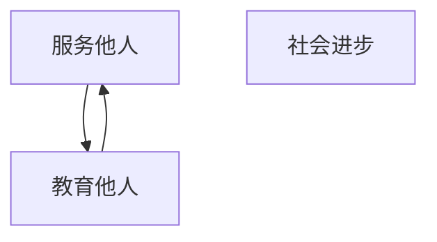

                 

# 服务他人，教育他人：价值创造的两种方式

> 关键词：价值创造, 服务与教育, 技术赋能, 社会责任, 共生共荣, 可持续发展

## 1. 背景介绍

在快速发展的数字化时代，技术力量正在以前所未有的速度改变着我们的生活。无论是从云计算、大数据到人工智能、物联网，技术的进步都在不断拓展人类社会的发展边界，促进了社会生产力的提升和人民生活水平的提高。然而，技术的发展也带来了一系列新的挑战和问题，例如数据隐私保护、技术滥用、社会不平等等等。

在这样的背景下，如何发挥技术的正面价值，确保技术发展的可持续性，成为了我们这一代人所面临的重要课题。而在这个过程中，服务他人、教育他人，成为了我们最核心的价值创造方式。本文将从这两个方面出发，深入探讨如何利用技术为社会创造更大价值。

## 2. 核心概念与联系

### 2.1 核心概念概述

**服务他人**：指的是通过技术手段，提供高效率、高质量、个性化的服务，帮助他人解决问题，提升生活质量。这包括医疗、教育、金融、物流等多个领域。

**教育他人**：指的是通过技术手段，普及知识、提升技能、培养素质，使更多人能够掌握先进的生产技术，提高个人和社会竞争力。

### 2.2 核心概念间的关系

服务他人和教育他人，虽看似两个独立的方面，但其实有着紧密的联系。教育他人能够为服务他人提供更坚实的基础，而服务他人则可以为教育他人创造更好的条件。两者相辅相成，共同推动社会的进步和发展。

以下是Mermaid流程图，展示服务他人和教育他人的联系：



这个流程图展示了服务他人和教育他人对社会进步的双重推动作用。服务他人能够直接改善人们的生活质量，而教育他人则能够提升社会整体的创新能力和生产力，两者共同推动社会的可持续发展。

### 2.3 核心概念的整体架构

通过服务他人和教育他人，我们可以构建一个可持续发展的社会框架。以下是整个架构的详细描述：

1. **服务他人**：
    - **医疗健康**：利用人工智能、大数据、物联网等技术，提供个性化医疗健康服务。
    - **智慧教育**：使用教育技术、虚拟现实等手段，为学生提供更丰富的学习体验。
    - **智能物流**：通过自动化、云计算等技术，提高物流效率和准确性。
    - **金融服务**：利用区块链、人工智能等技术，提供安全便捷的金融服务。

2. **教育他人**：
    - **在线教育**：利用互联网、大数据等技术，为更多人提供优质教育资源。
    - **职业教育**：使用虚拟现实、增强现实等技术，为职业培训提供更直观的体验。
    - **素质培养**：通过人工智能、虚拟现实等技术，培养学生的综合素质和创新能力。
    - **技能提升**：利用机器学习、自然语言处理等技术，帮助成人提升职业技能。

## 3. 核心算法原理 & 具体操作步骤

### 3.1 算法原理概述

服务他人和教育他人的技术手段，通常包括以下几个核心算法原理：

1. **机器学习与深度学习**：通过数据训练模型，自动分析、预测和优化决策过程。
2. **自然语言处理(NLP)**：使机器能够理解和处理人类语言，实现人机交互。
3. **计算机视觉(CV)**：让机器具备视觉识别和处理能力，支持视频、图像等数据的自动化分析。
4. **物联网(IoT)**：实现设备与设备、设备与人的无缝连接，提升生产效率和智能化水平。

### 3.2 算法步骤详解

以智慧医疗为例，以下是智慧医疗系统的算法步骤：

1. **数据采集**：通过可穿戴设备、医院系统等渠道，收集病人的生理指标、病史等信息。
2. **数据清洗与预处理**：清洗数据中的噪声和不一致性，进行标准化和归一化处理。
3. **模型训练**：利用机器学习算法，对数据进行建模和训练，形成诊断和治疗建议。
4. **预测与推荐**：根据输入数据，输出诊断结果和治疗方案。
5. **反馈与优化**：根据医生的反馈和病人的反馈，不断优化模型，提升诊断和治疗效果。

### 3.3 算法优缺点

服务他人和教育他人的技术手段，有以下优点和缺点：

**优点**：
1. **效率提升**：通过自动化技术，大幅度提升服务效率和教育效率。
2. **个性化服务**：能够根据用户需求和行为数据，提供定制化的服务。
3. **数据驱动决策**：利用数据和算法，提供更加客观和科学的决策支持。

**缺点**：
1. **隐私和安全**：数据隐私和安全问题，可能带来数据泄露和滥用的风险。
2. **技术复杂**：技术实现和维护相对复杂，需要专业知识和经验。
3. **依赖基础设施**：技术应用依赖于稳定的基础设施和网络环境。

### 3.4 算法应用领域

服务他人和教育他人的技术手段，在多个领域都有着广泛的应用，以下是其中几个典型的应用场景：

1. **医疗健康**：智慧医疗系统、健康管理应用、远程诊疗等。
2. **教育培训**：在线教育平台、虚拟课堂、职业培训等。
3. **金融服务**：智能投顾、风险评估、反欺诈等。
4. **智能物流**：智能仓储、配送路径优化、供应链管理等。
5. **公共安全**：视频监控、人脸识别、犯罪预测等。

## 4. 数学模型和公式 & 详细讲解 & 举例说明

### 4.1 数学模型构建

以智慧医疗为例，我们可以建立如下数学模型：

设 $X=\{x_1, x_2, ..., x_n\}$ 为病人的生理指标数据，$Y=\{y_1, y_2, ..., y_m\}$ 为病史和诊断结果数据。

我们的目标是通过机器学习算法，建立映射函数 $f(X) = Y$。其中，$X$ 到 $Y$ 的映射过程可以用以下公式表示：

$$ f(X) = W^TX + b $$

其中，$W$ 为权重矩阵，$b$ 为偏置向量。

### 4.2 公式推导过程

以上公式中，$X$ 和 $Y$ 的映射过程可以通过反向传播算法（Backpropagation）来实现。具体步骤如下：

1. **前向传播**：将输入数据 $X$ 通过权重矩阵 $W$ 和偏置向量 $b$，得到输出 $Y'$。
2. **计算误差**：将 $Y'$ 与实际输出 $Y$ 的误差进行计算。
3. **反向传播**：通过误差反向传播，更新权重矩阵 $W$ 和偏置向量 $b$。

以下是具体的公式推导过程：

$$
L(Y', Y) = \frac{1}{2n}\sum_{i=1}^{n}(Y_i - Y'_i)^2
$$

$$
\frac{\partial L}{\partial W} = Y - Y'
$$

$$
\frac{\partial L}{\partial b} = 1
$$

通过以上公式，可以不断迭代训练，优化模型参数，实现准确预测和诊断。

### 4.3 案例分析与讲解

以智慧医疗中的风险评估为例，我们可以利用机器学习算法，对病人的生理指标和病史数据进行建模，预测病人患某种疾病的风险。以下是一个简单的案例分析：

假设我们有一个包含10个病人信息的样本，其中 $X=\{x_1, x_2, ..., x_{10}\}$，$Y=\{y_1, y_2, ..., y_{10}\}$，其中 $y_i$ 表示第 $i$ 个病人是否患有某种疾病。

通过收集和处理数据，我们可以得到以下结果：

| 病人编号 | 生理指标 | 病史 | 诊断结果 |
|---------|---------|------|---------|
| 1       | 1.2     | 是   | 1       |
| 2       | 1.5     | 否   | 0       |
| ...     | ...     | ...  | ...     |
| 10      | 2.1     | 是   | 1       |

利用上述数学模型，我们可以通过训练数据集，建立如下映射关系：

$$ f(X) = W^TX + b $$

其中 $W$ 和 $b$ 需要通过反向传播算法进行不断更新，以最小化误差 $L(Y', Y)$。

## 5. 项目实践：代码实例和详细解释说明

### 5.1 开发环境搭建

在进行智慧医疗系统的开发之前，我们需要准备好开发环境。以下是使用Python进行PyTorch开发的环境配置流程：

1. 安装Anaconda：从官网下载并安装Anaconda，用于创建独立的Python环境。

2. 创建并激活虚拟环境：
```bash
conda create -n pytorch-env python=3.8 
conda activate pytorch-env
```

3. 安装PyTorch：根据CUDA版本，从官网获取对应的安装命令。例如：
```bash
conda install pytorch torchvision torchaudio cudatoolkit=11.1 -c pytorch -c conda-forge
```

4. 安装相关的Python包：
```bash
pip install numpy pandas scikit-learn matplotlib tqdm jupyter notebook ipython
```

完成上述步骤后，即可在`pytorch-env`环境中开始开发实践。

### 5.2 源代码详细实现

以下是使用PyTorch实现智慧医疗系统的示例代码：

```python
import torch
import torch.nn as nn
import torch.optim as optim
from torch.utils.data import DataLoader
import numpy as np

# 定义数据类
class MedicalDataLoader(DataLoader):
    def __init__(self, X, Y, batch_size=16):
        super().__init__(dataset=MedicalDataset(X, Y), batch_size=batch_size)
        
    def __getitem__(self, index):
        x, y = self.dataset[index]
        return x, y
        
class MedicalDataset(torch.utils.data.Dataset):
    def __init__(self, X, Y):
        self.X = X
        self.Y = Y
        self.size = len(X)
        
    def __len__(self):
        return self.size
    
    def __getitem__(self, index):
        x = torch.from_numpy(self.X[index]).float()
        y = torch.from_numpy(self.Y[index]).float()
        return x, y

# 定义模型类
class MedicalModel(nn.Module):
    def __init__(self, input_size=4, output_size=2):
        super().__init__()
        self.fc1 = nn.Linear(input_size, 64)
        self.fc2 = nn.Linear(64, output_size)
        self.sigmoid = nn.Sigmoid()
        
    def forward(self, x):
        x = self.fc1(x)
        x = self.fc2(x)
        x = self.sigmoid(x)
        return x
    
# 定义损失函数和优化器
def medical_loss(x, y):
    loss = nn.BCELoss()(x, y)
    return loss

def medical_optimizer(model):
    optimizer = optim.Adam(model.parameters(), lr=0.001)
    return optimizer

# 加载数据
X = np.array([[1.2, 2.3, 3.4, 4.5]])
Y = np.array([[0, 1], [1, 0]])
model = MedicalModel()
loss_fn = nn.BCELoss()
optimizer = medical_optimizer(model)
train_loader = MedicalDataLoader(X, Y, batch_size=1)

# 训练模型
for epoch in range(100):
    running_loss = 0.0
    for i, data in enumerate(train_loader, 0):
        inputs, labels = data
        optimizer.zero_grad()
        outputs = model(inputs)
        loss = loss_fn(outputs, labels)
        loss.backward()
        optimizer.step()
        running_loss += loss.item()
    print(f"Epoch {epoch+1}, loss: {running_loss/len(train_loader)}")

# 测试模型
X_test = np.array([[1.5, 2.4, 3.6, 4.7]])
outputs = model(torch.from_numpy(X_test).float())
print(outputs)
```

### 5.3 代码解读与分析

以下是关键代码的详细解读：

**数据类MedicalDataLoader**：
- `__init__`方法：初始化数据集，并设置批量大小。
- `__getitem__`方法：获取单个样本。

**模型类MedicalModel**：
- `__init__`方法：初始化模型结构，包括两个全连接层和输出层的Sigmoid激活函数。
- `forward`方法：定义前向传播过程，将输入数据通过全连接层和激活函数，得到输出结果。

**损失函数medical_loss**：
- 使用二元交叉熵损失函数，计算模型输出与真实标签之间的误差。

**优化器medical_optimizer**：
- 使用Adam优化器，设置学习率为0.001。

**训练模型**：
- 通过循环迭代，在每个epoch中，遍历数据集中的所有样本，计算损失并反向传播更新模型参数。

**测试模型**：
- 使用测试集数据，计算模型输出，并打印输出结果。

## 6. 实际应用场景

### 6.1 智慧医疗

智慧医疗系统通过利用机器学习、自然语言处理等技术，提供个性化的医疗服务，帮助医生和病人更高效地进行疾病诊断和治疗。以下是具体的应用场景：

1. **远程诊疗**：利用视频、语音等技术，实现远程医疗咨询，方便偏远地区居民获取医疗服务。
2. **个性化治疗**：根据病人的生理指标和病史数据，提供个性化的治疗方案。
3. **健康管理**：通过可穿戴设备，实时监测病人的生理指标，及时发现异常情况，进行预警和干预。
4. **医疗影像分析**：利用计算机视觉技术，自动分析医学影像，提高诊断的准确性和效率。

### 6.2 智慧教育

智慧教育系统通过利用教育技术、虚拟现实等手段，为学生提供更丰富的学习体验，提升教育效果。以下是具体的应用场景：

1. **在线课程**：利用互联网和流媒体技术，提供丰富的在线课程资源，让学生随时随地学习。
2. **虚拟课堂**：通过虚拟现实技术，构建沉浸式的学习环境，提升学生的学习兴趣和参与度。
3. **智能辅导**：利用机器学习技术，提供个性化的学习辅导和答疑服务，帮助学生解决学习难题。
4. **职业培训**：利用虚拟现实技术，为职业培训提供更直观的体验，提高培训效果和学员的实操能力。

### 6.3 智能物流

智能物流系统通过利用物联网、自动化等技术，提高物流效率和准确性，减少人力成本和时间成本。以下是具体的应用场景：

1. **仓储管理**：通过智能仓储系统，自动存储和拣选货物，提升仓储效率和空间利用率。
2. **配送路径优化**：利用算法优化配送路径，减少配送时间和成本。
3. **实时监控**：通过传感器和摄像头，实时监控物流环节，提高物流安全性。
4. **供应链管理**：利用区块链技术，实现供应链各环节的透明和可追溯，提升供应链效率和信任度。

## 7. 工具和资源推荐

### 7.1 学习资源推荐

为了帮助开发者系统掌握智慧医疗、智慧教育、智能物流等技术，这里推荐一些优质的学习资源：

1. 《机器学习实战》：一本经典机器学习入门书籍，详细介绍了机器学习的基本概念和算法。
2. 《深度学习》（Ian Goodfellow）：深度学习领域的经典教材，深入讲解了深度神经网络的设计和优化。
3. 《Python自然语言处理》（Steven Bird等）：自然语言处理领域的经典教材，涵盖了NLP技术的各个方面。
4. 《计算机视觉基础》（Russell Bryan等）：计算机视觉领域的经典教材，系统介绍了视觉识别和处理技术。
5. 《物联网入门与实践》：一本物联网技术入门书籍，详细介绍了物联网的基本概念和应用场景。

通过对这些资源的学习实践，相信你一定能够快速掌握智慧医疗、智慧教育、智能物流等技术，并将其应用于实际项目中。

### 7.2 开发工具推荐

高效的开发离不开优秀的工具支持。以下是几款用于智慧医疗、智慧教育、智能物流等技术开发的常用工具：

1. PyTorch：基于Python的开源深度学习框架，灵活动态的计算图，适合快速迭代研究。大部分预训练语言模型都有PyTorch版本的实现。
2. TensorFlow：由Google主导开发的开源深度学习框架，生产部署方便，适合大规模工程应用。同样有丰富的预训练语言模型资源。
3. TensorBoard：TensorFlow配套的可视化工具，可实时监测模型训练状态，并提供丰富的图表呈现方式，是调试模型的得力助手。
4. Weights & Biases：模型训练的实验跟踪工具，可以记录和可视化模型训练过程中的各项指标，方便对比和调优。
5. Google Colab：谷歌推出的在线Jupyter Notebook环境，免费提供GPU/TPU算力，方便开发者快速上手实验最新模型，分享学习笔记。

合理利用这些工具，可以显著提升智慧医疗、智慧教育、智能物流等技术的开发效率，加快创新迭代的步伐。

### 7.3 相关论文推荐

智慧医疗、智慧教育、智能物流等技术的发展源于学界的持续研究。以下是几篇奠基性的相关论文，推荐阅读：

1. "Deep Learning for Medical Image Analysis"：介绍深度学习在医疗影像分析中的应用，推动了医学影像的自动化诊断。
2. "TensorFlow: A System for Large-Scale Machine Learning"：介绍了TensorFlow框架的设计和实现，推动了深度学习模型的规模化应用。
3. "Visual Perception with Deep Learning"：介绍计算机视觉技术在视觉感知中的应用，推动了智能机器人、自动驾驶等技术的发展。
4. "The Internet of Things: Challenge and Research Directions"：介绍了物联网技术的发展方向和挑战，推动了智能城市的建设。
5. "An Overview of Computer Vision: A Survey"：总结了计算机视觉技术的研究进展，推动了视觉识别和处理技术的不断发展。

这些论文代表了大数据、人工智能、计算机视觉等领域的发展脉络。通过学习这些前沿成果，可以帮助研究者把握学科前进方向，激发更多的创新灵感。

## 8. 总结：未来发展趋势与挑战

### 8.1 研究成果总结

本文从服务他人、教育他人的角度出发，探讨了如何利用技术为社会创造更大价值。通过系统地介绍智慧医疗、智慧教育、智能物流等技术，展示了技术对社会的积极影响。通过分析服务他人和教育他人的关系，展示了技术手段的双重作用。

### 8.2 未来发展趋势

展望未来，智慧医疗、智慧教育、智能物流等技术将呈现以下几个发展趋势：

1. **技术融合**：随着技术的不断发展，未来的技术手段将更加智能化、一体化，融合多领域技术，提供更综合的服务。
2. **数据共享**：未来的技术手段将更加注重数据的共享和开放，推动数据驱动的决策和创新。
3. **个性化服务**：未来的技术手段将更加注重个性化服务，满足用户的多样化需求。
4. **可持续发展**：未来的技术手段将更加注重可持续发展，推动绿色技术和节能减排。
5. **伦理与法律**：未来的技术手段将更加注重伦理和法律问题，保障技术应用的合法合规。

### 8.3 面临的挑战

尽管智慧医疗、智慧教育、智能物流等技术已经取得了一定的进展，但在发展过程中仍面临诸多挑战：

1. **数据隐私和安全**：数据隐私和安全问题，是智慧医疗、智慧教育、智能物流等技术应用的主要挑战之一。如何保护用户隐私，防止数据滥用，是技术应用的前提。
2. **技术复杂性**：智慧医疗、智慧教育、智能物流等技术手段较为复杂，需要专业的知识和经验。如何简化技术实现，提高技术普及度，是技术应用的难点。
3. **资源消耗**：智慧医疗、智慧教育、智能物流等技术应用，对算力、内存、存储等资源提出了较高的要求。如何降低资源消耗，提高技术应用效率，是技术应用的关键。
4. **伦理与法律**：智慧医疗、智慧教育、智能物流等技术手段，涉及到伦理和法律问题。如何合理应用技术，保障用户权益，是技术应用的底线。

### 8.4 研究展望

面对智慧医疗、智慧教育、智能物流等技术面临的挑战，未来的研究需要在以下几个方面寻求新的突破：

1. **数据隐私和安全技术**：研究更加先进的数据隐私和安全技术，保护用户隐私，防止数据滥用。
2. **技术简化和普及**：研究更加简单、易用的技术实现方式，提高技术普及度，降低技术应用门槛。
3. **资源优化和高效利用**：研究更加高效的技术应用方案，降低资源消耗，提高技术应用效率。
4. **伦理和法律问题**：研究更加合理的伦理和法律框架，保障技术应用的合法合规，推动技术健康发展。

总之，智慧医疗、智慧教育、智能物流等技术的发展需要我们在技术、伦理、法律等多个维度协同发力，才能真正实现技术为社会创造更大价值的目标。

## 9. 附录：常见问题与解答

**Q1：如何平衡智慧医疗、智慧教育、智能物流等技术的发展与伦理问题？**

A: 在技术发展过程中，平衡伦理问题非常重要。以下是一些具体的措施：

1. **数据隐私保护**：在数据收集和处理过程中，采用匿名化、去标识化等技术，保护用户隐私。
2. **知情同意**：在技术应用前，确保用户知情同意，明确告知技术应用的目的、范围和风险。
3. **透明可解释**：技术应用过程中，保持透明，提供可解释的决策过程，增强用户信任。
4. **伦理审查**：建立技术应用的伦理审查机制，确保技术应用的合法合规。

**Q2：智慧医疗、智慧教育、智能物流等技术面临的主要挑战是什么？**

A: 智慧医疗、智慧教育、智能物流等技术面临的主要挑战包括：

1. **数据隐私和安全**：数据隐私和安全问题，是智慧医疗、智慧教育、智能物流等技术应用的主要挑战之一。如何保护用户隐私，防止数据滥用，是技术应用的前提。
2. **技术复杂性**：智慧医疗、智慧教育、智能物流等技术手段较为复杂，需要专业的知识和经验。如何简化技术实现，提高技术普及度，是技术应用的难点。
3. **资源消耗**：智慧医疗、智慧教育、智能物流等技术应用，对算力、内存、存储等资源提出了较高的要求。如何降低资源消耗，提高技术应用效率，是技术应用的关键。
4. **伦理与法律**：智慧医疗、智慧教育、智能物流等技术手段，涉及到伦理和法律问题。如何合理应用技术，保障用户权益，是技术应用的底线。

**Q3：如何利用技术手段，提升智慧医疗、智慧教育、智能物流等技术的应用效果？**

A: 以下是一些提升技术应用效果的措施：

1. **数据质量提升**：在数据收集和处理过程中，确保数据的质量和一致性，提升数据驱动决策的准确性。
2. **技术创新突破**：持续进行技术创新，推动技术手段的不断突破和升级，提高技术应用的效果。
3. **用户体验优化**：在技术应用过程中，注重用户体验，提升技术服务的便捷性和舒适度。
4. **社会效益评估**：对技术应用的效果进行评估，衡量其对社会的贡献，推动技术应用的健康发展。

**Q4：如何从服务他人和教育他人的角度，利用技术手段，为社会创造更大的价值？**

A: 以下是一些具体的措施：

1. **智慧医疗**：通过智慧医疗系统，提供个性化的医疗服务，提升医疗服务的效率和质量，保障人民的健康权益。
2. **智慧教育**：通过智慧教育系统，提供优质的教育资源，提升教育服务的公平性和可及性，推动教育公平。
3. **智能物流**：通过智能物流系统，提高物流效率和准确性，推动经济社会的发展和进步。
4. **社会治理**：通过智慧城市、智慧政府等技术手段，提升社会治理的智能化水平，推动社会的和谐稳定。

通过服务他人和教育他人，我们可以利用技术手段，为社会创造更大的价值，推动社会进步和人类福祉的提升。

