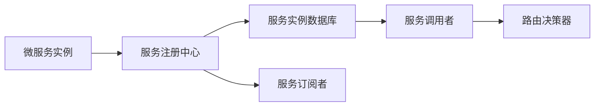

                 

# 服务注册中心的作用与实现

## 1. 背景介绍

随着分布式系统的发展，微服务架构成为现代应用的主流架构模式。微服务架构通过将应用拆分为多个独立的服务单元，提升了系统的可扩展性、可维护性和灵活性，但也带来了服务治理的挑战。服务注册中心作为一种重要的治理工具，用于管理微服务之间的调用关系，是构建稳定可靠分布式系统的关键组件。本文将从服务注册中心的基本概念、作用机制以及其实现原理等角度出发，深入探讨服务注册中心的作用与实现。

## 2. 核心概念与联系

### 2.1 核心概念概述

服务注册中心（Service Registry）是微服务架构中用于管理服务实例发现和注册的组件，其核心功能包括服务注册、服务发现、服务实例管理和路由策略等。通过服务注册中心，微服务实例能够在运行时被动态注册，其他服务可以根据服务名称获取注册信息，实现动态调用和负载均衡等功能。

下图展示了服务注册中心在微服务架构中的作用机制：



在上述模型中，服务实例通过调用`B`注册到中心，中心将服务信息存储在数据库`C`中，供服务调用者`D`查询。当调用者需要调用某个服务时，通过`E`进行路由决策，并根据返回的服务实例信息进行调用。服务订阅者通过`F`获取服务变更的通知。

### 2.2 核心概念间的联系

服务注册中心与微服务架构中的其他组件如负载均衡、配置管理、监控系统等密切相关，共同构成一个完整的微服务生态系统。以下是各组件之间的作用机制：

- **负载均衡器**：根据服务调用者请求，选择合适的主机和服务实例进行调用。
- **配置管理**：提供服务实例配置管理，包括服务实例的创建、更新和删除等操作。
- **监控系统**：实时监控服务实例的运行状态和性能指标，提供报警和告警机制。
- **服务注册中心**：提供服务实例的动态注册、查询和路由决策功能，支持服务发现和负载均衡。

## 3. 核心算法原理 & 具体操作步骤

### 3.1 算法原理概述

服务注册中心的算法原理主要涉及服务注册、服务发现、服务实例管理和路由决策等方面。其中，服务注册和发现是服务注册中心的核心功能，通过将服务实例动态注册到中心，并提供服务查询机制，实现服务的动态调用和负载均衡。

服务实例管理包括服务实例的创建、更新和删除等操作，是服务注册中心的重要功能之一。服务注册中心将服务实例的信息存储在数据库中，并根据服务实例的状态进行相应的管理。

路由决策器根据服务调用者的请求和当前服务实例的状态，选择合适的服务实例进行调用。常见的路由决策算法包括轮询、加权轮询、IPHash等。

### 3.2 算法步骤详解

服务注册中心的算法实现可以分为以下几个步骤：

1. **服务实例注册**：微服务实例在启动后，通过调用服务注册中心的API进行注册，将服务名称、IP、端口号、负载均衡策略等信息传递给服务注册中心。

2. **服务实例存储**：服务注册中心将注册的服务实例信息存储在数据库中，并根据服务名称进行分类。

3. **服务实例查询**：当服务调用者需要调用某个服务时，通过服务注册中心查询指定服务的所有实例，并根据路由决策算法选择一个合适的实例进行调用。

4. **服务实例更新**：当服务实例的状态发生变化（如IP、端口号等）时，通过调用服务注册中心的API进行更新，并通知所有订阅者。

5. **服务实例删除**：当服务实例不再可用时，通过调用服务注册中心的API进行删除，并通知所有订阅者。

### 3.3 算法优缺点

服务注册中心的优点包括：

- **动态注册和发现**：支持微服务实例的动态注册和发现，提高系统的灵活性和可扩展性。
- **集中管理**：将所有服务实例的信息集中存储和管理，提供统一的服务调用接口。
- **负载均衡**：通过路由决策算法实现负载均衡，提升系统的稳定性和可扩展性。

服务注册中心的缺点包括：

- **性能瓶颈**：服务注册中心作为集中管理的组件，可能成为系统的性能瓶颈。
- **单点故障**：服务注册中心是系统的单点组件，如果该组件出现故障，整个系统将无法正常运行。
- **依赖复杂**：服务注册中心需要与其他组件如负载均衡器、配置管理等协同工作，实现完整的服务治理功能。

### 3.4 算法应用领域

服务注册中心在微服务架构中的应用非常广泛，包括但不限于以下领域：

- **金融行业**：在金融领域，服务注册中心用于管理交易、结算、风控等微服务，提升系统的稳定性和可扩展性。
- **电商行业**：在电商领域，服务注册中心用于管理商品推荐、订单处理、库存管理等微服务，提升系统的性能和用户体验。
- **互联网应用**：在互联网应用中，服务注册中心用于管理内容分发、用户管理、安全认证等微服务，提升系统的灵活性和可扩展性。

## 4. 数学模型和公式 & 详细讲解 & 举例说明

### 4.1 数学模型构建

服务注册中心的数学模型主要涉及服务实例的动态管理、路由决策算法等。以下是对这些模型的详细构建和讲解：

#### 4.1.1 服务实例管理模型

服务实例管理模型主要关注服务实例的创建、更新和删除等操作。假设有一个服务注册中心，维护了一个服务实例数据库`S`，包含服务实例的信息。

服务实例的信息包括：
- 服务名称：`S_name`
- IP地址：`S_ip`
- 端口号：`S_port`
- 注册时间：`S_time`

服务实例的创建、更新和删除操作可以表示为：

- 创建：`S.add(S_name, S_ip, S_port, S_time)`
- 更新：`S.update(S_name, S_ip, S_port, S_time)`
- 删除：`S.remove(S_name, S_ip, S_port, S_time)`

#### 4.1.2 服务发现模型

服务发现模型主要关注如何根据服务名称查询服务实例的信息。假设有一个服务查询函数`S.find(S_name)`，返回服务实例的列表。

服务查询函数可以表示为：
```
S.find(S_name) = 
[
    (S_name1, S_ip1, S_port1, S_time1),
    (S_name2, S_ip2, S_port2, S_time2),
    ...
]
```

#### 4.1.3 路由决策模型

路由决策模型主要关注如何选择服务实例进行调用。假设有一个路由决策函数`R.select(S_name)`，根据服务实例的状态选择调用实例。

路由决策函数可以表示为：
```
R.select(S_name) = 
{
    (S_name1, S_ip1, S_port1, S_time1),
    (S_name2, S_ip2, S_port2, S_time2),
    ...
}
```

### 4.2 公式推导过程

服务注册中心的算法实现中涉及的数学公式主要包括以下几个：

#### 4.2.1 服务实例管理

服务实例的创建、更新和删除操作可以表示为：
- 创建：`S.add(S_name, S_ip, S_port, S_time)`
- 更新：`S.update(S_name, S_ip, S_port, S_time)`
- 删除：`S.remove(S_name, S_ip, S_port, S_time)`

这些操作可以表示为如下公式：
```
S.add(S_name, S_ip, S_port, S_time) = 
{
    (S_name, S_ip, S_port, S_time)
}
```

#### 4.2.2 服务发现

服务发现函数可以表示为：
```
S.find(S_name) = 
[
    (S_name1, S_ip1, S_port1, S_time1),
    (S_name2, S_ip2, S_port2, S_time2),
    ...
]
```

#### 4.2.3 路由决策

路由决策函数可以表示为：
```
R.select(S_name) = 
{
    (S_name1, S_ip1, S_port1, S_time1),
    (S_name2, S_ip2, S_port2, S_time2),
    ...
}
```

### 4.3 案例分析与讲解

以下是一个简单的案例，用于说明服务注册中心的实现过程：

假设有一个服务注册中心，维护了一个服务实例数据库`S`。服务实例`A`的创建、更新和删除操作可以表示为：

- 创建：`S.add("A", "192.168.1.1", 8080, 1605872377)`
- 更新：`S.update("A", "192.168.1.1", 8080, 1605872377)`
- 删除：`S.remove("A", "192.168.1.1", 8080, 1605872377)`

服务实例`A`的查询操作可以表示为：
```
S.find("A") = 
[
    ("A", "192.168.1.1", 8080, 1605872377)
]
```

路由决策函数`R.select("A")`可以根据服务实例的状态选择调用实例，如：

```
R.select("A") = 
{
    ("A", "192.168.1.1", 8080, 1605872377),
    ("A", "192.168.1.2", 8080, 1605872377),
    ...
}
```

## 5. 项目实践：代码实例和详细解释说明

### 5.1 开发环境搭建

要进行服务注册中心的开发和测试，需要搭建相应的开发环境。以下是搭建开发环境的详细步骤：

1. 安装Python和相关依赖：
```
sudo apt-get update
sudo apt-get install python3 python3-pip
sudo pip3 install flask gunicorn
```

2. 创建项目目录和文件：
```
mkdir service-registry
cd service-registry
```

3. 创建服务注册中心的核心文件`app.py`，定义服务注册和查询的API接口。

### 5.2 源代码详细实现

以下是一个简单的服务注册中心的Python实现代码：

```python
from flask import Flask, request, jsonify
import sqlite3

app = Flask(__name__)
db = sqlite3.connect('service-registry.db')
cursor = db.cursor()

@app.route('/add', methods=['POST'])
def add_service():
    data = request.json
    service_name = data['service_name']
    service_ip = data['service_ip']
    service_port = data['service_port']
    service_time = int(time.time())
    cursor.execute('INSERT INTO services (name, ip, port, time) VALUES (?, ?, ?, ?)', (service_name, service_ip, service_port, service_time))
    db.commit()
    return jsonify({'success': True}), 201

@app.route('/query', methods=['GET'])
def query_service():
    service_name = request.args.get('name')
    cursor.execute('SELECT * FROM services WHERE name=?', (service_name,))
    services = cursor.fetchall()
    return jsonify(services), 200

@app.route('/remove', methods=['DELETE'])
def remove_service():
    data = request.json
    service_name = data['service_name']
    service_ip = data['service_ip']
    service_port = data['service_port']
    cursor.execute('DELETE FROM services WHERE name=? AND ip=? AND port=?', (service_name, service_ip, service_port))
    db.commit()
    return jsonify({'success': True}), 200

if __name__ == '__main__':
    app.run(host='0.0.0.0', port=5000)
```

### 5.3 代码解读与分析

上述代码实现了一个简单的服务注册中心，支持服务注册、查询和删除等操作。具体分析如下：

1. 定义了三个API接口：
   - `/add`：用于服务注册，将服务实例的信息存储到数据库中。
   - `/query`：用于服务查询，根据服务名称获取所有服务实例的信息。
   - `/remove`：用于服务删除，根据服务实例的信息删除对应的记录。

2. 使用了SQLite数据库来存储服务实例的信息，提供了基本的服务实例管理功能。

3. 使用了Flask框架来构建Web应用，提供了简单的RESTful API接口。

### 5.4 运行结果展示

启动服务注册中心后，可以使用`curl`命令进行测试：

```
curl -X POST -H "Content-Type: application/json" -d '{"service_name": "A", "service_ip": "192.168.1.1", "service_port": 8080}' http://localhost:5000/add
curl -X GET http://localhost:5000/query?name=A
curl -X DELETE -H "Content-Type: application/json" -d '{"service_name": "A", "service_ip": "192.168.1.1", "service_port": 8080}' http://localhost:5000/remove
```

## 6. 实际应用场景

### 6.1 服务发现与负载均衡

服务注册中心在服务发现与负载均衡中扮演着重要角色。服务发现是通过服务注册中心将服务实例的信息动态注册，并根据服务名称进行查询。负载均衡是根据服务实例的状态，选择合适的服务实例进行调用。

在实际应用中，服务注册中心可以与负载均衡器如Nginx、HAProxy等协同工作，实现高效的服务发现和负载均衡。

### 6.2 动态服务注册

服务注册中心支持服务的动态注册和删除，可以实时地更新服务实例的状态，提供灵活的服务管理功能。

在实际应用中，当服务实例启动或关闭时，通过调用服务注册中心的API进行注册或删除操作，实现动态的服务管理。

### 6.3 高可用性保障

服务注册中心通常需要具备高可用性和容错能力，以确保服务注册和查询功能的稳定性和可靠性。

在实际应用中，可以通过集群部署、数据备份、故障转移等技术，提升服务注册中心的可用性和容错能力。

## 7. 工具和资源推荐

### 7.1 学习资源推荐

1. **《服务治理的艺术》**：介绍服务治理的原理和实践，涵盖服务注册、服务发现、负载均衡、路由决策等核心技术。
2. **《微服务架构设计》**：讲解微服务架构的设计和实现，涵盖服务注册、服务发现、负载均衡、故障恢复等核心技术。
3. **《Spring Cloud Service Registry》**：介绍Spring Cloud生态系统中的服务注册组件，涵盖Consul、Eureka等核心组件。

### 7.2 开发工具推荐

1. **Kubernetes**：用于容器编排和管理，支持服务发现、负载均衡、故障恢复等功能。
2. **Consul**：开源的服务发现和配置工具，支持分布式系统的高可用性和弹性扩展。
3. **Zookeeper**：用于分布式协调和配置管理，支持服务注册、服务发现等功能。

### 7.3 相关论文推荐

1. **《Consul: A Consistent Hashing-Based Service Discovery Tool》**：介绍Consul的服务发现算法和实现机制。
2. **《Service Registry with Time-To-Live Feature》**：介绍服务注册中心的时间戳功能，提升服务实例的动态管理能力。
3. **《Microservices with Service Registry》**：介绍服务注册中心在微服务架构中的作用和实现机制。

## 8. 总结：未来发展趋势与挑战

### 8.1 研究成果总结

服务注册中心在微服务架构中发挥着重要作用，能够支持动态服务注册、服务发现、负载均衡等功能。当前，服务注册中心主要采用基于Consul、Eureka等开源解决方案，实现了基本的服务治理功能。

### 8.2 未来发展趋势

未来的服务注册中心将具备更高的灵活性、可扩展性和可靠性。主要趋势包括：

1. **自动化运维**：通过自动化运维工具，实现服务的自动注册、自动监控和自动恢复等功能。
2. **多云支持**：支持多云环境下的服务治理，实现跨云、跨地域的服务管理。
3. **区块链技术**：利用区块链技术实现服务实例的分布式管理，提升系统的安全性和可靠性。

### 8.3 面临的挑战

服务注册中心在实现过程中仍面临一些挑战，主要包括以下几个方面：

1. **高可用性保障**：需要提升系统的可用性和容错能力，确保服务的稳定运行。
2. **性能优化**：需要优化服务注册和查询的性能，支持大规模服务实例的管理。
3. **安全性和隐私保护**：需要加强系统的安全性和隐私保护，防止恶意攻击和数据泄露。

### 8.4 研究展望

未来的服务注册中心将更加智能化、自动化，能够更好地支持微服务架构的演进和扩展。具体研究展望包括：

1. **智能服务发现**：利用机器学习和人工智能技术，提升服务发现和调度的智能性。
2. **自动运维管理**：通过自动化运维工具，实现服务的自动注册、自动监控和自动恢复等功能。
3. **区块链技术应用**：利用区块链技术实现服务实例的分布式管理，提升系统的安全性和可靠性。

## 9. 附录：常见问题与解答

### Q1: 服务注册中心在微服务架构中的作用是什么？

A: 服务注册中心是微服务架构中用于管理服务实例发现和注册的组件，能够实现服务动态注册和查询、路由决策等功能，提升系统的灵活性和可扩展性。

### Q2: 服务注册中心的实现涉及哪些核心技术？

A: 服务注册中心的实现涉及服务注册、服务发现、服务实例管理、路由决策等核心技术，通过这些技术实现服务实例的动态管理和调用。

### Q3: 如何提升服务注册中心的可用性和容错能力？

A: 可以通过集群部署、数据备份、故障转移等技术，提升服务注册中心的可用性和容错能力。

### Q4: 服务注册中心在服务发现和负载均衡中扮演什么角色？

A: 服务注册中心在服务发现中用于动态注册和查询服务实例，在负载均衡中用于根据服务实例的状态选择合适的实例进行调用。

### Q5: 服务注册中心的未来发展趋势是什么？

A: 未来的服务注册中心将具备更高的灵活性、可扩展性和可靠性，支持自动化运维、多云支持、区块链技术等先进技术，提升系统的性能和安全性。

---

作者：禅与计算机程序设计艺术 / Zen and the Art of Computer Programming

