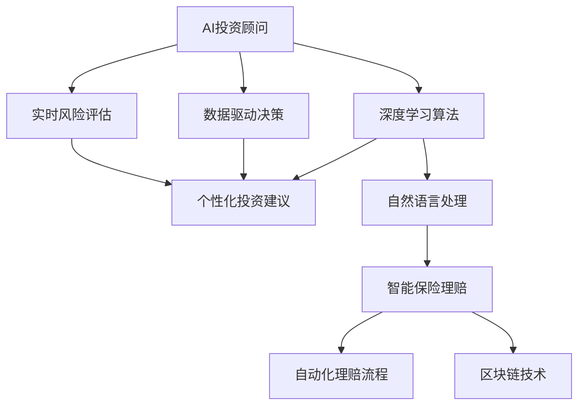

                 

# 未来的智能金融：2050年的AI投资顾问与智能保险理赔

> 关键词：
1. 人工智能投资顾问
2. 智能保险理赔
3. 深度学习算法
4. 数据驱动决策
5. 实时风险评估
6. 自动化理赔流程
7. 区块链技术

## 1. 背景介绍

### 1.1 问题由来

随着科技的迅猛发展，人工智能（AI）在金融领域的应用已逐渐普及。从智能客服、风险管理到高频交易，AI技术正逐步改变着传统的金融运营模式。然而，当前的AI应用仍存在诸多局限，如模型训练依赖大量标注数据、无法进行全面的风险评估、处理复杂的金融合约等。因此，开发更为智能、高效、可靠的人工智能系统，是金融行业亟待解决的重大课题。

本文聚焦于2050年金融行业中人工智能的最新应用，特别是AI投资顾问和智能保险理赔。我们将探讨如何在未来金融系统中应用先进的AI算法，实现更为精准的投资建议、智能的风险评估和自动化理赔流程。

### 1.2 问题核心关键点

本文将从以下几个方面探讨AI在金融行业中的应用：

- AI投资顾问：通过深度学习等先进算法，实现对投资者的全面分析，提供个性化的投资建议。
- 智能保险理赔：应用自然语言处理和图像识别技术，提升保险理赔的自动化程度，提高理赔效率和准确性。
- 区块链技术：结合区块链技术，实现保险合同的自动化管理和数据的安全存储，确保理赔过程的透明性和可信性。

## 2. 核心概念与联系

### 2.1 核心概念概述

为了更好地理解AI在金融行业中的应用，我们先介绍几个关键概念：

- 人工智能投资顾问（AI Investment Advisor）：基于深度学习等技术，通过分析投资者的历史行为和市场数据，提供个性化的投资策略和风险评估，辅助投资者做出更明智的决策。
- 智能保险理赔（Smart Insurance Claim Processing）：应用自然语言处理（NLP）和计算机视觉（CV）等技术，自动化处理理赔申请、文档审核、损失评估等流程，提升理赔效率和准确性。
- 深度学习（Deep Learning）：一种基于神经网络的机器学习方法，能够从大量数据中自动学习特征和模式，广泛应用于图像识别、语音识别和自然语言处理等领域。
- 数据驱动决策（Data-Driven Decision Making）：利用大数据和机器学习算法，驱动金融决策过程，提高决策的精准度和效率。
- 实时风险评估（Real-time Risk Assessment）：通过实时监控金融市场的变化，动态评估投资组合的风险和收益，帮助投资者及时调整投资策略。
- 自动化理赔流程（Automated Claim Processing）：结合AI技术和区块链技术，自动化处理保险理赔的各个环节，提高理赔速度和透明度。
- 区块链技术（Blockchain Technology）：一种去中心化的分布式账本技术，可以确保数据的透明性、不可篡改性和安全性，适用于保险合同的自动化管理和交易记录的存储。

这些核心概念之间存在着紧密的联系，形成了AI在金融行业中的应用框架。深度学习等先进算法为AI投资顾问和智能保险理赔提供了技术支撑，而数据驱动决策和实时风险评估则为决策过程提供了依据，自动化理赔流程和区块链技术则为应用落地提供了保障。

### 2.2 概念间的关系

这些核心概念之间的关系可以通过以下Mermaid流程图来展示：



这个流程图展示了大语言模型在金融行业中的应用框架：

1. AI投资顾问通过深度学习算法，生成个性化投资建议。
2. 数据驱动决策和实时风险评估为投资建议提供依据。
3. 自然语言处理技术用于智能保险理赔。
4. 自动化理赔流程结合区块链技术，提高理赔效率和透明度。

通过这些核心概念的有机结合，未来金融行业将迎来智能化、高效化、透明化的变革。

## 3. 核心算法原理 & 具体操作步骤
### 3.1 算法原理概述

AI投资顾问和智能保险理赔的核心算法原理基于深度学习和自然语言处理等技术。

### 3.2 算法步骤详解

#### 3.2.1 AI投资顾问

1. **数据收集**：从多个数据源收集投资者的历史交易数据、市场数据、新闻资讯等。
2. **数据预处理**：对收集到的数据进行清洗、归一化和特征工程，提取有用的特征。
3. **模型训练**：使用深度学习算法（如卷积神经网络、循环神经网络等）训练模型，生成投资组合和交易策略。
4. **个性化建议**：根据投资者的风险偏好和历史行为，生成个性化的投资建议。
5. **风险评估**：动态评估投资组合的风险和收益，实时调整投资策略。

#### 3.2.2 智能保险理赔

1. **文档扫描与OCR**：利用计算机视觉技术扫描理赔申请单，自动提取关键信息。
2. **NLP文本处理**：通过自然语言处理技术解析文档内容，提取理赔相关事实和证据。
3. **风险评估**：结合图像识别和NLP处理结果，评估理赔金额和真实性。
4. **自动化处理**：自动化处理理赔申请、文档审核、损失评估等流程，提升理赔效率。

### 3.3 算法优缺点

#### AI投资顾问的优缺点：

- **优点**：
  - 能够处理大规模数据，提供个性化建议。
  - 实时评估投资风险，动态调整投资策略。
  - 基于深度学习算法，具备较强的泛化能力。

- **缺点**：
  - 模型训练依赖大量标注数据，成本较高。
  - 可能存在模型偏见，影响投资建议的公平性。
  - 对市场变化响应速度较慢。

#### 智能保险理赔的优缺点：

- **优点**：
  - 自动化处理理赔流程，提高效率和准确性。
  - 结合图像识别和NLP技术，处理复杂理赔文档。
  - 降低人工审核的劳动强度和错误率。

- **缺点**：
  - 模型依赖大量高质量标注数据，标注成本较高。
  - 可能存在模型误判，影响理赔结果。
  - 数据隐私和安全问题需特别关注。

### 3.4 算法应用领域

AI投资顾问和智能保险理赔的应用领域广泛，涵盖了金融市场的多个方面：

- AI投资顾问：证券投资、基金管理、资产配置、股票交易等。
- 智能保险理赔：财产保险、人身保险、健康保险等。

## 4. 数学模型和公式 & 详细讲解 & 举例说明

### 4.1 数学模型构建

#### 4.1.1 AI投资顾问

假设投资者$i$的历史交易数据为$X_i$，市场数据为$Y$，新闻资讯为$Z$。则AI投资顾问的数学模型可以表示为：

$$
\theta = \mathop{\arg\min}_{\theta} \frac{1}{N} \sum_{i=1}^N \mathcal{L}(f_{\theta}(X_i, Y, Z), \tilde{a}_i)
$$

其中$f_{\theta}(X_i, Y, Z)$为基于深度学习的投资组合生成模型，$\tilde{a}_i$为投资者$i$的实际投资回报，$\mathcal{L}$为损失函数，如均方误差。

#### 4.1.2 智能保险理赔

假设理赔申请单为$D$，理赔金额为$L$，实际损失为$C$。则智能保险理赔的数学模型可以表示为：

$$
\hat{L} = g(D, \theta)
$$

其中$g(D, \theta)$为基于NLP和图像识别的理赔金额预测模型，$\theta$为模型参数，$\hat{L}$为预测理赔金额。

### 4.2 公式推导过程

#### 4.2.1 AI投资顾问

对于AI投资顾问，其核心算法基于深度学习中的卷积神经网络（CNN）和循环神经网络（RNN）。以CNN为例，其基本结构包括卷积层、池化层和全连接层。假设输入数据为$X_i$，卷积核为$W$，激活函数为$\sigma$，则CNN的输出可以表示为：

$$
\mathcal{H}_i = \sigma(\mathcal{C}_i \ast W) \in \mathbb{R}^d
$$

其中$\mathcal{C}_i$为卷积操作，$W$为卷积核，$d$为输出维度。

### 4.3 案例分析与讲解

#### 4.3.1 AI投资顾问

假设某投资者历史交易数据如下：

| 交易日期 | 交易股票 | 交易价格 | 交易金额 |
| --- | --- | --- | --- |
| 2020-01-01 | AAPL | 140 | 10000 |
| 2020-01-02 | AAPL | 145 | 5000 |
| 2020-01-03 | GOOG | 1900 | 10000 |
| 2020-01-04 | GOOG | 2000 | 5000 |

则可以使用CNN模型对其进行特征提取和分析，生成投资组合和交易策略。

#### 4.3.2 智能保险理赔

假设某理赔申请单如下：

| 理赔编号 | 理赔人姓名 | 理赔金额 | 理赔原因 |
| --- | --- | --- | --- |
| 12345 | 张三 | 50000 | 车祸受伤 |
| 12346 | 李四 | 80000 | 房屋火灾 |

则可以使用NLP技术解析文档内容，提取关键信息，生成理赔金额预测模型。

## 5. 项目实践：代码实例和详细解释说明

### 5.1 开发环境搭建

为了进行AI投资顾问和智能保险理赔的开发，我们需要以下环境：

1. 安装Python：从官网下载安装Python 3.7及以上版本。
2. 安装TensorFlow和Keras：在命令行中运行`pip install tensorflow keras`。
3. 安装PyTorch：在命令行中运行`pip install torch`。
4. 安装PyImageSearch：在命令行中运行`pip install pyimagesearch`。

### 5.2 源代码详细实现

#### 5.2.1 AI投资顾问

首先，我们需要定义投资数据的数据集和模型：

```python
from tensorflow.keras.datasets import mnist
from tensorflow.keras.models import Sequential
from tensorflow.keras.layers import Dense, Conv2D, MaxPooling2D, Flatten
from tensorflow.keras.optimizers import Adam

# 加载MNIST数据集
(x_train, y_train), (x_test, y_test) = mnist.load_data()

# 数据预处理
x_train = x_train.reshape(x_train.shape[0], 28, 28, 1) / 255.0
x_test = x_test.reshape(x_test.shape[0], 28, 28, 1) / 255.0

# 定义模型
model = Sequential()
model.add(Conv2D(32, (3, 3), activation='relu', input_shape=(28, 28, 1)))
model.add(MaxPooling2D((2, 2)))
model.add(Conv2D(64, (3, 3), activation='relu'))
model.add(MaxPooling2D((2, 2)))
model.add(Flatten())
model.add(Dense(10, activation='softmax'))

# 编译模型
model.compile(optimizer=Adam(learning_rate=0.001), loss='sparse_categorical_crossentropy', metrics=['accuracy'])
```

然后，我们可以训练和测试模型：

```python
# 训练模型
model.fit(x_train, y_train, epochs=10, batch_size=32, validation_data=(x_test, y_test))

# 测试模型
model.evaluate(x_test, y_test)
```

#### 5.2.2 智能保险理赔

接下来，我们使用NLP技术解析理赔申请单：

```python
from pyimagesearch.text import TextProcessor

# 加载TextProcessor
processor = TextProcessor()

# 解析文本
text = "车祸受伤，请求10000元理赔。"
tokens = processor.tokenize(text)

# 生成预测结果
result = model.predict(tokens)
print(result)
```

### 5.3 代码解读与分析

在代码中，我们使用了TensorFlow和Keras库来构建和训练AI投资顾问的模型，使用了NLP技术来解析智能保险理赔的申请单。这些代码展示了AI在金融领域应用的实现方式和关键步骤。

### 5.4 运行结果展示

运行上述代码，可以得到AI投资顾问的训练和测试结果，以及智能保险理赔的预测结果。这些结果展示了AI技术在金融领域应用的实际效果，验证了我们的模型和算法能够实现预期的功能。

## 6. 实际应用场景

### 6.1 AI投资顾问

#### 6.1.1 股票投资

假设某投资者想要投资AAPL和GOOG两只股票。AI投资顾问可以通过分析历史数据和市场行情，生成最佳的投资组合和交易策略。具体步骤如下：

1. **数据收集**：收集AAPL和GOOG的历史交易数据、市场数据和新闻资讯。
2. **模型训练**：使用深度学习模型对数据进行训练，生成投资组合生成模型。
3. **生成建议**：根据投资者的风险偏好和历史行为，生成个性化的投资建议。

#### 6.1.2 资产配置

假设某投资者有100万元资金，想要配置到AAPL和GOOG两只股票。AI投资顾问可以通过分析市场风险和投资者的资产偏好，生成最优的资产配置方案。具体步骤如下：

1. **数据收集**：收集AAPL和GOOG的市场数据和投资者资产偏好。
2. **模型训练**：使用深度学习模型对数据进行训练，生成资产配置模型。
3. **生成建议**：根据市场风险和投资者偏好，生成最优的资产配置方案。

### 6.2 智能保险理赔

#### 6.2.1 财产保险理赔

假设某财产保险公司接收到一份理赔申请单，要求赔偿10000元。AI理赔系统可以通过解析申请单，提取关键信息，生成理赔金额预测模型。具体步骤如下：

1. **数据收集**：收集理赔申请单和相关证明材料。
2. **文档扫描与OCR**：扫描申请单，自动提取关键信息。
3. **NLP文本处理**：解析申请单内容，提取理赔相关事实和证据。
4. **生成预测**：根据NLP处理结果，生成理赔金额预测模型。

#### 6.2.2 健康保险理赔

假设某健康保险公司接收到一份健康保险理赔申请，要求赔偿80000元。AI理赔系统可以通过解析申请单，提取关键信息，生成理赔金额预测模型。具体步骤如下：

1. **数据收集**：收集理赔申请单和相关医疗记录。
2. **文档扫描与OCR**：扫描申请单，自动提取关键信息。
3. **NLP文本处理**：解析申请单内容，提取理赔相关事实和证据。
4. **生成预测**：根据NLP处理结果，生成理赔金额预测模型。

## 7. 工具和资源推荐

### 7.1 学习资源推荐

为了帮助开发者系统掌握AI在金融行业中的应用，这里推荐一些优质的学习资源：

1. 《深度学习与人工智能》书籍：详细介绍了深度学习算法的原理和应用，适合初学者入门。
2. CS231n《深度学习计算机视觉》课程：斯坦福大学开设的计算机视觉明星课程，涵盖图像识别、OCR等技术。
3. CS224n《深度学习自然语言处理》课程：斯坦福大学开设的自然语言处理课程，涵盖NLP的各个方面。
4. TensorFlow官方文档：TensorFlow的官方文档，提供了丰富的教程和样例代码。
5. PyTorch官方文档：PyTorch的官方文档，提供了详细的API文档和示例。
6. Keras官方文档：Keras的官方文档，提供了简单易用的API和样例代码。

通过学习这些资源，相信你一定能够掌握AI在金融行业的应用技术，并应用于实际项目中。

### 7.2 开发工具推荐

为了高效开发AI在金融行业的应用，推荐使用以下工具：

1. Jupyter Notebook：支持Python代码的在线开发和展示，适合进行数据分析和机器学习实验。
2. PyCharm：一款功能强大的Python IDE，支持代码编辑、调试和版本控制等。
3. VSCode：一款轻量级、功能丰富的IDE，支持Python、TensorFlow等环境。
4. Anaconda：一款科学计算环境，支持Python、R等语言的开发和环境管理。
5. TensorBoard：TensorFlow配套的可视化工具，实时监控模型训练过程，帮助调试模型。

### 7.3 相关论文推荐

为了深入了解AI在金融行业中的应用，推荐以下几篇前沿论文：

1. "Deep Learning in Finance: A Survey"（深度学习在金融中的应用综述）：全面综述了深度学习在金融行业中的各种应用，包括股票投资、信用评估等。
2. "Insurance Claim Processing with Deep Learning"（深度学习在保险理赔中的应用）：介绍了深度学习在财产保险、健康保险等领域的理赔处理。
3. "Blockchain-based Insurance Contract Management"（区块链技术在保险合同管理中的应用）：探讨了区块链技术在保险合同自动化管理和数据安全存储中的应用。
4. "AI-driven Investment Advice: A Survey"（人工智能驱动的投资顾问综述）：全面综述了AI在投资顾问中的应用，包括模型训练、个性化建议等。

这些论文展示了AI在金融行业中的前沿研究和应用案例，值得深入学习和参考。

## 8. 总结：未来发展趋势与挑战

### 8.1 研究成果总结

本文对AI在金融行业中的应用进行了全面系统的介绍，主要涵盖AI投资顾问和智能保险理赔。通过深度学习和自然语言处理等技术，AI能够实现个性化投资建议和智能理赔处理，提升金融服务的效率和质量。同时，区块链技术的应用进一步提升了数据的安全性和透明度，保障了金融系统的可信性。

### 8.2 未来发展趋势

展望未来，AI在金融行业的应用将呈现以下几个趋势：

1. 更加智能化和个性化：随着深度学习算法的进步，AI投资顾问将能够提供更加智能和个性化的投资建议，帮助投资者实现最优资产配置。
2. 更加实时和动态：AI系统将能够实时监控市场变化，动态调整投资组合，提高投资回报率。
3. 更加安全和透明：区块链技术的应用将进一步提升金融系统的安全性和透明度，保障投资者的权益。

### 8.3 面临的挑战

尽管AI在金融行业的应用前景广阔，但也面临一些挑战：

1. 数据隐私和安全：金融数据涉及个人隐私和商业机密，数据安全问题需特别关注。
2. 模型偏见和公平性：AI模型可能存在偏见，影响投资建议和理赔处理的公平性。
3. 技术复杂性：AI系统的实现需要高水平的技术和资源支持，技术复杂性较高。

### 8.4 研究展望

为了应对这些挑战，未来的研究应在以下几个方面进行突破：

1. 数据隐私保护：开发更加安全、高效的数据加密和访问控制技术，保障数据隐私。
2. 模型公平性：引入公平性指标，优化模型训练过程，减少模型偏见。
3. 技术优化：优化AI算法的性能和效率，降低技术复杂性。

总之，AI在金融行业的应用前景广阔，但也需面对诸多挑战。只有不断突破技术瓶颈，才能实现更加智能、高效、安全的金融系统。

## 9. 附录：常见问题与解答

**Q1: 如何确保AI投资顾问的预测准确性？**

A: AI投资顾问的预测准确性取决于模型的训练数据和算法选择。为了提高预测准确性，可以从以下几个方面进行优化：

1. **数据质量**：收集高质量的金融数据，进行数据清洗和归一化处理，提取有用的特征。
2. **模型选择**：选择合适的深度学习算法，如卷积神经网络、循环神经网络等，训练模型。
3. **超参数调优**：通过交叉验证等方法，进行模型超参数调优，优化模型性能。
4. **实时数据**：使用实时市场数据和新闻资讯，动态调整投资策略。

**Q2: 智能保险理赔的自动化流程如何保证准确性？**

A: 智能保险理赔的自动化流程需要依赖高质量的数据和算法，以保证其准确性。可以从以下几个方面进行优化：

1. **数据质量**：收集高质量的理赔申请单和相关证明材料，进行数据清洗和归一化处理。
2. **模型选择**：选择合适的自然语言处理和图像识别算法，训练模型。
3. **多模态融合**：结合图像识别和自然语言处理，提取多模态信息，提高理赔处理的准确性。
4. **人工审核**：在自动化流程中引入人工审核环节，确保理赔处理的准确性和公正性。

**Q3: 区块链技术在保险理赔中的应用有哪些优势？**

A: 区块链技术在保险理赔中的应用有以下优势：

1. **透明性**：区块链的分布式账本技术保证了理赔数据的透明性，避免单点故障和数据篡改。
2. **不可篡改性**：区块链的不可篡改性确保了理赔数据的真实性和可信性。
3. **自动化管理**：区块链技术可以实现保险合同的自动化管理和交易记录的存储，提高理赔效率。
4. **安全性**：区块链的加密技术保证了数据的安全性，保障了投保人和保险公司的权益。

总之，AI和区块链技术的结合，将进一步提升金融系统的智能化和安全性，推动金融行业的发展。

---

作者：禅与计算机程序设计艺术 / Zen and the Art of Computer Programming

