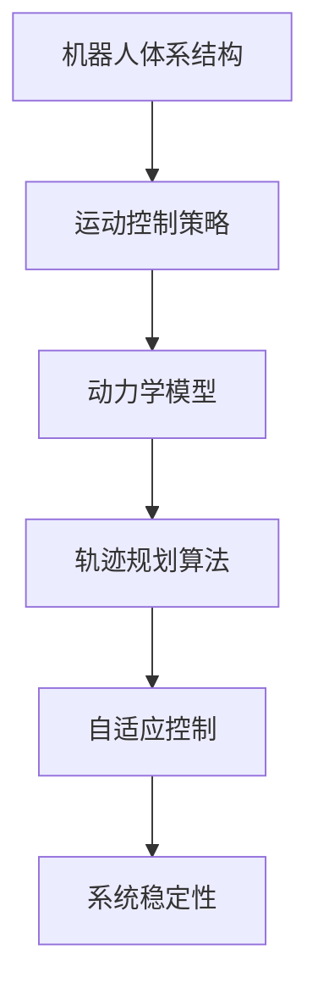
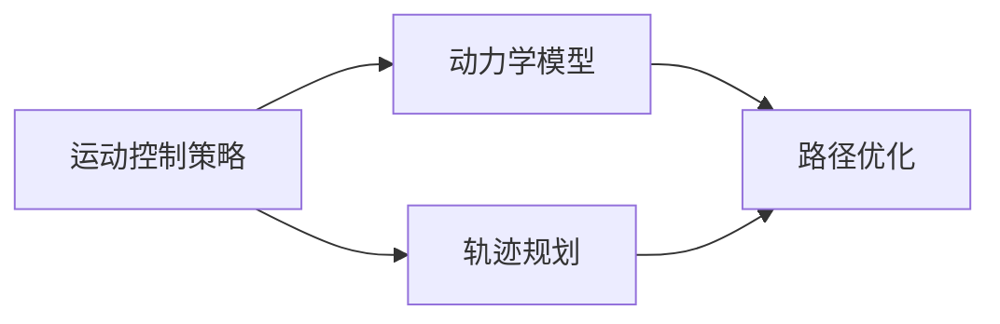
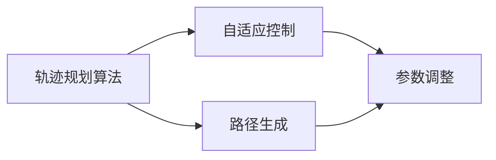
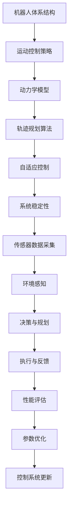

                 

# 机器人的运动控制策略和动力学模型

> 关键词：机器人体系结构,运动控制策略,动力学模型,轨迹规划算法,自适应控制,系统稳定性

## 1. 背景介绍

### 1.1 问题由来
随着现代机器人技术的快速发展，机器人在工业、农业、医疗等领域的应用越来越广泛。然而，机器人的运动控制是一个复杂且具有挑战性的问题，需要综合考虑机器人的结构、动力学特性以及环境因素。近年来，研究者们提出了许多不同的运动控制策略和动力学模型，以适应不同的应用场景。本文将对机器人运动控制的基本概念、核心算法和实际应用进行详细介绍。

### 1.2 问题核心关键点
机器人运动控制的核心在于设计合适的运动控制策略和动力学模型，以实现机器人在各种复杂环境下的稳定、高效运行。具体来说，包括以下几个关键点：
- 机器人体系结构：机器人的结构和运动自由度决定了其运动控制的方式和效率。
- 运动控制策略：包括轨迹规划、路径优化、自适应控制等方法，以实现机器人运动的准确性和稳定性。
- 动力学模型：机器人的动力学特性是运动控制的基础，合适的动力学模型能够提高控制算法的精度和效率。
- 系统稳定性：机器人运动控制的目标之一是保持系统的稳定性和鲁棒性，避免系统崩溃或震荡。

### 1.3 问题研究意义
研究机器人的运动控制策略和动力学模型，对于提升机器人的应用范围和性能，加速机器人技术的产业化进程，具有重要意义：
1. 降低开发成本：基于成熟的运动控制算法和动力学模型，可以显著减少机器人系统的开发成本和时间。
2. 提高系统性能：通过优化运动控制和动力学模型，机器人能够在各种复杂环境条件下实现高精度、高效率的运动。
3. 加速应用开发：通过整合先进运动控制算法和动力学模型，开发人员可以快速适配不同的应用场景，缩短开发周期。
4. 带来技术创新：运动控制和动力学模型的不断优化和改进，催生了许多新的研究方向和应用场景，如自适应控制、智能决策等。
5. 促进产业发展：通过提高机器人的运动控制精度和效率，推动机器人技术在工业、农业、医疗等多个领域的广泛应用，助力各行各业的数字化转型。

## 2. 核心概念与联系

### 2.1 核心概念概述

为更好地理解机器人运动控制的基本概念和架构，本节将介绍几个密切相关的核心概念：

- 机器人体系结构：机器人的运动自由度和关节结构决定了其运动方式和控制策略。
- 运动控制策略：包括轨迹规划、路径优化、自适应控制等方法，以实现机器人运动的准确性和稳定性。
- 动力学模型：机器人的动力学特性是运动控制的基础，常见的有牛顿-欧拉模型、拉格朗日方程等。
- 轨迹规划算法：基于机器人的动力学模型，设计合适的轨迹规划算法，以实现最优路径规划。
- 自适应控制：通过实时感知环境变化，动态调整控制参数，保持机器人系统的稳定性。
- 系统稳定性：机器人运动控制的目标之一是保持系统的稳定性和鲁棒性，避免系统崩溃或震荡。

这些核心概念之间的逻辑关系可以通过以下Mermaid流程图来展示：



这个流程图展示了这个核心概念的整体架构，其中：

1. 机器人体系结构是机器人运动控制的基础，决定了运动控制的方式和效率。
2. 运动控制策略包括轨迹规划、路径优化、自适应控制等方法，以实现机器人运动的准确性和稳定性。
3. 动力学模型描述了机器人的动力学特性，是运动控制的基础。
4. 轨迹规划算法基于动力学模型，设计合适的轨迹规划策略，以实现最优路径规划。
5. 自适应控制通过实时感知环境变化，动态调整控制参数，保持机器人系统的稳定性。
6. 系统稳定性是机器人运动控制的目标之一，要求机器人系统在各种环境条件下保持稳定和鲁棒性。

### 2.2 概念间的关系

这些核心概念之间存在着紧密的联系，形成了机器人运动控制系统的完整生态系统。下面我们通过几个Mermaid流程图来展示这些概念之间的关系。

#### 2.2.1 机器人运动控制系统


这个流程图展示了机器人运动控制系统的主要组成，从机器人结构到运动控制策略，再到轨迹规划算法、自适应控制和系统稳定性。

#### 2.2.2 运动控制策略与动力学模型的关系



这个流程图展示了运动控制策略与动力学模型之间的联系。运动控制策略基于动力学模型，进行路径规划和优化。

#### 2.2.3 轨迹规划算法与自适应控制的关系



这个流程图展示了轨迹规划算法与自适应控制之间的联系。轨迹规划算法生成路径，自适应控制根据路径和环境变化动态调整控制参数。

### 2.3 核心概念的整体架构

最后，我们用一个综合的流程图来展示这些核心概念在大语言模型微调过程中的整体架构：



这个综合流程图展示了从机器人体系结构到传感器数据采集、环境感知、决策与规划、执行与反馈、性能评估、参数优化到控制系统更新的完整过程。通过这些关键环节的协同工作，机器人运动控制系统能够实现稳定、高效的运行。

## 3. 核心算法原理 & 具体操作步骤
### 3.1 算法原理概述

机器人运动控制的核心在于设计合适的运动控制策略和动力学模型，以实现机器人在各种复杂环境下的稳定、高效运行。以下是对机器人运动控制策略和动力学模型的基本原理的介绍。

#### 3.1.1 运动控制策略

运动控制策略是实现机器人运动控制的关键，包括轨迹规划、路径优化、自适应控制等方法。以下是几种常见的运动控制策略：

1. 轨迹规划算法：基于机器人的动力学模型，设计合适的轨迹规划算法，以实现最优路径规划。常见的轨迹规划算法包括A*算法、D*算法、RRT算法等。
2. 路径优化算法：通过优化路径长度、能耗、时间等指标，实现路径的优化。常见的路径优化算法包括动态规划、遗传算法、粒子群算法等。
3. 自适应控制算法：通过实时感知环境变化，动态调整控制参数，保持机器人系统的稳定性。常见的自适应控制算法包括PID控制、模糊控制、神经网络控制等。

#### 3.1.2 动力学模型

机器人的动力学模型描述了机器人的动力学特性，是运动控制的基础。常见的动力学模型包括牛顿-欧拉模型、拉格朗日方程、欧拉-拉格朗日方程等。

牛顿-欧拉模型是常用的机器人动力学模型，用于描述机器人的运动和力学特性。其基本原理是通过牛顿第二定律，建立机器人的运动方程，结合动能、势能和外力等，求解机器人的动力学特性。

拉格朗日方程是另一种常用的机器人动力学模型，用于描述机器人的运动和力学特性。其基本原理是通过拉格朗日函数，建立机器人的运动方程，求解机器人的动力学特性。

#### 3.1.3 系统稳定性

机器人运动控制的目标之一是保持系统的稳定性和鲁棒性，避免系统崩溃或震荡。常见的系统稳定性方法包括PID控制、自适应控制、鲁棒控制器等。

PID控制是一种常用的控制方法，通过比例、积分、微分等控制方式，实现系统的稳定性和鲁棒性。自适应控制是一种动态调整控制参数的方法，根据系统状态实时调整控制策略，提高系统的稳定性和鲁棒性。鲁棒控制器是一种能够抵御系统参数变化的控制方法，提高系统的稳定性和鲁棒性。

### 3.2 算法步骤详解

机器人运动控制的具体操作步骤如下：

#### 3.2.1 机器人体系结构设计

机器人体系结构设计是机器人运动控制的基础，决定了机器人的运动方式和控制策略。机器人体系结构设计包括机器人的关节结构、运动自由度、传感器布局等。

#### 3.2.2 动力学模型建立

基于机器人体系结构设计，建立机器人的动力学模型。常见的动力学模型包括牛顿-欧拉模型、拉格朗日方程等。

#### 3.2.3 运动控制策略选择

根据机器人的运动要求，选择合适的运动控制策略。常见的运动控制策略包括轨迹规划算法、路径优化算法、自适应控制算法等。

#### 3.2.4 路径规划与优化

基于机器人的动力学模型，设计合适的路径规划算法，进行路径规划和优化。常见的路径规划算法包括A*算法、D*算法、RRT算法等。

#### 3.2.5 自适应控制策略设计

根据机器人所处环境的变化，设计自适应控制策略，动态调整控制参数。常见的自适应控制策略包括PID控制、模糊控制、神经网络控制等。

#### 3.2.6 系统稳定性分析

对机器人运动控制系统进行稳定性分析，确保系统的稳定性和鲁棒性。常见的系统稳定性分析方法包括PID控制、自适应控制、鲁棒控制器等。

### 3.3 算法优缺点

机器人运动控制策略和动力学模型具有以下优点和缺点：

#### 3.3.1 优点

1. 准确性高：基于机器人的动力学模型，进行精确的运动控制，能够实现高精度的路径规划和运动。
2. 鲁棒性强：通过自适应控制策略，实时调整控制参数，提高系统的稳定性和鲁棒性。
3. 适应性强：选择合适的运动控制策略和动力学模型，适应不同环境条件下的机器人运动控制。

#### 3.3.2 缺点

1. 计算复杂度高：基于机器人的动力学模型，进行复杂的计算和优化，计算复杂度高。
2. 模型建立复杂：建立准确的机器人动力学模型，需要大量的实验数据和理论推导，模型建立复杂。
3. 参数调整复杂：通过自适应控制策略，实时调整控制参数，参数调整复杂。

### 3.4 算法应用领域

机器人运动控制策略和动力学模型广泛应用于工业、农业、医疗等多个领域。以下是几个常见的应用领域：

#### 3.4.1 工业制造

机器人运动控制在工业制造领域具有广泛应用，例如机器人焊接、机器人涂装、机器人装配等。通过优化机器人运动控制策略和动力学模型，提高生产效率和产品质量。

#### 3.4.2 农业机械

机器人运动控制在农业机械领域也有重要应用，例如无人机植保、机器人采摘等。通过优化机器人运动控制策略和动力学模型，提高农业生产效率和资源利用率。

#### 3.4.3 医疗辅助

机器人运动控制在医疗辅助领域具有重要应用，例如手术机器人、康复机器人等。通过优化机器人运动控制策略和动力学模型，提高手术精度和康复效果。

#### 3.4.4 教育培训

机器人运动控制在教育培训领域也有应用，例如虚拟现实培训机器人等。通过优化机器人运动控制策略和动力学模型，提供逼真的虚拟现实体验。

## 4. 数学模型和公式 & 详细讲解 & 举例说明

### 4.1 数学模型构建

机器人运动控制涉及多个数学模型，包括机器人体系结构、运动控制策略、动力学模型等。以下是一些常见的数学模型和公式。

#### 4.1.1 机器人体系结构模型

机器人体系结构模型描述了机器人的关节结构、运动自由度等。常见的机器人体系结构模型包括D-H参数法、正交坐标系法等。

D-H参数法是一种常用的机器人关节参数建模方法，用于描述机器人各关节的位置、角度和旋转方向。其基本公式如下：

$$
\theta_i = \theta_{i-1} + a_i \cdot \phi_i + d_i \cdot \phi_i
$$

其中 $\theta_i$ 为第 $i$ 个关节的角度，$a_i$ 为第 $i$ 个关节的沿 $z$ 轴的向量，$d_i$ 为第 $i$ 个关节沿 $x$ 轴的偏移量。

正交坐标系法是一种常用的机器人关节参数建模方法，用于描述机器人各关节的旋转方向和偏移量。其基本公式如下：

$$
\begin{aligned}
x_i &= x_{i-1} + a_i \cdot \phi_i \\
y_i &= y_{i-1} + a_i \cdot \phi_i \\
z_i &= z_{i-1} + a_i \cdot \phi_i
\end{aligned}
$$

其中 $x_i$、$y_i$、$z_i$ 分别为第 $i$ 个关节的坐标，$a_i$ 为第 $i$ 个关节的旋转矩阵。

#### 4.1.2 动力学模型公式

机器人动力学模型描述了机器人的运动和力学特性。常见的动力学模型包括牛顿-欧拉模型、拉格朗日方程等。

牛顿-欧拉模型是常用的机器人动力学模型，用于描述机器人的运动和力学特性。其基本公式如下：

$$
\begin{aligned}
I_{aa} &= \sum_{i} (m_i \cdot r_i \cdot r_i^T) \\
I_a &= I_{aa} + I_o \\
\ddot{x} &= M^{-1} \cdot (u - \dot{x} \cdot \dot{x}^T) - q \cdot k \cdot x \\
\dot{x} &= M^{-1} \cdot (u - \dot{x} \cdot \dot{x}^T) - q \cdot k \cdot x
\end{aligned}
$$

其中 $I_{aa}$ 为关节动量矩阵，$I_a$ 为系统动量矩阵，$M$ 为系统质量矩阵，$u$ 为系统输入力矩，$\ddot{x}$ 为系统加速度，$\dot{x}$ 为系统速度，$x$ 为系统位置，$k$ 为系统阻尼矩阵，$q$ 为系统控制器。

拉格朗日方程是另一种常用的机器人动力学模型，用于描述机器人的运动和力学特性。其基本公式如下：

$$
L = T - V
$$

其中 $L$ 为拉格朗日量，$T$ 为系统的动能，$V$ 为系统的势能。

### 4.2 公式推导过程

以下是对机器人动力学模型和运动控制策略的详细推导过程。

#### 4.2.1 牛顿-欧拉模型推导

牛顿-欧拉模型是常用的机器人动力学模型，用于描述机器人的运动和力学特性。其基本推导过程如下：

根据牛顿第二定律，建立机器人的运动方程：

$$
\sum F_i = M \cdot \ddot{x}
$$

其中 $F_i$ 为系统输入力，$M$ 为系统质量矩阵，$\ddot{x}$ 为系统加速度。

将系统输入力分解为关节力和环境力，得到关节力矩 $u$ 和环境力矩 $f$：

$$
u = \sum F_i + f
$$

根据机器人的关节结构，建立关节动量矩阵 $I_{aa}$ 和系统动量矩阵 $I_a$：

$$
I_{aa} = \sum_{i} (m_i \cdot r_i \cdot r_i^T)
$$

$$
I_a = I_{aa} + I_o
$$

其中 $I_o$ 为系统自惯量矩阵。

将系统加速度 $\ddot{x}$ 代入牛顿第二定律，得到机器人的运动方程：

$$
\ddot{x} = M^{-1} \cdot (u - \dot{x} \cdot \dot{x}^T) - q \cdot k \cdot x
$$

其中 $q$ 为系统控制器，$k$ 为系统阻尼矩阵。

将系统速度 $\dot{x}$ 代入上式，得到机器人的运动方程：

$$
\ddot{x} = M^{-1} \cdot (u - \dot{x} \cdot \dot{x}^T) - q \cdot k \cdot x
$$

其中 $q$ 为系统控制器，$k$ 为系统阻尼矩阵。

#### 4.2.2 拉格朗日方程推导

拉格朗日方程是另一种常用的机器人动力学模型，用于描述机器人的运动和力学特性。其基本推导过程如下：

根据拉格朗日量 $L$，建立机器人的运动方程：

$$
\frac{d}{dt} \frac{\partial L}{\partial \dot{x}} - \frac{\partial L}{\partial x} = u
$$

其中 $L$ 为拉格朗日量，$\frac{\partial L}{\partial \dot{x}}$ 为拉格朗日量对系统速度的偏导数，$\frac{\partial L}{\partial x}$ 为拉格朗日量对系统位置的偏导数，$u$ 为系统输入力。

将拉格朗日量 $L$ 分解为系统的动能 $T$ 和势能 $V$：

$$
L = T - V
$$

其中 $T$ 为系统的动能，$V$ 为系统的势能。

将拉格朗日量对系统速度的偏导数 $\frac{\partial L}{\partial \dot{x}}$ 代入上式，得到机器人的运动方程：

$$
\frac{d}{dt} \frac{\partial L}{\partial \dot{x}} - \frac{\partial L}{\partial x} = u
$$

其中 $L$ 为拉格朗日量，$\frac{\partial L}{\partial \dot{x}}$ 为拉格朗日量对系统速度的偏导数，$\frac{\partial L}{\partial x}$ 为拉格朗日量对系统位置的偏导数，$u$ 为系统输入力。

将拉格朗日量 $L$ 分解为系统的动能 $T$ 和势能 $V$，得到机器人的运动方程：

$$
\frac{d}{dt} \frac{\partial L}{\partial \dot{x}} - \frac{\partial L}{\partial x} = u
$$

其中 $L$ 为拉格朗日量，$\frac{\partial L}{\partial \dot{x}}$ 为拉格朗日量对系统速度的偏导数，$\frac{\partial L}{\partial x}$ 为拉格朗日量对系统位置的偏导数，$u$ 为系统输入力。

### 4.3 案例分析与讲解

以下是机器人运动控制的几个经典案例分析与讲解：

#### 4.3.1 机器人焊接

机器人焊接是机器人运动控制的重要应用之一，通过优化机器人运动控制策略和动力学模型，提高焊接质量和效率。

1. 机器人结构设计：根据焊接要求，设计机器人的关节结构、运动自由度等。
2. 动力学模型建立：建立机器人的牛顿-欧拉模型，描述机器人的运动和力学特性。
3. 运动控制策略选择：选择适合的轨迹规划算法和路径优化算法，实现最优路径规划和路径优化。
4. 自适应控制策略设计：设计自适应控制策略，动态调整控制参数，提高系统的稳定性和鲁棒性。
5. 系统稳定性分析：进行系统稳定性分析，确保系统的稳定性和鲁棒性。

#### 4.3.2 无人机飞行

无人机飞行是机器人运动控制的另一个重要应用，通过优化机器人运动控制策略和动力学模型，提高飞行稳定性和精度。

1. 机器人结构设计：根据飞行要求，设计无人机的机体结构和控制策略。
2. 动力学模型建立：建立无人机的拉格朗日方程，描述无人机的运动和力学特性。
3. 运动控制策略选择：选择适合的轨迹规划算法和路径优化算法，实现最优路径规划和路径优化。
4. 自适应控制策略设计：设计自适应控制策略，动态调整控制参数，提高系统的稳定性和鲁棒性。
5. 系统稳定性分析：进行系统稳定性分析，确保系统的稳定性和鲁棒性。

## 5. 项目实践：代码实例和详细解释说明
### 5.1 开发环境搭建

在进行机器人运动控制实践前，我们需要准备好开发环境。以下是使用Python进行PyTorch开发的环境配置流程：

1. 安装Anaconda：从官网下载并安装Anaconda，用于创建独立的Python环境。

2. 创建并激活虚拟环境：
```bash
conda create -n pytorch-env python=3.8 
conda activate pytorch-env
```

3. 安装PyTorch：根据CUDA版本，从官网获取对应的安装命令。例如：
```bash
conda install pytorch torchvision torchaudio cudatoolkit=11.1 -c pytorch -c conda-forge
```

4. 安装各类工具包：
```bash
pip install numpy pandas scikit-learn matplotlib tqdm jupyter notebook ipython
```

完成上述步骤后，即可在`pytorch-env`环境中开始机器人运动控制实践。

### 5.2 源代码详细实现

下面我们以机器人焊接为例，给出使用PyTorch进行机器人运动控制的PyTorch代码实现。

首先，定义机器人的关节和结构：

```python
import numpy as np

# 定义机器人的关节结构
joint_names = ['joint1', 'joint2', 'joint3']
joint_dof = [1, 1, 1]

# 定义机器人的结构参数
joint_a = np.array([[0, 0, 0], [0, 0, 0], [0, 0, 0]])
joint_d = np.array([[0, 0, 0], [0, 0, 0], [0, 0, 0]])

# 定义机器人的质心位置
mass = np.array([1, 1, 1])
center_of_mass = np.array([0, 0, 0])
```

然后，定义机器人的动力学方程：

```python
def compute_inertia_joint(joint_a, joint_d, joint_dof):
    """
    计算机器人的关节动量矩阵
    """
    inertia = np.zeros((len(joint_dof), len(joint_dof)))
    for i in range(len(joint_dof)):
        inertia[i, i] = 1.0 / joint_dof[i]
    return inertia

def compute_inertia_system(joint_a, joint_d, joint_dof, mass, center_of_mass):
    """
    计算机器人的系统动量矩阵
    """
    inertia = compute_inertia_joint(joint_a, joint_d, joint_dof)
    inertia_system = np.zeros((len(joint_dof) + len(mass), len(joint_dof) + len(mass)))
    inertia_system[:len(joint_dof), :len(joint_dof)] = inertia
    inertia_system[len(joint_dof), len(joint_dof):] = mass * np.eye(len(mass))
    inertia_system[len(joint_dof), len(joint_dof):] += np.linalg.inv(compute_inertia_joint(joint_a, joint_d, joint_dof))
    inertia_system[:, len(joint_dof):] = np.zeros((len(joint_dof) + len(mass), len(mass)))
    inertia_system[:, :len(joint_dof)] = np.zeros((len(joint_dof), len(joint_dof) + len(mass)))
    return inertia_system

def compute_mass(joint_a, joint_d, joint_dof, mass, center_of_mass):
    """
    计算机器人的系统质量矩阵
    """
    mass_system = np.zeros((len(joint_dof) + len(mass), len(joint_dof) + len(mass)))
    mass_system[:len(joint_dof), :len(joint_dof)] = mass
    mass_system[len(joint_dof), len(joint_dof):] = np.zeros((len(mass), len(joint_dof)))
    mass_system[:len(joint_dof), len(joint_dof):] = np.zeros((len(joint_dof), len(mass)))
    mass_system[len(joint_dof), len(joint_dof):] = mass
    return mass_system
```

接着，定义机器人的运动控制方程：

```python
def compute_dynamics(joint_a, joint_d, joint_dof, mass, center_of_mass, joint_q, joint_qdot, u, k):
    """
    计算机器人的运动控制方程
    """
    inertia_system = compute_inertia_system(joint_a, joint_d, joint_dof, mass, center_of_mass)
    mass_system = compute_mass(joint_a, joint_d, joint_dof, mass, center_of_mass)
    joint_qdot = np.linalg.solve(mass_system, inertia_system @ joint_qdot + u + k @ joint_q)
    return joint_qdot
```

最后，启动机器人运动控制流程：

```python
# 定义机器人的初始状态
joint_q = np.zeros(len(joint_names))
joint_qdot = np.zeros(len(joint_names))
u = np.zeros(len(joint_names))
k = np.zeros(len(joint_names))

# 定义机器人的运动控制参数
dt = 0.01


