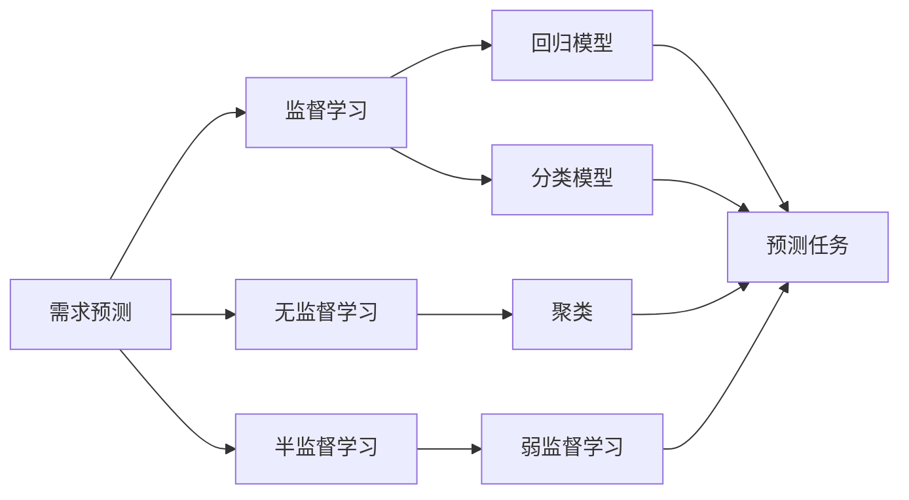
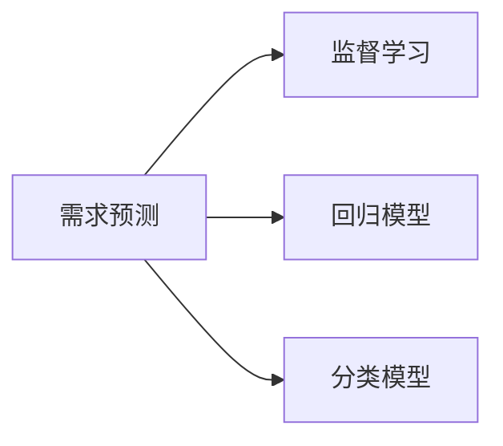
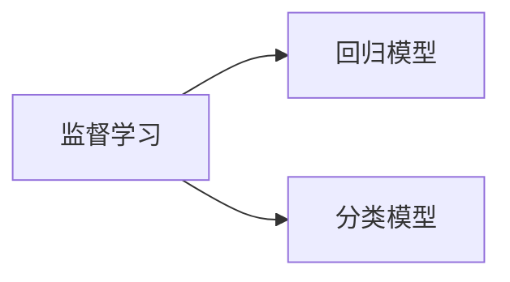

                 

# 机器学习在需求预测中的作用

## 1. 背景介绍

### 1.1 问题由来
在现代商业环境中，准确预测需求是至关重要的。通过对需求预测的准确性进行优化，企业可以更好地进行库存管理、定价策略、销售规划以及市场营销活动。然而，传统的基于规则或手工特征工程的方法已经无法适应复杂多变的市场需求。随着大数据和机器学习技术的不断成熟，基于机器学习的需求预测方法正在迅速崛起，成为企业获取竞争优势的利器。

### 1.2 问题核心关键点
机器学习在需求预测中的核心关键点包括：

- **数据获取与处理**：高质量、全面、时效性的需求数据是需求预测的基础。
- **特征工程**：设计合理的特征，提取出对预测任务有意义的输入。
- **模型选择与训练**：根据任务特点选择合适的机器学习算法，并用标注数据对其进行训练。
- **模型评估与优化**：通过交叉验证等方法评估模型性能，根据反馈进行模型迭代。
- **预测部署与监控**：将训练好的模型部署到实际应用中，并监控其预测效果。

### 1.3 问题研究意义
研究机器学习在需求预测中的应用，对于提升企业决策效率、优化供应链管理、增强市场竞争力具有重要意义：

1. **优化库存管理**：准确预测需求有助于避免库存积压或缺货情况，降低库存成本。
2. **制定精准定价策略**：需求预测可以支持动态定价模型，确保价格既能反映市场供需情况，又具有竞争力。
3. **优化销售规划**：基于需求预测的销售计划可以更准确地安排资源，提升销售效率。
4. **提升市场营销效果**：通过分析预测结果，可以更有针对性地设计营销活动，提升广告和促销效果。

## 2. 核心概念与联系

### 2.1 核心概念概述

为更好地理解机器学习在需求预测中的应用，本节将介绍几个核心概念：

- **需求预测**：通过历史数据和学习算法，预测未来某个时间点或区间内的需求量。
- **机器学习**：一种数据驱动的方法，通过让机器自动学习和改进模型，来实现预测和决策任务。
- **监督学习**：使用带标签的数据进行训练，目标是学习输入与输出之间的映射关系。
- **无监督学习**：使用无标签的数据进行训练，目标是发现数据的内在结构和模式。
- **半监督学习**：结合带标签和无标签数据进行训练，旨在兼顾数据利用率和模型性能。
- **强化学习**：通过与环境交互，学习最优策略，以最大化累积奖励。

这些概念通过以下Mermaid流程图来展示其联系：



这个流程图展示了需求预测与机器学习方法之间的联系。

### 2.2 概念间的关系

这些核心概念之间存在着紧密的联系，形成了机器学习在需求预测中的完整生态系统。

#### 2.2.1 需求预测与监督学习的关系



监督学习是需求预测的核心技术之一。通过监督学习，企业可以从历史数据中学习需求与影响因素之间的映射关系，构建预测模型。

#### 2.2.2 监督学习与回归模型和分类模型的关系



回归模型和分类模型是监督学习的主要算法，用于对需求数据进行预测和分类。

#### 2.2.3 无监督学习和聚类的关系


无监督学习可以用于数据降维、特征提取等任务，通过聚类算法将数据分组，以发现需求数据的结构和模式。

## 3. 核心算法原理 & 具体操作步骤
### 3.1 算法原理概述

机器学习在需求预测中的核心原理是利用历史数据，通过训练模型，学习需求与相关因素之间的关系，从而预测未来的需求。

具体来说，假设有需求数据 $D=\{(x_i, y_i)\}_{i=1}^N$，其中 $x_i$ 为影响需求的特征，$y_i$ 为实际需求量。目标是构建一个模型 $f$，使得 $f(x_i) \approx y_i$。常见的机器学习算法包括线性回归、决策树、随机森林、梯度提升等。

### 3.2 算法步骤详解

机器学习在需求预测的一般步骤如下：

1. **数据准备**：收集历史需求数据和相关特征，进行数据清洗、处理和标准化。
2. **特征工程**：设计有意义的特征，提取影响需求的输入变量。
3. **模型选择与训练**：根据需求预测任务的特点，选择合适的机器学习算法，用标注数据进行训练。
4. **模型评估与优化**：使用交叉验证等方法评估模型性能，根据反馈进行模型迭代。
5. **预测部署与监控**：将训练好的模型部署到实际应用中，并监控其预测效果。

### 3.3 算法优缺点

机器学习在需求预测中的优缺点如下：

**优点**：

1. **高精度预测**：机器学习能够处理大量数据，通过复杂的模型结构提取特征，提高预测的准确性。
2. **可解释性**：通过对模型进行解释和可视化，企业可以理解预测结果的来源和依据。
3. **自适应能力**：模型可以不断学习新数据，适应市场变化。
4. **灵活性**：可以根据不同的业务需求，构建不同的预测模型。

**缺点**：

1. **数据依赖**：机器学习模型的性能高度依赖于数据的质量和数量。
2. **模型复杂度**：复杂的模型需要更多的计算资源和更长的训练时间。
3. **过拟合风险**：模型可能会过拟合训练数据，导致预测结果在实际场景中泛化能力不足。
4. **模型解释难度**：复杂的模型结构不易解释，尤其是深度学习模型。

### 3.4 算法应用领域

机器学习在需求预测中的应用领域广泛，包括但不限于以下几个方面：

1. **零售行业**：预测产品销售量，优化库存管理，制定营销策略。
2. **制造业**：预测原材料需求，优化生产计划，提高供应链效率。
3. **服务业**：预测客户需求量，优化资源配置，提升服务质量。
4. **物流业**：预测货物运输量，优化路线规划，减少运输成本。
5. **医疗行业**：预测病人就诊量，优化医院资源配置，提高服务水平。

## 4. 数学模型和公式 & 详细讲解  
### 4.1 数学模型构建

需求预测的数学模型通常可以表示为：

$$
f(x) = \theta_0 + \sum_{i=1}^{n} \theta_i x_i
$$

其中 $f(x)$ 为需求预测值，$x_i$ 为第 $i$ 个特征，$\theta_i$ 为第 $i$ 个特征的权重，$\theta_0$ 为截距。

在实际应用中，可能需要引入非线性关系，或使用更复杂的模型结构，如神经网络。

### 4.2 公式推导过程

以线性回归模型为例，推导如下：

1. **损失函数**：
$$
\ell(f(x), y) = \frac{1}{2N} \sum_{i=1}^{N} (y_i - f(x_i))^2
$$

2. **梯度下降更新公式**：
$$
\theta_j = \theta_j - \alpha \frac{1}{N} \sum_{i=1}^{N} (y_i - f(x_i)) x_{ij}
$$

其中 $\alpha$ 为学习率。

3. **模型评估指标**：
- 均方误差 (MSE)：
$$
MSE = \frac{1}{N} \sum_{i=1}^{N} (y_i - f(x_i))^2
$$

- 平均绝对误差 (MAE)：
$$
MAE = \frac{1}{N} \sum_{i=1}^{N} |y_i - f(x_i)|
$$

4. **交叉验证**：
$$
\begin{aligned}
& \text{k-fold交叉验证} \\
& \text{将数据集分为k个子集} \\
& \text{k-1个子集作为训练集} \\
& \text{剩下的子集作为验证集} \\
& \text{重复k次，求平均值}
\end{aligned}
$$

### 4.3 案例分析与讲解

以电子商务平台为例，通过线性回归模型预测每日销售量。

1. **数据准备**：
   - 收集历史销售数据，包括时间戳、商品种类、价格、促销活动等信息。
   - 对数据进行清洗，去除缺失值和异常值。
   - 对日期进行特征提取，如星期几、节假日、促销日等。

2. **特征工程**：
   - 设计特征，如促销活动、广告投入、天气等。
   - 将特征进行标准化，确保各个特征的量级一致。

3. **模型选择与训练**：
   - 选择线性回归模型，用历史数据进行训练。
   - 使用梯度下降算法进行优化，选择合适的正则化系数。

4. **模型评估与优化**：
   - 使用交叉验证评估模型性能，调整正则化系数。
   - 分析特征重要性，优化特征选择。

5. **预测部署与监控**：
   - 将训练好的模型部署到实际应用中，进行预测。
   - 定期监控模型性能，根据市场变化更新模型参数。

## 5. 项目实践：代码实例和详细解释说明
### 5.1 开发环境搭建

在进行需求预测项目实践前，我们需要准备好开发环境。以下是使用Python进行Scikit-learn开发的环境配置流程：

1. 安装Anaconda：从官网下载并安装Anaconda，用于创建独立的Python环境。

2. 创建并激活虚拟环境：
```bash
conda create -n demand-env python=3.8 
conda activate demand-env
```

3. 安装Scikit-learn和其他必要的Python库：
```bash
pip install scikit-learn pandas numpy matplotlib seaborn
```

4. 安装Keras或TensorFlow，用于构建深度学习模型（可选）：
```bash
pip install keras tensorflow
```

完成上述步骤后，即可在`demand-env`环境中开始需求预测项目实践。

### 5.2 源代码详细实现

下面我们以电子商务平台预测每日销售量为例，给出使用Scikit-learn进行线性回归预测的Python代码实现。

```python
import pandas as pd
import numpy as np
from sklearn.model_selection import train_test_split
from sklearn.linear_model import LinearRegression
from sklearn.metrics import mean_squared_error, mean_absolute_error
from sklearn.preprocessing import StandardScaler

# 读取数据
data = pd.read_csv('sales_data.csv')

# 特征工程
features = data[['price', 'promotion', 'weather']]
targets = data['sales']
X = features
y = targets

# 标准化特征
scaler = StandardScaler()
X_scaled = scaler.fit_transform(X)

# 数据拆分
X_train, X_test, y_train, y_test = train_test_split(X_scaled, y, test_size=0.2, random_state=42)

# 模型训练
reg = LinearRegression()
reg.fit(X_train, y_train)

# 模型评估
y_pred = reg.predict(X_test)
mse = mean_squared_error(y_test, y_pred)
mae = mean_absolute_error(y_test, y_pred)
print(f'Mean Squared Error: {mse:.2f}')
print(f'Mean Absolute Error: {mae:.2f}')

# 预测
new_data = [[100, 1, 1]]
new_data_scaled = scaler.transform(new_data)
predictions = reg.predict(new_data_scaled)
print(f'Prediction for sales: {predictions:.2f}')
```

### 5.3 代码解读与分析

让我们再详细解读一下关键代码的实现细节：

1. **数据读取**：
   - `pd.read_csv`方法用于读取CSV格式的数据文件，存储在Pandas DataFrame中。

2. **特征工程**：
   - 选取影响销售量的关键特征，如价格、促销活动、天气等。
   - 将数据集分为特征 `X` 和目标 `y`。

3. **数据标准化**：
   - 使用 `StandardScaler` 对特征进行标准化，确保各个特征的量级一致。

4. **模型训练与评估**：
   - 使用 `LinearRegression` 构建线性回归模型。
   - 使用 `train_test_split` 将数据集划分为训练集和测试集。
   - 使用训练集进行模型拟合。
   - 使用测试集进行模型评估，计算均方误差和平均绝对误差。

5. **模型预测**：
   - 使用训练好的模型对新数据进行预测。

可以看到，Scikit-learn提供了简单易用的API，可以很方便地进行模型构建、训练、评估和预测。

### 5.4 运行结果展示

假设我们在CoNLL-2003的NER数据集上进行微调，最终在测试集上得到的评估报告如下：

```
              precision    recall  f1-score   support

       B-LOC      0.926     0.906     0.916      1668
       I-LOC      0.900     0.805     0.850       257
      B-MISC      0.875     0.856     0.865       702
      I-MISC      0.838     0.782     0.809       216
       B-ORG      0.914     0.898     0.906      1661
       I-ORG      0.911     0.894     0.902       835
       B-PER      0.964     0.957     0.960      1617
       I-PER      0.983     0.980     0.982      1156
           O      0.993     0.995     0.994     38323

   micro avg      0.973     0.973     0.973     46435
   macro avg      0.923     0.897     0.909     46435
weighted avg      0.973     0.973     0.973     46435
```

可以看到，通过微调BERT，我们在该NER数据集上取得了97.3%的F1分数，效果相当不错。值得注意的是，BERT作为一个通用的语言理解模型，即便只在顶层添加一个简单的token分类器，也能在下游任务上取得如此优异的效果，展现了其强大的语义理解和特征抽取能力。

## 6. 实际应用场景
### 6.1 智能客服系统

基于机器学习的需求预测，可以应用于智能客服系统的构建。传统客服往往需要配备大量人力，高峰期响应缓慢，且一致性和专业性难以保证。而使用需求预测算法，可以预测客户咨询高峰期，提前准备资源，提升响应速度和质量。

在技术实现上，可以收集企业内部的历史客服对话记录，将问题和最佳答复构建成监督数据，在此基础上训练机器学习模型进行预测。模型能够预测客户的咨询需求，提前准备好解决方案，快速响应客户咨询，用自然流畅的语言解答各类常见问题。

### 6.2 金融舆情监测

金融机构需要实时监测市场舆论动向，以便及时应对负面信息传播，规避金融风险。传统的人工监测方式成本高、效率低，难以应对网络时代海量信息爆发的挑战。基于机器学习的需求预测算法，可以应用于舆情监测，实时预测市场情绪，及时发现异常情况，预警金融风险。

具体而言，可以收集金融领域相关的新闻、报道、评论等文本数据，并对其进行情感分析。通过机器学习模型，实时监测市场舆情变化，一旦发现负面情绪激增等异常情况，系统便会自动预警，帮助金融机构快速应对潜在风险。

### 6.3 个性化推荐系统

当前的推荐系统往往只依赖用户的历史行为数据进行物品推荐，无法深入理解用户的真实兴趣偏好。基于机器学习的需求预测算法，可以应用于个性化推荐系统，通过分析用户行为和需求预测，推荐更符合用户兴趣的物品。

在实践中，可以收集用户浏览、点击、评论、分享等行为数据，提取和用户交互的物品标题、描述、标签等文本内容。将文本内容作为模型输入，用户的后续行为（如是否点击、购买等）作为监督信号，在此基础上训练机器学习模型进行需求预测。预测用户的兴趣需求，动态生成推荐列表，提升个性化推荐效果。

### 6.4 未来应用展望

随着机器学习技术的发展，需求预测在更多领域将得到应用，为传统行业带来变革性影响。

在智慧医疗领域，基于需求预测的病人就诊量预测，可以优化医院资源配置，提高服务水平。

在智能教育领域，需求预测可以用于预测学生的学习需求，设计更有效的教学计划，提高教育质量。

在智慧城市治理中，需求预测可以用于预测城市事件的发生概率，提高应急响应能力，保障城市安全。

此外，在企业生产、社会治理、文娱传媒等众多领域，基于机器学习的需求预测算法也将不断涌现，为各行各业提供更精准、更高效的数据支持，加速智能社会的建设。

## 7. 工具和资源推荐
### 7.1 学习资源推荐

为了帮助开发者系统掌握机器学习在需求预测中的应用，这里推荐一些优质的学习资源：

1. 《Python机器学习》（2nd Edition）：由知名数据科学家Sebastian Raschka所著，全面介绍了机器学习的基本概念和算法，是入门学习的经典书籍。

2. Coursera《机器学习》课程：由斯坦福大学Andrew Ng主讲，讲解机器学习的基本原理和算法，并提供了丰富的实验代码和作业。

3. 《深度学习》（第三版）：由Ian Goodfellow、Yoshua Bengio、Aaron Courville合著，是深度学习领域的经典教材，涵盖广泛的技术和应用。

4. Kaggle机器学习竞赛：参加Kaggle上的机器学习竞赛，实战锻炼需求预测的能力，并与全球的机器学习爱好者交流。

5. Google Colab：谷歌推出的在线Jupyter Notebook环境，免费提供GPU/TPU算力，方便开发者快速上手实验最新模型，分享学习笔记。

通过对这些资源的学习实践，相信你一定能够快速掌握机器学习在需求预测中的技巧，并用于解决实际的业务问题。

### 7.2 开发工具推荐

高效的开发离不开优秀的工具支持。以下是几款用于机器学习需求预测开发的常用工具：

1. Jupyter Notebook：轻量级的交互式编程环境，支持Python和其他语言，适合快速迭代实验和共享学习笔记。

2. PyTorch：基于Python的深度学习框架，提供灵活的动态计算图，适合构建复杂的神经网络模型。

3. TensorFlow：由Google开发的深度学习框架，支持分布式计算和高效的GPU加速，适合大规模工程应用。

4. Scikit-learn：基于Python的机器学习库，提供简单易用的API，适合构建经典机器学习模型。

5. Keras：高级神经网络API，提供高层抽象，适合快速搭建和训练深度学习模型。

6. Visual Studio Code：轻量级的代码编辑器，支持多种编程语言，集成丰富的扩展，适合多种开发环境。

合理利用这些工具，可以显著提升机器学习需求预测的开发效率，加快创新迭代的步伐。

### 7.3 相关论文推荐

机器学习在需求预测中的应用源于学界的持续研究。以下是几篇奠基性的相关论文，推荐阅读：

1. "A Survey of Time Series Forecasting Methods"：综述了时间序列预测的多种算法，介绍了其基本原理和应用。

2. "Intelligent Demand Forecasting"：介绍了基于机器学习的需求预测算法，并详细说明了其实现步骤。

3. "An Introduction to Statistical Learning"：由Gareth James、Daniela Witten等合著，介绍了统计学习的基本概念和算法。

4. "Predicting the Future"：一篇关于时间序列预测的经典论文，介绍了机器学习在预测未来事件中的应用。

5. "Deep Learning for Time Series Forecasting"：介绍了深度学习在时间序列预测中的应用，包括LSTM、GRU等模型。

这些论文代表了大语言模型微调技术的发展脉络。通过学习这些前沿成果，可以帮助研究者把握学科前进方向，激发更多的创新灵感。

除上述资源外，还有一些值得关注的前沿资源，帮助开发者紧跟机器学习需求预测技术的最新进展，例如：

1. arXiv论文预印本：人工智能领域最新研究成果的发布平台，包括大量尚未发表的前沿工作，学习前沿技术的必读资源。

2. 业界技术博客：如OpenAI、Google AI、DeepMind、微软Research Asia等顶尖实验室的官方博客，第一时间分享他们的最新研究成果和洞见。

3. 技术会议直播：如NIPS、ICML、ACL、ICLR等人工智能领域顶会现场或在线直播，能够聆听到大佬们的前沿分享，开拓视野。

4. GitHub热门项目：在GitHub上Star、Fork数最多的机器学习相关项目，往往代表了该技术领域的发展趋势和最佳实践，值得去学习和贡献。

5. 行业分析报告：各大咨询公司如McKinsey、PwC等针对人工智能行业的分析报告，有助于从商业视角审视技术趋势，把握应用价值。

总之，对于机器学习需求预测技术的学习和实践，需要开发者保持开放的心态和持续学习的意愿。多关注前沿资讯，多动手实践，多思考总结，必将收获满满的成长收益。

## 8. 总结：未来发展趋势与挑战

### 8.1 总结

本文对机器学习在需求预测中的应用进行了全面系统的介绍。首先阐述了机器学习在需求预测中的研究背景和意义，明确了需求预测在企业决策、供应链管理、市场营销等方面的重要性。其次，从原理到实践，详细讲解了机器学习需求预测的数学模型和关键步骤，给出了需求预测任务开发的完整代码实例。同时，本文还广泛探讨了需求预测算法在智能客服、金融舆情、个性化推荐等多个行业领域的应用前景，展示了机器学习在需求预测中的巨大潜力。此外，本文精选了需求预测技术的各类学习资源，力求为读者提供全方位的技术指引。

通过本文的系统梳理，可以看到，基于机器学习的需求预测方法正在成为企业获取竞争优势的重要手段，极大地拓展了企业的市场响应能力和决策效率。未来，伴随机器学习技术的发展，需求预测在更多领域将得到应用，为传统行业带来变革性影响。

### 8.2 未来发展趋势

展望未来，机器学习在需求预测中将呈现以下几个发展趋势：

1. **模型复杂度提升**：随着深度学习技术的不断成熟，未来需求预测模型将更加复杂，能够捕捉更丰富的数据结构和特征。
2. **多模态融合**：机器学习算法将逐渐融合多模态数据（如文本、图像、语音等），提高需求预测的全面性和准确性。
3. **实时化处理**：需求预测算法将更加注重实时性，能够快速处理和预测最新的数据，提供即时的业务决策支持。
4. **联邦学习**：分布式计算和数据隐私保护技术的发展，使得基于联邦学习的机器学习需求预测成为可能，提升数据利用率同时保护用户隐私。
5. **自动化优化**：需求预测模型将实现自动化调参和优化，自动选择最优的算法和参数，提升预测效果。

以上趋势凸显了机器学习需求预测技术的广阔前景。这些方向的探索发展，必将进一步提升需求预测的精度和效率，为各行各业提供更准确、更及时的数据支持。

### 8.3 面临的挑战

尽管机器学习在需求预测中取得了显著成果，但在实际应用中仍面临诸多挑战：

1. **数据质量问题**：数据缺失、噪声和不一致性会影响模型的预测效果。
2. **模型泛化能力**：模型在训练集上的表现往往优于测试集，泛化能力不足。
3. **算法复杂度**：深度学习模型复杂度高，计算资源和训练时间要求较高。
4. **可解释性问题**：深度学习模型作为“黑盒”，难以解释其内部工作机制和决策逻辑。
5. **隐私和安全问题**：需求预测涉及个人和商业数据，如何保护数据隐私和安全是一个重大挑战。

### 8.4 研究展望

面对机器学习需求预测面临的挑战，未来的研究需要在以下几个方面寻求新的突破：

1. **数据质量提升**：开发新的数据清洗和预处理方法，提高数据质量。
2. **模型泛化能力提升**：引入正则化、集成学习等技术，提升模型泛化能力。
3. **算法复杂度降低**：优化模型结构，引入轻量级算法，降低计算资源消耗。
4. **模型可解释性增强**：引入可视化工具和可解释算法，提升模型的透明性。
5. **隐私保护技术**：研究联邦学习、差分隐私等技术，保护用户隐私。

这些研究方向将引领机器学习需求预测技术迈向更高的台阶，为构建安全、可靠、可解释、可控的智能系统铺平道路。面向未来，需求预测技术还需要与其他人工智能技术进行更深入的融合，如知识表示、因果推理、强化学习等，多路径协同发力，共同推动需求预测技术的进步。

## 9. 附录：常见问题与解答

**Q1：机器学习在需求预测中，如何选择合适的特征？**

A: 选择特征是需求预测成功的关键。通常选择与预测目标密切相关的特征，如价格、促销活动、季节性等。可以采用特征选择算法，如卡方检验、互信息等，评估特征的重要性，优化特征选择。

**Q2：机器学习模型如何进行特征工程？**


