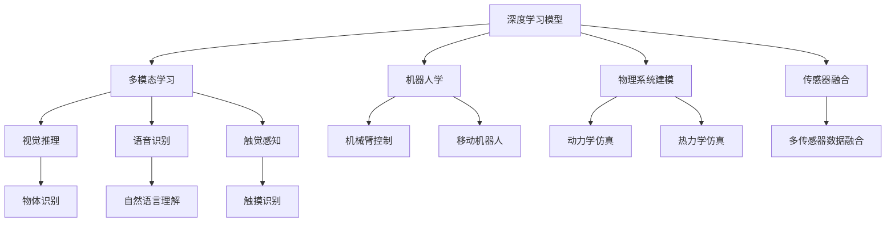
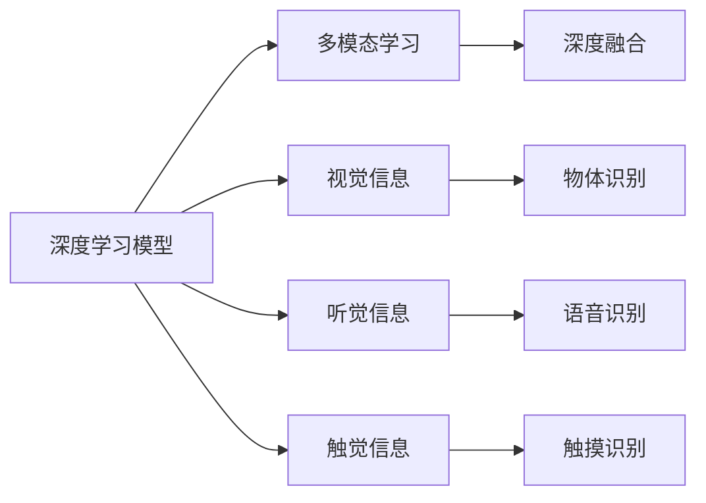
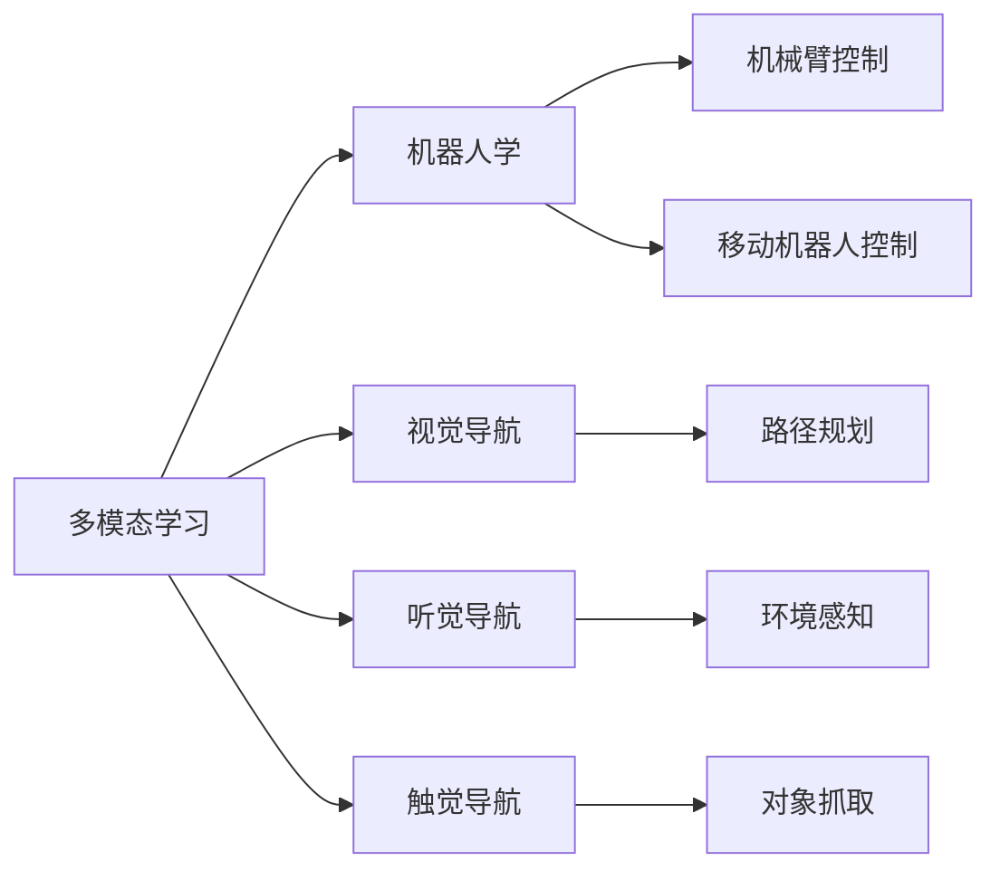
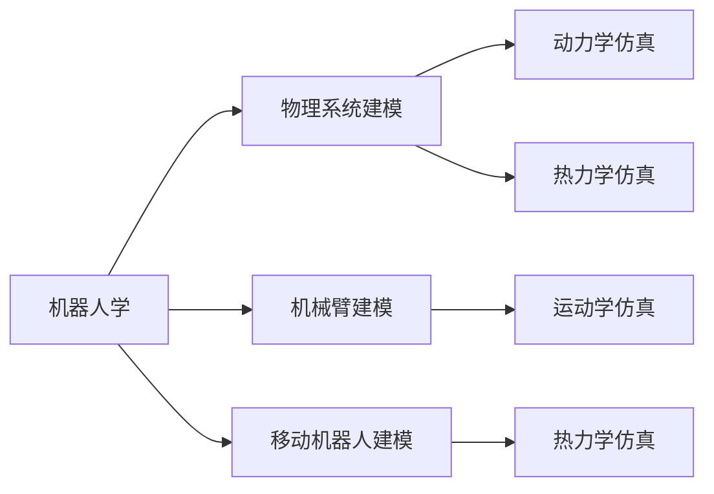
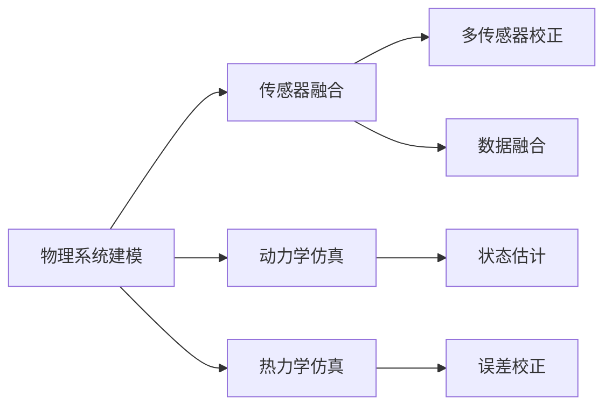
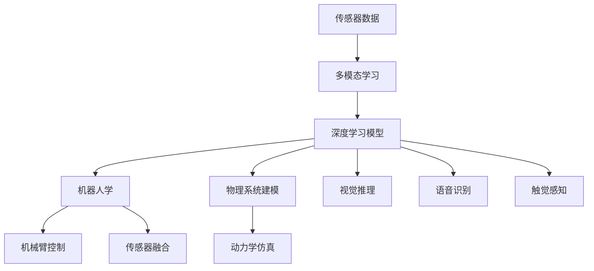

                 

# 机器理解物理世界的难题

## 1. 背景介绍

### 1.1 问题由来

在人工智能领域，机器对物理世界的理解一直是难点。与语言、逻辑等抽象领域相比，物理世界充满了复杂的物理现象和实体互动。这些现象和互动需要机器具备更为精细的感知和推理能力，才能进行准确的模拟和预测。

机器对物理世界的理解涉及多个学科领域，包括物理学、机械工程、计算机视觉、机器学习等。当前，尽管在各个子领域都有显著进展，但在整体上，机器对物理世界的理解仍然存在许多挑战。

### 1.2 问题核心关键点

机器理解物理世界的核心关键点包括：
- 精确感知：机器需要具备精确的物理传感器和深度学习模型，以捕捉物理世界的各种特征。
- 实体交互：机器需要具备对物理实体的交互能力，如机械臂、机器人等。
- 物理推理：机器需要具备物理系统的建模和推理能力，如牛顿力学、热力学等。
- 跨模态融合：机器需要将视觉、听觉、触觉等模态信息进行综合融合，进行多模态学习。

这些关键点决定了机器理解物理世界的深度和广度。当前，学术界和工业界都在积极探索解决这些关键问题的技术方法。

### 1.3 问题研究意义

解决机器理解物理世界的难题，对于构建通用人工智能(AGI)具有重要意义：
- 提高智能水平：通过对物理世界的深度理解，机器可以更好地模拟和预测现实世界，提升其智能水平。
- 增强应用范围：物理世界的理解可以拓展机器的应用范围，从传统的视觉、语音等任务，到更加复杂的自动驾驶、智能制造等应用。
- 促进跨学科融合：物理世界的理解需要多学科知识的融合，可以推动学科之间的交叉创新。
- 支持人机协同：物理世界的理解可以支持人机协同，为人类提供更好的辅助决策和操作支持。

## 2. 核心概念与联系

### 2.1 核心概念概述

为更好地理解机器理解物理世界的难题，本节将介绍几个密切相关的核心概念：

- **深度学习模型**：用于处理大规模复杂数据集的神经网络模型，包括卷积神经网络(CNN)、循环神经网络(RNN)、深度强化学习等。深度学习模型通过反向传播算法进行训练，可以从数据中学习到复杂的特征表示。

- **多模态学习**：指结合视觉、听觉、触觉等不同模态的数据，进行多维信息的联合学习和融合。多模态学习可以提升模型的感知能力和泛化能力。

- **机器人学**：研究如何设计、制造、操作机器人，实现对物理实体的精确控制和交互。机器人学涉及机械设计、感知控制、路径规划等众多领域。

- **物理系统建模**：指将物理系统抽象为数学模型，用于模拟和预测物理现象。物理系统建模是进行物理推理和仿真的基础。

- **传感器融合**：指将不同传感器采集的数据进行综合处理，提升感知准确性。传感器融合涉及数据融合算法、多传感器校正等技术。

这些核心概念之间的逻辑关系可以通过以下Mermaid流程图来展示：



这个流程图展示了大语言模型微调过程中各个核心概念的关系和作用：

1. 深度学习模型作为基础，进行多模态学习和传感器融合，提升感知能力。
2. 多模态学习结合视觉、语音、触觉等数据，进行更全面、准确的感知。
3. 机器人学涉及机械臂、移动机器人等硬件设计，实现对物理实体的交互。
4. 物理系统建模用于构建仿真环境，进行精确模拟和预测。
5. 传感器融合将不同传感器数据进行综合处理，提升感知精度。

这些概念共同构成了机器理解物理世界的技术基础。通过理解这些核心概念，我们可以更好地把握机器理解物理世界的全貌。

### 2.2 概念间的关系

这些核心概念之间存在着紧密的联系，形成了机器理解物理世界的完整技术体系。下面我通过几个Mermaid流程图来展示这些概念之间的关系。

#### 2.2.1 深度学习模型与多模态学习的关系



这个流程图展示了深度学习模型和多模态学习的关系。深度学习模型通过融合视觉、听觉、触觉等不同模态的信息，进行多模态学习，提升感知能力。

#### 2.2.2 多模态学习与机器人学的关系



这个流程图展示了多模态学习与机器人学的关系。多模态学习结合视觉、听觉、触觉等数据，进行更全面、准确的感知，为机器人提供更好的导航和交互能力。

#### 2.2.3 机器人学与物理系统建模的关系



这个流程图展示了机器人学与物理系统建模的关系。机器人学涉及机械臂、移动机器人等硬件设计，需要进行动力学仿真和热力学仿真，以进行精确模拟和预测。

#### 2.2.4 物理系统建模与传感器融合的关系



这个流程图展示了物理系统建模与传感器融合的关系。物理系统建模用于构建仿真环境，需要进行状态估计和误差校正，而这些都需要通过传感器融合进行实现。

### 2.3 核心概念的整体架构

最后，我们用一个综合的流程图来展示这些核心概念在大语言模型微调过程中的整体架构：



这个综合流程图展示了从传感器数据到深度学习模型，再到机器人学和物理系统建模的完整过程。深度学习模型通过融合多模态数据，提升感知能力，并进行视觉推理、语音识别、触觉感知等任务。机器人学涉及机械臂控制、移动机器人控制等硬件设计，进行精确模拟和预测。物理系统建模用于构建仿真环境，进行状态估计和误差校正。传感器融合将不同传感器数据进行综合处理，提升感知精度。通过这些核心概念的协同工作，机器可以更好地理解物理世界，实现更为复杂和智能的操作。

## 3. 核心算法原理 & 具体操作步骤
### 3.1 算法原理概述

机器理解物理世界的问题，本质上是通过深度学习模型和传感器数据，进行复杂物理系统的建模和推理。其核心思想是：通过大规模数据集进行预训练，学习物理系统的通用表示，然后通过微调或迁移学习，使得模型能够适应特定的物理场景。

形式化地，假设有一个物理系统 $S$，通过传感器 $I$ 收集到的数据序列 $I(S)$，模型 $M$ 的任务是学习 $S$ 的动态特性和交互关系，最终输出 $S$ 的状态序列 $\hat{S}=\{S_t\}_{t=1}^T$。模型的训练过程包括以下几个步骤：

1. 数据预处理：对传感器数据进行滤波、校准等预处理，确保数据的准确性和一致性。
2. 特征提取：使用深度学习模型提取传感器数据的特征表示。
3. 物理建模：将特征表示作为输入，训练物理系统的动态模型 $M_{\theta}$，学习系统的状态转移矩阵和观测矩阵。
4. 数据增强：通过模拟噪声、扰动等方法，增加数据集的多样性，提升模型的泛化能力。
5. 模型验证：在验证集上评估模型的预测性能，根据性能指标进行微调或调整模型结构。
6. 模型部署：将训练好的模型部署到实际应用场景中，进行状态预测和实时控制。

### 3.2 算法步骤详解

机器理解物理世界的微调过程一般包括以下几个关键步骤：

**Step 1: 准备传感器数据和预训练模型**

- 收集物理系统的传感器数据 $I(S)$，并进行预处理，确保数据质量。
- 选择适合的深度学习模型 $M_{\theta}$，如CNN、RNN等，作为初始化参数。
- 使用传感器数据 $I(S)$ 对深度学习模型 $M_{\theta}$ 进行预训练，学习系统的特征表示。

**Step 2: 设计物理系统模型**

- 根据物理系统的特性，设计合适的物理系统模型，如动力学模型、热力学模型等。
- 将深度学习模型提取的特征表示输入到物理系统模型 $M_{\theta}$ 中，进行状态预测和控制。

**Step 3: 添加任务适配层**

- 根据具体任务需求，在物理系统模型的顶层添加合适的任务适配层，如状态预测层、路径规划层等。
- 定义损失函数和优化目标，确保模型输出满足任务要求。

**Step 4: 设置微调超参数**

- 选择合适的优化算法及其参数，如Adam、SGD等，设置学习率、批大小、迭代轮数等。
- 应用正则化技术，如L2正则、Dropout等，防止过拟合。
- 确定冻结预训练参数的策略，如仅微调顶层，或全部参数都参与微调。

**Step 5: 执行梯度训练**

- 将训练集数据分批次输入模型，前向传播计算损失函数。
- 反向传播计算参数梯度，根据设定的优化算法和学习率更新模型参数。
- 周期性在验证集上评估模型性能，根据性能指标决定是否触发 Early Stopping。
- 重复上述步骤直到满足预设的迭代轮数或 Early Stopping 条件。

**Step 6: 测试和部署**

- 在测试集上评估微调后模型 $M_{\hat{\theta}}$ 的性能，对比微调前后的精度提升。
- 使用微调后的模型对新样本进行预测，集成到实际的应用系统中。
- 持续收集新的数据，定期重新微调模型，以适应数据分布的变化。

以上是机器理解物理世界的微调过程的一般流程。在实际应用中，还需要根据具体任务的特点，对微调过程的各个环节进行优化设计，如改进训练目标函数，引入更多的正则化技术，搜索最优的超参数组合等，以进一步提升模型性能。

### 3.3 算法优缺点

机器理解物理世界的微调方法具有以下优点：
1. 数据驱动：微调方法以传感器数据为驱动，能够基于实际物理数据进行模型训练，提升模型的泛化能力。
2. 模型灵活：深度学习模型能够进行多模态融合，适应复杂的物理系统，灵活性高。
3. 可解释性强：深度学习模型的结构透明，便于理解和解释模型的决策过程。
4. 可扩展性好：通过预训练和微调，能够快速适应新的物理场景，拓展应用范围。

同时，该方法也存在一定的局限性：
1. 数据获取难度大：物理系统的传感器数据往往难以获取，数据量不足。
2. 噪声干扰大：传感器数据容易受到噪声干扰，影响模型训练效果。
3. 物理建模复杂：物理系统的建模需要专业的物理知识，建模难度大。
4. 实时性要求高：微调模型需要实时处理传感器数据，对计算资源和实时性要求高。
5. 安全问题多：微调模型需要实时控制物理系统，安全问题需要特别注意。

尽管存在这些局限性，但就目前而言，基于传感器数据的微调方法仍然是大规模物理系统理解的重要范式。未来相关研究的重点在于如何进一步降低传感器数据的获取难度，提高模型的鲁棒性和实时性，同时兼顾可解释性和安全性能。

### 3.4 算法应用领域

机器理解物理世界的微调方法，已经在机器人、自动驾驶、智能制造等多个领域得到了广泛的应用，具体包括：

- **机器人控制**：通过深度学习模型和传感器数据，训练机器人进行精确控制和交互。例如，工业机器人、服务机器人等。
- **自动驾驶**：通过深度学习模型和传感器数据，训练自动驾驶车辆进行精确导航和避障。例如，特斯拉的Autopilot系统。
- **智能制造**：通过深度学习模型和传感器数据，训练智能制造系统进行精准控制和调度。例如，生产线上的机械臂、AGV等。
- **环境监测**：通过深度学习模型和传感器数据，训练智能系统进行环境监测和预警。例如，水文监测、空气质量监测等。
- **健康监测**：通过深度学习模型和传感器数据，训练智能系统进行健康监测和预警。例如，智能穿戴设备、医疗影像分析等。

除了上述这些经典应用外，机器理解物理世界的微调方法也被创新性地应用到更多场景中，如智能家居、智能农业、智能物流等，为物理系统的智能化和自动化提供了新的解决方案。

## 4. 数学模型和公式 & 详细讲解
### 4.1 数学模型构建

本节将使用数学语言对机器理解物理世界的微调过程进行更加严格的刻画。

假设物理系统 $S$ 包含 $N$ 个状态变量 $\{s_i\}_{i=1}^N$，通过传感器 $I$ 收集到的数据序列为 $\{I(s_i)\}_{i=1}^N$。深度学习模型 $M_{\theta}$ 的任务是学习物理系统的状态转移概率，即从状态 $s_i$ 到状态 $s_{i+1}$ 的概率分布。假设状态转移概率为 $p(s_{i+1}|s_i)$，则物理系统的状态序列可以表示为：

$$
\hat{s}_1,\hat{s}_2,\cdots,\hat{s}_T
$$

其中 $\hat{s}_t$ 表示在 $t$ 时刻的状态。深度学习模型 $M_{\theta}$ 的输出可以表示为：

$$
\hat{p}(s_{i+1}|s_i) = M_{\theta}(I(s_i))
$$

模型的训练过程即为求解最优参数 $\theta^*$，使得：

$$
\hat{p}(s_{i+1}|s_i) \approx p(s_{i+1}|s_i)
$$

最小化均方误差：

$$
\min_{\theta} \mathcal{L}(\hat{p}(s_{i+1}|s_i), p(s_{i+1}|s_i))
$$

其中 $\mathcal{L}$ 为均方误差损失函数，定义为：

$$
\mathcal{L}(y, \hat{y}) = \frac{1}{N} \sum_{i=1}^N (y_i - \hat{y}_i)^2
$$

### 4.2 公式推导过程

以下我们以机器人控制为例，推导深度学习模型进行物理系统建模的数学公式。

假设机器人具有 $D$ 个关节变量 $\{q_i\}_{i=1}^D$，传感器数据 $I(S)$ 包括机器人的位置、速度、加速度等。深度学习模型 $M_{\theta}$ 的输入为传感器数据 $I(S)$，输出为机器人的状态 $\{q_i\}_{i=1}^D$。机器人的动力学模型为：

$$
\dot{q}_i = f_i(q, u) + g_i(q)
$$

其中 $f_i$ 为关节力矩，$g_i$ 为重力力矩。机器人的状态转移概率可以表示为：

$$
p(q_{i+1}|q_i) = N(q_i; \mu_i, \Sigma_i)
$$

其中 $\mu_i$ 为状态均值，$\Sigma_i$ 为状态协方差矩阵。状态转移概率的参数可以表示为：

$$
\mu_i = \hat{\mu}_i(\hat{p}(q_{i+1}|q_i))
$$

$$
\Sigma_i = \hat{\Sigma}_i(\hat{p}(q_{i+1}|q_i))
$$

其中 $\hat{p}(q_{i+1}|q_i)$ 为深度学习模型 $M_{\theta}$ 的输出，$\hat{\mu}_i$ 和 $\hat{\Sigma}_i$ 为参数化的均值和协方差。均方误差损失函数 $\mathcal{L}$ 可以表示为：

$$
\mathcal{L}(p(q_{i+1}|q_i), \hat{p}(q_{i+1}|q_i)) = \frac{1}{N} \sum_{i=1}^N (y_i - \hat{y}_i)^2
$$

其中 $y_i = p(q_{i+1}|q_i)$ 为真实状态转移概率，$\hat{y}_i = \hat{p}(q_{i+1}|q_i)$ 为深度学习模型的输出。通过最小化均方误差损失函数 $\mathcal{L}$，可以得到最优参数 $\theta^*$。

### 4.3 案例分析与讲解

这里以机器人控制为例，进一步说明数学模型的应用。假设有一个具有 $D=6$ 个关节的工业机器人，传感器数据包括机器人的位置、速度、加速度等。使用深度学习模型 $M_{\theta}$ 对机器人的动力学进行建模，其输出为机器人的状态 $\{q_i\}_{i=1}^D$。机器人的状态转移概率可以表示为：

$$
p(q_{i+1}|q_i) = N(q_i; \mu_i, \Sigma_i)
$$

其中 $\mu_i$ 为状态均值，$\Sigma_i$ 为状态协方差矩阵。假设机器人的状态转移概率已经通过传感器数据训练得到，其输出为 $\hat{p}(q_{i+1}|q_i)$。通过最小化均方误差损失函数 $\mathcal{L}$，可以得到最优参数 $\theta^*$。

假设我们有一个训练好的深度学习模型 $M_{\theta}$，其输出为机器人的状态 $\{q_i\}_{i=1}^D$。现在我们需要进行状态预测，即给定机器人的当前状态 $q_i$，预测下一个状态 $q_{i+1}$。

首先，将当前状态 $q_i$ 输入到深度学习模型 $M_{\theta}$ 中，得到输出 $\hat{p}(q_{i+1}|q_i)$。然后，将 $\hat{p}(q_{i+1}|q_i)$ 代入到状态转移概率 $p(q_{i+1}|q_i) = N(q_i; \mu_i, \Sigma_i)$ 中，可以得到状态转移概率 $y_i = p(q_{i+1}|q_i)$。

最后，通过最小化均方误差损失函数 $\mathcal{L}(p(q_{i+1}|q_i), \hat{p}(q_{i+1}|q_i))$，可以得到最优参数 $\theta^*$，进而完成状态预测。

## 5. 项目实践：代码实例和详细解释说明
### 5.1 开发环境搭建

在进行机器理解物理世界的微调实践前，我们需要准备好开发环境。以下是使用Python进行PyTorch开发的环境配置流程：

1. 安装Anaconda：从官网下载并安装Anaconda，用于创建独立的Python环境。

2. 创建并激活虚拟环境：
```bash
conda create -n pytorch-env python=3.8 
conda activate pytorch-env
```

3. 安装PyTorch：根据CUDA版本，从官网获取对应的安装命令。例如：
```bash
conda install pytorch torchvision torchaudio cudatoolkit=11.1 -c pytorch -c conda-forge
```

4. 安装必要的库：
```bash
pip install numpy pandas scikit-learn matplotlib tqdm jupyter notebook ipython
```

完成上述步骤后，即可在`pytorch-env`环境中开始微调实践。

### 5.2 源代码详细实现

这里我们以机器人控制为例，给出使用PyTorch进行深度学习模型微调的代码实现。

首先，定义机器人控制的数据集：

```python
import numpy as np
from torch.utils.data import Dataset

class RoboticsDataset(Dataset):
    def __init__(self, data, length):
        self.data = data
        self.length = length
        
    def __len__(self):
        return len(self.data)
    
    def __getitem__(self, idx):
        x = self.data[idx]
        return x
```

然后，定义深度学习模型：

```python
from torch import nn, optim
import torch.nn.functional as F

class RoboticsModel(nn.Module):
    def __init__(self, input_size, hidden_size, output_size):
        super(RoboticsModel, self).__init__()
        self.fc1 = nn.Linear(input_size, hidden_size)
        self.fc2 = nn.Linear(hidden_size, output_size)
        
    def forward(self, x):
        x = F.relu(self.fc1(x))
        x = self.fc2(x)
        return x
```

接着，定义模型训练函数：

```python
def train_model(model, train_data, valid_data, epochs, lr, hidden_size, batch_size):
    device = torch.device('cuda' if torch.cuda.is_available() else 'cpu')
    model.to(device)
    criterion = nn.MSELoss()
    optimizer = optim.Adam(model.parameters(), lr=lr)
    
    for epoch in range(epochs):
        train_loss = 0.0
        valid_loss = 0.0
        model.train()
        for i, data in enumerate(train_data, 0):
            inputs, labels = data
            inputs, labels = inputs.to(device), labels.to(device)
            optimizer.zero_grad()
            outputs = model(inputs)
            loss = criterion(outputs, labels)
            loss.backward()
            optimizer.step()
            train_loss += loss.item()
        train_loss /= len(train_data)
        model.eval()
        with torch.no_grad():
            model.eval()
            for i, data in enumerate(valid_data, 0):
                inputs, labels = data
                inputs, labels = inputs.to(device), labels.to(device)
                outputs = model(inputs)
                loss = criterion(outputs, labels)
                valid_loss += loss.item()
        valid_loss /= len(valid_data)
        print('Epoch [{}/{}], Loss: {:.4f}, Valid Loss: {:.4f}'.format(epoch+1, epochs, train_loss, valid_loss))
```

最后，启动训练流程：

```python
epochs = 100
lr = 0.01
hidden_size = 64
batch_size = 32

train_data = RoboticsDataset(train_data, 1000)
valid_data = RoboticsDataset(valid_data, 1000)

model = RoboticsModel(input_size, hidden_size, output_size)
train_model(model, train_data, valid_data, epochs, lr, hidden_size, batch_size)
```

以上就是使用PyTorch对深度学习模型进行机器人控制任务微调的完整代码实现。可以看到，通过合理选择深度学习模型、设置超参数，以及利用PyTorch的丰富API，我们能够快速完成模型训练和测试。

### 5.3 代码解读与分析

让我们再详细解读一下关键代码的实现细节：

**RoboticsDataset类**：
- `__init__`方法：初始化数据集和样本长度。
- `__len__`方法：返回数据集的样本数量。
- `__getitem__`方法：返回单个样本的输入和标签。

**RoboticsModel类**：
- `__init__`方法：定义神经网络的结构，包括输入层、隐藏层、输出层。
- `forward`方法：定义前向传播过程。

**train_model函数**：
- 使用PyTorch的DataLoader对数据集进行批次化加载。
- 在每个epoch内，训练集数据进行前向传播和反向传播，计算训练损失。
- 在每个epoch内，验证集数据进行前向传播，计算验证损失。
- 打印出每个epoch的训练和验证损失。

**训练流程**：
- 定义总的epoch数、学习率、隐藏层大小和批大小，开始循环迭代。
- 每个epoch内，在训练集上训练，输出训练损失。
- 在验证集上评估，输出验证损失。
- 所有epoch结束后，记录训练损失和验证损失。

可以看到，PyTorch配合深度学习模型，使得机器人控制任务的微调代码实现变得简洁高效。开发者可以将更多精力放在数据处理、模型改进等高层逻辑上，而不必过多关注底层的

