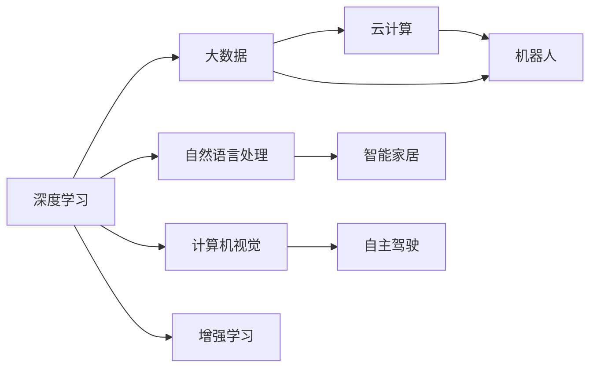
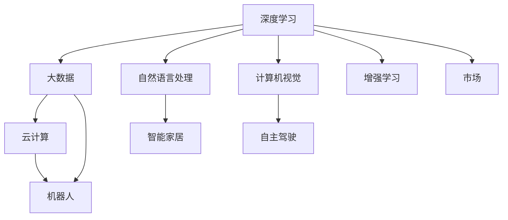
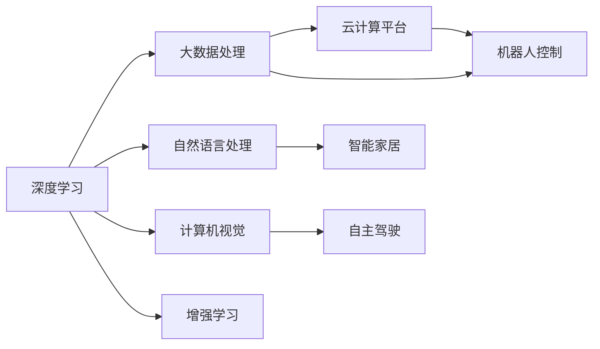

                 

# 李开复：AI 2.0 时代的市场

## 1. 背景介绍

### 1.1 问题由来
当前，人工智能（AI）正处于一个令人振奋的转折点，我们正从AI 1.0 时代迈向AI 2.0 时代。AI 1.0 主要是指基于规则的专家系统，它们依赖于人类专家编写的规则和知识库来进行决策。然而，随着深度学习和机器学习的兴起，AI 2.0 时代的到来已经不可阻挡。AI 2.0 时代，我们不再依赖手工编写的规则和知识库，而是通过大规模数据训练模型，使其能够自动学习并适应新的环境和任务。

在这一过程中，市场的需求和应用场景也在发生变化。传统的人工智能市场正在逐渐萎缩，而新兴的人工智能市场，特别是与AI 2.0相关的市场，正迅速崛起。了解和把握这一趋势，对于企业家、开发者和投资者来说至关重要。

### 1.2 问题核心关键点
AI 2.0 时代的市场主要关注以下几个关键点：
- **深度学习与神经网络**：AI 2.0 的核心技术，包括卷积神经网络（CNN）、循环神经网络（RNN）、长短时记忆网络（LSTM）等。
- **大数据与云计算**：数据存储与处理、云平台、数据中心等基础设施的建设。
- **自然语言处理**：语音识别、文本分析、语义理解等技术。
- **计算机视觉**：图像识别、物体检测、视频分析等。
- **增强学习**：通过奖励与惩罚机制，使机器能够在特定环境中学习最优策略。
- **机器人**：包括工业机器人、服务机器人、家庭机器人等。
- **自主驾驶**：自动驾驶汽车、无人驾驶飞机等。
- **智能家居**：智能音箱、智能照明、智能家电等。

这些技术的应用，正在改变我们生活的方方面面，从医疗、教育到金融、零售，AI 2.0 正在逐步渗透到各个行业。了解这些市场趋势，对于开发者、创业者和投资者来说，具有重要意义。

### 1.3 问题研究意义
研究AI 2.0 时代的市场，对于推动AI技术的发展与应用，具有深远的意义：
- **创新驱动**：AI 2.0 时代需要大量的创新，推动技术进步和应用拓展。
- **产业升级**：AI技术的应用，能够提升各行各业的效率和竞争力。
- **社会变革**：AI 2.0 技术的应用，将改变人类社会的生活方式和生产方式。
- **经济增长**：AI 2.0 市场正成为新的经济增长点。
- **人才需求**：AI 2.0 的发展，需要大量的AI人才。
- **伦理考量**：AI 2.0 技术的应用，带来诸多伦理和法律问题，需要综合考虑。

## 2. 核心概念与联系

### 2.1 核心概念概述

AI 2.0 时代的市场涵盖了多个核心概念，这些概念之间相互关联，共同构成了AI 2.0 市场的生态系统。以下是几个关键概念及其相互联系：

1. **深度学习**：基于神经网络的机器学习技术，通过大量数据训练模型，使其能够自动学习并提取特征。深度学习是AI 2.0 时代的核心技术。
2. **大数据**：大规模数据集，包括结构化和非结构化数据，是训练深度学习模型的基础。
3. **云计算**：提供大规模计算资源和存储资源的平台，支持深度学习模型的训练和部署。
4. **自然语言处理**：使计算机能够理解和处理人类语言，包括语音识别、文本分析、语义理解等。
5. **计算机视觉**：使计算机能够识别和理解图像和视频内容，包括图像识别、物体检测、视频分析等。
6. **增强学习**：通过奖励与惩罚机制，使机器能够在特定环境中学习最优策略。
7. **机器人**：自动化执行任务的机器人，包括工业机器人、服务机器人、家庭机器人等。
8. **自主驾驶**：无需人类干预的驾驶技术，包括自动驾驶汽车、无人驾驶飞机等。
9. **智能家居**：通过AI技术，实现家居设备的自动化和智能化。

这些核心概念之间相互关联，共同构成了AI 2.0 市场的生态系统。以下是一个Mermaid流程图，展示了这些概念之间的联系：

### 2.2 概念间的关系

AI 2.0 市场的核心概念之间存在着紧密的联系，形成了完整的AI 2.0 生态系统。以下是几个核心概念之间的关系：

#### 2.2.1 深度学习与大数据
深度学习依赖于大数据的训练，通过大规模数据集来训练模型，使其能够自动学习并提取特征。大数据是深度学习的基石。

#### 2.2.2 深度学习与云计算
深度学习模型的训练和部署需要大量的计算资源和存储空间，云计算提供了大规模的计算资源和存储资源，支持深度学习模型的训练和部署。

#### 2.2.3 深度学习与自然语言处理
深度学习可以用于自然语言处理，包括语音识别、文本分析、语义理解等。自然语言处理是深度学习的一个重要应用领域。

#### 2.2.4 深度学习与计算机视觉
深度学习可以用于计算机视觉，包括图像识别、物体检测、视频分析等。计算机视觉是深度学习的一个重要应用领域。

#### 2.2.5 深度学习与增强学习
深度学习可以用于增强学习，使机器能够在特定环境中学习最优策略。增强学习是深度学习的一个重要应用领域。

#### 2.2.6 深度学习与机器人
深度学习可以用于机器人的控制和决策，使机器人能够执行复杂的任务。机器人是深度学习的一个重要应用领域。

#### 2.2.7 深度学习与自主驾驶
深度学习可以用于自主驾驶，使车辆能够自动驾驶。自主驾驶是深度学习的一个重要应用领域。

#### 2.2.8 深度学习与智能家居
深度学习可以用于智能家居设备的控制和决策，使家居设备能够智能化。智能家居是深度学习的一个重要应用领域。

### 2.3 核心概念的整体架构

最终，我们将所有核心概念组合成一个完整的架构，如下：

这个架构展示了深度学习如何与大数据、云计算、自然语言处理、计算机视觉、增强学习、机器人、自主驾驶、智能家居等多个领域相结合，最终形成AI 2.0 市场的完整生态系统。

## 3. 核心算法原理 & 具体操作步骤

### 3.1 算法原理概述

AI 2.0 时代的市场主要涉及以下几个核心算法：

1. **深度学习算法**：基于神经网络的机器学习技术，通过大量数据训练模型，使其能够自动学习并提取特征。
2. **大数据处理算法**：用于大规模数据的存储、处理和分析。
3. **云计算平台算法**：用于大规模计算资源和存储资源的调度和管理。
4. **自然语言处理算法**：包括语音识别、文本分析、语义理解等。
5. **计算机视觉算法**：包括图像识别、物体检测、视频分析等。
6. **增强学习算法**：通过奖励与惩罚机制，使机器能够在特定环境中学习最优策略。
7. **机器人控制算法**：用于机器人的决策和控制。
8. **自主驾驶算法**：用于自主驾驶汽车的决策和控制。
9. **智能家居算法**：用于智能家居设备的控制和决策。

这些算法通过深度学习框架和机器学习库，如TensorFlow、PyTorch、Keras等，得以实现。以下是一个简化的流程图，展示了这些算法之间的关系：

### 3.2 算法步骤详解

AI 2.0 时代的市场涉及多个算法步骤，以下是详细的算法步骤：

#### 3.2.1 数据收集与预处理
1. **数据收集**：从不同的来源收集数据，包括社交媒体、传感器、摄像头等。
2. **数据清洗**：去除噪声和异常值，确保数据质量。
3. **数据标注**：为数据打上标签，使其可用于训练和测试。

#### 3.2.2 模型训练
1. **选择模型**：根据任务选择合适的深度学习模型，如CNN、RNN、LSTM等。
2. **设计损失函数**：根据任务设计合适的损失函数，如交叉熵、均方误差等。
3. **优化算法**：选择合适的优化算法，如SGD、Adam等。
4. **训练模型**：使用大规模数据集训练模型，使其能够自动学习并提取特征。

#### 3.2.3 模型评估与优化
1. **模型评估**：使用测试集评估模型性能，使用各种指标如准确率、召回率、F1分数等。
2. **超参数调优**：通过调整模型超参数（如学习率、批大小、迭代次数等），优化模型性能。
3. **模型集成**：将多个模型集成，提高模型鲁棒性和泛化能力。

#### 3.2.4 模型部署与应用
1. **模型导出**：将训练好的模型导出为可执行文件或服务接口。
2. **模型部署**：将模型部署到服务器或云端，提供服务接口。
3. **应用场景**：将模型应用于实际应用场景，如智能客服、医疗诊断、金融分析等。

### 3.3 算法优缺点

AI 2.0 时代的市场涉及多个算法，以下是这些算法的优缺点：

#### 3.3.1 深度学习算法的优缺点
**优点**：
- **自动提取特征**：无需手工设计特征，能够自动学习数据中的特征。
- **高性能**：在许多任务上取得了比传统算法更高的性能。
- **可扩展性**：能够轻松扩展到更复杂的网络结构。

**缺点**：
- **数据依赖**：需要大量的标注数据进行训练，数据获取成本高。
- **过拟合风险**：在大规模数据集上训练的模型，可能对数据分布的变化敏感。
- **计算资源消耗大**：需要大量的计算资源和存储空间，训练成本高。

#### 3.3.2 大数据处理算法的优缺点
**优点**：
- **处理大规模数据**：能够处理大规模数据集。
- **实时性**：能够实时处理数据。

**缺点**：
- **复杂性**：处理大规模数据需要复杂的算法和系统架构。
- **存储成本高**：需要大量的存储空间存储数据。

#### 3.3.3 云计算平台算法的优缺点
**优点**：
- **资源丰富**：提供了大规模的计算资源和存储资源。
- **弹性伸缩**：能够根据需求弹性伸缩资源。

**缺点**：
- **成本高**：大规模计算资源和存储资源的成本较高。
- **隐私与安全**：需要考虑数据隐私和安全问题。

#### 3.3.4 自然语言处理算法的优缺点
**优点**：
- **语言理解**：能够理解自然语言，处理文本数据。
- **多语言支持**：支持多种语言的处理。

**缺点**：
- **语言差异**：不同语言之间的处理难度较大。
- **歧义问题**：自然语言中的歧义问题较难解决。

#### 3.3.5 计算机视觉算法的优缺点
**优点**：
- **图像识别**：能够识别图像和视频内容。
- **自动化**：能够自动进行图像和视频分析。

**缺点**：
- **数据依赖**：需要大量的标注数据进行训练，数据获取成本高。
- **计算复杂度**：处理大规模图像和视频数据需要高计算复杂度。

#### 3.3.6 增强学习算法的优缺点
**优点**：
- **自适应**：能够适应不断变化的环境。
- **自主决策**：能够自主做出决策。

**缺点**：
- **训练成本高**：需要大量的数据和计算资源进行训练。
- **策略学习难度大**：找到最优策略难度较大。

#### 3.3.7 机器人控制算法的优缺点
**优点**：
- **自主执行任务**：能够自主执行复杂的任务。
- **高效率**：能够高效地执行重复性任务。

**缺点**：
- **环境复杂性**：环境复杂性较高，需要复杂的算法进行决策。
- **成本高**：需要大量的硬件资源进行部署。

#### 3.3.8 自主驾驶算法的优缺点
**优点**：
- **高安全性**：能够在复杂环境中安全驾驶。
- **高效性**：能够高效地完成驾驶任务。

**缺点**：
- **技术难度大**：技术难度较大，需要大量的数据和计算资源进行训练。
- **安全性问题**：需要严格的安全性验证和测试。

#### 3.3.9 智能家居算法的优缺点
**优点**：
- **智能化**：能够实现家居设备的智能化。
- **便利性**：能够提高生活的便利性。

**缺点**：
- **技术复杂性**：需要复杂的算法进行控制和决策。
- **隐私问题**：需要考虑用户隐私问题。

### 3.4 算法应用领域

AI 2.0 时代的市场涵盖了多个应用领域，以下是几个主要的应用领域：

#### 3.4.1 医疗
AI 2.0 技术在医疗领域的应用非常广泛，包括医学影像分析、疾病诊断、药物研发等。通过深度学习算法和大数据处理算法，AI 2.0 技术能够帮助医生进行快速、准确的诊断和治疗，提高医疗效率。

#### 3.4.2 金融
AI 2.0 技术在金融领域的应用包括风险管理、交易分析、客户服务等。通过深度学习算法和增强学习算法，AI 2.0 技术能够帮助金融机构进行风险控制、交易策略优化和客户服务自动化。

#### 3.4.3 零售
AI 2.0 技术在零售领域的应用包括商品推荐、库存管理、客户服务等。通过深度学习算法和计算机视觉算法，AI 2.0 技术能够帮助零售商进行商品推荐、库存管理和客户服务自动化，提高客户满意度和销售额。

#### 3.4.4 制造业
AI 2.0 技术在制造业的应用包括智能制造、供应链管理、质量控制等。通过深度学习算法和机器人控制算法，AI 2.0 技术能够帮助制造业进行智能制造、供应链管理和质量控制，提高生产效率和产品质量。

#### 3.4.5 自动驾驶
AI 2.0 技术在自动驾驶领域的应用包括自动驾驶汽车、无人驾驶飞机等。通过深度学习算法和增强学习算法，AI 2.0 技术能够帮助实现自动驾驶，提高交通安全性、效率和便利性。

#### 3.4.6 教育
AI 2.0 技术在教育领域的应用包括智能教育、学习分析等。通过深度学习算法和自然语言处理算法，AI 2.0 技术能够帮助教育机构进行智能教育、学习分析和教学优化，提高教育质量和效率。

#### 3.4.7 安防
AI 2.0 技术在安防领域的应用包括视频监控、入侵检测等。通过深度学习算法和计算机视觉算法，AI 2.0 技术能够帮助实现视频监控、入侵检测等，提高安防系统的准确性和效率。

#### 3.4.8 游戏
AI 2.0 技术在游戏领域的应用包括游戏设计、游戏测试等。通过深度学习算法和增强学习算法，AI 2.0 技术能够帮助游戏公司进行游戏设计、游戏测试和智能游戏对战等，提高游戏体验和互动性。

#### 3.4.9 农业
AI 2.0 技术在农业领域的应用包括智能农机、农业决策等。通过深度学习算法和机器人控制算法，AI 2.0 技术能够帮助农业公司进行智能农机、农业决策等，提高农业生产效率和产量。

## 4. 数学模型和公式 & 详细讲解

### 4.1 数学模型构建

AI 2.0 时代的市场涉及多个数学模型，以下是几个关键数学模型的构建：

#### 4.1.1 深度学习模型
深度学习模型的构建主要包括以下几个步骤：

1. **输入层**：接收输入数据，如图像、文本、音频等。
2. **隐藏层**：通过神经网络进行特征提取和表示。
3. **输出层**：输出预测结果，如分类、回归、生成等。

深度学习模型的数学表示如下：

$$
\mathcal{L}(y,\hat{y})=\frac{1}{m}\sum_{i=1}^{m}\ell(y^{(i)},\hat{y}^{(i)})
$$

其中，$\mathcal{L}$ 为损失函数，$y$ 为真实标签，$\hat{y}$ 为模型预测结果，$\ell$ 为损失函数，$m$ 为样本数。

#### 4.1.2 大数据处理模型
大数据处理模型的构建主要包括以下几个步骤：

1. **数据收集**：从不同的来源收集数据，包括社交媒体、传感器、摄像头等。
2. **数据清洗**：去除噪声和异常值，确保数据质量。
3. **数据存储**：将数据存储在云平台或本地存储设备中。
4. **数据分析**：对数据进行分析，提取有用信息。

大数据处理模型的数学表示如下：

$$
\mathcal{L}(x,y)=\sum_{i=1}^{n}l(x^{(i)},y^{(i)})
$$

其中，$\mathcal{L}$ 为损失函数，$x$ 为数据集，$y$ 为标注数据，$l$ 为损失函数，$n$ 为数据集大小。

#### 4.1.3 云计算平台模型
云计算平台模型的构建主要包括以下几个步骤：

1. **资源调度**：根据需求调度计算资源和存储资源。
2. **任务执行**：执行计算任务，处理数据和模型。
3. **结果存储**：将结果存储在云平台或本地存储设备中。

云计算平台模型的数学表示如下：

$$
\mathcal{L}(x,y)=\sum_{i=1}^{n}l(x^{(i)},y^{(i)})
$$

其中，$\mathcal{L}$ 为损失函数，$x$ 为计算资源和存储资源，$y$ 为任务执行结果，$l$ 为损失函数，$n$ 为任务数量。

#### 4.1.4 自然语言处理模型
自然语言处理模型的构建主要包括以下几个步骤：

1. **文本预处理**：对文本进行分词、去除停用词、词性标注等预处理。
2. **特征提取**：提取文本特征，如词袋模型、TF-IDF等。
3. **模型训练**：使用深度学习模型进行训练，如RNN、LSTM等。
4. **模型评估**：使用测试集评估模型性能，使用各种指标如准确率、召回率、F1分数等。

自然语言处理模型的数学表示如下：

$$
\mathcal{L}(x,y)=\sum_{i=1}^{n}l(x^{(i)},y^{(i)})
$$

其中，$\mathcal{L}$ 为损失函数，$x$ 为文本数据，$y$ 为标注数据，$l$ 为损失函数，$n$ 为文本数量。

#### 4.1.5 计算机视觉模型
计算机视觉模型的构建主要包括以下几个步骤：

1. **图像预处理**：对图像进行裁剪、旋转、归一化等预处理。
2. **特征提取**：提取图像特征，如卷积神经网络（CNN）。
3. **模型训练**：使用深度学习模型进行训练，如CNN、RNN等。
4. **模型评估**：使用测试集评估模型性能，使用各种指标如准确率、召回率、F1分数等。

计算机视觉模型的数学表示如下：

$$
\mathcal{L}(x,y)=\sum_{i=1}^{n}l(x^{(i)},y^{(i)})
$$

其中，$\mathcal{L}$ 为损失函数，$x$ 为图像数据，$y$ 为标注数据，$l$ 为损失函数，$n$ 为图像数量。

#### 4.1.6 增强学习模型
增强学习模型的构建主要包括以下几个步骤：

1. **状态空间**：定义状态空间，如环境状态、位置等。
2. **动作空间**：定义动作空间，如左、右、上、下等。
3. **奖励函数**：定义奖励函数，如正向奖励、负向奖励等。
4. **模型训练**：使用增强学习算法进行训练，如Q-learning、SARSA等。
5. **模型评估**：使用测试集评估模型性能，使用各种指标如平均奖励等。

增强学习模型的数学表示如下：

$$
\mathcal{L}(x,y)=\sum_{i=1}^{n}l(x^{(i)},y^{(i)})
$$

其中，$\mathcal{L}$ 为损失函数，$x$ 为状态空间，$y$ 为动作空间，$l$ 为损失函数，$n$ 为状态动作数量。

#### 4.1.7 机器人控制模型
机器人控制模型的构建主要包括以下几个步骤：

1. **状态空间**：定义状态空间，如机器人位置、速度等。
2. **动作空间**：定义动作空间，如机器人方向、速度等。
3. **控制算法**：定义控制算法，如PID控制、模糊控制等。
4. **模型训练**：使用深度学习模型进行训练，如CNN、RNN等。
5. **模型评估**：使用测试集评估模型性能，使用各种指标如位置误差、速度误差等。

机器人控制模型的数学表示如下：

$$
\mathcal{L}(x,y)=\sum_{i=1}^{n}l(x^{(i)},y^{(i)})
$$

其中，$\mathcal{L}$ 为损失函数，$x$ 为状态空间，$y$ 为动作空间，$l$ 为损失函数，$n$ 为状态动作数量。

#### 4.1.8 自主驾驶模型
自主驾驶模型的构建主要包括以下几个步骤：

1. **状态空间**：定义状态空间，如车速、方向等。
2. **动作空间**：定义动作空间，如加速、刹车等。
3. **决策算法**：定义决策算法，如Q-learning、SARSA等。
4. **模型训练**：使用深度学习模型进行训练，如CNN、RNN等。
5. **模型评估**：使用测试集评估模型性能，使用各种指标如碰撞率等。

自主驾驶模型的数学表示如下：

$$
\mathcal{L}(x,y)=\sum_{i=1}^{n}l(x^{(i)},y^{(i)})
$$

其中，$\mathcal{L}$ 为损失函数，$x$ 为状态空间，$y$ 为动作空间，$l$ 为损失函数，$n$ 为状态动作数量。

#### 4.1.9 智能家居模型
智能家居模型的构建主要包括以下几个步骤：

1. **设备状态**：定义设备状态，如温度、湿度等。
2. **控制算法**：定义控制算法，如PID控制、模糊控制等。
3. **模型训练**：使用深度学习模型进行训练，如CNN、RNN等。
4. **模型评估**：使用测试集评估模型性能，使用各种指标如误差等。

智能家居模型的数学表示如下：

$$
\mathcal{L}(x,y)=\sum_{i=1}^{n}l(x^{(i)},y^{(i)})
$$

其中，$\mathcal{L}$ 为损失函数，$x$ 为设备状态，$y$ 为控制策略，$l$ 为损失函数，$n$ 为设备状态数量。

### 4.2 公式推导过程

以下是几个关键数学模型的公式推导过程：

#### 4.2.1 深度学习模型
深度学习模型的公式推导过程如下：

$$
\begin{aligned}
\mathcal{L}(y,\hat{y}) &= \frac{1}{m}\sum_{i=1}^{m}\ell(y^{(i)},\hat{y}^{(i)}) \\
&= \frac{1}{m}\sum_{i=1}^{m}[y^{(i)}\log\hat{y}^{(i)} + (1-y^{(i)})\log(1-\hat{y}^{(i)})]
\end{aligned}
$$

其中，$\mathcal{L}$ 为损失函数，$y$ 为真实标签，$\hat{y}$ 为模型预测结果，$\ell$ 为损失函数，$m$ 为样本数。

#### 4.2.2 大数据处理模型
大数据处理模型的公式推导过程如下：

$$
\begin{aligned}
\mathcal{L}(x,y) &= \sum_{i=1}^{n}l

