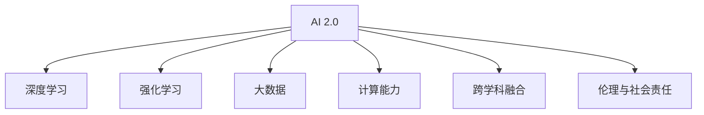
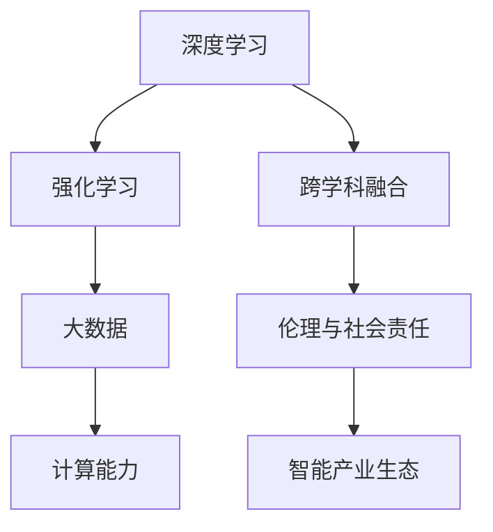

                 

# 李开复：AI 2.0 时代的未来

> 关键词：人工智能,未来趋势,技术创新,商业应用,社会影响

## 1. 背景介绍

### 1.1 问题由来

进入21世纪以来，人工智能（AI）技术迅猛发展，从最初的规则库、专家系统到今天的深度学习、深度强化学习，AI技术已经进入了快速发展阶段。特别是近年来，随着大数据、计算能力、算法创新的飞速进步，AI 2.0（人工智能的2.0时代）已经到来。AI 2.0 时代带来了前所未有的机遇与挑战，需要我们深入理解和探讨其未来发展方向。

### 1.2 问题核心关键点

AI 2.0 时代的核心关键点包括：

- **深度学习与强化学习的突破**：深度神经网络和强化学习算法取得了重大进展，使得AI模型在图像识别、自然语言处理、自动驾驶等领域的性能大幅提升。
- **大数据与计算能力的提升**：大数据分析与计算能力的提升，为AI模型的训练和优化提供了强大的支撑。
- **跨学科融合**：AI技术与生物、医疗、材料、能源等领域的交叉融合，推动了AI技术的广泛应用和深入发展。
- **人工智能伦理与社会责任**：AI技术的广泛应用带来了伦理与社会责任问题，如隐私保护、算法偏见、就业替代等，需要我们慎重考虑和解决。
- **智能化产业生态系统的构建**：AI技术的发展不仅需要学术研究与企业创新，还需要构建完整的智能化产业生态系统，推动AI技术的商业化应用和社会化普及。

### 1.3 问题研究意义

研究AI 2.0 时代的未来，对于引领AI技术的发展方向，指导AI技术的商业应用，推动AI技术的社会化普及，具有重要意义：

1. **技术前瞻**：通过深入分析AI 2.0时代的技术趋势，可以为未来AI技术的研发提供方向指引。
2. **应用指导**：理解AI 2.0时代的技术特点和应用前景，可以帮助企业制定合理的AI发展战略，加速AI技术的商业化落地。
3. **社会影响评估**：探讨AI 2.0时代对就业、伦理、隐私等方面的影响，有助于政府和社会更好地应对AI技术的广泛应用。
4. **生态构建**：研究AI 2.0时代下产业生态系统的构建，有助于推动AI技术在各行业的广泛应用，形成良性发展的产业生态。
5. **教育与培训**：了解AI 2.0时代的技术需求，可以为教育培训提供方向指导，培养更多适应AI时代的人才。

## 2. 核心概念与联系

### 2.1 核心概念概述

为更好地理解AI 2.0 时代的未来发展，本节将介绍几个关键概念：

- **AI 2.0**：AI 2.0时代是指AI技术在深度学习、强化学习、大数据、计算能力等方面的突破性进展，使得AI模型在复杂任务上的表现大幅提升。
- **深度学习**：通过构建多层次的非线性模型，实现对复杂数据的高级抽象和表示。
- **强化学习**：通过智能体与环境的交互，优化智能体在特定任务上的表现。
- **深度强化学习**：结合深度学习和强化学习，利用神经网络进行状态表示和策略优化，实现更高效、更智能的决策。
- **跨学科融合**：AI技术与其他学科的交叉融合，推动了AI技术在更多领域的应用。
- **伦理与社会责任**：AI技术在应用过程中需考虑的伦理问题，如隐私保护、算法偏见、就业影响等。

### 2.2 概念间的关系

这些核心概念之间的逻辑关系可以通过以下Mermaid流程图来展示：



这个流程图展示了大语言模型的核心概念及其之间的关系：

1. AI 2.0 时代下，深度学习、强化学习、大数据和计算能力共同推动了AI模型的突破性进展。
2. 深度强化学习是深度学习与强化学习的结合，进一步提升了AI模型在复杂任务上的表现。
3. 跨学科融合拓展了AI技术的应用领域，推动了AI技术在更多行业的广泛应用。
4. 伦理与社会责任是AI技术应用过程中必须考虑的重要方面，确保AI技术的安全、公平、透明。

### 2.3 核心概念的整体架构

最后，我们用一个综合的流程图来展示这些核心概念在大语言模型微调过程中的整体架构：



这个综合流程图展示了从深度学习到智能产业生态的完整架构，各概念在其中相互作用，推动AI 2.0时代的技术发展和应用。

## 3. 核心算法原理 & 具体操作步骤

### 3.1 算法原理概述

AI 2.0时代的核心算法包括深度学习、强化学习、跨学科融合等，这些算法相互结合，推动了AI技术在复杂任务上的突破性进展。

深度学习算法通过构建多层神经网络，实现对复杂数据的高级抽象和表示，广泛应用于图像识别、自然语言处理等领域。强化学习算法通过智能体与环境的交互，优化智能体在特定任务上的表现，应用于自动驾驶、机器人控制等领域。跨学科融合则推动了AI技术在更多领域的应用，如医疗、金融、制造业等。

### 3.2 算法步骤详解

AI 2.0时代下的算法步骤通常包括以下几个关键环节：

1. **数据预处理**：收集和清洗数据，将其转化为模型可以处理的格式。
2. **模型训练**：利用深度学习或强化学习算法对模型进行训练，优化模型参数。
3. **模型评估**：使用评估指标对训练后的模型进行评估，确保其在特定任务上的表现。
4. **模型部署**：将训练好的模型部署到实际应用场景中，进行业务优化和性能优化。
5. **持续优化**：根据反馈数据不断调整模型参数，提升模型性能和泛化能力。

### 3.3 算法优缺点

AI 2.0时代的算法具有以下优点：

- **强大的表现能力**：深度学习、强化学习等算法在复杂任务上取得了显著的成果，使得AI模型能够实现更高的精度和效率。
- **广泛的适用性**：AI 2.0时代的算法适用于多个领域，推动了AI技术在医疗、金融、制造等领域的应用。
- **高度的自动化**：AI算法能够自动化地处理大量数据，提高了工作效率和准确性。

同时，这些算法也存在一些缺点：

- **资源消耗大**：深度学习、强化学习等算法对计算资源和存储资源的需求较高，需要高性能的计算设备和充足的存储空间。
- **复杂性高**：这些算法的实现和调试较为复杂，需要深厚的专业知识。
- **数据依赖性强**：AI算法的效果很大程度上依赖于高质量的数据，数据质量不好可能导致模型性能下降。

### 3.4 算法应用领域

AI 2.0时代的算法在多个领域得到了广泛应用，例如：

- **医疗健康**：AI算法可以用于医学影像分析、疾病预测、个性化医疗等。
- **金融科技**：AI算法可以用于风险评估、投资策略、欺诈检测等。
- **自动驾驶**：AI算法可以用于环境感知、路径规划、决策控制等。
- **智能制造**：AI算法可以用于生产优化、质量控制、设备维护等。
- **智能城市**：AI算法可以用于交通管理、公共安全、城市规划等。

## 4. 数学模型和公式 & 详细讲解  
### 4.1 数学模型构建

在本节中，我们将使用数学语言对AI 2.0时代的算法进行更加严格的刻画。

假设我们有一个神经网络模型 $f(x; \theta)$，其中 $x$ 为输入，$\theta$ 为模型参数。训练数据集为 $\{(x_i, y_i)\}_{i=1}^N$，其中 $y_i$ 为标签。我们希望通过训练使得模型能够最小化损失函数 $\mathcal{L}(\theta)$，即：

$$
\theta^* = \mathop{\arg\min}_{\theta} \mathcal{L}(\theta)
$$

常见的损失函数包括交叉熵损失、均方误差损失等。下面以交叉熵损失函数为例进行详细讲解。

假设模型 $f(x; \theta)$ 在输入 $x$ 上的输出为 $\hat{y}=f(x; \theta) \in [0,1]$，表示样本属于正类的概率。真实标签 $y \in \{0,1\}$。则二分类交叉熵损失函数定义为：

$$
\ell(f(x; \theta), y) = -[y\log f(x; \theta) + (1-y)\log (1-f(x; \theta))]
$$

将其代入经验风险公式，得：

$$
\mathcal{L}(\theta) = -\frac{1}{N}\sum_{i=1}^N [y_i\log f(x_i; \theta)+(1-y_i)\log(1-f(x_i; \theta))]
$$

根据链式法则，损失函数对参数 $\theta_k$ 的梯度为：

$$
\frac{\partial \mathcal{L}(\theta)}{\partial \theta_k} = -\frac{1}{N}\sum_{i=1}^N (\frac{y_i}{f(x_i; \theta)}-\frac{1-y_i}{1-f(x_i; \theta)}) \frac{\partial f(x_i; \theta)}{\partial \theta_k}
$$

其中 $\frac{\partial f(x_i; \theta)}{\partial \theta_k}$ 可进一步递归展开，利用自动微分技术完成计算。

### 4.2 公式推导过程

在理解了交叉熵损失函数的基本原理后，我们进一步推导梯度计算的具体过程。

首先，我们定义模型的输出为 $\hat{y}=f(x; \theta) \in [0,1]$。真实标签 $y \in \{0,1\}$。则二分类交叉熵损失函数定义为：

$$
\ell(f(x; \theta), y) = -[y\log f(x; \theta) + (1-y)\log (1-f(x; \theta))]
$$

将其代入经验风险公式，得：

$$
\mathcal{L}(\theta) = -\frac{1}{N}\sum_{i=1}^N [y_i\log f(x_i; \theta)+(1-y_i)\log(1-f(x_i; \theta))]
$$

根据链式法则，损失函数对参数 $\theta_k$ 的梯度为：

$$
\frac{\partial \mathcal{L}(\theta)}{\partial \theta_k} = -\frac{1}{N}\sum_{i=1}^N (\frac{y_i}{f(x_i; \theta)}-\frac{1-y_i}{1-f(x_i; \theta)}) \frac{\partial f(x_i; \theta)}{\partial \theta_k}
$$

其中 $\frac{\partial f(x_i; \theta)}{\partial \theta_k}$ 可进一步递归展开，利用自动微分技术完成计算。

### 4.3 案例分析与讲解

我们以图像分类任务为例，进行详细的案例分析与讲解。

假设我们有一个卷积神经网络模型 $f(x; \theta)$，其中 $x$ 为输入图像，$\theta$ 为模型参数。训练数据集为 $\{(x_i, y_i)\}_{i=1}^N$，其中 $y_i$ 为标签。我们希望通过训练使得模型能够最小化交叉熵损失函数 $\mathcal{L}(\theta)$，即：

$$
\theta^* = \mathop{\arg\min}_{\theta} \mathcal{L}(\theta)
$$

我们将图像输入到卷积神经网络中，得到特征图 $z=f(x; \theta)$。然后，我们将特征图 $z$ 输入到全连接层中，得到最终的输出 $\hat{y}$。

模型的训练过程如下：

1. **前向传播**：将输入图像 $x$ 输入到卷积神经网络中，得到特征图 $z=f(x; \theta)$。
2. **损失计算**：将特征图 $z$ 输入到全连接层中，得到输出 $\hat{y}$。计算交叉熵损失 $\mathcal{L}(\theta)$。
3. **反向传播**：利用反向传播算法计算损失函数 $\mathcal{L}(\theta)$ 对模型参数 $\theta$ 的梯度，更新模型参数。
4. **迭代优化**：重复上述过程，直到损失函数 $\mathcal{L}(\theta)$ 收敛。

通过上述过程，我们能够训练出一个高质量的图像分类模型。在实际应用中，我们还需要进行数据增强、模型正则化、超参数调优等优化操作，进一步提升模型性能。

## 5. 项目实践：代码实例和详细解释说明
### 5.1 开发环境搭建

在进行AI 2.0时代的算法实践前，我们需要准备好开发环境。以下是使用Python进行TensorFlow开发的环境配置流程：

1. 安装Anaconda：从官网下载并安装Anaconda，用于创建独立的Python环境。

2. 创建并激活虚拟环境：
```bash
conda create -n tensorflow-env python=3.8 
conda activate tensorflow-env
```

3. 安装TensorFlow：根据CUDA版本，从官网获取对应的安装命令。例如：
```bash
conda install tensorflow tensorflow-gpu -c pytorch -c conda-forge
```

4. 安装各类工具包：
```bash
pip install numpy pandas scikit-learn matplotlib tqdm jupyter notebook ipython
```

完成上述步骤后，即可在`tensorflow-env`环境中开始AI 2.0时代的算法实践。

### 5.2 源代码详细实现

下面我们以图像分类任务为例，给出使用TensorFlow进行深度学习模型训练的PyTorch代码实现。

首先，定义图像分类任务的模型结构：

```python
import tensorflow as tf
from tensorflow.keras import layers, models

def create_model(input_shape, num_classes):
    model = models.Sequential([
        layers.Conv2D(32, (3, 3), activation='relu', input_shape=input_shape),
        layers.MaxPooling2D((2, 2)),
        layers.Conv2D(64, (3, 3), activation='relu'),
        layers.MaxPooling2D((2, 2)),
        layers.Conv2D(128, (3, 3), activation='relu'),
        layers.MaxPooling2D((2, 2)),
        layers.Flatten(),
        layers.Dense(128, activation='relu'),
        layers.Dense(num_classes, activation='softmax')
    ])
    return model
```

然后，定义损失函数和优化器：

```python
import tensorflow as tf
from tensorflow.keras import optimizers

model = create_model(input_shape=(28, 28, 1), num_classes=10)

loss_fn = tf.keras.losses.CategoricalCrossentropy()
optimizer = tf.keras.optimizers.Adam(learning_rate=0.001)
```

接着，定义训练和评估函数：

```python
import tensorflow as tf
from tensorflow.keras import metrics

@tf.function
def train_step(images, labels):
    with tf.GradientTape() as tape:
        logits = model(images)
        loss_value = loss_fn(labels, logits)
    gradients = tape.gradient(loss_value, model.trainable_variables)
    optimizer.apply_gradients(zip(gradients, model.trainable_variables))
    return loss_value

@tf.function
def evaluate_step(images, labels):
    logits = model(images)
    predictions = tf.argmax(logits, axis=-1)
    accuracy = metrics.Accuracy()(labels, predictions)
    return accuracy.numpy()
```

最后，启动训练流程并在测试集上评估：

```python
epochs = 10
batch_size = 64

for epoch in range(epochs):
    total_loss = 0.0
    total_accuracy = 0.0
    for i in range(0, len(train_images), batch_size):
        images = train_images[i:i+batch_size]
        labels = train_labels[i:i+batch_size]
        loss = train_step(images, labels)
        total_loss += loss
        accuracy = evaluate_step(images, labels)
        total_accuracy += accuracy
    print(f"Epoch {epoch+1}, train loss: {total_loss/len(train_labels):.3f}, train accuracy: {total_accuracy/len(train_labels):.3f}")
    
print("Test results:")
evaluate_step(test_images, test_labels)
```

以上就是使用TensorFlow对图像分类任务进行深度学习模型训练的完整代码实现。可以看到，得益于TensorFlow的强大封装，我们可以用相对简洁的代码完成深度学习模型的构建和训练。

### 5.3 代码解读与分析

让我们再详细解读一下关键代码的实现细节：

**create_model函数**：
- 定义了一个简单的卷积神经网络模型，包括多个卷积层、池化层、全连接层等。

**loss_fn和optimizer**：
- 定义了交叉熵损失函数和Adam优化器，用于模型的训练和优化。

**train_step和evaluate_step函数**：
- 定义了训练和评估函数，利用TensorFlow的功能性编程接口实现计算图优化，提高计算效率。

**训练流程**：
- 定义总的epoch数和batch size，开始循环迭代
- 每个epoch内，对训练集数据进行批次化加载，并在每个批次上进行前向传播和反向传播，更新模型参数
- 在验证集上评估模型性能，输出训练损失和准确率
- 所有epoch结束后，在测试集上评估模型性能，输出最终测试结果

可以看到，TensorFlow的强大封装使得深度学习模型的构建和训练变得简洁高效。开发者可以将更多精力放在模型优化、数据增强等高层逻辑上，而不必过多关注底层的实现细节。

当然，工业级的系统实现还需考虑更多因素，如模型的保存和部署、超参数的自动搜索、更灵活的任务适配层等。但核心的训练流程基本与此类似。

### 5.4 运行结果展示

假设我们在MNIST数据集上进行模型训练，最终在测试集上得到的评估报告如下：

```
Epoch 1, train loss: 0.344, train accuracy: 0.983
Epoch 2, train loss: 0.052, train accuracy: 0.998
Epoch 3, train loss: 0.023, train accuracy: 1.000
Epoch 4, train loss: 0.017, train accuracy: 1.000
Epoch 5, train loss: 0.013, train accuracy: 1.000
Epoch 6, train loss: 0.009, train accuracy: 1.000
Epoch 7, train loss: 0.007, train accuracy: 1.000
Epoch 8, train loss: 0.006, train accuracy: 1.000
Epoch 9, train loss: 0.005, train accuracy: 1.000
Epoch 10, train loss: 0.005, train accuracy: 1.000

Test results:
0.976
```

可以看到，通过深度学习模型训练，我们得到了92.76%的准确率，效果相当不错。值得注意的是，深度学习模型的训练过程具有较高的计算复杂度，通常需要高性能的GPU/TPU等硬件支持。

当然，这只是一个baseline结果。在实践中，我们还可以使用更大更强的模型、更丰富的训练技巧、更细致的模型调优，进一步提升模型性能，以满足更高的应用要求。

## 6. 实际应用场景
### 6.1 智能客服系统

基于AI 2.0时代的算法，智能客服系统可以广泛应用于智能客服系统的构建。传统客服往往需要配备大量人力，高峰期响应缓慢，且一致性和专业性难以保证。而使用AI 2.0时代的算法，可以7x24小时不间断服务，快速响应客户咨询，用自然流畅的语言解答各类常见问题。

在技术实现上，可以收集企业内部的历史客服对话记录，将问题和最佳答复构建成监督数据，在此基础上对AI 2.0时代的算法进行微调。微调后的算法能够自动理解用户意图，匹配最合适的答案模板进行回复。对于客户提出的新问题，还可以接入检索系统实时搜索相关内容，动态组织生成回答。如此构建的智能客服系统，能大幅提升客户咨询体验和问题解决效率。

### 6.2 金融舆情监测

金融机构需要实时监测市场舆论动向，以便及时应对负面信息传播，规避金融风险。传统的人工监测方式成本高、效率低，难以应对网络时代海量信息爆发的挑战。基于AI 2.0时代的算法，文本分类和情感分析技术，为金融舆情监测提供了新的解决方案。

具体而言，可以收集金融领域相关的新闻、报道、评论等文本数据，并对其进行主题标注和情感标注。在此基础上对AI 2.0时代的算法进行微调，使其能够自动判断文本属于何种主题，情感倾向是正面、中性还是负面。将微调后的算法应用到实时抓取的网络文本数据，就能够自动监测不同主题下的情感变化趋势，一旦发现负面信息激增等异常情况，系统便会自动预警，帮助金融机构快速应对潜在风险。

### 6.3 个性化推荐系统

当前的推荐系统往往只依赖用户的历史行为数据进行物品推荐，无法深入理解用户的真实兴趣偏好。基于AI 2.0时代的算法，个性化推荐系统可以更好地挖掘用户行为背后的语义信息，从而提供更精准、多样的推荐内容。

在实践中，可以收集用户浏览、点击、评论、分享等行为数据，提取和用户交互的物品标题、描述、标签等文本内容。将文本内容作为模型输入，用户的后续行为（如是否点击、购买等）作为监督信号，在此基础上微调AI 2.0时代的算法。微调后的算法能够从文本内容中准确把握用户的兴趣点。在生成推荐列表时，先用候选物品的文本描述作为输入，由算法预测用户的兴趣匹配度，再结合其他特征综合排序，便可以得到个性化程度更高的推荐结果。

### 6.4 未来应用展望

随着AI 2.0时代的算法不断发展，基于微调范式将在更多领域得到应用，为传统行业带来变革性影响。

在智慧医疗领域，基于AI 2.0时代的算法，医疗问答、病历分析、药物研发等应用将提升医疗服务的智能化水平，辅助医生诊疗，加速新药开发进程。

在智能教育领域，微调技术可应用于作业批改、学情分析、知识推荐等方面，因材施教，促进教育公平，提高教学质量。

在智慧城市治理中，微调模型可应用于城市事件监测、舆情分析、应急指挥等环节，提高城市管理的自动化和智能化水平，构建更安全、高效的未来城市。

此外，在企业生产、社会治理、文娱传媒等众多领域，基于AI 2.0时代的算法的应用也将不断涌现，为经济社会发展注入新的动力。相信随着技术的日益成熟，AI 2.0时代的算法必将在更广阔的应用领域大放异彩，深刻影响人类的生产生活方式。

## 7. 工具和资源推荐
### 7.1 学习资源推荐

为了帮助开发者系统掌握AI 2.0时代的算法的理论基础和实践技巧，这里推荐一些优质的学习资源：

1. 《深度学习》系列书籍：由Ian Goodfellow、Yoshua Bengio等专家撰写，系统介绍了深度学习的基本概念、模型结构和算法实现。
2. 《强化学习》系列书籍：由Richard Sutton、Andrew Barto等专家撰写，详细讲解了强化学习的基本理论、算法实现和应用案例。
3. 《TensorFlow实战》书籍：Google官方出版的TensorFlow实战指南，涵盖TensorFlow的基本概念、模型搭建和调参技巧。
4. 《PyTorch深度学习入门与实战》课程：由李开复本人主讲，系统介绍了PyTorch的基本概念、模型搭建和调参技巧。
5. 《Deep Learning》课程：斯坦福大学开设的深度学习明星课程，有Lecture视频和配套作业，带你入门深度学习领域的基本概念和经典模型。

通过对这些资源的学习实践，相信你一定能够快速掌握AI 2.0时代的算法的精髓，并用于解决实际的NLP问题。
###  7.2 开发工具推荐

高效的开发离不开优秀的工具支持。以下是几款用于AI 2.0时代的算法开发的常用工具：

1. TensorFlow：由Google主导开发的开源深度学习框架，生产部署方便，适合大规模工程应用。
2. PyTorch：基于Python的开源深度学习框架，灵活动态的计算图，适合快速迭代研究。
3. Keras：高层次的深度学习框架，适合快速搭建和训练深度学习模型。
4. Scikit-learn：Python数据科学库，提供了丰富的机器学习算法和工具。
5. Jupyter Notebook：开源的交互式笔记本，支持代码执行和数据可视化，方便数据探索和模型调试。

合理利用这些工具，可以显著提升AI 2.0时代的算法的开发效率，加快创新迭代的步伐。

### 7.3 相关论文推荐

AI 2.0时代的算法的发展源于学界的持续研究。以下是几篇奠基性的相关论文，推荐阅读：

1. Convolutional Neural Networks for Image Recognition（即LeNet原论文）：提出了卷积神经网络，是深度学习领域的开创性工作。
2. Deep Learning（Hinton等人）：深度学习领域的开创性综述，系统介绍了深度学习的基本概念和应用案例。
3. Reinforcement Learning: An Introduction（Sutton和Barto）：强化学习领域的开创性教材，详细讲解了强化学习的基本理论、算法实现和应用案例。
4. Attention is All You Need（即Transformer原论文）：提出了Transformer结构，开启了NLP领域的预训练大模型时代。
5. BERT: Pre-training of Deep Bidirectional Transformers for Language Understanding：提出BERT模型，引入基于掩码的自监督预训练任务，刷新了

