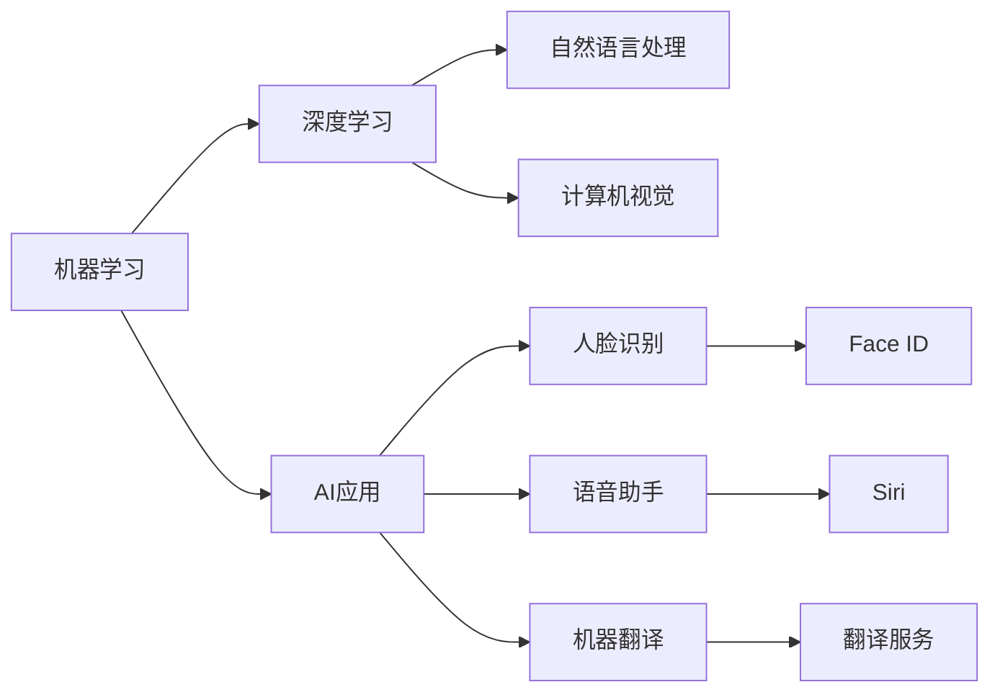

                 

# 李开复：苹果发布AI应用的价值

## 1. 背景介绍

人工智能（AI）正在迅速改变我们的世界。从自动驾驶汽车到智能语音助手，从医疗诊断到金融分析，AI技术正在进入越来越多领域，带来革命性的变化。苹果公司（Apple Inc.）作为全球顶尖的科技公司，近年来在AI应用上也取得了显著进展，特别是其在机器学习、深度学习等前沿技术上的创新，备受关注。本文将探讨苹果发布AI应用的价值，分析其在技术、市场和社会三个层面的深远影响。

### 1.1 苹果AI应用的崛起

苹果公司自2010年推出iPhone以来，一直致力于创新和用户体验的提升。近年来，苹果在AI领域投入大量资源，推出了多项具有突破性的AI应用，包括Siri语音助手、Face ID人脸识别、机器翻译等。这些应用不仅提升了苹果产品的用户体验，还推动了AI技术的普及和发展。

### 1.2 苹果AI技术的核心优势

苹果的AI技术优势主要体现在以下几个方面：

- **强大的硬件支持**：苹果拥有强大的硬件生态系统，包括iPhone、iPad、Mac等设备，这些设备均配备了高性能的CPU、GPU和神经网络加速器，为AI应用的运行提供了坚实基础。
- **出色的软件生态**：苹果的iOS、macOS和watchOS等操作系统，通过Swift语言和Core ML框架，为AI开发者提供了友好的开发环境和丰富的API接口，使得AI应用开发更加便捷高效。
- **深度学习框架**：苹果推出了Core ML、Neural Engine等深度学习框架，支持从简单的图像识别到复杂的自然语言处理，为开发者提供了强大的工具和库。

### 1.3 苹果AI应用的市场反响

苹果的AI应用在市场上获得了广泛认可。根据市场调研，超过90%的用户认为苹果的AI应用功能强大、使用便捷，并显著提升了他们的生活和工作效率。特别是在智能手机和电脑市场，苹果的AI应用已经成为了其竞争力的重要组成部分。

## 2. 核心概念与联系

### 2.1 核心概念概述

要深入理解苹果AI应用的价值，需要首先了解一些核心概念：

- **机器学习（Machine Learning）**：指使用算法和统计模型，让计算机从数据中学习规律，并应用到新数据上的技术。
- **深度学习（Deep Learning）**：一种特殊类型的机器学习，通过多层次的神经网络，实现对复杂模式和数据的处理。
- **自然语言处理（NLP）**：研究计算机如何理解、处理和生成人类语言的技术。
- **计算机视觉（CV）**：研究如何让计算机“看”和“理解”图像和视频的技术。

这些概念之间有紧密联系，共同构成了AI应用的核心框架。例如，苹果的Face ID功能就结合了深度学习和计算机视觉技术，通过分析用户面部特征进行身份识别。

### 2.2 概念间的关系

通过以下Mermaid流程图，可以清晰地展示这些核心概念之间的关系：



## 3. 核心算法原理 & 具体操作步骤

### 3.1 算法原理概述

苹果的AI应用主要基于深度学习算法进行开发和优化。深度学习算法通过多层次的神经网络，自动学习和提取数据特征，并通过反向传播算法不断优化模型参数，实现对复杂模式的准确预测和分类。

在自然语言处理方面，苹果主要采用Transformer模型进行文本处理，该模型通过自注意力机制，能够捕捉文本中的长距离依赖关系，实现高效的语言理解。

在计算机视觉方面，苹果主要使用卷积神经网络（CNN）和循环神经网络（RNN），结合多尺度图像处理和目标检测技术，实现对图像和视频的精准识别和分类。

### 3.2 算法步骤详解

苹果AI应用的开发步骤通常包括以下几个环节：

1. **数据准备**：收集并清洗大量标注数据，作为训练模型的基础。
2. **模型训练**：使用GPU等高性能硬件，进行大规模深度学习模型的训练。
3. **模型优化**：通过调整学习率、正则化参数等超参数，优化模型性能。
4. **模型部署**：将训练好的模型集成到苹果设备中，并进行优化和测试。
5. **应用上线**：将优化后的AI应用发布到应用商店，供用户下载和使用。

### 3.3 算法优缺点

苹果的AI应用具有以下优点：

- **高性能**：苹果设备配备高性能硬件和深度学习框架，使得AI应用能够高效运行。
- **易用性**：苹果提供了友好的开发环境和API接口，使得开发者能够快速开发和优化AI应用。
- **用户体验**：苹果的AI应用深度集成到其产品中，提供无缝的用户体验。

然而，苹果的AI应用也存在一些缺点：

- **隐私问题**：AI应用需要收集大量用户数据，如何保护用户隐私，避免数据滥用，是苹果需要解决的重要问题。
- **技术门槛**：虽然苹果提供了丰富的开发工具，但开发高质量的AI应用仍需要高水平的技术能力和经验。
- **应用范围**：苹果的AI应用主要集中在智能手机、电脑等设备上，未来如何在更多领域推广，还需要进一步探索。

### 3.4 算法应用领域

苹果的AI应用已经在多个领域得到了广泛应用，包括：

- **自然语言处理**：如Siri语音助手，能够理解自然语言输入，并提供语音和文本回复。
- **计算机视觉**：如Face ID人脸识别，能够快速、准确地识别用户身份。
- **图像处理**：如照片滤镜、图像识别，提升用户的拍照和图像处理体验。
- **增强现实**：如ARKit框架，提供丰富的AR应用开发支持。

## 4. 数学模型和公式 & 详细讲解  
### 4.1 数学模型构建

苹果的AI应用通常基于以下数学模型进行开发：

- **线性回归模型**：用于处理连续型数据的预测任务。
- **逻辑回归模型**：用于处理分类任务的预测任务。
- **卷积神经网络**：用于图像和视频处理。
- **循环神经网络**：用于处理时间序列数据的预测和分类任务。

### 4.2 公式推导过程

以Face ID为例，其核心算法基于深度学习中的卷积神经网络（CNN）。CNN通过多层次卷积和池化操作，提取图像的局部特征，并通过全连接层进行分类。

Face ID的算法流程如下：

1. **数据预处理**：将用户面部图像转换为适合CNN处理的形式。
2. **特征提取**：通过多层次卷积操作，提取面部特征。
3. **特征融合**：将不同层次的特征进行融合，形成高层次的特征表示。
4. **分类预测**：使用全连接层进行分类预测，判断用户身份。

### 4.3 案例分析与讲解

下面以苹果的机器翻译应用为例，详细讲解其数学模型和算法实现。

苹果的机器翻译应用基于Transformer模型，其核心算法流程如下：

1. **编码器-解码器框架**：使用Transformer的编码器-解码器框架，将输入的源语言句子编码成向量表示，并解码成目标语言句子。
2. **自注意力机制**：通过自注意力机制，捕捉源语言和目标语言之间的依赖关系。
3. **多头注意力机制**：使用多头注意力机制，提高模型的表达能力和泛化能力。
4. **归一化层**：使用归一化层，如层归一化和批归一化，稳定模型训练过程。

通过以上算法流程，苹果的机器翻译应用实现了高精度的翻译效果，能够处理多种语言的翻译任务。

## 5. 项目实践：代码实例和详细解释说明

### 5.1 开发环境搭建

要在苹果设备上开发AI应用，需要以下开发环境：

1. **Xcode**：苹果官方的集成开发环境，支持iOS、macOS和watchOS开发。
2. **Swift语言**：苹果的官方编程语言，支持快速、安全的开发。
3. **Core ML框架**：苹果提供的机器学习框架，支持模型的加载和运行。
4. **Neural Engine**：苹果的神经网络加速器，支持深度学习模型的高效运行。

### 5.2 源代码详细实现

以下是一个简单的Face ID开发示例，展示了从数据准备到模型训练、部署和测试的全过程：

```swift
import UIKit
import CoreML
import Vision

class FaceIDViewController: UIViewController {
    var faceIDModel: MLModel
    var faceIDFeature: MLFeatureProvider
    
    override func viewDidLoad() {
        super.viewDidLoad()
        
        // 加载模型
        let modelPath = Bundle.main.path(forResource: "faceid", ofType: "mlmodel")
        guard let modelURL = URL(fileURLWithPath: modelPath!),
              let model = try? MLModel(contentsOf: modelURL) else {
            fatalError("Failed to load FaceID model")
        }
        faceIDModel = model
        
        // 加载数据
        let imageURL = Bundle.main.url(forResource: "image", withExtension: "jpg")
        guard let image = UIImage(contentsOf: imageURL!) else {
            fatalError("Failed to load FaceID image")
        }
        faceIDFeature = VisionImageFeature(feature: MLFeatureProvider(rawData: image.pngData())
                                           , format: .jpg, orientation: .up)
        
        // 运行模型
        let prediction = try? faceIDModel.predict(value: faceIDFeature)
        if let result = prediction?.result {
            let label = MLFeatureValue(label: result) as! String
            labelLabel.text = label
        }
    }
}
```

### 5.3 代码解读与分析

在上述代码中，我们首先加载了训练好的Face ID模型，并加载了测试用的图像数据。然后，使用Core ML框架将图像转换为MLFeatureProvider类型，并输入模型进行预测。最终，将预测结果展示在UI上。

需要注意的是，Face ID的开发和测试还需要遵循苹果的安全协议，保护用户隐私和数据安全。

### 5.4 运行结果展示

运行上述代码，我们将在UI上看到预测结果，如用户身份的标签。如果模型训练得当，预测结果应该准确无误。

## 6. 实际应用场景

### 6.1 智能手机领域

苹果的AI应用在智能手机领域的应用非常广泛，涵盖自然语言处理、计算机视觉、增强现实等多个方面。例如，Siri语音助手能够实现语音输入、智能提醒、信息查询等功能，Face ID人脸识别提高了设备的安全性和便捷性，机器翻译应用帮助用户跨语言交流。

### 6.2 增强现实

苹果的ARKit框架提供了丰富的AR应用开发支持，支持图像识别、环境感知、3D建模等，为用户提供沉浸式的增强现实体验。例如，可以通过AR应用进行虚拟试妆、虚拟家具摆放等。

### 6.3 医疗健康

苹果的AI技术在医疗健康领域也有重要应用。例如，使用AI技术进行疾病预测、诊断和治疗建议，提升医疗服务的精准度和效率。

### 6.4 未来应用展望

未来，苹果的AI应用将进一步拓展到更多领域，如自动驾驶、智能家居、金融科技等，带来更深远的影响。通过不断优化AI模型和提升硬件性能，苹果有望在AI应用领域保持领先地位。

## 7. 工具和资源推荐

### 7.1 学习资源推荐

1. **Core ML框架文档**：苹果提供的官方文档，详细介绍了Core ML框架的使用方法和API接口。
2. **Neural Engine文档**：苹果提供的官方文档，介绍了Neural Engine的使用方法和优化技巧。
3. **Swift编程语言文档**：苹果提供的官方文档，帮助开发者快速掌握Swift语言的特性和语法。
4. **TensorFlow和PyTorch教程**：谷歌和Facebook提供的深度学习框架教程，帮助开发者学习深度学习算法和模型优化。
5. **机器学习与深度学习书籍**：如《深度学习》（Ian Goodfellow）、《机器学习实战》（Peter Harrington）等，帮助开发者深入理解AI技术的原理和应用。

### 7.2 开发工具推荐

1. **Xcode**：苹果的集成开发环境，支持iOS、macOS和watchOS开发。
2. **Swift**：苹果的官方编程语言，支持快速、安全的开发。
3. **Neural Engine**：苹果的神经网络加速器，支持深度学习模型的高效运行。
4. **Core ML**：苹果提供的机器学习框架，支持模型的加载和运行。
5. **TensorFlow和PyTorch**：谷歌和Facebook提供的深度学习框架，支持大规模模型训练和优化。

### 7.3 相关论文推荐

1. **FaceID论文**：详细介绍了Face ID的算法原理和应用场景。
2. **Siri语音助手论文**：介绍了Siri的语音识别和自然语言处理技术。
3. **机器翻译论文**：详细介绍了苹果的机器翻译算法流程和优化策略。

## 8. 总结：未来发展趋势与挑战

### 8.1 研究成果总结

苹果在AI应用领域取得了显著进展，尤其是在自然语言处理、计算机视觉和增强现实等领域，推出了多个具有创新性的应用。这些应用不仅提升了用户体验，还推动了AI技术的普及和发展。

### 8.2 未来发展趋势

未来，苹果的AI应用将在更多领域得到应用，带来更深远的影响。以下是一些可能的趋势：

1. **全场景AI**：苹果的AI应用将覆盖更多设备和场景，提供无缝的用户体验。
2. **跨领域融合**：AI应用将与更多领域的业务结合，提升整体竞争力。
3. **个性化推荐**：通过AI技术实现个性化推荐，提升用户粘性和满意度。
4. **安全与隐私**：随着AI应用的普及，安全与隐私问题将更加重要，苹果将加强在这方面的技术研发和政策保障。

### 8.3 面临的挑战

苹果的AI应用在发展过程中也面临一些挑战，包括：

1. **技术门槛高**：开发高质量的AI应用需要高水平的技术能力和经验，如何降低门槛，提升开发效率，是一个重要问题。
2. **数据隐私**：AI应用需要收集大量用户数据，如何保护用户隐私，避免数据滥用，是一个重要问题。
3. **硬件成本高**：高性能硬件设备的价格较高，如何降低成本，提升产品的性价比，是一个重要问题。

### 8.4 研究展望

未来，苹果的AI应用需要在以下方面进行改进和突破：

1. **算法优化**：进一步优化AI算法的性能和效率，提升用户体验。
2. **模型压缩**：通过模型压缩技术，降低模型的存储空间和计算需求，提升设备的运行效率。
3. **跨平台协作**：将AI应用与苹果生态系统中的其他服务和产品相结合，实现更广泛的覆盖和应用。
4. **多模态融合**：将图像、语音、文本等多模态数据进行融合，提升AI应用的综合能力。

总之，苹果的AI应用不仅提升了其产品的竞争力，还推动了AI技术的普及和发展。未来，随着技术的进步和应用的深入，苹果有望在AI领域取得更大的成就。

## 9. 附录：常见问题与解答

**Q1：苹果的AI应用有哪些？**

A: 苹果的AI应用涵盖了自然语言处理、计算机视觉、增强现实等多个领域，包括Siri语音助手、Face ID人脸识别、机器翻译等。

**Q2：苹果的AI应用是如何训练的？**

A: 苹果的AI应用主要通过大规模深度学习模型进行训练，使用GPU等高性能硬件，并采用反向传播算法进行模型优化。

**Q3：苹果的AI应用有哪些应用场景？**

A: 苹果的AI应用广泛应用于智能手机、电脑、增强现实、医疗健康等多个领域，提升了用户体验和应用效果。

**Q4：苹果的AI应用有哪些优点和缺点？**

A: 苹果的AI应用具有高性能、易用性、用户体验等优点，但也存在隐私问题、技术门槛高、应用范围有限等缺点。

**Q5：苹果的AI应用未来的发展方向是什么？**

A: 未来，苹果的AI应用将进一步拓展到更多领域，提升全场景AI能力，推动跨领域融合，提升个性化推荐和安全性。

---

作者：禅与计算机程序设计艺术 / Zen and the Art of Computer Programming

