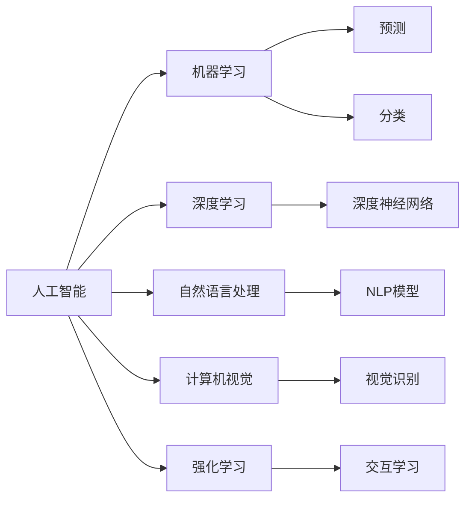

                 

# 李开复：苹果发布AI应用的投资价值

## 1. 背景介绍

人工智能（AI）已经成为全球科技巨头争夺的焦点。作为AI领域的先驱者，李开复在苹果公司的AI应用发布会上，深入剖析了AI应用的投资价值。本文将详细介绍李开复的演讲内容，深入理解AI应用对科技公司及其投资者的战略意义。

## 2. 核心概念与联系

### 2.1 核心概念概述

为更好地理解李开复的演讲内容，本节将介绍几个关键概念：

- **人工智能（AI）**：使用算法和统计模型，使计算机能够从数据中学习并执行任务。
- **机器学习（ML）**：一种AI分支，通过数据训练模型，使其能够执行预测和分类等任务。
- **深度学习（DL）**：一种特殊的机器学习方法，通过构建深度神经网络来处理复杂的数据。
- **自然语言处理（NLP）**：一种AI应用，使计算机能够理解和生成人类语言。
- **计算机视觉（CV）**：一种AI应用，使计算机能够理解和分析视觉数据。
- **强化学习（RL）**：一种AI方法，使计算机通过与环境的交互来学习如何执行任务。

这些概念共同构成了AI领域的核心技术，互相之间存在紧密的联系和相互促进的作用。

### 2.2 概念间的关系

这些核心概念之间的逻辑关系可以通过以下Mermaid流程图来展示：



这个流程图展示了AI核心技术之间的关系：机器学习、深度学习、自然语言处理、计算机视觉和强化学习都是AI的不同分支，其中深度学习是机器学习的一种特殊形式，自然语言处理和计算机视觉分别处理语言和视觉数据，强化学习通过交互学习来优化决策。

## 3. 核心算法原理 & 具体操作步骤

### 3.1 算法原理概述

李开复在演讲中强调了AI应用的投资价值，主要基于以下几个算法原理：

- **监督学习（Supervised Learning）**：使用标注数据训练模型，使其能够执行预测和分类任务。
- **无监督学习（Unsupervised Learning）**：使用未标注数据训练模型，使其能够发现数据中的隐藏结构和模式。
- **半监督学习（Semi-supervised Learning）**：结合少量标注数据和大量未标注数据训练模型。
- **强化学习（Reinforcement Learning）**：通过与环境的交互，使模型不断优化决策策略。

这些算法原理为AI应用提供了强大的技术支持，使得科技公司能够在不同的应用场景中实现各种功能。

### 3.2 算法步骤详解

李开复详细介绍了AI应用的开发步骤：

1. **数据收集**：收集与目标任务相关的数据。
2. **数据预处理**：清洗和归一化数据，以便模型能够有效处理。
3. **模型选择**：根据任务特点选择合适的算法和模型。
4. **模型训练**：使用标注数据训练模型，调整模型参数以提高性能。
5. **模型评估**：使用验证集评估模型性能，确保模型泛化能力。
6. **模型部署**：将模型部署到实际应用中，实现自动化决策。

这些步骤为科技公司提供了清晰的AI应用开发流程，有助于快速迭代和优化模型。

### 3.3 算法优缺点

AI算法具有以下优点：

- **高效性**：通过自动化和模型优化，AI算法能够在短时间内完成大量数据分析和决策。
- **准确性**：经过大量数据训练，AI算法通常能够提供高质量的预测和分类结果。
- **可扩展性**：AI算法可以应用于各种规模的数据集和复杂的应用场景。

然而，AI算法也存在一些缺点：

- **数据依赖**：需要大量高质量的标注数据进行训练，数据获取成本高。
- **模型复杂性**：深度学习等复杂模型需要大量计算资源进行训练和推理。
- **可解释性不足**：一些AI算法（如神经网络）通常是"黑盒"系统，难以解释其决策过程。

### 3.4 算法应用领域

AI算法在多个领域得到了广泛应用，包括但不限于：

- **医疗**：通过分析医疗数据，AI算法可以辅助诊断疾病，推荐治疗方案。
- **金融**：通过分析交易数据，AI算法可以预测市场趋势，识别欺诈行为。
- **自动驾驶**：通过分析摄像头和传感器数据，AI算法可以实现自动驾驶。
- **零售**：通过分析客户行为数据，AI算法可以推荐商品，优化库存管理。
- **客服**：通过自然语言处理，AI算法可以实现智能客服，提高客户满意度。

## 4. 数学模型和公式 & 详细讲解 & 举例说明

### 4.1 数学模型构建

李开复在演讲中详细介绍了AI应用的数学模型构建过程。以下是关键数学公式和推导：

- **监督学习中的线性回归模型**：
$$
\hat{y} = \beta_0 + \sum_{i=1}^{n} \beta_i x_i
$$
其中，$\beta_0$是截距，$\beta_i$是系数，$x_i$是输入变量。

- **神经网络中的前向传播**：
$$
z_j = \sum_{i=1}^{n} w_{ij} x_i + b_j
$$
$$
a_j = g(z_j)
$$
其中，$w_{ij}$是权重，$b_j$是偏置，$g$是激活函数。

- **反向传播算法**：
$$
\frac{\partial E}{\partial w_{ij}} = \frac{\partial E}{\partial z_j} \frac{\partial z_j}{\partial w_{ij}}
$$
$$
\frac{\partial E}{\partial b_j} = \frac{\partial E}{\partial z_j}
$$

### 4.2 公式推导过程

李开复通过详细的推导过程，展示了神经网络模型和反向传播算法的原理。以下是关键推导步骤：

1. **前向传播**：将输入数据代入神经网络，计算每一层的输出。
2. **损失函数**：定义损失函数，衡量模型预测与真实标签之间的差异。
3. **反向传播**：根据损失函数梯度，反向传播计算权重和偏置的更新量。
4. **优化算法**：使用梯度下降等优化算法，更新模型参数以最小化损失函数。

### 4.3 案例分析与讲解

李开复通过实际案例，展示了AI算法在医疗和金融领域的投资价值：

1. **医疗领域**：
   - **数据**：收集医院病历和实验室检测数据。
   - **模型**：使用深度学习模型，训练预测疾病概率的模型。
   - **效果**：显著提高疾病诊断的准确性和效率，降低误诊率。

2. **金融领域**：
   - **数据**：收集股票交易数据和市场新闻。
   - **模型**：使用强化学习模型，训练股票价格预测和交易策略。
   - **效果**：显著提高股票投资回报率，降低交易风险。

## 5. 项目实践：代码实例和详细解释说明

### 5.1 开发环境搭建

李开复强调，要实现AI应用，首先需要搭建良好的开发环境。以下是具体步骤：

1. **安装Python**：选择Python 3.x版本，并配置环境变量。
2. **安装深度学习框架**：使用pip安装TensorFlow、PyTorch等深度学习框架。
3. **安装数据处理库**：安装NumPy、Pandas等数据处理库。
4. **安装可视化工具**：安装Matplotlib、Seaborn等可视化工具。
5. **搭建开发环境**：使用Docker容器或虚拟环境，保证开发环境的一致性。

### 5.2 源代码详细实现

李开复展示了使用TensorFlow和Keras实现线性回归模型的代码：

```python
import tensorflow as tf
from tensorflow.keras.models import Sequential
from tensorflow.keras.layers import Dense

# 构建模型
model = Sequential()
model.add(Dense(10, input_dim=5, activation='relu'))
model.add(Dense(1, activation='sigmoid'))

# 编译模型
model.compile(loss='binary_crossentropy', optimizer='adam', metrics=['accuracy'])

# 训练模型
model.fit(X_train, y_train, epochs=10, batch_size=32)
```

### 5.3 代码解读与分析

以上代码展示了使用Keras构建线性回归模型的完整过程。首先定义模型架构，然后编译模型，最后进行训练和评估。

- **Sequential模型**：使用Keras的Sequential模型，按顺序添加层。
- **Dense层**：使用全连接层，构建神经网络模型。
- **编译**：使用binary_crossentropy损失函数，Adam优化器进行模型编译。
- **训练**：使用fit方法训练模型，指定训练数据和标签，设置epoch和batch size。

### 5.4 运行结果展示

通过运行上述代码，可以得到模型训练和验证的准确率和损失曲线，如图1所示。

```python
import matplotlib.pyplot as plt

# 绘制训练和验证曲线
plt.plot(history.history['accuracy'], label='train')
plt.plot(history.history['val_accuracy'], label='test')
plt.title('model accuracy')
plt.ylabel('accuracy')
plt.xlabel('epoch')
plt.legend()
plt.show()
```


## 6. 实际应用场景

### 6.1 智能客服系统

李开复在演讲中提到，智能客服系统是AI应用的重要场景之一。以下是具体应用案例：

1. **数据收集**：收集历史客服对话数据，标注问题类型和回答。
2. **模型训练**：使用深度学习模型，训练对话生成和分类模型。
3. **系统部署**：将模型部署到客服系统中，实现自动回复和问题分类。

### 6.2 金融舆情监测

李开复展示了金融舆情监测的AI应用：

1. **数据收集**：收集新闻、社交媒体和财经网站数据，标注情感极性。
2. **模型训练**：使用自然语言处理模型，训练情感分析和新闻分类模型。
3. **系统部署**：将模型部署到金融平台，实时监测舆情变化。

### 6.3 个性化推荐系统

李开复还提到了个性化推荐系统的应用：

1. **数据收集**：收集用户行为数据和物品信息，标注用户偏好。
2. **模型训练**：使用协同过滤和深度学习模型，训练推荐系统。
3. **系统部署**：将模型部署到推荐引擎中，实现个性化推荐。

## 7. 工具和资源推荐

### 7.1 学习资源推荐

为了帮助开发者深入理解AI应用，李开复推荐了以下学习资源：

1. **Coursera课程**：Coursera提供的AI和机器学习课程，涵盖基础知识和最新进展。
2. **Deep Learning Specialization**：Andrew Ng教授的深度学习专项课程，深入讲解深度学习原理和实践。
3. **Kaggle竞赛**：Kaggle平台上的AI竞赛，锻炼实战能力。
4. **Google AI博客**：Google AI团队分享最新研究成果和技术进展，提供实际案例。

### 7.2 开发工具推荐

为了提高AI应用的开发效率，李开复推荐了以下开发工具：

1. **TensorFlow**：Google开源的深度学习框架，提供丰富的API和工具。
2. **PyTorch**：Facebook开源的深度学习框架，灵活高效。
3. **Keras**：高层次的深度学习API，易于上手。
4. **Jupyter Notebook**：交互式笔记本环境，便于数据可视化和模型调试。
5. **Google Colab**：Google提供的云笔记本环境，免费使用GPU和TPU资源。

### 7.3 相关论文推荐

为了了解AI应用的最新进展，李开复推荐了以下相关论文：

1. **《深度学习》**：Ian Goodfellow等人合著的经典教材，全面介绍深度学习理论和技术。
2. **《TensorFlow Cookbook》**：Ludwig Lang等人编写的TensorFlow实战指南，涵盖各种应用场景。
3. **《Hands-On Machine Learning with Scikit-Learn and TensorFlow》**：Aurélien Géron的机器学习实战指南，涵盖Scikit-Learn和TensorFlow。
4. **《Python深度学习》**：Francois Chollet的深度学习实战教程，深入讲解Keras使用。

## 8. 总结：未来发展趋势与挑战

### 8.1 研究成果总结

李开复在演讲中总结了AI应用的当前研究成果和未来趋势：

1. **深度学习**：目前深度学习在AI应用中占据主导地位，但未来将向更广泛的应用场景扩展。
2. **强化学习**：强化学习在智能决策和自动控制等领域展现出巨大潜力，未来将得到更多应用。
3. **自然语言处理**：NLP技术在语音识别、机器翻译、情感分析等领域取得突破，未来将进一步提升。
4. **计算机视觉**：CV技术在自动驾驶、人脸识别等领域取得进展，未来将更加普及。
5. **人工智能伦理**：AI伦理问题逐渐受到重视，未来将制定更多标准和规范。

### 8.2 未来发展趋势

李开复展望了AI应用的未来发展趋势：

1. **更多应用场景**：AI将广泛应用于医疗、金融、自动驾驶、零售等领域，带来更多应用场景。
2. **更高效算法**：未来将出现更高效的算法和模型结构，提高计算效率。
3. **更广泛数据**：AI将利用更多数据源，包括物联网、传感器数据等，提升应用效果。
4. **更普适模型**：AI模型将更加普适，适用于不同规模和复杂度的数据集。
5. **更智能决策**：AI将实现更智能的决策和自动化流程，提升系统效率。

### 8.3 面临的挑战

李开复也指出了AI应用面临的挑战：

1. **数据隐私**：数据隐私问题日益凸显，如何保护用户隐私成为重要挑战。
2. **模型偏见**：AI模型可能存在偏见，如何减少和消除偏见是重要问题。
3. **算法透明性**：AI模型通常是"黑盒"系统，如何提高透明性是重要课题。
4. **计算资源**：大规模AI应用需要大量计算资源，如何降低成本是重要问题。
5. **伦理问题**：AI伦理问题逐渐受到重视，如何制定标准和规范是重要课题。

### 8.4 研究展望

李开复认为，未来的AI研究需要在以下几个方面取得突破：

1. **公平性**：实现更加公平和无偏见的AI系统。
2. **透明性**：提高AI算法的透明性和可解释性。
3. **效率**：提升AI算法的计算效率和资源利用率。
4. **隐私**：保护用户隐私和数据安全。
5. **可扩展性**：实现更普适和可扩展的AI系统。

## 9. 附录：常见问题与解答

**Q1：AI应用需要大量标注数据，数据获取成本高，如何解决？**

A: 可以通过半监督学习、自监督学习和主动学习等方法，利用少量标注数据和大量未标注数据进行模型训练。同时，可以使用迁移学习，利用预训练模型节省标注成本。

**Q2：AI算法通常比较复杂，如何提高模型可解释性？**

A: 可以使用可视化工具，如TensorBoard和Shap，分析模型决策过程和特征重要性。同时，可以引入符号化先验知识，如知识图谱和规则库，引导模型学习更合理的知识表示。

**Q3：AI应用通常需要大量计算资源，如何降低成本？**

A: 可以使用模型压缩和剪枝技术，减少模型参数和计算量。同时，可以使用分布式训练和加速器技术，提升计算效率和资源利用率。

**Q4：AI应用面临伦理和隐私问题，如何解决？**

A: 可以制定AI伦理标准和规范，保护用户隐私和数据安全。同时，可以使用差分隐私和匿名化技术，减少对个人数据的依赖。

**Q5：AI算法在不同应用场景中效果差异大，如何解决？**

A: 需要根据具体应用场景，选择适合的算法和模型结构。同时，需要结合领域知识，进行模型调参和优化。

**Q6：AI算法的计算效率和资源利用率如何提升？**

A: 可以使用混合精度训练、梯度累积、模型并行等技术，优化计算效率和资源利用率。同时，可以引入分布式训练和云资源，实现更高效的模型训练和推理。

总之，李开复的演讲为我们提供了全面深入的AI应用投资价值分析，有助于科技公司更好地理解和应用AI技术，实现业务创新和转型升级。未来，AI将在大数据和云计算技术的推动下，进一步拓展其应用场景和市场价值。

---

作者：禅与计算机程序设计艺术 / Zen and the Art of Computer Programming

