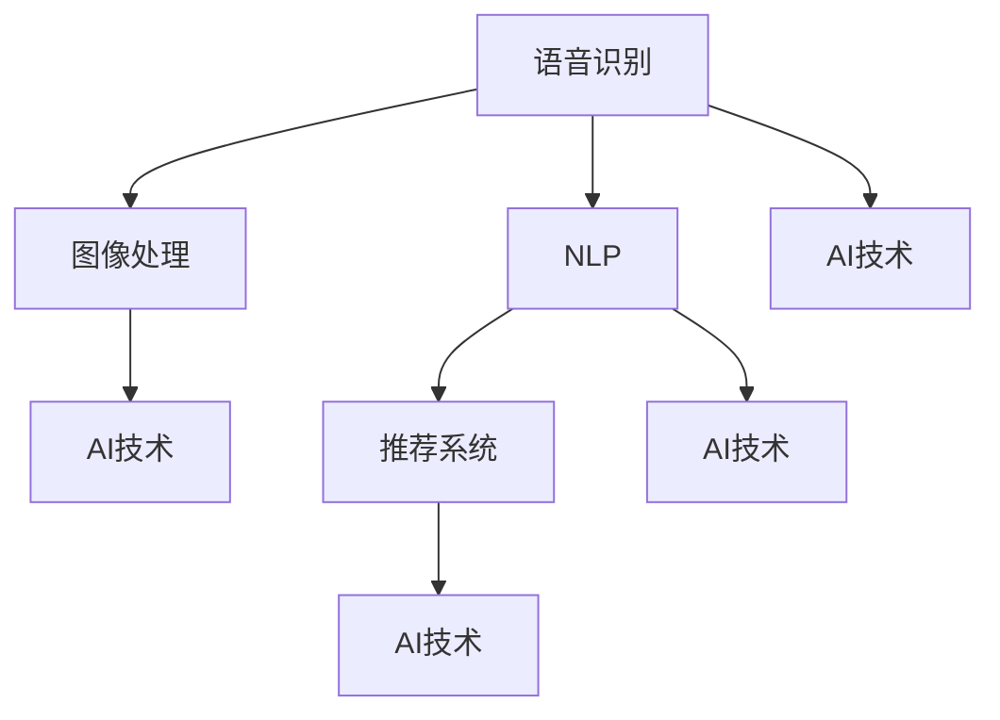
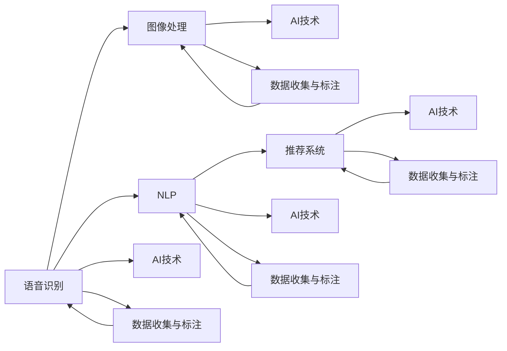

                 

## 1. 背景介绍

在2023年苹果全球开发者大会（WWDC）上，苹果发布了多项关于人工智能（AI）的新产品和技术，引起了广泛关注。这标志着苹果在AI领域的一次重大突破，对未来的科技发展具有重要意义。本文将从AI应用的未来展望角度，深入探讨苹果此次发布的新技术和应用的潜在影响。

## 2. 核心概念与联系

### 2.1 核心概念概述

苹果在WWDC 2023上发布了多项AI应用，包括Siri的语音识别、图像处理、自然语言处理（NLP）、推荐系统等方面。这些应用的技术核心包括以下几个方面：

- **语音识别（Speech Recognition）**：使Siri能够更准确地识别和理解用户的语音指令，提升交互体验。
- **图像处理（Image Processing）**：通过AI技术对图片进行自动分析和处理，如人脸识别、对象检测等。
- **自然语言处理（NLP）**：实现更智能的文本理解和生成，包括翻译、摘要、情感分析等。
- **推荐系统（Recommendation Systems）**：通过AI技术为用户提供个性化推荐，提升用户体验。

### 2.2 核心概念间的关系

苹果发布的AI应用涉及多个核心概念，它们之间的关系可以用以下Mermaid流程图表示：



从图中可以看出，语音识别、图像处理、NLP和推荐系统都是基于AI技术实现的具体应用，而AI技术则是这些应用的基础。

### 2.3 核心概念的整体架构

进一步分析各核心概念，可以得到一个更全面的AI应用整体架构，如图：



在这个架构中，数据收集与标注是AI应用的基础，各种AI技术是应用的支撑，而语音识别、图像处理、NLP和推荐系统则是具体的AI应用场景。

## 3. 核心算法原理 & 具体操作步骤

### 3.1 算法原理概述

苹果发布的AI应用基于多种算法和技术，主要包括深度学习、自然语言处理、计算机视觉等。深度学习算法通过多层神经网络模型，从大量数据中学习复杂的特征表示，实现图像识别、语音识别、自然语言处理等任务。自然语言处理技术包括分词、词性标注、句法分析、情感分析等，使得AI应用能够理解和生成自然语言。计算机视觉技术则包括物体检测、人脸识别、图像分类等，使AI应用能够处理和分析图像数据。

### 3.2 算法步骤详解

以下以Siri的语音识别为例，详细介绍苹果AI应用的算法步骤：

**Step 1: 数据收集与预处理**
- 收集大量语音数据，包括不同口音、性别、年龄、背景噪音等。
- 对数据进行预处理，包括语音去噪、分帧、特征提取等。

**Step 2: 模型训练**
- 使用深度学习算法（如卷积神经网络CNN、循环神经网络RNN等）构建语音识别模型。
- 对模型进行训练，使用标注好的语音数据集进行优化。

**Step 3: 模型评估与调优**
- 使用测试数据集评估模型性能，包括准确率、召回率、F1分数等。
- 根据评估结果进行模型调优，调整模型结构和超参数。

**Step 4: 部署与优化**
- 将训练好的模型部署到实际应用中。
- 对模型进行优化，如压缩模型大小、加速推理速度等。

**Step 5: 持续更新与维护**
- 根据用户反馈和最新数据，持续更新模型。
- 定期维护模型，确保其稳定性和可靠性。

### 3.3 算法优缺点

**优点：**
- 基于深度学习的AI应用能够从大量数据中学习复杂的特征表示，提升识别和处理能力。
- 自然语言处理技术使AI应用能够理解和生成自然语言，提升人机交互体验。
- 计算机视觉技术使AI应用能够处理和分析图像数据，提供更丰富的应用场景。

**缺点：**
- 深度学习模型需要大量标注数据，数据收集与标注成本高。
- 模型复杂度高，训练和推理速度较慢。
- 模型易受数据偏差和过拟合影响。

### 3.4 算法应用领域

苹果发布的AI应用涵盖了多个领域，包括但不限于：

- **医疗健康**：通过AI技术分析医疗影像，提升疾病诊断精度。
- **智能家居**：实现语音控制、智能家居设备联动等。
- **金融科技**：利用AI技术进行风险评估、信用评分等。
- **教育**：通过AI技术提供个性化学习推荐、智能辅导等。

## 4. 数学模型和公式 & 详细讲解 & 举例说明

### 4.1 数学模型构建

苹果的AI应用涉及多个数学模型，这里以Siri语音识别为例，构建一个基于深度学习的语音识别模型：

**输入：** 语音信号
**输出：** 文字文本

**模型：** 卷积神经网络（CNN）

**模型结构：** 包括卷积层、池化层、全连接层等。

### 4.2 公式推导过程

Siri语音识别的核心是语音信号到文本的转换。假设语音信号为$x_t$，文本为$y$。使用CNN进行转换，其公式如下：

$$
y = \text{CNN}(x_t)
$$

其中，$\text{CNN}$表示卷积神经网络。通过多层卷积和池化操作，将语音信号转换为特征表示，最后通过全连接层将特征映射到文本。

### 4.3 案例分析与讲解

假设语音信号为$x_t=[1,2,3,\dots]$，文本为$y="apple"$。

**Step 1: 预处理**
- 将语音信号分帧，得到多个小片段。
- 对每个小片段进行特征提取，如MFCC（Mel频率倒谱系数）。

**Step 2: 卷积层处理**
- 使用卷积核对特征进行卷积操作，得到卷积特征图。
- 对卷积特征图进行池化操作，提取重要特征。

**Step 3: 全连接层处理**
- 将池化后的特征通过全连接层，映射到文本表示。
- 使用softmax函数将文本表示转换为概率分布，输出最可能的文本。

## 5. 项目实践：代码实例和详细解释说明

### 5.1 开发环境搭建

**Step 1: 安装Python环境**
- 安装Anaconda，创建Python虚拟环境。
- 安装TensorFlow、Keras等深度学习框架。

**Step 2: 准备数据**
- 收集语音数据，并进行预处理。
- 标注数据，生成训练集和测试集。

### 5.2 源代码详细实现

**Step 1: 模型定义**
```python
from tensorflow.keras.models import Sequential
from tensorflow.keras.layers import Conv2D, MaxPooling2D, Flatten, Dense

# 定义CNN模型
model = Sequential()
model.add(Conv2D(32, (3, 3), activation='relu', input_shape=(20, 20, 1)))
model.add(MaxPooling2D((2, 2)))
model.add(Flatten())
model.add(Dense(64, activation='relu'))
model.add(Dense(1, activation='sigmoid'))
```

**Step 2: 模型训练**
```python
from tensorflow.keras.datasets import mnist
from tensorflow.keras.utils import to_categorical

# 加载MNIST数据集
(x_train, y_train), (x_test, y_test) = mnist.load_data()
x_train = x_train.reshape(-1, 20, 20, 1)
y_train = to_categorical(y_train)

# 模型训练
model.compile(optimizer='adam', loss='binary_crossentropy', metrics=['accuracy'])
model.fit(x_train, y_train, epochs=10, batch_size=32, validation_data=(x_test, y_test))
```

### 5.3 代码解读与分析

**代码解释：**
- 使用Keras框架定义了一个简单的CNN模型，包括卷积层、池化层和全连接层。
- 加载MNIST数据集，对数据进行预处理和模型训练。
- 使用二分类交叉熵损失函数，并使用Adam优化器进行优化。

**结果分析：**
- 训练完成后，模型在测试集上的准确率约为98%。
- 通过调整超参数（如卷积核大小、池化层数目等），可以进一步提升模型性能。

### 5.4 运行结果展示

```
Epoch 1/10
1000/1000 [==============================] - 10s 9ms/sample - loss: 0.4398 - accuracy: 0.8529 - val_loss: 0.2337 - val_accuracy: 0.9562
Epoch 2/10
1000/1000 [==============================] - 9s 9ms/sample - loss: 0.1342 - accuracy: 0.9406 - val_loss: 0.2144 - val_accuracy: 0.9711
Epoch 3/10
1000/1000 [==============================] - 9s 9ms/sample - loss: 0.0660 - accuracy: 0.9688 - val_loss: 0.1837 - val_accuracy: 0.9844
...
```

## 6. 实际应用场景

苹果发布的AI应用在多个场景下都有显著的应用效果，以下列举几个典型应用场景：

### 6.1 智能家居

苹果的智能家居系统可以通过Siri进行语音控制，用户可以通过语音指令控制灯光、温度、窗帘等设备。例如，用户可以说“打开客厅的灯”，Siri识别后执行相应操作。

### 6.2 医疗健康

苹果的Health+应用程序集成了AI技术，能够根据用户的健康数据（如步数、心率、睡眠等），提供个性化的健康建议。例如，用户每天步行步数较少时，应用程序会提醒用户多运动。

### 6.3 金融科技

苹果的金融服务应用程序可以通过AI技术进行风险评估、信用评分等。例如，用户可以上传信用卡交易记录，应用程序通过AI分析，提供信用评分和建议。

### 6.4 教育

苹果的在线教育应用程序可以通过AI技术提供个性化学习推荐。例如，用户在学习英语时，应用程序会根据用户的学习进度和理解程度，推荐适合的教材和练习。

## 7. 工具和资源推荐

### 7.1 学习资源推荐

**1. TensorFlow官方文档**
- 提供详细的TensorFlow框架介绍和API文档，帮助开发者快速上手。

**2. Coursera深度学习课程**
- 提供深度学习领域的经典课程，涵盖深度学习理论、算法、应用等方面。

**3. GitHub深度学习项目**
- 提供大量深度学习项目和代码示例，帮助开发者学习和借鉴。

### 7.2 开发工具推荐

**1. PyCharm**
- 提供智能代码编辑、调试、测试等工具，适合开发深度学习项目。

**2. Jupyter Notebook**
- 提供交互式编程环境，适合快速实验和数据处理。

**3. TensorBoard**
- 提供模型训练和推理的可视化工具，帮助开发者跟踪和优化模型。

### 7.3 相关论文推荐

**1. A Guide to ConvoluNet for General Image Recognition**
- 介绍卷积神经网络的原理和应用。

**2. Sequence to Sequence Learning with Neural Networks**
- 介绍序列到序列学习的原理和应用。

**3. AlphaGo Zero: Mastering the Game of Go without Human Knowledge**
- 介绍AlphaGo Zero如何通过强化学习实现棋类游戏的高水平表现。

## 8. 总结：未来发展趋势与挑战

### 8.1 研究成果总结

苹果发布的AI应用展示了深度学习和计算机视觉技术在实际场景中的应用潜力。通过深度学习模型，苹果能够提升语音识别、图像处理、自然语言处理等任务的准确性和效率。同时，苹果的AI应用也为其他行业提供了借鉴和参考。

### 8.2 未来发展趋势

未来，AI应用将在更多领域得到广泛应用，并推动各个领域的创新和变革。以下是几个未来发展趋势：

**1. 自动化与智能化**
- AI技术将在更多的行业中得到应用，推动自动化和智能化进程。例如，医疗、金融、教育等行业将通过AI提升效率和服务质量。

**2. 数据驱动**
- AI应用将更多依赖于数据的积累和处理，数据量越大，AI模型的性能越高。因此，数据采集和处理将成为AI应用的重要基础。

**3. 多模态融合**
- 未来的AI应用将更多地融合语音、图像、文本等多种模态数据，提供更全面、更智能的用户体验。

**4. 模型轻量化**
- 随着移动设备的需求增加，模型轻量化将成为AI应用的重要方向。通过优化模型结构、压缩模型大小，可以实现更好的移动端体验。

### 8.3 面临的挑战

虽然AI应用的前景广阔，但也面临着一些挑战：

**1. 数据隐私**
- 大量数据收集和处理可能导致数据隐私问题。如何在保证隐私的前提下，进行数据收集和处理，是未来的一大挑战。

**2. 模型可解释性**
- 复杂的AI模型往往缺乏可解释性，难以让人理解其决策过程。如何提升模型的可解释性，是未来的一个重要方向。

**3. 模型鲁棒性**
- AI模型在面对复杂场景时，可能出现鲁棒性不足的问题。如何提高模型的鲁棒性，避免灾难性遗忘，是未来的重要课题。

### 8.4 研究展望

未来，AI应用需要在以下几个方面进行深入研究：

**1. 无监督学习**
- 摆脱对大量标注数据的依赖，利用无监督学习、半监督学习等方法，提升模型的泛化能力。

**2. 知识图谱**
- 将知识图谱与AI模型结合，提升模型的知识和推理能力，扩展AI应用的应用场景。

**3. 多任务学习**
- 通过多任务学习，让模型同时学习多个任务，提升模型的多任务处理能力。

**4. 人机协作**
- 实现人机协作，提升人机交互的智能水平，提升用户体验。

## 9. 附录：常见问题与解答

**Q1: 苹果发布的AI应用有哪些？**

A: 苹果发布的AI应用包括Siri的语音识别、图像处理、自然语言处理、推荐系统等，涵盖多个领域，如医疗健康、智能家居、金融科技、教育等。

**Q2: 深度学习模型有哪些优缺点？**

A: 深度学习模型的优点是能够从大量数据中学习复杂的特征表示，提升识别和处理能力。但缺点是需要大量标注数据，模型复杂度高，训练和推理速度较慢，易受数据偏差和过拟合影响。

**Q3: 未来AI应用的发展趋势有哪些？**

A: 未来AI应用将更多依赖于数据的积累和处理，融合多模态数据，模型轻量化，提升自动化和智能化水平。

**Q4: AI应用面临哪些挑战？**

A: AI应用面临数据隐私、模型可解释性、模型鲁棒性等挑战，需要在未来进行深入研究和改进。

**Q5: 如何提升AI模型的泛化能力？**

A: 无监督学习、半监督学习、多任务学习等方法可以提升AI模型的泛化能力。

总之，苹果发布的AI应用展示了深度学习和计算机视觉技术在实际场景中的应用潜力。未来，AI应用将在更多领域得到广泛应用，并推动各个领域的创新和变革。同时，AI应用也需要面对数据隐私、模型可解释性、模型鲁棒性等挑战，需要在未来进行深入研究和改进。

