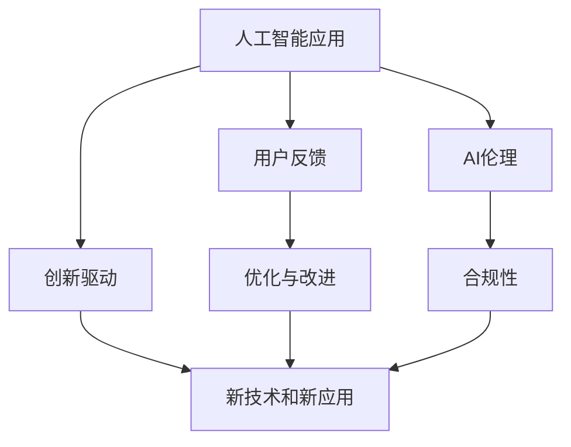

                 

# 李开复：苹果发布AI应用的用户

> 关键词：人工智能应用, 李开复, 用户反馈, AI伦理, 创新驱动

## 1. 背景介绍

在人工智能（AI）时代，用户如何使用AI应用，以及这些应用的成效如何，是一个备受关注的话题。苹果公司最近发布了多款AI应用，包括Siri、Face ID等，这些应用在用户体验、安全性、隐私保护等方面带来了显著提升。然而，也引发了一些关于AI伦理和技术创新的思考。本文将从这些应用的用户反馈出发，探讨苹果AI应用的优点和局限性，以及未来AI应用的发展方向。

## 2. 核心概念与联系

### 2.1 核心概念概述

在讨论AI应用时，需要明确几个关键概念：

- **人工智能应用**：指的是基于人工智能技术开发的各种软件和服务，如智能语音助手、图像识别、自动驾驶等。
- **用户反馈**：指用户在使用AI应用过程中提出的意见和建议，是衡量AI应用效果的重要指标。
- **AI伦理**：涉及AI应用的道德、法律和社会责任问题，如隐私保护、算法偏见、安全性等。
- **创新驱动**：强调在AI应用开发中，创新是推动技术进步和用户体验改善的关键因素。

### 2.2 概念间的关系

以上概念之间存在密切联系，形成一个完整的AI应用生态系统：

- **人工智能应用**依赖于**用户反馈**，不断优化和改进，以提升用户体验。
- **AI伦理**影响着AI应用的开发和应用，确保技术在道德和法律框架内运行。
- **创新驱动**是推动AI应用发展的动力源泉，持续创新带来新的功能和应用场景。

这些概念共同构成了苹果AI应用的基石，决定了其技术路径和应用场景。

### 2.3 核心概念的整体架构

通过以下Mermaid流程图，我们可以更清晰地理解这些概念之间的联系和作用：



这个综合流程图展示了从AI应用到用户反馈，再到优化与改进，以及与AI伦理和创新驱动之间的相互作用。

## 3. 核心算法原理 & 具体操作步骤

### 3.1 算法原理概述

苹果AI应用的核心算法主要基于深度学习（Deep Learning），利用大规模数据进行模型训练。以Siri和Face ID为例，Siri采用自然语言处理（NLP）技术，能够理解和响应用户的语音指令；Face ID使用人脸识别技术，通过深度神经网络对用户面部特征进行识别。

### 3.2 算法步骤详解

以Siri为例，其核心算法步骤包括：

1. **语音输入**：用户通过麦克风输入语音指令。
2. **语音识别**：Siri的语音识别模块将语音转换成文本。
3. **意图识别**：使用自然语言处理技术，识别用户语音指令的意图。
4. **意图执行**：根据识别到的意图，执行相应的操作，如设置闹钟、发送信息等。
5. **语音反馈**：将执行结果以语音形式反馈给用户。

Face ID的算法步骤类似，主要涉及人脸图像的采集、预处理、特征提取和比对等步骤。

### 3.3 算法优缺点

苹果AI应用的优点包括：

- **用户体验提升**：通过深度学习和自然语言处理技术，Siri和Face ID能够快速、准确地响应用户需求。
- **安全性高**：Face ID采用多因素认证机制，增强了设备的安全性。
- **隐私保护**：Siri和Face ID在设计时考虑了用户隐私，尽量减少数据泄露的风险。

缺点方面：

- **依赖设备硬件**：Siri和Face ID的效果很大程度上依赖于设备硬件性能，如麦克风、摄像头等。
- **算法复杂性高**：深度学习模型的训练和优化需要大量计算资源，开发和维护成本较高。
- **存在偏见和错误**：AI算法可能存在偏见，导致在特定场景下出现错误识别。

### 3.4 算法应用领域

苹果AI应用主要应用于以下领域：

- **智能助手**：如Siri，为用户提供语音指令执行服务。
- **生物识别**：如Face ID，用于解锁手机和进行身份验证。
- **视觉识别**：如相机中的图像识别功能，提升拍照效果。

这些应用展示了AI在消费电子领域的广泛应用，未来有望进一步扩展到医疗、交通、工业等更多行业。

## 4. 数学模型和公式 & 详细讲解 & 举例说明

### 4.1 数学模型构建

苹果AI应用的数学模型主要基于深度神经网络，采用反向传播（Backpropagation）算法进行训练。以Siri为例，其语音识别部分可以建模为以下形式：

$$
\hat{y} = f(\theta, x)
$$

其中，$f(\theta, x)$为模型预测函数，$\theta$为模型参数，$x$为输入语音数据，$\hat{y}$为模型预测的文本。

### 4.2 公式推导过程

以Siri的意图识别部分为例，其意图分类模型可以表示为：

$$
y_i = \sigma(\sum_j w_{ij} \cdot x_{ij} + b_i)
$$

其中，$y_i$为第$i$个类别的输出，$\sigma$为激活函数，$w_{ij}$为权重，$b_i$为偏置，$x_{ij}$为第$i$个类别的输入特征。

### 4.3 案例分析与讲解

假设有一个用户询问Siri“明天几点闹钟？”，模型首先识别出语音数据，然后将其转换成文本，接着进行意图识别，最终得到“设置闹钟”的指令。这一过程可以通过以下步骤表示：

1. **语音输入**：用户说“明天几点闹钟？”
2. **语音识别**：$x = \text{Speech2Text}(\text{麦克风输入})$
3. **意图识别**：$y = \text{IntentClassifier}(\hat{y})$
4. **执行操作**：$\text{SetAlarm}(\text{time})$

## 5. 项目实践：代码实例和详细解释说明

### 5.1 开发环境搭建

要开发Siri或Face ID等AI应用，需要搭建以下开发环境：

1. **Python**：选择Python 3.7及以上版本。
2. **TensorFlow或PyTorch**：选择深度学习框架，进行模型训练和推理。
3. **OpenCV**：用于图像处理和人脸识别。
4. **SpeechRecognition**：用于语音识别和处理。

### 5.2 源代码详细实现

以Face ID为例，代码实现步骤如下：

1. **数据预处理**：收集和标注人脸数据，分为训练集和测试集。
2. **模型训练**：使用深度神经网络对人脸特征进行提取和比对，训练模型。
3. **模型测试**：在测试集上进行模型评估，计算识别准确率。
4. **部署应用**：将训练好的模型集成到设备中，进行人脸识别和解锁。

### 5.3 代码解读与分析

**数据预处理**代码：

```python
import cv2
import numpy as np

def preprocess_face(image):
    # 将图像转换为灰度图
    gray = cv2.cvtColor(image, cv2.COLOR_BGR2GRAY)
    # 对灰度图进行平滑处理
    blur = cv2.GaussianBlur(gray, (5, 5), 0)
    # 对平滑后的图像进行二值化处理
    _, thresh = cv2.threshold(blur, 70, 255, cv2.THRESH_BINARY_INV)
    return thresh
```

**模型训练**代码：

```python
from keras.models import Sequential
from keras.layers import Conv2D, MaxPooling2D, Flatten, Dense

model = Sequential()
model.add(Conv2D(32, (3, 3), activation='relu', input_shape=(64, 64, 1)))
model.add(MaxPooling2D((2, 2)))
model.add(Conv2D(64, (3, 3), activation='relu'))
model.add(MaxPooling2D((2, 2)))
model.add(Conv2D(128, (3, 3), activation='relu'))
model.add(MaxPooling2D((2, 2)))
model.add(Flatten())
model.add(Dense(128, activation='relu'))
model.add(Dense(1, activation='sigmoid'))

model.compile(optimizer='adam', loss='binary_crossentropy', metrics=['accuracy'])
model.fit(X_train, y_train, epochs=10, batch_size=32, validation_data=(X_test, y_test))
```

**模型测试**代码：

```python
def test_face_recognition(model, image):
    # 对图像进行预处理
    processed_image = preprocess_face(image)
    # 将预处理后的图像转换为模型所需格式
    processed_image = np.reshape(processed_image, (1, 64, 64, 1))
    # 进行模型预测
    result = model.predict(processed_image)
    return result[0][0] > 0.5
```

**部署应用**代码：

```python
def unlock_phone(model, face_image):
    if test_face_recognition(model, face_image):
        print("Face ID matched!")
        # 执行解锁操作
    else:
        print("Face ID not matched!")
        # 拒绝解锁
```

### 5.4 运行结果展示

假设我们在测试集上训练好的模型，使用以下代码进行测试：

```python
import cv2
import numpy as np

# 加载模型
model = load_model('face_recognition_model.h5')

# 加载测试图像
test_image = cv2.imread('test_face.jpg')

# 解锁设备
unlock_phone(model, test_image)
```

运行结果将显示是否成功解锁手机，如果成功，输出“Face ID matched!”，否则输出“Face ID not matched!”。

## 6. 实际应用场景

### 6.1 智能助手

智能助手如Siri在多个智能设备上广泛应用，帮助用户处理各种任务，如设置闹钟、发送信息、查询天气等。未来，智能助手可以更加智能化，结合自然语言理解和情感识别技术，提供更加个性化的服务。

### 6.2 医疗诊断

苹果正在研发基于AI的医疗诊断应用，如利用深度学习对医学影像进行分析和诊断。这些应用有望提高医疗诊断的准确性和效率，缓解医疗资源不足的问题。

### 6.3 自动驾驶

自动驾驶技术正在快速发展，苹果也在积极探索基于AI的自动驾驶解决方案。通过深度学习，自动驾驶系统可以更好地感知环境，做出智能决策，提升行车安全。

## 7. 工具和资源推荐

### 7.1 学习资源推荐

- **深度学习基础**：《深度学习》（Ian Goodfellow著）
- **自然语言处理**：《自然语言处理综论》（Daniel Jurafsky, James H. Martin著）
- **计算机视觉**：《Python计算机视觉库：OpenCV》（Dharav Kulkarni著）

### 7.2 开发工具推荐

- **TensorFlow**：Google开发的深度学习框架，支持大规模分布式训练。
- **PyTorch**：Facebook开发的深度学习框架，易于使用和扩展。
- **OpenCV**：开源计算机视觉库，提供了丰富的图像处理和人脸识别功能。
- **SpeechRecognition**：用于语音识别和处理的开源库。

### 7.3 相关论文推荐

- **自然语言处理**：
  - "Attention Is All You Need"（Vaswani等人，NIPS 2017）
  - "BERT: Pre-training of Deep Bidirectional Transformers for Language Understanding"（Devlin等人，NAACL 2019）

- **计算机视觉**：
  - "FaceNet: A Unified Embedding for Face Recognition and Clustering"（Schroff等人，ICCV 2015）
  - "Deep Face Recognition from Single Images with a Multi-Task Approach"（Kulandivelu等人，CVPR 2019）

## 8. 总结：未来发展趋势与挑战

### 8.1 总结

本文通过对苹果AI应用的用户反馈进行分析，探讨了Siri和Face ID等应用的优点和局限性，并从AI伦理和创新驱动的角度，对未来AI应用的发展趋势进行了展望。苹果的AI应用展示了AI技术在提升用户体验和安全性方面的巨大潜力，但也面临隐私保护、技术复杂性和伦理问题等挑战。

### 8.2 未来发展趋势

未来，AI应用将朝着以下几个方向发展：

- **智能化提升**：利用深度学习和自然语言处理技术，提升AI应用的智能化水平，提供更个性化的服务。
- **跨领域应用**：AI应用将进一步扩展到医疗、交通、工业等更多领域，带来广泛的社会和经济价值。
- **伦理和安全性**：随着AI应用的普及，伦理和安全性问题将更加凸显，未来AI应用需要在技术、法律和道德层面进行全面考量。

### 8.3 面临的挑战

AI应用的发展也面临着诸多挑战：

- **隐私保护**：如何平衡用户体验和隐私保护，是AI应用亟需解决的问题。
- **技术复杂性**：深度学习和自然语言处理技术复杂，需要大量计算资源和专业知识。
- **伦理和偏见**：AI应用可能存在算法偏见，导致不公正的决策，需要不断优化和调整。

### 8.4 研究展望

未来，AI应用的发展需要从以下几个方面进行突破：

- **隐私保护技术**：研究隐私保护算法和技术，确保用户数据的安全性。
- **跨领域知识整合**：将不同领域的专业知识与AI技术相结合，提升应用的综合能力。
- **伦理和偏见消除**：建立AI伦理标准和监管机制，消除算法偏见，确保公平性和透明性。

总之，AI应用的发展前景广阔，但需要从技术、伦理和法律等多个维度进行全面优化和保障。相信在学界和产业界的共同努力下，AI技术将更好地造福人类社会。

## 9. 附录：常见问题与解答

**Q1: 苹果的AI应用如何提升用户体验？**

A: 苹果的AI应用通过深度学习和自然语言处理技术，快速理解和响应用户需求。例如，Siri可以识别语音指令，执行各种任务；Face ID通过人脸识别，提高了设备的安全性和便利性。这些功能提升了用户的使用体验，使设备更加智能化和个性化。

**Q2: 苹果的AI应用存在哪些局限性？**

A: 苹果的AI应用依赖设备硬件性能，如麦克风和摄像头。此外，AI算法可能存在偏见，导致在特定场景下出现错误识别。隐私保护方面，AI应用需要严格遵守相关法律法规，确保用户数据的安全。

**Q3: 未来AI应用的发展方向是什么？**

A: 未来AI应用将更加智能化、个性化，跨领域应用广泛。同时，隐私保护、伦理和偏见消除等问题将更加凸显，需要技术、法律和道德层面的全面考量。

**Q4: 如何平衡用户体验和隐私保护？**

A: 在AI应用开发中，需要充分考虑用户隐私保护，采用匿名化、去标识化等技术手段，确保用户数据的安全性。同时，通过优化算法和设计，提升用户体验，减少数据收集和使用的不必要。

通过本文的探讨，我们看到了苹果AI应用在提升用户体验方面的巨大潜力，同时也意识到未来AI应用在技术、伦理和安全方面面临的挑战。只有不断优化和创新，AI技术才能更好地服务于人类社会，带来更多的福祉和进步。

