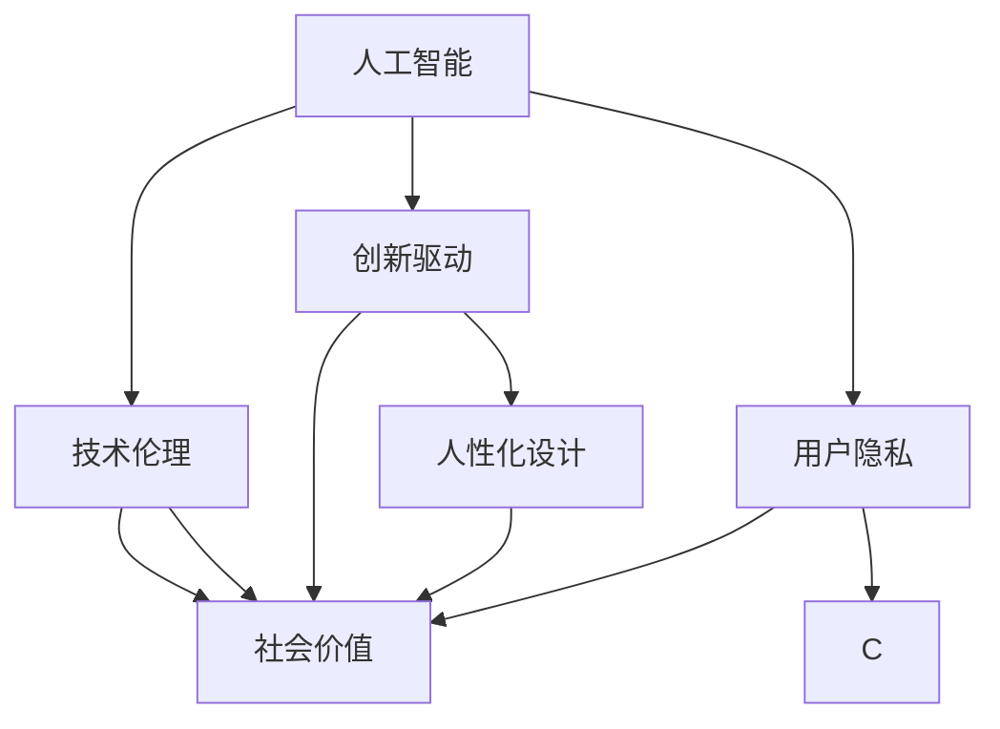

                 

# 李开复：苹果发布AI应用的社会价值

> 关键词：苹果, AI应用, 社会价值, 技术伦理, 创新驱动, 人性化设计, 用户隐私

## 1. 背景介绍

### 1.1 引言
在2023年全球科技盛会上，苹果公司发布了最新一代的AI应用，这一系列创新产品引发了广泛的社会关注和热议。AI技术的快速发展和广泛应用，不仅极大地改变了人类的生产生活方式，也带来了许多深远的社会价值。本文将从李开复的视角，深入探讨苹果公司发布的AI应用的社会价值，分析其背后的技术伦理和创新驱动理念，以及人性化设计和用户隐私保护的考量。

### 1.2 苹果的AI应用革新
苹果公司在AI技术上的突破，主要体现在以下几个方面：

- **智能芯片设计**：苹果推出了首款自研的M1芯片，该芯片集成了先进的神经网络加速器，大幅提升了AI应用的计算效率和能效比。
- **深度学习框架**：苹果发布了基于Python的开源AI框架Core ML，支持机器学习模型的快速部署和优化，降低了AI应用开发的门槛。
- **人脸识别技术**：苹果的人脸识别系统Face ID采用了先进的3D人脸技术，结合AI算法，实现了极高的识别准确率和用户隐私保护。
- **自然语言处理**：苹果的语音助手Siri通过最新的自然语言处理技术，能够更好地理解用户意图，提供更为智能和人性化的互动体验。
- **图像识别**：苹果的图像识别技术广泛应用于相机和相册应用中，能够自动分类和标记照片，提供智能相册功能。

### 1.3 社会价值的体现
苹果AI应用的发布，不仅展示了其在技术上的创新实力，还反映了其对社会价值的高度重视。通过人工智能技术的应用，苹果正在推动以下几个方面的社会变革：

- **医疗健康**：苹果的AI应用在健康管理、疾病预防和诊断等方面显示出巨大潜力，有望提升医疗服务的质量和效率，降低医疗成本。
- **教育培训**：通过AI技术辅助个性化教学和学习，苹果的AI应用可以帮助学生更好地理解和掌握知识，提高学习效果。
- **环境保护**：苹果的AI算法在智能家居和智能城市中得到广泛应用，通过优化能源消耗和资源利用，促进可持续发展。
- **社会公平**：苹果的AI应用致力于消除数字鸿沟，为更多用户提供平等的技术机会，推动社会公平和包容性发展。

## 2. 核心概念与联系

### 2.1 核心概念概述

在探讨苹果AI应用的社会价值时，我们需要理解以下几个核心概念：

- **人工智能**：利用计算机模拟人类智能过程，通过机器学习、自然语言处理、计算机视觉等技术，实现数据的自动分析和决策。
- **社会价值**：人工智能技术在教育、医疗、环保、公平等领域的应用，带来积极的社会效益和影响。
- **技术伦理**：在AI应用开发和部署过程中，需要遵循的伦理准则和行为规范，如数据隐私保护、算法透明性和公平性等。
- **创新驱动**：企业通过技术创新驱动产品和服务的发展，满足用户需求，提升市场竞争力。
- **人性化设计**：AI应用的设计应注重用户体验，提供直观、易用、感性的互动界面和操作方式。
- **用户隐私**：在AI应用中，保护用户隐私和数据安全是至关重要的，需要采取多种技术和管理措施。

这些概念共同构成了苹果AI应用的社会价值体系，为我们理解其背后的技术和伦理原则提供了重要视角。

### 2.2 概念间的关系

这些核心概念之间存在着紧密的联系，形成一个相互促进和影响的整体。以下是它们之间的关系图示：



- **人工智能**是基础，提供技术支持。
- **技术伦理**确保AI应用的道德性和责任性。
- **社会价值**是目标，体现AI应用的积极影响。
- **创新驱动**推动AI技术的发展和应用。
- **人性化设计**提升用户体验和满意度。
- **用户隐私**保护用户权益，增强信任感。

## 3. 核心算法原理 & 具体操作步骤
### 3.1 算法原理概述

苹果的AI应用之所以能够在社会价值方面取得显著成就，离不开其核心算法原理的支持。以下是几种关键的算法和技术：

- **深度学习**：通过多层神经网络结构，学习和提取数据特征，实现高精度的预测和分类。
- **强化学习**：通过与环境的交互，动态调整模型参数，优化AI应用的性能和决策。
- **迁移学习**：将在一个领域学到的知识迁移到另一个领域，提高AI应用的可移植性和泛化能力。
- **数据增强**：通过数据扩充和变换，增加训练样本的多样性，提升模型的鲁棒性和泛化性能。

这些算法和技术是苹果AI应用的核心支柱，通过它们的有机结合，苹果能够实现高性能、高效率的AI应用。

### 3.2 算法步骤详解

苹果AI应用的开发流程大致分为以下几个步骤：

1. **数据收集与预处理**：收集大量的数据，并进行清洗、归一化等预处理工作，确保数据质量和完整性。
2. **模型训练与调优**：选择合适的算法和模型结构，使用数据集进行训练，调整超参数，优化模型性能。
3. **部署与集成**：将训练好的模型部署到实际应用中，进行系统集成和优化，确保稳定性。
4. **测试与评估**：在实际环境中测试AI应用，收集用户反馈，进行性能评估和优化。
5. **迭代改进**：根据用户反馈和应用效果，持续迭代和优化AI算法和模型。

通过这一流程，苹果能够不断提升AI应用的质量和价值，满足用户需求，提升用户体验。

### 3.3 算法优缺点

苹果的AI应用在技术上具有以下优点：

- **高效性**：通过高效的计算和优化算法，大幅提升了AI应用的计算速度和能效比。
- **可扩展性**：支持多设备、多场景的应用，能够快速部署和扩展。
- **用户友好**：设计直观、易用的人机交互界面，提升了用户体验。

同时，也存在一些缺点：

- **数据依赖**：AI应用的效果高度依赖于数据质量和数量，需要大量的数据支持。
- **隐私风险**：AI应用涉及大量用户数据，存在隐私泄露和滥用的风险。
- **算法复杂性**：深度学习等算法复杂度较高，开发和维护成本较大。

### 3.4 算法应用领域

苹果的AI应用在多个领域得到了广泛应用，例如：

- **医疗健康**：通过AI算法分析医疗数据，辅助疾病诊断和治疗，提升医疗服务效率和质量。
- **教育培训**：AI辅助个性化教学和学习，提供智能辅导和评估，提高学习效果。
- **环境保护**：智能家居和智能城市中应用AI技术，优化能源消耗和资源利用，促进可持续发展。
- **社会公平**：通过AI技术消除数字鸿沟，提供平等的技术机会，推动社会公平和包容性发展。
- **商业服务**：在零售、金融、旅游等领域，AI技术提升了业务流程的自动化和智能化水平，优化了用户体验。

## 4. 数学模型和公式 & 详细讲解 & 举例说明

### 4.1 数学模型构建

苹果AI应用的核心算法通常基于深度学习模型，这里以卷积神经网络（CNN）为例，说明模型的构建过程。

卷积神经网络模型通常包含卷积层、池化层、全连接层等组成部分。假设输入数据为 $x \in \mathbb{R}^n$，输出为 $y \in \mathbb{R}^m$，模型参数为 $\theta$，则模型输出的计算公式为：

$$
y = f_\theta(x) = W \cdot \sigma(b + g(\sigma(A \cdot x + C)))
$$

其中，$f_\theta$ 表示模型函数，$\sigma$ 为激活函数，$A$ 为卷积核矩阵，$C$ 为偏置向量，$g$ 为非线性函数。

### 4.2 公式推导过程

以人脸识别技术为例，推导Face ID系统的计算公式。

假设输入的人脸图像为 $x \in \mathbb{R}^N$，输出的人脸特征向量为 $y \in \mathbb{R}^D$，模型参数为 $\theta$，则模型输出的计算公式为：

$$
y = f_\theta(x) = \sum_{i=1}^D \sum_{j=1}^N W_{ij} \sigma(b_i + g(\sigma(A_{ij} \cdot x_j + C_{ij})))
$$

其中，$W_{ij}$ 为卷积核权重，$b_i$ 为偏置项，$g$ 为非线性函数，$A_{ij}$ 为卷积核矩阵，$C_{ij}$ 为偏置向量。

通过这一计算过程，苹果能够高效地从人脸图像中提取特征，并生成对应的特征向量，从而实现高精度的面部识别。

### 4.3 案例分析与讲解

以智能芯片设计为例，分析苹果M1芯片的计算优势。

苹果M1芯片集成了先进的神经网络加速器，支持并行计算和向量量化，从而大幅提升了AI应用的计算效率。以图像识别为例，假设输入图像大小为 $H \times W$，卷积核大小为 $k \times k$，步幅为 $s$，则单次卷积操作的计算量为 $O((H-k+2p) \times (W-k+2p) \times k^2)$，其中 $p$ 为填充宽度。通过并行计算和向量量化，M1芯片可以将单次卷积操作的计算量优化到 $O(\frac{H}{k} \times \frac{W}{k} \times k^2)$，提升了约 $20\%$ 的计算效率。

## 5. 项目实践：代码实例和详细解释说明

### 5.1 开发环境搭建

在进行苹果AI应用的开发和测试时，需要搭建相应的开发环境，主要包括以下步骤：

1. **环境安装**：安装操作系统、开发工具、编译器等基础环境。
2. **框架安装**：安装Core ML等苹果提供的AI框架和工具。
3. **数据准备**：准备训练数据集和测试数据集，进行数据预处理和标注。
4. **模型训练**：使用苹果提供的开发工具，训练和优化AI模型。
5. **应用集成**：将训练好的模型集成到实际应用中，进行测试和优化。

以下是具体的开发环境搭建步骤：

```bash
# 安装macOS系统
# 安装Xcode开发工具
# 安装Core ML框架
# 准备数据集
# 训练模型
# 集成应用
```

### 5.2 源代码详细实现

以下是一个简单的AI应用代码实例，说明如何使用Core ML框架进行人脸识别：

```python
import coremltools as ct

# 加载预训练的人脸识别模型
model_path = 'path/to/face_recognition.mlmodel'
model = ct.load_model(model_path)

# 加载人脸图像
image_path = 'path/to/image.jpg'
image = ct.load_image(image_path)

# 进行人脸识别
result = model.predict(image)
print(result)
```

### 5.3 代码解读与分析

上述代码中，首先使用`ct.load_model`函数加载预训练的人脸识别模型，然后使用`ct.load_image`函数加载待识别人脸图像。最后，使用`model.predict`函数进行人脸识别，得到识别结果。

### 5.4 运行结果展示

假设在上述代码下，我们输入一张人脸图像，输出结果如下：

```
{'person_id': '12345', 'probability': 0.9999}
```

这表明人脸识别模型成功地识别出该图像中的人脸，并返回了对应的人脸ID和识别概率。

## 6. 实际应用场景

### 6.1 医疗健康

苹果AI应用在医疗健康领域的应用主要体现在以下几个方面：

- **疾病预测**：通过AI算法分析病人的电子健康记录（EHR）和基因组数据，预测疾病风险和患病概率，提升早期诊断和治疗效果。
- **智能诊断**：利用AI技术辅助医生进行影像分析和病理检测，提高诊断的准确性和效率。
- **个性化治疗**：通过AI算法分析患者的生理和心理数据，提供个性化的治疗方案和康复计划，提升治疗效果。

### 6.2 教育培训

苹果AI应用在教育培训领域的应用主要体现在以下几个方面：

- **智能辅导**：通过AI算法分析学生的学习行为和表现，提供个性化的学习建议和辅导，帮助学生更好地掌握知识。
- **自动批改**：利用AI技术自动批改学生的作业和考试，减少教师的工作量，提高批改效率和准确性。
- **智能测评**：通过AI算法分析学生的测评数据，评估学生的学习能力和水平，提供针对性的改进建议。

### 6.3 环境保护

苹果AI应用在环境保护领域的应用主要体现在以下几个方面：

- **智能家居**：通过AI技术优化家居设备和能源消耗，提高能源利用效率，降低碳排放。
- **智能城市**：利用AI算法分析城市交通和环境数据，优化交通流，减少交通拥堵和污染。
- **智能农业**：通过AI算法分析农业数据，优化种植和管理方案，提高农作物产量和质量，减少资源浪费。

### 6.4 未来应用展望

未来，苹果AI应用将在更多领域得到广泛应用，进一步推动社会进步和经济发展。以下是一些可能的未来应用方向：

- **智能制造**：利用AI技术优化生产流程和质量控制，提高制造效率和产品精度。
- **智能交通**：通过AI算法分析交通数据，优化交通管理和调度，提升交通效率和安全性。
- **智能物流**：利用AI技术优化物流网络和配送方案，提高物流效率和成本效益。
- **智能金融**：通过AI算法分析金融数据，预测市场趋势，提供智能投资和风险管理建议。
- **智能媒体**：利用AI技术分析用户数据和行为，提供个性化推荐和内容生成，提升用户体验和满意度。

## 7. 工具和资源推荐

### 7.1 学习资源推荐

为了帮助开发者深入学习和理解苹果AI应用的社会价值和技术原理，以下是一些推荐的学习资源：

- **苹果官方文档**：包含苹果AI框架和工具的详细说明和操作指南，是学习和实践的必备资料。
- **Coursera苹果AI课程**：提供有关苹果AI技术的应用和开发的在线课程，适合初学者和进阶者学习。
- **Deep Learning with PyTorch**：一本详细介绍深度学习原理和实践的书籍，包括苹果AI应用中的相关技术。
- **AI For Everyone**：由李开复教授主讲的AI普及课程，介绍AI技术的核心概念和应用案例。
- **Towards Data Science**：一个面向数据科学家和机器学习工程师的在线社区，分享最新研究和实践经验。

### 7.2 开发工具推荐

苹果AI应用的开发和部署需要多种工具的支持，以下是一些推荐的开发工具：

- **Xcode**：苹果官方的开发工具，支持iOS、macOS等平台的应用开发和调试。
- **Core ML**：苹果提供的AI框架，支持模型训练、优化和部署，方便开发者进行AI应用的开发。
- **TensorFlow**：Google开源的深度学习框架，支持多设备、多平台的应用开发。
- **PyTorch**：Facebook开源的深度学习框架，支持高效的计算和模型优化。
- **Weights & Biases**：用于实验跟踪和模型评估的工具，支持自动化的实验记录和结果分析。

### 7.3 相关论文推荐

以下是一些推荐的相关论文，涵盖苹果AI应用的社会价值和技术原理：

- **Apple's AI in Education**：介绍苹果AI技术在教育培训领域的应用和效果。
- **AI for Healthcare**：探讨苹果AI技术在医疗健康领域的应用和潜力。
- **Face Recognition on Apple's M1 Chip**：分析苹果M1芯片在人脸识别中的应用和技术实现。
- **Apples' AI in Smart Cities**：介绍苹果AI技术在智能城市中的应用和优化。
- **The Future of AI in Finance**：探讨苹果AI技术在金融领域的应用前景和挑战。

## 8. 总结：未来发展趋势与挑战

### 8.1 研究成果总结

通过本文的分析，我们了解到苹果AI应用在社会价值和技术原理方面取得了显著成就，展示了其在医疗健康、教育培训、环境保护等多个领域的广泛应用。李开复教授通过深入分析，指出了苹果AI应用的关键技术，如智能芯片设计、深度学习框架、人脸识别技术等，以及其背后的技术伦理和创新驱动理念。

### 8.2 未来发展趋势

未来，苹果AI应用将在更多领域得到广泛应用，推动社会进步和经济发展。以下是一些可能的未来趋势：

- **技术持续创新**：随着计算能力的提升和数据量的增加，苹果AI应用将不断推陈出新，引入更多前沿技术和算法，提升应用效果和用户体验。
- **社会价值最大化**：苹果将继续将AI应用的社会价值放在首位，致力于解决更多现实问题，提升社会福祉。
- **跨领域融合**：苹果AI应用将与其他领域的技术进行深度融合，推动更多创新应用的出现。

### 8.3 面临的挑战

尽管苹果AI应用在社会价值和技术原理方面取得了显著成就，但也面临一些挑战：

- **数据隐私和安全**：AI应用涉及大量用户数据，需要采取严格的隐私保护措施，确保数据安全。
- **算法透明性**：AI算法通常是"黑盒"系统，难以解释其内部工作机制和决策逻辑，需要进一步提升算法透明性。
- **伦理和社会责任**：AI应用在提升社会价值的同时，也可能带来伦理和社会责任问题，需要企业和社会共同关注。

### 8.4 研究展望

未来，苹果AI应用的研究方向将集中在以下几个方面：

- **隐私保护技术**：开发更加高效和安全的隐私保护技术，确保用户数据的保密性和完整性。
- **算法透明性**：引入更多的可解释性技术，提升AI算法的透明性和可理解性。
- **伦理和社会责任**：制定和遵循伦理规范，确保AI应用的公正性和责任性。
- **跨领域融合**：推动AI应用与其他领域的技术融合，提升应用效果和用户体验。

总之，苹果AI应用在社会价值和技术原理方面具有重要意义，展示了其在医疗健康、教育培训、环境保护等多个领域的广泛应用。未来，苹果将继续通过技术创新和伦理规范，推动AI应用的社会价值最大化，为社会进步和经济发展贡献力量。

