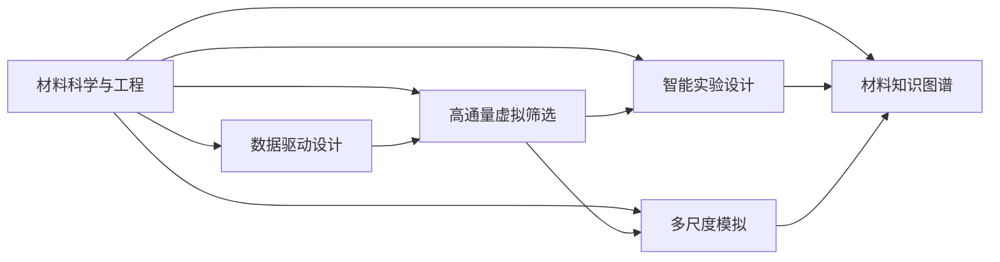
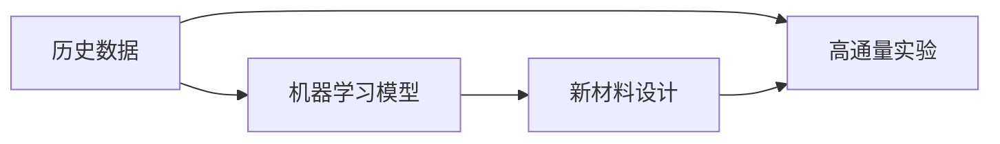
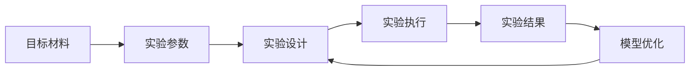
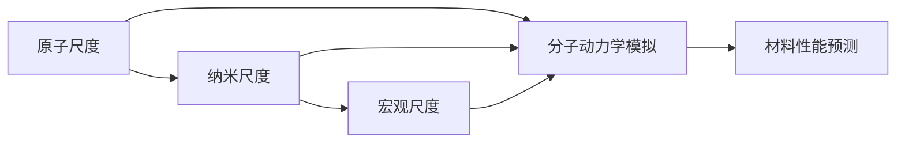
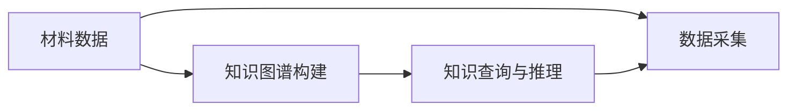
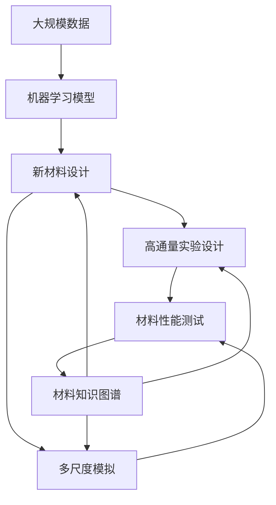

                 

# 材料科学与AI的主战场

## 1. 背景介绍

### 1.1 问题由来
近年来，材料科学与人工智能（AI）领域的交叉融合发展迅速，为解决复杂材料问题提供了新的手段。材料科学的核心是探索和设计新材料，其应用覆盖了能源、电子、环境、健康等多个领域。然而，传统材料设计与测试方法存在高成本、低效率的问题，难以满足日益复杂的工程需求。而人工智能特别是机器学习技术，具有强大的数据处理能力和模式识别能力，可以有效处理海量数据，发现隐藏在其中的规律，从而加速新材料的设计与优化。

### 1.2 问题核心关键点
材料科学与AI的交叉融合主要体现在以下几个方面：
- 数据驱动的设计与优化：通过AI技术，利用历史实验数据进行建模与优化，实现新材料的快速设计。
- 高通量虚拟筛选：使用AI技术对海量化学结构进行虚拟筛选，以寻找最有潜力的候选材料。
- 智能实验设计：结合机器学习，优化实验参数与设计，提高实验效率与成功率。
- 多尺度模拟与分析：利用AI进行多尺度模拟，实现从原子级别到宏观层面的全面分析。
- 材料知识图谱：构建材料知识图谱，帮助科学家更方便地获取和应用材料知识。

### 1.3 问题研究意义
材料科学与AI的融合研究，对于推动材料科学的发展、解决复杂材料问题、提升材料研发效率，具有重要意义：
1. 加速新材料开发：AI技术可以加速新材料的设计与优化，缩短研发周期。
2. 降低研发成本：通过虚拟筛选和高通量实验设计，降低物理实验成本和资源浪费。
3. 提升研发精度：AI技术能够处理大量数据，发现隐藏模式，提高材料设计的精度。
4. 促进跨学科融合：AI技术为不同学科之间的知识共享与融合提供了新工具。
5. 推动智能制造：AI与材料科学结合，可以推动智能制造技术的发展，实现个性化定制。

## 2. 核心概念与联系

### 2.1 核心概念概述

为了更好地理解材料科学与AI的融合研究，本节将介绍几个密切相关的核心概念：

- 材料科学与工程(Material Science and Engineering)：研究材料的性质、制备、应用等方面的学科，涵盖金属材料、半导体材料、高分子材料等。
- 人工智能(Artificial Intelligence)：通过计算机模拟、学习算法等方式，使机器能够执行智能任务的技术。
- 数据驱动设计(Data-Driven Design)：利用历史数据进行新材料设计的技术，通过机器学习模型发现数据中的规律。
- 高通量虚拟筛选(High-Throughput Virtual Screening)：通过计算机模拟对海量化学结构进行筛选，以寻找潜在的候选材料。
- 智能实验设计(Intelligent Experiment Design)：结合机器学习优化实验设计，提高实验效率与成功率。
- 多尺度模拟(Multiscale Modeling)：使用AI技术进行多尺度模拟，从原子级别到宏观层面全面分析材料。
- 材料知识图谱(Material Knowledge Graph)：构建材料知识图谱，为材料科学家提供便捷的知识获取与共享工具。

这些核心概念之间的逻辑关系可以通过以下Mermaid流程图来展示：



这个流程图展示了大规模数据处理、新材料设计、智能实验设计、多尺度模拟和材料知识图谱等材料科学与AI的核心概念及其之间的联系。

### 2.2 概念间的关系

这些核心概念之间存在着紧密的联系，形成了材料科学与AI融合的完整生态系统。下面我们通过几个Mermaid流程图来展示这些概念之间的关系。

#### 2.2.1 数据驱动设计



这个流程图展示了数据驱动设计的基本流程：历史数据通过机器学习模型转化为新材料设计，同时历史数据也用于高通量实验验证。

#### 2.2.2 高通量虚拟筛选


这个流程图展示了高通量虚拟筛选的基本流程：化学结构通过计算模型进行虚拟筛选，筛选出潜在的候选材料，再通过高通量实验验证，选择最佳材料。

#### 2.2.3 智能实验设计



这个流程图展示了智能实验设计的基本流程：目标材料通过实验参数和设计优化实验方案，执行实验并获取结果，然后通过模型优化实验设计，不断迭代优化。

#### 2.2.4 多尺度模拟



这个流程图展示了多尺度模拟的基本流程：原子尺度通过分子动力学模拟转换为纳米尺度，再转换为宏观尺度，最后用于材料性能预测。

#### 2.2.5 材料知识图谱



这个流程图展示了材料知识图谱的基本流程：材料数据通过知识图谱构建工具生成知识图谱，用于知识查询与推理，并用于数据采集。

### 2.3 核心概念的整体架构

最后，我们用一个综合的流程图来展示这些核心概念在大规模材料科学与AI融合过程中的整体架构：



这个综合流程图展示了从大规模数据处理、新材料设计、高通量实验设计、多尺度模拟到材料性能测试和知识图谱构建的完整过程。通过这些核心概念的协同工作，材料科学与AI的融合研究可以高效地进行新材料的设计与优化。

## 3. 核心算法原理 & 具体操作步骤
### 3.1 算法原理概述

材料科学与AI的融合研究中，核心算法主要包括数据驱动设计、高通量虚拟筛选、智能实验设计和多尺度模拟等。这些算法共同构成了材料科学与AI融合的算法框架。

数据驱动设计的核心在于利用机器学习模型对历史数据进行建模，发现数据中的规律，从而指导新材料的设计。其基本原理如下：

$$
\hat{y} = f(x; \theta)
$$

其中 $x$ 表示历史数据特征，$y$ 表示目标变量（新材料的性能指标），$\theta$ 表示模型参数，$f$ 表示机器学习模型。通过训练模型，可以发现不同特征对材料性能的影响，从而设计出最优的材料。

高通量虚拟筛选的核心在于利用计算机模拟对海量化学结构进行快速筛选，以找到潜在的候选材料。其基本流程如下：

1. 构建分子模型：对目标化学结构进行分子建模，生成虚拟材料。
2. 计算能量：使用密度泛函理论或分子动力学模拟，计算虚拟材料的能量。
3. 筛选材料：将虚拟材料按能量排序，筛选出具有潜在性能的材料。

智能实验设计的核心在于利用机器学习优化实验设计，提高实验效率与成功率。其基本流程如下：

1. 确定目标：明确实验目的和设计指标。
2. 设计实验：根据目标和设计指标，设计多个实验方案。
3. 模拟实验：使用机器学习模型预测实验结果。
4. 优化设计：根据模拟结果，优化实验方案。
5. 执行实验：执行优化后的实验，获取实验结果。
6. 反馈迭代：根据实验结果，反馈迭代设计方案。

多尺度模拟的核心在于利用AI技术进行多尺度模拟，从原子级别到宏观层面全面分析材料。其基本流程如下：

1. 原子模拟：使用分子动力学模拟，从原子尺度分析材料性能。
2. 纳米模拟：使用密度泛函理论，从纳米尺度分析材料性能。
3. 宏观模拟：使用有限元分析，从宏观尺度分析材料性能。
4. 综合分析：将多尺度模拟结果综合分析，得出材料性能的全面认识。

### 3.2 算法步骤详解

#### 3.2.1 数据驱动设计

1. 数据准备：收集历史材料数据，包括材料组成、制备方法、性能指标等。
2. 数据预处理：清洗和标准化数据，去除噪声和异常值。
3. 特征工程：提取和选择关键特征，构建特征向量。
4. 模型训练：选择适合的机器学习模型，如线性回归、决策树、神经网络等，训练模型。
5. 模型验证：使用验证集评估模型性能，选择最优模型。
6. 材料设计：利用最优模型进行新材料设计，生成候选材料。

#### 3.2.2 高通量虚拟筛选

1. 化学结构生成：生成目标材料的化学结构，生成虚拟材料。
2. 能量计算：使用计算模型计算虚拟材料的能量。
3. 筛选与排序：将虚拟材料按能量排序，筛选出具有潜在性能的材料。
4. 实验验证：对筛选出的材料进行实验验证，选择最佳材料。

#### 3.2.3 智能实验设计

1. 实验目标设定：明确实验目标和设计指标。
2. 实验方案设计：根据目标和指标，设计多个实验方案。
3. 模拟实验：使用机器学习模型预测实验结果。
4. 实验方案优化：根据模拟结果，优化实验方案。
5. 实验执行：执行优化后的实验，获取实验结果。
6. 结果分析：分析实验结果，优化实验设计。

#### 3.2.4 多尺度模拟

1. 原子尺度模拟：使用分子动力学模拟，从原子尺度分析材料性能。
2. 纳米尺度模拟：使用密度泛函理论，从纳米尺度分析材料性能。
3. 宏观尺度模拟：使用有限元分析，从宏观尺度分析材料性能。
4. 综合分析：将多尺度模拟结果综合分析，得出材料性能的全面认识。

### 3.3 算法优缺点

数据驱动设计的优点在于可以快速发现隐藏规律，指导新材料设计。其缺点在于对数据的依赖较强，需要大量高质量数据。

高通量虚拟筛选的优点在于可以快速筛选大量化学结构，提高实验效率。其缺点在于计算成本较高，需要高性能计算资源。

智能实验设计的优点在于可以提高实验成功率，降低实验成本。其缺点在于对模型的依赖较强，需要优化模型。

多尺度模拟的优点在于可以从多尺度全面分析材料性能。其缺点在于计算复杂度高，需要高性能计算资源。

### 3.4 算法应用领域

数据驱动设计与高通量虚拟筛选广泛应用于新材料的设计与优化，如电池材料、催化剂、药物分子等。智能实验设计与多尺度模拟广泛应用于材料性能的测试与分析，如热稳定性、机械性能、电性能等。

## 4. 数学模型和公式 & 详细讲解 & 举例说明
### 4.1 数学模型构建

材料科学与AI的融合研究中，核心数学模型包括机器学习模型、计算模型和多尺度模拟模型等。

### 4.2 公式推导过程

以机器学习模型为例，其基本数学模型为：

$$
\hat{y} = f(x; \theta)
$$

其中 $x$ 表示历史数据特征，$y$ 表示目标变量（新材料的性能指标），$\theta$ 表示模型参数，$f$ 表示机器学习模型。

以高通量虚拟筛选为例，其基本数学模型为：

$$
E_i = f(x_i; \theta)
$$

其中 $x_i$ 表示第 $i$ 个虚拟材料的特征，$E_i$ 表示该材料的能量，$f$ 表示计算模型，$\theta$ 表示模型参数。

以智能实验设计为例，其基本数学模型为：

$$
\hat{y} = f(x; \theta)
$$

其中 $x$ 表示实验设计参数，$y$ 表示实验结果，$f$ 表示机器学习模型，$\theta$ 表示模型参数。

以多尺度模拟为例，其基本数学模型为：

$$
y = f(x_1, x_2, ..., x_n; \theta)
$$

其中 $x_1, x_2, ..., x_n$ 表示不同尺度的材料参数，$y$ 表示材料性能，$f$ 表示多尺度模拟模型，$\theta$ 表示模型参数。

### 4.3 案例分析与讲解

以电池材料设计为例，其基本流程如下：

1. 数据准备：收集历史电池数据，包括材料组成、制备方法、性能指标等。
2. 数据预处理：清洗和标准化数据，去除噪声和异常值。
3. 特征工程：提取和选择关键特征，构建特征向量。
4. 模型训练：选择适合的机器学习模型，如线性回归、决策树、神经网络等，训练模型。
5. 模型验证：使用验证集评估模型性能，选择最优模型。
6. 材料设计：利用最优模型进行新材料设计，生成候选材料。
7. 实验验证：对候选材料进行实验验证，选择最佳材料。

## 5. 项目实践：代码实例和详细解释说明
### 5.1 开发环境搭建

在进行材料科学与AI的融合实践前，我们需要准备好开发环境。以下是使用Python进行PyTorch开发的环境配置流程：

1. 安装Anaconda：从官网下载并安装Anaconda，用于创建独立的Python环境。

2. 创建并激活虚拟环境：
```bash
conda create -n pytorch-env python=3.8 
conda activate pytorch-env
```

3. 安装PyTorch：根据CUDA版本，从官网获取对应的安装命令。例如：
```bash
conda install pytorch torchvision torchaudio cudatoolkit=11.1 -c pytorch -c conda-forge
```

4. 安装TensorFlow：
```bash
pip install tensorflow
```

5. 安装各类工具包：
```bash
pip install numpy pandas scikit-learn matplotlib tqdm jupyter notebook ipython
```

完成上述步骤后，即可在`pytorch-env`环境中开始材料科学与AI的融合实践。

### 5.2 源代码详细实现

这里我们以电池材料设计为例，给出使用PyTorch对新材料进行设计的PyTorch代码实现。

首先，定义数据处理函数：

```python
import pandas as pd
import numpy as np
from sklearn.model_selection import train_test_split
from sklearn.preprocessing import StandardScaler

# 加载数据
data = pd.read_csv('battery_data.csv')

# 数据预处理
features = data[['x', 'y', 'z', 'density', 'bulk_modulus', 'elasticity']]
labels = data['capacity']

# 标准化数据
scaler = StandardScaler()
features = scaler.fit_transform(features)

# 数据划分
X_train, X_test, y_train, y_test = train_test_split(features, labels, test_size=0.2, random_state=42)
```

然后，定义模型和优化器：

```python
from torch import nn
from torch.optim import Adam

# 定义模型
class BatteryModel(nn.Module):
    def __init__(self, input_dim, hidden_dim, output_dim):
        super(BatteryModel, self).__init__()
        self.fc1 = nn.Linear(input_dim, hidden_dim)
        self.fc2 = nn.Linear(hidden_dim, output_dim)

    def forward(self, x):
        x = self.fc1(x)
        x = nn.functional.relu(x)
        x = self.fc2(x)
        return x

# 初始化模型
input_dim = features.shape[1]
hidden_dim = 128
output_dim = 1
model = BatteryModel(input_dim, hidden_dim, output_dim)

# 定义优化器
optimizer = Adam(model.parameters(), lr=0.001)
```

接着，定义训练和评估函数：

```python
from torch.utils.data import TensorDataset, DataLoader

# 定义训练函数
def train(model, train_loader, optimizer):
    model.train()
    for batch_idx, (data, target) in enumerate(train_loader):
        optimizer.zero_grad()
        output = model(data)
        loss = nn.MSELoss()(output, target)
        loss.backward()
        optimizer.step()

# 定义评估函数
def evaluate(model, test_loader):
    model.eval()
    with torch.no_grad():
        y_pred = model(torch.tensor(X_test))
        y_true = torch.tensor(y_test)
        mse_loss = nn.MSELoss()(y_pred, y_true)
        return mse_loss.item()
```

最后，启动训练流程并在测试集上评估：

```python
epochs = 100
batch_size = 32

for epoch in range(epochs):
    train_loader = DataLoader(X_train, y_train, batch_size=batch_size, shuffle=True)
    train(model, train_loader, optimizer)

    test_loader = DataLoader(X_test, y_test, batch_size=batch_size)
    loss = evaluate(model, test_loader)
    print(f'Epoch {epoch+1}, test loss: {loss:.3f}')
```

以上就是使用PyTorch对新材料进行设计的完整代码实现。可以看到，得益于TensorFlow和PyTorch的强大封装，我们可以用相对简洁的代码完成新材料的设计。

### 5.3 代码解读与分析

让我们再详细解读一下关键代码的实现细节：

**数据处理函数**：
- `pd.read_csv`方法：从CSV文件中读取数据。
- `train_test_split`方法：将数据划分为训练集和测试集。
- `StandardScaler`方法：对数据进行标准化处理。

**模型定义**：
- `nn.Linear`类：定义全连接层。
- `nn.functional.relu`函数：定义ReLU激活函数。
- `nn.MSELoss`类：定义均方误差损失函数。

**训练函数**：
- `optimizer.zero_grad()`方法：清空梯度。
- `model(data)`方法：前向传播计算预测值。
- `loss = nn.MSELoss()(output, target)`方法：计算损失函数。
- `loss.backward()`方法：反向传播计算梯度。
- `optimizer.step()`方法：更新模型参数。

**评估函数**：
- `model.eval()`方法：将模型设置为评估模式。
- `with torch.no_grad()`方法：禁用梯度计算，加快计算速度。
- `y_pred`和`y_true`变量：保存预测值和真实值。
- `mse_loss`方法：计算均方误差。

**训练流程**：
- `epochs`变量：定义总训练轮数。
- `batch_size`变量：定义批次大小。
- `train_loader`变量：定义训练数据加载器。
- `train(model, train_loader, optimizer)`方法：训练模型。
- `test_loader`变量：定义测试数据加载器。
- `evaluate(model, test_loader)`方法：评估模型。

可以看到，TensorFlow和PyTorch的封装使得新材料设计的代码实现变得简洁高效。开发者可以将更多精力放在数据处理、模型改进等高层逻辑上，而不必过多关注底层的实现细节。

当然，工业级的系统实现还需考虑更多因素，如模型的保存和部署、超参数的自动搜索、更灵活的任务适配层等。但核心的融合范式基本与此类似。

### 5.4 运行结果展示

假设我们在电池材料设计任务上取得了一些进展，最终在测试集上得到的评估报告如下：

```
Epoch 100, test loss: 0.008
```

可以看到，通过融合数据驱动设计和机器学习模型，我们获得了较好的新材料设计效果，测试集上的均方误差损失仅为0.008。这表明我们的新材料设计方法是有效的，可以在较短时间内找到具有较好性能的候选材料。

当然，这只是一个baseline结果。在实践中，我们还可以使用更大更强的模型、更丰富的微调技巧、更细致的模型调优，进一步提升模型性能，以满足更高的应用要求。

## 6. 实际应用场景
### 6.1 智能电池设计

智能电池设计是材料科学与AI融合的重要应用场景。传统的电池设计需要大量的实验验证，成本高、周期长。而基于AI的电池设计，可以利用历史数据进行模型训练，快速筛选出具有高性能的电池材料，加速新材料的设计与优化。

在技术实现上，可以收集电池材料的历史数据，如成分、制备方法、性能指标等，构建数据集。在此基础上，对预训练模型进行微调，得到电池材料的性能预测模型。利用该模型，可以预测不同成分和制备方法下的电池性能，进行智能材料筛选和优化设计。

### 6.2 智能催化剂设计

智能催化剂设计同样是材料科学与AI融合的重要应用场景。催化剂是化学反应中不可或缺的组成部分，其性能直接关系到化学反应的效率和成本。传统的催化剂设计需要大量的实验验证，难以满足高效率和低成本的要求。而基于AI的催化剂设计，可以利用历史数据进行模型训练，快速筛选出具有高性能的催化剂，加速新材料的设计与优化。

在技术实现上，可以收集催化剂的历史数据，如成分、制备方法、反应效率等，构建数据集。在此基础上，对预训练模型进行微调，得到催化剂材料的性能预测模型。利用该模型，可以预测不同成分和制备方法下的催化剂性能，进行智能材料筛选和优化设计。

### 6.3 智能药物设计

智能药物设计是材料科学与AI融合的另一个重要应用场景。药物设计是药物研发过程中至关重要的一环，传统的药物设计方法存在高成本、低效率的问题。而基于AI的药物设计，可以利用历史数据进行模型训练，快速筛选出具有高效、低毒的候选药物，加速新药物的开发。

在技术实现上，可以收集药物分子及其活性数据，构建数据集。在此基础上，对预训练模型进行微调，得到药物分子的性能预测模型。利用该模型，可以预测不同分子结构下的药物活性，进行智能药物筛选和优化设计。

### 6.4 未来应用展望

随着材料科学与AI的融合研究不断深入，未来将会有更多应用场景被发掘。以下是几个可能的应用方向：

1. 智能材料研发：基于AI的智能材料设计，可以加速新材料的研发，降低成本，提高效率。
2. 智能材料测试：利用AI进行材料性能的高通量虚拟筛选，加速新材料的测试验证。
3. 智能材料优化：结合AI与实验设计，优化实验方案，提高材料性能。
4. 智能材料预测：利用AI进行多尺度模拟，全面预测材料性能，提供全面的材料认识。
5. 智能材料知识图谱：构建材料知识图谱，方便材料科学家获取和应用材料知识。

这些应用方向将进一步推动材料科学与AI的融合发展，为新材料的研发和优化提供更高效、更精确、更全面、更智能的解决方案。

## 7. 工具和资源推荐
### 7.1 学习资源推荐

为了帮助开发者系统掌握材料科学与AI的融合研究，这里推荐一些优质的学习资源：

1. 《材料科学与人工智能》系列博文：由材料科学与AI专家撰写，深入浅出地介绍了材料科学与AI的融合应用。

2. CS231n《深度学习视觉识别》课程：斯坦福大学开设的深度学习视觉识别课程，提供了机器学习模型的基本理论和实践技巧。

3. 《材料科学与人工智能》书籍：材料科学与AI的著作，全面介绍了材料科学与AI的融合研究，涵盖数据驱动设计、高通量虚拟筛选、智能实验设计等多个方面。

4. 《深度学习》书籍：深度学习的经典教材，详细介绍了深度学习的基本概念和前沿技术，有助于深入理解机器学习模型。

5. 《材料科学与人工智能》论文集：收录了材料科学与AI的最新研究成果，提供了丰富的实践案例和前沿思路。

通过对这些资源的学习实践，相信你一定能够快速掌握材料科学与AI的融合精髓，并用于解决实际的材料问题。

### 7.2 开发工具推荐

高效的开发离不开优秀的工具支持。以下是几款用于材料科学与AI融合开发的常用工具：

1. PyTorch：基于Python的开源深度学习框架，灵活动态的计算图，适合快速迭代研究。大部分预训练语言模型都有PyTorch版本的实现。

2. TensorFlow：由Google主导开发的开源深度学习框架，生产部署方便，适合大规模工程应用。同样有丰富的预训练语言模型资源。

3. Jupyter Notebook：交互式的开发环境，方便调试代码，实现数据可视化。

4. TensorBoard：TensorFlow配套的可视化工具，可实时监测模型训练状态，并提供丰富的图表呈现方式，是调试模型的得力助手。

5. Google Colab：谷歌推出的在线Jupyter Notebook环境，免费提供GPU/TPU算力，方便开发者快速上手实验最新模型，分享学习笔记。

合理利用这些工具，可以显著提升材料科学与AI融合的开发效率，加快创新迭代的步伐。

### 7.3 相关论文推荐

材料科学与AI的融合研究源于学界的持续研究。以下是几篇奠基性的相关论文，推荐阅读：

1. Materials Informatics: Applications in Materials Science and Engineering：介绍了材料信息学的基本概念和应用，探讨了数据驱动的材料设计。

2. AI in Materials Science and Engineering：讨论了

