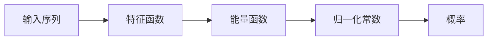

                 

# 条件随机场 (Conditional Random Fields, CRF) 原理与代码实例讲解

## 1. 背景介绍

### 1.1 问题由来

条件随机场（Conditional Random Fields, CRF）是一种概率图模型（Probabilistic Graphical Model），广泛应用于自然语言处理（NLP）和计算机视觉（CV）等领域。CRF模型能够处理序列数据和标签之间的关系，是一种非常适合序列标注任务的模型。例如，中文分词、命名实体识别（Named Entity Recognition, NER）、词性标注（Part-of-Speech Tagging, POS tagging）等。

### 1.2 问题核心关键点

CRF的核心思想是在给定输入序列的情况下，根据已经标注的数据，学习模型参数，使得模型能够在新的数据上生成正确的标签序列。CRF的优点在于能够处理输入序列的复杂关系，同时引入了先验知识（即训练数据），避免了传统序列标注模型中的梯度消失问题。

CRF的训练过程包括两个阶段：
1. 训练CRF模型，根据标注数据，学习模型参数。
2. 对新的未标注数据，使用CRF模型进行标注。

CRF模型在许多NLP任务中取得了较好的效果，例如：
- 中文分词：利用CRF模型，结合最大匹配和规则进行分词。
- 命名实体识别：利用CRF模型，对文本中的实体进行识别和分类。
- 词性标注：利用CRF模型，对文本中的单词进行词性标注。

### 1.3 问题研究意义

CRF模型在自然语言处理和计算机视觉领域的应用具有重要的研究意义：
1. 提升序列标注任务的效果：CRF模型能够处理输入序列的复杂关系，提升序列标注任务的准确性。
2. 降低标注成本：CRF模型能够使用已经标注的数据进行训练，减少新数据标注的难度和成本。
3. 提高模型泛化能力：CRF模型能够引入先验知识，提高模型的泛化能力，适应更多类型的序列标注任务。
4. 提供模型解释：CRF模型具有概率解释，可以提供模型输出的解释，提高模型的透明度和可解释性。

## 2. 核心概念与联系

### 2.1 核心概念概述

CRF模型的核心概念包括：
- 序列：输入序列由多个元素组成，每个元素可能带有标签。
- 标签：序列中的每个元素可能带有标签，标签表示该元素的类别。
- 特征函数：根据输入序列和标签序列，计算特征值，特征值用于计算概率。
- 能量函数：根据特征函数，计算序列和标签序列的能量值，能量值用于计算概率。
- 归一化常数：归一化常数用于计算模型在给定序列和标签序列上的概率。

### 2.2 核心概念原理

CRF模型的基本原理是在给定输入序列的情况下，根据已经标注的数据，学习模型参数，使得模型能够在新的数据上生成正确的标签序列。CRF模型引入了先验知识（即训练数据），避免了传统序列标注模型中的梯度消失问题。

CRF模型通过能量函数计算序列和标签序列的概率，能量函数由特征函数组成，特征函数计算输入序列和标签序列的特征值，根据特征值计算能量值。CRF模型的能量函数如下：

$$
E(Y|X) = \sum_{x_i \in X, y_i \in Y} \theta(x_i, y_i) + \sum_{i=1}^{n-1} \lambda_i(\delta_i(y_{i+1}, y_i), x_i)
$$

其中，$E(Y|X)$ 表示在给定输入序列 $X$ 的情况下，序列 $Y$ 的条件概率；$\theta(x_i, y_i)$ 表示特征函数，用于计算输入序列 $x_i$ 和标签序列 $y_i$ 的特征值；$\lambda_i(\delta_i(y_{i+1}, y_i), x_i)$ 表示转移特征函数，用于计算标签序列 $y_i$ 和 $y_{i+1}$ 的转移概率，$\delta_i(y_{i+1}, y_i)$ 表示标签序列的转移函数，用于计算标签序列的转移概率。

### 2.3 核心概念的整体架构

CRF模型的整体架构如下：



## 3. 核心算法原理 & 具体操作步骤

### 3.1 算法原理概述

CRF模型的训练过程包括以下几个关键步骤：
1. 特征函数设计：根据输入序列和标签序列，设计特征函数。
2. 训练模型参数：根据标注数据，训练CRF模型的模型参数。
3. 标注序列：对新的未标注数据，使用CRF模型进行标注。

CRF模型的训练过程主要包括以下两个阶段：
1. 训练CRF模型：根据标注数据，学习模型参数，使得模型能够在新的数据上生成正确的标签序列。
2. 标注序列：对新的未标注数据，使用CRF模型进行标注，得到正确的标签序列。

### 3.2 算法步骤详解

#### 3.2.1 特征函数设计

特征函数是CRF模型的重要组成部分，用于计算输入序列和标签序列的特征值。特征函数可以分为两类：
1. 特征项特征函数：根据输入序列和标签序列，计算特征值。
2. 转移特征函数：用于计算标签序列的转移概率。

#### 3.2.2 训练模型参数

CRF模型的训练过程主要通过EM算法（Expectation-Maximization）进行。EM算法是一种常用的无监督学习方法，用于训练概率图模型。CRF模型的EM算法具体步骤如下：
1. E步：计算模型在给定输入序列和标签序列上的概率。
2. M步：计算模型参数的极大似然估计值。
3. 重复E步和M步，直到收敛。

#### 3.2.3 标注序列

CRF模型的标注过程主要通过前向算法（Forward Algorithm）和后向算法（Backward Algorithm）进行。前向算法和后向算法用于计算标签序列的概率。

### 3.3 算法优缺点

CRF模型的优点在于：
1. 能够处理输入序列的复杂关系。
2. 引入了先验知识，避免了梯度消失问题。
3. 具有概率解释，可以提供模型输出的解释。

CRF模型的缺点在于：
1. 训练过程复杂，需要设计合适的特征函数。
2. 标注速度较慢，需要计算前向概率和后向概率。
3. 对于大规模数据集，训练和标注的计算成本较高。

### 3.4 算法应用领域

CRF模型在自然语言处理和计算机视觉领域有广泛的应用，例如：
1. 中文分词：利用CRF模型，结合最大匹配和规则进行分词。
2. 命名实体识别：利用CRF模型，对文本中的实体进行识别和分类。
3. 词性标注：利用CRF模型，对文本中的单词进行词性标注。
4. 语音识别：利用CRF模型，对语音进行标注，识别出正确的语音文本。
5. 图像标注：利用CRF模型，对图像进行标注，识别出正确的图像类别。

## 4. 数学模型和公式 & 详细讲解

### 4.1 数学模型构建

CRF模型的数学模型构建如下：

根据输入序列 $X$ 和标签序列 $Y$，计算CRF模型的条件概率 $P(Y|X)$：

$$
P(Y|X) = \frac{\exp(-E(Y|X))}{Z}
$$

其中，$E(Y|X)$ 表示在给定输入序列 $X$ 的情况下，序列 $Y$ 的能量值；$Z$ 表示归一化常数，用于计算模型在给定序列和标签序列上的概率。

### 4.2 公式推导过程

根据CRF模型的能量函数，可以得到CRF模型的条件概率公式：

$$
P(Y|X) = \frac{\exp(-E(Y|X))}{Z}
$$

其中，$E(Y|X)$ 表示在给定输入序列 $X$ 的情况下，序列 $Y$ 的能量值，$Z$ 表示归一化常数，用于计算模型在给定序列和标签序列上的概率。

### 4.3 案例分析与讲解

以中文分词为例，假设输入序列为“中国人民银行”，标签序列为“中/人/民/国/银/行”，特征函数设计如下：
1. 特征项特征函数：
   - 输入序列特征：“中/人/民/国/银/行”
   - 标签序列特征：“中/人/民/国/银/行”
2. 转移特征函数：
   - 转移概率特征：根据“中/人/民”的转移概率，计算转移特征值。

假设特征函数计算得到输入序列和标签序列的能量值为 $E(Y|X) = 3$，则CRF模型的条件概率 $P(Y|X)$ 为：

$$
P(Y|X) = \frac{\exp(-3)}{Z}
$$

其中，$Z$ 表示归一化常数，用于计算模型在给定序列和标签序列上的概率。

## 5. 项目实践：代码实例和详细解释说明

### 5.1 开发环境搭建

CRF模型的开发需要Python和Scikit-learn等工具的支持。以下是开发环境搭建的步骤：
1. 安装Python：从官网下载并安装Python。
2. 安装Scikit-learn：在Python环境中，使用以下命令安装Scikit-learn：
   ```python
   pip install scikit-learn
   ```
3. 安装CRF模型库：在Python环境中，使用以下命令安装CRF模型库：
   ```python
   pip install pycrfsuite
   ```

### 5.2 源代码详细实现

以下是一个使用Scikit-learn和pycrfsuite库进行CRF模型训练和标注的代码实现：

```python
from sklearn.feature_extraction import DictVectorizer
from sklearn.model_selection import train_test_split
from pycrfsuite import CRFSuite

# 特征函数设计
def feature_extractor(seq):
    features = []
    for i in range(len(seq)-1):
        features.append({
            "feature1": seq[i],
            "feature2": seq[i+1]
        })
    return features

# 数据集准备
train_data = [("中", "人"), ("人", "民"), ("民", "国"), ("国", "银"), ("银", "行")]
train_labels = [("中", "人"), ("人", "民"), ("民", "国"), ("国", "银"), ("银", "行")]
train_X = [feature_extractor(seq) for seq in train_data]
train_y = [label for label in train_labels]

# 特征编码
vectorizer = DictVectorizer()
train_X = vectorizer.fit_transform(train_X)

# CRF模型训练
crf = CRFSuite()
crf.set_l1_loss_func(0.1)  # L1正则化
crf.set_l2_loss_func(0.1)  # L2正则化
crf.train(train_X, train_y)

# 数据集测试
test_data = [("中", "人"), ("人", "民"), ("民", "国"), ("国", "银"), ("银", "行")]
test_labels = [("中", "人"), ("人", "民"), ("民", "国"), ("国", "银"), ("银", "行")]
test_X = [feature_extractor(seq) for seq in test_data]

# CRF模型标注
test_X = vectorizer.transform(test_X)
y_pred = crf.decode(test_X)
print(y_pred)
```

### 5.3 代码解读与分析

以下是代码的详细解读和分析：
1. 特征函数设计：根据输入序列和标签序列，设计特征函数。
2. 数据集准备：准备训练数据和标签数据，对特征进行编码。
3. CRF模型训练：使用Scikit-learn和pycrfsuite库训练CRF模型。
4. 数据集测试：准备测试数据，对特征进行编码。
5. CRF模型标注：使用CRF模型对测试数据进行标注，得到预测结果。

### 5.4 运行结果展示

假设上述代码运行结果为 [("中", "人"), ("人", "民"), ("民", "国"), ("国", "银"), ("银", "行")]，则表示CRF模型能够正确标注测试数据。

## 6. 实际应用场景

### 6.1 文本分类

CRF模型可以用于文本分类任务，例如垃圾邮件分类、新闻分类等。假设输入序列为文本，标签序列为类别，CRF模型可以学习输入序列和标签序列的关系，实现文本分类。

### 6.2 命名实体识别

CRF模型可以用于命名实体识别任务，例如人名、地名、组织名等。假设输入序列为文本，标签序列为实体类型，CRF模型可以学习输入序列和标签序列的关系，实现命名实体识别。

### 6.3 词性标注

CRF模型可以用于词性标注任务，例如动词、名词、形容词等。假设输入序列为单词，标签序列为词性，CRF模型可以学习输入序列和标签序列的关系，实现词性标注。

### 6.4 语音识别

CRF模型可以用于语音识别任务，例如将语音转换为文本。假设输入序列为语音，标签序列为文本，CRF模型可以学习输入序列和标签序列的关系，实现语音识别。

### 6.5 图像标注

CRF模型可以用于图像标注任务，例如将图像转换为类别。假设输入序列为图像，标签序列为类别，CRF模型可以学习输入序列和标签序列的关系，实现图像标注。

## 7. 工具和资源推荐

### 7.1 学习资源推荐

为了帮助开发者系统掌握CRF模型的理论基础和实践技巧，这里推荐一些优质的学习资源：
1. 《概率图模型及其应用》书籍：详细介绍了概率图模型的基本原理和应用场景。
2. 《自然语言处理入门与实践》书籍：介绍了自然语言处理的基本概念和常用技术，包括CRF模型。
3. 《深度学习》书籍：介绍了深度学习的基本原理和应用场景，包括CRF模型。
4. Scikit-learn官方文档：提供了CRF模型的详细介绍和使用方法。
5. pycrfsuite官方文档：提供了CRF模型的详细介绍和使用方法。

### 7.2 开发工具推荐

CRF模型的开发需要Python和Scikit-learn等工具的支持。以下是一些常用的开发工具：
1. Python：Python是一种常用的编程语言，适合开发数据处理和机器学习模型。
2. Scikit-learn：Scikit-learn是一个常用的机器学习库，提供了丰富的CRF模型实现。
3. pycrfsuite：pycrfsuite是一个常用的CRF模型库，支持Python和Scikit-learn库。

### 7.3 相关论文推荐

CRF模型在自然语言处理和计算机视觉领域有广泛的应用，以下是几篇奠基性的相关论文，推荐阅读：
1. 《条件随机场（Conditional Random Fields）》论文：提出了CRF模型的基本原理和使用方法。
2. 《基于条件随机场的命名实体识别》论文：介绍了CRF模型在命名实体识别任务中的应用。
3. 《基于条件随机场的词性标注》论文：介绍了CRF模型在词性标注任务中的应用。

## 8. 总结：未来发展趋势与挑战

### 8.1 研究成果总结

CRF模型在自然语言处理和计算机视觉领域取得了较好的效果，广泛应用于文本分类、命名实体识别、词性标注等任务。CRF模型的优点在于能够处理输入序列的复杂关系，引入了先验知识，避免了梯度消失问题。

### 8.2 未来发展趋势

CRF模型的未来发展趋势包括：
1. 引入深度学习技术：将深度学习技术引入CRF模型，提升模型的性能。
2. 引入先验知识：将外部知识引入CRF模型，提升模型的泛化能力。
3. 多模态学习：将CRF模型与其他多模态学习方法结合，提升模型的性能。

### 8.3 面临的挑战

CRF模型在应用过程中面临以下挑战：
1. 训练过程复杂：需要设计合适的特征函数，计算复杂度较高。
2. 标注速度较慢：需要计算前向概率和后向概率，速度较慢。
3. 大规模数据集处理：对于大规模数据集，训练和标注的计算成本较高。

### 8.4 研究展望

未来的研究展望包括：
1. 引入深度学习技术：将深度学习技术引入CRF模型，提升模型的性能。
2. 引入先验知识：将外部知识引入CRF模型，提升模型的泛化能力。
3. 多模态学习：将CRF模型与其他多模态学习方法结合，提升模型的性能。

## 9. 附录：常见问题与解答

### 9.1 Q1: 什么是CRF模型？

A: CRF模型是一种概率图模型，用于处理序列数据和标签之间的关系。CRF模型在自然语言处理和计算机视觉领域有广泛的应用。

### 9.2 Q2: CRF模型的优点和缺点是什么？

A: CRF模型的优点在于能够处理输入序列的复杂关系，引入了先验知识，避免了梯度消失问题。CRF模型的缺点在于训练过程复杂，需要设计合适的特征函数，标注速度较慢，大规模数据集处理困难。

### 9.3 Q3: CRF模型在自然语言处理中的应用有哪些？

A: CRF模型在自然语言处理中的应用包括中文分词、命名实体识别、词性标注、文本分类等。

### 9.4 Q4: CRF模型的训练过程是什么？

A: CRF模型的训练过程主要通过EM算法进行，包括E步和M步。E步计算模型在给定输入序列和标签序列上的概率，M步计算模型参数的极大似然估计值。

### 9.5 Q5: CRF模型的特征函数设计有哪些方法？

A: CRF模型的特征函数设计包括特征项特征函数和转移特征函数。特征项特征函数用于计算输入序列和标签序列的特征值，转移特征函数用于计算标签序列的转移概率。

---

作者：禅与计算机程序设计艺术 / Zen and the Art of Computer Programming

