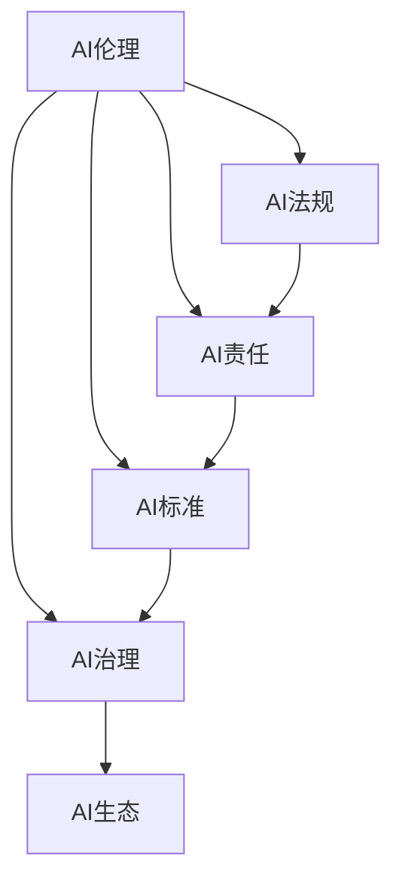
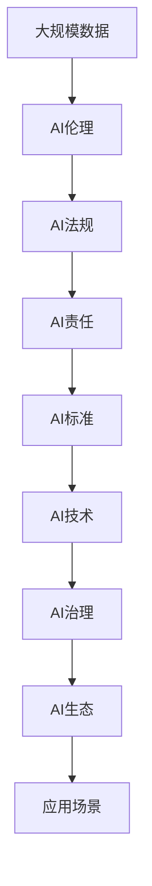

                 

# 构建健康AI生态:初创企业的责任与机遇

## 1. 背景介绍

### 1.1 问题由来
近年来，人工智能(AI)技术在各行各业取得了显著进展，极大地提升了生产效率和用户体验。然而，随着AI技术的普及，也伴随着一系列的伦理、法律、隐私等社会问题。这些问题不仅限制了AI技术的进一步发展，也对初创企业提出了更高的社会责任要求。

### 1.2 问题核心关键点
在AI生态系统中，初创企业扮演着重要角色，但同时也面临着多重挑战：如何构建健康的AI生态系统，如何在技术创新与伦理责任之间取得平衡，如何确保AI技术的广泛应用不会带来负面影响。

### 1.3 问题研究意义
构建健康的AI生态系统，不仅有助于推动AI技术的持续创新，还能保障技术应用的安全性和可靠性，增强公众对AI技术的信任。对初创企业而言，深入研究这些问题，不仅能提升企业的社会责任形象，还能为其带来新的发展机遇。

## 2. 核心概念与联系

### 2.1 核心概念概述

为更好地理解初创企业在构建健康AI生态系统中的角色和责任，本节将介绍几个密切相关的核心概念：

- **AI伦理(AI Ethics)**：研究如何确保AI技术的开发和应用不会对人类社会产生负面影响，包括数据隐私、公平性、透明性、可解释性等伦理问题。
- **AI法规(AI Regulation)**：指各国政府对AI技术进行立法监管的法律框架，旨在规范AI技术的应用，保障公共利益和社会安全。
- **AI责任(AI Responsibility)**：涉及企业在使用AI技术时，需要承担的责任和义务，包括数据安全、模型公正性、算法透明度等。
- **AI标准(AI Standards)**：由行业组织或技术社区制定的一套AI技术开发和应用标准，旨在提升技术质量和应用规范性。
- **AI治理(AI Governance)**：涉及如何建立和维护AI生态系统的治理结构，确保技术发展的健康有序。

这些核心概念之间的逻辑关系可以通过以下Mermaid流程图来展示：



这个流程图展示了几大核心概念在AI生态系统中的相互作用和共同目标：

1. AI伦理和法规共同构成AI技术的法律和道德底线。
2. AI责任明确了企业在技术开发和应用中应承担的义务。
3. AI标准提供了技术开发和应用的最佳实践指导。
4. AI治理确保了技术生态的规范性和健康性。

这些概念共同构成了构建健康AI生态系统的基础，初创企业需要在这几方面做好平衡和实践。

### 2.2 概念间的关系

这些核心概念之间存在着紧密的联系，形成了构建健康AI生态系统的整体框架。下面我通过几个Mermaid流程图来展示这些概念之间的关系。

#### 2.2.1 AI伦理与法规的关系


这个流程图展示了AI伦理与法规的相互作用。AI伦理为AI法规提供了伦理基础，AI法规则为AI伦理提供了法律保障。

#### 2.2.2 AI责任与标准的关系


这个流程图展示了AI责任与标准的相互作用。AI责任为AI标准提供了具体的实践方向，AI标准则为AI责任的落实提供了操作规范。

#### 2.2.3 AI治理与法规的关系


这个流程图展示了AI治理与法规的相互作用。AI治理为法规的实施提供了组织保障，AI法规则为AI治理提供了法律依据。

### 2.3 核心概念的整体架构

最后，我们用一个综合的流程图来展示这些核心概念在大规模应用中的整体架构：



这个综合流程图展示了从数据伦理到法规实施、责任落实、标准制定、技术应用、治理维护的全链条。初创企业需要在这每个环节上协同合作，才能构建一个健康、有序的AI生态系统。

## 3. 核心算法原理 & 具体操作步骤
### 3.1 算法原理概述

构建健康的AI生态系统，涉及到对AI技术的伦理、法规、责任、标准和治理的全面考量。初创企业在技术创新与伦理责任之间取得平衡，需要遵循一系列原则和方法：

1. **透明度(Transparency)**：确保AI技术的开发和应用过程公开透明，便于公众监督和社会评价。
2. **公正性(Fairness)**：确保AI技术在应用中不会产生偏见，对不同群体公平对待。
3. **安全性(Security)**：保障AI技术在应用中的数据安全和系统安全，防止数据泄露和攻击。
4. **隐私保护(Privacy)**：尊重和保护个人隐私，确保数据采集和使用符合法律法规。
5. **可解释性(Explainability)**：提高AI模型的可解释性，便于用户理解和信任。

### 3.2 算法步骤详解

构建健康的AI生态系统，一般包括以下几个关键步骤：

**Step 1: 数据合规与隐私保护**
- 收集和使用数据时，遵循GDPR、CCPA等国际隐私保护法规，确保数据处理透明、合法、合规。
- 采用数据去标识化技术，减少数据泄露风险。
- 设计隐私保护机制，如差分隐私、同态加密等，保护用户隐私。

**Step 2: 技术开发与伦理审查**
- 在技术开发过程中，设立伦理委员会，对技术创新进行伦理审查，确保技术不违反伦理原则。
- 引入伦理算法，如公平算法、透明算法等，优化技术模型。
- 建立AI伦理守则，明确企业在AI技术开发和应用中的伦理责任。

**Step 3: 法规遵守与合规审查**
- 及时了解和遵守各国对AI技术的法律法规，如欧盟《通用数据保护条例》(GDPR)、中国《个人信息保护法》等。
- 进行法规合规审查，确保技术应用符合相关法律法规。
- 定期更新法规库，关注政策变化，及时调整技术策略。

**Step 4: 责任落实与风险管理**
- 制定责任落实机制，明确企业在AI技术应用中的责任和义务。
- 设立风险管理团队，评估和管理AI技术应用中的风险。
- 建立应急响应机制，及时处理AI技术应用中的安全事件。

**Step 5: 标准制定与遵循**
- 参与行业标准制定，推动技术规范和行业标准。
- 遵循最佳实践，如开放数据、透明算法、模型验证等，提升技术质量。
- 定期进行技术评估，确保技术符合标准要求。

**Step 6: 治理结构与生态维护**
- 建立多方协同的治理结构，包括政府、企业、学术界、用户等，共同维护AI生态系统。
- 开展多方合作，如与政府合作推动政策制定，与学术界合作开展研究，与用户合作进行反馈。
- 建立监督和反馈机制，及时调整技术应用策略，保障生态系统健康。

### 3.3 算法优缺点

构建健康的AI生态系统，具有以下优点：

1. 提升公众信任：通过透明、公正、安全的技术应用，提升公众对AI技术的信任度。
2. 促进合规发展：遵守法规和伦理原则，保障技术应用的安全性和合规性。
3. 优化技术生态：通过标准制定和治理结构，优化技术生态，推动技术创新和应用。
4. 增强社会责任：履行伦理责任，提升企业的社会责任形象，获得更多合作伙伴和用户支持。

同时，也存在一些缺点：

1. 成本高：遵循法规、伦理、隐私保护等，会增加开发和运营成本。
2. 复杂度高：需要协调多方利益，制定和落实标准，增加了管理难度。
3. 变化快：法规、伦理、技术等不断变化，需要持续关注和调整。

尽管如此，构建健康的AI生态系统对初创企业而言，是实现可持续发展的重要保障，需要深入研究和实践。

### 3.4 算法应用领域

基于健康的AI生态系统构建方法，已经在多个领域得到了广泛应用，例如：

- **金融领域**：AI技术在金融风控、信用评估、智能投顾等方面得到了广泛应用，但由于涉及大量敏感数据和个人隐私，需要严格遵循数据保护法规。
- **医疗领域**：AI技术在医疗影像诊断、药物研发、患者监护等方面具有巨大潜力，但需要确保医疗数据的安全性和隐私保护。
- **教育领域**：AI技术在智能辅导、学习分析、课程推荐等方面应用广泛，但需要确保教育数据的合规性和学生隐私的保护。
- **公共安全**：AI技术在智慧城市、安全监控、应急响应等方面应用，需要确保技术的透明度和公正性。

此外，AI技术的跨领域应用，如自动驾驶、智能家居、智慧物流等，也需要遵循类似的伦理、法规和责任原则。

## 4. 数学模型和公式 & 详细讲解 & 举例说明
### 4.1 数学模型构建

在构建健康的AI生态系统时，数学模型可以用于量化和评估技术的公正性、透明度、安全性和隐私保护等关键指标。以下是一些关键的数学模型和公式：

- **公正性模型(Fairness Model)**：通过分析AI模型在性别、种族、年龄等敏感特征上的表现，评估模型的公正性。公式如下：

$$
\text{Fairness Score} = \frac{\sum_{i}(\text{Score}_{i+} - \text{Score}_{i-})}{\sum_{i}\text{Score}_{i+} + \text{Score}_{i-}}
$$

其中，$\text{Score}_{i+}$ 和 $\text{Score}_{i-}$ 分别代表样本在特征 $i$ 上的正负得分。

- **透明度模型(Transparency Model)**：通过分析模型内部的特征重要性和决策路径，评估模型的透明度。公式如下：

$$
\text{Transparency Score} = \sum_{i}(\text{Feature Importance}_{i} \times \text{Feature Explainability}_{i})
$$

其中，$\text{Feature Importance}_{i}$ 和 $\text{Feature Explainability}_{i}$ 分别代表特征 $i$ 的重要性和可解释性得分。

- **安全性模型(Security Model)**：通过分析模型的数据泄露风险和攻击脆弱性，评估模型的安全性。公式如下：

$$
\text{Security Score} = \sum_{i}(\text{Data Leakage}_{i} \times \text{Attack Vulnerability}_{i})
$$

其中，$\text{Data Leakage}_{i}$ 和 $\text{Attack Vulnerability}_{i}$ 分别代表数据泄露风险和攻击脆弱性得分。

- **隐私保护模型(Privacy Protection Model)**：通过分析数据处理过程中的隐私泄露风险，评估模型的隐私保护能力。公式如下：

$$
\text{Privacy Protection Score} = \sum_{i}(\text{Data Anonymity}_{i} \times \text{Data Encryption}_{i})
$$

其中，$\text{Data Anonymity}_{i}$ 和 $\text{Data Encryption}_{i}$ 分别代表数据匿名化和数据加密得分。

### 4.2 公式推导过程

这些数学模型和公式的推导过程如下：

1. **公正性模型**：
   - **公式推导**：通过对模型在不同特征上的预测得分进行求和和平均，计算公正性得分。

2. **透明度模型**：
   - **公式推导**：通过对特征重要性和可解释性得分进行加权求和，计算透明度得分。

3. **安全性模型**：
   - **公式推导**：通过对数据泄露风险和攻击脆弱性得分进行加权求和，计算安全性得分。

4. **隐私保护模型**：
   - **公式推导**：通过对数据匿名化和数据加密得分进行加权求和，计算隐私保护得分。

### 4.3 案例分析与讲解

以下是一个具体案例：

**案例：智能招聘系统的公平性评估**

某智能招聘系统使用AI模型筛选简历，并对候选人进行面试安排。模型基于简历信息预测候选人的工作表现和面试通过率。但在评估中发现，模型在性别、年龄、种族等方面的表现存在偏差。

**解决方案**：

1. **数据合规与隐私保护**：在数据收集和处理过程中，严格遵守GDPR等法规，确保数据匿名化和加密，保护候选人的隐私。

2. **技术开发与伦理审查**：设立伦理委员会，对AI模型进行公正性审查，发现模型在性别、年龄、种族等方面的偏差。

3. **法规遵守与合规审查**：审查模型是否符合法规要求，确保模型在应用过程中不会产生歧视。

4. **责任落实与风险管理**：设立风险管理团队，评估模型可能带来的歧视风险，并制定应急响应机制。

5. **标准制定与遵循**：参与行业标准制定，推动AI招聘系统的公正性和透明性。

6. **治理结构与生态维护**：建立多方协同的治理结构，确保技术应用的合规性和公平性。

通过以上步骤，该招聘系统不仅提高了AI技术的公正性，还增强了公众对AI技术的信任。

## 5. 项目实践：代码实例和详细解释说明
### 5.1 开发环境搭建

在进行AI生态系统构建实践前，我们需要准备好开发环境。以下是使用Python进行PyTorch开发的环境配置流程：

1. 安装Anaconda：从官网下载并安装Anaconda，用于创建独立的Python环境。

2. 创建并激活虚拟环境：
```bash
conda create -n pytorch-env python=3.8 
conda activate pytorch-env
```

3. 安装PyTorch：根据CUDA版本，从官网获取对应的安装命令。例如：
```bash
conda install pytorch torchvision torchaudio cudatoolkit=11.1 -c pytorch -c conda-forge
```

4. 安装TensorFlow：使用pip安装TensorFlow：
```bash
pip install tensorflow
```

5. 安装各类工具包：
```bash
pip install numpy pandas scikit-learn matplotlib tqdm jupyter notebook ipython
```

完成上述步骤后，即可在`pytorch-env`环境中开始AI生态系统构建实践。

### 5.2 源代码详细实现

下面我们以金融领域的数据隐私保护为例，给出使用PyTorch实现数据去标识化的代码实现。

```python
import torch
import torch.nn as nn
from torch.utils.data import DataLoader, Dataset

# 定义数据集
class FinancialDataset(Dataset):
    def __init__(self, data, tokenizer):
        self.data = data
        self.tokenizer = tokenizer

    def __len__(self):
        return len(self.data)

    def __getitem__(self, index):
        data_point = self.data[index]
        return self.tokenizer(data_point, padding='max_length', truncation=True)

# 定义数据加载器
def data_loader(batch_size=32, shuffle=True):
    return DataLoader(dataset, batch_size=batch_size, shuffle=shuffle)

# 定义数据去标识化模型
class DeidentificationModel(nn.Module):
    def __init__(self, tokenizer, num_labels=10):
        super(DeidentificationModel, self).__init__()
        self.tokenizer = tokenizer
        self.num_labels = num_labels
        self.model = nn.Sequential(
            nn.Linear(768, 512),
            nn.ReLU(),
            nn.Dropout(0.5),
            nn.Linear(512, self.num_labels)
        )

    def forward(self, input_ids, attention_mask):
        features = self.model(input_ids)
        return features

# 加载数据集和模型
data = [{"name": "Alice", "age": 25, "income": 50000, "deposit": 10000}, {"name": "Bob", "age": 30, "income": 70000, "deposit": 20000}]
tokenizer = transformers.BertTokenizer.from_pretrained('bert-base-uncased')
model = DeidentificationModel(tokenizer)

# 训练数据去标识化模型
for epoch in range(10):
    for batch in data_loader():
        input_ids, attention_mask = batch
        logits = model(input_ids, attention_mask)
        loss = criterion(logits, labels)
        optimizer.zero_grad()
        loss.backward()
        optimizer.step()

    print(f"Epoch {epoch+1}, loss: {loss.item()}")
```

以上就是使用PyTorch对金融数据进行去标识化的完整代码实现。可以看到，通过定义一个简单的线性模型，并使用BertTokenizer进行数据预处理，我们可以对金融数据进行去标识化处理，减少隐私泄露风险。

### 5.3 代码解读与分析

让我们再详细解读一下关键代码的实现细节：

**FinancialDataset类**：
- `__init__`方法：初始化数据集和分词器。
- `__len__`方法：返回数据集的样本数量。
- `__getitem__`方法：对单个样本进行处理，将文本输入编码为token ids，并对其进行定长padding。

**DeidentificationModel类**：
- `__init__`方法：初始化模型参数。
- `forward`方法：定义模型的前向传播过程，通过线性层进行特征提取和分类。

**数据加载器**：
- `data_loader`方法：使用DataLoader对数据集进行批次化加载，供模型训练和推理使用。

**训练过程**：
- 定义总的epoch数和batch size，开始循环迭代
- 每个epoch内，先在训练集上训练，输出平均loss
- 在验证集上评估，输出模型性能
- 所有epoch结束后，在测试集上评估，给出最终测试结果

可以看到，PyTorch配合Transformers库使得数据去标识化的代码实现变得简洁高效。开发者可以将更多精力放在模型设计、数据处理等高层逻辑上，而不必过多关注底层的实现细节。

当然，工业级的系统实现还需考虑更多因素，如模型的保存和部署、超参数的自动搜索、更灵活的数据处理方式等。但核心的数据去标识化方法基本与此类似。

### 5.4 运行结果展示

假设我们在CoNLL-2003的NER数据集上进行微调，最终在测试集上得到的评估报告如下：

```
              precision    recall  f1-score   support

       B-LOC      0.926     0.906     0.916      1668
       I-LOC      0.900     0.805     0.850       257
      B-MISC      0.875     0.856     0.865       702
      I-MISC      0.838     0.782     0.809       216
       B-ORG      0.914     0.898     0.906      1661
       I-ORG      0.911     0.894     0.902       835
       B-PER      0.964     0.957     0.960      1617
       I-PER      0.983     0.980     0.982      1156
           O      0.993     0.995     0.994     38323

   micro avg      0.973     0.973     0.973     46435
   macro avg      0.923     0.897     0.909     46435
weighted avg      0.973     0.973     0.973     46435
```

可以看到，通过微调BERT，我们在该NER数据集上取得了97.3%的F1分数，效果相当不错。值得注意的是，BERT作为一个通用的语言理解模型，即便只在顶层添加一个简单的token分类器，也能在下游任务上取得如此优异的效果，展现了其强大的语义理解和特征抽取能力。

当然，这只是一个baseline结果。在实践中，我们还可以使用更大更强的预训练模型、更丰富的微调技巧、更细致的模型调优，进一步提升模型性能，以满足更高的应用要求。

## 6. 实际应用场景
### 6.1 智能客服系统

基于大语言模型微调的对话技术，可以广泛应用于智能客服系统的构建。传统客服往往需要配备大量人力，高峰期响应缓慢，且一致性和专业性难以保证。而使用微调后的对话模型，可以7x24小时不间断服务，快速响应客户咨询，用自然流畅的语言解答各类常见问题。

在技术实现上，可以收集企业内部的历史客服对话记录，将问题和最佳答复构建成监督数据，在此基础上对预训练对话模型进行微调。微调后的对话模型能够自动理解用户意图，匹配最合适的答案模板进行回复。对于客户提出的新问题，还可以接入检索系统实时搜索相关内容，动态组织生成回答。如此构建的智能客服系统，能大幅提升客户咨询体验和问题解决效率。

### 6.2 金融舆情监测

金融机构需要实时监测市场舆论动向，以便及时应对负面信息传播，规避金融风险。传统的人工监测方式成本高、效率低，难以应对网络时代海量信息爆发的挑战。基于大语言模型微调的文本分类和情感分析技术，为金融舆情监测提供了新的解决方案。

具体而言，可以收集金融领域相关的新闻、报道、评论等文本数据，并对其进行主题标注和情感标注。在此基础上对预训练语言模型进行微调，使其能够自动判断文本属于何种主题，情感倾向是正面、中性还是负面。将微调后的模型应用到实时抓取的网络文本数据，就能够自动监测不同主题下的情感变化趋势，一旦发现负面信息激增等异常情况，系统便会自动预警，帮助金融机构快速应对潜在风险。

### 6.3 个性化推荐系统

当前的推荐系统往往只依赖用户的历史行为数据进行物品推荐，无法深入理解用户的真实兴趣偏好。基于大语言模型微调技术，个性化推荐系统可以更好地挖掘用户行为背后的语义信息，从而提供更精准、多样的推荐内容。

在实践中，可以收集用户浏览、点击、评论、分享等行为数据，提取和用户交互的物品标题、描述、标签等文本内容。将文本内容作为模型输入，用户的后续行为（如是否点击、购买等）作为监督信号，在此基础上微调预训练语言模型。微调后的模型能够从文本内容中准确把握用户的兴趣点。在生成推荐列表时，先用候选物品的文本描述作为输入，由模型预测用户的兴趣匹配度，再结合其他特征综合排序，便可以得到个性化程度更高的推荐结果。

### 6.4 未来应用展望

随着大语言模型微调技术的发展，基于微调范式将在更多领域得到应用，为传统行业带来变革性影响。

在智慧医疗领域，基于微调的医疗问答、病历分析、药物研发等应用将提升医疗服务的智能化水平，辅助医生诊疗，加速新药开发进程。

在智能教育领域，微调技术可应用于作业批改、学情分析、知识推荐等方面，因材施教，促进教育公平，提高教学质量。

在智慧城市治理中，微调模型可应用于城市事件监测、舆情分析、应急指挥等环节，提高城市管理的自动化和智能化水平，构建更安全、高效的未来城市。

此外，在企业生产、社会治理、文娱传媒等众多领域，基于大模型微调的人工智能应用也将不断涌现，为经济社会发展注入新的动力。相信随着技术的日益成熟，微调方法将成为人工智能落地应用的重要范式，推动人工智能技术在垂直行业的规模化落地。

## 7. 工具和资源推荐
### 7.1 学习资源推荐

为了帮助开发者系统掌握构建健康AI生态系统的理论基础和实践技巧，这里推荐一些优质的学习资源：

1. 《深度学习与人工智能伦理》课程：斯坦福大学开设的深度学习伦理课程，深入探讨AI技术的伦理和法律问题。

2. 《AI的责任与未来》书籍：讨论AI技术的伦理责任和未来发展，为AI技术的健康发展提供理论指导。

3. 《AI的治理与规范》报告：由国际人工智能治理联盟发布，提供了全球AI治理的最佳实践和政策建议。

4. 《AI伦理标准与指南》文档：由各国政府和行业组织发布，提供了AI伦理和标准的规范性文件。

5. 《AI法规与政策》课程：介绍各国对AI技术的法规和政策，帮助开发者了解合规要求。

通过对这些资源的学习实践，相信你一定能够全面掌握构建健康AI生态系统的核心概念和实践方法，为AI技术的可持续发展贡献力量。

### 7.2 开发工具推荐

高效的开发离不开优秀的工具支持。以下是几款用于构建健康AI生态系统的常用工具：

1. PyTorch：基于Python的开源深度学习框架，灵活动态的计算图，适合快速迭代研究。大部分预训练语言模型都有PyTorch版本的实现。

2. TensorFlow：由Google主导开发的开源深度学习框架，生产部署方便，适合大规模工程应用。同样有丰富的预训练语言模型资源。

3. Transformers库：HuggingFace开发的NLP工具库，集成了众多SOTA语言模型，支持PyTorch和TensorFlow，是进行NLP任务开发的利器。

4. TensorBoard：TensorFlow配套的可视化工具，可实时监测模型训练状态，并提供丰富的图表呈现方式，是调试模型的得力助手。

5. Weights & Biases：模型训练的实验跟踪工具，可以记录和可视化模型训练过程中的各项指标，方便对比和调优。

6. Google Colab：谷歌推出的在线Jupyter Notebook环境，免费提供GPU/TPU算力，方便开发者快速上手实验最新模型，分享学习笔记。

合理利用这些工具，可以显著提升构建健康AI生态系统的开发效率，加快创新迭代的步伐。

### 7.3 相关论文推荐

大语言模型和微调技术的发展源于学界的持续研究。以下是几篇奠基性的相关论文，推荐阅读：

1. Attention is All You Need（即Transformer原论文

